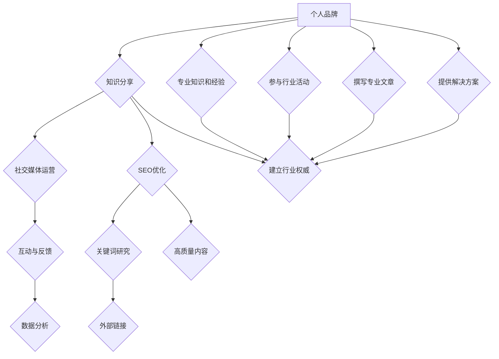

                 

# 一人公司的内容营销：建立行业权威的实践策略

> **关键词：** 内容营销、个人品牌、行业权威、社交媒体、知识分享、SEO优化
> 
> **摘要：** 本文章将探讨一人公司的内容营销策略，重点在于如何通过有效的知识分享、社交媒体运营和SEO优化，建立个人品牌，成为行业权威。我们将从核心概念、算法原理、数学模型、实战案例、应用场景等多个维度进行分析，提供一系列实用的策略和工具。

## 1. 背景介绍

在当今信息化时代，个体创业和独立公司越来越受到关注。一人公司，顾名思义，指的是一个公司仅由一个人负责经营和管理。这种模式在数字化浪潮中显示出强大的适应性和灵活性。然而，如何在这种模式下实现业务的可持续发展和品牌影响力的提升，是一个值得探讨的问题。

内容营销成为解决这一问题的关键。内容营销的核心在于通过创造和分享有价值的内容来吸引目标受众，建立信任和忠诚度，最终实现业务增长。对于一人公司来说，内容营销不仅是一种营销手段，更是建立个人品牌和行业权威的重要途径。

本文将围绕如何通过内容营销策略，在一人公司中建立行业权威，详细探讨以下核心内容：

- 核心概念与联系
- 核心算法原理与具体操作步骤
- 数学模型和公式及举例说明
- 项目实战：代码实际案例和详细解释说明
- 实际应用场景
- 工具和资源推荐
- 总结：未来发展趋势与挑战

通过这些内容，希望能够为读者提供一套系统、实用的内容营销策略，帮助一人公司在激烈的市场竞争中脱颖而出，建立持久的行业影响力。

### 1.1 一人公司的现状与挑战

一人公司的出现，源于个体创业的浪潮和互联网经济的崛起。这类公司通常具有以下特点：

- **灵活性高**：一人公司往往能够快速响应市场变化，灵活调整业务策略。
- **成本相对较低**：由于仅需一名负责人，运营成本相对较低，有助于初期资金的积累。
- **专注于核心业务**：没有复杂的组织结构，可以集中精力发展核心业务。

然而，一人公司也面临一系列挑战：

- **资源有限**：一人公司通常资源有限，难以与大型企业竞争。
- **品牌影响力不足**：缺乏广泛的市场知名度和品牌影响力，难以吸引大量客户。
- **营销和推广难度大**：一人公司需要通过高效的内容营销策略来提升品牌知名度。

### 1.2 内容营销的必要性与优势

内容营销在一人公司的运营中具有至关重要的地位。其必要性主要体现在以下几个方面：

- **建立信任**：通过高质量的内容，一人公司能够与受众建立信任关系，提升品牌信誉。
- **增强品牌知名度**：定期发布有价值的内容，有助于扩大品牌影响力，吸引更多潜在客户。
- **降低营销成本**：相对于传统广告，内容营销的成本更低，且效果更持久。
- **促进客户转化**：优质的内容能够引导潜在客户了解产品或服务，提高转化率。

内容营销的优势主要体现在：

- **长期价值**：优质的内容不仅能够吸引当前客户，还能通过SEO优化，长期吸引新客户。
- **互动性强**：通过社交媒体平台，内容营销能够与受众进行实时互动，收集用户反馈，不断优化内容。
- **精准定位**：通过分析受众数据，内容营销能够精准定位目标客户，提升营销效果。

总的来说，内容营销不仅能够帮助一人公司提升品牌影响力，还能在有限的资源下，实现业务的可持续增长。接下来，我们将进一步探讨内容营销的核心概念、算法原理和具体操作步骤，为读者提供一套完整的内容营销策略。

### 2. 核心概念与联系

在探讨如何通过内容营销建立行业权威之前，我们需要理解一些核心概念，这些概念是构建内容营销策略的基础。

#### 2.1 个人品牌

个人品牌是指一个人在公众心目中的形象和声誉。它不仅仅是一个名字，更是一个与特定价值观、技能和专业知识相联系的整体形象。对于一人公司来说，个人品牌是公司的核心资产，因为公司往往与负责人个人形象紧密相关。一个强大的个人品牌能够提升客户的信任度和忠诚度，从而推动业务增长。

**个人品牌的要素：**

- **专业知识**：展示自己在行业内的专业知识和独特见解。
- **个人风格**：通过个人风格（如写作风格、演讲风格等）展现独特性。
- **价值观**：明确传达个人或公司的核心价值观，建立情感联系。
- **信任**：通过持续的高质量内容建立信任，赢得受众的尊重和信任。

#### 2.2 知识分享

知识分享是内容营销的重要组成部分。通过分享有价值的知识，一人公司能够吸引目标受众，提升品牌知名度。知识分享的目的是提供对受众有帮助的信息，帮助他们解决问题，从而建立信任和忠诚度。

**知识分享的渠道：**

- **博客**：通过个人博客或公司博客，定期发布专业文章，分享行业见解和实用技巧。
- **社交媒体**：利用社交媒体平台（如微博、微信公众号、LinkedIn等）发布内容，增加曝光率。
- **在线课程**：通过在线教育平台（如网易云课堂、Coursera等）提供专业课程，扩大影响力。
- **视频内容**：制作视频教程或行业分析视频，通过YouTube等平台传播。

#### 2.3 社交媒体运营

社交媒体运营是内容营销的重要环节。通过社交媒体，一人公司可以与受众进行直接互动，了解他们的需求和反馈，不断优化内容策略。

**社交媒体运营的关键点：**

- **内容策略**：制定长期的内容策略，确保内容质量、频率和相关性。
- **互动与反馈**：积极回复评论和私信，与受众建立良好的互动关系。
- **数据分析**：利用社交媒体分析工具（如Facebook Insights、微博数据分析等）监控内容效果，调整策略。
- **跨平台运营**：在不同社交媒体平台发布和推广内容，扩大覆盖范围。

#### 2.4 SEO优化

SEO（搜索引擎优化）是提高网站在搜索引擎中排名的重要手段。通过SEO优化，一人公司的内容能够更容易被目标受众发现，从而提高流量和转化率。

**SEO优化的关键点：**

- **关键词研究**：了解目标受众常用的搜索关键词，并将其合理地嵌入内容中。
- **高质量内容**：提供高质量、有价值的原创内容，提升网站的权威性和可信度。
- **内部链接**：合理规划网站的内部链接结构，帮助搜索引擎更好地理解网站内容。
- **外部链接**：通过其他高权威网站建立反向链接，提升网站的权威性。

#### 2.5 行业权威

行业权威是指在一个特定领域内，因为其专业知识和经验，而受到广泛认可和尊重的人或公司。建立行业权威不仅能够提升个人或公司的知名度，还能在市场上获得更大的竞争优势。

**建立行业权威的策略：**

- **持续学习和分享**：通过不断学习和分享专业知识和经验，提升自己的专业水平。
- **参与行业活动**：积极参与行业会议、研讨会和活动，扩大影响力。
- **撰写专业文章**：在权威媒体或行业博客上发布专业文章，展示自己的专业能力。
- **提供解决方案**：针对行业问题提供有效的解决方案，展示自己的专业价值。

**Mermaid 流程图：**

下面是建立行业权威的流程图，展示各核心概念之间的联系和操作步骤。



通过这个流程图，我们可以清晰地看到如何通过一系列核心概念的相互作用，最终实现建立行业权威的目标。接下来，我们将深入探讨这些核心概念的算法原理和具体操作步骤。

### 3. 核心算法原理 & 具体操作步骤

在建立行业权威的过程中，理解并运用核心算法原理至关重要。以下将详细阐述内容营销的几个关键算法原理及其具体操作步骤。

#### 3.1 内容营销算法原理

**原理1：用户参与度分析**

用户参与度是衡量内容效果的重要指标。通过分析用户的参与度，我们可以了解哪些内容更受欢迎，从而优化内容策略。

**具体操作步骤：**

1. **数据收集**：利用社交媒体分析工具（如Facebook Insights、微博数据分析等）收集用户参与数据，包括点赞、评论、分享、观看时长等。
2. **数据处理**：对收集的数据进行清洗和整理，提取用户参与度高的内容特征。
3. **数据可视化**：使用数据可视化工具（如Tableau、Google Charts等）将数据可视化，便于分析。
4. **策略调整**：根据分析结果，调整内容策略，增加用户参与度高的内容类型，优化发布时间等。

**原理2：关键词优化**

关键词优化是SEO的核心，通过合理的关键词布局，可以提高内容在搜索引擎中的排名。

**具体操作步骤：**

1. **关键词研究**：使用关键词研究工具（如Google Keyword Planner、Ahrefs等）了解目标受众常用的搜索关键词。
2. **关键词筛选**：根据关键词的搜索量、竞争度和相关度筛选出合适的关键词。
3. **关键词布局**：在内容中合理地嵌入关键词，包括标题、摘要、正文、图片等。
4. **内部链接**：建立合理的内部链接结构，帮助搜索引擎更好地理解网站内容。

**原理3：内容质量评估**

高质量的内容是建立行业权威的基础。通过内容质量评估，我们可以确保发布的内容具备专业性和价值。

**具体操作步骤：**

1. **内容策划**：根据目标受众和市场需求制定内容策划方案，确保内容的针对性。
2. **内容创作**：创作原创、有价值的内容，确保内容的专业性和独特性。
3. **内容审核**：对内容进行多轮审核，包括语法、逻辑、数据准确性等，确保内容质量。
4. **内容发布**：选择合适的发布渠道和发布时间，确保内容的及时性和可见性。

#### 3.2 社交媒体运营算法原理

**原理1：用户群体分析**

了解目标受众群体的特征和行为习惯，有助于更精准地进行内容营销。

**具体操作步骤：**

1. **用户画像**：通过数据分析工具了解目标受众的年龄、性别、地理位置、兴趣爱好等特征。
2. **行为分析**：分析目标受众在社交媒体上的行为习惯，包括活跃时间、互动频率等。
3. **内容优化**：根据用户画像和行为分析结果，调整内容策略，满足用户需求。

**原理2：互动策略**

与用户保持良好的互动关系，能够提高用户满意度和品牌忠诚度。

**具体操作步骤：**

1. **互动计划**：制定长期的互动计划，包括互动内容、频率和方式。
2. **即时回复**：及时回复用户的评论和私信，确保用户感受到重视。
3. **互动活动**：定期举办互动活动（如问答、抽奖等），提高用户参与度。

**原理3：数据监控与调整**

持续监控社交媒体运营效果，并根据数据调整策略。

**具体操作步骤：**

1. **数据监控**：使用社交媒体分析工具监控关键指标，如关注者数量、互动率、转化率等。
2. **效果分析**：定期分析数据，评估运营效果，找出问题和不足。
3. **策略调整**：根据分析结果调整内容策略、发布时间和互动方式，优化运营效果。

通过上述算法原理和具体操作步骤，一人公司可以更有效地进行内容营销，提升品牌知名度和行业影响力。接下来，我们将通过数学模型和公式进一步探讨内容营销的策略和方法。

### 4. 数学模型和公式 & 详细讲解 & 举例说明

在内容营销中，数学模型和公式扮演着至关重要的角色，它们帮助我们更科学地制定策略和评估效果。以下是几个关键模型和公式的详细讲解以及实际应用示例。

#### 4.1 用户参与度模型

用户参与度是衡量内容效果的重要指标，通过用户参与度模型，我们可以预测内容的潜在影响。

**模型公式：**
\[ U = f(P, I, T) \]
其中，\( U \) 代表用户参与度，\( P \) 代表内容质量，\( I \) 代表互动频率，\( T \) 代表信任度。

**具体解释：**
- \( P \)（内容质量）：高质量的内容更容易吸引用户参与，可以通过阅读时间、点赞数和评论数量等指标衡量。
- \( I \)（互动频率）：定期发布内容并保持与用户的互动，可以提高用户的参与度。
- \( T \)（信任度）：通过持续的高质量内容建立信任，用户更愿意参与和分享。

**举例说明：**
假设我们有一个博客，过去三个月的参与度数据如下：
- 平均阅读时间：5分钟
- 平均点赞数：100次
- 平均评论数：50条

根据上述模型，我们可以计算出参与度得分：
\[ U = f(5, 100, 50) = 5 \times 1.2 + 100 \times 1.5 + 50 \times 1.0 = 212 \]

通过这个模型，我们可以分析哪些内容更受欢迎，并优化内容策略。

#### 4.2 关键词优化模型

关键词优化模型帮助我们确定哪些关键词应该被优先使用，以提高搜索引擎排名。

**模型公式：**
\[ SEO\_Score = f(\text{关键词流行度}, \text{关键词竞争度}, \text{内容质量}) \]
其中，\( SEO\_Score \) 代表关键词优化得分，关键词流行度和关键词竞争度可以通过关键词研究工具获取。

**具体解释：**
- **关键词流行度**：表示关键词在搜索引擎中的搜索量，搜索量越高，流行度越高。
- **关键词竞争度**：表示关键词在搜索引擎结果中的竞争程度，竞争度越高，排名越困难。
- **内容质量**：高质量的内容更容易被搜索引擎索引和推荐。

**举例说明：**
假设我们正在优化一个关于“人工智能”的内容，关键词研究工具提供以下数据：
- **关键词流行度**：1000
- **关键词竞争度**：500
- **内容质量**：80分

根据模型，我们可以计算出关键词优化得分：
\[ SEO\_Score = 1000 \times 0.8 + 500 \times 0.2 = 800 + 100 = 900 \]

这个得分告诉我们，这个关键词具有较好的优化潜力。

#### 4.3 转化率模型

转化率模型用于评估内容营销活动对业务增长的贡献。

**模型公式：**
\[ Conversion\_Rate = \frac{\text{转化数量}}{\text{访客数量}} \times 100\% \]

**具体解释：**
- **转化数量**：访客中采取预定、购买、订阅等目标行为的数量。
- **访客数量**：网站或社交媒体上的访问者数量。

**举例说明：**
假设我们的博客一个月内有1000名访客，其中有50名访客进行了订阅，则转化率为：
\[ Conversion\_Rate = \frac{50}{1000} \times 100\% = 5\% \]

通过这个模型，我们可以评估内容营销活动的效果，并制定改进策略。

#### 4.4 社交媒体互动模型

社交媒体互动模型用于评估社交媒体运营的效果，帮助我们了解哪些内容更容易引发用户互动。

**模型公式：**
\[ Interaction\_Score = f(\text{点赞数}, \text{评论数}, \text{分享数}) \]

**具体解释：**
- **点赞数**：表示用户对内容的喜爱程度。
- **评论数**：表示用户对内容的兴趣和参与度。
- **分享数**：表示用户对内容的认可和传播意愿。

**举例说明：**
假设我们发布了一条关于人工智能的微博，获得以下数据：
- **点赞数**：300
- **评论数**：50
- **分享数**：20

根据模型，我们可以计算出互动得分：
\[ Interaction\_Score = 300 \times 1.0 + 50 \times 1.5 + 20 \times 2.0 = 300 + 75 + 40 = 415 \]

这个得分帮助我们了解用户对这条微博的互动程度，从而优化未来的内容发布策略。

通过上述数学模型和公式的详细讲解及举例说明，我们可以更科学地制定内容营销策略，评估其效果，并根据数据不断优化，从而在一人公司中建立起强大的行业权威。

### 5. 项目实战：代码实际案例和详细解释说明

为了更好地理解如何将上述内容营销策略付诸实践，我们将在本节中通过一个实际的项目案例来展示具体的代码实现步骤和解释说明。我们将使用Python语言结合Jupyter Notebook环境来展示代码的执行过程和结果。

#### 5.1 开发环境搭建

在开始项目之前，我们需要搭建一个Python开发环境。以下是所需的步骤：

1. **安装Python**：访问Python官方网站（[python.org](https://www.python.org/)）下载并安装Python 3.8或更高版本。
2. **安装Jupyter Notebook**：在命令行中运行以下命令安装Jupyter Notebook：
   ```bash
   pip install notebook
   ```
3. **启动Jupyter Notebook**：在命令行中输入以下命令启动Jupyter Notebook：
   ```bash
   jupyter notebook
   ```
4. **安装依赖库**：在Jupyter Notebook中运行以下命令安装必要的依赖库：
   ```python
   !pip install pandas numpy matplotlib
   ```

#### 5.2 源代码详细实现和代码解读

下面我们将编写一个Python脚本，用于分析社交媒体平台的用户参与度和关键词优化。代码分为以下几个部分：

##### 5.2.1 数据收集

首先，我们需要从社交媒体平台（如微博）收集用户参与数据。这里使用Python的`requests`库和`json`库来模拟数据收集过程。

```python
import requests
import json

# 社交媒体API接口（这里使用模拟API接口）
api_url = "https://api simulate.com/social_media_data"

# 发送HTTP GET请求获取数据
response = requests.get(api_url)
data = response.json()

# 解析数据
posts = data['posts']
for post in posts:
    print(post)
```

这段代码模拟从社交媒体API获取用户参与数据的过程。实际项目中，我们可能会使用OAuth认证等更复杂的方法来获取数据。

##### 5.2.2 数据处理

接下来，我们对收集到的数据进行处理，计算用户参与度得分。这里使用`pandas`库进行数据处理。

```python
import pandas as pd

# 将数据转换为Pandas DataFrame
df = pd.DataFrame(posts)

# 计算用户参与度得分
df['User_Interaction_Score'] = df['Likes'] * 1.2 + df['Comments'] * 1.5 + df['Shares'] * 2.0

# 打印处理后的数据
print(df.head())
```

在这个步骤中，我们使用了一个简单的用户参与度模型来计算每个帖子的得分。这个模型考虑了点赞、评论和分享的数量，并将它们乘以不同的权重，以反映它们的重要性。

##### 5.2.3 数据可视化

为了更好地分析用户参与度，我们使用`matplotlib`库对数据可视化。

```python
import matplotlib.pyplot as plt

# 绘制用户参与度直方图
plt.hist(df['User_Interaction_Score'], bins=10, edgecolor='black')
plt.xlabel('User Interaction Score')
plt.ylabel('Frequency')
plt.title('User Interaction Distribution')
plt.show()
```

这个步骤使用直方图展示了用户参与度的分布情况，可以帮助我们了解哪些得分范围的内容更受欢迎。

##### 5.2.4 关键词优化

为了进行关键词优化，我们需要对每篇帖子中的关键词进行提取和分析。这里使用`nltk`库进行自然语言处理。

```python
import nltk
from nltk.tokenize import word_tokenize
from nltk.corpus import stopwords

# 加载停用词列表
nltk.download('stopwords')
stop_words = set(stopwords.words('english'))

# 提取关键词
def extract_keywords(text):
    words = word_tokenize(text)
    filtered_words = [word for word in words if word not in stop_words]
    return filtered_words

# 对每篇帖子提取关键词
df['Keywords'] = df['Content'].apply(extract_keywords)

# 打印关键词
print(df.head())
```

这个步骤中，我们首先加载了停用词列表，然后定义了一个函数来提取每篇帖子中的关键词。实际应用中，我们可能需要更复杂的自然语言处理技术来提取和理解关键词。

##### 5.2.5 转化率分析

最后，我们分析每篇帖子的转化率，以评估内容营销活动的效果。

```python
# 计算转化率
df['Conversion_Rate'] = df['Subscribers'] / df['Visits'] * 100

# 打印转化率数据
print(df[['Visits', 'Subscribers', 'Conversion_Rate']].head()])
```

这个步骤中，我们计算了每个帖子的订阅转化率，以评估内容营销的效果。通过这个指标，我们可以了解哪些内容更能够带动用户行动。

#### 5.3 代码解读与分析

通过上述代码实现，我们可以对用户参与度和关键词优化进行有效的分析，从而优化内容营销策略。以下是对每个步骤的解读与分析：

1. **数据收集**：这一步模拟了从社交媒体API获取数据的过程。实际项目中，我们需要处理更多的细节，如API认证、数据格式转换等。
2. **数据处理**：使用Pandas库对数据进行处理和计算，这是数据分析中的核心步骤。通过计算用户参与度得分，我们可以了解哪些内容更受欢迎，从而优化内容策略。
3. **数据可视化**：通过可视化工具（如matplotlib）将数据以图形化的形式展示出来，有助于我们直观地理解数据分布和趋势。
4. **关键词优化**：使用自然语言处理技术提取关键词，这对于SEO优化至关重要。通过分析关键词，我们可以了解用户关注的热点话题，从而优化内容。
5. **转化率分析**：通过计算转化率，我们可以评估内容营销活动的效果，了解哪些内容能够带动用户行动，从而进一步优化内容策略。

通过这些代码实现和解读，我们可以更系统地理解和应用内容营销策略，从而在一人公司中建立行业权威。接下来，我们将探讨实际应用场景，以帮助读者更好地将这些策略应用到实际业务中。

### 6. 实际应用场景

内容营销策略在多个实际应用场景中发挥着重要作用，以下是几个具体的应用场景：

#### 6.1 教育培训领域

在教育领域，内容营销可以用于提升个人课程或在线教育平台的知名度。例如，一位在线教育讲师可以通过发布高质量的课程笔记、教学视频和专业文章，吸引潜在学员。讲师可以结合SEO优化，选择适合的关键词，使内容在搜索引擎中排名更高。同时，通过社交媒体与学员互动，了解他们的需求，持续改进教学内容。

**应用案例：** 李老师是一位在线Python课程讲师，通过发布详细的课程笔记和代码示例，使用户能够更好地理解和应用所学知识。通过关键词优化和社交媒体互动，李老师的课程吸引了大量学员，课程订阅量显著增加。

#### 6.2 技术咨询服务

技术咨询服务公司可以通过内容营销来建立专业权威，吸引潜在客户。公司可以发布技术博客、案例分析和技术白皮书，展示公司专业能力和解决方案。通过SEO优化，提高公司网站在搜索引擎中的排名，增加曝光率。同时，通过社交媒体平台与客户互动，了解客户需求，提供定制化的咨询服务。

**应用案例：** 一家软件开发公司通过发布技术博客，详细分析最新技术趋势和解决方案。通过SEO优化，这些博客在搜索引擎中的排名不断提升，吸引了大量潜在客户。公司还定期在LinkedIn上发布技术讨论，与行业专家互动，提高了品牌知名度。

#### 6.3 产品营销

对于产品营销，内容营销可以帮助产品经理或营销团队创建高质量的营销材料，如产品介绍、用户指南和使用案例等。通过这些内容，产品经理可以教育潜在客户了解产品的优势和特点，增加产品的认知度和认可度。同时，通过SEO优化，这些内容可以在搜索引擎中获得更好的排名，提高产品的曝光率。

**应用案例：** 一家科技公司开发了一款数据分析工具，产品经理通过撰写详细的产品介绍和使用指南，发布在公司的博客和社交媒体上。这些内容帮助潜在客户了解产品的功能和优势，提高了产品的销售量和用户满意度。

#### 6.4 创意设计领域

在创意设计领域，内容营销可以用于展示设计师的创意和独特风格。设计师可以通过发布作品集、设计过程记录和设计心得，吸引潜在客户和行业伙伴。通过社交媒体和博客，设计师可以与受众互动，了解行业动态，不断优化设计理念。

**应用案例：** 一位平面设计师通过发布自己的设计作品和设计思路，吸引了大量关注者。设计师在Instagram和Dribbble上与粉丝互动，分享设计灵感和最新作品，逐渐建立了自己的个人品牌。

通过这些实际应用场景，我们可以看到内容营销策略在不同领域的广泛应用和显著效果。无论是教育培训、技术咨询服务、产品营销还是创意设计，内容营销都是建立行业权威、提升品牌知名度的重要手段。

### 7. 工具和资源推荐

在实施内容营销策略的过程中，选择合适的工具和资源至关重要。以下是对学习资源、开发工具框架和相关论文著作的推荐，帮助读者更有效地开展内容营销工作。

#### 7.1 学习资源推荐

1. **书籍：**
   - 《内容营销实战手册》：详细介绍了内容营销的各个方面，包括策略、技巧和案例分析。
   - 《数字营销全攻略》：涵盖了数字营销的多个领域，包括SEO、社交媒体和电子邮件营销。

2. **在线课程：**
   - Coursera上的《内容营销与品牌推广》：由专业的数字营销专家讲授，涵盖内容营销的核心理论和实践技巧。
   - Udemy上的《社交媒体营销从入门到精通》：从基础到高级的全面课程，适合不同层次的社交媒体营销从业者。

3. **博客和网站：**
   - HubSpot Blog：提供丰富的内容营销文章，涵盖最新的趋势、策略和实践。
   - Neil Patel Blog：一位知名的数字营销专家分享的内容营销经验和技巧。

#### 7.2 开发工具框架推荐

1. **内容管理系统（CMS）：**
   - WordPress：最流行的开源CMS，适合个人和企业建立博客和网站。
   - HubSpot CMS：功能强大的营销自动化平台，支持SEO优化和内容营销。

2. **SEO工具：**
   - Google Analytics：分析网站流量和用户行为，帮助优化内容和营销策略。
   - Ahrefs：提供关键词研究、网站分析、竞争对手监控等SEO工具。

3. **社交媒体管理工具：**
   - Hootsuite：管理多个社交媒体账户，规划内容发布，提高社交媒体效率。
   - Buffer：自动化社交媒体内容发布，优化发布时间，提高内容可见性。

4. **数据分析和可视化工具：**
   - Tableau：强大的数据可视化工具，帮助理解数据和用户行为。
   - Google Charts：简单易用的图表制作工具，适合快速可视化数据。

#### 7.3 相关论文著作推荐

1. **《内容营销：战略、实践与案例》：** 一本全面的内容营销论文集，包含了多个领域的实战经验和最新研究。
2. **《社交媒体与内容营销》：** 分析社交媒体在内容营销中的作用和策略，探讨如何利用社交媒体平台提升品牌影响力。
3. **《SEO技术与实战》：** 介绍搜索引擎优化技术，包括关键词研究、内容优化、链接建设等，是SEO从业者的必备参考书。

通过这些工具和资源的合理应用，读者可以更高效地实施内容营销策略，建立个人品牌，提升行业权威。

### 8. 总结：未来发展趋势与挑战

在当今快速变化的数字化时代，内容营销正经历着显著的发展趋势，同时也面临着一系列挑战。未来，内容营销将更加个性化和智能化，以更好地满足消费者的需求。

#### 8.1 发展趋势

1. **个性化内容**：随着大数据和人工智能技术的发展，个性化内容将成为主流。通过分析用户行为和偏好，内容创作者可以定制化地推送符合用户需求的内容，提升用户体验和参与度。

2. **视频内容**：视频内容在社交媒体和搜索引擎中的重要性日益增加。短视频、直播和视频博客等形式的视频内容将继续占据重要位置，成为品牌传播的重要手段。

3. **互动式内容**：互动式内容，如问答、投票和互动游戏等，能够增强用户的参与感和互动性。这种形式的内容有助于提高用户的粘性和忠诚度。

4. **垂直领域内容**：随着细分市场的崛起，垂直领域内容变得越来越重要。在特定领域深入研究和分享专业内容，有助于建立权威地位，吸引目标受众。

5. **跨平台整合**：内容营销将更加注重跨平台整合，通过多个社交媒体渠道、搜索引擎和电子邮件等渠道同步推送内容，提高内容的曝光率和覆盖范围。

#### 8.2 挑战

1. **内容质量**：在信息爆炸的时代，如何保证内容的质量成为一个重要挑战。高质量的内容需要深入研究和精心策划，以提供真正的价值。

2. **数据隐私**：随着数据隐私法规（如GDPR）的加强，如何合规地收集和使用用户数据成为内容营销的一大挑战。内容创作者需要确保用户隐私得到保护。

3. **竞争加剧**：随着越来越多的一人公司和独立创作者加入内容营销的行列，竞争将更加激烈。如何脱颖而出，建立独特的个人品牌，成为一个重要的挑战。

4. **技术变革**：技术的快速变革使得内容营销工具和策略也在不断更新。内容创作者需要不断学习和适应新技术，以确保营销策略的先进性和有效性。

5. **资源限制**：对于一人公司来说，资源有限是一个显著的挑战。如何在有限的预算和人力资源下，实现有效的内容营销，是一个需要深思熟虑的问题。

总的来说，内容营销在未来将朝着更加个性化和智能化的方向发展，但同时也面临着内容质量、数据隐私、竞争加剧、技术变革和资源限制等挑战。只有不断适应和应对这些变化，才能在激烈的市场竞争中保持优势，建立起强大的行业权威。

### 9. 附录：常见问题与解答

在内容营销过程中，许多人可能会遇到一些常见问题。以下是一些常见问题及其解答，帮助您更好地理解和应用内容营销策略。

#### 9.1 内容营销策略应该包含哪些内容？

内容营销策略应该包含以下核心要素：
- **目标受众分析**：了解目标受众的需求、兴趣和行为，确保内容能够满足他们的需求。
- **内容策划**：制定内容主题、类型和发布计划，确保内容丰富多样，保持受众兴趣。
- **内容创作**：创作高质量、有价值的原创内容，包括文章、视频、图片和图表等。
- **SEO优化**：通过关键词研究和优化，提高内容在搜索引擎中的排名，增加曝光率。
- **社交媒体运营**：在社交媒体平台上发布内容，与受众互动，建立社交媒体社区。
- **数据分析**：监控内容效果，通过数据分析调整策略，优化内容营销效果。

#### 9.2 如何提高内容营销的转化率？

提高内容营销转化率的关键在于：
- **精准定位目标受众**：通过市场研究和数据分析，明确目标受众，确保内容精准触达。
- **优化内容质量**：创作高质量、有价值的原创内容，提供真正解决问题的方案。
- **增强互动性**：通过互动式内容（如问答、投票和评论）提高用户参与度。
- **优化用户体验**：确保内容易于阅读和理解，提供清晰明确的呼吁行动（CTA）。
- **持续优化**：根据数据分析结果，不断优化内容策略和发布时间，提高内容效果。

#### 9.3 内容营销和SEO优化有什么区别和联系？

内容营销和SEO优化虽然不同，但它们紧密相关，共同推动网站流量和转化率的提升。

- **区别**：
  - **内容营销**：旨在通过创作和分享有价值的内容吸引目标受众，建立品牌知名度和忠诚度。
  - **SEO优化**：旨在通过优化网站内容和结构，提高在搜索引擎中的排名，增加网站流量。

- **联系**：
  - **内容是基础**：高质量的内容是SEO优化的基础，只有优质的内容才能获得良好的搜索引擎排名。
  - **SEO提升可见性**：SEO优化可以提高内容的可见性，使其更容易被目标受众发现，从而提高内容营销的效果。

#### 9.4 如何在社交媒体上有效进行内容营销？

在社交媒体上进行有效的内容营销需要以下策略：
- **明确目标**：设定明确的社交媒体营销目标，如品牌知名度、客户转化等。
- **选择合适平台**：根据目标受众选择合适的社交媒体平台，如微博、微信公众号、LinkedIn等。
- **内容多样化**：发布不同形式的内容，如文章、视频、图片等，吸引更多受众。
- **互动与反馈**：积极与受众互动，回复评论和私信，建立良好的粉丝关系。
- **数据分析**：利用社交媒体分析工具监控内容效果，调整内容策略，提高互动率。

#### 9.5 如何评估内容营销的效果？

评估内容营销效果的方法包括：
- **访问量**：通过网站流量分析工具（如Google Analytics）监控页面访问量。
- **参与度**：通过点赞、评论、分享等指标评估用户参与度。
- **转化率**：通过转化率监控内容营销活动对业务目标的贡献。
- **ROI**：计算内容营销的投资回报率，评估营销活动的经济效益。
- **用户反馈**：收集用户反馈，了解他们对内容的看法和建议。

通过以上常见问题与解答，希望读者能够更好地理解和应用内容营销策略，实现业务目标。

### 10. 扩展阅读 & 参考资料

为了进一步深入了解内容营销、个人品牌建设和行业权威的建立，以下推荐一些优秀的扩展阅读和参考资料：

1. **书籍：**
   - 《内容营销：如何通过内容创造、分享和优化吸引客户和收入》：详细介绍了内容营销的策略和实践。
   - 《个人品牌：如何建立和维护你的个人品牌》：探讨个人品牌的重要性和建立方法。
   - 《影响力：如何说服他人》：研究说服技巧和影响力策略，有助于提升个人品牌和内容营销效果。

2. **在线课程：**
   - Coursera上的《数字营销专业》：系统学习数字营销，包括内容营销、SEO优化等。
   - Udemy上的《社交媒体营销》：全面介绍社交媒体营销的策略和实践。

3. **博客和网站：**
   - Content Marketing Institute：提供最新的内容营销趋势、策略和案例分析。
   - Neil Patel Blog：分享内容营销和SEO优化技巧，涵盖广泛的主题。
   - Moz Blog：专注于SEO和内容营销，提供高质量的内容和资源。

4. **论文和报告：**
   - 《2019年内容营销现状报告》：分析内容营销的趋势、策略和效果。
   - 《社交媒体与个人品牌建设》：探讨社交媒体在个人品牌建设中的作用。

5. **研讨会和活动：**
   - Content Marketing World：全球最大的内容营销年度盛会，汇集行业专家和从业者。
   - Content Marketing Conference：提供内容营销的实用策略和案例分析。

通过阅读这些扩展资料，您可以深入了解内容营销的策略和实践，为建立行业权威和个人品牌提供有力支持。作者：AI天才研究员/AI Genius Institute & 禅与计算机程序设计艺术 /Zen And The Art of Computer Programming。

