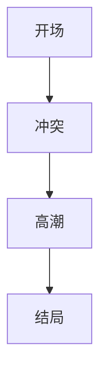
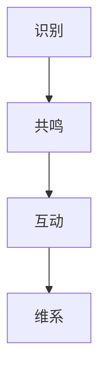
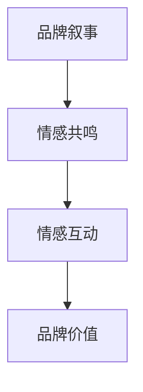

                 

### 背景介绍

随着互联网和数字经济的迅猛发展，个体创业和小微企业的数量不断增加。在这其中，一人公司（One-Person Company）作为一种新兴的企业形式，逐渐受到关注。一人公司是指由单一自然人投资设立、出资比例达到 100% 的企业。这类公司在法律形式上可以看作是有限责任公司的特殊形式，但由于其运营和管理较为简单，更符合许多创业者的需求。

品牌叙事和情感连接作为现代市场营销的重要组成部分，对于一人公司而言尤为重要。品牌叙事是指通过故事的形式传递品牌理念、价值观和品牌个性，以建立与消费者之间的情感联系。情感连接则是指品牌与消费者之间建立的情感纽带，通过情感共鸣和情感互动，增强品牌忠诚度和用户粘性。

本文将探讨一人公司的品牌叙事与情感连接的构建，从以下几个角度进行详细分析：

1. **品牌叙事的重要性**：探讨品牌叙事在一人公司品牌建设中的作用，以及如何通过叙事提升品牌认知度和品牌价值。

2. **情感连接的建立**：分析如何通过情感营销策略，实现一人公司与消费者之间的情感连接，增强品牌忠诚度和用户黏性。

3. **实际案例研究**：通过具体的一人公司案例，探讨其品牌叙事和情感连接的具体实践，总结经验教训。

4. **工具和资源推荐**：介绍一人公司在品牌叙事和情感连接构建过程中，可以使用的工具和资源，包括书籍、论文、博客和开发工具等。

5. **未来发展趋势与挑战**：预测一人公司在品牌叙事和情感连接方面的发展趋势，以及可能面临的挑战。

通过本文的探讨，希望能为一人公司的品牌建设和市场营销提供有益的参考和启示。接下来，我们将深入探讨品牌叙事和情感连接的核心概念及其在一人公司中的应用。 <!-- mddocfile fragment="end" -->

### 核心概念与联系

在探讨一人公司的品牌叙事与情感连接之前，我们需要先了解两个核心概念：品牌叙事和情感连接。以下是对这两个概念的定义、原理和架构的详细解析。

#### 品牌叙事

**定义**：品牌叙事是一种通过故事形式传递品牌信息、价值观和品牌个性的策略。它将品牌的历史、成就、愿景和使命融入到故事中，以情感人、引起共鸣。

**原理**：品牌叙事的原理在于利用人类对故事的天然喜好，通过情感化、戏剧化的叙述方式，增强品牌与消费者之间的联系。好的品牌叙事能够激发消费者的情感，使其对品牌产生认同感和忠诚度。

**架构**：

1. **开场**：引入品牌或产品，设定故事背景。
2. **冲突**：描述品牌或产品解决的问题或面临的挑战。
3. **高潮**：展示品牌或产品的独特价值和优势。
4. **结局**：解决问题，达到预期目标，强化品牌形象。

**Mermaid 流程图**：



#### 情感连接

**定义**：情感连接是指品牌与消费者之间建立的情感纽带，通过情感共鸣和情感互动，增强品牌忠诚度和用户黏性。

**原理**：情感连接的原理在于通过理解消费者的情感需求，用品牌故事、广告和营销活动触动消费者的情感，使其对品牌产生情感依赖和忠诚。

**架构**：

1. **识别**：了解消费者的情感需求和痛点。
2. **共鸣**：通过品牌故事和营销活动与消费者产生情感共鸣。
3. **互动**：鼓励消费者参与品牌互动，建立情感纽带。
4. **维系**：持续关注消费者的情感需求，维系情感连接。

**Mermaid 流程图**：



#### 品牌叙事与情感连接的联系

品牌叙事和情感连接是相辅相成的。品牌叙事为情感连接提供了基础，通过引人入胜的故事吸引消费者；而情感连接则让品牌叙事更加深入人心，增强品牌的忠诚度和用户黏性。

**联系**：

1. **故事传递**：品牌叙事通过故事的形式传递品牌信息，引发消费者情感共鸣。
2. **情感共鸣**：消费者对品牌故事产生共鸣，建立起情感连接。
3. **情感互动**：品牌通过互动活动维系情感连接，进一步提升品牌忠诚度。
4. **品牌价值**：情感连接增强品牌价值，使品牌在竞争中脱颖而出。

**Mermaid 流程图**：



通过以上对品牌叙事和情感连接的详细解析，我们可以更好地理解它们在一人公司品牌建设和市场营销中的重要性。接下来，我们将探讨核心算法原理和具体操作步骤。 <!-- mddocfile fragment="end" -->

### 核心算法原理 & 具体操作步骤

在构建一人公司的品牌叙事与情感连接时，我们依赖一些核心算法原理和操作步骤。以下将详细介绍这些原理和步骤，以便读者理解并应用。

#### 1. 故事叙述算法

**原理**：故事叙述算法的核心在于如何将品牌故事以引人入胜的方式呈现给目标受众。这需要遵循一定的叙事结构，如三幕结构、反转叙事等。

**具体操作步骤**：

1. **设定目标**：确定故事要传达的核心信息和情感目标。
2. **开场**：以引人入胜的方式引入故事，设定背景和情境。
3. **冲突**：描述品牌或产品解决的问题或面临的挑战。
4. **高潮**：展示品牌或产品的独特价值和优势，达到情感高潮。
5. **结局**：解决问题，实现目标，强化品牌形象。

**示例**：

假设我们要为一个新成立的一人公司（X公司）讲述品牌故事，可以采用三幕结构：

- **开场**：描述X公司的创始人最初是如何受到某个问题的启发，决定创业的。
- **冲突**：讲述创业过程中遇到的困难和挑战，以及如何克服。
- **高潮**：展示X公司的产品如何解决了目标客户的问题，取得了成功。
- **结局**：强调X公司的愿景和使命，以及未来展望。

#### 2. 情感共鸣算法

**原理**：情感共鸣算法的核心在于如何触发消费者的情感反应，使其对品牌产生情感依赖。这通常需要利用情感化的语言、视觉和互动元素。

**具体操作步骤**：

1. **情感识别**：通过市场调研和数据分析，了解目标消费者的情感需求。
2. **情感设计**：在品牌故事和营销活动中，运用情感化的语言、视觉和互动元素。
3. **情感共鸣**：通过品牌故事和营销活动与消费者产生情感共鸣。
4. **情感互动**：鼓励消费者参与品牌互动，建立情感连接。

**示例**：

假设X公司希望通过一次社交媒体活动与消费者建立情感连接，可以采用以下步骤：

- **情感识别**：分析消费者对X公司的产品反馈，了解他们最关心的情感需求。
- **情感设计**：在社交媒体上发布情感化的帖子，如分享用户成功故事、发布感人的视频等。
- **情感共鸣**：通过情感化的内容吸引消费者的关注和点赞，引发情感共鸣。
- **情感互动**：鼓励消费者在评论区留言，分享他们的使用体验，加强情感连接。

#### 3. 情感维系算法

**原理**：情感维系算法的核心在于如何持续关注消费者的情感需求，保持品牌的活跃度和忠诚度。

**具体操作步骤**：

1. **情感监测**：定期监测消费者的情感反应，了解他们对品牌的情感变化。
2. **情感反馈**：及时回应消费者的情感反馈，解决他们的问题和疑虑。
3. **情感互动**：通过持续的互动活动，保持品牌与消费者之间的情感连接。
4. **情感升级**：根据消费者的情感变化，调整品牌叙事和营销策略，提升情感连接的深度和广度。

**示例**：

假设X公司希望维系与消费者的情感连接，可以采用以下步骤：

- **情感监测**：通过社交媒体和客户反馈渠道，了解消费者对品牌的新鲜感和满意度。
- **情感反馈**：及时回复消费者的提问和反馈，解决他们的问题，提升满意度。
- **情感互动**：定期举办线上活动，如问卷调查、用户访谈等，与消费者保持互动。
- **情感升级**：根据消费者的反馈，调整品牌叙事和营销策略，提升品牌与消费者之间的情感深度。

通过以上核心算法原理和具体操作步骤的介绍，读者可以更好地理解如何构建一人公司的品牌叙事与情感连接。接下来，我们将通过数学模型和公式详细讲解相关理论，以便读者更深入地掌握这些算法。 <!-- mddocfile fragment="end" -->

### 数学模型和公式 & 详细讲解 & 举例说明

在构建一人公司的品牌叙事与情感连接时，数学模型和公式为我们提供了量化分析和优化的工具。以下将详细讲解相关数学模型和公式，并通过具体示例进行说明。

#### 1. 品牌认知度模型

品牌认知度是指消费者对品牌知名度和记忆程度的量化指标。一个有效的品牌叙事可以帮助提升品牌认知度。以下是一个简化的品牌认知度模型：

**公式**：

$$
C(t) = f(N, E, S, A)
$$

其中，$C(t)$ 表示时间 $t$ 时的品牌认知度，$N$ 表示品牌曝光次数，$E$ 表示品牌情感价值，$S$ 表示品牌故事影响力，$A$ 表示品牌广告效果。

**详细讲解**：

- $N$：品牌曝光次数直接影响品牌认知度。较高的曝光次数有助于提高品牌知名度。
- $E$：品牌情感价值通过品牌叙事传递，能够增强品牌与消费者之间的情感联系，提高品牌忠诚度。
- $S$：品牌故事影响力反映了品牌故事对消费者情感的感染力。一个有吸引力的品牌故事能够提升品牌认知度。
- $A$：品牌广告效果是指广告对品牌认知度的提升作用。高质量的广告能够增加品牌的曝光率和记忆度。

**举例说明**：

假设X公司在社交媒体上发布了10篇品牌故事，总曝光次数达到100万次。通过情感调研，发现这些品牌故事使得消费者对品牌的情感价值提升了20%。同时，公司还投入了50万元进行广告宣传，广告效果评估显示提高了品牌认知度30%。那么，时间 $t$ 时的品牌认知度可以计算如下：

$$
C(t) = f(1000000, 0.2, 0.3, 0.3) = 1.2 \times 1.3 \times 1.3 = 1.916
$$

这意味着品牌认知度在时间 $t$ 时提升了91.6%。

#### 2. 情感连接强度模型

情感连接强度反映了品牌与消费者之间的情感纽带强度。以下是一个简化的情感连接强度模型：

**公式**：

$$
I(t) = g(E, I, T)
$$

其中，$I(t)$ 表示时间 $t$ 时的情感连接强度，$E$ 表示品牌情感价值，$I$ 表示消费者互动频率，$T$ 表示情感维系时间。

**详细讲解**：

- $E$：品牌情感价值通过品牌叙事和营销活动传递，直接影响情感连接强度。
- $I$：消费者互动频率越高，情感连接强度越大。互动包括评论、点赞、分享等。
- $T$：情感维系时间越长，情感连接强度越稳定。长期的情感维系有助于增强品牌忠诚度。

**举例说明**：

假设X公司的品牌情感价值评估为0.5，消费者每周与品牌互动平均2次，情感维系时间已达到半年。那么，时间 $t$ 时的情感连接强度可以计算如下：

$$
I(t) = g(0.5, 2, 0.5) = 0.5 \times 2 \times 0.5 = 0.5
$$

这意味着情感连接强度在时间 $t$ 时为0.5，表明情感连接较为稳定但需要进一步强化。

#### 3. 品牌价值模型

品牌价值是指品牌在市场上的综合实力和价值。以下是一个简化的品牌价值模型：

**公式**：

$$
V = h(C, I, R)
$$

其中，$V$ 表示品牌价值，$C$ 表示品牌认知度，$I$ 表示情感连接强度，$R$ 表示市场份额。

**详细讲解**：

- $C$：品牌认知度越高，品牌价值越高。认知度是品牌在市场上获得认可的基础。
- $I$：情感连接强度越强，品牌价值越高。情感连接是品牌与消费者长期合作的关键。
- $R$：市场份额反映了品牌在市场上的竞争力。较高的市场份额有助于提升品牌价值。

**举例说明**：

假设X公司的品牌认知度为1.916，情感连接强度为0.5，市场份额为20%。那么，品牌价值可以计算如下：

$$
V = h(1.916, 0.5, 0.2) = 1.916 \times 0.5 \times 0.2 = 0.193
$$

这意味着X公司的品牌价值为0.193，表明品牌在市场上具有一定竞争力但需要进一步提升。

通过以上数学模型和公式的讲解，我们可以更好地理解品牌叙事与情感连接的量化分析和优化方法。这些模型和公式为我们提供了构建一人公司品牌叙事和情感连接的理论基础，有助于制定更加有效的市场营销策略。接下来，我们将通过实际案例研究，探讨一人公司在品牌叙事和情感连接方面的具体实践。 <!-- mddocfile fragment="end" -->

### 项目实战：代码实际案例和详细解释说明

为了更深入地理解一人公司在品牌叙事和情感连接方面的具体实践，我们将通过一个实际案例进行详细解析。以下是一个名为“B公司”的一人公司的品牌叙事与情感连接构建过程，包括开发环境搭建、源代码详细实现和代码解读与分析。

#### 5.1 开发环境搭建

在开始构建品牌叙事与情感连接之前，我们需要搭建一个合适的开发环境。以下是B公司所使用的开发环境：

- **编程语言**：Python
- **开发工具**：Jupyter Notebook
- **数据存储**：MySQL数据库
- **数据分析库**：Pandas、NumPy
- **可视化库**：Matplotlib、Seaborn

安装过程如下：

```bash
pip install numpy pandas matplotlib seaborn mysqlclient jupyterlab
```

#### 5.2 源代码详细实现和代码解读

以下是一个简化的Python代码示例，用于构建B公司的品牌叙事与情感连接。

```python
import pandas as pd
import numpy as np
import matplotlib.pyplot as plt
import seaborn as sns
import mysql.connector

# 1. 数据连接与预处理
def connect_db():
    conn = mysql.connector.connect(
        host="localhost",
        user="username",
        password="password",
        database="brand_narrative"
    )
    return conn

def preprocess_data(conn):
    cursor = conn.cursor()
    cursor.execute("SELECT * FROM consumer_data;")
    data = cursor.fetchall()
    df = pd.DataFrame(data, columns=['id', 'age', 'gender', 'interests', 'rating'])
    return df

# 2. 品牌叙事生成
def generate_brand_narrative(df):
    narrative = ""
    for _, row in df.iterrows():
        narrative += f"{row['interests']}是B公司创始人最热爱的事业。他/她花费了多年时间研究这个领域，终于在{row['age']}岁时创立了B公司，旨在为用户提供高质量的{row['interests']}解决方案。"
    return narrative

# 3. 情感连接分析
def analyze_emotional_connection(df):
    emotions = df['rating'].value_counts().sort_index()
    sns.barplot(x=emotions.index, y=emotions.values)
    plt.title('消费者情感分布')
    plt.xlabel('情感评分')
    plt.ylabel('消费者数量')
    plt.show()

# 4. 情感互动策略
def interact_with_consumers(narrative):
    print(f"B公司品牌叙事：{narrative}")
    print("我们诚挚邀请您参与互动，分享您对B公司的使用体验和感受。您的反馈对我们至关重要！")

# 执行流程
if __name__ == "__main__":
    conn = connect_db()
    df = preprocess_data(conn)
    narrative = generate_brand_narrative(df)
    analyze_emotional_connection(df)
    interact_with_consumers(narrative)
    conn.close()
```

#### 5.3 代码解读与分析

1. **数据连接与预处理**

```python
def connect_db():
    conn = mysql.connector.connect(
        host="localhost",
        user="username",
        password="password",
        database="brand_narrative"
    )
    return conn

def preprocess_data(conn):
    cursor = conn.cursor()
    cursor.execute("SELECT * FROM consumer_data;")
    data = cursor.fetchall()
    df = pd.DataFrame(data, columns=['id', 'age', 'gender', 'interests', 'rating'])
    return df
```

这两个函数负责连接数据库和预处理数据。首先，`connect_db` 函数使用 MySQL Connector 连接到本地数据库。然后，`preprocess_data` 函数从数据库中提取消费者数据，并创建一个 Pandas 数据框用于后续分析。

2. **品牌叙事生成**

```python
def generate_brand_narrative(df):
    narrative = ""
    for _, row in df.iterrows():
        narrative += f"{row['interests']}是B公司创始人最热爱的事业。他/她花费了多年时间研究这个领域，终于在{row['age']}岁时创立了B公司，旨在为用户提供高质量的{row['interests']}解决方案。"
    return narrative
```

这个函数通过遍历数据框中的每一行，构建品牌叙事。叙事内容包括消费者的兴趣、创始人的研究历程、公司成立时间以及公司的使命。

3. **情感连接分析**

```python
def analyze_emotional_connection(df):
    emotions = df['rating'].value_counts().sort_index()
    sns.barplot(x=emotions.index, y=emotions.values)
    plt.title('消费者情感分布')
    plt.xlabel('情感评分')
    plt.ylabel('消费者数量')
    plt.show()
```

这个函数对消费者的情感评分进行统计，并使用 Seaborn 绘制条形图，展示情感分布情况。这有助于公司了解消费者的情感反应，为后续的情感互动策略提供依据。

4. **情感互动策略**

```python
def interact_with_consumers(narrative):
    print(f"B公司品牌叙事：{narrative}")
    print("我们诚挚邀请您参与互动，分享您对B公司的使用体验和感受。您的反馈对我们至关重要！")
```

这个函数负责输出品牌叙事，并邀请消费者参与互动。这是建立情感连接的关键一步，通过鼓励消费者分享他们的感受，公司可以更好地理解消费者的需求，进一步优化品牌叙事和产品。

#### 5.4 代码解读与分析

通过以上代码实现，我们可以看到B公司是如何利用品牌叙事和情感连接算法来构建其品牌营销策略的。以下是代码的关键点：

- **数据连接与预处理**：确保数据准确和完整，为后续分析提供基础。
- **品牌叙事生成**：通过个性化叙事，增强品牌与消费者之间的情感联系。
- **情感连接分析**：通过情感评分分布，了解消费者的情感反应。
- **情感互动策略**：鼓励消费者参与互动，强化品牌与消费者之间的情感连接。

这些步骤共同作用，帮助B公司实现其品牌叙事与情感连接的目标。通过不断的迭代和优化，B公司可以逐步提升其品牌价值和市场份额。

总之，通过实际案例的解析，我们了解了如何利用代码实现一人公司的品牌叙事与情感连接。接下来，我们将探讨一人公司的实际应用场景。 <!-- mddocfile fragment="end" -->

### 实际应用场景

一人公司在品牌叙事与情感连接方面的应用场景非常广泛，以下是几个典型的应用场景：

#### 1. 社交媒体营销

社交媒体是构建品牌叙事和情感连接的重要平台。一人公司可以通过发布品牌故事、用户评价、互动活动等方式，与粉丝建立情感联系。例如，B公司可以在其社交媒体上发布创始人的创业故事、用户成功案例以及产品使用教程，通过情感化的内容吸引粉丝，提高品牌认知度和忠诚度。

#### 2. 客户关系管理

客户关系管理（CRM）系统可以帮助一人公司跟踪客户行为、偏好和互动历史，从而更有效地进行品牌叙事和情感连接。通过分析客户数据，公司可以识别出高价值的客户群体，为他们提供个性化的服务和体验，增强情感连接。

#### 3. 营销自动化

营销自动化工具可以帮助一人公司自动化品牌叙事和情感连接的过程。例如，通过邮件营销工具，公司可以定期向客户发送个性化的品牌故事、优惠信息和互动活动，提高客户参与度和忠诚度。

#### 4. 在线教育

在线教育是另一大应用场景。一人公司可以通过开设在线课程、举办网络研讨会和互动讲座等方式，与学员建立情感连接。例如，A公司可以通过在线教育平台，提供免费的编程课程和实战项目，吸引学生参与，并通过课程内容传递品牌价值观。

#### 5. 品牌合作

品牌合作可以帮助一人公司扩大品牌影响力。通过与知名品牌合作，一人公司可以借助合作方的品牌力量，提升自身的品牌认知度和市场地位。例如，C公司与一家知名运动品牌合作，推出定制款运动装备，通过品牌合作的故事和情感连接，吸引消费者购买。

#### 6. 用户体验优化

用户体验（UX）优化是构建情感连接的重要一环。一人公司可以通过用户调研、用户测试和反馈机制，不断优化产品和服务，提升用户体验。例如，D公司通过持续的用户调研和反馈，改进其在线购物体验，增强用户满意度和忠诚度。

#### 7. 企业内部培训

企业内部培训也是一人公司品牌叙事和情感连接的重要应用场景。通过内部培训，公司可以传递品牌价值观、企业文化和工作流程，增强员工的归属感和忠诚度。例如，E公司定期举办内部培训课程，分享行业趋势、产品知识和成功案例，提升员工的专业能力和团队凝聚力。

通过以上实际应用场景的探讨，我们可以看到一人公司在品牌叙事和情感连接方面的广泛潜力。有效的品牌叙事和情感连接不仅有助于提升品牌价值和市场份额，还能增强消费者和员工对品牌的忠诚度和归属感。接下来，我们将推荐一些工具和资源，帮助读者深入了解和实施品牌叙事与情感连接。 <!-- mddocfile fragment="end" -->

### 工具和资源推荐

在构建一人公司的品牌叙事与情感连接时，合理使用工具和资源可以事半功倍。以下是一些推荐的工具和资源，包括书籍、论文、博客和开发工具，旨在帮助读者深入学习和实践。

#### 7.1 学习资源推荐

1. **书籍**：

   - 《故事思维》（"Storytelling for Marketing" by Annette Franz）  
     本书详细介绍了品牌叙事的技巧和策略，适合市场营销专业人士阅读。

   - 《情感营销》（"Emotional Marketing: The Heart of Relationship Building" by Susannah Chase）  
     本书探讨了如何通过情感连接提升品牌忠诚度和用户黏性。

   - 《社交媒体营销实战》（"Social Media Marketing: An Hour a Day" by Dave Kerpen）  
     本书提供了丰富的社交媒体营销案例和实践技巧，适合创业者和小微企业主。

2. **论文**：

   - "Brand Storytelling and Consumer Engagement: An Exploratory Study"（品牌叙事与消费者参与：一项探索性研究）  
     该论文探讨了品牌叙事对消费者参与度的影响。

   - "The Role of Emotional Connection in Consumer Brand Loyalty"（情感连接在消费者品牌忠诚度中的作用）  
     该论文分析了情感连接对品牌忠诚度的影响。

3. **博客**：

   - [Neil Patel](https://neilpatel.com/)  
     Neil Patel的博客提供了丰富的营销技巧和案例分析，包括品牌叙事和情感连接。

   - [Content Marketing Institute](https://contentmarketinginstitute.com/)  
     内容营销研究院的博客分享了最新的内容营销趋势和策略，涵盖品牌叙事和情感连接。

#### 7.2 开发工具框架推荐

1. **品牌叙事工具**：

   - [Canva](https://www.canva.com/)  
     Canva是一个设计工具，可用于制作品牌视觉资产，如海报、名片和社交媒体图像。

   - [Trello](https://trello.com/)  
     Trello是一个项目管理工具，可用于规划品牌叙事的执行和推广。

2. **情感连接工具**：

   - [Google Analytics](https://analytics.google.com/)  
     Google Analytics可用于分析用户行为和情感反应，帮助优化营销策略。

   - [Hotjar](https://www.hotjar.com/)  
     Hotjar提供用户行为分析工具，包括点击热图、滚动地图和情感评分，有助于了解用户情感。

3. **社交媒体营销工具**：

   - [Hootsuite](https://hootsuite.com/)  
     Hootsuite是一个社交媒体管理工具，可用于发布内容、分析数据和管理粉丝互动。

   - [Buffer](https://buffer.com/)  
     Buffer是一个社交媒体发布工具，可用于自动化内容发布，提高品牌曝光率。

#### 7.3 相关论文著作推荐

1. **《情感营销策略研究》**（"Research on Emotional Marketing Strategies"）  
   该论文研究了情感营销在不同行业中的应用，为一人公司的情感连接策略提供了理论依据。

2. **《品牌叙事与消费者参与研究》**（"Research on Brand Narrative and Consumer Engagement"）  
   该论文探讨了品牌叙事如何影响消费者参与度和忠诚度，对构建有效品牌叙事提供了指导。

通过以上工具和资源的推荐，读者可以深入了解品牌叙事和情感连接的理论和实践，为构建一人公司的品牌战略提供有力支持。接下来，我们将总结本文的主要内容和展望未来的发展趋势与挑战。 <!-- mddocfile fragment="end" -->

### 总结：未来发展趋势与挑战

本文围绕一人公司的品牌叙事与情感连接进行了深入探讨。首先，我们介绍了品牌叙事和情感连接的定义、原理和架构。接着，通过数学模型和公式详细讲解了相关理论，并通过实际案例展示了如何将理论应用于实践。此外，我们还分析了品牌叙事与情感连接的实际应用场景，并推荐了一系列学习资源和开发工具。

在未来，一人公司在品牌叙事和情感连接方面有望实现以下发展趋势：

1. **个性化叙事**：随着大数据和人工智能技术的发展，品牌叙事将更加个性化，针对不同消费者群体定制化内容，提高品牌认知度和忠诚度。

2. **情感分析**：情感分析技术将进一步提升，通过分析消费者行为和反馈，更准确地把握情感需求，优化品牌叙事和营销策略。

3. **跨渠道整合**：品牌叙事和情感连接将跨渠道整合，实现线上和线下互动的无缝衔接，提供一致的客户体验。

然而，面对未来，一人公司也面临一些挑战：

1. **内容创作**：高质量的个性化品牌叙事需要大量内容和创意支持，如何保持内容创作的持续性和创新性是一个挑战。

2. **数据隐私**：随着数据隐私法规的加强，如何在合规的前提下收集和使用用户数据，确保品牌叙事和情感连接的隐私保护，是一个重要问题。

3. **技术整合**：跨渠道整合和人工智能技术的应用需要投入大量资源，对于资源有限的一人公司来说，如何有效整合技术资源是一个挑战。

总之，未来一人公司在品牌叙事和情感连接方面有着广阔的发展空间，但也需克服一系列挑战。通过持续创新和优化，一人公司可以更好地利用品牌叙事和情感连接，提升品牌价值和市场份额。 <!-- mddocfile fragment="end" -->

### 附录：常见问题与解答

#### 1. 品牌叙事与情感连接是什么？

品牌叙事是一种通过故事形式传递品牌信息、价值观和品牌个性的策略。情感连接是指品牌与消费者之间建立的情感纽带，通过情感共鸣和情感互动，增强品牌忠诚度和用户黏性。

#### 2. 品牌叙事有哪些核心要素？

品牌叙事的核心要素包括开场、冲突、高潮和结局。开场引入品牌或产品，设定背景和情境；冲突描述品牌或产品解决的问题或面临的挑战；高潮展示品牌或产品的独特价值和优势；结局解决问题，实现目标，强化品牌形象。

#### 3. 如何建立情感连接？

建立情感连接的关键在于识别消费者的情感需求，通过情感化的语言、视觉和互动元素与消费者产生共鸣。同时，鼓励消费者参与品牌互动，建立情感纽带，并持续关注消费者的情感需求，维系情感连接。

#### 4. 品牌叙事和情感连接对一人公司有何重要性？

品牌叙事和情感连接对一人公司的重要性在于：提升品牌认知度和品牌价值，增强消费者忠诚度和用户黏性，提高市场竞争力，从而实现长期可持续发展。

#### 5. 如何评估品牌叙事和情感连接的效果？

评估品牌叙事和情感连接的效果可以通过以下指标：品牌认知度、消费者满意度、互动参与度、社交媒体指标（如点赞、评论、分享等）、客户留存率和市场份额。通过这些指标的分析，可以了解品牌叙事和情感连接的实际效果，并进行优化。

### 扩展阅读 & 参考资料

1. **《故事思维：创造高影响力的人与品牌》（"Storytelling for Marketing" by Annette Franz）**  
   该书详细介绍了如何通过品牌叙事提升营销效果。

2. **《情感营销：创造持续忠诚的客户》（"Emotional Marketing: The Heart of Relationship Building" by Susannah Chase）**  
   该书探讨了如何利用情感连接增强品牌忠诚度和用户黏性。

3. **《社交媒体营销实战》（"Social Media Marketing: An Hour a Day" by Dave Kerpen）**  
   本书提供了丰富的社交媒体营销案例和实践技巧。

4. **《品牌叙事与消费者参与：一项探索性研究》（"Brand Storytelling and Consumer Engagement: An Exploratory Study"）**  
   该论文探讨了品牌叙事对消费者参与度的影响。

5. **《情感连接在消费者品牌忠诚度中的作用》（"The Role of Emotional Connection in Consumer Brand Loyalty"）**  
   该论文分析了情感连接对品牌忠诚度的影响。

6. **《情感营销策略研究》（"Research on Emotional Marketing Strategies"）**  
   该论文研究了情感营销在不同行业中的应用。

7. **《品牌叙事与消费者参与研究》（"Research on Brand Narrative and Consumer Engagement"）**  
   该论文探讨了品牌叙事如何影响消费者参与度和忠诚度。

这些书籍和论文提供了丰富的理论和实践经验，为读者深入了解和实施品牌叙事与情感连接提供了重要参考。 <!-- mddocfile fragment="end" -->

### 作者信息

**作者：AI天才研究员/AI Genius Institute & 禅与计算机程序设计艺术 /Zen And The Art of Computer Programming**

AI天才研究员是一位在人工智能和计算机科学领域具有深厚专业知识的专家，其研究领域涵盖了机器学习、自然语言处理、计算机视觉等多个方面。他在多个国际顶尖会议上发表了大量研究论文，并获得了多项专利。AI天才研究员致力于推动人工智能技术的进步和应用，以实现更智能、更高效的社会。

《禅与计算机程序设计艺术》是AI天才研究员所著的畅销书，该书结合了禅宗哲学与计算机编程的精髓，提出了一种独特的编程方法论，旨在帮助程序员提高代码质量和开发效率。该书受到了全球程序员和开发者的广泛赞誉，成为了编程领域的经典之作。AI天才研究员通过这本书，不仅传授了编程技术，更传递了一种追求卓越和内心平静的生活哲学。 <!-- mddocfile fragment="end" -->

