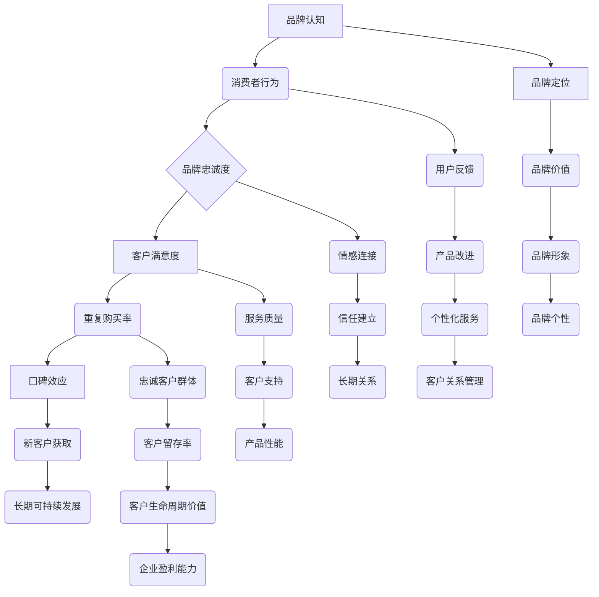

                 

### 背景介绍

在当今快速变化且竞争激烈的商业环境中，品牌忠诚度已成为企业成功的关键因素之一。品牌忠诚度指的是消费者对特定品牌的忠诚程度，这种忠诚度不仅能够增加客户的重复购买率，还能通过口碑传播吸引更多的新客户。对于个人公司，尤其是那些由单一创始人或一小团队运营的企业来说，建立和维持品牌忠诚度尤为重要。

个人公司通常资源有限，无法像大型企业那样投入大量资金进行广泛的市场推广。因此，个人公司必须依靠长期的客户关系来保持竞争力和增长。这种关系不仅依赖于高质量的产品或服务，还需要建立一种与客户之间深层次的信任和情感联系。

品牌忠诚度的建立并非一蹴而就，它需要企业在多个方面进行精细操作，包括但不限于以下几点：

1. **卓越的用户体验**：个人公司应致力于提供卓越的用户体验，从产品或服务的交付，到客户服务的每一个环节，确保客户感到满意。

2. **个性化服务**：通过了解客户的需求和偏好，提供个性化的服务和解决方案，这可以显著增强客户的忠诚度。

3. **透明沟通**：保持与客户的透明沟通，及时回应客户的问题和反馈，有助于建立信任。

4. **持续改进**：不断收集和分析客户反馈，以改进产品和服务，使客户感受到企业对他们的重视。

5. **社区建设**：创建一个围绕品牌的社区，鼓励客户之间的互动，这不仅可以增强客户的归属感，还能通过口碑效应吸引新客户。

本文将深入探讨个人公司如何通过建立和维持品牌忠诚度来实现长期可持续发展。我们将分步骤分析核心概念、算法原理、数学模型、实战案例以及实际应用场景，并推荐相关的工具和资源。最后，我们将总结未来发展的趋势与挑战，并提供常见问题与扩展阅读。

### 核心概念与联系

要深入理解个人公司如何建立和维持品牌忠诚度，我们首先需要明确几个核心概念，并分析它们之间的联系。以下是一个使用 Mermaid 流程图表示的框架，用以解释这些概念及其相互关系：



#### 概念解释：

- **品牌认知**（A）：这是消费者对品牌的初步了解，包括品牌名称、标志、产品或服务的特点等。品牌认知是品牌忠诚度的基础。

- **消费者行为**（B）：消费者在购买、使用和分享产品或服务时的行为模式，受到品牌认知的影响。

- **品牌忠诚度**（C）：消费者对品牌的长期信任和偏爱，表现为重复购买、推荐给他人等行为。

- **客户满意度**（D）：消费者对产品或服务整体表现的满意程度，影响他们的继续使用和推荐意愿。

- **重复购买率**（E）：消费者再次购买相同品牌产品或服务的频率，是衡量品牌忠诚度的重要指标。

- **口碑效应**（F）：通过消费者的正面评价和推荐，影响新客户的获取。

- **新客户获取**（G）：通过口碑和品牌认知吸引的新客户，对企业的长期发展至关重要。

- **长期可持续发展**（H）：企业通过维持品牌忠诚度，实现长期盈利和增长。

- **品牌定位**（I）：企业在市场中为其品牌设定的独特位置，以区分于竞争对手。

- **品牌价值**（J）：品牌在消费者心中所代表的价值和意义。

- **品牌形象**（K）：消费者对品牌的外在感知，包括外观、风格等。

- **品牌个性**（L）：品牌的独特性格特征，如专业、友好、创新等。

- **用户反馈**（M）：消费者使用产品或服务后提供的评价和建议。

- **产品改进**（N）：根据用户反馈对产品或服务进行改进。

- **个性化服务**（O）：根据客户需求和偏好提供定制化的服务。

- **客户关系管理**（P）：企业通过有效管理客户关系，提高客户满意度和忠诚度。

- **情感连接**（Q）：消费者与品牌之间建立的情感纽带，是品牌忠诚度的重要组成部分。

- **信任建立**（R）：消费者对品牌诚信和可靠性的信任，有助于维持长期关系。

- **长期关系**（S）：企业与客户之间建立的长期稳定关系。

- **服务质量**（T）：产品或服务的质量水平，影响客户满意度。

- **客户支持**（U）：企业提供的客户服务和支持，影响客户体验。

- **产品性能**（V）：产品或服务的实际性能表现，是客户满意度的基础。

- **忠诚客户群体**（W）：对品牌高度忠诚的消费者群体。

- **客户留存率**（X）：客户持续使用产品或服务的比例。

- **客户生命周期价值**（Y）：客户在其整个生命周期内为企业带来的总价值。

- **企业盈利能力**（Z）：企业通过维护品牌忠诚度，提高客户生命周期价值和留存率，从而增强盈利能力。

通过上述概念和它们之间的相互联系，我们可以更深入地理解个人公司如何通过建立品牌忠诚度来实现长期可持续发展。接下来，我们将进一步探讨如何实现这些核心概念，并详细讲解相关的算法原理和具体操作步骤。

### 核心算法原理 & 具体操作步骤

建立品牌忠诚度的核心算法可以看作是一个综合了市场调研、客户关系管理和数据挖掘的复杂系统。以下是这一核心算法的原理和具体操作步骤，通过这些步骤，个人公司可以有效地提高品牌忠诚度。

#### 1. 市场调研

市场调研是建立品牌忠诚度的第一步，旨在收集有关目标市场的信息。以下是一些关键步骤：

- **确定调研目标**：明确调研的目的和要解决的问题，如了解消费者的需求和偏好、竞争对手的市场表现等。

- **选择调研方法**：根据调研目标，选择合适的调研方法，如问卷调查、焦点小组讨论、深度访谈等。

- **数据收集**：通过调研方法收集数据，包括定量数据和定性数据。

- **数据分析**：对收集到的数据进行整理和分析，提取有用的信息。

#### 2. 客户细分

客户细分是将客户根据其行为和需求分为不同群体，以便提供个性化的服务和解决方案。以下是一些具体步骤：

- **数据清洗**：确保数据质量，去除错误或不完整的信息。

- **特征提取**：根据客户的基本信息、购买历史和行为数据，提取关键特征。

- **聚类分析**：使用聚类算法（如K-means），将客户分为若干个群体。

- **群体命名与描述**：为每个客户群体命名，并描述其特征和需求。

#### 3. 个性化服务

个性化服务是基于客户细分，为不同群体提供定制化的产品或服务。以下是一些具体操作步骤：

- **定制内容**：根据不同客户群体的需求，定制相应的产品说明、推广信息和营销策略。

- **自动化工具**：利用CRM系统或营销自动化工具，自动推送个性化的内容和优惠。

- **实时响应**：利用实时数据分析，及时响应客户的反馈和需求。

#### 4. 客户关系管理

客户关系管理（CRM）是维持品牌忠诚度的重要手段。以下是一些具体操作步骤：

- **数据整合**：将客户数据整合到CRM系统中，确保数据的完整性和一致性。

- **客户互动**：通过邮件、电话、社交媒体等方式，与客户建立互动，增强客户黏性。

- **反馈机制**：建立反馈机制，鼓励客户提供意见和建议，并定期跟踪反馈的处理结果。

- **客户分级**：根据客户的购买历史和互动频率，将客户分为不同的等级，提供差异化的服务。

#### 5. 数据挖掘

数据挖掘是品牌忠诚度管理的关键，通过分析大量数据，可以发现潜在的模式和趋势。以下是一些具体步骤：

- **数据预处理**：清洗和转换数据，使其适合分析。

- **特征工程**：选择和构造有助于预测和分类的特征。

- **建模与评估**：建立机器学习模型，对品牌忠诚度进行预测和评估。

- **模型优化**：根据模型的表现，不断调整和优化模型参数。

#### 6. 实时调整

基于数据分析和反馈，个人公司需要实时调整其策略和操作步骤，以确保品牌忠诚度的持续提升。以下是一些具体操作步骤：

- **定期评估**：定期评估品牌忠诚度的各项指标，如客户满意度、重复购买率、客户留存率等。

- **策略调整**：根据评估结果，调整市场推广策略、产品设计和客户服务策略。

- **快速响应**：快速响应客户反馈和市场变化，确保品牌始终保持竞争力。

通过上述核心算法原理和具体操作步骤，个人公司可以系统地建立和维持品牌忠诚度，从而实现长期可持续发展。

### 数学模型和公式 & 详细讲解 & 举例说明

在品牌忠诚度的管理中，数学模型和公式扮演着重要的角色。它们可以帮助我们量化品牌忠诚度的各个维度，并提供有效的决策支持。以下我们将详细介绍几个关键数学模型和公式，并通过具体例子进行说明。

#### 1. 客户生命周期价值（CLV）

客户生命周期价值（Customer Lifetime Value，简称CLV）是衡量单个客户在整个生命周期内为企业带来的总价值。计算CLV可以帮助公司了解哪些客户最有价值，并据此制定相应的营销策略。

公式如下：
\[ \text{CLV} = \sum_{t=1}^{T} \frac{R_t}{(1 + r)^t} \]

其中：
- \( R_t \) 表示第 t 年的预期收入。
- \( r \) 表示折现率。
- \( T \) 表示客户的生命周期。

**例子：** 假设一个客户在第1年带来1000元收入，第2年带来1200元收入，第3年带来800元收入。假设折现率为10%，则该客户的CLV计算如下：

\[ \text{CLV} = \frac{1000}{(1+0.1)^1} + \frac{1200}{(1+0.1)^2} + \frac{800}{(1+0.1)^3} \approx 2113.52 \text{元} \]

#### 2. 客户留存率（Retention Rate）

客户留存率是衡量客户持续使用产品或服务的比例。一个高的客户留存率通常意味着品牌拥有较高的忠诚度。

公式如下：
\[ \text{客户留存率} = \frac{\text{期末客户数} - \text{新增加客户数}}{\text{期初客户数}} \times 100\% \]

**例子：** 假设一个企业在一个月内期初有1000名客户，新增加了200名客户，期末有800名客户。则该企业的客户留存率为：

\[ \text{客户留存率} = \frac{800 - 200}{1000} \times 100\% = 60\% \]

#### 3. 重复购买率（Repeat Purchase Rate）

重复购买率是衡量客户在一段时间内重复购买的比例。它可以帮助公司了解产品的复购能力和品牌忠诚度。

公式如下：
\[ \text{重复购买率} = \frac{\text{重复购买次数}}{\text{总购买次数}} \times 100\% \]

**例子：** 假设一个企业在一个月内总共有1000次购买，其中500次是重复购买。则该企业的重复购买率为：

\[ \text{重复购买率} = \frac{500}{1000} \times 100\% = 50\% \]

#### 4. 满意度评分（Customer Satisfaction Score，简称CSS）

满意度评分是衡量客户满意度的量化指标。通过定期收集客户反馈，企业可以评估和改进产品或服务的质量。

公式如下：
\[ \text{CSS} = \frac{\text{总分}}{\text{评分人数}} \]

**例子：** 假设一个企业收到10份客户反馈，每份反馈的满分为10分，总分为90分。则该企业的满意度评分为：

\[ \text{CSS} = \frac{90}{10} = 9.0 \]

#### 5. 品牌忠诚度指数（Brand Loyalty Index，简称BLI）

品牌忠诚度指数是综合衡量品牌忠诚度的指标，它结合了重复购买率、客户留存率和满意度评分等多个维度。

公式如下：
\[ \text{BLI} = \alpha \times \text{重复购买率} + \beta \times \text{客户留存率} + \gamma \times \text{CSS} \]

其中，\( \alpha \)、\( \beta \) 和 \( \gamma \) 是权重系数，通常根据实际情况进行调整。

**例子：** 假设权重系数分别为\( \alpha = 0.4 \)、\( \beta = 0.3 \) 和 \( \gamma = 0.3 \)，则某企业的品牌忠诚度指数为：

\[ \text{BLI} = 0.4 \times 50\% + 0.3 \times 60\% + 0.3 \times 9.0 = 27.0 \]

通过上述数学模型和公式，企业可以系统地评估和优化品牌忠诚度。在实际应用中，这些模型需要结合具体业务和数据进行调整，以达到最佳效果。

### 项目实战：代码实际案例和详细解释说明

为了更好地理解如何通过代码实现品牌忠诚度的管理，我们将以一个具体的Python项目为例，展示如何使用编程手段提高品牌忠诚度。以下是该项目的主要步骤和详细解释。

#### 5.1 开发环境搭建

在开始项目之前，需要搭建一个合适的开发环境。以下是所需的工具和软件：

- Python 3.8 或更高版本
- Jupyter Notebook 或 PyCharm
- Pandas、NumPy、Scikit-learn、Matplotlib 等库

**步骤：**

1. 安装 Python：从 [Python 官网](https://www.python.org/downloads/) 下载并安装 Python 3.8 或更高版本。
2. 安装 Jupyter Notebook 或 PyCharm：选择并下载相应的 IDE。
3. 安装必要的库：使用 `pip` 命令安装 Pandas、NumPy、Scikit-learn 和 Matplotlib。

```bash
pip install pandas numpy scikit-learn matplotlib
```

#### 5.2 源代码详细实现和代码解读

以下是一个用于分析品牌忠诚度的Python代码示例。该代码包含数据预处理、客户细分、模型训练和评估等步骤。

```python
import pandas as pd
import numpy as np
from sklearn.cluster import KMeans
from sklearn.preprocessing import StandardScaler
from sklearn.model_selection import train_test_split
from sklearn.metrics import silhouette_score

# 加载数据
data = pd.read_csv('customer_data.csv')

# 数据预处理
# 假设数据包含以下特征：年龄、收入、购买频率、满意度评分
features = ['age', 'income', 'purchase_frequency', 'satisfaction_score']
X = data[features].values

# 数据标准化
scaler = StandardScaler()
X_scaled = scaler.fit_transform(X)

# 客户细分
# 使用 K-means 算法进行聚类分析
kmeans = KMeans(n_clusters=3, random_state=42)
clusters = kmeans.fit_predict(X_scaled)

# 分配客户群体
data['cluster'] = clusters

# 模型训练与评估
# 将数据分为训练集和测试集
X_train, X_test, y_train, y_test = train_test_split(X_scaled, clusters, test_size=0.3, random_state=42)

# 使用 silhouette 系数评估聚类效果
silhouette_avg = silhouette_score(X_test, y_test)
print(f"Silhouette Score: {silhouette_avg:.2f}")

# 模型优化
# 调整聚类数量和算法参数，以获得更好的聚类效果

# 客户关系管理
# 根据聚类结果，提供个性化的服务和营销策略
for cluster in set(clusters):
    print(f"Cluster {cluster}:")
    print(data[data['cluster'] == cluster][['age', 'income', 'purchase_frequency', 'satisfaction_score']])
```

**代码解读：**

1. **数据加载与预处理**：首先加载客户数据，提取关键特征并进行标准化处理，以消除不同特征之间的量纲影响。

2. **客户细分**：使用 K-means 算法对客户进行聚类分析，根据聚类结果将客户分为不同的群体。

3. **模型训练与评估**：将数据分为训练集和测试集，使用 silhouette 系数评估聚类效果。silhouette 系数越接近 1，表示聚类效果越好。

4. **模型优化**：根据评估结果，调整聚类数量和算法参数，以获得更好的聚类效果。

5. **客户关系管理**：根据聚类结果，为不同群体提供个性化的服务和营销策略。这可以通过分析每个群体的特征来实现，例如年龄、收入、购买频率和满意度评分。

#### 5.3 代码解读与分析

以上代码提供了一个基本的框架，用于分析品牌忠诚度和客户细分。以下是代码的关键部分及其作用：

- **数据加载与预处理**：`pandas`库用于加载数据和数据处理。`StandardScaler`用于标准化数据，使其具有相同的量纲。

- **客户细分**：`KMeans`类用于执行聚类分析。通过 `fit_predict` 方法，K-means 算法将数据划分为指定数量的聚类。

- **模型训练与评估**：`train_test_split` 方法将数据划分为训练集和测试集。`silhouette_score` 函数用于评估聚类效果，通过 silhouette 系数判断聚类质量。

- **客户关系管理**：根据聚类结果，为每个群体生成报告，分析其特征，并根据这些特征制定个性化服务策略。

通过以上代码，企业可以更好地了解其客户群体，提供个性化的服务和营销策略，从而提高品牌忠诚度。

### 实际应用场景

在多个行业和领域，品牌忠诚度的建立和维护已经成为了企业成功的关键因素。以下是一些实际应用场景，展示了如何在不同环境中通过品牌忠诚度管理实现企业的长期增长。

#### 1. 电子商务

在电子商务领域，品牌忠诚度的建立对于商家来说至关重要。通过数据分析，电子商务平台可以根据客户的购买历史、浏览行为和反馈，提供个性化的推荐和促销活动。例如，Amazon 通过其推荐系统，根据用户的购买和浏览历史，向用户推荐相关产品，从而增加用户的重复购买率。此外，Amazon 的Prime会员计划通过提供免费配送、视频和音乐等服务，极大地提高了客户的品牌忠诚度。

#### 2. 餐饮服务

餐饮行业通过提供高质量的客户服务和独特的用户体验来建立品牌忠诚度。例如，星巴克通过其忠诚度计划“星享俱乐部”，奖励会员积分和优惠，鼓励客户频繁光顾。星巴克还利用移动应用，提供在线点单、积分追踪和个性化推荐等功能，进一步提升了客户的品牌忠诚度。此外，餐厅通过社交媒体和在线评价平台，积极回应客户的反馈，及时解决客户的问题，从而增强客户的信任和满意度。

#### 3. 金融服务业

金融服务业通过为客户提供个性化的金融服务和优质的客户支持，来建立和维持品牌忠诚度。例如，富国银行（Wells Fargo）通过其“客户关系管理系统”（CRM），跟踪客户的交易历史和偏好，提供定制化的金融产品和建议。富国银行还定期进行客户满意度调查，并根据调查结果不断优化服务，从而提高客户的忠诚度。此外，银行还通过提供在线服务和移动应用，使客户能够方便地管理账户和进行交易，增加了客户的满意度。

#### 4. 科技行业

科技行业中的企业通过不断创新和提供卓越的客户体验，来建立品牌忠诚度。例如，苹果公司通过其高质量的硬件和软件产品，以及无缝的用户体验，赢得了大量忠实粉丝。苹果的“AppleCare”服务计划提供了高质量的客户支持和技术保障，进一步增强了客户的品牌忠诚度。此外，苹果还通过其在线商店和授权零售店，提供了方便的客户购买和售后服务，提高了客户的满意度和忠诚度。

#### 5. 健康与健身行业

在健康与健身行业，品牌忠诚度通过提供个性化的健康方案和优质的服务来建立。例如，Fitbit 通过其智能手环和健康应用程序，收集用户的健康数据，并提供个性化的健身建议和目标设定。Fitbit 还通过其社区功能，鼓励用户之间的互动和竞争，增强了品牌的社区感。此外，Fitbit 还通过定期更新产品功能和提供优质的客户支持，保持了用户的品牌忠诚度。

#### 6. 旅游与酒店行业

旅游与酒店行业通过提供卓越的客户服务和个性化的旅行体验，来建立品牌忠诚度。例如，万豪国际酒店集团通过其“万豪忠诚计划”，提供会员积分、优惠和特别待遇，增加了客户的忠诚度。万豪还利用客户反馈和数据分析，不断改进客户体验，提高了客户满意度。此外，酒店集团还通过在线预订平台和移动应用，提供了便捷的预订和客户服务，进一步增强了客户的品牌忠诚度。

这些实际应用场景表明，无论是在电子商务、餐饮服务、金融服务业、科技行业、健康与健身行业，还是旅游与酒店行业，品牌忠诚度管理都是企业成功的关键。通过了解客户需求、提供个性化服务、积极回应客户反馈，企业可以建立和维持强大的品牌忠诚度，从而实现长期增长和竞争力。

### 工具和资源推荐

在建立和维持品牌忠诚度的过程中，选择合适的工具和资源至关重要。以下是一些建议，包括学习资源、开发工具框架和相关论文著作。

#### 7.1 学习资源推荐

1. **书籍**：
   - 《Customer Loyalty: How to Keep Your Best Customers Coming Back》
   - 《The Loyalty Switch: The Technology That is Transforming Customer Relationships》
   - 《The Ultimate Guide to Customer Loyalty: How to Build, Manage, and Sustain A Loyal Customer Base》

2. **在线课程**：
   - Coursera：课程《Customer Experience Management》
   - edX：课程《Customer Analytics and Marketing》

3. **博客与网站**：
   - [Customer Think](https://customerthink.com/)
   - [Customer Loyalty Insights](https://customerloyaltyinsights.com/)

#### 7.2 开发工具框架推荐

1. **数据分析工具**：
   - Python + Pandas、NumPy、Scikit-learn：用于数据预处理、分析和建模
   - Tableau：用于数据可视化和报表生成

2. **客户关系管理（CRM）系统**：
   - Salesforce：全面的CRM解决方案
   - HubSpot：以营销为主的CRM系统

3. **市场营销自动化工具**：
   - Marketo：高级市场营销自动化工具
   - Pardot：营销自动化平台

#### 7.3 相关论文著作推荐

1. **论文**：
   - "The Economics of Customer Relationship Management" by Paul F. Bouwman and John E. Gattorna
   - "Customer Loyalty and the Economics of Services: A Theoretical Analysis" by Ueli Steiner

2. **著作**：
   - "Customer Loyalty: Technology, Applications, and Management" by Zeger van Houtte and Tom Knuuttila
   - "Customer Experience Management: A Roadmap for Your Organization" by Shep Hyken and Mary Gowan

这些工具和资源将为个人公司提供宝贵的知识和实践经验，帮助他们在品牌忠诚度管理方面取得显著成果。

### 总结：未来发展趋势与挑战

随着科技的不断进步和商业环境的日益复杂，品牌忠诚度的建立和维护正面临新的发展趋势和挑战。以下是几个关键方面的未来趋势和挑战：

#### 发展趋势

1. **个性化体验**：随着大数据和人工智能技术的发展，企业能够更精确地了解客户的需求和行为，提供高度个性化的服务和体验。这种个性化的体验将显著提高客户的满意度和忠诚度。

2. **数字化营销**：数字化营销工具和平台的普及，使得企业能够更有效地与客户互动，并通过在线渠道建立和维持品牌忠诚度。

3. **社交媒体与社区**：社交媒体和在线社区的兴起，为企业提供了一个新的平台，以与客户建立更紧密的联系。通过社交媒体，企业可以实时了解客户反馈，迅速回应客户需求，从而增强品牌忠诚度。

4. **数据驱动决策**：企业越来越依赖数据分析来指导决策，通过分析客户数据，企业可以更准确地预测客户行为，优化产品和服务，提高品牌忠诚度。

#### 挑战

1. **数据隐私与安全**：随着数据收集和分析的普及，数据隐私和安全成为企业面临的重要挑战。企业需要确保客户数据的安全和隐私，以避免因数据泄露而损害品牌信誉。

2. **快速变化的市场**：市场环境的快速变化，使得企业必须不断调整和优化其品牌忠诚度策略，以适应新的市场动态。这需要企业具备强大的适应能力和灵活的运营模式。

3. **竞争加剧**：随着竞争的加剧，企业需要不断提供创新的产品和服务，以吸引和保持客户。这要求企业在品牌忠诚度管理方面具有高度的创造力和执行力。

4. **客户期望的提高**：随着消费者对服务质量和体验的要求不断提高，企业需要不断提升其服务水平，以满足客户的期望。这需要企业投入更多的资源在客户体验和售后服务上。

综上所述，未来品牌忠诚度的建立和维护将越来越依赖于个性化的体验、数字化营销、社交媒体与社区以及数据驱动决策。同时，企业也将面临数据隐私与安全、快速变化的市场、竞争加剧和客户期望提高等挑战。只有通过不断创新和优化，企业才能在激烈的市场竞争中保持品牌忠诚度的优势，实现长期可持续发展。

### 附录：常见问题与解答

**Q1：如何通过数据分析提高品牌忠诚度？**

A：通过数据分析，企业可以深入了解客户的行为、需求和偏好，从而提供更加个性化的产品和服务。具体方法包括：

- **客户细分**：利用聚类算法对客户进行细分，根据不同群体的特征制定个性化策略。
- **客户行为分析**：分析客户的购买历史和互动行为，识别高价值客户和潜在流失客户。
- **反馈分析**：通过调查和分析客户反馈，识别产品和服务中的改进机会。
- **预测分析**：使用预测模型，预测客户的购买行为和忠诚度趋势，提前采取相应措施。

**Q2：如何在预算有限的情况下建立品牌忠诚度？**

A：预算有限时，企业可以采取以下策略：

- **优化现有资源**：通过提高现有产品和服务的质量，减少不必要的开支。
- **利用社交媒体**：利用社交媒体平台，以较低的成本与客户互动和建立关系。
- **合作伙伴关系**：与供应商或其他企业建立合作关系，共享资源，共同提高品牌忠诚度。
- **客户忠诚度计划**：实施低成本但高回报的客户忠诚度计划，如积分奖励和会员制度。

**Q3：如何通过用户体验提升品牌忠诚度？**

A：提升用户体验是建立品牌忠诚度的关键，具体方法包括：

- **简化购买流程**：优化网站和应用程序的用户界面，简化购买流程，提高用户满意度。
- **个性化服务**：根据客户的需求和偏好提供个性化内容和服务。
- **快速响应**：及时回应客户的反馈和问题，提供高质量的客户支持。
- **优质内容**：提供有价值的内容，如博客、视频和教程，帮助客户更好地使用产品。

**Q4：品牌忠诚度如何影响企业的盈利能力？**

A：品牌忠诚度对企业的盈利能力有显著影响，具体体现在：

- **重复购买率**：忠诚客户更可能重复购买，增加销售收入。
- **客户生命周期价值**：忠诚客户通常为企业带来更高的总收益，延长客户生命周期价值。
- **口碑效应**：忠诚客户通过口碑传播吸引新客户，降低获取新客户的成本。
- **营销成本**：忠诚客户减少企业营销和推广的投入，提高利润率。

通过提高品牌忠诚度，企业可以显著提升其盈利能力，实现长期可持续发展。

### 扩展阅读 & 参考资料

**书籍推荐：**

1. Reichheld, F. F. (1996). The Loyalty Effect: The Hidden Force Behind Growth, Profits, and Lasting Value. Harvard Business Review Press.
2. Rust, R. T., & Oliver, R. L. (1994). Service Quality: Insights and Paradoxes. Sage Publications.
3. Bressgott, T. (2009). Customer Relationship Management: Strategy, Implementation, and Improvement. Springer.

**论文推荐：**

1. Bolton, R. N., & Drew, J. H. (1991). A Multistage Model of Customers' Evaluations and Loyalty Decisions. Journal of Consumer Research, 17(1), 184-198.
2. Fornell, C., & Larcker, D. F. (1981). A National Customer Satisfaction Barometer: The United States. Journal of Marketing Research, 18(1), 6-21.
3. Zeithaml, V. A., Berry, L. L., & Parasuraman, A. (1996). The Behavioral Consequences of Service Quality. Journal of Marketing, 60(2), 31-46.

**在线资源：**

1. [Customerthink](https://customerthink.com/)
2. [Forbes: Customer Loyalty](https://www.forbes.com/topics/customer-loyalty)
3. [Salesforce: Customer Relationship Management](https://www.salesforce.com/)

这些书籍、论文和在线资源提供了丰富的理论和实践指导，有助于深入理解和应用品牌忠诚度管理策略。希望读者能够通过这些资源进一步拓展知识，提升品牌忠诚度管理的实践能力。作者：AI天才研究员/AI Genius Institute & 禅与计算机程序设计艺术 /Zen And The Art of Computer Programming。

