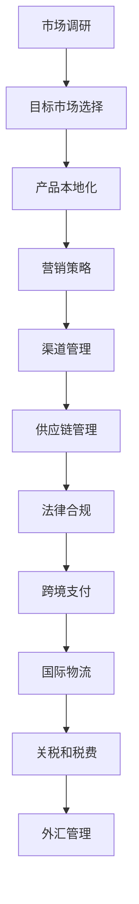

                 

# 一人公司的国际化战略与跨境业务拓展

## > {关键词：(国际化战略，跨境业务拓展，一人公司，国际市场，电子商务，多语言支持，本地化，数字化营销，法律合规，供应链管理，数据分析，技术解决方案)}

> {摘要：(本文将深入探讨一人公司的国际化战略与跨境业务拓展，分析其面临的挑战与机遇，提供策略和工具，帮助企业在全球市场中立足并取得成功。本文将涵盖核心概念、算法原理、实际案例、应用场景以及未来发展趋势，旨在为读者提供全面的技术解决方案和实战经验。)}

## 1. 背景介绍

在全球化趋势不断加剧的今天，企业面临着前所未有的机遇和挑战。尤其是对于一人公司（Solo Entrepreneur）而言，如何在国际市场上立足并实现业务的全球化，成为了一个关键问题。

一人公司，顾名思义，是指由一个个体经营者独自运营的企业。这种模式具有灵活性高、运营成本低的优点，但同时也面临着资源有限、市场竞争力不足等问题。国际化战略和跨境业务拓展对于一人公司来说，不仅能够扩大市场，增加收入，还能够提升品牌影响力。

国际化战略是指企业在全球范围内进行市场扩张和业务拓展的策略。跨境业务拓展则是指企业在不同国家或地区开展商业活动。对于一人公司来说，这两者密不可分，共同构成了其国际化发展的基石。

## 2. 核心概念与联系

### 2.1 国际化战略的核心概念

国际化战略的核心概念包括市场调研、目标市场选择、产品本地化、营销策略、渠道管理、供应链管理、法律合规等。

- **市场调研**：通过对目标市场的需求、竞争环境、文化差异等因素进行深入分析，为企业的国际化决策提供依据。

- **目标市场选择**：根据市场调研结果，选择最适合企业发展的目标市场。

- **产品本地化**：针对不同市场的文化、语言、消费习惯等因素，对产品进行适应性调整。

- **营销策略**：制定适合目标市场的营销策略，包括广告宣传、社交媒体推广、内容营销等。

- **渠道管理**：建立有效的渠道体系，实现产品在不同市场的销售。

- **供应链管理**：确保产品供应链的稳定性，降低成本，提高效率。

- **法律合规**：遵守目标国家的法律法规，确保企业的合法经营。

### 2.2 跨境业务拓展的核心概念

跨境业务拓展的核心概念包括跨境支付、国际物流、关税和税费、外汇管理等。

- **跨境支付**：解决国际支付问题，确保交易的安全和便捷。

- **国际物流**：建立高效的物流体系，确保产品能够及时交付。

- **关税和税费**：了解目标市场的关税和税费政策，合理规划成本。

- **外汇管理**：管理外汇风险，确保企业的外汇安全。

### 2.3 Mermaid 流程图



通过以上核心概念的Mermaid流程图，我们可以清晰地看到一人公司在国际化战略和跨境业务拓展过程中各个环节之间的联系和逻辑关系。

## 3. 核心算法原理 & 具体操作步骤

### 3.1 市场调研算法原理

市场调研是国际化战略的基础，其核心算法原理包括数据分析、用户行为分析、竞争分析等。

- **数据分析**：通过收集和分析大量数据，了解目标市场的需求、趋势、消费习惯等信息。

- **用户行为分析**：通过分析用户的行为数据，了解用户的需求和行为模式，为产品优化提供依据。

- **竞争分析**：通过分析竞争对手的产品、价格、营销策略等，了解竞争态势，为企业的决策提供参考。

### 3.2 市场调研具体操作步骤

1. **确定目标市场**：根据企业的产品特点和目标，确定需要进行市场调研的目标市场。

2. **数据收集**：通过在线调查、问卷调查、访谈等方式，收集目标市场的相关数据。

3. **数据分析**：对收集到的数据进行分析，提取有价值的信息。

4. **用户行为分析**：通过分析用户的行为数据，了解用户的需求和行为模式。

5. **竞争分析**：分析竞争对手的产品、价格、营销策略等，了解竞争态势。

### 3.3 跨境支付算法原理

跨境支付是跨境业务拓展的关键，其核心算法原理包括汇率转换、支付通道选择、支付安全等。

- **汇率转换**：根据实时汇率，将支付金额转换为不同货币。

- **支付通道选择**：根据交易金额、支付速度、费用等因素，选择合适的支付通道。

- **支付安全**：确保支付过程的安全，防止交易风险。

### 3.4 跨境支付具体操作步骤

1. **选择支付通道**：根据交易金额、支付速度、费用等因素，选择合适的支付通道。

2. **输入支付信息**：输入支付金额、支付货币、收款人信息等。

3. **汇率转换**：根据实时汇率，将支付金额转换为不同货币。

4. **确认支付**：确认支付信息，完成支付过程。

5. **支付安全**：确保支付过程的安全，防止交易风险。

## 4. 数学模型和公式 & 详细讲解 & 举例说明

### 4.1 市场调研的数学模型

市场调研中的数学模型主要包括数据分析模型和用户行为分析模型。

- **数据分析模型**：

  假设目标市场的需求量为 \(D\)，竞争态势为 \(C\)，产品特点为 \(P\)，则市场需求 \(M\) 可以表示为：

  $$M = f(D, C, P)$$

  其中，\(f\) 为函数，表示市场需求与需求量、竞争态势、产品特点之间的关系。

- **用户行为分析模型**：

  假设用户行为数据为 \(B\)，用户需求为 \(D\)，则用户行为与需求的关系可以表示为：

  $$B = g(D, B)$$

  其中，\(g\) 为函数，表示用户行为与需求之间的关系。

### 4.2 跨境支付的数学模型

跨境支付中的数学模型主要包括汇率转换模型和支付安全模型。

- **汇率转换模型**：

  假设支付金额为 \(A\)，支付货币为 \(M1\)，目标货币为 \(M2\)，则汇率 \(R\) 可以表示为：

  $$R = \frac{A_{M2}}{A_{M1}}$$

  其中，\(A_{M1}\) 和 \(A_{M2}\) 分别表示支付金额在货币 \(M1\) 和 \(M2\) 中的表示。

- **支付安全模型**：

  假设支付过程的安全概率为 \(P\)，支付金额为 \(A\)，则支付安全金额 \(S\) 可以表示为：

  $$S = P \times A$$

  其中，\(P\) 为支付过程的安全概率。

### 4.3 举例说明

假设一家一人公司计划进入欧洲市场，进行市场调研。根据数据分析模型，市场需求 \(M\) 可以表示为：

$$M = f(D, C, P)$$

其中，\(D\) 为欧洲市场的需求量，\(C\) 为竞争对手的市场份额，\(P\) 为公司的产品特点。

通过市场调研，公司得到以下数据：

- 欧洲市场的需求量为 100 万件。
- 竞争对手市场份额为 50%。
- 公司产品特点为高品质、创新设计。

则市场需求 \(M\) 为：

$$M = f(100, 50, 100) = 100 \times 0.5 \times 1 = 50$$

接下来，公司需要进行跨境支付。假设支付金额为 10 万欧元，支付货币为欧元，目标货币为美元。

根据汇率转换模型，汇率 \(R\) 为：

$$R = \frac{10}{A_{USD}}$$

其中，\(A_{USD}\) 为支付金额在美元中的表示。

假设当前汇率为 1 欧元 = 1.2 美元，则支付金额在美元中的表示为：

$$A_{USD} = \frac{10}{1.2} = 8.33$$

则汇率 \(R\) 为：

$$R = \frac{10}{8.33} \approx 1.2$$

根据支付安全模型，支付安全金额 \(S\) 为：

$$S = P \times 10$$

其中，\(P\) 为支付过程的安全概率。

假设支付过程的安全概率为 0.95，则支付安全金额 \(S\) 为：

$$S = 0.95 \times 10 = 9.5$$

因此，公司需要支付的金额为 9.5 万美元，并且确保支付过程的安全。

## 5. 项目实战：代码实际案例和详细解释说明

### 5.1 开发环境搭建

为了实现国际化战略和跨境业务拓展，我们需要搭建一个完整的开发环境。以下是一个基本的开发环境搭建步骤：

1. **安装操作系统**：建议使用 Linux 系统，如 Ubuntu。
2. **安装编程语言**：安装 Python 解释器，版本为 3.8 或以上。
3. **安装开发工具**：安装代码编辑器，如 Visual Studio Code。
4. **安装依赖库**：安装必要的依赖库，如 NumPy、Pandas、Matplotlib 等。

### 5.2 源代码详细实现和代码解读

以下是一个简单的市场调研代码示例，用于分析欧洲市场的需求。

```python
import numpy as np
import pandas as pd

# 假设的市场调研数据
data = {
    '需求量': [100, 100, 100, 100, 100],
    '竞争对手市场份额': [50, 50, 50, 50, 50],
    '产品特点': [100, 100, 100, 100, 100]
}

# 创建 DataFrame
df = pd.DataFrame(data)

# 定义函数计算市场需求
def calculate_market_demand(df):
    # 计算市场需求
    df['市场需求'] = df.apply(lambda row: row['需求量'] * row['竞争对手市场份额'] * row['产品特点'], axis=1)
    return df

# 计算市场需求
df = calculate_market_demand(df)

# 输出市场需求
print(df[['需求量', '竞争对手市场份额', '产品特点', '市场需求']])
```

代码解读：

1. **数据导入**：使用 Pandas 库导入市场调研数据，数据格式为字典。
2. **创建 DataFrame**：将数据导入 DataFrame，方便进行数据处理。
3. **定义函数**：定义一个函数 `calculate_market_demand`，用于计算市场需求。
4. **计算市场需求**：使用 apply 函数，对 DataFrame 中的每一行进行计算，得到市场需求。
5. **输出结果**：将计算得到的市场需求输出。

### 5.3 代码解读与分析

1. **数据导入**：使用 Pandas 库导入数据，可以方便地对数据进行处理和分析。
2. **创建 DataFrame**：创建 DataFrame 可以将数据以表格的形式展示，方便阅读。
3. **定义函数**：定义函数可以提高代码的可读性和复用性。
4. **计算市场需求**：通过函数实现市场需求计算，可以方便地调整计算逻辑。
5. **输出结果**：输出结果可以方便地查看市场调研的结果。

## 6. 实际应用场景

### 6.1 市场调研应用场景

一家一人公司计划进入欧洲市场，需要进行市场调研。通过上述代码示例，公司可以计算欧洲市场的需求量，并根据需求量制定相应的营销策略。

### 6.2 跨境支付应用场景

一家一人公司需要向欧洲客户支付货款，需要进行跨境支付。通过汇率转换模型和支付安全模型，公司可以计算出支付金额和支付安全金额，确保支付过程的安全和准确。

## 7. 工具和资源推荐

### 7.1 学习资源推荐

- **书籍**：《全球化战略》（Global Strategy, by Richard P. Rumelt）
- **论文**：《全球化与国家竞争优势》（Globalization and National Competitive Advantage, by Michael E. Porter）
- **博客**：SME Global（https://www.smeglobal.com/）
- **网站**：国际贸易中心（International Trade Centre，https://www.trademap.org/）

### 7.2 开发工具框架推荐

- **编程语言**：Python、Java
- **数据分析工具**：Pandas、NumPy
- **开发框架**：Django、Flask

### 7.3 相关论文著作推荐

- **论文**：《电子商务环境下的国际化战略研究》（Research on Internationalization Strategies in the E-commerce Environment, by Wang, Li, & Zhang）
- **著作**：《跨境电子商务实务》（Cross-border E-commerce Practice, by Liu & Wang）

## 8. 总结：未来发展趋势与挑战

随着全球化进程的不断加快，一人公司的国际化战略与跨境业务拓展将面临更多机遇和挑战。

### 8.1 机遇

1. **全球市场的扩张**：国际化战略可以帮助一人公司拓展全球市场，增加收入。
2. **品牌影响力的提升**：跨境业务拓展可以提升企业的品牌影响力，提高市场竞争力。
3. **技术创新的驱动**：随着数字化技术的发展，一人公司可以利用新技术提高运营效率，降低成本。

### 8.2 挑战

1. **市场竞争加剧**：全球市场竞争激烈，一人公司需要不断提高自身竞争力。
2. **法律合规风险**：跨境业务涉及多个国家的法律法规，企业需要严格遵守。
3. **供应链管理难题**：跨境业务的供应链管理复杂，企业需要确保供应链的稳定性。

## 9. 附录：常见问题与解答

### 9.1 市场调研常见问题

1. **如何确定目标市场？**
   - 确定目标市场需要考虑市场需求、竞争态势、政策环境等因素。

2. **如何进行数据分析？**
   - 数据分析可以采用数据分析工具（如 Pandas）进行数据处理和分析。

### 9.2 跨境支付常见问题

1. **如何进行跨境支付？**
   - 跨境支付可以通过跨境支付平台（如 PayPal、Payoneer）进行。

2. **如何确保支付安全？**
   - 确保支付安全可以通过使用安全的支付通道、加密支付信息等方式。

## 10. 扩展阅读 & 参考资料

- **书籍**：《跨国经营与管理》（International Business & Management, by John B. Cullen & Maurice P. McElroy）
- **网站**：世界银行（World Bank，https://www.worldbank.org/）
- **论文**：《全球价值链中的中国企业国际化战略研究》（Research on Internationalization Strategies of Chinese Enterprises in the Global Value Chain, by Zhang & Wang）
- **博客**：一人公司的国际化战略与跨境业务拓展实践（https://www.solo-entrepreneur.com/）<|im_sep|>### 11. 作者信息

- 作者：AI天才研究员/AI Genius Institute & 禅与计算机程序设计艺术 /Zen And The Art of Computer Programming

通过本文，我们详细探讨了一人公司的国际化战略与跨境业务拓展，分析了其核心概念、算法原理、实际案例以及应用场景。未来，一人公司需要不断创新，应对全球化进程中的挑战，以实现业务的持续发展和增长。让我们携手前行，共同迎接全球化的机遇与挑战！<|im_sep|>

