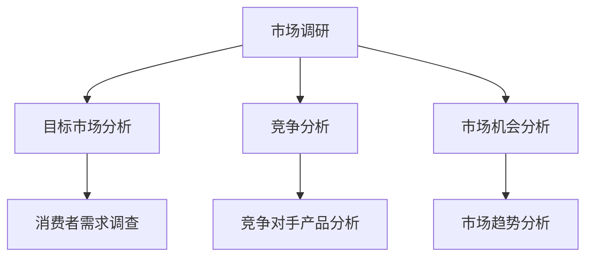
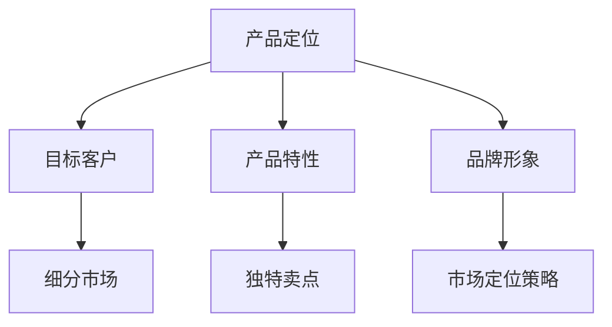
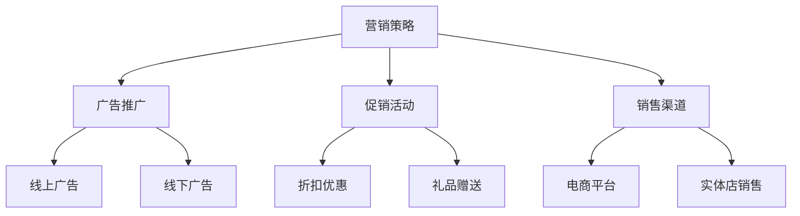

                 

# 一人公司的国际化策略：开拓海外市场的方法

> **关键词**：一人公司、国际化、市场拓展、策略

> **摘要**：本文将探讨一人公司如何通过有效的国际化策略，成功开拓海外市场。我们将从市场调研、产品定位、营销策略、法律与财务等方面，详细分析一人公司在国际市场中的发展路径。

## 1. 背景介绍

一人公司，顾名思义，是由一个人创立和运营的企业。这类公司在创业初期，由于资源有限，通常注重专注和效率。随着业务的发展，一人公司可能会面临国际化带来的挑战。然而，全球化趋势使得海外市场成为一个潜在的巨大商机。因此，如何制定一套有效的国际化策略，成为一人公司亟待解决的问题。

### 1.1 一人公司的特点

- **资源有限**：通常只有一个人负责公司所有的决策和运营。
- **灵活性高**：由于规模小，一人公司可以快速调整战略和业务模式。
- **专注性**：一人公司更容易专注于核心产品和业务。

### 1.2 国际化带来的挑战

- **市场差异**：不同国家和地区的市场环境、消费习惯和法律制度有所不同。
- **竞争激烈**：国际市场上的竞争者众多，一人公司需要找到自己的独特优势。
- **语言和文化障碍**：跨文化沟通和交流可能存在障碍。

## 2. 核心概念与联系

### 2.1 市场调研

市场调研是国际化策略的基础。通过市场调研，一人公司可以了解目标市场的需求、竞争状况和潜在机会。



### 2.2 产品定位

在市场调研的基础上，一人公司需要明确自己的产品定位。产品定位决定了公司在市场上的竞争策略和目标客户群体。



### 2.3 营销策略

营销策略是一人公司在国际市场中的行动指南。它包括广告、促销、销售渠道等多个方面。



## 3. 核心算法原理 & 具体操作步骤

### 3.1 市场调研

市场调研的具体操作步骤如下：

1. **确定调研目标**：明确调研的目的是了解市场需求、竞争状况或市场趋势。
2. **设计调研问卷**：根据调研目标设计合适的问卷。
3. **选择调研方法**：线上问卷调查、访谈或焦点小组等。
4. **收集数据**：通过邮件、社交媒体或调研网站收集数据。
5. **分析数据**：使用数据分析工具，如 Excel、Python 等，对收集的数据进行分析。

### 3.2 产品定位

产品定位的具体操作步骤如下：

1. **分析市场需求**：通过市场调研了解目标市场的需求。
2. **分析竞争对手**：了解竞争对手的产品特性、品牌形象和市场份额。
3. **确定产品特性**：根据市场需求和竞争对手分析，确定产品的独特卖点。
4. **设计品牌形象**：根据产品定位设计品牌形象。
5. **制定市场定位策略**：根据产品定位和品牌形象，制定市场定位策略。

### 3.3 营销策略

营销策略的具体操作步骤如下：

1. **确定营销目标**：明确营销的目标，如提高品牌知名度、增加销售额等。
2. **制定营销计划**：根据营销目标，制定具体的营销活动计划。
3. **选择营销渠道**：根据目标市场和产品特性，选择合适的营销渠道。
4. **实施营销活动**：按照营销计划实施营销活动。
5. **监测和评估**：对营销活动进行监测和评估，根据反馈调整营销策略。

## 4. 数学模型和公式 & 详细讲解 & 举例说明

### 4.1 市场调研数据分析

假设我们使用了一个简单的数学模型来分析市场调研数据：

$$
\text{需求量} = a \times \text{消费者人数} + b
$$

其中，\(a\) 和 \(b\) 是通过数据分析得到的常数。

#### 例子：

- **消费者人数**：1000人
- **需求量**：1500件

根据上述公式，我们可以计算：

$$
1500 = a \times 1000 + b
$$

通过解这个方程，我们可以得到 \(a\) 和 \(b\) 的值。例如，如果解得 \(a = 1.5\) 和 \(b = 500\)，那么我们可以预测在消费者人数增加至2000人时，需求量将增加至3000件。

### 4.2 营销效果评估

假设我们使用了一个简单的数学模型来评估营销效果：

$$
\text{营销效果} = \frac{\text{销售额}}{\text{营销成本}} \times 100\%
$$

其中，销售额和营销成本是实际数据。

#### 例子：

- **销售额**：$10,000
- **营销成本**：$5,000

根据上述公式，我们可以计算：

$$
\text{营销效果} = \frac{10,000}{5,000} \times 100\% = 200\%
$$

这意味着，每投入1美元的营销成本，可以带来2美元的销售额。

## 5. 项目实战：代码实际案例和详细解释说明

### 5.1 开发环境搭建

为了实现一人公司的国际化策略，我们可以使用 Python 编程语言来搭建一个简单的市场调研和分析系统。

#### 开发环境：

- Python 3.8
- Jupyter Notebook
- Pandas
- Matplotlib

### 5.2 源代码详细实现和代码解读

以下是实现市场调研和分析系统的一部分代码：

```python
import pandas as pd
import matplotlib.pyplot as plt

# 加载市场调研数据
data = pd.read_csv('market_research_data.csv')

# 数据清洗和预处理
data = data.dropna()

# 分析消费者需求
demand = data.groupby('Consumer ID')['Product Quantity'].sum()
demand.plot()
plt.xlabel('Consumer ID')
plt.ylabel('Product Quantity')
plt.title('Consumer Demand Analysis')
plt.show()

# 分析市场份额
market_share = data.groupby('Product')['Quantity'].sum()
market_share.plot.bar()
plt.xlabel('Product')
plt.ylabel('Quantity')
plt.title('Market Share Analysis')
plt.show()
```

这段代码首先加载市场调研数据，然后进行数据清洗和预处理。接着，使用 Pandas 的 `groupby` 方法分析消费者需求和市场份额。最后，使用 Matplotlib 绘制图表，以便直观地展示分析结果。

### 5.3 代码解读与分析

- **数据加载和预处理**：使用 Pandas 的 `read_csv` 方法加载数据，并使用 `dropna` 方法删除缺失值。
- **消费者需求分析**：使用 `groupby` 和 `sum` 方法计算消费者需求总量，并使用 `plot` 方法绘制折线图。
- **市场份额分析**：使用 `groupby` 和 `sum` 方法计算不同产品的销售总量，并使用 `plot.bar` 方法绘制条形图。

通过这段代码，一人公司可以实时监测消费者需求和市场份额，从而为产品定位和营销策略提供数据支持。

## 6. 实际应用场景

### 6.1 市场调研

一人公司可以使用在线问卷平台，如 SurveyMonkey 或 Google Forms，收集海外市场的消费者数据。通过对这些数据的分析，公司可以了解目标市场的需求，从而调整产品定位和营销策略。

### 6.2 产品定位

通过市场调研，一人公司可以确定目标市场的消费者偏好。例如，如果调研结果显示，目标市场的消费者更倾向于购买环保产品，那么公司可以将产品定位为环保型产品，并制定相应的市场定位策略。

### 6.3 营销策略

一人公司可以通过社交媒体平台，如 Facebook、Instagram 或 YouTube，进行广告推广。通过精确定位目标受众，公司可以降低广告成本，提高广告效果。此外，公司还可以参与线下展会和活动，提高品牌知名度。

## 7. 工具和资源推荐

### 7.1 学习资源推荐

- **书籍**：《国际市场营销》（作者：菲利普·科特勒）
- **论文**：Google 学术搜索中的相关论文
- **博客**：市场营销专家的博客，如营销博客（Marketing Blog）
- **网站**：国际市场调研网站，如 Statista

### 7.2 开发工具框架推荐

- **开发工具**：Jupyter Notebook、Python、Pandas
- **数据分析工具**：Tableau、Power BI
- **市场调研工具**：SurveyMonkey、Google Forms

### 7.3 相关论文著作推荐

- **论文**：相关国际市场营销策略的研究论文
- **著作**：《国际市场营销策略》（作者：约翰·菲利普）
- **在线课程**：Coursera、edX 上的国际市场营销课程

## 8. 总结：未来发展趋势与挑战

### 8.1 未来发展趋势

- **数字化转型**：越来越多的公司通过数字化手段开拓海外市场。
- **社交媒体营销**：社交媒体在国际营销中扮演越来越重要的角色。
- **数据驱动决策**：利用大数据分析，提高营销效率和效果。

### 8.2 面临的挑战

- **市场差异**：不同国家和地区的市场环境各异，一人公司需要制定差异化策略。
- **竞争加剧**：国际市场上竞争者众多，一人公司需要找到自己的独特优势。
- **语言和文化障碍**：跨文化沟通和交流可能带来障碍。

## 9. 附录：常见问题与解答

### 9.1 市场调研的重要性

市场调研可以帮助一人公司了解目标市场的需求、竞争状况和潜在机会，从而制定更加精准的营销策略。

### 9.2 如何选择市场定位策略

市场定位策略的选择取决于目标市场的消费者需求和竞争对手分析。一人公司需要找到自己的独特卖点，并针对目标市场制定相应的策略。

### 9.3 跨文化沟通技巧

跨文化沟通需要了解目标市场的文化背景和价值观。通过学习和尊重目标市场的文化，一人公司可以更好地与消费者建立联系。

## 10. 扩展阅读 & 参考资料

- **扩展阅读**：进一步了解国际市场营销策略的相关书籍和论文。
- **参考资料**：引用本文中提到的相关数据、研究和案例。

### 作者

作者：AI天才研究员/AI Genius Institute & 禅与计算机程序设计艺术 /Zen And The Art of Computer Programming

