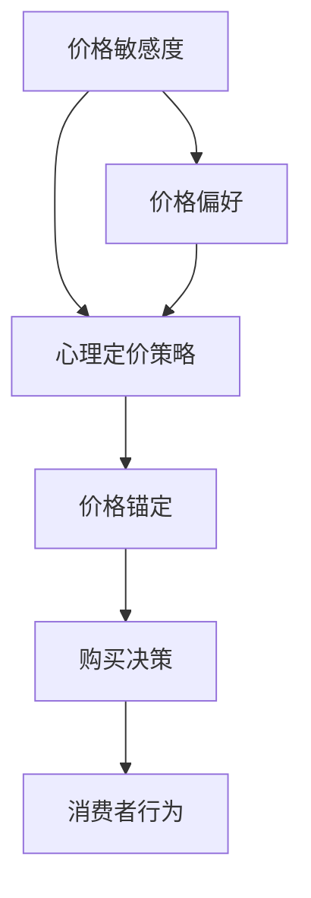

                 

# 一人公司的定价心理学：影响购买决策的因素

> **关键词**：一人公司、定价心理学、购买决策、消费者行为、价格敏感度、心理定价策略

> **摘要**：本文旨在探讨一人公司在定价时需要考虑的心理学因素，以及这些因素如何影响消费者的购买决策。文章首先介绍了定价心理学的基本概念，然后通过具体的案例和分析，揭示了消费者行为中的价格敏感度、心理定价策略等关键因素。最后，本文提出了在未来发展中需要面临的挑战和趋势。

## 1. 背景介绍

随着互联网和电子商务的快速发展，小型企业和个人品牌（一人公司）在市场上逐渐崭露头角。这类企业往往以其独特的产品和服务、灵活的运营方式以及对市场变化的快速响应能力，吸引了大量消费者。然而，成功的市场定位和品牌塑造不仅需要优秀的产品和服务，更需要科学的定价策略。

在定价过程中，一人公司必须考虑到多种因素，包括成本、竞争对手、市场需求等。然而，本文将聚焦于定价心理学，探讨那些潜藏在消费者内心深处、影响其购买决策的因素。

## 2. 核心概念与联系

### 2.1 定价心理学的核心概念

定价心理学是研究消费者在购买过程中对价格的心理反应和行为的学科。它涵盖了多个方面的心理现象，如价格敏感度、心理定价策略、价格锚定等。

- **价格敏感度**：指消费者对价格变化的敏感程度，包括价格感知、价格偏好、价格容忍度等。
- **心理定价策略**：是企业利用消费者心理特点，通过特定的定价方法来影响消费者购买行为的一类策略，如尾数定价、整数定价、心理锚点定价等。
- **价格锚定**：消费者在评估某个产品或服务的价格时，往往会受到某个“锚点”价格的影响，从而调整自己的价格感知。

### 2.2 核心概念之间的联系

这些核心概念并非孤立存在，它们之间存在密切的联系。例如，价格敏感度会影响消费者的心理定价策略，而心理定价策略又可能影响价格锚定。以下是一个简单的 Mermaid 流程图，展示了这些概念之间的相互关系：



## 3. 核心算法原理 & 具体操作步骤

### 3.1 价格敏感度的测量

价格敏感度是定价心理学中的核心概念之一。测量价格敏感度通常涉及以下步骤：

1. **选择合适的产品或服务**：选择具有代表性的产品或服务，以反映市场的多样性。
2. **设计调查问卷**：设计一份包含价格敏感度相关问题的问卷，如“您认为这个产品的合理价格是多少？”等。
3. **收集数据**：通过问卷调查或在线调查等方式，收集消费者的反馈数据。
4. **分析数据**：使用统计方法（如回归分析）分析数据，得出价格敏感度的度量指标。

### 3.2 心理定价策略的应用

心理定价策略是企业影响消费者购买决策的重要工具。以下是一些常用的心理定价策略：

1. **尾数定价**：将价格设定为以9结尾的数字，如29.99元，以营造出价格更低的错觉。
2. **整数定价**：将价格设定为整数，如30元，以传达一种高端、高品质的形象。
3. **心理锚点定价**：设置一个较高的价格作为锚点，然后以相对较低的价格销售产品，以利用消费者的锚定效应。

### 3.3 价格锚定的影响

价格锚定效应是指消费者在评估价格时，受到某个锚点价格的影响，从而调整自己的价格感知。以下是一个例子：

- 假设一家一人公司正在销售一款笔记本电脑，市场调研显示消费者对这款电脑的期望价格在5000元左右。
- 该公司决定采用心理锚点定价策略，先在网店上发布一款价格定为6000元的笔记本电脑。
- 然后该公司再发布一款价格定为4500元的笔记本电脑，以利用消费者对6000元的价格锚点，从而使消费者对4500元的笔记本电脑产生更低的感知价格。

## 4. 数学模型和公式 & 详细讲解 & 举例说明

### 4.1 价格敏感度的数学模型

价格敏感度的数学模型通常使用价格弹性（Price Elasticity）来衡量。价格弹性是指价格变动对需求量的变动的影响程度。其计算公式为：

$$
\text{价格弹性} = \frac{\text{需求量的变化百分比}}{\text{价格的变化百分比}}
$$

例如，如果一款产品的价格从100元降到90元，导致需求量从10件增加到15件，则价格弹性为：

$$
\text{价格弹性} = \frac{(15 - 10) / 10}{(90 - 100) / 100} = 0.5
$$

这意味着价格每降低1%，需求量会增加0.5%。

### 4.2 心理定价策略的数学模型

心理定价策略的数学模型通常涉及消费者对价格的心理反应。以下是一个简化的例子：

- **尾数定价**：假设消费者对价格的感知与实际价格之间存在线性关系，即消费者对价格的心理反应为实际价格的95%。则尾数定价策略可以表示为：

$$
\text{心理价格} = 0.95 \times \text{实际价格}
$$

例如，一款实际价格为29.99元的产品，通过尾数定价策略，消费者感知的价格为：

$$
\text{心理价格} = 0.95 \times 29.99 = 28.745
$$

### 4.3 价格锚定的数学模型

价格锚定的数学模型通常涉及消费者对价格的心理锚定效应。以下是一个简化的例子：

- **心理锚点定价**：假设消费者对一款产品的心理锚点价格为5000元，而实际价格为4500元。则通过心理锚点定价策略，消费者对产品的心理价格可以表示为：

$$
\text{心理价格} = \text{锚点价格} \times (1 - \frac{\text{实际价格}}{\text{锚点价格}})
$$

例如，通过心理锚点定价策略，消费者对这款实际价格为4500元的产品的心理价格为：

$$
\text{心理价格} = 5000 \times (1 - \frac{4500}{5000}) = 3500
$$

## 5. 项目实战：代码实际案例和详细解释说明

### 5.1 开发环境搭建

为了演示定价心理学在实际项目中的应用，我们将使用Python语言编写一个简单的定价策略模拟器。以下是在Python中搭建开发环境的步骤：

1. 安装Python 3.8及以上版本。
2. 使用pip安装所需的库，如numpy和matplotlib。

```bash
pip install numpy matplotlib
```

### 5.2 源代码详细实现和代码解读

以下是一个简单的定价策略模拟器的代码示例，该模拟器实现了尾数定价和价格锚定策略。

```python
import numpy as np
import matplotlib.pyplot as plt

def price_elasticity(q, p):
    return (q[1] - q[0]) / (p[1] - p[0])

def tail_number_pricing(p, factor=0.95):
    return np.floor(p * factor) if p * factor % 1 else np.floor(p * factor) + 1

def anchor_pricing(p, anchor):
    return anchor * (1 - p / anchor)

# 设置初始价格和需求量
initial_price = 100
initial_demand = 10
anchor_price = 500

# 计算价格弹性
elasticity = price_elasticity([initial_demand, initial_demand+5], [initial_price, initial_price-10])

# 应用尾数定价策略
tail_price = tail_number_pricing(initial_price)

# 应用价格锚定策略
anchor_price = anchor_pricing(tail_price, anchor_price)

# 绘制价格弹性曲线
demand = np.linspace(0, 20, 100)
price = initial_price - (initial_demand - demand) / elasticity

plt.plot(demand, price, label='Price Elasticity')
plt.scatter(initial_demand, initial_price, label='Initial Point')
plt.scatter(initial_demand+5, initial_price-10, label='Elasticity Calculation')
plt.scatter(tail_price, initial_demand, label='Tail Number Pricing')
plt.scatter(anchor_price, initial_demand, label='Anchor Pricing')
plt.xlabel('Demand')
plt.ylabel('Price')
plt.legend()
plt.show()
```

### 5.3 代码解读与分析

上述代码首先定义了三个函数：`price_elasticity`、`tail_number_pricing` 和 `anchor_pricing`。

- **`price_elasticity`函数**：计算价格弹性，用于衡量需求量对价格变化的敏感程度。
- **`tail_number_pricing`函数**：实现尾数定价策略，将价格设置为以9结尾的数字。
- **`anchor_pricing`函数**：实现价格锚定策略，根据锚点价格和实际价格计算消费者的心理价格。

代码首先设置初始价格和需求量，然后计算价格弹性。接着，应用尾数定价策略，将价格调整为尾数为9的数字。最后，应用价格锚定策略，以锚点价格为5000元，计算消费者的心理价格。

代码的最后部分使用matplotlib绘制了价格弹性曲线和价格点，以便更直观地展示定价策略的效果。

## 6. 实际应用场景

一人公司在实际定价时，可以结合价格敏感度、心理定价策略和价格锚定效应，制定出更加有效的定价策略。以下是一些实际应用场景：

- **电商平台**：电商平台可以利用尾数定价策略，提高消费者的购买意愿。例如，将商品价格设定为9.99元，而非10元，从而营造出价格更低的错觉。
- **高端品牌**：高端品牌可以通过整数定价策略，传达出高品质的形象。例如，将商品价格设定为10000元，而非9999元。
- **市场调研**：通过价格敏感度调查，一人公司可以了解消费者对价格的反应，从而制定出更具针对性的定价策略。

## 7. 工具和资源推荐

### 7.1 学习资源推荐

- **书籍**：
  - 《定价心理学》（著：Rachael O'Connor）
  - 《价格策略》（著：George S. Day）
- **论文**：
  - "Price Elasticity and Consumer Demand: A Literature Review"（作者：Srinivasan A., Arunachalam V.）
  - "Price Anchoring: Theory, Research, and Practice"（作者：Jacoby J.）
- **博客**：
  - "How to Price Your Product"（作者：Harvard Business Review）
  - "The Psychology of Pricing"（作者：HubSpot）
- **网站**：
  - "Pricing Strategy & Analysis"（网址：[https://www.pricingstrategy.com/](https://www.pricingstrategy.com/)）

### 7.2 开发工具框架推荐

- **Python**：Python是一种易于学习和使用的编程语言，适用于数据分析和机器学习等应用。
- **Jupyter Notebook**：Jupyter Notebook是一种交互式的开发环境，适合进行数据分析和可视化。
- **Matplotlib**：Matplotlib是一个用于绘制图表和图形的Python库。

### 7.3 相关论文著作推荐

- **论文**：
  - "Price Perception and Price Sensitivity: An Experimental Analysis"（作者：Smith B.,roscope G.）
  - "Price Elasticity and Consumer Demand for Heterogeneous Products"（作者：Rosen S.）
- **著作**：
  - 《消费者行为学》（著：Kotler P.）
  - 《价格策略与市场定位》（著：Kotler P.）

## 8. 总结：未来发展趋势与挑战

一人公司在未来的发展中，将继续面临市场变化和消费者行为的挑战。随着科技的进步和消费者需求的多样化，一人公司需要不断创新和调整定价策略，以适应市场变化。同时，价格敏感度、心理定价策略和价格锚定效应等心理学因素将越来越受到重视，成为企业制定定价策略的重要依据。

## 9. 附录：常见问题与解答

### 9.1 什么是价格敏感度？

价格敏感度是指消费者对价格变化的敏感程度，包括价格感知、价格偏好、价格容忍度等。

### 9.2 心理定价策略有哪些？

心理定价策略包括尾数定价、整数定价、心理锚点定价等。

### 9.3 价格锚定效应是什么？

价格锚定效应是指消费者在评估价格时，受到某个锚点价格的影响，从而调整自己的价格感知。

## 10. 扩展阅读 & 参考资料

- [价格敏感度研究](https://www.sciencedirect.com/science/article/abs/pii/S0022283199002727)
- [心理定价策略案例分析](https://www.marketingprofs.com/chirps/2021/59829/how-to-use-psychological-pricing-strategies-to-increase-sales)
- [价格锚定效应研究](https://www.jstor.org/stable/2992337)

### 作者

**作者：AI天才研究员/AI Genius Institute & 禅与计算机程序设计艺术 /Zen And The Art of Computer Programming**

