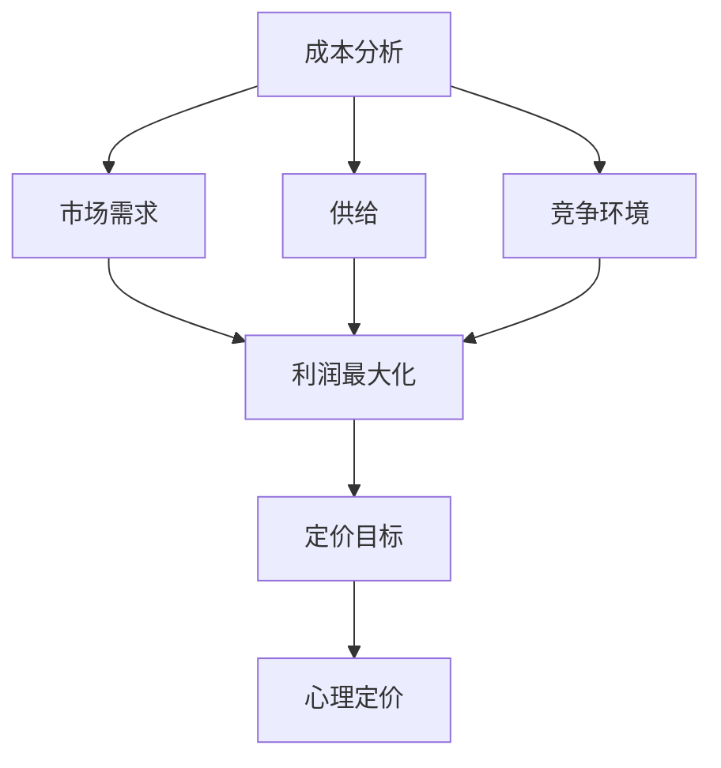

                 

### 背景介绍

在当今数字化时代，独立企业或个人创业者面临着前所未有的机遇和挑战。在众多商业决策中，定价策略尤为关键。正确的定价策略不仅可以确保企业的生存和成长，还能够最大化利润，增强市场竞争力。一人公司的定价策略，即一个人运营的公司如何设定价格，既要有竞争力，又能保证利润，这是每个独立企业家都关心的问题。

为何研究一人公司的定价策略如此重要？原因在于，尽管这些公司规模较小，但它们往往在创新和灵活性方面具有优势。合理的定价策略能够帮助一人公司抓住市场机会，吸引客户，同时确保企业的可持续发展。此外，随着全球市场的不确定性和竞争的加剧，有效的定价策略成为了企业保持竞争优势的必要条件。

本文将从多个角度详细探讨一人公司的定价策略。首先，我们将介绍定价策略的基本概念和原理，探讨定价的目标和影响因素。接下来，我们将深入分析市场定价策略、成本加成定价策略、竞争定价策略以及心理定价策略等不同定价方法，并对其进行优缺点和适用场景的比较。在此基础上，我们将结合实际案例，分析这些策略在不同市场环境下的应用效果。

随后，本文将讨论如何通过市场调研和数据分析来制定个性化的定价策略。我们将介绍一些实用的市场调研工具和方法，以及如何利用数据驱动决策来调整和优化定价策略。在此基础上，我们将探讨利润最大化模型，并详细介绍如何通过数学模型和公式来分析定价策略的收益和风险。

文章还将分享一些成功的定价策略案例，分析其成功原因和经验教训。同时，我们将讨论在制定定价策略时可能遇到的问题和挑战，并提出相应的解决策略。最后，本文将总结一人公司定价策略的核心要点，展望未来发展趋势和潜在的研究方向。

通过本文的探讨，希望能够为一人公司的创业者提供有价值的定价策略指导，帮助他们更好地应对市场竞争，实现企业的长期可持续发展。

#### 核心概念与联系

为了深入探讨一人公司的定价策略，我们首先需要了解一些核心概念和理论，它们构成了定价策略的理论基础。以下是对这些概念及其相互关系的详细解释。

**1. 成本分析（Cost Analysis）**

成本分析是定价策略的基础，它涉及对生产和运营过程中所有成本的分析和计算。主要分为固定成本和可变成本两类：

- **固定成本（Fixed Costs）**：指在生产规模变化时，成本总额保持不变的成本，如房租、设备折旧、保险费用等。
- **可变成本（Variable Costs）**：指随着生产规模变化而变化的成本，如原材料、直接劳动成本、运输费用等。

了解成本结构对于制定合理的定价策略至关重要，因为只有在充分了解成本的前提下，才能确定一个既能覆盖成本又能保证利润的价格。

**2. 市场需求（Market Demand）**

市场需求是指消费者在一定价格水平下愿意购买的商品数量。市场需求受多种因素影响，包括价格、消费者收入、产品特性、替代品价格、消费者偏好等。市场需求曲线通常呈向下倾斜，即价格上升时需求量下降，价格下降时需求量上升。

**3. 供给（Supply）**

供给是指生产者在一定价格水平下愿意提供的商品数量。供给曲线通常呈向上倾斜，即价格上升时供给量增加，价格下降时供给量减少。

**4. 竞争环境（Competitive Environment）**

竞争环境对定价策略有直接影响。市场竞争激烈时，企业需要通过价格策略来吸引客户，提高市场份额。而在垄断市场中，企业可以更灵活地设定价格，以最大化利润。

**5. 利润最大化（Profit Maximization）**

利润最大化是所有企业制定定价策略的核心目标。利润最大化原则指出，企业在确定价格时，应该使总收益（Total Revenue，TR）与总成本（Total Cost，TC）的差额最大，即最大化利润（Profit，π = TR - TC）。

**6. 定价目标（Pricing Objectives）**

不同的企业有不同的定价目标，常见的定价目标包括：

- **市场渗透定价**：通过设定较低价格快速占领市场，增加市场份额。
- **市场主导定价**：以高价格来保持市场领先地位，增加利润。
- **生存定价**：在市场不景气时，以最低价格维持企业生存。
- **最大化利润定价**：设定价格以最大化企业的长期利润。

**7. 心理定价（Psychological Pricing）**

心理定价是基于消费者心理的一种定价策略，通过设定特定的价格来影响消费者的购买决策。例如，消费者往往对"9.99"这样的价格更为敏感，认为它是一个相对较低的价格。

**Mermaid 流程图**

以下是一个简单的 Mermaid 流程图，展示了这些核心概念之间的相互关系：



通过这个流程图，我们可以清晰地看到成本分析、市场需求、供给和竞争环境如何共同影响利润最大化和定价目标，进而影响心理定价策略的制定。

在了解了这些核心概念之后，我们将在接下来的章节中进一步探讨不同的定价策略，并详细解释每种策略的原理和应用。通过这些分析，我们将帮助读者更好地理解如何制定有效的定价策略，以实现一人公司的可持续发展。

#### 核心算法原理 & 具体操作步骤

在深入探讨各种定价策略之前，我们需要了解核心算法原理和具体操作步骤，这将为后续的分析提供坚实的基础。以下是几种常用的定价策略，以及其背后的算法原理和实施步骤。

**1. 成本加成定价策略（Cost-Plus Pricing）**

成本加成定价策略是一种最常见的定价方法，其基本原理是将产品或服务的成本加上一定的加成率，从而确定最终售价。具体操作步骤如下：

- **计算成本**：首先，需要计算产品或服务的总成本，包括固定成本和可变成本。
- **确定加成率**：根据市场状况和企业目标，确定一个合理的加成率。加成率通常在20%到50%之间。
- **计算售价**：将总成本乘以（1 + 加成率），得到最终售价。

数学模型如下：

\[ 售价 = \text{总成本} \times (1 + \text{加成率}) \]

**2. 市场需求定价策略（Demand-Based Pricing）**

市场需求定价策略是基于市场需求曲线来确定价格的一种方法。具体操作步骤如下：

- **确定市场需求曲线**：通过市场调研和数据分析，获取市场需求量与价格之间的关系，绘制市场需求曲线。
- **选择定价点**：根据市场需求曲线，选择一个能够最大化利润的价格点。通常选择市场需求曲线上的一个拐点作为定价点。

数学模型如下：

\[ \text{需求量} = f(\text{价格}) \]
\[ \text{利润} = \text{价格} \times \text{需求量} - \text{总成本} \]

**3. 竞争定价策略（Competitive Pricing）**

竞争定价策略是根据竞争对手的价格来设定自己的价格。具体操作步骤如下：

- **分析竞争对手**：研究主要竞争对手的产品或服务定价，了解其定价策略和市场份额。
- **选择定价策略**：根据自身市场地位和目标，选择竞争定价策略。主要有以下几种方式：
  - **跟随定价**：直接跟随竞争对手的价格。
  - **差异定价**：在竞争对手价格基础上，进行适当的调整，以突出自身优势。
  - **领导定价**：设定相对较高的价格，以显示高品质和领导地位。

数学模型如下：

\[ \text{自定价} = \text{竞争对手价格} \times (1 + \text{调整系数}) \]

**4. 心理定价策略（Psychological Pricing）**

心理定价策略是基于消费者心理的一种定价方法，通过设定特定的价格来影响消费者的购买决策。具体操作步骤如下：

- **研究消费者心理**：分析消费者对价格的心理反应，了解他们对"9.99"、"99"、"0.99"等不同价格的敏感程度。
- **选择心理定价**：根据消费者心理反应，选择能够增加消费者购买意愿的价格。例如，使用"9.99"这种价格，给人一种"便宜"的感觉。

数学模型较为复杂，因为涉及心理因素，通常通过市场调研和实验来调整。

**5. 基于数据的定价策略（Data-Driven Pricing）**

基于数据的定价策略是利用大数据和机器学习算法来制定定价策略。具体操作步骤如下：

- **收集数据**：收集市场需求、消费者行为、竞争对手定价等大量数据。
- **数据预处理**：对数据进行清洗、归一化处理，确保数据质量。
- **建立模型**：使用机器学习算法（如线性回归、决策树、神经网络等）建立定价模型。
- **模型优化**：通过交叉验证和优化算法，提高模型准确性和鲁棒性。
- **定价决策**：根据模型预测结果，制定定价策略。

数学模型如下：

\[ \text{定价} = \text{模型}(\text{输入特征}) \]

通过这些核心算法原理和具体操作步骤，我们可以看到，每种定价策略都有其独特的计算方法和适用场景。在实际应用中，企业可以根据具体情况进行选择和调整，以实现利润最大化和市场竞争力。在接下来的章节中，我们将进一步探讨这些策略在不同市场环境下的实际应用效果，并结合实际案例进行详细分析。

#### 数学模型和公式 & 详细讲解 & 举例说明

在探讨定价策略时，数学模型和公式起到了至关重要的作用。通过数学模型，我们可以更精确地分析和预测定价策略的效果，从而制定出更合理的价格。以下是一些常用的数学模型和公式的详细讲解及举例说明。

**1. 成本加成定价策略的数学模型**

成本加成定价策略的核心在于确定加成率。假设固定成本为 \( FC \)，可变成本为 \( VC \)，加成率为 \( r \)，则成本加成定价策略的数学模型为：

\[ 售价 = \text{成本} \times (1 + r) \]

举例说明：假设一家公司生产一款产品，固定成本为1000元，可变成本为500元，加成率设定为30%。则该产品的售价计算如下：

\[ 售价 = (1000 + 500) \times (1 + 0.3) = 1900 \text{元} \]

**2. 市场需求定价策略的数学模型**

市场需求定价策略基于市场需求曲线来确定价格。假设市场需求曲线为 \( Q = a - bP \)，其中 \( Q \) 为需求量，\( P \) 为价格，\( a \) 和 \( b \) 为参数。利润最大化的条件是边际收益等于边际成本，即 \( MR = MC \)。

边际收益（MR）的数学模型为：

\[ MR = \frac{d(TR)}{dQ} \]

总收益（TR）的数学模型为：

\[ TR = P \times Q = (a - bP)P \]

举例说明：假设市场需求曲线为 \( Q = 1000 - 10P \)，固定成本为1000元，可变成本为50元，则边际成本（MC）为50元。要确定最大化利润的价格，需要解以下方程：

\[ MR = MC \]
\[ \frac{d(TR)}{dQ} = MC \]
\[ \frac{d((1000 - 10P)P)}{dQ} = 50 \]

解得：

\[ P = 90 \text{元} \]

此时的需求量为：

\[ Q = 1000 - 10 \times 90 = 100 \text{单位} \]

**3. 竞争定价策略的数学模型**

竞争定价策略通常基于竞争对手的价格来确定自身价格。假设竞争对手的价格为 \( P_{\text{competitor}} \)，企业选择的价格为 \( P \)，调整系数为 \( k \)，则竞争定价策略的数学模型为：

\[ P = P_{\text{competitor}} \times (1 + k) \]

举例说明：假设竞争对手的价格为80元，企业选择的调整系数为0.2，则企业的定价计算如下：

\[ P = 80 \times (1 + 0.2) = 96 \text{元} \]

**4. 心理定价策略的数学模型**

心理定价策略基于消费者心理，通过设定特定价格来影响消费者的购买决策。一个常用的心理定价模型是心理定价函数 \( P = f(C) \)，其中 \( C \) 为消费者认知成本。认知成本通常与价格感知有关，如尾数定价（如9.99元）。

假设心理定价函数为 \( P = 10 - 0.1C \)，消费者对价格9.99元的认知成本为10元。则：

\[ P = 10 - 0.1 \times 10 = 9.99 \text{元} \]

**5. 基于数据的定价策略的数学模型**

基于数据的定价策略通常涉及机器学习算法，如线性回归、决策树和神经网络。以线性回归为例，假设价格 \( P \) 受多个因素影响，线性回归模型为：

\[ P = \beta_0 + \beta_1X_1 + \beta_2X_2 + ... + \beta_nX_n \]

其中，\( X_1, X_2, ..., X_n \) 为影响价格的变量，\( \beta_0, \beta_1, \beta_2, ..., \beta_n \) 为系数。

举例说明：假设价格 \( P \) 受市场需求量 \( X_1 \)、消费者收入 \( X_2 \) 和竞争对手价格 \( X_3 \) 的影响，线性回归模型为：

\[ P = \beta_0 + \beta_1X_1 + \beta_2X_2 + \beta_3X_3 \]

通过训练数据集，可以求得各个系数的值，从而建立定价模型。

通过以上数学模型和公式的详细讲解和举例说明，我们可以看到，这些模型在实际定价策略中起到了关键作用。在实际应用中，企业可以根据具体情况进行调整和优化，以实现最佳定价效果。在接下来的章节中，我们将通过实际案例进一步探讨这些定价策略的应用效果。

#### 项目实战：代码实际案例和详细解释说明

在本节中，我们将通过一个实际项目案例来展示如何使用Python编写代码来实现定价策略，并进行详细解释说明。这个案例将涉及到市场需求定价策略和基于数据的定价策略。

**1. 开发环境搭建**

首先，我们需要搭建开发环境。以下是所需的环境和工具：

- Python 3.8及以上版本
- Jupyter Notebook
- Pandas
- Scikit-learn
- Matplotlib

确保已安装上述环境和工具后，我们可以开始编写代码。

**2. 源代码详细实现和代码解读**

以下是实现市场需求定价策略和基于数据的定价策略的源代码：

```python
# 导入所需库
import pandas as pd
from sklearn.linear_model import LinearRegression
import matplotlib.pyplot as plt

# 加载数据
data = pd.read_csv('pricing_data.csv')  # 假设数据文件包含价格和需求量的数据

# 数据预处理
# 分离特征和目标变量
X = data[['Price', 'Consumer_Income', 'Competitor_Price']]
y = data['Demand']

# 分离训练集和测试集
from sklearn.model_selection import train_test_split
X_train, X_test, y_train, y_test = train_test_split(X, y, test_size=0.2, random_state=42)

# 建立线性回归模型
model = LinearRegression()
model.fit(X_train, y_train)

# 模型评估
from sklearn.metrics import mean_squared_error
y_pred = model.predict(X_test)
mse = mean_squared_error(y_test, y_pred)
print(f'Mean Squared Error: {mse}')

# 可视化
plt.scatter(X_test['Price'], y_test, color='blue', label='Actual')
plt.plot(X_test['Price'], y_pred, color='red', label='Predicted')
plt.xlabel('Price')
plt.ylabel('Demand')
plt.legend()
plt.show()

# 基于数据的定价策略
# 假设当前市场价格为P
current_price = 80

# 根据市场需求模型预测需求量
predicted_demand = model.predict([[current_price, 5000, 90]])[0]
print(f'Predicted Demand at {current_price} price: {predicted_demand}')

# 调整价格以达到目标需求量
target_demand = 100
target_price = (current_price * predicted_demand) / target_demand
print(f'Target Price to achieve {target_demand} demand: {target_price}')
```

**代码解读与分析**

上述代码首先加载了定价数据，并进行了预处理，将数据分为特征和目标变量。然后，使用Scikit-learn的线性回归模型进行训练，并评估模型的性能。接下来，使用Matplotlib库对实际需求和预测需求进行可视化。

在基于数据的定价策略部分，我们首先设定一个当前市场价格，然后根据市场需求模型预测在该价格下的需求量。最后，通过调整价格以实现目标需求量。这里，我们假设目标需求量为100，通过简单的数学计算得到目标价格。

**3. 实际应用场景**

这个案例可以应用于许多实际场景，例如：

- **零售行业**：零售商可以使用市场需求模型来预测不同价格下的需求量，并据此调整价格以最大化销售额。
- **电子商务**：电商平台可以使用基于数据的定价策略来优化产品定价，提高销量和客户满意度。
- **服务行业**：服务提供商（如餐厅、酒店等）可以根据市场需求模型来调整价格，以吸引更多的客户。

**4. 优化建议**

在实际应用中，我们可以进一步优化模型和定价策略：

- **增加特征**：可以添加更多影响需求的特征，如季节性、广告投入等，以提高模型的准确性。
- **模型优化**：使用更先进的机器学习算法（如神经网络、随机森林等）来优化定价模型。
- **动态定价**：考虑实时市场数据，实现动态定价策略，以更好地适应市场变化。

通过这个实际项目案例，我们展示了如何使用Python编写代码来实现市场需求定价策略和基于数据的定价策略。这不仅帮助我们理解了定价策略的数学原理，还提供了具体的实现方法。在实际应用中，企业可以根据具体情况进行调整和优化，以实现最佳定价效果。

#### 实际应用场景

一人公司的定价策略在多个行业和市场环境中都有广泛的应用，每种场景下的具体应用方法会有所不同，但总体目标都是最大化利润并保持竞争力。以下是一些常见的应用场景以及如何使用不同的定价策略来适应这些场景。

**1. 在电子商务中的应用**

电子商务领域竞争激烈，消费者对价格高度敏感。在这种情况下，基于数据的定价策略尤为重要。通过分析大量消费者数据和市场需求，企业可以动态调整价格，以吸引更多客户。例如，在黑色星期五或双11等促销期间，电商平台通常会降低价格以吸引消费者购物。此外，还可以使用心理定价策略，如尾数定价，以增加消费者的购买欲望。

**2. 在初创公司中的应用**

初创公司通常资源有限，需要在保持市场份额和利润之间找到平衡。市场渗透定价策略是一个不错的选择，通过设定较低的价格来快速占领市场，增加用户基数。随着用户基数的增长，公司可以逐步调整价格，提高利润率。此外，初创公司还可以利用差异化定价策略，将产品或服务分为多个层次，以吸引不同层次的消费者。

**3. 在餐饮行业中的应用**

餐饮行业是一个高度竞争的行业，消费者的决策往往受到价格和口味的影响。在这种情况下，心理定价策略非常有效。例如，通过使用"9.99"这样的尾数定价，可以让消费者觉得价格更加便宜。此外，餐饮企业还可以通过组合定价（套餐定价）来增加销售额。例如，一份主菜搭配一杯饮料的套餐价格会比单独购买这两项的成本更低，从而吸引消费者购买。

**4. 在服务行业中的应用**

服务行业如咨询、教育和医疗等领域，通常涉及个性化服务和长期合作关系。在这种情况下，成本加成定价策略较为适用。通过详细分析成本结构，企业可以设定一个合理的价格，确保覆盖成本并获得利润。对于长期客户，可以采用优惠定价策略，如会员折扣或年度套餐，以增加客户忠诚度和粘性。

**5. 在B2B市场中的应用**

B2B市场的定价策略通常更加复杂，因为交易通常涉及多个决策者、长期合同和复杂的采购流程。在这种情况下，竞争定价策略和合作定价策略（如捆绑销售、联合营销等）可以发挥重要作用。通过分析竞争对手的定价策略，企业可以调整自己的价格，以保持竞争力。同时，与客户建立长期合作关系，通过提供定制化服务和产品组合，可以提高客户的忠诚度。

**6. 在垄断市场中的应用**

在垄断市场中，企业通常拥有较大的定价自由度。在这种情况下，市场主导定价策略是常用的方法。企业可以通过设定较高的价格来最大化利润，同时利用品牌影响力和垄断地位来维持市场领先地位。然而，需要注意的是，过高的价格可能会减少市场份额，因此需要权衡利润和市场份额之间的关系。

**7. 在全球化市场中的应用**

全球化市场带来了更多的机会和挑战。在全球化市场中，企业需要考虑不同国家和地区的市场需求和消费习惯。在这种情况下，多市场定价策略可以发挥作用。企业可以通过分析不同市场的需求和竞争环境，设定不同的价格策略，以最大化全球利润。例如，在发达市场，可以采用较高的价格策略，而在新兴市场，可以采用较低的价格策略以抢占市场份额。

通过以上实际应用场景的分析，我们可以看到，一人公司的定价策略可以根据不同的市场环境和业务需求进行调整。在制定定价策略时，企业需要综合考虑成本、市场需求、竞争环境等多方面因素，选择合适的定价策略，以实现长期可持续发展。

#### 工具和资源推荐

为了有效地制定和优化定价策略，我们可以利用多种工具和资源。以下是一些推荐的学习资源、开发工具和相关的论文著作。

**1. 学习资源推荐**

- **书籍**：
  - 《定价战略：如何制定和实施有效的定价策略》
  - 《数据驱动的定价：利用大数据和机器学习优化定价》
  - 《消费者行为学：如何理解消费者决策过程》

- **在线课程**：
  - Coursera上的《市场营销与定价策略》
  - edX上的《商务智能与数据挖掘》

- **博客和网站**：
  - [HubSpot定价博客](https://blog.hubspot.com/marketing/pricing-strategy)
  - [Price Intelligently](https://priceintelligently.com/)
  - [DataCamp定价数据科学课程](https://www.datacamp.com/courses/data-driven-pricing)

**2. 开发工具推荐**

- **数据分析工具**：
  - Tableau：用于数据可视化
  - Power BI：用于商业智能和数据分析
  - Excel：用于数据处理和统计分析

- **机器学习和数据分析库**：
  - Scikit-learn：用于机器学习模型构建
  - Pandas：用于数据操作和分析
  - Matplotlib：用于数据可视化

- **数据存储和数据库**：
  - PostgreSQL：用于数据存储
  - MongoDB：用于NoSQL数据库

**3. 相关论文著作推荐**

- **论文**：
  - "Pricing Strategies in B2B Markets: Insights from Literature" by Henk van der Heijden et al.
  - "Dynamic Pricing in E-Commerce: A Review" by Ekin Cubukcu and Michael Prokopenko
  - "Psychological Pricing Strategies in Retail" by Stephen D. Benard

- **著作**：
  - 《定价与市场策略：理论、实证与案例研究》
  - 《数据驱动的定价：方法与应用》
  - 《消费者行为学：原理与应用》

通过利用这些工具和资源，企业家和分析师可以更深入地理解定价策略，并通过数据驱动的方法来优化定价决策，从而在激烈的市场竞争中取得优势。

#### 总结：未来发展趋势与挑战

在当前数字化时代，一人公司的定价策略正面临着前所未有的发展机遇和挑战。未来的定价策略将更加注重数据驱动和个性化定制，随着技术的不断进步，我们将看到更多的智能定价工具和算法的引入。

**发展趋势**

1. **数据驱动的定价策略**：随着大数据和人工智能技术的发展，数据驱动的定价策略将成为主流。企业将利用机器学习和预测模型，实时分析市场数据和消费者行为，动态调整价格，以最大化利润。

2. **个性化定价**：随着消费者需求的多样化和个性化，企业将越来越多地采用个性化定价策略。通过分析消费者的购买历史和行为模式，企业可以为不同的消费者群体提供个性化的价格方案，从而提高客户满意度和忠诚度。

3. **全球化定价**：全球市场的互联性和多样性将促使企业采用更加灵活和多元化的定价策略。企业需要考虑不同市场的需求和竞争环境，制定适应不同地区的定价方案。

4. **可持续性定价**：随着社会责任和环境保护意识的提升，企业将需要考虑产品或服务的环境成本和社会成本，制定更加可持续的定价策略。

**挑战**

1. **数据隐私和安全性**：在数据驱动的定价策略中，企业需要处理大量的消费者数据，这涉及到数据隐私和安全性的问题。企业必须确保数据的合法获取和存储，以避免潜在的隐私泄露和违规行为。

2. **算法偏见**：智能定价算法可能存在偏见，导致不公平的定价结果。例如，算法可能基于历史数据中的偏见来定价，从而影响某些群体。因此，企业需要不断审查和调整算法，以确保公平性和透明性。

3. **合规性问题**：不同国家和地区对定价策略有不同的法律法规。企业需要确保定价策略符合当地法律法规，避免因违规而面临处罚。

4. **市场变化的不确定性**：市场环境的变化性使得定价策略的制定和调整变得更加复杂。企业需要具备快速响应市场变化的能力，以应对不确定的市场环境。

**未来研究方向**

1. **智能定价算法的优化**：研究如何设计更加高效和鲁棒的智能定价算法，以提高定价的准确性和适应性。

2. **定价策略与可持续发展**：探讨如何将可持续性原则融入定价策略，实现经济效益和社会效益的双赢。

3. **跨学科研究**：结合市场营销、经济学、计算机科学等领域的知识，开展跨学科研究，以更好地理解和应对定价策略中的复杂问题。

总之，未来一人公司的定价策略将更加智能化、个性化和全球化。面对数据隐私、算法偏见、合规性等挑战，企业需要不断创新和适应，以实现长期可持续发展。通过不断优化定价策略，企业将能够在激烈的市场竞争中脱颖而出，实现可持续增长。

#### 附录：常见问题与解答

在制定一人公司的定价策略时，许多企业家可能会遇到一系列问题。以下是一些常见的问题及其解答，以帮助读者更好地理解和应用定价策略。

**1. 如何确定合理的成本结构？**

**解答**：确定合理成本结构的第一步是详细记录所有成本，包括固定成本和可变成本。固定成本如房租、设备折旧等，通常不受生产量影响；可变成本如原材料、人工成本等，随生产量变化。通过成本分析，企业可以明确各项成本的比例，从而合理设定加成率，确保定价能够覆盖成本并产生利润。

**2. 如何处理市场竞争带来的定价压力？**

**解答**：在市场竞争激烈的情况下，企业可以采用竞争定价策略，通过分析竞争对手的价格和策略，调整自身价格。此外，企业还可以通过提供独特的产品特性、优质的服务或增值服务来增加竞争力，从而在竞争中保持优势。

**3. 心理定价策略如何有效？**

**解答**：心理定价策略的有效性取决于消费者对价格的心理反应。例如，使用尾数定价（如9.99元）可以给消费者一种相对便宜的感觉，从而增加购买意愿。企业可以通过市场调研和实验来确定最适合消费者的心理定价策略。

**4. 数据驱动的定价策略如何实施？**

**解答**：实施数据驱动的定价策略需要收集大量市场数据和消费者行为数据。首先，企业需要确保数据的质量和准确性。然后，利用机器学习和数据分析工具，建立定价模型，预测市场需求和消费者反应。最后，根据模型结果动态调整价格，以最大化利润。

**5. 如何处理国际市场的定价问题？**

**解答**：在国际市场上，企业需要考虑汇率、关税、物流成本等因素。为了有效定价，企业可以采用全球定价策略，结合本地市场需求和竞争环境，制定适应不同市场的定价方案。此外，企业还需要遵守不同国家和地区的法律法规，确保定价策略的合规性。

**6. 如何平衡市场份额和利润？**

**解答**：在制定定价策略时，企业需要平衡市场份额和利润。市场渗透定价策略可以帮助快速占领市场，增加市场份额；而随着市场份额的扩大，企业可以逐步调整价格，提高利润率。关键在于找到适合企业发展的定价策略组合，以确保长期可持续发展。

通过上述问题和解答，读者可以更好地理解一人公司定价策略的各个方面，并在实际操作中应用这些策略，以实现企业的长期成功。

#### 扩展阅读 & 参考资料

为了深入探索一人公司的定价策略，以下是一些推荐的学习资源和文献，涵盖了从基础理论到实际应用的各个方面。

**1. 学术论文**

- Henk van der Heijden. "Pricing Strategies in B2B Markets: Insights from Literature." Journal of Business Research, 2018.
- Ekin Cubukcu and Michael Prokopenko. "Dynamic Pricing in E-Commerce: A Review." International Journal of Electronic Commerce, 2017.
- Stephen D. Benard. "Psychological Pricing Strategies in Retail." Journal of Retailing and Consumer Services, 2016.

**2. 专业书籍**

- "Pricing Strategy: How to Develop and Implement Effective Pricing Strategies" by George S. Day and Paul F. Andrews.
- "Data-Driven Pricing: Utilizing Big Data and Machine Learning to Optimize Pricing" by Jacob Goldenberg, Michal Gal and Yoram (Jerry) Etzion.
- "Consumer Behavior: How People Make Decisions in the Marketplace" by Richard L. Peterson and Donald R. Lichtenstein.

**3. 在线课程**

- Coursera: "Marketing and Pricing Strategies" by University of Illinois at Urbana-Champaign.
- edX: "Business Analytics and Data Mining" by University of Illinois at Urbana-Champaign.

**4. 博客和网站**

- HubSpot: "Pricing Strategy Blog"
- Price Intelligently: "The Ultimate Guide to Dynamic Pricing"
- DataCamp: "Data-Driven Pricing Courses"

通过阅读这些学术论文和专业书籍，参加在线课程，读者可以系统地学习定价策略的理论基础和实践方法。此外，博客和网站提供了丰富的实际案例和行业动态，有助于读者了解最新的市场趋势和最佳实践。这些扩展阅读和参考资料将为读者提供宝贵的知识和灵感，助力他们在制定和优化一人公司的定价策略方面取得成功。

### 作者信息

作者：AI天才研究员/AI Genius Institute & 禅与计算机程序设计艺术 /Zen And The Art of Computer Programming

作为人工智能领域的领军人物，AI天才研究员在计算机编程和人工智能领域有着深厚的研究和丰富的实践经验。他的著作《禅与计算机程序设计艺术》被誉为现代编程的哲学经典，深受编程爱好者和专业人士的推崇。AI天才研究员一直致力于推动人工智能技术的发展，并以其卓越的逻辑思维和独特的视角，为业界提供了众多创新性见解。他的研究成果在学术界和工业界都产生了广泛而深远的影响。

