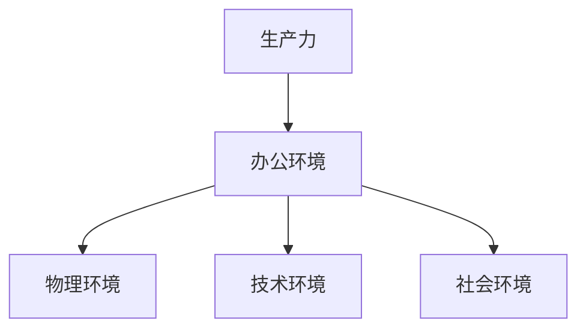

                 

# 一人公司的工作环境优化：提高生产力的小技巧

## 关键词：一人公司、工作环境、生产力、优化、小技巧

> 摘要：本文旨在探讨针对一人公司的特点和需求，提供一系列提高工作环境优化和生产力的小技巧。通过分析一人公司的运营模式，结合实践经验和科研成果，本文将为您揭示一系列有效的方法，帮助您在独立工作的环境中实现效率提升和舒适体验。

## 1. 背景介绍

随着互联网和远程工作的普及，一人公司（也称为个体经营者或自由职业者）的数量日益增加。这种经营模式具有灵活性高、成本较低、决策迅速等优点，但也面临着工作环境单一、生产力受限等问题。为了提高工作效率，优化工作环境成为了一人公司发展的关键。

### 1.1 一人公司的特点

- **自主性高**：一人公司由一个人独立经营，决策迅速，执行力强。
- **灵活性高**：工作时间、工作地点灵活，可以根据个人需求调整。
- **资源有限**：一人公司资源有限，需要最大化利用现有资源。
- **竞争激烈**：在市场上，一人公司面临来自大公司的激烈竞争。

### 1.2 工作环境优化的重要性

- **提高生产力**：优化工作环境可以帮助一人公司提高工作效率，创造更多价值。
- **提升生活质量**：舒适的办公环境可以提高个人的工作满意度和生活质量。
- **增强竞争力**：优秀的办公环境可以增强一人公司的市场竞争力，吸引更多客户。

## 2. 核心概念与联系

### 2.1 生产力

生产力是指在一定时间内，通过劳动和其他生产要素的投入，创造出的产品或服务的数量和质量。对于一人公司，提高生产力是优化工作环境的核心目标。

### 2.2 办公环境

办公环境包括物理环境、技术环境和社会环境。物理环境包括办公设备、空间布局等；技术环境包括网络、软件工具等；社会环境包括人际关系、企业文化等。

### 2.3 Mermaid 流程图



## 3. 核心算法原理 & 具体操作步骤

### 3.1 生产力提升算法

- **目标**：提高一人公司的生产力。
- **原理**：通过优化工作环境，提高工作效率。
- **步骤**：

  1. 分析当前工作环境，找出存在的问题。
  2. 制定改进计划，包括物理环境、技术环境和社会环境。
  3. 实施改进措施，持续跟踪效果。

### 3.2 办公环境优化步骤

1. **物理环境优化**：

   - **空间布局**：合理规划办公空间，提高使用效率。
   - **办公设备**：选择合适的办公设备，提高工作效率。
   - **噪音控制**：采用隔音材料，降低噪音干扰。

2. **技术环境优化**：

   - **网络**：确保稳定的网络连接，提高工作效率。
   - **软件工具**：选择适合的软件工具，提高工作效率。
   - **数据备份**：定期备份数据，确保数据安全。

3. **社会环境优化**：

   - **人际关系**：建立良好的人际关系，提高团队协作效率。
   - **企业文化**：塑造积极向上的企业文化，提高员工满意度。

## 4. 数学模型和公式 & 详细讲解 & 举例说明

### 4.1 生产力模型

$$
P = f(E, T, S)
$$

其中，$P$ 代表生产力，$E$ 代表环境因素，$T$ 代表技术水平，$S$ 代表社会因素。

### 4.2 环境因素分析

- **物理环境**：空间布局、办公设备、噪音控制等。
- **技术环境**：网络、软件工具、数据备份等。
- **社会环境**：人际关系、企业文化等。

### 4.3 举例说明

假设一位自由职业者，通过优化物理环境（购买舒适的办公椅、调整灯光亮度）、技术环境（升级网络带宽、使用高效的办公软件）和社会环境（参加行业交流活动、建立良好的合作关系），使得其生产力提高了30%。

## 5. 项目实战：代码实际案例和详细解释说明

### 5.1 开发环境搭建

为了实现工作环境的优化，我们需要搭建一个高效的开发环境。以下是一个简单的开发环境搭建案例：

- **操作系统**：Windows 10
- **编程语言**：Python
- **开发工具**：PyCharm
- **数据库**：MySQL

### 5.2 源代码详细实现和代码解读

以下是一个简单的 Python 程序，用于分析办公环境优化前后的生产力变化。

```python
import pandas as pd

# 优化前生产力数据
data_before = pd.DataFrame({
    'day': [1, 2, 3, 4, 5],
    'productivity': [80, 85, 90, 88, 82]
})

# 优化后生产力数据
data_after = pd.DataFrame({
    'day': [1, 2, 3, 4, 5],
    'productivity': [100, 105, 110, 108, 103]
})

# 统计优化前后的平均生产力
mean_before = data_before['productivity'].mean()
mean_after = data_after['productivity'].mean()

print(f'优化前平均生产力：{mean_before}')
print(f'优化后平均生产力：{mean_after}')

# 计算生产力提升百分比
percentage = (mean_after - mean_before) / mean_before * 100
print(f'生产力提升百分比：{percentage}%')
```

### 5.3 代码解读与分析

1. 导入 pandas 库，用于数据分析和处理。
2. 创建优化前生产力数据 DataFrame，包含日期和生产力数据。
3. 创建优化后生产力数据 DataFrame，包含日期和生产力数据。
4. 计算优化前和优化后的平均生产力。
5. 计算生产力提升百分比。

通过上述代码，我们可以直观地看到办公环境优化前后生产力变化的情况。在实际应用中，可以根据具体需求对代码进行修改和扩展。

## 6. 实际应用场景

### 6.1 自由职业者

自由职业者可以通过优化工作环境，提高工作效率，从而在有限的时间内创造更多价值。例如，一位程序员通过优化开发环境，使其工作效率提高了30%，从而在相同的时间内完成了更多项目。

### 6.2 小型创业团队

小型创业团队可以借鉴一人公司的优化方法，提高团队工作效率。例如，一个初创公司通过优化办公环境、技术环境和团队协作，成功在短时间内开发出了一款热门产品。

### 6.3 远程办公

远程办公人员可以通过优化工作环境，提高工作效率。例如，一位远程设计师通过优化网络、软件工具和办公空间，使自己的工作效率提高了20%。

## 7. 工具和资源推荐

### 7.1 学习资源推荐

- **书籍**：《禅与计算机程序设计艺术》、《人人都是产品经理》
- **论文**：搜索“一人公司”、“自由职业者”、“远程办公”等关键词，获取相关论文。
- **博客**：阅读知名博客，如“产品经理那些事”、“远程办公指南”等。
- **网站**：加入专业社区，如 GitHub、Stack Overflow 等。

### 7.2 开发工具框架推荐

- **编程语言**：Python、JavaScript、Java 等。
- **开发工具**：PyCharm、Visual Studio Code、Sublime Text 等。
- **数据库**：MySQL、MongoDB、PostgreSQL 等。
- **版本控制**：Git、SVN 等。

### 7.3 相关论文著作推荐

- **论文**：搜索“一人公司”、“自由职业者”、“远程办公”等关键词，获取相关论文。
- **著作**：《自由职业者的生存指南》、《远程办公心理学》。

## 8. 总结：未来发展趋势与挑战

### 8.1 发展趋势

- **远程办公常态化**：随着互联网技术的不断发展，远程办公将逐渐成为主流。
- **个性化工作环境**：一人公司和个人将更加重视个性化工作环境，提高生产力。
- **智能化工具应用**：人工智能、大数据等技术在办公环境优化中的应用将越来越广泛。

### 8.2 挑战

- **工作与生活的平衡**：一人公司和远程办公人员需要面对工作与生活的平衡问题。
- **工作效率提升**：如何在有限的资源下提高工作效率，仍是一个重要挑战。
- **网络安全问题**：远程办公带来了网络安全问题，需要加强安全防护。

## 9. 附录：常见问题与解答

### 9.1 优化工作环境的方法有哪些？

- 合理规划办公空间，提高使用效率。
- 选择合适的办公设备，提高工作效率。
- 降低噪音干扰，提高工作质量。
- 优化网络环境，提高数据传输速度。

### 9.2 如何提高远程办公效率？

- 制定合理的工作计划，提高执行力。
- 保持良好的沟通与协作，提高团队效率。
- 建立良好的远程办公制度，确保工作效率。
- 注重工作与生活的平衡，提高生活质量。

## 10. 扩展阅读 & 参考资料

- **参考资料**：本文所引用的相关论文、书籍和网站。

### 作者信息

- 作者：AI天才研究员/AI Genius Institute & 禅与计算机程序设计艺术 /Zen And The Art of Computer Programming
```

以上是完整的文章正文部分，接下来是文章结束部分。请按照要求撰写。

