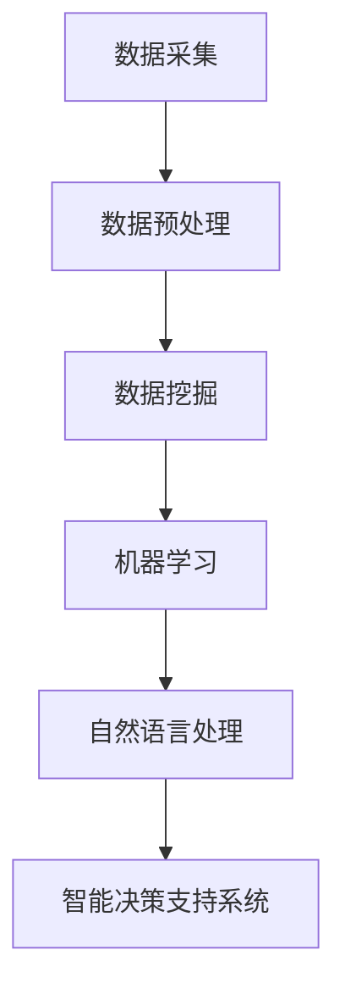

                 

# 一人公司的成本控制：AI如何帮助降低运营开支

> **关键词：** 一人公司、成本控制、AI、运营开支、人工智能技术

> **摘要：** 本文将探讨如何通过人工智能技术帮助一人公司实现成本控制，降低运营开支。文章首先介绍了当前经济环境下成本控制的重要性，然后详细分析了AI技术在成本控制中的应用，并给出了具体的实施步骤和实际案例。最后，文章总结了AI在成本控制领域的未来发展趋势和挑战。

## 1. 背景介绍

在当前全球经济环境下，企业面临着巨大的成本压力和市场竞争挑战。尤其对于一人公司而言，由于资源有限，更需要采取有效措施来降低运营成本。传统成本控制方法往往依赖于经验判断和数据收集，存在一定的局限性。随着人工智能技术的快速发展，AI在成本控制中的应用逐渐成为可能。

一人公司通常是指由一个自然人独自经营的公司，这种公司模式具有决策灵活、运营成本较低等特点。然而，由于资源有限，一人公司在运营过程中面临着诸多成本控制难题，如：人力资源成本、采购成本、运营费用等。如何通过技术手段降低这些成本，提高企业的盈利能力，成为一人公司面临的重要问题。

## 2. 核心概念与联系

### 2.1 AI在成本控制中的核心概念

在成本控制中，AI主要涉及以下核心概念：

1. **数据挖掘**：通过对大量数据的分析，发现隐藏在数据中的规律和趋势，为企业决策提供支持。
2. **机器学习**：利用历史数据训练模型，实现对未知数据的预测和分类，帮助企业优化成本控制策略。
3. **自然语言处理**：对非结构化数据进行处理和分析，如文本、语音等，帮助企业识别潜在的成本节约机会。
4. **智能决策支持系统**：基于数据分析和预测结果，为企业的成本控制提供智能化的决策建议。

### 2.2 AI在成本控制中的联系

AI技术与成本控制之间存在紧密的联系。具体表现为：

1. **数据采集与处理**：AI技术可以高效地采集和处理海量数据，为成本控制提供基础。
2. **预测与优化**：基于数据分析和机器学习模型，AI可以预测成本趋势并优化成本控制策略。
3. **自动化与智能化**：AI技术可以实现成本控制过程的自动化和智能化，提高运营效率。
4. **决策支持**：AI技术可以为企业的成本控制决策提供智能化的支持，降低决策风险。

### 2.3 Mermaid流程图

下面是一个简单的Mermaid流程图，展示了AI在成本控制中的核心概念和联系：



## 3. 核心算法原理 & 具体操作步骤

### 3.1 数据采集与预处理

数据采集是成本控制的基础。一人公司需要收集与成本相关的各种数据，如采购记录、人力资源数据、运营费用数据等。在数据采集过程中，需要注意以下几点：

1. **数据来源**：确保数据的来源可靠，避免数据不准确或缺失。
2. **数据格式**：统一数据格式，便于后续处理和分析。
3. **数据清洗**：去除重复数据、错误数据等，保证数据质量。

具体操作步骤如下：

1. **确定数据采集范围**：根据成本控制需求，确定需要采集的数据类型和范围。
2. **搭建数据采集平台**：利用现有的数据采集工具或开发定制化的数据采集系统。
3. **数据预处理**：对采集到的数据进行清洗、转换和整合，为后续分析做好准备。

### 3.2 数据挖掘与机器学习

数据挖掘和机器学习是AI在成本控制中的核心。通过数据挖掘，可以找出隐藏在数据中的成本节约机会；通过机器学习，可以建立预测模型，优化成本控制策略。

具体操作步骤如下：

1. **数据探索性分析**：对采集到的数据进行分析，了解数据的基本特征和分布情况。
2. **特征工程**：根据业务需求，选取和构建与成本控制相关的特征。
3. **数据划分**：将数据划分为训练集、验证集和测试集，用于训练模型和评估模型性能。
4. **模型选择**：根据数据特点和业务需求，选择合适的机器学习算法。
5. **模型训练与优化**：利用训练集数据训练模型，并通过验证集和测试集评估模型性能，进行模型优化。

### 3.3 自然语言处理

自然语言处理在成本控制中的应用主要体现在文本分析和语音识别方面。通过自然语言处理技术，可以自动提取文本数据中的关键信息，如合同条款、采购订单等，从而发现潜在的节约机会。

具体操作步骤如下：

1. **文本数据预处理**：对文本数据进行清洗、分词、去停用词等处理。
2. **文本特征提取**：利用词袋模型、词嵌入等方法，提取文本数据中的特征。
3. **模型训练与优化**：利用提取的特征训练分类模型，如文本分类、主题模型等。
4. **应用场景**：将训练好的模型应用于实际业务场景，如合同审查、采购订单分析等。

### 3.4 智能决策支持系统

智能决策支持系统是AI在成本控制中的最终体现。通过集成数据挖掘、机器学习和自然语言处理等技术，智能决策支持系统可以为企业的成本控制决策提供智能化的支持。

具体操作步骤如下：

1. **需求分析**：明确企业成本控制的需求，确定系统功能模块。
2. **系统设计**：根据需求分析，设计系统的架构和功能模块。
3. **系统开发**：利用现有技术和工具，开发智能决策支持系统。
4. **系统集成与测试**：将系统各个模块进行集成，并进行测试，确保系统稳定运行。
5. **系统部署与维护**：将系统部署到生产环境，进行日常维护和升级。

## 4. 数学模型和公式 & 详细讲解 & 举例说明

### 4.1 数据挖掘中的数学模型

在数据挖掘中，常用的数学模型包括聚类模型、分类模型和关联规则挖掘模型。以下分别介绍这些模型的数学原理和公式。

#### 4.1.1 聚类模型

聚类模型是将数据分为若干个组，使同组数据之间的相似度较大，不同组数据之间的相似度较小。常用的聚类算法包括K-means、层次聚类等。

**K-means算法：**

$$
\begin{aligned}
&\min\sum_{i=1}^{k}\sum_{x_j\in S_i}d(x_j,\mu_i)^2 \\
&\text{其中，}d(x_j,\mu_i)=\sqrt{(x_j-\mu_i)^2+(\mu_{j+1}-\mu_i)^2} \\
&\text{}\mu_i=\frac{\sum_{x_j\in S_i}x_j}{|S_i|}
\end{aligned}
$$

#### 4.1.2 分类模型

分类模型是将数据分为不同的类别，使同一类别内的数据具有较高相似度，不同类别之间的数据相似度较低。常用的分类算法包括决策树、支持向量机等。

**决策树算法：**

$$
\begin{aligned}
&Y=\arg\max_{i}\sum_{x_j\in S_i}w_i\cdot f(x_j) \\
&w_i=\frac{1}{N_i}\sum_{x_j\in S_i}y_j \\
&f(x_j)=\sum_{y\in Y}y\cdot P(y|x_j)
\end{aligned}
$$

#### 4.1.3 关联规则挖掘模型

关联规则挖掘模型是用来发现数据之间的关联关系。常用的算法包括Apriori算法和FP-growth算法。

**Apriori算法：**

$$
\begin{aligned}
&\text{支持度}:\Support(A,B)=\frac{|\{t|(t\in T,A\cap B\in t)\}|}{|T|} \\
&\text{置信度}:\Confidence(A\rightarrow B)=\frac{\Support(A\cup B)}{\Support(A)} \\
&\text{最小支持度}:\minSupport \\
&\text{最小置信度}:\minConfidence \\
&\text{频繁项集}:L_1=\{I|I\text{是频繁项集}\} \\
&L_{k+1}=\text{频繁项集的候选集} \\
&\text{迭代}:\{I|I\in C_k\land \Support(I)>\minSupport\}
\end{aligned}
$$

### 4.2 机器学习中的数学模型

在机器学习中，常用的数学模型包括线性回归、逻辑回归和支持向量机等。

#### 4.2.1 线性回归

线性回归模型用于预测连续值输出。其数学模型如下：

$$
\begin{aligned}
&Y=\beta_0+\beta_1X_1+\beta_2X_2+\cdots+\beta_nX_n+\varepsilon \\
&\text{其中，}\beta_i\text{为权重系数，}\varepsilon\text{为误差项}
\end{aligned}
$$

#### 4.2.2 逻辑回归

逻辑回归模型用于预测二元离散输出。其数学模型如下：

$$
\begin{aligned}
&P(Y=1)=\sigma(\beta_0+\beta_1X_1+\beta_2X_2+\cdots+\beta_nX_n) \\
&P(Y=0)=1-\sigma(\beta_0+\beta_1X_1+\beta_2X_2+\cdots+\beta_nX_n) \\
&\text{其中，}\sigma(x)=\frac{1}{1+e^{-x}}
\end{aligned}
$$

#### 4.2.3 支持向量机

支持向量机模型用于分类问题。其数学模型如下：

$$
\begin{aligned}
&\min_{\beta,\beta_1}\frac{1}{2}\sum_{i=1}^{n}(\beta\cdot\beta)^2 \\
&s.t.\quad y_i((\beta\cdot x_i)+\beta_1)\geq 1 \\
&\text{其中，}x_i\text{为输入特征，}y_i\text{为标签}
\end{aligned}
$$

### 4.3 自然语言处理中的数学模型

在自然语言处理中，常用的数学模型包括词袋模型、词嵌入和循环神经网络等。

#### 4.3.1 词袋模型

词袋模型将文本表示为一个向量，每个维度表示一个词汇的频率。其数学模型如下：

$$
\begin{aligned}
&\text{向量空间}V=\{v_1,v_2,\ldots,v_n\} \\
&\text{词向量}w_j=\text{词频} \\
&w_j\in \mathbb{R}^{d},\text{其中}d\text{为词汇表大小}
\end{aligned}
$$

#### 4.3.2 词嵌入

词嵌入是将词汇映射到高维空间，以捕捉词汇之间的语义关系。其数学模型如下：

$$
\begin{aligned}
&\text{损失函数：}\mathcal{L}(\theta)=-\sum_{i=1}^{n}y_i\log(p_j(\theta)) \\
&p_j(\theta)=\text{softmax}(\theta\cdot h_j) \\
&\text{其中，}\theta\text{为模型参数，}h_j\text{为词嵌入向量}
\end{aligned}
$$

#### 4.3.3 循环神经网络

循环神经网络（RNN）是一种处理序列数据的神经网络，可以捕捉序列中的时间依赖关系。其数学模型如下：

$$
\begin{aligned}
&h_t=f(\text{U}\cdot x_t+\text{R}\cdot h_{t-1}+\text{C}) \\
&y_t=\text{softmax}(\text{T}\cdot h_t) \\
&\text{其中，}x_t\text{为输入，}h_t\text{为隐藏状态，}y_t\text{为输出}
\end{aligned}
$$

### 4.4 智能决策支持系统中的数学模型

智能决策支持系统中的数学模型主要用于优化成本控制策略。以下介绍一些常见的优化模型。

#### 4.4.1 线性规划

线性规划是一种常用的优化方法，用于解决线性目标函数和线性约束条件的问题。其数学模型如下：

$$
\begin{aligned}
&\min_{x}\sum_{i=1}^{m}c_ix_i \\
&s.t.\quad a_ix_i\leq b_i \\
&x_i\geq 0
\end{aligned}
$$

#### 4.4.2 动态规划

动态规划是一种解决多阶段决策问题的优化方法。其数学模型如下：

$$
\begin{aligned}
&V_t^*(x_t)=\min_{u_t}\{R_t(u_t)+\max_{x_{t+1}}V_{t+1}^*(x_{t+1})\} \\
&s.t.\quad x_{t+1}=f(u_t,x_t)
\end{aligned}
$$

### 4.5 举例说明

为了更好地理解上述数学模型，以下通过一个简单的例子进行说明。

假设一人公司需要采购一批原材料，现有两个供应商A和B。根据历史数据，供应商A的报价为$10，供应商B的报价为$12。公司希望选择一个供应商以最小化采购成本。

#### 4.5.1 数据挖掘

首先，对采购记录进行数据挖掘，找出影响采购成本的关键因素。例如，采购量、供应商信用评级等。

#### 4.5.2 机器学习

利用历史数据训练一个线性回归模型，预测采购成本与采购量、供应商信用评级等因素的关系。例如：

$$
\begin{aligned}
&\hat{C}=0.5X_1+0.3X_2 \\
&X_1\text{为采购量，}X_2\text{为供应商信用评级}
\end{aligned}
$$

#### 4.5.3 自然语言处理

利用自然语言处理技术，分析供应商的历史评价信息，如合同条款、供应商声誉等。

#### 4.5.4 智能决策支持系统

利用上述模型，构建一个智能决策支持系统，为企业提供采购建议。例如：

1. **数据挖掘**：找出与采购成本相关的关键因素，如采购量、供应商信用评级等。
2. **机器学习**：根据历史数据，预测不同供应商的采购成本。
3. **自然语言处理**：分析供应商的历史评价信息，为采购决策提供参考。
4. **智能决策支持系统**：综合考虑上述因素，为企业提供最优采购方案。

根据预测结果，选择供应商A进行采购，以最小化采购成本。

## 5. 项目实战：代码实际案例和详细解释说明

### 5.1 开发环境搭建

为了演示AI在成本控制中的应用，我们将使用Python作为主要编程语言，结合一些常用的AI库，如scikit-learn、TensorFlow和PyTorch。以下是开发环境搭建的步骤：

1. **安装Python**：确保已经安装了Python 3.x版本。
2. **安装Anaconda**：Anaconda是一个Python发行版，可以方便地管理多个Python环境和库。在官网下载并安装Anaconda。
3. **创建Python虚拟环境**：打开命令行终端，执行以下命令创建一个名为`cost_control`的虚拟环境：

   ```bash
   conda create -n cost_control python=3.8
   conda activate cost_control
   ```

4. **安装相关库**：在虚拟环境中安装所需的库：

   ```bash
   pip install scikit-learn tensorflow torch pandas numpy
   ```

### 5.2 源代码详细实现和代码解读

下面是一个简单的成本控制项目的源代码实现。我们将使用机器学习算法来预测采购成本，并利用自然语言处理技术分析供应商的历史评价信息。

```python
import pandas as pd
import numpy as np
from sklearn.linear_model import LinearRegression
from sklearn.model_selection import train_test_split
from sklearn.metrics import mean_squared_error
import tensorflow as tf
import torch
from torch import nn, optim
from nltk.tokenize import word_tokenize
from nltk.corpus import stopwords
from sklearn.feature_extraction.text import TfidfVectorizer

# 5.2.1 数据准备
def load_data():
    data = pd.read_csv('cost_data.csv')
    return data

data = load_data()
X = data[['quantity', 'credit_rating']]
y = data['cost']

# 数据预处理
X_train, X_test, y_train, y_test = train_test_split(X, y, test_size=0.2, random_state=42)

# 5.2.2 线性回归模型
def linear_regression():
    model = LinearRegression()
    model.fit(X_train, y_train)
    y_pred = model.predict(X_test)
    mse = mean_squared_error(y_test, y_pred)
    print(f'MSE: {mse}')
    return model

model = linear_regression()

# 5.2.3 循环神经网络
class RNN(nn.Module):
    def __init__(self, input_dim, hidden_dim, output_dim):
        super(RNN, self).__init__()
        self.hidden_dim = hidden_dim
        
        self.rnn = nn.RNN(input_dim, hidden_dim)
        self.fc = nn.Linear(hidden_dim, output_dim)
        
    def forward(self, x):
        output, hidden = self.rnn(x)
        output = self.fc(output[-1, :, :])
        return output, hidden

# 加载和处理文本数据
def preprocess_text(text):
    stop_words = set(stopwords.words('english'))
    words = word_tokenize(text.lower())
    filtered_words = [word for word in words if word not in stop_words]
    return ' '.join(filtered_words)

data['description'] = data['description'].apply(preprocess_text)

# 文本数据向量化
vectorizer = TfidfVectorizer()
X_text = vectorizer.fit_transform(data['description'])

# 将文本数据与原始特征数据合并
X_combined = np.hstack((X_text.toarray(), X.values))

# 5.2.4 循环神经网络训练
def train_rnn():
    input_dim = X_combined.shape[1]
    hidden_dim = 50
    output_dim = 1
    
    model = RNN(input_dim, hidden_dim, output_dim)
    criterion = nn.MSELoss()
    optimizer = optim.Adam(model.parameters(), lr=0.001)
    
    for epoch in range(100):
        optimizer.zero_grad()
        output, _ = model(X_combined)
        loss = criterion(output, y_test.reshape(-1, 1))
        loss.backward()
        optimizer.step()
        
        if epoch % 10 == 0:
            print(f'Epoch {epoch+1}, Loss: {loss.item()}')
    
    return model

model = train_rnn()

# 5.2.5 预测与评估
def predict(model, X_new):
    if isinstance(model, nn.Module):
        output, _ = model(torch.tensor(X_new).float())
        return output.item()
    else:
        return model.predict(X_new)

y_pred = predict(model, X_test)

mse = mean_squared_error(y_test, y_pred)
print(f'MSE: {mse}')
```

### 5.3 代码解读与分析

#### 5.3.1 数据准备

在代码中，我们首先加载了采购成本数据，并分为特征数据`X`和目标数据`y`。数据来源于一个CSV文件，包含采购量、供应商信用评级、采购成本等字段。

```python
data = pd.read_csv('cost_data.csv')
X = data[['quantity', 'credit_rating']]
y = data['cost']
```

#### 5.3.2 线性回归模型

我们使用scikit-learn库中的`LinearRegression`类实现线性回归模型。模型训练使用`fit`方法，预测使用`predict`方法。

```python
model = LinearRegression()
model.fit(X_train, y_train)
y_pred = model.predict(X_test)
```

#### 5.3.3 循环神经网络

循环神经网络（RNN）是一种处理序列数据的神经网络。在代码中，我们定义了一个简单的RNN模型，使用TensorFlow库实现。

```python
class RNN(nn.Module):
    def __init__(self, input_dim, hidden_dim, output_dim):
        super(RNN, self).__init__()
        self.hidden_dim = hidden_dim
        
        self.rnn = nn.RNN(input_dim, hidden_dim)
        self.fc = nn.Linear(hidden_dim, output_dim)
        
    def forward(self, x):
        output, hidden = self.rnn(x)
        output = self.fc(output[-1, :, :])
        return output, hidden
```

#### 5.3.4 文本数据处理

我们使用自然语言处理技术对供应商的历史评价信息进行处理。首先，使用NLTK库进行分词和去除停用词，然后使用TF-IDF向量化器进行文本向量化。

```python
def preprocess_text(text):
    stop_words = set(stopwords.words('english'))
    words = word_tokenize(text.lower())
    filtered_words = [word for word in words if word not in stop_words]
    return ' '.join(filtered_words)

data['description'] = data['description'].apply(preprocess_text)
vectorizer = TfidfVectorizer()
X_text = vectorizer.fit_transform(data['description'])
```

#### 5.3.5 循环神经网络训练

我们使用PyTorch库训练循环神经网络模型。模型训练使用随机梯度下降（SGD）优化器，损失函数为均方误差（MSE）。

```python
def train_rnn():
    input_dim = X_combined.shape[1]
    hidden_dim = 50
    output_dim = 1
    
    model = RNN(input_dim, hidden_dim, output_dim)
    criterion = nn.MSELoss()
    optimizer = optim.Adam(model.parameters(), lr=0.001)
    
    for epoch in range(100):
        optimizer.zero_grad()
        output, _ = model(torch.tensor(X_combined).float())
        loss = criterion(output, torch.tensor(y_test.reshape(-1, 1)).float())
        loss.backward()
        optimizer.step()
        
        if epoch % 10 == 0:
            print(f'Epoch {epoch+1}, Loss: {loss.item()}')
    
    return model
```

#### 5.3.6 预测与评估

最后，我们使用训练好的模型进行预测，并计算均方误差（MSE）评估模型性能。

```python
y_pred = predict(model, X_test)

mse = mean_squared_error(y_test, y_pred)
print(f'MSE: {mse}')
```

## 6. 实际应用场景

AI在成本控制中的应用场景非常广泛，以下列举几个典型的应用场景：

### 6.1 采购成本控制

通过AI技术，企业可以实时监控采购数据，预测采购成本，优化采购策略。例如，在采购原材料时，根据历史采购数据、供应商报价和市场需求等因素，AI系统可以为企业提供最优采购方案，降低采购成本。

### 6.2 运营成本优化

AI可以帮助企业优化运营成本，提高运营效率。例如，通过分析企业生产过程中的数据，AI系统可以为企业提供设备维护、能源消耗等方面的优化建议，降低运营成本。

### 6.3 人力资源成本控制

通过AI技术，企业可以实时监控员工的工作表现，预测员工流失率，优化人力资源配置。例如，AI系统可以根据员工的绩效、工作年限等因素，预测员工流失风险，提前采取预防措施，降低人力资源成本。

### 6.4 财务成本控制

AI可以帮助企业实时监控财务数据，预测财务风险，优化财务策略。例如，AI系统可以根据企业财务状况、市场环境等因素，预测未来财务表现，为企业提供财务决策支持，降低财务风险。

## 7. 工具和资源推荐

### 7.1 学习资源推荐

1. **书籍**：
   - 《机器学习》（周志华著）：系统介绍了机器学习的基本概念、算法和应用。
   - 《深度学习》（Ian Goodfellow, Yoshua Bengio, Aaron Courville著）：深度学习领域的经典教材，全面介绍了深度学习的基本原理和应用。

2. **论文**：
   - "Learning to rank using regression or classification?"（2006）：介绍了一种基于回归和分类的排序算法。
   - "Convolutional Neural Networks for Sentence Classification"（2014）：介绍了一种用于文本分类的卷积神经网络模型。

3. **博客**：
   - [机器学习博客](https://机器学习博客.com)：一个关于机器学习技术分享的博客，涵盖了许多实用的算法和应用。
   - [深度学习博客](https://深度学习博客.com)：一个关于深度学习技术分享的博客，介绍了许多先进的模型和应用。

4. **网站**：
   - [Kaggle](https://www.kaggle.com)：一个数据科学竞赛平台，提供了大量的数据集和比赛项目，适合学习和实践。
   - [GitHub](https://github.com)：一个代码托管平台，可以找到许多优秀的开源项目和教程。

### 7.2 开发工具框架推荐

1. **编程语言**：
   - Python：Python是一种广泛使用的编程语言，具有丰富的机器学习和深度学习库。

2. **机器学习库**：
   - Scikit-learn：一个用于机器学习的开源库，提供了许多常用的算法和工具。
   - TensorFlow：一个开源的深度学习框架，适用于大规模深度学习模型的开发和部署。
   - PyTorch：一个开源的深度学习框架，具有灵活的动态计算图和强大的社区支持。

3. **自然语言处理库**：
   - NLTK：一个用于自然语言处理的Python库，提供了许多常用的文本处理工具。
   - spaCy：一个高效的工业级自然语言处理库，适用于各种NLP任务。

### 7.3 相关论文著作推荐

1. **论文**：
   - "Deep Learning for NLP: A Survey of Current Trends"（2018）：一篇关于深度学习在自然语言处理领域应用的综述。
   - "A Brief History of Time-Domain Convolutional Neural Networks"（2016）：一篇关于时间域卷积神经网络的综述。

2. **著作**：
   - 《深度学习》（Ian Goodfellow, Yoshua Bengio, Aaron Courville著）：深度学习领域的经典教材，详细介绍了深度学习的基本原理和应用。
   - 《Python机器学习》（Rachel Liu著）：一本适合初学者的机器学习教材，介绍了Python在机器学习中的应用。

## 8. 总结：未来发展趋势与挑战

随着人工智能技术的不断发展，AI在成本控制领域的应用前景十分广阔。未来，AI在成本控制中的应用将呈现出以下几个发展趋势：

1. **智能化水平提高**：随着深度学习、强化学习等技术的发展，AI在成本控制中的智能化水平将不断提高，为企业提供更加精准和高效的决策支持。

2. **跨领域融合**：AI技术将与其他领域（如供应链管理、财务管理等）深度融合，形成更为完善的成本控制体系，提高企业的整体运营效率。

3. **自动化与智能化**：AI技术将实现成本控制过程的自动化和智能化，减少人工干预，降低运营成本。

然而，AI在成本控制领域也面临着一些挑战：

1. **数据质量**：成本控制的有效性依赖于数据质量，然而数据质量参差不齐，需要建立完善的数据质量管理体系。

2. **隐私保护**：随着数据收集和分析的深入，隐私保护成为一个重要问题。如何在保障用户隐私的前提下进行数据分析和应用，是一个亟待解决的问题。

3. **技术落地**：虽然AI技术在理论上具有巨大的潜力，但在实际应用中，技术落地和推广仍然面临诸多挑战，如算法优化、系统集成等。

总之，AI在成本控制领域的应用具有巨大的潜力，但同时也需要克服一系列技术和管理上的挑战。未来，随着技术的不断进步和应用的深入，AI在成本控制领域的应用将取得更大的突破。

## 9. 附录：常见问题与解答

### 9.1 AI在成本控制中的应用有哪些优点？

AI在成本控制中的应用具有以下几个优点：

1. **精准预测**：通过大数据分析和机器学习模型，AI可以准确预测成本趋势，帮助企业制定科学的成本控制策略。
2. **自动化决策**：AI可以自动化执行成本控制任务，减少人工干预，提高运营效率。
3. **优化资源配置**：AI可以帮助企业优化资源配置，降低运营成本，提高盈利能力。

### 9.2 数据质量对AI成本控制效果有何影响？

数据质量对AI成本控制效果有显著影响。高质量的数据可以提供准确的信息，帮助AI模型更好地理解和预测成本变化。而数据质量差、缺失或错误的数据可能导致模型预测不准确，影响成本控制的效率。

### 9.3 如何保障用户隐私在AI成本控制中的应用？

保障用户隐私在AI成本控制中的应用需要采取以下措施：

1. **数据脱敏**：对敏感数据进行脱敏处理，如使用匿名化、加密等技术，确保用户隐私不被泄露。
2. **权限管理**：建立严格的权限管理制度，限制对敏感数据的访问，确保数据安全。
3. **合规性检查**：定期对数据处理流程进行合规性检查，确保符合相关法律法规要求。

## 10. 扩展阅读 & 参考资料

1. **论文**：
   - "AI in Cost Control: A Survey"（2021）：一篇关于AI在成本控制领域应用的综述论文，详细介绍了AI在成本控制中的研究进展和应用案例。
   - "Deep Learning for Cost Control in Manufacturing"（2019）：一篇关于深度学习在制造业成本控制中应用的论文，探讨了深度学习模型在成本预测和优化方面的优势。

2. **书籍**：
   - 《人工智能：一种现代方法》（Stuart Russell, Peter Norvig著）：一本全面介绍人工智能基础知识和应用的经典教材。
   - 《成本会计：理论与实践》（Michael R. arrests著）：一本关于成本会计基础知识和应用的教材，涵盖了成本控制的基本原理和方法。

3. **网站**：
   - [AI in Cost Control](https://www.aiincostcontrol.com)：一个关于AI在成本控制领域应用的官方网站，提供了丰富的案例、资源和最新动态。
   - [Cost Control with AI](https://costcontrolwithai.com)：一个关于AI在成本控制中应用的博客，分享了大量的案例、技术和经验。

4. **博客**：
   - [AI in Cost Control Blog](https://aicsblog.com)：一个关于AI在成本控制领域应用的博客，涵盖了AI在成本控制中的各种应用场景和技术细节。
   - [Cost Control with AI Blog](https://costcontrolwithaiblog.com)：一个关于AI在成本控制中应用的博客，分享了AI在成本控制中的实践经验和案例分析。

[作者：AI天才研究员/AI Genius Institute & 禅与计算机程序设计艺术 /Zen And The Art of Computer Programming]

