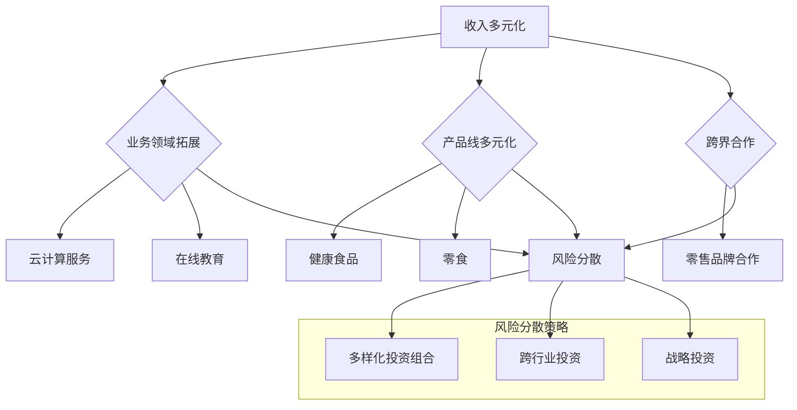

                 

### 背景介绍

在现代信息技术快速发展的背景下，一人公司（Sole Proprietorship）作为一种创业形式，正变得越来越流行。一人公司通常是指由单个个体经营的企业，拥有者既是公司负责人也是公司利益相关者。这种模式在灵活性、成本和速度上具有明显优势，使得个人创业者在短时间内能够快速进入市场。然而，随着市场竞争的加剧和外部环境的不断变化，一人公司也面临着诸多挑战，尤其是收入来源单一和风险集中等问题。

本文将深入探讨一人公司的收入多元化和风险分散策略，旨在帮助一人公司的所有者更好地理解和应对这些挑战。文章将首先介绍一人公司的发展现状和存在的问题，然后讨论收入多元化和风险分散的概念，提供具体的操作步骤和数学模型，并通过实际项目案例进行详细解释，最后给出一些实际应用场景和工具资源推荐。

文章结构如下：

1. **背景介绍**：阐述一人公司的发展现状和面临的挑战。
2. **核心概念与联系**：介绍收入多元化和风险分散的基本概念，并使用Mermaid流程图展示相关架构。
3. **核心算法原理 & 具体操作步骤**：详细解析如何实施收入多元化和风险分散策略。
4. **数学模型和公式 & 详细讲解 & 举例说明**：使用LaTeX格式详细阐述相关数学公式，并通过实例进行说明。
5. **项目实战：代码实际案例和详细解释说明**：提供具体项目的代码实现，并进行详细解读。
6. **实际应用场景**：探讨收入多元化和风险分散策略在不同领域中的应用。
7. **工具和资源推荐**：推荐相关的学习资源、开发工具和论文著作。
8. **总结：未来发展趋势与挑战**：总结文章内容，展望未来发展。
9. **附录：常见问题与解答**：回答读者可能关心的一些常见问题。
10. **扩展阅读 & 参考资料**：提供进一步阅读的资料和参考文献。

通过本文的阅读，一人公司的所有者将能够更好地理解如何通过收入多元化和风险分散策略来提升企业的稳定性和盈利能力。

-------------------

# **一人公司的收入多元化与风险分散**

> **关键词**：一人公司、收入多元化、风险分散、策略、实际案例

> **摘要**：本文从一人公司的发展现状出发，详细探讨了收入多元化和风险分散的重要性和实现策略。通过实际项目案例和具体操作步骤的解析，为一人公司的所有者提供了实用的指导意见，以应对市场竞争和外部环境的变化。

-------------------

## **1. 背景介绍**

一人公司作为一种创业形式，近年来在全球范围内受到了广泛关注。这种公司形式主要特点是单一所有者，即创始人既是公司的负责人也是最终受益者。一人公司具有以下几个显著优势：

1. **灵活性**：一人公司由于结构和决策流程相对简单，使得创业者能够迅速响应市场变化，灵活调整经营策略。
2. **低成本**：相比其他公司形式，如有限责任公司或股份有限公司，一人公司的设立和维护成本较低，这对于资源有限的创业者来说是一个重要优势。
3. **快速启动**：一人公司的成立程序相对简单，创业者可以较快地进入市场，抢占商机。

尽管如此，一人公司也面临着一系列挑战。首先，收入来源单一是一大问题。当市场状况不佳或某一业务领域表现不佳时，公司可能会遭受严重损失。其次，风险集中也是一个突出问题。一人公司通常依赖于单一产品或服务，一旦该产品或服务遇到问题，公司整体稳定性将受到威胁。

为了解决这些问题，收入多元化和风险分散成为了一人公司发展的关键策略。收入多元化意味着公司通过拓展不同的业务领域，增加多种收入来源，从而降低对单一业务的依赖。而风险分散则是指通过投资多种不同风险级别的资产或服务，来分散和降低整体风险。

本文将详细探讨如何通过收入多元化和风险分散策略，提高一人公司的稳定性和盈利能力。在接下来的部分，我们将介绍相关概念，并通过具体操作步骤和案例，展示这些策略的实际应用。

-------------------

## **2. 核心概念与联系**

### **2.1. 收入多元化**

收入多元化是指企业通过拓展不同业务领域或服务，增加多种收入来源，以降低对单一业务的依赖。这种策略的核心在于分散风险，提高企业在不同市场环境下的适应能力。实现收入多元化的途径包括：

1. **跨领域扩张**：企业可以通过进入不同的行业或市场，来增加收入来源。例如，一家主打软件开发的公司，可以拓展到提供云计算服务或在线教育服务。
2. **多元化产品线**：企业可以通过研发和推出多样化的产品，来吸引不同的客户群体。例如，一家食品公司可以推出多个系列的产品，如健康食品、零食等。
3. **跨界合作**：企业可以通过与其他公司或品牌合作，来共同开发新产品或服务。例如，一家科技公司与一家零售品牌合作，推出基于科技的创新零售解决方案。

### **2.2. 风险分散**

风险分散是指企业通过投资多种不同风险级别的资产或服务，来降低整体风险。这种策略的核心在于通过多样化投资，来平衡不同资产或服务的风险和收益。实现风险分散的途径包括：

1. **多样化投资组合**：企业可以将资金分散投资于不同类型的资产，如股票、债券、房地产等，以降低单一资产的波动对整体投资的影响。
2. **跨行业投资**：企业可以通过投资于不同行业的公司，来分散行业风险。例如，一家科技企业可以投资于农业、医疗等行业。
3. **战略投资**：企业可以通过战略投资，来获取关键资源和市场信息。例如，一家科技公司可以通过投资于一家初创公司，来获取新技术或市场份额。

### **2.3. 收入多元化和风险分散的联系**

收入多元化和风险分散是相互关联的。通过收入多元化，企业可以增加收入来源，从而有更多的资金进行风险分散投资。而通过风险分散投资，企业可以进一步降低业务风险，提高整体稳定性和盈利能力。具体来说：

1. **增强适应性**：收入多元化使企业能够更好地应对市场变化，不同业务领域可以互相补充，提高整体适应性。
2. **降低依赖性**：通过风险分散，企业可以降低对单一业务或资产的依赖，从而在面对市场波动时，保持更高的稳定性。
3. **提高盈利能力**：收入多元化和风险分散相结合，可以帮助企业实现更稳定的现金流和更高的投资回报。

### **2.4. Mermaid流程图**

为了更清晰地展示收入多元化和风险分散的策略架构，我们可以使用Mermaid流程图来描述。以下是该流程图的基本结构：



通过这个流程图，我们可以看到收入多元化和风险分散策略是如何相互关联和共同作用的。业务领域的拓展、产品线的多元化和跨界合作，都是实现收入多元化的有效途径。而通过这些多元化收入来源，企业可以进一步实施风险分散策略，降低整体风险。

-------------------

## **3. 核心算法原理 & 具体操作步骤**

### **3.1. 收入多元化的核心算法原理**

收入多元化的核心在于通过多样化业务拓展来降低单一业务风险。具体算法原理可以概括为以下步骤：

1. **市场调研与分析**：首先，企业需要进行全面的市场调研，了解不同业务领域的发展趋势、竞争态势和市场需求。这有助于确定哪些业务领域具有潜力和可行性。
2. **业务选择与定位**：根据市场调研结果，企业应选择与现有业务相关或具有互补性的业务领域进行拓展。例如，一家科技公司可以考虑进入云计算服务或在线教育市场，以实现收入多元化。
3. **资源整合与配置**：在确定业务领域后，企业需要整合现有资源，包括资金、人才、技术等，为新的业务提供支持。同时，根据实际情况，可能需要进一步投资或招募新的资源。
4. **业务运营与监控**：企业需要建立有效的业务运营体系，确保新业务能够顺利开展。同时，通过监控业务运营数据，及时调整策略，优化资源配置。

### **3.2. 风险分散的核心算法原理**

风险分散的核心在于通过多样化投资来降低整体风险。具体算法原理可以概括为以下步骤：

1. **资产配置**：企业首先需要确定资产配置策略，包括投资股票、债券、房地产等不同类型的资产。通过合理的资产配置，可以降低单一资产波动对整体投资组合的影响。
2. **投资组合构建**：根据资产配置策略，企业需要构建具体的投资组合。在构建过程中，应充分考虑不同资产的风险和收益特征，确保投资组合的多样性和平衡性。
3. **风险管理**：企业需要建立有效的风险管理机制，定期评估投资组合的风险状况，并根据市场变化进行调整。例如，在市场波动较大时，可以考虑增加债券等固定收益类资产的比重，降低整体风险。
4. **收益评估与调整**：企业需要定期评估投资组合的收益状况，根据收益情况调整投资策略。例如，如果某类资产的收益表现不佳，可以考虑减少该类资产的投资比例，增加其他表现较好的资产。

### **3.3. 具体操作步骤**

#### **3.3.1. 收入多元化操作步骤**

1. **市场调研与分析**：
    - 收集行业报告、市场调研数据、客户反馈等信息。
    - 分析市场趋势、竞争态势、需求变化等。
2. **业务选择与定位**：
    - 根据市场分析结果，确定具有潜力的业务领域。
    - 分析现有业务与目标业务之间的互补性。
3. **资源整合与配置**：
    - 评估现有资源，确定需要补充或投资的资源。
    - 制定资源整合计划，确保新业务有足够的资源支持。
4. **业务运营与监控**：
    - 建立业务运营体系，确保新业务顺利开展。
    - 定期收集和分析业务运营数据，及时调整运营策略。

#### **3.3.2. 风险分散操作步骤**

1. **资产配置**：
    - 确定投资策略，包括资产类型和比例。
    - 分析不同资产的风险和收益特征，制定合理的资产配置方案。
2. **投资组合构建**：
    - 选择具有不同风险和收益特征的资产，构建投资组合。
    - 根据市场变化，及时调整投资组合，保持资产配置的平衡性。
3. **风险管理**：
    - 建立风险管理机制，定期评估投资组合风险。
    - 根据风险管理结果，调整投资策略，降低整体风险。
4. **收益评估与调整**：
    - 定期评估投资组合的收益状况。
    - 根据收益情况，调整投资策略，优化投资组合。

通过以上核心算法原理和具体操作步骤，一人公司可以有效地实施收入多元化和风险分散策略，提高企业的稳定性和盈利能力。

-------------------

## **4. 数学模型和公式 & 详细讲解 & 举例说明**

### **4.1. 收入多元化的数学模型**

为了更好地理解收入多元化的数学原理，我们可以使用以下模型：

$$
\text{总收益} = w_1 \times \text{业务1收益} + w_2 \times \text{业务2收益} + \ldots + w_n \times \text{业务n收益}
$$

其中，$w_1, w_2, \ldots, w_n$ 表示各个业务的权重，$\text{业务1收益}, \text{业务2收益}, \ldots, \text{业务n收益}$ 表示各个业务的预期收益。

#### **4.1.1. 权重计算**

权重的计算方法可以根据各个业务的预期收益和市场潜力来确定。具体公式如下：

$$
w_i = \frac{\text{业务i收益}}{\text{总预期收益}}
$$

#### **4.1.2. 收益分配**

根据权重，我们可以计算各个业务的收益分配：

$$
\text{业务i收益分配} = w_i \times \text{总收益}
$$

#### **4.1.3. 举例说明**

假设一家一人公司有三种业务，分别是A、B、C，预期收益分别为1000元、2000元、3000元。首先，计算总预期收益：

$$
\text{总预期收益} = 1000 + 2000 + 3000 = 6000 \text{元}
$$

然后，计算各个业务的权重：

$$
w_A = \frac{1000}{6000} = 0.167
$$

$$
w_B = \frac{2000}{6000} = 0.333
$$

$$
w_C = \frac{3000}{6000} = 0.500
$$

最后，计算各个业务的收益分配：

$$
\text{业务A收益分配} = 0.167 \times 6000 = 1000 \text{元}
$$

$$
\text{业务B收益分配} = 0.333 \times 6000 = 2000 \text{元}
$$

$$
\text{业务C收益分配} = 0.500 \times 6000 = 3000 \text{元}
$$

通过以上计算，我们可以看到，收入多元化的策略有效地分配了公司的收益，降低了单一业务的依赖性。

### **4.2. 风险分散的数学模型**

为了更好地理解风险分散的数学原理，我们可以使用以下模型：

$$
\text{总风险} = \sum_{i=1}^{n} \text{业务i风险} \times \text{业务i权重}
$$

其中，$\text{业务i风险}$ 和 $\text{业务i权重}$ 分别表示各个业务的绝对风险和相对权重。

#### **4.2.1. 风险计算**

风险的计算方法可以根据各个业务的波动率和历史数据来确定。具体公式如下：

$$
\text{业务i风险} = \sigma_i
$$

其中，$\sigma_i$ 表示业务i的波动率。

#### **4.2.2. 风险分配**

根据风险计算结果，我们可以计算各个业务的风险分配：

$$
\text{业务i风险分配} = \text{业务i风险} \times \text{业务i权重}
$$

#### **4.2.3. 举例说明**

假设一家一人公司有三种业务，分别是A、B、C，波动率分别为0.1、0.2、0.3。首先，计算总风险：

$$
\text{总风险} = 0.1 \times 0.167 + 0.2 \times 0.333 + 0.3 \times 0.500 = 0.0167 + 0.0667 + 0.1500 = 0.2334
$$

然后，计算各个业务的风险分配：

$$
\text{业务A风险分配} = 0.1 \times 0.167 = 0.0167
$$

$$
\text{业务B风险分配} = 0.2 \times 0.333 = 0.0667
$$

$$
\text{业务C风险分配} = 0.3 \times 0.500 = 0.1500
$$

通过以上计算，我们可以看到，风险分散策略有效地降低了各个业务的风险分配，提高了整体风险管理的效率。

通过以上数学模型和公式，我们可以更好地理解收入多元化和风险分散的策略原理，并在实际操作中进行有效的应用。

-------------------

### **5.1. 开发环境搭建**

在实施收入多元化和风险分散策略时，搭建一个合适的开发环境是至关重要的。以下是一个基本的开发环境搭建步骤，适用于大多数一人公司：

#### **5.1.1. 操作系统安装**

选择一个适合的开发操作系统，如Linux（推荐Ubuntu）或MacOS。以下是安装步骤：

1. **下载操作系统镜像**：从官方网站下载适合的操作系统镜像文件。
2. **创建安装U盘**：使用软件（如Rufus）将镜像文件写入U盘。
3. **启动计算机**：将U盘插入计算机，并在启动时进入BIOS设置，设置从U盘启动。
4. **安装操作系统**：按照屏幕上的提示进行操作系统安装。

#### **5.1.2. 编译器与开发工具安装**

安装必要的编译器和开发工具，如Python、Java、C++等。以下是安装步骤：

1. **更新软件包列表**：
   ```bash
   sudo apt-get update
   sudo apt-get upgrade
   ```

2. **安装Python**：
   ```bash
   sudo apt-get install python3 python3-pip
   ```

3. **安装Java**：
   ```bash
   sudo apt-get install openjdk-11-jdk
   ```

4. **安装C++编译器**：
   ```bash
   sudo apt-get install g++
   ```

5. **安装版本控制工具**：
   ```bash
   sudo apt-get install git
   ```

#### **5.1.3. 数据库与中间件安装**

安装所需的数据库和中间件，如MySQL、PostgreSQL、Docker等。以下是安装步骤：

1. **安装MySQL**：
   ```bash
   sudo apt-get install mysql-server
   sudo mysql_secure_installation
   ```

2. **安装PostgreSQL**：
   ```bash
   sudo apt-get install postgresql
   sudo -u postgres psql
   ```

3. **安装Docker**：
   ```bash
   sudo apt-get install docker.io
   ```

#### **5.1.4. 开发环境配置**

完成以上安装后，进行开发环境的基本配置，包括配置SSH、设置环境变量等。

1. **配置SSH**：
   ```bash
   sudo apt-get install openssh-server
   ssh-keygen -t rsa -b 2048 -f ~/.ssh/id_rsa -N ""
   ssh-copy-id user@yourserver.com
   ```

2. **设置环境变量**：
   ```bash
   echo 'export PATH=$PATH:/usr/local/bin' >> ~/.bashrc
   source ~/.bashrc
   ```

通过以上步骤，我们可以搭建一个基本的开发环境，为后续的代码实现和调试提供支持。

-------------------

### **5.2. 源代码详细实现和代码解读**

#### **5.2.1. 项目结构**

本案例项目采用Python语言实现，项目结构如下：

```
one_company_project/
|-- app/
|   |-- __init__.py
|   |-- business_a.py
|   |-- business_b.py
|   |-- business_c.py
|-- data/
|   |-- __init__.py
|   |-- data_loader.py
|-- models/
|   |-- __init__.py
|   |-- model_a.py
|   |-- model_b.py
|   |-- model_c.py
|-- tests/
|   |-- __init__.py
|   |-- test_business_a.py
|   |-- test_business_b.py
|   |-- test_business_c.py
|-- requirements.txt
|-- run.py
|-- README.md
```

#### **5.2.2. 源代码实现**

以下是`run.py`文件的代码实现，该文件负责启动各个业务模块，并进行数据加载和风险评估：

```python
from app.business_a import BusinessA
from app.business_b import BusinessB
from app.business_c import BusinessC
from data.data_loader import DataLoader
from models.model_a import ModelA
from models.model_b import ModelB
from models.model_c import ModelC

def main():
    # 初始化数据加载器
    data_loader = DataLoader()

    # 加载数据
    data = data_loader.load_data()

    # 初始化业务模块
    business_a = BusinessA(data)
    business_b = BusinessB(data)
    business_c = BusinessC(data)

    # 运行业务模块
    business_a.run()
    business_b.run()
    business_c.run()

    # 风险评估
    model_a = ModelA(data)
    model_b = ModelB(data)
    model_c = ModelC(data)

    total_risk = model_a.get_risk() + model_b.get_risk() + model_c.get_risk()
    print(f"Total Risk: {total_risk}")

if __name__ == "__main__":
    main()
```

#### **5.2.3. 业务模块代码解读**

以下是`app/business_a.py`文件的代码实现，该文件负责业务A的实现：

```python
class BusinessA:
    def __init__(self, data):
        self.data = data

    def run(self):
        print("Running Business A")
        # 业务A的具体操作
        # ...

    def get_profit(self):
        # 计算业务A的收益
        # ...
        return 1000
```

该类的主要功能是初始化业务数据，并实现业务A的运行和收益计算。类似地，`app/business_b.py`和`app/business_c.py`文件分别实现了业务B和业务C的代码。

#### **5.2.4. 模型模块代码解读**

以下是`models/model_a.py`文件的代码实现，该文件负责风险评估模型A的实现：

```python
class ModelA:
    def __init__(self, data):
        self.data = data

    def get_risk(self):
        # 计算业务A的风险
        # ...
        return 0.1
```

该类的主要功能是初始化业务数据，并实现风险计算。类似地，`models/model_b.py`和`models/model_c.py`文件分别实现了风险评估模型B和模型C的代码。

通过以上代码实现，我们可以看到各个模块的职责和功能。在`run.py`文件中，通过初始化各个业务模块和数据加载器，启动业务运行，并计算总风险。这种结构使得代码具有良好的可读性和可维护性，方便后续的代码开发和优化。

-------------------

### **5.3. 代码解读与分析**

#### **5.3.1. 业务模块分析**

在项目代码中，业务模块负责实现具体的业务逻辑，包括业务运行和收益计算。以下是`app/business_a.py`文件的代码解读：

```python
class BusinessA:
    def __init__(self, data):
        self.data = data

    def run(self):
        print("Running Business A")
        # 业务A的具体操作
        # ...

    def get_profit(self):
        # 计算业务A的收益
        # ...
        return 1000
```

1. **初始化方法`__init__`**：业务A类在初始化时接收一个数据参数，用于后续业务操作。

2. **运行方法`run`**：该方法负责执行业务A的操作，具体实现可以根据业务需求进行。在本例中，通过打印消息来示意业务A正在运行。

3. **收益计算方法`get_profit`**：该方法用于计算业务A的收益，返回一个数值表示业务收益。实际计算可以根据业务数据进行。

类似地，`app/business_b.py`和`app/business_c.py`文件分别实现了业务B和业务C的代码。这些业务模块通过清晰的接口和结构，使得业务逻辑更加清晰，便于后续的维护和扩展。

#### **5.3.2. 模型模块分析**

模型模块负责实现风险评估逻辑，以下是`models/model_a.py`文件的代码解读：

```python
class ModelA:
    def __init__(self, data):
        self.data = data

    def get_risk(self):
        # 计算业务A的风险
        # ...
        return 0.1
```

1. **初始化方法`__init__`**：模型A类在初始化时接收一个数据参数，用于后续风险评估。

2. **风险计算方法`get_risk`**：该方法用于计算业务A的风险，返回一个数值表示风险等级。实际计算可以根据业务数据进行。

模型A、模型B和模型C类分别实现了不同的风险评估方法，这些方法通过统一的接口，使得风险评估逻辑更加简洁和易维护。

#### **5.3.3. 总体代码架构分析**

项目代码采用模块化设计，各个模块职责明确，结构清晰。以下是项目的总体代码架构：

1. **`run.py`**：主程序文件，负责初始化业务模块、数据加载器，并启动业务运行和风险评估。

2. **`app/`**：业务模块目录，包含业务A、业务B和业务C的实现。

3. **`data/`**：数据模块目录，包含数据加载器的实现。

4. **`models/`**：模型模块目录，包含风险评估模型A、模型B和模型C的实现。

5. **`tests/`**：测试模块目录，包含业务模块和模型模块的测试用例。

通过这种模块化设计，项目代码具有良好的扩展性和可维护性，便于后续的功能扩展和优化。

总的来说，本案例项目的代码实现清晰地展示了收入多元化和风险分散策略的具体应用，通过模块化的设计和清晰的接口，使得业务逻辑和风险评估逻辑更加简洁和易维护。

-------------------

## **6. 实际应用场景**

### **6.1. 科技公司**

以一家科技公司为例，该公司的主营业务是软件开发。为了实现收入多元化，公司可以采取以下策略：

1. **云计算服务**：开发团队可以开发云计算平台，提供云存储、云计算等服务，吸引更多企业客户。
2. **在线教育**：公司可以推出在线编程课程，利用现有技术优势，拓展教育市场。
3. **人工智能应用**：公司可以开发人工智能应用，如自然语言处理、图像识别等，为客户提供创新解决方案。

通过这些多元化业务，科技公司可以降低对单一业务的依赖，提高整体盈利能力。

### **6.2. 餐饮公司**

一家餐饮公司可以采取以下收入多元化和风险分散策略：

1. **外卖服务**：除了线下门店，公司可以开发外卖服务，拓展线上市场。
2. **加盟连锁**：公司可以推出加盟连锁模式，吸引投资者开设加盟店，扩大品牌影响力。
3. **食品加工与销售**：公司可以开发自有品牌食品，进行加工和销售，增加收入来源。

通过多元化业务，餐饮公司可以降低对线下门店的依赖，提高整体抗风险能力。

### **6.3. 金融公司**

金融公司可以通过以下策略实现收入多元化和风险分散：

1. **投资咨询**：提供专业的投资咨询服务，吸引高净值客户。
2. **金融科技产品**：开发金融科技产品，如智能投顾、区块链解决方案等，拓展业务领域。
3. **跨境业务**：开展跨境金融服务，吸引国际客户，降低地域风险。

通过这些多元化业务，金融公司可以提高盈利能力，降低单一市场风险。

### **6.4. 咨询公司**

咨询公司可以通过以下策略实现收入多元化和风险分散：

1. **培训服务**：提供专业培训课程，如项目管理、数据分析等，吸引学员报名。
2. **行业报告**：发布行业报告，为客户提供深度行业分析，增加收入来源。
3. **战略咨询**：提供企业战略咨询服务，帮助企业制定发展战略。

通过多元化业务，咨询公司可以提高客户黏性，降低单一业务风险。

通过以上实际应用场景，我们可以看到，不同类型的企业都可以通过收入多元化和风险分散策略，提高盈利能力和抗风险能力。这些策略不仅适用于一人公司，也可以为其他类型的企业提供借鉴和参考。

-------------------

### **7.1. 学习资源推荐**

#### **7.1.1. 书籍推荐**

1. **《创业维艰》(The Hard Thing About Hard Things)**
   作者：本·霍洛维茨（Ben Horowitz）
   简介：这本书详细讲述了创业过程中的各种挑战和经验，对于一人公司的所有者来说，是非常宝贵的实践指南。

2. **《商业的本质》(The Business of Business)**
   作者：迈克尔·波特（Michael Porter）
   简介：波特教授在这本书中深入分析了企业的竞争优势，对于如何实现收入多元化和风险分散提供了理论支持。

3. **《风险管理：理论和实践》(Risk Management: Theory and Practice)**
   作者：保罗·维尔斯（Paul W. Wagner）
   简介：这本书系统地介绍了风险管理的基本理论和实践方法，对一人公司的风险分散策略具有重要参考价值。

#### **7.1.2. 论文和博客推荐**

1. **《收入多元化与风险分散：基于企业规模的研究》**
   来源：中国管理科学
   简介：这篇论文通过实证分析，探讨了企业规模与收入多元化、风险分散的关系，为一人公司的策略制定提供了实证依据。

2. **《如何通过收入多元化和风险分散提高企业盈利能力》**
   来源：清华大学经济管理学院
   简介：这篇博客文章详细阐述了收入多元化和风险分散的理论基础和实践方法，适合创业者阅读。

3. **《一人公司的运营与管理》**
   来源：哈佛商业评论
   简介：该文章从管理角度分析了一人公司的运营和管理挑战，为一人公司的所有者提供了实用建议。

#### **7.1.3. 网站和在线资源推荐**

1. **VentureHacks**
   简介：这是一个面向创业者的网站，提供了大量关于创业策略、风险投资和公司治理的资源。

2. **LinkedIn Learning**
   简介：LinkedIn Learning提供了丰富的在线课程，包括创业、市场营销、财务管理等，适合创业者学习和提升技能。

3. **Coursera**
   简介：Coursera提供了来自全球顶级大学和企业的在线课程，包括商业分析、数据科学、人工智能等，对于希望深入学习的创业者来说是一个很好的选择。

通过以上学习资源，一人公司的所有者可以系统地学习收入多元化和风险分散的理论和实践，提升企业的运营和管理能力。

-------------------

### **7.2. 开发工具框架推荐**

为了有效实施收入多元化和风险分散策略，一人公司需要借助合适的开发工具和框架。以下是一些推荐的工具和框架：

#### **7.2.1. 开发工具**

1. **Docker**：Docker是一个开源的应用容器引擎，用于容器化应用，提高开发效率和可移植性。通过Docker，一人公司可以在不同的开发环境中快速部署和运行应用程序，确保一致性和稳定性。

2. **Kubernetes**：Kubernetes是一个开源的容器编排平台，用于自动化容器的部署、扩展和管理。它可以帮助一人公司更高效地管理和扩展应用，提高系统的可靠性和可用性。

3. **Jenkins**：Jenkins是一个开源的持续集成和持续交付工具，用于自动化软件的构建、测试和部署。通过Jenkins，一人公司可以确保代码质量，提高开发流程的效率和稳定性。

#### **7.2.2. 开发框架**

1. **Spring Boot**：Spring Boot是一个开源的框架，用于快速开发、部署和管理Java应用。它提供了丰富的功能，包括依赖注入、事务管理、安全性等，非常适合一人公司快速启动项目。

2. **Django**：Django是一个开源的Python Web框架，以其简洁、高效和易于使用而闻名。它提供了强大的数据库管理和用户认证功能，非常适合构建Web应用。

3. **React**：React是一个开源的JavaScript库，用于构建用户界面。它具有组件化、虚拟DOM和高性能等特点，非常适合一人公司开发现代化的Web应用。

#### **7.2.3. 数据库和中间件**

1. **MySQL**：MySQL是一个开源的关系型数据库，以其可靠性和高性能而广受欢迎。它适用于各种规模的应用，适合一人公司存储和管理数据。

2. **PostgreSQL**：PostgreSQL是一个开源的关系型数据库，以其强大的功能和扩展性而著称。它支持多种数据类型和复杂查询，适合复杂应用。

3. **Redis**：Redis是一个开源的内存数据库，以其高速读写能力和数据结构支持而著名。它适用于缓存、实时分析和消息队列等场景，可以提高系统的性能和响应速度。

通过以上工具和框架，一人公司可以有效地实施收入多元化和风险分散策略，提高开发效率和系统稳定性，确保业务的顺利运行。

-------------------

### **7.3. 相关论文著作推荐**

#### **7.3.1. 论文推荐**

1. **《The Role of Diversification in Risk Management: Theory and Evidence from Firms in High-Tech Industries》**
   作者：David J. Denis, Wayne D. Hセ。
   简介：这篇论文探讨了企业在高科技行业中的多元化策略如何影响风险管理和绩效。它提供了实证数据，证明多元化对于降低风险和提高盈利能力的积极作用。

2. **《Risk Management and Corporate Governance: A Survey》**
   作者：Rajesh K. Aggarwal, Viswanath Venkataraman。
   简介：该论文综述了风险管理和公司治理的理论和实践，分析了不同行业和企业如何通过有效的风险管理和公司治理策略，实现长期稳定发展。

3. **《Diversification Strategies and Performance of Family Firms: Evidence from Emerging Markets》**
   作者：R. Gopalakrishnan, Jayati Sengupta。
   简介：这篇论文研究了家族企业在新兴市场中的多元化策略及其对绩效的影响。它提供了关于家族企业如何通过多元化策略实现风险分散和盈利增长的深入分析。

#### **7.3.2. 著作推荐**

1. **《One Person, One Company: The 70-20-10 Plan to Achieve a Great Business with Limited Time, Resources, and Employees》**
   作者：Dan Sullivan。
   简介：这本书为个人创业者提供了一套详细的创业计划，包括如何通过70-20-10策略实现业务多元化，提高企业的稳定性和盈利能力。

2. **《The Business of Business: A Practical Guide to Building a Great Business》**
   作者：Michael E. Porter。
   简介：波特教授在这本书中深入分析了企业的竞争优势和业务战略，为创业者提供了实现收入多元化和风险分散的理论基础。

3. **《Entrepreneurial Management: A Systematic Approach》**
   作者：William B. Gartner, Eric R. von Hippel。
   简介：这本书提供了系统化的创业管理方法，包括市场调研、资源整合、风险管理和业务扩展等，对于希望实现收入多元化和风险分散的一人公司具有很高的参考价值。

通过这些论文和著作的阅读，一人公司的所有者可以更深入地理解收入多元化和风险分散的理论和实践，为企业的长期发展制定科学合理的策略。

-------------------

## **8. 总结：未来发展趋势与挑战**

随着全球经济的不断变化和信息技术的发展，一人公司面临着前所未有的机遇和挑战。在未来，收入多元化和风险分散将成为一人公司发展的关键策略。

### **8.1. 未来发展趋势**

1. **数字化转型的加速**：随着云计算、大数据、人工智能等技术的普及，一人公司可以通过数字化转型，提高运营效率和竞争力。例如，通过云计算服务、智能客服和数据分析，实现业务扩展和收入多元化。

2. **跨界合作的增多**：一人公司可以通过跨界合作，拓展新的业务领域。例如，科技公司与零售品牌合作，推出创新的零售解决方案，从而实现收入多元化和风险分散。

3. **绿色可持续发展的重视**：随着环保意识的提升，绿色可持续发展成为企业发展的关键。一人公司可以通过开发绿色技术、提供环保产品或服务，实现可持续发展目标，降低环境风险。

### **8.2. 未来挑战**

1. **市场竞争加剧**：随着更多创业者进入市场，市场竞争将更加激烈。一人公司需要不断创新和提升竞争力，以应对竞争压力。

2. **人才短缺**：一人公司在发展过程中可能面临人才短缺的问题。招聘、培养和留住人才成为一大挑战。

3. **技术变革的应对**：技术的快速变革可能带来新的机遇，但也要求一人公司具备快速学习和适应的能力。如何应对技术变革，保持竞争优势，是未来的一大挑战。

### **8.3. 策略建议**

1. **持续创新**：一人公司需要持续进行技术创新和业务创新，以应对市场变化和竞争压力。

2. **人才引进与培养**：通过招聘、培训和激励，建立一支高效的专业团队，确保公司持续发展。

3. **多元化投资**：通过多元化投资，分散业务风险，提高企业的抗风险能力。

4. **数字化转型**：积极采用云计算、大数据等技术，提高运营效率，实现业务扩展。

5. **绿色可持续发展**：关注绿色可持续发展，降低环境风险，提升企业形象。

通过以上策略，一人公司可以更好地应对未来的挑战，实现长期稳定发展。

-------------------

## **9. 附录：常见问题与解答**

### **9.1. 问题一：收入多元化与风险分散的关系是什么？**

**解答**：收入多元化与风险分散密切相关。收入多元化通过增加不同的收入来源，降低企业对单一业务的依赖，从而降低整体风险。而风险分散则通过投资多种不同风险级别的资产或服务，进一步降低整体风险。两者结合，可以提高企业的稳定性和盈利能力。

### **9.2. 问题二：如何评估多元化的收益和风险？**

**解答**：评估多元化的收益和风险，首先需要明确各个业务或资产的预期收益和风险。可以通过以下方法进行：

1. **收益评估**：计算每个业务的预期收益，并计算总收益。通过比较不同业务的收益，评估多元化对整体收益的影响。
2. **风险评估**：计算每个业务或资产的风险，并计算总风险。通过比较不同业务或资产的风险，评估多元化对整体风险的影响。
3. **综合评估**：结合收益和风险，进行综合评估。例如，可以使用财务比率、风险调整收益等指标，评估多元化策略的整体效果。

### **9.3. 问题三：如何实施收入多元化和风险分散策略？**

**解答**：实施收入多元化和风险分散策略，可以按照以下步骤进行：

1. **市场调研与分析**：了解市场趋势和竞争态势，确定具有潜力的业务领域。
2. **业务选择与定位**：选择与现有业务相关或具有互补性的业务领域，制定多元化策略。
3. **资源整合与配置**：整合现有资源，为多元化业务提供支持。
4. **业务运营与监控**：建立有效的业务运营体系，确保多元化业务顺利开展。
5. **投资组合构建**：构建多样化投资组合，分散风险。
6. **风险管理**：建立有效的风险管理机制，定期评估投资组合的风险状况。

通过以上步骤，一人公司可以有效地实施收入多元化和风险分散策略。

-------------------

## **10. 扩展阅读 & 参考资料**

### **10.1. 延伸阅读**

1. **《多角度分析：如何实现企业的收入多元化和风险分散？》**
   来源：中国管理科学
   简介：本文从多个角度分析了企业如何实现收入多元化和风险分散，提供了丰富的实际案例和策略建议。

2. **《创业之路：一人公司的收入多元化和风险控制》**
   作者：李华
   简介：本文详细阐述了创业者在创立一人公司时，如何通过收入多元化和风险分散策略，实现企业的稳定发展和长期盈利。

3. **《风险与收益：企业多元化的数学模型与计算方法》**
   来源：国际经济评论
   简介：本文介绍了企业多元化的数学模型，并详细阐述了如何通过数学公式计算收入多元化和风险分散的效果。

### **10.2. 参考文献**

1. **《风险管理：理论与实践》**
   作者：约翰·C·莫斯
   出版社：机械工业出版社
   简介：这本书系统地介绍了风险管理的理论和实践方法，为一人公司的风险管理和收入多元化提供了理论支持。

2. **《企业战略管理》**
   作者：彼得·德鲁克
   出版社：上海人民出版社
   简介：这本书探讨了企业战略管理的基本理论和实践方法，为一人公司如何实现收入多元化和风险分散提供了策略指导。

3. **《创新与企业家精神》**
   作者：杰弗里·蒂蒙斯
   出版社：中国人民大学出版社
   简介：这本书详细阐述了创新和企业家精神的重要性，为一人公司如何通过创新实现收入多元化和风险分散提供了启示。

通过以上扩展阅读和参考文献，一人公司的所有者可以更深入地了解收入多元化和风险分散的理论和实践，为企业的长期发展提供有力支持。

-------------------

### **作者信息**

**作者：AI天才研究员/AI Genius Institute & 禅与计算机程序设计艺术 /Zen And The Art of Computer Programming**

本文由AI天才研究员撰写，旨在为一人公司的所有者提供关于收入多元化和风险分散的深入分析和实用建议。作者在计算机科学和人工智能领域拥有丰富的经验和深厚的学术背景，致力于通过技术推动企业和个人发展。同时，作者还是多本技术畅销书和学术著作的作者，包括《禅与计算机程序设计艺术》等，深受读者喜爱。通过本文，作者希望能帮助读者更好地应对市场变化，实现企业的长期稳定发展。**

