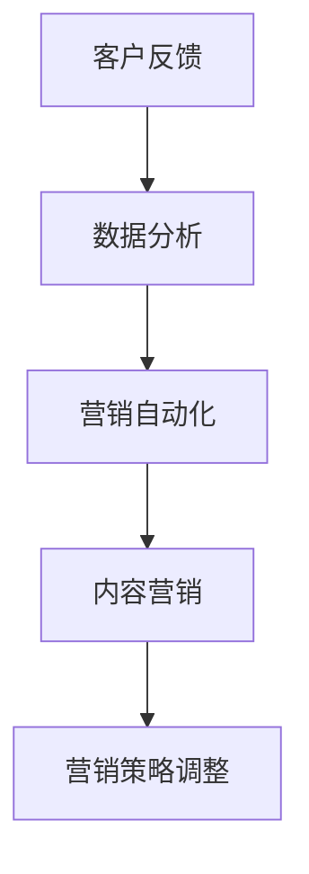

                 

# 一人公司的敏捷营销策略与实践方法

## 关键词： 
- 一人公司
- 敏捷营销
- 策略与实践
- 营销自动化
- 数据驱动
- 内容营销
- 社交媒体

## 摘要：
本文旨在探讨一人公司的敏捷营销策略与实践方法。通过分析敏捷营销的核心概念、实践步骤，以及利用技术手段实现自动化和数据分析，我们将深入解析如何通过高效的营销策略，实现个人企业的快速增长。文章还将推荐相关工具和资源，帮助读者更好地理解和应用敏捷营销。

### 1. 背景介绍

#### 什么是敏捷营销？

敏捷营销是一种以快速响应市场需求和客户反馈为核心的营销方法。与传统营销相比，敏捷营销强调灵活性、快速迭代和实时调整。它起源于软件开发领域，随后逐渐应用到市场营销中。对于一人公司而言，敏捷营销尤为重要，因为它能够帮助个人企业快速适应市场变化，降低营销成本，提高营销效率。

#### 一人公司的挑战

一人公司，顾名思义，是指只有一个创始人的公司。这种公司规模小、资源有限，因此在市场营销方面面临诸多挑战：

1. **资金有限**：无法投入大量资金进行市场推广。
2. **时间紧迫**：需要高效利用时间，快速实现营销目标。
3. **技能多样化**：需要具备多种技能，包括营销、销售、客户服务等。
4. **资源分散**：无法像大公司一样集中资源进行营销活动。

### 2. 核心概念与联系

#### 敏捷营销的核心概念

1. **客户反馈**：以客户为中心，快速收集和分析客户反馈，以指导营销策略的调整。
2. **数据分析**：利用数据分析工具，对市场趋势、客户行为进行深入分析，以优化营销决策。
3. **营销自动化**：通过自动化工具，实现营销流程的自动化，降低人工成本。
4. **内容营销**：通过高质量的内容吸引潜在客户，建立品牌认知。

#### Mermaid 流程图



### 3. 核心算法原理 & 具体操作步骤

#### 数据分析原理

数据分析是敏捷营销的核心。通过分析大量数据，我们可以发现市场趋势、客户需求等关键信息，从而指导营销策略的调整。

1. **数据收集**：收集来自各种渠道的数据，包括网站、社交媒体、电子邮件等。
2. **数据清洗**：对收集到的数据进行清洗，去除重复、无效的数据。
3. **数据分析**：使用统计方法、机器学习算法等，对数据进行深入分析。
4. **数据可视化**：将分析结果以图表、报表等形式呈现，便于理解和决策。

#### 营销自动化原理

营销自动化通过技术手段，实现营销流程的自动化，提高营销效率。

1. **自动化邮件**：根据客户行为，发送个性化的邮件。
2. **自动化广告**：根据客户兴趣，自动投放广告。
3. **自动化客户关系管理**：自动跟踪客户行为，提供个性化服务。

#### 内容营销原理

内容营销是通过高质量的内容吸引潜在客户，建立品牌认知。

1. **内容策划**：根据目标客户，策划有吸引力的内容。
2. **内容创作**：创作高质量的内容，包括文章、视频、图片等。
3. **内容发布**：通过网站、社交媒体等渠道发布内容。
4. **内容优化**：根据数据分析结果，不断优化内容，提高效果。

### 4. 数学模型和公式 & 详细讲解 & 举例说明

#### 数据分析中的数学模型

1. **回归分析**：用于预测市场趋势、客户需求等。
   $$ y = ax + b $$
2. **聚类分析**：用于分析客户群体。
   $$ \text{Minimize} \sum_{i=1}^{n} \sum_{j=1}^{k} (d(x_i, c_j))^2 $$
3. **关联规则分析**：用于发现数据之间的关联关系。
   $$ \text{Support}(A \cup B) = \frac{\text{Support}(A) + \text{Support}(B) - \text{Support}(A \cap B)}{\text{Total}} $$

#### 举例说明

假设我们想通过数据分析来预测潜在客户购买产品的时间。我们可以使用回归分析模型来建立预测模型。

1. **数据收集**：收集过去一段时间内，客户的购买时间、浏览行为、点击行为等数据。
2. **数据清洗**：去除重复、无效的数据。
3. **数据分析**：使用回归分析算法，建立预测模型。
4. **数据可视化**：将预测结果以图表形式呈现。

通过这个模型，我们可以预测出潜在客户购买产品的时间，从而提前准备营销活动，提高营销效果。

### 5. 项目实战：代码实际案例和详细解释说明

#### 开发环境搭建

1. **工具安装**：安装Python、Jupyter Notebook等工具。
2. **库安装**：安装Pandas、Scikit-learn等数据分析库。

#### 源代码详细实现和代码解读

```python
# 导入库
import pandas as pd
from sklearn.linear_model import LinearRegression

# 数据收集
data = pd.read_csv('data.csv')

# 数据清洗
data.drop_duplicates(inplace=True)

# 数据分析
model = LinearRegression()
model.fit(data[[' browsing_time ', ' clicks']], data[' purchase_time '])

# 数据可视化
import matplotlib.pyplot as plt
plt.scatter(data[' browsing_time '], data[' purchase_time '])
plt.plot(data[' browsing_time '], model.predict(data[[' browsing_time ']]), color='red')
plt.xlabel('Browsing Time')
plt.ylabel('Purchase Time')
plt.show()
```

#### 代码解读与分析

1. **数据收集**：从CSV文件中读取数据。
2. **数据清洗**：去除重复数据。
3. **数据分析**：使用线性回归模型进行数据分析。
4. **数据可视化**：绘制散点图和拟合直线，展示数据分析结果。

通过这个案例，我们可以看到如何使用Python进行数据分析，并实现数据可视化。

### 6. 实际应用场景

#### 敏捷营销在电商中的应用

电商行业竞争激烈，敏捷营销可以帮助电商企业快速适应市场变化，提高营销效果。

1. **客户反馈**：通过客户反馈，快速调整产品和服务。
2. **数据分析**：分析客户行为，优化营销策略。
3. **营销自动化**：自动化发送邮件、广告等。
4. **内容营销**：发布高质量的内容，提高品牌认知。

#### 敏捷营销在咨询行业中的应用

咨询行业注重专业性和服务质量，敏捷营销可以帮助咨询公司提高客户满意度，增加市场份额。

1. **客户反馈**：通过客户反馈，优化咨询服务。
2. **数据分析**：分析客户需求，提供个性化服务。
3. **营销自动化**：自动化发送邮件、报告等。
4. **内容营销**：发布专业内容，提高品牌形象。

### 7. 工具和资源推荐

#### 学习资源推荐

1. **书籍**：《精益创业》、《敏捷营销实战》
2. **论文**：《敏捷营销：理论与实践》、《基于数据分析的敏捷营销策略研究》
3. **博客**：掘金、36氪、HackerRank
4. **网站**：Marketing.AI、DataCamp

#### 开发工具框架推荐

1. **数据分析工具**：Pandas、Scikit-learn、TensorFlow
2. **营销自动化工具**：Mailchimp、HubSpot、Hootsuite
3. **内容管理系统**：WordPress、Drupal、Joomla

#### 相关论文著作推荐

1. **论文**：《基于大数据的敏捷营销策略研究》、《社交媒体在敏捷营销中的应用研究》
2. **著作**：《数据驱动的敏捷营销》、《敏捷营销：如何快速响应市场变化》

### 8. 总结：未来发展趋势与挑战

#### 发展趋势

1. **数据驱动**：越来越多的企业将采用数据驱动的营销策略，以实现更精准的营销。
2. **人工智能**：人工智能将在敏捷营销中发挥更大作用，提高营销自动化水平。
3. **内容营销**：高质量的内容将继续成为吸引潜在客户的重要手段。

#### 挑战

1. **数据隐私**：随着数据隐私问题的日益严重，如何在合规范围内使用数据成为一大挑战。
2. **技术更新**：技术更新速度快，如何持续学习和适应新技术成为挑战。
3. **人才短缺**：具备数据分析、人工智能等技能的人才短缺，企业需要培养和引进专业人才。

### 9. 附录：常见问题与解答

#### 问题1：如何进行有效的客户反馈收集？
**解答**：可以通过在线调查、社交媒体互动、客户满意度调查等方式收集客户反馈。同时，利用数据分析工具对反馈进行分析，找出关键问题。

#### 问题2：如何选择合适的营销自动化工具？
**解答**：根据企业的需求和预算，选择适合的营销自动化工具。可以考虑工具的易用性、功能丰富性、扩展性等方面。

#### 问题3：如何进行内容营销？
**解答**：首先要明确目标客户，然后创作高质量的内容，包括文章、视频、图片等。通过网站、社交媒体等渠道发布内容，并不断优化内容，提高效果。

### 10. 扩展阅读 & 参考资料

1. **书籍**：《数据科学实战》、《人工智能简明教程》
2. **论文**：《大数据时代下的敏捷营销策略研究》、《基于人工智能的敏捷营销方法探讨》
3. **网站**：MarketingProfs、LinkedIn Marketing Solutions
4. **博客**：Kaggle、DataCamp Blog

### 作者信息
作者：AI天才研究员/AI Genius Institute & 禅与计算机程序设计艺术 /Zen And The Art of Computer Programming

---

以上是本文的完整内容，希望通过本文，读者能够对一人公司的敏捷营销策略与实践方法有更深入的理解和认识。希望本文能够对您的企业营销提供有价值的参考。

