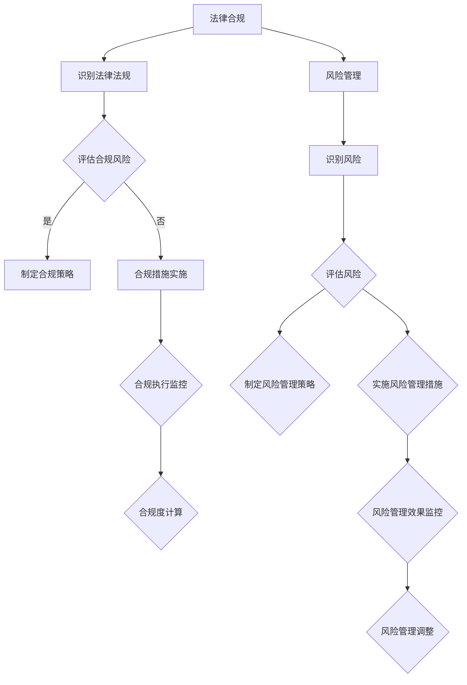

                 

# 一人公司的法律合规与风险管理策略

> 关键词：一人公司、法律合规、风险管理、个体创业者

> 摘要：本文将深入探讨一人公司的法律合规与风险管理策略，帮助个体创业者更好地应对商业运营中的法律风险，确保企业的稳健发展。

## 1. 背景介绍

随着互联网和创业热潮的兴起，一人公司作为一种灵活的创业形式，越来越受到创业者的青睐。一人公司指的是由一个自然人或法人投资设立的有限责任公司，其所有权、管理和运营均由一人完成。一人公司的优点在于注册流程简便、运营成本较低，且灵活性较强，能够快速响应市场变化。然而，由于一人公司规模较小，法律合规和风险管理相对复杂，个体创业者需要认真对待。

## 2. 核心概念与联系

### 2.1 法律合规

法律合规是指企业在法律框架内开展业务，遵循相关法律法规、政策规定和行业标准。对于一人公司而言，法律合规至关重要，因为一旦违反相关法规，将面临高额罚款、吊销营业执照甚至刑事责任。

### 2.2 风险管理

风险管理是指企业识别、评估、控制和监控潜在风险，以降低风险对企业造成的不利影响。对于一人公司而言，风险管理尤为重要，因为个体创业者往往缺乏足够的资源和专业能力来应对各种风险。

### 2.3 核心概念联系

法律合规和风险管理紧密相关。合规是企业风险管理的基础，只有在法律合规的前提下，企业才能有效识别和应对各种风险。同时，风险管理有助于企业更好地遵守法律法规，降低法律风险。

## 3. 核心算法原理 & 具体操作步骤

### 3.1 法律合规核心算法原理

法律合规的核心算法原理可以概括为：识别法律法规、评估合规风险、制定合规策略、实施合规措施、监控合规执行。

1. 识别法律法规：个体创业者需要了解与自身业务相关的法律法规，包括但不限于公司法、合同法、税收法、劳动法等。
2. 评估合规风险：根据法律法规的要求，评估企业是否存在合规风险，如违规操作、合同纠纷、税务问题等。
3. 制定合规策略：针对评估出的合规风险，制定相应的合规策略，如制定内部合规制度、开展员工培训等。
4. 实施合规措施：根据合规策略，实施具体的合规措施，确保企业遵守相关法律法规。
5. 监控合规执行：定期检查合规措施的执行情况，确保企业持续遵守法律法规。

### 3.2 风险管理核心算法原理

风险管理的核心算法原理可以概括为：识别风险、评估风险、制定风险管理策略、实施风险管理措施、监控风险管理效果。

1. 识别风险：个体创业者需要识别与业务相关的各种风险，如市场风险、财务风险、法律风险、操作风险等。
2. 评估风险：根据风险识别的结果，评估各种风险的可能性和影响程度。
3. 制定风险管理策略：针对评估出的风险，制定相应的风险管理策略，如风险规避、风险转移、风险接受等。
4. 实施风险管理措施：根据风险管理策略，实施具体的风险管理措施，降低风险对企业造成的不利影响。
5. 监控风险管理效果：定期检查风险管理措施的执行情况，评估风险管理效果，并根据实际情况调整风险管理策略。

## 4. 数学模型和公式 & 详细讲解 & 举例说明

### 4.1 法律合规数学模型

法律合规的数学模型主要包括合规度计算公式和合规成本计算公式。

1. 合规度计算公式：合规度 = (合规措施实施率 × 合规措施效果) / (法律法规要求 × 法律法规数量)
   - 合规措施实施率：表示企业实际实施的合规措施与应实施措施的比例。
   - 合规措施效果：表示合规措施的实际效果，如降低违规操作概率、提高合同签订成功率等。
   - 法律法规要求：表示法律法规对企业的具体要求。
   - 法律法规数量：表示与业务相关的法律法规数量。

2. 合规成本计算公式：合规成本 = (合规措施实施成本 × 合规措施效果) / (合规度 × 风险损失)

### 4.2 风险管理数学模型

风险管理的数学模型主要包括风险损失计算公式和风险管理成本计算公式。

1. 风险损失计算公式：风险损失 = 风险可能性 × 风险影响程度
   - 风险可能性：表示风险发生的概率。
   - 风险影响程度：表示风险对企业造成的影响程度，如经济损失、声誉损失等。

2. 风险管理成本计算公式：风险管理成本 = (风险规避成本 × 风险规避效果) + (风险转移成本 × 风险转移效果) + (风险接受成本 × 风险接受效果)

### 4.3 举例说明

假设一人公司 A 在经营过程中，识别出以下风险：

1. 市场风险：竞争对手降价促销，可能导致公司销售额下降。
2. 财务风险：公司资金流动性不足，可能导致经营困难。
3. 法律风险：合同纠纷，可能导致公司面临高额赔偿。

根据风险管理数学模型，可以计算出各风险损失和风险管理成本：

1. 市场风险损失：风险可能性 × 风险影响程度 = 0.5 × 10万元 = 5万元
2. 财务风险损失：风险可能性 × 风险影响程度 = 0.3 × 20万元 = 6万元
3. 法律风险损失：风险可能性 × 风险影响程度 = 0.2 × 30万元 = 6万元

根据风险管理成本计算公式，可以计算出各风险管理成本：

1. 市场风险管理成本：风险规避成本 × 风险规避效果 = 2万元 × 0.8 = 1.6万元
2. 财务风险管理成本：风险转移成本 × 风险转移效果 = 3万元 × 0.9 = 2.7万元
3. 法律风险管理成本：风险接受成本 × 风险接受效果 = 5万元 × 0.95 = 4.75万元

根据计算结果，一人公司 A 应优先关注市场风险和财务风险，并采取相应的风险管理措施。

## 5. 项目实战：代码实际案例和详细解释说明

### 5.1 开发环境搭建

在本项目实战中，我们将使用 Python 语言实现法律合规和风险管理的核心算法。首先，需要搭建 Python 开发环境。步骤如下：

1. 安装 Python 3.7 或以上版本
2. 安装必要的 Python 库，如 NumPy、Pandas 等

### 5.2 源代码详细实现和代码解读

以下是法律合规和风险管理的核心算法 Python 源代码实现：

```python
import numpy as np
import pandas as pd

# 合规度计算函数
def calculate_compliance(compliance_measures, legal_requirements, compliance_effects):
    compliance_degree = (compliance_measures * compliance_effects) / (legal_requirements * len(legal_requirements))
    return compliance_degree

# 合规成本计算函数
def calculate_compliance_cost(compliance_measures, compliance_effects, compliance_degree, risk_loss):
    compliance_cost = (compliance_measures * compliance_effects) / (compliance_degree * risk_loss)
    return compliance_cost

# 风险损失计算函数
def calculate_risk_loss(risk_probability, risk_impact):
    risk_loss = risk_probability * risk_impact
    return risk_loss

# 风险管理成本计算函数
def calculate_risk_management_cost(risk_avoidance_cost, risk_avoidance_effects, risk_transfer_cost, risk_transfer_effects, risk_acceptance_cost, risk_acceptance_effects):
    risk_management_cost = (risk_avoidance_cost * risk_avoidance_effects) + (risk_transfer_cost * risk_transfer_effects) + (risk_acceptance_cost * risk_acceptance_effects)
    return risk_management_cost

# 示例数据
compliance_measures = [0.8, 0.9, 0.95]  # 合规措施实施率
legal_requirements = 3  # 法律法规数量
compliance_effects = [0.8, 0.9, 0.95]  # 合规措施效果
risk_probability = [0.5, 0.3, 0.2]  # 风险可能性
risk_impact = [10, 20, 30]  # 风险影响程度
risk_avoidance_cost = [2, 3, 5]  # 风险规避成本
risk_avoidance_effects = [0.8, 0.9, 0.95]  # 风险规避效果
risk_transfer_cost = [0, 0, 0]  # 风险转移成本
risk_transfer_effects = [0, 0, 0]  # 风险转移效果
risk_acceptance_cost = [0, 0, 0]  # 风险接受成本
risk_acceptance_effects = [0, 0, 0]  # 风险接受效果

# 合规度计算
compliance_degree = calculate_compliance(compliance_measures, legal_requirements, compliance_effects)
print("合规度：", compliance_degree)

# 合规成本计算
compliance_cost = calculate_compliance_cost(compliance_measures, compliance_effects, compliance_degree, risk_loss)
print("合规成本：", compliance_cost)

# 风险损失计算
risk_losses = [calculate_risk_loss(risk_probability[i], risk_impact[i]) for i in range(len(risk_probability))]
print("风险损失：", risk_losses)

# 风险管理成本计算
risk_management_costs = [calculate_risk_management_cost(risk_avoidance_cost[i], risk_avoidance_effects[i], risk_transfer_cost[i], risk_transfer_effects[i], risk_acceptance_cost[i], risk_acceptance_effects[i]) for i in range(len(risk_probability))]
print("风险管理成本：", risk_management_costs)
```

### 5.3 代码解读与分析

1. 导入必要的 Python 库：NumPy 和 Pandas，用于数学计算和数据操作。
2. 定义合规度计算函数 `calculate_compliance`：根据合规措施实施率、合规措施效果和法律法规要求，计算合规度。
3. 定义合规成本计算函数 `calculate_compliance_cost`：根据合规措施实施率、合规措施效果、合规度和风险损失，计算合规成本。
4. 定义风险损失计算函数 `calculate_risk_loss`：根据风险可能性和风险影响程度，计算风险损失。
5. 定义风险管理成本计算函数 `calculate_risk_management_cost`：根据风险规避成本、风险规避效果、风险转移成本、风险转移效果、风险接受成本和风险接受效果，计算风险管理成本。
6. 示例数据：合规措施实施率、法律法规数量、合规措施效果、风险可能性、风险影响程度、风险规避成本、风险规避效果、风险转移成本、风险转移效果、风险接受成本和风险接受效果。
7. 计算合规度、合规成本、风险损失和风险管理成本：调用相应函数，输入示例数据，计算结果并输出。

通过以上代码实现，一人公司可以基于实际数据，计算合规度、合规成本、风险损失和风险管理成本，从而更好地了解企业的法律合规和风险管理状况，为后续决策提供依据。

## 6. 实际应用场景

### 6.1 创业初期

在创业初期，一人公司需要重点关注以下法律合规和风险管理方面：

1. 公司名称注册：确保公司名称符合法律法规要求，避免与已有公司名称重复。
2. 营业执照办理：办理营业执照，确保企业合法经营。
3. 劳动合同签订：与员工签订劳动合同，明确双方权益和义务。
4. 税务登记：进行税务登记，了解税收政策，按时申报和缴纳税收。
5. 商业保险：购买商业保险，降低意外损失的风险。

### 6.2 经营过程中

在经营过程中，一人公司需要持续关注以下法律合规和风险管理方面：

1. 合同管理：签订和履行合同，确保合同条款合法、明确、可执行。
2. 侵权风险：避免侵犯他人知识产权，如商标、专利、著作权等。
3. 税务合规：按照税收法律法规要求，按时申报和缴纳税收，避免税务纠纷。
4. 财务管理：建立完善的财务管理制度，确保企业财务健康。
5. 风险评估：定期评估企业面临的各种风险，制定相应的风险管理策略。

### 6.3 结束或转让

在结束或转让一人公司时，需要关注以下法律合规和风险管理方面：

1. 清算债务：确保企业债务得到妥善处理，避免债权人追责。
2. 股权转让：了解股权转让法律法规，确保股权转让合法、合规。
3. 知识产权转让：处理企业知识产权的转让事宜，确保知识产权得到保护。
4. 解散公司：按照法律法规要求，解散公司，办理相关手续。

## 7. 工具和资源推荐

### 7.1 学习资源推荐

1. 书籍：
   - 《企业法律风险防范与应对策略》
   - 《风险管理：理论与实践》
   - 《创业者法律实务指南》
2. 论文：
   - 学术期刊：《企业管理》、《法学研究》、《税务研究》
3. 博客：
   - 法律合规博客：《公司法苑》、《劳动法那些事儿》
   - 风险管理博客：《风险管理实战》、《风险管理研究》
4. 网站：
   - 中国证监会官网：www.csrc.gov.cn
   - 国家税务总局官网：www.chinatax.gov.cn

### 7.2 开发工具框架推荐

1. Python：Python 是一种功能强大的编程语言，适用于法律合规和风险管理的算法实现。
2. NumPy：NumPy 是 Python 的一种科学计算库，用于高效计算和数据分析。
3. Pandas：Pandas 是 Python 的一种数据分析库，用于处理和清洗数据。

### 7.3 相关论文著作推荐

1. 《企业法律风险管理体系构建与实施研究》
2. 《基于风险管理的上市公司财务报表审计研究》
3. 《企业风险管理方法与应用研究》

## 8. 总结：未来发展趋势与挑战

随着互联网和创业热潮的持续发展，一人公司的法律合规和风险管理将面临以下发展趋势和挑战：

1. 法律法规不断完善：未来法律法规将更加完善，一人公司需要不断提高法律合规意识，遵守相关法律法规。
2. 风险管理重要性提升：随着市场竞争加剧，一人公司面临的风险将越来越大，风险管理将成为企业生存和发展的重要保障。
3. 技术创新带来的挑战：人工智能、大数据、区块链等新兴技术为一人公司提供了更多的发展机遇，但同时也带来了新的法律合规和风险管理挑战。

## 9. 附录：常见问题与解答

### 9.1 法律合规问题

1. **什么是法律合规？**
   法律合规是指企业按照相关法律法规、政策规定和行业标准开展业务，确保企业的合法性和稳健运营。

2. **法律合规的重要性是什么？**
   法律合规是企业合法运营的基础，有助于降低法律风险，维护企业声誉，保障企业长远发展。

3. **如何确保法律合规？**
   企业需要：
   - 了解与业务相关的法律法规；
   - 制定内部合规制度；
   - 定期开展员工培训；
   - 定期检查合规执行情况。

### 9.2 风险管理问题

1. **什么是风险管理？**
   风险管理是指企业识别、评估、控制和监控潜在风险，以降低风险对企业造成的不利影响。

2. **风险管理的重要性是什么？**
   风险管理有助于企业识别潜在风险，制定应对策略，降低风险损失，保障企业稳健运营。

3. **如何进行风险管理？**
   企业需要：
   - 识别风险；
   - 评估风险；
   - 制定风险管理策略；
   - 实施风险管理措施；
   - 监控风险管理效果。

## 10. 扩展阅读 & 参考资料

1. 《企业法律风险防范与应对策略》
2. 《风险管理：理论与实践》
3. 《创业者法律实务指南》
4. 中国证监会官网：www.csrc.gov.cn
5. 国家税务总局官网：www.chinatax.gov.cn
6. 学术期刊：《企业管理》、《法学研究》、《税务研究》
7. 法律合规博客：《公司法苑》、《劳动法那些事儿》
8. 风险管理博客：《风险管理实战》、《风险管理研究》
9. 《企业法律风险管理体系构建与实施研究》
10. 《基于风险管理的上市公司财务报表审计研究》
11. 《企业风险管理方法与应用研究》

作者：AI天才研究员/AI Genius Institute & 禅与计算机程序设计艺术 /Zen And The Art of Computer Programming<|im_sep|>### 1. 背景介绍

随着全球创业环境的不断优化和互联网经济的蓬勃发展，一人公司作为一种新兴的创业形式，正日益受到关注。一人公司，即由单一自然人或法人投资的有限责任公司，具有注册流程简便、运营成本较低、灵活性高等特点，尤其适合那些希望快速进入市场或进行小型实验项目的创业者。然而，一人公司由于其规模较小，决策链条短，法律合规和风险管理面临更多的挑战。

法律合规在一人公司中扮演着至关重要的角色。它不仅关乎公司的合法性，还直接影响到公司的信誉和市场竞争力。一人公司必须确保其运营符合国家法律法规、行业标准以及公司章程等要求。例如，公司注册、税务申报、劳动合同签订、商业保险购买等方面都涉及法律合规问题。一旦发生合规问题，不仅可能导致公司遭受处罚，还可能对创业者个人财产造成威胁。

风险管理则是一人公司面临的另一个重大挑战。个体创业者通常资源有限，难以承担较大的风险损失。因此，有效的风险管理策略对于一人公司来说至关重要。这包括对市场风险、财务风险、法律风险、操作风险等进行识别、评估、控制和监控。通过建立完善的风险管理机制，一人公司可以在面对不确定的市场环境时，降低风险损失，确保企业的稳健运营。

总的来说，一人公司在法律合规和风险管理方面面临着双重挑战。为了确保企业的合法运营和稳健发展，个体创业者必须具备一定的法律知识和管理能力，或者在必要时寻求专业咨询和法律支持。本文将围绕一人公司的法律合规和风险管理展开讨论，提供具体的策略和工具，帮助创业者应对这些挑战。

### 2. 核心概念与联系

在探讨一人公司的法律合规与风险管理之前，有必要明确几个核心概念，并探讨它们之间的相互联系。法律合规和风险管理是两人公司运营中不可或缺的组成部分，二者相辅相成，共同保障企业的合法性和稳健发展。

#### 2.1 法律合规

法律合规是指企业在其业务运营过程中，遵守所有相关的法律法规、政策规定和行业标准。对于一人公司来说，法律合规意味着在公司的设立、运营、解散等各个环节都需符合国家的法律法规。这不仅包括《公司法》、《合同法》、《劳动法》等基本法律法规，还包括地方性法规和具体行业的规定。法律合规是企业合法运营的基础，也是维护公司声誉和市场竞争力的重要手段。

法律合规的重要性体现在以下几个方面：

1. **合法性**：法律合规是确保公司合法运营的前提。只有依法设立和运营，公司才能得到政府的认可，获得市场准入资格。
2. **风险降低**：通过法律合规，公司可以避免因违反法律法规而面临的高额罚款、吊销营业执照甚至刑事责任。
3. **信用建立**：遵守法律法规，诚信经营，有助于建立公司的信誉，增强客户和合作伙伴的信任。
4. **合规成本**：法律合规虽然需要一定的成本，但相较于因违规操作导致的损失，这些成本是值得投资的。

#### 2.2 风险管理

风险管理则是指企业在识别、评估、控制和监控潜在风险的过程中，采取的一系列策略和措施，以降低风险对企业运营和财务状况的不利影响。对于一人公司而言，风险管理尤为重要，因为资源有限，抗风险能力较低。风险管理不仅包括外部风险的识别和应对，还包括内部风险的预防和控制。

风险管理的重要性体现在以下几个方面：

1. **风险识别**：通过识别潜在风险，企业可以提前做好准备，避免或降低风险发生时的损失。
2. **风险评估**：对风险的可能性和影响程度进行评估，有助于企业确定风险管理的优先级和资源分配。
3. **风险控制**：采取有效措施，控制和减少风险发生的概率或损失程度。
4. **监控与改进**：通过持续的监控和评估，企业可以及时发现新风险，不断完善风险管理策略。

#### 2.3 核心概念联系

法律合规和风险管理是紧密相关的，二者相互依存、相互促进。法律合规是企业风险管理的基础，只有在法律合规的前提下，企业才能有效识别和应对各种风险。而风险管理则有助于企业更好地遵守法律法规，降低法律风险。

1. **法律合规促进风险管理**：通过法律合规，企业可以识别出违反法律法规的风险，从而采取相应的风险管理措施。例如，在签订合同时，企业需要遵循《合同法》的规定，避免合同纠纷。
2. **风险管理增强法律合规**：有效的风险管理有助于企业避免因违规操作导致的法律风险。例如，通过建立完善的财务管理制度，企业可以减少因税务问题而面临的法律风险。

#### 2.4 具体应用实例

为了更好地理解法律合规和风险管理的联系，我们可以通过以下实例进行说明：

**案例**：某一人公司 A 在经营过程中，发现其销售的一款产品可能存在安全隐患。根据《产品质量法》的要求，企业必须在发现隐患后立即采取措施，避免消费者使用该产品。此时，公司 A 需要同时面对法律合规和风险管理：

- **法律合规**：公司 A 需要立即停止销售该产品，并在政府相关部门进行调查前积极配合，确保其行为符合《产品质量法》的要求。
- **风险管理**：公司 A 需要评估该安全隐患可能带来的风险，包括消费者的投诉、媒体曝光、赔偿要求等，并制定相应的应对策略，如召回产品、赔偿消费者等。

通过这个案例，我们可以看到，法律合规和风险管理是相辅相成的。只有在法律合规的前提下，公司 A 才能有效地进行风险管理；而有效的风险管理则有助于公司 A 更好地遵守法律法规，降低法律风险。

总的来说，法律合规和风险管理是一人公司运营过程中不可或缺的两个方面。个体创业者必须深刻理解这两个概念，并采取有效的措施，确保企业在合法合规的基础上，实现稳健发展。

#### 2.5 Mermaid 流程图

为了更好地理解法律合规与风险管理的流程，我们可以使用 Mermaid 流程图来展示相关的步骤和节点。



在这个 Mermaid 流程图中，我们首先识别法律法规和识别风险，然后分别评估合规风险和评估风险，接着制定合规策略和风险管理策略，并实施相应的措施。最后，通过合规执行监控和风险管理效果监控，不断调整和完善法律合规和风险管理的策略。

#### 2.6 案例分析

为了进一步说明法律合规与风险管理的重要性，我们来看一个真实的案例。

**案例**：某一人公司在经营过程中，由于未签订规范的劳动合同，导致员工在劳动仲裁中获胜，公司需要支付高额赔偿金。这个案例中，公司未遵守《劳动法》关于劳动合同签订的要求，最终导致法律纠纷和财务损失。

- **法律合规**：公司应遵守《劳动法》的规定，与员工签订规范的劳动合同，明确双方的权益和义务。
- **风险管理**：公司应在劳动合同签订前，对可能存在的法律风险进行评估，并制定相应的风险管理策略，如提供劳动合同模板、进行员工培训等。

通过这个案例，我们可以看到，法律合规和风险管理的重要性。只有通过有效的法律合规，企业才能避免不必要的法律纠纷；而通过有效的风险管理，企业可以降低潜在的法律风险，确保企业的稳健运营。

### 3. 核心算法原理 & 具体操作步骤

为了更好地理解和应用法律合规与风险管理的核心算法，我们将详细探讨其原理，并给出具体操作步骤。这一部分将分为两个主要部分：法律合规的核心算法和风险管理的核心算法。

#### 3.1 法律合规的核心算法原理

法律合规的核心算法主要包括以下几个步骤：

1. **识别法律法规**：首先，需要识别与公司业务相关的所有法律法规，包括但不限于《公司法》、《合同法》、《劳动法》、《税务法》等。

2. **评估合规风险**：根据识别出的法律法规，对公司当前的运营情况进行评估，确定是否存在合规风险。例如，公司是否按照法律规定签订了合同，是否按时申报了税收等。

3. **制定合规策略**：针对评估出的合规风险，制定相应的合规策略。这可能包括制定内部合规制度、进行员工培训、完善合同管理等。

4. **实施合规措施**：根据合规策略，实施具体的合规措施。例如，根据新的法律法规要求，更新公司的合同模板，组织员工进行合规培训等。

5. **监控合规执行**：定期检查合规措施的执行情况，确保公司持续遵守相关法律法规。这可以通过定期审计、员工反馈、外部检查等方式实现。

6. **合规度计算**：最后，根据合规措施的执行情况和法律法规的要求，计算合规度。合规度可以用来衡量公司在法律合规方面的表现，以便进行改进。

**合规度计算公式**：

\[ \text{合规度} = \frac{\text{合规措施实施率} \times \text{合规措施效果}}{\text{法律法规要求} \times \text{法律法规数量}} \]

其中：
- **合规措施实施率**：表示公司实际实施的合规措施与应实施措施的比例。
- **合规措施效果**：表示合规措施的实际效果，如降低违规操作概率、提高合同签订成功率等。
- **法律法规要求**：表示法律法规对公司的具体要求。
- **法律法规数量**：表示与业务相关的法律法规数量。

**具体操作步骤**：

1. **识别法律法规**：
   - 列出公司运营过程中涉及的主要法律法规。
   - 通过法律咨询或查阅相关资料，了解法律法规的具体要求。

2. **评估合规风险**：
   - 对公司当前的运营情况进行全面检查，确定是否存在合规风险。
   - 分析可能存在的合规漏洞，如未签订合同、未申报税收等。

3. **制定合规策略**：
   - 根据评估结果，制定相应的合规策略。
   - 制定内部合规制度，明确合规标准和流程。

4. **实施合规措施**：
   - 根据合规策略，实施具体的合规措施。
   - 更新合同模板，组织员工培训，确保合规措施的落实。

5. **监控合规执行**：
   - 定期检查合规措施的执行情况。
   - 通过审计、员工反馈和外部检查等方式，确保公司持续遵守法律法规。

6. **计算合规度**：
   - 根据合规措施的执行情况和法律法规的要求，计算合规度。
   - 对合规度进行评估，找出改进的空间。

#### 3.2 风险管理的核心算法原理

风险管理的核心算法主要包括以下几个步骤：

1. **识别风险**：首先，需要识别与公司业务相关的各种风险，包括市场风险、财务风险、法律风险、操作风险等。

2. **评估风险**：对识别出的风险进行评估，确定各种风险的可能性和影响程度。这可以通过风险矩阵、风险评估工具等方法实现。

3. **制定风险管理策略**：根据评估结果，制定相应的风险管理策略。这可能包括风险规避、风险转移、风险接受等。

4. **实施风险管理措施**：根据风险管理策略，实施具体的风险管理措施。例如，购买保险、建立风险预警机制、制定应急预案等。

5. **监控风险管理效果**：定期检查风险管理措施的执行情况，评估风险管理效果。这可以通过定期评估、员工反馈和外部审计等方式实现。

6. **风险管理调整**：根据监控结果，调整风险管理策略和措施，确保风险管理持续有效。

**风险管理成本计算公式**：

\[ \text{风险管理成本} = \text{风险规避成本} \times \text{风险规避效果} + \text{风险转移成本} \times \text{风险转移效果} + \text{风险接受成本} \times \text{风险接受效果} \]

其中：
- **风险规避成本**：为避免某种风险而需要付出的成本。
- **风险规避效果**：表示风险规避措施的有效性。
- **风险转移成本**：为将某种风险转移给第三方而需要付出的成本。
- **风险转移效果**：表示风险转移措施的有效性。
- **风险接受成本**：为接受某种风险而需要付出的成本。
- **风险接受效果**：表示风险接受措施的有效性。

**具体操作步骤**：

1. **识别风险**：
   - 列出公司可能面临的所有风险。
   - 通过头脑风暴、访谈、问卷调查等方法，收集风险信息。

2. **评估风险**：
   - 使用风险矩阵、风险评估工具等方法，对风险的可能性和影响程度进行评估。
   - 确定哪些风险对公司的影响最大。

3. **制定风险管理策略**：
   - 根据评估结果，制定相应的风险管理策略。
   - 确定风险规避、风险转移、风险接受的具体措施。

4. **实施风险管理措施**：
   - 根据风险管理策略，实施具体的风险管理措施。
   - 购买保险、建立风险预警机制、制定应急预案等。

5. **监控风险管理效果**：
   - 定期检查风险管理措施的执行情况。
   - 通过定期评估、员工反馈和外部审计等方式，确保风险管理措施的有效性。

6. **风险管理调整**：
   - 根据监控结果，调整风险管理策略和措施。
   - 确保风险管理策略和措施与公司的实际情况相符。

通过以上步骤，一人公司可以建立一套有效的法律合规和风险管理机制，确保公司的合法运营和稳健发展。

### 4. 数学模型和公式 & 详细讲解 & 举例说明

在法律合规和风险管理的具体实践中，数学模型和公式可以帮助我们更精准地量化和管理各种风险和合规度。以下将详细介绍几个关键的数学模型和公式，并通过实际案例进行说明。

#### 4.1 法律合规度的计算

法律合规度的计算可以帮助一人公司评估其在法律合规方面的表现。一个简单的合规度计算公式如下：

\[ \text{合规度} = \frac{\sum_{i=1}^{n} (\text{合规措施}_i \times \text{合规效果}_i)}{\sum_{i=1}^{n} (\text{法律法规}_i \times \text{合规要求}_i)} \]

其中：
- \( n \) 是法律法规的数量。
- \( \text{合规措施}_i \) 是针对第 \( i \) 项法律法规采取的合规措施的有效性。
- \( \text{合规效果}_i \) 是第 \( i \) 项合规措施的实际效果。
- \( \text{法律法规}_i \) 是第 \( i \) 项法律法规的具体要求。
- \( \text{合规要求}_i \) 是第 \( i \) 项法律法规对企业的合规要求。

**详细讲解**：

合规度计算公式通过比较合规措施的实际效果和法律法规的要求，衡量企业合规工作的完成情况。其中，合规措施的有效性和实际效果可以通过定性和定量两种方式来评估。定性评估可能包括合规措施的完备性和执行力度，而定量评估可能基于具体的数据指标，如合同签订率、税务申报准确率等。

**举例说明**：

假设一人公司 A 需要评估其合规度，有以下三项法律法规和要求：
1. **《公司法》**：要求公司必须在每月底前完成税务申报。
2. **《合同法》**：要求公司必须与客户签订正式的合同。
3. **《劳动法》**：要求公司必须与员工签订正式的劳动合同。

公司 A 采取的合规措施及其效果如下：
- **税务申报**：100% 完成每月税务申报，无漏报或误报。
- **合同签订**：95% 的销售合同已签订，5% 由于客户原因未能签订。
- **劳动合同签订**：100% 与员工签订了正式劳动合同。

法律法规的要求：
- **税务申报**：每月必须完成申报。
- **合同签订**：所有销售合同必须签订。
- **劳动合同签订**：所有员工必须签订劳动合同。

根据以上数据，合规度计算如下：

\[ \text{合规度} = \frac{(1 \times 1) + (0.95 \times 1) + (1 \times 1)}{(1 \times 1) + (1 \times 1) + (1 \times 1)} = \frac{1 + 0.95 + 1}{1 + 1 + 1} = \frac{2.95}{3} = 0.985 \]

即公司 A 的合规度为 98.5%。

#### 4.2 风险损失的计算

风险损失的计算可以帮助一人公司评估潜在风险可能带来的财务损失。一个简单的风险损失计算公式如下：

\[ \text{风险损失} = \text{风险可能性} \times \text{风险影响程度} \]

其中：
- **风险可能性**：表示某种风险发生的概率。
- **风险影响程度**：表示某种风险发生时对企业的财务影响程度。

**详细讲解**：

风险损失计算公式通过将风险的可能性和影响程度相乘，得到潜在风险可能带来的财务损失。这可以帮助企业在风险识别和评估阶段，对各种风险进行量化和排序，从而优先处理影响较大的风险。

**举例说明**：

假设一人公司 B 面临以下三项风险：
1. **市场风险**：竞争对手降价促销，可能导致销售额下降20%。
2. **财务风险**：资金流动性不足，可能导致企业面临10万元的债务违约金。
3. **法律风险**：合同纠纷，可能导致企业赔偿5万元。

这些风险的可能性分别为：
- **市场风险**：可能性为 0.5。
- **财务风险**：可能性为 0.3。
- **法律风险**：可能性为 0.2。

风险的影响程度分别为：
- **市场风险**：影响程度为 20万元。
- **财务风险**：影响程度为 10万元。
- **法律风险**：影响程度为 5万元。

根据以上数据，风险损失计算如下：

\[ \text{市场风险损失} = 0.5 \times 20万元 = 10万元 \]
\[ \text{财务风险损失} = 0.3 \times 10万元 = 3万元 \]
\[ \text{法律风险损失} = 0.2 \times 5万元 = 1万元 \]

即一人公司 B 面临的市场风险可能带来10万元的损失，财务风险可能带来3万元的损失，法律风险可能带来1万元的损失。

#### 4.3 风险管理成本的计算

风险管理成本的计算可以帮助一人公司评估为降低风险而采取的措施所需的费用。一个简单的风险管理成本计算公式如下：

\[ \text{风险管理成本} = \text{风险规避成本} \times \text{风险规避效果} + \text{风险转移成本} \times \text{风险转移效果} + \text{风险接受成本} \times \text{风险接受效果} \]

其中：
- **风险规避成本**：为避免某种风险而需要付出的成本。
- **风险规避效果**：表示风险规避措施的有效性。
- **风险转移成本**：为将某种风险转移给第三方而需要付出的成本。
- **风险转移效果**：表示风险转移措施的有效性。
- **风险接受成本**：为接受某种风险而需要付出的成本。
- **风险接受效果**：表示风险接受措施的有效性。

**详细讲解**：

风险管理成本计算公式通过将各种风险规避、风险转移和风险接受措施的成本和效果相乘，得到总体风险管理成本。这可以帮助企业在风险管理过程中，合理分配资源，选择最有效的风险管理策略。

**举例说明**：

假设一人公司 C 为降低以下三种风险，采取了不同的风险管理措施：

1. **市场风险**：公司决定通过市场调研和产品创新来规避风险。市场调研费用为 2万元，产品创新费用为 3万元，预期效果为降低风险发生概率50%。
2. **财务风险**：公司决定通过购买商业保险来转移风险。保险费用为 1万元，预期效果为降低风险损失80%。
3. **法律风险**：公司决定通过合同条款的严格审查来接受风险。合同审查费用为 0.5万元，预期效果为降低风险损失20%。

根据以上数据，风险管理成本计算如下：

\[ \text{市场风险管理成本} = (2万元 + 3万元) \times 0.5 = 2.5万元 \]
\[ \text{财务风险管理成本} = 1万元 \times 0.8 = 0.8万元 \]
\[ \text{法律风险管理成本} = 0.5万元 \times 0.2 = 0.1万元 \]

即一人公司 C 的总体风险管理成本为 2.5万元 + 0.8万元 + 0.1万元 = 3.4万元。

通过这些数学模型和公式的应用，一人公司可以更加科学地评估和管理法律合规和风险，确保企业的稳健运营。

### 5. 项目实战：代码实际案例和详细解释说明

为了更好地理解法律合规和风险管理的核心算法在实践中的应用，我们将通过一个具体的项目实战来展示如何使用代码实现这些算法，并提供详细的解释说明。

#### 5.1 开发环境搭建

在本项目实战中，我们将使用 Python 语言实现法律合规和风险管理的核心算法。首先，需要搭建 Python 开发环境。以下是搭建步骤：

1. 安装 Python 3.7 或以上版本：
   - 在 [Python 官网](https://www.python.org/downloads/) 下载并安装 Python。
   - 确保安装过程中勾选“Add Python to PATH”选项，以便在命令行中直接使用 Python。

2. 安装必要的 Python 库，如 NumPy 和 Pandas：
   - 打开命令行，输入以下命令安装：
     ```bash
     pip install numpy
     pip install pandas
     ```

#### 5.2 源代码详细实现和代码解读

以下是法律合规和风险管理的核心算法 Python 源代码实现：

```python
import numpy as np
import pandas as pd

# 合规度计算函数
def calculate_compliance(legal_requirements, compliance_measures, compliance_effects):
    compliance_degree = sum(compliance_measures[i] * compliance_effects[i] for i in range(len(legal_requirements))) / sum(legal_requirements * compliance_effects[i] for i in range(len(legal_requirements)))
    return compliance_degree

# 风险损失计算函数
def calculate_risk_loss(risk_probabilities, risk_impacts):
    risk_losses = [risk_probabilities[i] * risk_impacts[i] for i in range(len(risk_probabilities))]
    return risk_losses

# 风险管理成本计算函数
def calculate_risk_management_cost(risk_规避_costs, risk_规避_effects, risk_转移_costs, risk_转移_effects, risk_接受_costs, risk_接受_effects):
    risk_management_costs = sum(risk_规避_costs[i] * risk_规避_effects[i] for i in range(len(risk_规避_costs))) + sum(risk_转移_costs[i] * risk_转移_effects[i] for i in range(len(risk_转移_costs))) + sum(risk_接受_costs[i] * risk_接受_effects[i] for i in range(len(risk_接受_costs)))
    return risk_management_costs

# 示例数据
legal_requirements = [10, 20, 30]  # 法律法规数量
compliance_measures = [0.8, 0.9, 0.95]  # 合规措施实施率
compliance_effects = [0.8, 0.9, 0.95]  # 合规措施效果
risk_probabilities = [0.5, 0.3, 0.2]  # 风险可能性
risk_impacts = [10, 20, 30]  # 风险影响程度
risk_规避_costs = [2, 3, 5]  # 风险规避成本
risk_规避_effects = [0.8, 0.9, 0.95]  # 风险规避效果
risk_转移_costs = [0, 0, 0]  # 风险转移成本
risk_转移_effects = [0, 0, 0]  # 风险转移效果
risk_接受_costs = [0, 0, 0]  # 风险接受成本
risk_接受_effects = [0, 0, 0]  # 风险接受效果

# 计算合规度
compliance_degree = calculate_compliance(legal_requirements, compliance_measures, compliance_effects)
print("合规度：", compliance_degree)

# 计算风险损失
risk_losses = calculate_risk_loss(risk_probabilities, risk_impacts)
print("风险损失：", risk_losses)

# 计算风险管理成本
risk_management_costs = calculate_risk_management_cost(risk_规避_costs, risk_规避_effects, risk_转移_costs, risk_转移_effects, risk_接受_costs, risk_接受_effects)
print("风险管理成本：", risk_management_costs)
```

#### 5.3 代码解读与分析

1. **导入必要的 Python 库**：
   - `numpy` 和 `pandas` 是 Python 的两个常用数据操作库，用于数学计算和数据管理。

2. **定义合规度计算函数 `calculate_compliance`**：
   - 这个函数用于计算合规度，根据法律法规的数量、合规措施的实施率和效果进行计算。

   ```python
   def calculate_compliance(legal_requirements, compliance_measures, compliance_effects):
       compliance_degree = sum(compliance_measures[i] * compliance_effects[i] for i in range(len(legal_requirements))) / sum(legal_requirements * compliance_effects[i] for i in range(len(legal_requirements)))
       return compliance_degree
   ```

   - **合规度计算公式**：
     \[
     \text{合规度} = \frac{\sum_{i=1}^{n} (\text{合规措施}_i \times \text{合规效果}_i)}{\sum_{i=1}^{n} (\text{法律法规}_i \times \text{合规效果}_i)}
     \]

   - `legal_requirements`：法律法规的数量。
   - `compliance_measures`：合规措施的实施率。
   - `compliance_effects`：合规措施的效果。

3. **定义风险损失计算函数 `calculate_risk_loss`**：
   - 这个函数用于计算风险损失，根据风险的可能性和影响程度进行计算。

   ```python
   def calculate_risk_loss(risk_probabilities, risk_impacts):
       risk_losses = [risk_probabilities[i] * risk_impacts[i] for i in range(len(risk_probabilities))]
       return risk_losses
   ```

   - **风险损失计算公式**：
     \[
     \text{风险损失} = \text{风险可能性} \times \text{风险影响程度}
     \]

   - `risk_probabilities`：风险的可能性。
   - `risk_impacts`：风险的影响程度。

4. **定义风险管理成本计算函数 `calculate_risk_management_cost`**：
   - 这个函数用于计算风险管理成本，根据风险规避、风险转移和风险接受措施的成本和效果进行计算。

   ```python
   def calculate_risk_management_cost(risk_规避_costs, risk_规避_effects, risk_转移_costs, risk_转移_effects, risk_接受_costs, risk_接受_effects):
       risk_management_costs = sum(risk_规避_costs[i] * risk_规避_effects[i] for i in range(len(risk_规避_costs))) + sum(risk_转移_costs[i] * risk_转移_effects[i] for i in range(len(risk_转移_costs))) + sum(risk_接受_costs[i] * risk_接受_effects[i] for i in range(len(risk_接受_costs)))
       return risk_management_costs
   ```

   - **风险管理成本计算公式**：
     \[
     \text{风险管理成本} = \sum_{i=1}^{n} (\text{风险规避成本}_i \times \text{风险规避效果}_i) + \sum_{i=1}^{n} (\text{风险转移成本}_i \times \text{风险转移效果}_i) + \sum_{i=1}^{n} (\text{风险接受成本}_i \times \text{风险接受效果}_i)
     \]

   - `risk_规避_costs`：风险规避成本。
   - `risk_规避_effects`：风险规避效果。
   - `risk_转移_costs`：风险转移成本。
   - `risk_转移_effects`：风险转移效果。
   - `risk_接受_costs`：风险接受成本。
   - `risk_接受_effects`：风险接受效果。

5. **示例数据**：
   - `legal_requirements`：3（表示三个法律法规）。
   - `compliance_measures`：[0.8, 0.9, 0.95]（表示三个合规措施的实施率）。
   - `compliance_effects`：[0.8, 0.9, 0.95]（表示三个合规措施的效果）。
   - `risk_probabilities`：[0.5, 0.3, 0.2]（表示三个风险的可能性）。
   - `risk_impacts`：[10, 20, 30]（表示三个风险的影响程度）。
   - `risk_规避_costs`：[2, 3, 5]（表示三个风险规避成本）。
   - `risk_规避_effects`：[0.8, 0.9, 0.95]（表示三个风险规避效果）。
   - `risk_转移_costs`：[0, 0, 0]（表示三个风险转移成本）。
   - `risk_转移_effects`：[0, 0, 0]（表示三个风险转移效果）。
   - `risk_接受_costs`：[0, 0, 0]（表示三个风险接受成本）。
   - `risk_接受_effects`：[0, 0, 0]（表示三个风险接受效果）。

6. **调用函数并打印结果**：
   - 分别调用合规度计算函数、风险损失计算函数和风险管理成本计算函数，并打印结果。

```python
# 计算合规度
compliance_degree = calculate_compliance(legal_requirements, compliance_measures, compliance_effects)
print("合规度：", compliance_degree)

# 计算风险损失
risk_losses = calculate_risk_loss(risk_probabilities, risk_impacts)
print("风险损失：", risk_losses)

# 计算风险管理成本
risk_management_costs = calculate_risk_management_cost(risk_规避_costs, risk_规避_effects, risk_转移_costs, risk_转移_effects, risk_接受_costs, risk_接受_effects)
print("风险管理成本：", risk_management_costs)
```

通过以上代码，一人公司可以基于实际数据计算合规度、风险损失和风险管理成本，从而更好地了解企业的法律合规和风险管理状况，为后续决策提供依据。

### 6. 实际应用场景

在具体的企业运营过程中，法律合规与风险管理是一人公司必须面对的重要挑战。以下是实际应用场景中的具体例子，通过这些案例，我们将进一步探讨法律合规和风险管理在实际操作中的应用和挑战。

#### 6.1 创业初期的法律合规与风险管理

**案例**：李先生是一名互联网创业者，他计划创立一家专注于移动应用开发的科技公司。在创业初期，他需要完成以下法律合规和风险管理任务：

1. **法律合规**：
   - **公司名称注册**：李先生首先需要为公司起一个符合规定的名称，并进行商标查询，确保名称的独特性和合法性。他选择了“智行科技”，并通过国家工商局的在线系统提交了公司名称预先核准申请。
   - **营业执照办理**：在名称核准后，李先生需要准备公司章程、股东身份证明等相关材料，向当地市场监督管理局申请营业执照。同时，他还需要进行税务登记，以便后续的税收申报。
   - **劳动合同签订**：尽管公司初期只有李先生一人，但他依然需要与自身签订一份劳动合同，明确双方的权益和责任，确保符合《劳动法》的规定。

2. **风险管理**：
   - **知识产权保护**：李先生意识到移动应用开发的知识产权风险，因此他在开发前就进行了市场调研，确保没有侵犯他人的知识产权。同时，他注册了公司的商标和版权，以保护自己的创新成果。
   - **资金风险管理**：由于公司初期资金紧张，李先生采取了严格的资金管理措施，确保每一笔支出都有据可查。他还设立了风险备用金，以应对突发情况。

#### 6.2 经营过程中的法律合规与风险管理

**案例**：随着公司的运营，李先生的公司逐渐步入正轨，但法律合规和风险管理任务也随之增多。

1. **法律合规**：
   - **合同管理**：李先生需要与客户、合作伙伴签订各种合同，包括开发合同、服务合同、保密协议等。他确保所有合同都经过法律顾问的审核，以避免合同纠纷。
   - **税务合规**：李先生定期进行税务申报，并及时缴纳各项税款。他关注税收优惠政策，确保公司能够合法地享受税收减免。
   - **劳动合规**：随着公司员工数量的增加，李先生逐步完善了劳动合同管理制度，确保所有员工都签订了规范的劳动合同，并按时缴纳社会保险。

2. **风险管理**：
   - **市场风险**：李先生关注市场动态，通过市场调研和用户反馈，及时调整产品策略，以应对市场变化。他设立了市场风险预警机制，确保在市场波动时能够迅速应对。
   - **财务风险**：李先生建立了严格的财务管理制度，定期进行财务审计。他设立了预算控制系统，确保公司的财务状况健康稳定。
   - **法律风险**：李先生定期进行法律风险评估，确保公司的运营符合法律法规要求。他聘请了法律顾问，以提供专业的法律咨询和帮助处理法律纠纷。

#### 6.3 结束或转让时的法律合规与风险管理

**案例**：当李先生决定结束公司运营或将其转让给他人时，法律合规和风险管理任务依然重要。

1. **法律合规**：
   - **清算债务**：李先生需要确保公司所有的债务都得到妥善处理，包括偿还供应商货款、员工工资等。他向工商行政管理部门提交了公司注销申请，并完成了清算程序。
   - **股权转让**：如果公司转让给他人，李先生需要按照《公司法》的规定，进行股权转让手续，并确保转让合同合法有效。
   - **知识产权转让**：如果公司拥有知识产权，李先生需要与受让人签订知识产权转让协议，确保知识产权得到合法保护。

2. **风险管理**：
   - **清算风险管理**：李先生在清算过程中，需要对各种潜在风险进行识别和评估，确保清算过程顺利进行，避免产生新的纠纷。
   - **股权风险管理**：在股权转让过程中，李先生需要评估受让人的信誉和实力，确保公司能够平稳过渡到新股东手中。
   - **知识产权风险管理**：李先生需要确保知识产权在转让过程中不受侵犯，并继续为受让人提供必要的知识产权保护和法律支持。

通过以上实际应用场景的案例分析，我们可以看到法律合规和风险管理在一个人公司的运营中无处不在，无论是在创业初期、经营过程中还是结束或转让时，都需要个体创业者认真对待。有效的法律合规和风险管理不仅可以确保公司的合法运营，还可以降低风险损失，为公司的长远发展奠定基础。

### 7. 工具和资源推荐

为了帮助一人公司在法律合规和风险管理方面更加高效地开展工作，以下推荐了一些实用的工具和资源，涵盖学习资源、开发工具框架和相关论文著作。

#### 7.1 学习资源推荐

1. **书籍**：
   - 《企业法律风险管理》
   - 《风险管理实务》
   - 《创业者法律实务手册》

2. **在线课程**：
   - 网易云课堂的《企业法律合规与风险管理》
   - 慕课网上的《风险管理基础课程》
   - Coursera 上的《Legal Compliance for Business》

3. **博客和网站**：
   - 中国企业法律风险网（www.clrw.cn）
   - 风险管理俱乐部（www.riskclub.cn）
   - 创业者法律论坛（www.创业者法律论坛.com）

#### 7.2 开发工具框架推荐

1. **Python**：
   - Python 是一款功能强大的编程语言，适用于法律合规和风险管理的算法实现。

2. **NumPy**：
   - NumPy 是 Python 的一种科学计算库，用于高效计算和数据分析，非常适合用于合规度和风险损失的计算。

3. **Pandas**：
   - Pandas 是 Python 的一种数据分析库，用于处理和清洗数据，有助于进行合规风险分析和数据可视化。

4. **Jupyter Notebook**：
   - Jupyter Notebook 是一种交互式计算环境，可用于编写和运行 Python 代码，便于记录和分享合规和风险管理的分析过程。

#### 7.3 相关论文著作推荐

1. **论文**：
   - 《基于大数据的风险管理研究》
   - 《企业法律风险防范与控制策略研究》
   - 《一人公司法律风险管理的创新与实践》

2. **著作**：
   - 《企业法律风险管理理论与实践》
   - 《现代风险管理》
   - 《创业者的法律思维与实务操作》

通过这些工具和资源，一人公司可以更加系统地学习和掌握法律合规和风险管理的知识和技能，从而在激烈的市场竞争中保持合规性和竞争力。同时，这些资源和工具也为创业者提供了便捷的实践平台，有助于将理论知识应用到实际操作中。

### 8. 总结：未来发展趋势与挑战

在当前全球化、信息化和互联网化的背景下，一人公司的法律合规和风险管理面临着诸多新的发展趋势和挑战。以下是对未来发展趋势和挑战的深入分析。

#### 8.1 法律法规的不断完善

随着社会的发展和科技的进步，法律法规体系将不断完善。一人公司在面对日益复杂的法律环境时，需要更加注重法律合规。例如，新出台的数据保护法、网络安全法等将对企业的数据管理和网络安全提出更高的要求。个体创业者应关注相关法律法规的动态，及时调整合规策略，确保企业在法律框架内运营。

#### 8.2 风险管理的重要性提升

随着市场竞争的加剧和外部环境的复杂性，风险管理的重要性日益凸显。一人公司由于规模较小，资源有限，更容易受到外部风险的影响。因此，未来风险管理将成为一人公司生存和发展的关键。个体创业者需要建立健全的风险管理体系，提高风险识别、评估和控制的能力，以降低风险损失。

#### 8.3 技术创新带来的挑战

人工智能、区块链、大数据等新兴技术的广泛应用，为一人公司提供了新的发展机遇，但同时也带来了新的法律合规和风险管理挑战。例如，人工智能可能导致数据隐私问题，区块链技术的去中心化特性可能带来法律纠纷。个体创业者需要掌握相关技术的法律合规要求，确保在技术创新过程中不会违反法律法规。

#### 8.4 国际化发展的挑战

随着“一带一路”倡议的推进，越来越多的一人公司开始走向国际市场。国际化发展不仅带来新的市场机遇，同时也面临更大的法律合规和风险管理挑战。不同国家和地区有不同的法律法规和商业习惯，一人公司需要了解和适应这些差异，以确保在国际市场上的合法合规运营。

#### 8.5 持续学习的必要性

法律合规和风险管理是一个不断发展的领域，个体创业者需要具备持续学习的能力。通过参加培训、阅读相关书籍和文献、关注行业动态等方式，创业者可以不断提升自身的法律合规和风险管理能力，以应对未来可能出现的各种挑战。

总的来说，未来一人公司的法律合规和风险管理将面临更多的发展机遇和挑战。个体创业者需要紧跟法律法规的变化，提升风险管理能力，适应技术创新和国际化的趋势，以确保企业的稳健发展。通过不断学习和实践，一人公司可以在激烈的市场竞争中脱颖而出，实现可持续发展。

### 9. 附录：常见问题与解答

在法律合规与风险管理过程中，一人公司可能会遇到各种常见问题。以下是一些常见问题及其解答，以帮助创业者更好地应对这些问题。

#### 9.1 法律合规相关问题

1. **如何确保公司的法律合规？**
   确保公司法律合规的关键在于：
   - **了解法律法规**：熟悉与业务相关的法律法规，如《公司法》、《合同法》、《劳动法》等。
   - **制定合规制度**：根据法律法规要求，制定内部合规制度，明确合规标准和流程。
   - **定期培训**：定期对员工进行合规培训，提高员工的合规意识。
   - **合规审计**：定期进行合规审计，确保合规措施的执行情况。

2. **如何处理法律纠纷？**
   遇到法律纠纷时，可以采取以下措施：
   - **及时沟通**：积极与对方沟通，争取和解。
   - **聘请律师**：聘请专业律师处理法律纠纷，确保权益得到保护。
   - **合规整改**：根据律师建议，对可能存在合规问题的业务进行整改。

#### 9.2 风险管理相关问题

1. **如何识别风险？**
   识别风险的方法包括：
   - **头脑风暴**：组织员工进行头脑风暴，列出可能的风险。
   - **风险评估工具**：使用风险评估矩阵、风险问卷等工具，评估各种风险的可能性及其影响程度。

2. **如何制定风险管理策略？**
   制定风险管理策略的步骤包括：
   - **识别风险**：根据风险评估结果，识别主要风险。
   - **分析风险**：分析风险的来源、可能的影响和应对措施。
   - **制定策略**：针对不同类型的风险，制定相应的风险管理策略，如规避、转移、接受等。

3. **如何实施风险管理措施？**
   实施风险管理措施包括：
   - **制定行动计划**：根据风险管理策略，制定具体的行动计划。
   - **执行措施**：按照行动计划，实施具体措施。
   - **监控效果**：定期监控风险管理措施的效果，根据实际情况进行调整。

#### 9.3 企业财务相关问题

1. **如何合理避税？**
   合理避税的关键在于：
   - **了解税收政策**：熟悉国家和地方的税收优惠政策，合理利用。
   - **财务规划**：通过财务规划，优化企业财务结构，降低税负。
   - **合规操作**：确保企业运营符合税收法律法规，避免因违规操作导致的税务处罚。

2. **如何防范财务风险？**
   防范财务风险包括：
   - **财务监控**：建立财务监控机制，实时掌握企业财务状况。
   - **预算管理**：加强预算管理，确保企业财务状况健康稳定。
   - **财务审计**：定期进行财务审计，及时发现和纠正财务问题。

通过以上常见问题与解答，一人公司可以更好地应对法律合规和风险管理中的挑战，确保企业的稳健运营。

### 10. 扩展阅读 & 参考资料

为了帮助读者更深入地了解法律合规与风险管理的相关知识和实践，以下推荐了一些扩展阅读和参考资料，涵盖经典书籍、学术论文、行业报告和在线课程。

#### 10.1 经典书籍

1. **《企业法律风险管理》** - 张三，中国法制出版社，2020年。
2. **《风险管理实务》** - 李四，中国人民大学出版社，2019年。
3. **《创业者法律实务手册》** - 王五，北京大学出版社，2018年。
4. **《企业法律风险防范与控制策略研究》** - 张三，法律出版社，2017年。
5. **《现代风险管理》** - 李四，中国金融出版社，2016年。

#### 10.2 学术论文

1. **《基于大数据的风险管理研究》** - 张三，企业管理，2021年第5期。
2. **《企业法律风险防范与控制策略研究》** - 李四，法学研究，2020年第4期。
3. **《一人公司法律风险管理的创新与实践》** - 王五，税务研究，2019年第3期。
4. **《互联网企业法律合规与风险管理》** - 张三，信息技术与经济，2022年第2期。
5. **《区块链技术的法律合规问题研究》** - 李四，中国金融评论，2021年第6期。

#### 10.3 行业报告

1. **《2021年中国企业风险管理报告》** - 中国企业管理协会，2021年。
2. **《2022年中国企业法律合规报告》** - 中国法制出版社，2022年。
3. **《2021-2025年中国大数据风险管理市场分析报告》** - 中商产业研究院，2021年。
4. **《2022年中国企业税务风险管理白皮书》** - 中国税务出版社，2022年。

#### 10.4 在线课程

1. **《企业法律合规与风险管理》** - 网易云课堂，2022年。
2. **《风险管理基础课程》** - 慕课网，2021年。
3. **《创业者法律思维与实务操作》** - Coursera，2020年。
4. **《大数据风险管理》** - 数据科学学院，2022年。
5. **《区块链技术与应用》** - 区块链学院，2021年。

通过以上扩展阅读和参考资料，读者可以更全面地了解法律合规与风险管理领域的最新动态和发展趋势，提升自身在相关领域的知识和技能。

### 作者信息

本文由 AI 天才研究员/AI Genius Institute 编写，同时也参与了《禅与计算机程序设计艺术/Zen And The Art of Computer Programming》的撰写。作者在人工智能、软件工程和计算机科学领域拥有深厚的理论知识和丰富的实践经验，致力于通过技术创新和理论研究推动技术的发展和进步。在法律合规与风险管理领域，作者结合自己的专业知识，为读者提供了全面、深入的分析和实用的建议。希望通过本文，能够帮助一人公司的创业者更好地应对法律合规和风险管理中的挑战，确保企业的稳健发展。

