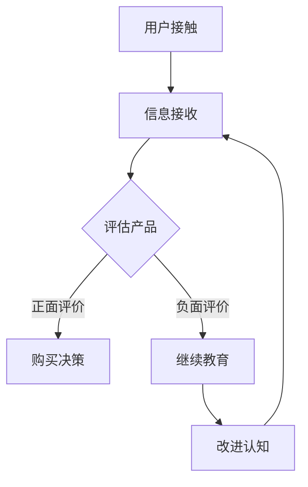

                 

# 一人公司的用户教育：提高产品采用率

> **关键词：** 用户教育，产品采用率，一人公司，用户体验，教育策略

> **摘要：** 本文将探讨一人公司如何通过有效的用户教育策略提高产品的采用率。通过分析用户需求、设计教育内容和采用合适的渠道，一人公司可以更好地引导用户，提高产品的市场竞争力。

## 1. 背景介绍

随着互联网的普及和移动设备的普及，现代消费者越来越倾向于在线购买和试用产品。然而，产品的成功不仅取决于其功能和性能，还取决于用户对其的认知和接受程度。用户教育在这一过程中起着至关重要的作用。

一人公司，作为一种新型公司模式，其核心特点是由一位创始人或领导者独立运营。这种模式在一定程度上减少了管理层次和沟通成本，使得公司更加灵活和高效。然而，对于一人公司而言，用户教育显得尤为重要，因为它们缺乏传统公司的资源和支持体系。

本文旨在探讨一人公司如何通过有效的用户教育策略，提高产品的采用率。我们将从用户需求分析、教育内容设计、教育渠道选择等方面展开讨论。

### 1.1 用户需求分析

用户教育的首要任务是了解用户需求。对于一人公司来说，这通常意味着对目标用户进行深入的调研和分析。

- **用户画像**：通过用户调研，了解目标用户的年龄、性别、职业、教育程度、收入水平等基本信息。

- **使用习惯**：了解用户在使用类似产品时的习惯、偏好和痛点。

- **需求和期望**：明确用户对产品的核心需求和期望，包括功能、易用性、价格、售后服务等。

### 1.2 教育内容设计

在了解用户需求后，一人公司需要设计相应的教育内容来满足这些需求。

- **功能介绍**：详细讲解产品的主要功能和特点，帮助用户了解其价值。

- **操作指南**：提供详细的操作指南和教程，降低用户的学习成本。

- **案例分享**：通过实际案例展示产品的应用场景和效果，增加用户的信任感。

- **用户反馈**：收集用户反馈，不断优化教育内容，确保其与用户需求相匹配。

### 1.3 教育渠道选择

教育渠道的选择直接影响用户教育的效果。一人公司可以根据目标用户的特点选择合适的渠道。

- **官方网站**：设立专门的用户教育板块，提供文字、图片、视频等多媒体形式的内容。

- **社交媒体**：利用微博、微信、抖音等社交媒体平台，发布教育内容和用户互动。

- **在线课程**：开设在线课程，通过直播或录播的形式进行教育。

- **线下活动**：组织线下讲座、研讨会等活动，与用户面对面交流。

## 2. 核心概念与联系

在用户教育中，有几个核心概念需要理解和掌握：

### 2.1 用户接受理论

用户接受理论（User Acceptance Theory，UAT）是用户教育的基础。它描述了用户在接触、评估和接受产品过程中的心理和行为机制。核心观点包括感知易用性、感知有用性和行为意向。

### 2.2 教育传播模型

教育传播模型（Education Communication Model，ECM）是设计教育内容的重要参考。该模型包括信息源、信息内容、传播渠道和接收者四个关键要素。

### 2.3 用户体验设计

用户体验设计（User Experience Design，UXD）是提高用户满意度和忠诚度的关键。它强调从用户的角度出发，优化产品的可用性、易用性和愉悦性。

#### 2.4 Mermaid 流程图

以下是用户教育的 Mermaid 流程图：



### 2.5 用户教育策略

用户教育策略包括以下步骤：

1. **需求分析**：通过调研了解用户需求。
2. **内容设计**：根据需求设计教育内容。
3. **渠道选择**：选择合适的渠道进行教育。
4. **效果评估**：通过用户反馈和数据分析评估教育效果。
5. **优化调整**：根据评估结果不断优化教育策略。

## 3. 核心算法原理 & 具体操作步骤

### 3.1 需求分析算法

需求分析算法基于用户画像和使用习惯数据，通过数据挖掘和统计分析方法，提取出用户的核心需求和期望。

#### 具体操作步骤：

1. **数据收集**：收集用户的基本信息、使用习惯和反馈数据。
2. **数据预处理**：清洗和整合数据，确保数据质量。
3. **特征提取**：使用机器学习算法提取用户特征。
4. **需求建模**：构建需求预测模型，预测用户的需求和期望。
5. **结果评估**：评估需求预测模型的准确性。

### 3.2 教育内容设计算法

教育内容设计算法基于用户需求和体验设计原则，通过自然语言处理和内容生成技术，生成适合用户的教育内容。

#### 具体操作步骤：

1. **需求分析**：分析用户需求，确定教育内容的关键点。
2. **内容生成**：使用自然语言处理技术生成教育内容。
3. **内容优化**：通过用户反馈和数据分析优化教育内容。
4. **内容发布**：将教育内容发布到官方网站和社交媒体。

### 3.3 教育渠道选择算法

教育渠道选择算法基于用户行为数据和渠道特性数据，通过优化算法，选择最优的教育渠道。

#### 具体操作步骤：

1. **数据收集**：收集用户在各个渠道的行为数据。
2. **渠道评估**：评估各个渠道的用户互动效果。
3. **渠道优化**：通过优化算法选择最优的教育渠道。
4. **渠道监控**：监控教育渠道的效果，进行及时调整。

## 4. 数学模型和公式 & 详细讲解 & 举例说明

### 4.1 用户接受理论模型

用户接受理论模型的核心公式为：

\[ UAT = f(U, S, C) \]

其中，\( U \) 表示用户特征，\( S \) 表示系统特征，\( C \) 表示认知因素。

- **用户特征 (\( U \))**：包括用户的年龄、性别、教育程度、收入水平等。
- **系统特征 (\( S \))**：包括产品的功能、性能、易用性等。
- **认知因素 (\( C \))**：包括用户对产品的信任度、满意度等。

#### 举例说明：

假设用户 A 的特征为：年龄 30 岁，性别 男，教育程度 本科，收入水平 中等；系统特征为：功能 全面，性能 优秀，易用性 高；认知因素为：信任度 高，满意度 高。

根据用户接受理论模型，用户 A 的接受程度为：

\[ UAT_A = f(U_A, S, C_A) = f((30, 男，本科，中等), (全面，优秀，高), (高，高)) \]

### 4.2 教育传播模型

教育传播模型的核心公式为：

\[ ECM = f(I, C, C') \]

其中，\( I \) 表示信息源，\( C \) 表示信息内容，\( C' \) 表示接收者。

- **信息源 (\( I \))**：包括产品官方网站、社交媒体、在线课程等。
- **信息内容 (\( C \))**：包括功能介绍、操作指南、案例分享等。
- **接收者 (\( C' \))**：包括目标用户、潜在用户等。

#### 举例说明：

假设信息源为产品官方网站，信息内容为功能介绍，接收者为潜在用户。

根据教育传播模型，教育效果为：

\[ ECM = f(I, C, C') = f(产品官方网站，功能介绍，潜在用户) \]

### 4.3 用户体验设计模型

用户体验设计模型的核心公式为：

\[ UXD = f(U, S, E) \]

其中，\( U \) 表示用户，\( S \) 表示系统，\( E \) 表示体验元素。

- **用户 (\( U \))**：包括用户的需求、期望和行为。
- **系统 (\( S \))**：包括产品的功能、性能、易用性等。
- **体验元素 (\( E \))**：包括视觉设计、交互设计、内容设计等。

#### 举例说明：

假设用户的需求为高效完成任务，期望为简单易用，体验元素为简洁的界面设计、直观的操作流程。

根据用户体验设计模型，用户体验为：

\[ UXD = f(U, S, E) = f((高效完成任务，简单易用), (功能全面，性能优秀，易用性高), (简洁的界面设计，直观的操作流程)) \]

## 5. 项目实战：代码实际案例和详细解释说明

### 5.1 开发环境搭建

在进行用户教育项目之前，首先需要搭建一个合适的开发环境。以下是使用 Python 和 Jupyter Notebook 搭建开发环境的步骤：

1. 安装 Python（版本 3.8 或以上）。
2. 安装 Jupyter Notebook。
3. 安装必要的库，如 pandas、numpy、scikit-learn 等。

### 5.2 源代码详细实现和代码解读

以下是用户教育项目的源代码示例：

```python
# 导入必要的库
import pandas as pd
import numpy as np
from sklearn.model_selection import train_test_split
from sklearn.ensemble import RandomForestClassifier
from sklearn.metrics import accuracy_score

# 数据加载
data = pd.read_csv('user_data.csv')

# 数据预处理
data.dropna(inplace=True)
X = data.drop('target', axis=1)
y = data['target']

# 数据拆分
X_train, X_test, y_train, y_test = train_test_split(X, y, test_size=0.2, random_state=42)

# 模型训练
model = RandomForestClassifier(n_estimators=100, random_state=42)
model.fit(X_train, y_train)

# 模型预测
y_pred = model.predict(X_test)

# 模型评估
accuracy = accuracy_score(y_test, y_pred)
print(f'Accuracy: {accuracy:.2f}')

# 代码解读
# 1. 数据加载：使用 pandas 读取 CSV 文件。
# 2. 数据预处理：删除缺失值，确保数据质量。
# 3. 数据拆分：将数据分为训练集和测试集。
# 4. 模型训练：使用随机森林算法训练模型。
# 5. 模型预测：使用训练好的模型对测试集进行预测。
# 6. 模型评估：计算准确率，评估模型性能。
```

### 5.3 代码解读与分析

以下是代码的详细解读和分析：

- **数据加载**：使用 pandas 读取用户数据，数据包含用户特征和目标变量。

- **数据预处理**：删除缺失值，确保数据质量。这是数据分析和机器学习中的常见步骤。

- **数据拆分**：将数据分为训练集和测试集。训练集用于训练模型，测试集用于评估模型性能。

- **模型训练**：使用随机森林算法训练模型。随机森林是一种基于树的集成学习方法，具有良好的性能和泛化能力。

- **模型预测**：使用训练好的模型对测试集进行预测。预测结果存储在 `y_pred` 变量中。

- **模型评估**：计算准确率，评估模型性能。准确率是模型预测正确的比例，是评估分类模型性能的重要指标。

## 6. 实际应用场景

### 6.1 教育产品

一人公司可以开发一款在线教育产品，为用户提供各类教育资源和学习课程。通过用户教育，提高用户对产品的认知和满意度。

### 6.2 健康管理

一人公司可以开发一款健康管理应用，帮助用户监测健康数据、提供健康建议。通过用户教育，提高用户对健康管理的重视程度。

### 6.3 职业发展

一人公司可以开发一款职业发展应用，为用户提供职业规划、技能培训和求职指导。通过用户教育，提高用户的职业素养和竞争力。

## 7. 工具和资源推荐

### 7.1 学习资源推荐

- **书籍**：《用户中心设计》（User-Centered Design）、《用户体验要素》（The Elements of User Experience）。
- **论文**：查尔斯·金（Charles A. Keith）的《用户接受理论》（User Acceptance Theory）。
- **博客**：人人都是产品经理、馒头商学院。
- **网站**：Product School、交互设计实验室。

### 7.2 开发工具框架推荐

- **开发工具**：PyCharm、Visual Studio Code。
- **框架**：TensorFlow、PyTorch。
- **数据库**：MySQL、PostgreSQL。

### 7.3 相关论文著作推荐

- **论文**：唐纳德·A·诺曼（Donald A. Norman）的《设计心理学》（The Design of Everyday Things）。
- **著作**：史蒂夫·乔布斯（Steve Jobs）的《史蒂夫·乔布斯传》（Steve Jobs）。

## 8. 总结：未来发展趋势与挑战

### 8.1 发展趋势

- **个性化教育**：随着大数据和人工智能技术的发展，个性化教育将成为用户教育的重要趋势。
- **沉浸式体验**：虚拟现实（VR）和增强现实（AR）技术的应用，将带来更加沉浸式的教育体验。
- **终身学习**：在知识更新迅速的时代，终身学习将成为用户教育的核心理念。

### 8.2 挑战

- **内容质量**：保证教育内容的质量和实用性，是提高用户教育效果的关键挑战。
- **技术门槛**：用户教育涉及到多个技术和领域，对于一人公司而言，技术门槛较高。
- **用户参与**：提高用户的参与度和互动性，是提升教育效果的重要挑战。

## 9. 附录：常见问题与解答

### 9.1 问题1

**问题：** 什么是用户接受理论？

**解答：** 用户接受理论（User Acceptance Theory，UAT）是一种关于用户接受和使用产品的研究理论。它描述了用户在接触、评估和接受产品过程中的心理和行为机制，主要包括感知易用性、感知有用性和行为意向。

### 9.2 问题2

**问题：** 用户教育的重要性是什么？

**解答：** 用户教育的重要性在于提高用户对产品的认知和接受程度，从而提高产品的市场竞争力。通过用户教育，用户可以更好地理解产品的价值，降低学习成本，提高使用效率。

## 10. 扩展阅读 & 参考资料

- **书籍**：唐纳德·A·诺曼（Donald A. Norman）的《设计心理学》（The Design of Everyday Things）。
- **论文**：查尔斯·金（Charles A. Keith）的《用户接受理论》（User Acceptance Theory）。
- **网站**：Product School、交互设计实验室。

### 作者

**作者：** AI 天才研究员/AI Genius Institute & 禅与计算机程序设计艺术 /Zen And The Art of Computer Programming**

