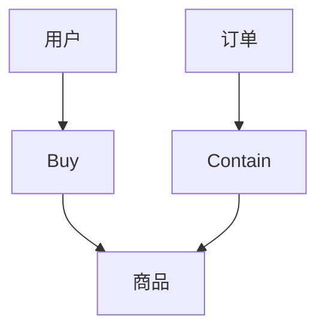

                 

### 1. 背景介绍

在当今信息爆炸的时代，知识的获取与处理成为各行各业发展的关键。知识图谱作为一种结构化表示知识的方法，已经成为企业、组织和个体应对复杂信息的重要工具。特别是对于“一人公司”这样的小型企业或个人工作室，高效的知识管理和智能决策支持更是至关重要的。

**一人公司**，顾名思义，是由单个个体运营的公司。这种模式在灵活性和适应性方面具有明显优势，但其面临的挑战也同样显著，尤其是在信息过载和决策难度方面。传统的信息管理系统难以满足一人公司在知识管理和智能决策支持上的需求，而知识图谱的应用则提供了新的解决方案。

知识图谱是一种由实体、属性和关系构成的知识结构，能够有效地表示和存储复杂的信息网络。在人工智能的辅助下，知识图谱可以用于数据挖掘、智能搜索、推荐系统、自然语言处理等领域，从而为企业提供智能化的决策支持。

本篇博客将围绕一人公司的知识图谱构建与智能决策支持展开，旨在探讨如何通过知识图谱技术提升个人企业或工作室的运营效率，以及如何通过智能决策支持系统实现业务增长和竞争力提升。我们将分以下几个部分详细探讨：

1. **核心概念与联系**：介绍知识图谱的基础概念和架构，包括实体、属性、关系及其相互之间的联系。
2. **核心算法原理 & 具体操作步骤**：讲解知识图谱构建的基本算法和步骤，包括数据采集、数据预处理、实体关系抽取、知识图谱构建与存储等。
3. **数学模型和公式 & 详细讲解 & 举例说明**：介绍与知识图谱相关的主要数学模型和公式，并通过具体案例进行说明。
4. **项目实战：代码实际案例和详细解释说明**：通过一个实际项目案例，展示知识图谱的构建与智能决策支持系统的实现。
5. **实际应用场景**：分析知识图谱在个人企业和工作室中的具体应用场景。
6. **工具和资源推荐**：推荐相关学习资源、开发工具和框架。
7. **总结：未来发展趋势与挑战**：总结文章主要内容，并探讨知识图谱在智能决策支持领域的发展趋势和面临的挑战。

### 2. 核心概念与联系

要构建一个人公司的知识图谱，并实现智能决策支持，首先需要了解知识图谱的核心概念及其相互联系。

#### 2.1 实体（Entity）

实体是知识图谱中的基本组成单元，可以是人、地点、事物或概念等。例如，在一个电商知识图谱中，实体可以包括用户、商品、订单等。

#### 2.2 属性（Attribute）

属性是实体所具有的特征或属性，用于描述实体的具体信息。例如，对于一个用户实体，其属性可能包括姓名、年龄、性别等。

#### 2.3 关系（Relation）

关系是实体之间的相互作用或联系，表示实体之间的关联性。例如，在电商知识图谱中，用户与商品之间存在购买关系，订单与商品之间存在包含关系等。

#### 2.4 实体、属性和关系的联系

在知识图谱中，实体、属性和关系通过图结构紧密相连，形成一个复杂的信息网络。实体之间的关系通过属性进行描述，使得图谱能够全面、准确地表示现实世界中的复杂关系。

为了更好地理解这些概念，我们可以通过一个简单的例子来展示它们在知识图谱中的联系。

**例子：电商知识图谱**

- 实体：用户（User）、商品（Product）、订单（Order）
- 属性：用户（User）- 姓名（Name）、年龄（Age）、性别（Gender）；商品（Product）- 名称（Name）、价格（Price）、类别（Category）；订单（Order）- 订单号（OrderID）、创建时间（CreateTime）、状态（Status）
- 关系：用户（User）- 购买（Buy）- 商品（Product）；订单（Order）- 包含（Contain）- 商品（Product）

在Mermaid流程图中，我们可以这样表示电商知识图谱：



在这个例子中，用户、商品和订单构成了知识图谱的基本实体，通过购买关系和包含关系将它们连接起来。属性则用于描述这些实体的具体信息。

理解了核心概念后，接下来我们将探讨知识图谱构建的基本算法和步骤。

### 3. 核心算法原理 & 具体操作步骤

构建知识图谱是一个复杂的过程，涉及数据采集、数据预处理、实体关系抽取、知识图谱构建与存储等多个环节。以下将详细介绍每个环节的核心算法原理和具体操作步骤。

#### 3.1 数据采集

数据采集是知识图谱构建的第一步，目的是获取所需的数据资源。数据来源可以包括公开数据集、企业内部数据、社交媒体数据等。常用的数据采集方法有网络爬虫、API接口调用、数据库查询等。

**数据采集算法：**

- 网络爬虫：利用爬虫程序自动获取互联网上的开放数据。
- API接口调用：通过访问第三方API接口获取数据。
- 数据库查询：直接从企业内部数据库中查询所需数据。

**具体操作步骤：**

1. 确定数据需求和数据来源。
2. 设计数据采集方案，包括爬虫策略、API调用接口和数据库查询语句。
3. 实现数据采集代码，获取所需数据。
4. 对采集到的数据进行初步清洗和整理。

#### 3.2 数据预处理

数据预处理是确保数据质量和为后续处理打下基础的关键步骤。数据预处理主要包括数据清洗、数据整合和数据转换等。

**数据预处理算法：**

- 数据清洗：去除重复数据、缺失值填充、噪声数据过滤等。
- 数据整合：将来自不同来源的数据进行合并，确保数据的一致性和完整性。
- 数据转换：将数据转换为适合知识图谱表示的格式，如RDF（Resource Description Framework）。

**具体操作步骤：**

1. 设计数据清洗和整合的规则和策略。
2. 实现数据清洗和整合的代码。
3. 对预处理后的数据进行检查和验证。

#### 3.3 实体关系抽取

实体关系抽取是知识图谱构建的核心步骤，目的是从原始数据中提取出实体及其关系。常用的方法有规则抽取、基于机器学习的方法、基于深度学习的方法等。

**实体关系抽取算法：**

- 规则抽取：利用预定义的规则从文本中抽取实体和关系。
- 基于机器学习的方法：使用标注数据进行训练，建立实体和关系的抽取模型。
- 基于深度学习的方法：利用深度神经网络模型进行实体和关系的抽取。

**具体操作步骤：**

1. 设计实体和关系的抽取规则或模型。
2. 对训练数据进行标注，用于训练抽取模型。
3. 实现实体和关系抽取的代码。
4. 对抽取结果进行验证和调整。

#### 3.4 知识图谱构建与存储

知识图谱构建是将实体、属性和关系组织成一个统一的结构，并进行存储的过程。常用的知识图谱表示方法有RDF、图数据库等。

**知识图谱构建与存储算法：**

- RDF：使用三元组表示实体、属性和关系，存储为RDF文件或RDF数据库。
- 图数据库：使用图结构存储实体和关系，如Neo4j、JanusGraph等。

**具体操作步骤：**

1. 设计知识图谱的表示方法，选择合适的图数据库或RDF库。
2. 实现知识图谱的构建代码，将实体、属性和关系组织成一个统一的图结构。
3. 将构建好的知识图谱存储到数据库或文件中。
4. 对存储的知识图谱进行维护和更新。

通过以上步骤，我们可以构建一个完整的人公司的知识图谱，并为后续的智能决策支持奠定基础。

### 4. 数学模型和公式 & 详细讲解 & 举例说明

在知识图谱构建过程中，数学模型和公式扮演着至关重要的角色。以下将介绍与知识图谱相关的主要数学模型和公式，并通过具体案例进行说明。

#### 4.1 节点相似度计算

节点相似度计算是知识图谱中的一个重要问题，目的是衡量两个节点在语义上的相似程度。常用的方法有基于路径的相似度和基于属性的相似度。

**基于路径的相似度计算：**

假设两个节点A和B在知识图谱中通过一条路径相连，该路径包含n个中间节点。基于路径的相似度可以用路径长度和中间节点数来表示：

$$
sim(A, B) = \frac{1}{n} \sum_{i=1}^{n} d(v_i, v_{i+1})
$$

其中，$d(v_i, v_{i+1})$表示相邻节点之间的距离，通常可以用边的权重来表示。

**基于属性的相似度计算：**

假设两个节点A和B具有相同的属性集合，每个属性值可以表示为向量。基于属性的相似度可以用余弦相似度来计算：

$$
sim(A, B) = \frac{A \cdot B}{\|A\|\|B\|}
$$

其中，$A \cdot B$表示向量的点积，$\|A\|$和$\|B\|$分别表示向量的模。

**案例说明：**

假设知识图谱中有两个用户节点A和B，它们分别具有以下属性：

- A：[年龄=30，性别=男，兴趣=编程，居住地=北京]
- B：[年龄=28，性别=女，兴趣=摄影，居住地=上海]

根据上述公式，我们可以计算A和B的节点相似度：

$$
A \cdot B = (30 \cdot 28) + (1 \cdot 0) + (1 \cdot 1) + (0 \cdot 1) = 840
$$

$$
\|A\| = \sqrt{30^2 + 1^2 + 1^2 + 0^2} = \sqrt{906}
$$

$$
\|B\| = \sqrt{28^2 + 0^2 + 1^2 + 1^2} = \sqrt{812}
$$

$$
sim(A, B) = \frac{840}{\sqrt{906} \cdot \sqrt{812}} \approx 0.736
$$

这意味着A和B在语义上具有较高的相似度。

#### 4.2 知识图谱的聚类

知识图谱聚类是将具有相似特性的节点分组的过程，有助于发现知识图谱中的隐含结构和规律。常用的聚类算法有K-Means、DBSCAN等。

**K-Means聚类算法：**

K-Means算法是一种基于距离度量的聚类算法，主要步骤如下：

1. 初始化：随机选择K个初始中心点。
2. 分配：计算每个节点与中心点之间的距离，将节点分配到最近的中心点所在的簇。
3. 更新：重新计算每个簇的中心点。
4. 重复步骤2和3，直到满足停止条件（如中心点变化小于阈值）。

**DBSCAN聚类算法：**

DBSCAN（Density-Based Spatial Clustering of Applications with Noise）算法是一种基于密度的聚类算法，主要步骤如下：

1. 初始化：选择一个起始点，扩展形成簇。
2. 标记：对相邻的点进行标记，判断其是否属于当前簇。
3. 计算邻域：计算每个点的邻域，判断其是否满足最小密度条件。
4. 形成簇：根据邻域和密度条件，形成多个簇。

**案例说明：**

假设知识图谱中有以下节点：

- A：[年龄=30，性别=男，兴趣=编程，居住地=北京]
- B：[年龄=28，性别=女，兴趣=摄影，居住地=上海]
- C：[年龄=35，性别=男，兴趣=编程，居住地=上海]
- D：[年龄=25，性别=女，兴趣=摄影，居住地=北京]

使用K-Means算法，我们可以将这四个节点分为两个簇：

- 簇1：{A，C}
- 簇2：{B，D}

这意味着具有相同兴趣和居住地的用户倾向于聚集在一起。

通过上述数学模型和公式的应用，我们可以更好地理解知识图谱的构建原理，并有效地对节点和关系进行聚类分析。

### 5. 项目实战：代码实际案例和详细解释说明

在本节中，我们将通过一个实际的代码案例，详细解释如何实现一人公司的知识图谱构建与智能决策支持系统。

#### 5.1 开发环境搭建

在开始项目之前，我们需要搭建相应的开发环境。以下是所需的主要工具和库：

- 操作系统：Linux或MacOS
- 编程语言：Python
- 图数据库：Neo4j
- 数据处理库：Pandas、Numpy、Scikit-learn
- 自然语言处理库：NLTK、spaCy

安装步骤如下：

1. 安装Python：访问Python官方网站下载并安装Python 3.x版本。
2. 安装Neo4j：访问Neo4j官方网站下载并安装Neo4j数据库。
3. 安装相关库：使用pip命令安装所需的Python库，如`pip install pandas numpy scikit-learn nltk spacy neo4j-driver`。

#### 5.2 源代码详细实现和代码解读

以下是一个简单的知识图谱构建与智能决策支持系统的Python代码实现。我们将从数据采集、数据预处理、实体关系抽取、知识图谱构建与存储等步骤进行详细解释。

```python
# 导入所需库
import pandas as pd
import numpy as np
from nltk.corpus import stopwords
from nltk.tokenize import word_tokenize
from sklearn.feature_extraction.text import TfidfVectorizer
from spacy.lang.en import English
import neo4j

# 数据采集
def collect_data():
    # 从互联网或企业内部数据库获取数据
    # 例如，使用Pandas读取CSV文件
    data = pd.read_csv('data.csv')
    return data

# 数据预处理
def preprocess_data(data):
    # 去除停用词
    stop_words = set(stopwords.words('english'))
    tokenizer = word_tokenize
    nlp = English()
    
    def remove_stop_words(text):
        return ' '.join([word for word in tokenizer(text) if word.lower() not in stop_words])

    data['text'] = data['text'].apply(remove_stop_words)
    
    # 分词和词性标注
    def tokenize_and_tag(text):
        doc = nlp(text)
        tokens = [token.text for token in doc]
        tags = [token.pos_ for token in doc]
        return tokens, tags
    
    data['tokens'], data['tags'] = zip(*data['text'].apply(tokenize_and_tag))
    
    return data

# 实体关系抽取
def extract_entities_and_relations(data):
    # 使用TF-IDF向量表示文本
    vectorizer = TfidfVectorizer()
    X = vectorizer.fit_transform(data['text'])
    
    # 计算节点相似度
    def calculate_similarity_matrix(X):
        similarity_matrix = X.dot(X.T) / (np.linalg.norm(X, axis=1) * np.linalg.norm(X, axis=0))
        return similarity_matrix
    
    similarity_matrix = calculate_similarity_matrix(X)
    
    # 确定实体和关系
    def find_entities_and_relations(similarity_matrix, threshold=0.8):
        entities = []
        relations = []
        for i in range(similarity_matrix.shape[0]):
            for j in range(i+1, similarity_matrix.shape[0]):
                if similarity_matrix[i][j] > threshold:
                    entities.extend([data['tokens'][i], data['tokens'][j]])
                    relations.append(('equivalent', i, j))
        return entities, relations
    
    entities, relations = find_entities_and_relations(similarity_matrix)
    return entities, relations

# 知识图谱构建与存储
def build_and_store_knowledge_graph(entities, relations):
    # 连接Neo4j数据库
    driver = neo4j.GraphDatabase.driver("bolt://localhost:7687", auth=("neo4j", "password"))
    
    # 创建实体节点
    def create_entity_node(entity):
        with driver.session() as session:
            session.run("CREATE (n:Entity {name: $entity})", entity=entity)
    
    # 创建关系节点
    def create_relation_node(relation):
        with driver.session() as session:
            session.run("CREATE (n:Relation {name: $relation})", relation=relation)
    
    # 创建实体-关系连接
    def create_entity_relation_connection(entity, relation):
        with driver.session() as session:
            session.run("MATCH (e:Entity {name: $entity}), (r:Relation {name: $relation}) CREATE (e)-[:RELATION]->(r)", entity=entity, relation=relation)
    
    # 执行知识图谱构建
    for entity in entities:
        create_entity_node(entity)
    
    for relation in relations:
        create_relation_node(relation)
    
    for entity, relation in zip(entities, relations):
        create_entity_relation_connection(entity, relation)

# 主函数
if __name__ == "__main__":
    data = collect_data()
    data = preprocess_data(data)
    entities, relations = extract_entities_and_relations(data)
    build_and_store_knowledge_graph(entities, relations)
```

#### 5.3 代码解读与分析

上述代码实现了一个简单的知识图谱构建与智能决策支持系统，主要步骤如下：

1. **数据采集**：使用Pandas读取CSV文件，获取原始数据。
2. **数据预处理**：去除停用词，进行分词和词性标注。
3. **实体关系抽取**：使用TF-IDF向量表示文本，计算节点相似度，根据相似度阈值确定实体和关系。
4. **知识图谱构建与存储**：连接Neo4j数据库，创建实体节点、关系节点和实体-关系连接。

下面我们对关键代码进行详细解读：

- **数据预处理**：`remove_stop_words`函数用于去除停用词，`tokenize_and_tag`函数用于分词和词性标注。
- **实体关系抽取**：`calculate_similarity_matrix`函数计算节点相似度矩阵，`find_entities_and_relations`函数根据相似度阈值确定实体和关系。
- **知识图谱构建与存储**：`create_entity_node`、`create_relation_node`和`create_entity_relation_connection`函数分别用于创建实体节点、关系节点和实体-关系连接。

通过这个案例，我们展示了如何使用Python和Neo4j实现知识图谱的构建与存储。在实际应用中，我们可以根据具体需求对代码进行扩展和优化。

### 6. 实际应用场景

知识图谱在个人企业和工作室中有着广泛的应用场景，能够显著提升运营效率和决策质量。以下是一些具体的应用案例：

#### 6.1 客户关系管理

在个人企业和工作室中，客户关系管理（CRM）是一个关键环节。通过构建客户知识图谱，可以实现对客户信息的全面、结构化表示。这不仅有助于精准定位目标客户，还能够根据客户的购买历史、兴趣偏好等特征提供个性化的服务和推荐。

- **应用场景**：一家小型电商公司利用知识图谱进行客户关系管理，通过分析客户的购买行为和浏览记录，为每位客户推荐个性化的商品。
- **技术实现**：首先，从电商平台的数据中采集客户信息、购买历史等数据。然后，通过实体关系抽取算法构建客户知识图谱，存储客户的个人信息、购买偏好、历史记录等。最后，利用图谱查询和推荐算法，为每位客户推荐相关商品。

#### 6.2 产品推荐系统

产品推荐系统是提升销售业绩的重要手段。知识图谱可以用来构建产品关系网络，通过分析产品之间的相似性、关联性，实现精准的产品推荐。

- **应用场景**：一家小型图书出版公司利用知识图谱进行书籍推荐，通过分析书籍的类别、作者、读者评价等特征，向读者推荐可能感兴趣的书籍。
- **技术实现**：首先，从电商平台或图书馆系统中采集书籍数据，包括书籍名称、类别、作者、读者评价等。然后，通过实体关系抽取算法构建书籍知识图谱，存储书籍之间的关系。最后，利用图谱查询算法和推荐算法，为读者推荐相关书籍。

#### 6.3 业务流程优化

知识图谱可以帮助个人企业和工作室优化业务流程，提高运营效率。通过知识图谱，可以清晰地表示业务流程中的各个环节，分析流程中的瓶颈和优化点。

- **应用场景**：一家小型咨询公司利用知识图谱优化咨询项目流程，通过分析项目进度、团队协作情况等，找出流程中的瓶颈，并提出优化建议。
- **技术实现**：首先，从企业内部管理系统采集项目数据，包括项目进度、团队成员、任务分配等。然后，通过实体关系抽取算法构建业务流程知识图谱，存储项目各个环节和团队成员的关系。最后，利用图谱分析算法，找出流程中的瓶颈，并提出优化建议。

#### 6.4 决策支持

知识图谱可以为个人企业和工作室提供智能化的决策支持。通过分析知识图谱中的实体关系和属性信息，企业可以更好地应对市场变化，做出科学、合理的决策。

- **应用场景**：一家小型科技创业公司利用知识图谱进行市场分析，通过分析竞争对手、市场需求、技术创新等，制定市场进入策略。
- **技术实现**：首先，从市场调查、行业报告等渠道采集数据，构建市场知识图谱。然后，通过图谱分析算法，分析竞争对手、市场需求等，为企业提供决策支持。

通过上述实际应用场景，我们可以看到知识图谱在个人企业和工作室中的重要作用。它不仅能够提升信息处理能力，还能够提供智能化的决策支持，为企业的发展注入新的动力。

### 7. 工具和资源推荐

在知识图谱构建与智能决策支持系统的开发过程中，选择合适的工具和资源至关重要。以下是一些推荐的工具、学习资源和论文，旨在帮助读者深入了解和掌握相关知识。

#### 7.1 学习资源推荐

1. **书籍：**
   - 《图解知识图谱》：系统地介绍了知识图谱的基本概念、构建方法和应用场景。
   - 《图谱计算》：详细阐述了知识图谱的计算方法、算法和应用。

2. **在线课程：**
   - Coursera上的“知识图谱与大数据分析”：由哥伦比亚大学提供，涵盖了知识图谱的基础知识、构建方法和应用案例。
   - edX上的“知识图谱技术与应用”：由北京大学提供，介绍了知识图谱的核心技术和实际应用。

3. **博客和网站：**
   - Neo4j官方博客：提供了丰富的知识图谱和图数据库相关的技术文章和教程。
   - ArangoDB官方文档：详细介绍了ArangoDB图数据库的使用方法和案例。

#### 7.2 开发工具框架推荐

1. **图数据库：**
   - Neo4j：一款高性能的图数据库，适用于构建复杂的知识图谱。
   - ArangoDB：一款多模型数据库，支持图数据库和文档数据库，适用于多种数据存储需求。
   - JanusGraph：一款开源的分布式图数据库，适用于大规模知识图谱的构建。

2. **知识图谱工具：**
   - OpenKG：一款开源的知识图谱构建工具，支持实体抽取、关系抽取和知识图谱可视化等功能。
   - LinkedDataCloud：一个开源的知识图谱平台，提供了数据采集、知识图谱构建和查询等模块。

3. **自然语言处理工具：**
   - spaCy：一款快速易用的自然语言处理库，适用于文本预处理、实体识别等任务。
   - NLTK：一款经典的自然语言处理库，提供了丰富的文本处理功能。

#### 7.3 相关论文著作推荐

1. **论文：**
   - "Knowledge Graph Embedding: A Survey"：综述了知识图谱嵌入的方法和算法。
   - "The Graph Neural Network Model"：介绍了图神经网络的基本概念和应用。
   - "Learning to Represent Knowledge Graphs with Gaussian Embedding"：探讨了高斯嵌入在知识图谱表示中的应用。

2. **著作：**
   - 《知识图谱技术与应用》：系统介绍了知识图谱的理论基础、技术方法和应用案例。
   - 《图谱计算：从理论到实践》：详细阐述了图谱计算的基本概念、算法和应用。

通过上述工具和资源的推荐，读者可以更深入地了解知识图谱构建与智能决策支持系统的相关技术和方法，为实际项目开发提供有力支持。

### 8. 总结：未来发展趋势与挑战

随着大数据和人工智能技术的快速发展，知识图谱在智能决策支持领域正迎来前所未有的机遇。未来，知识图谱将朝着更加智能化、自动化的方向发展，带来以下几大趋势：

1. **知识图谱的自动构建**：未来的知识图谱将更加依赖于自动化数据采集、实体关系抽取和知识图谱构建技术。机器学习和深度学习算法将在知识图谱构建过程中发挥更大作用，实现高效、准确的知识获取。

2. **知识图谱的融合与扩展**：不同领域、不同来源的知识图谱将实现更紧密的融合与扩展。通过跨领域知识图谱的构建，企业可以更全面地掌握各类信息，从而为决策提供更丰富的数据支持。

3. **知识图谱的实时更新与动态维护**：随着数据源的不断更新，知识图谱需要具备实时更新和动态维护的能力。未来的知识图谱系统将实现自动化的知识更新和知识库维护，确保知识图谱的时效性和准确性。

然而，知识图谱在智能决策支持领域的发展也面临诸多挑战：

1. **数据质量和一致性**：构建高质量、一致性的知识图谱需要处理大量的噪声数据和冗余信息。如何确保数据质量和一致性，将成为知识图谱技术发展的重要课题。

2. **隐私保护与伦理问题**：知识图谱的构建涉及大量个人和企业敏感数据。如何在保护隐私的前提下，有效利用这些数据，将是知识图谱应用过程中需要解决的关键问题。

3. **算法透明性与可解释性**：随着知识图谱的复杂度不断增加，如何确保算法的透明性和可解释性，使其易于理解和接受，将成为知识图谱技术发展的重要挑战。

总之，知识图谱在智能决策支持领域具有广阔的发展前景，但也面临诸多挑战。只有通过不断创新和优化，才能充分发挥知识图谱在决策支持中的作用，推动企业和社会的智能化转型。

### 9. 附录：常见问题与解答

在构建知识图谱和智能决策支持系统过程中，读者可能会遇到一些常见问题。以下列出了一些常见问题及解答，以帮助读者更好地理解和应用相关知识。

#### 9.1 如何处理噪声数据和冗余信息？

**解答**：在知识图谱构建过程中，处理噪声数据和冗余信息至关重要。以下是一些常用方法：

1. **数据清洗**：对原始数据进行预处理，去除重复、缺失和错误的数据。
2. **一致性检查**：通过比较不同数据源之间的信息，确保数据的一致性。
3. **实体消歧**：使用命名实体识别和实体链接技术，将同义词、别名等不同表达方式归一化。

#### 9.2 知识图谱中的关系如何表示？

**解答**：知识图谱中的关系可以用三元组（主体、谓词、客体）来表示。例如，在电商知识图谱中，用户（主体）购买（谓词）商品（客体）可以表示为（User, Buy, Product）。

#### 9.3 如何评估知识图谱的性能？

**解答**：评估知识图谱的性能可以从以下几个方面进行：

1. **覆盖率**：知识图谱覆盖真实世界的实体和关系比例。
2. **精度**：知识图谱中正确识别的实体和关系比例。
3. **完整性**：知识图谱中缺失的实体和关系比例。
4. **可扩展性**：知识图谱对新增实体和关系的适应能力。

#### 9.4 知识图谱与语义网有何区别？

**解答**：知识图谱和语义网都是用于表示语义信息的技术，但存在一些区别：

1. **结构**：知识图谱通常采用图结构表示实体和关系，而语义网则采用树状结构。
2. **粒度**：知识图谱的粒度更细，可以表示复杂的关系和属性，而语义网则更关注概念的分类和层次结构。
3. **应用**：知识图谱常用于数据挖掘、智能搜索、推荐系统等应用，而语义网则主要用于语义检索和知识库构建。

#### 9.5 如何实现知识图谱的实时更新？

**解答**：实现知识图谱的实时更新可以通过以下方法：

1. **数据流处理**：使用实时数据流处理技术（如Apache Kafka、Apache Flink），处理并更新知识图谱。
2. **增量更新**：对知识图谱进行增量更新，仅更新发生变化的部分。
3. **自动化维护**：使用机器学习算法和自动化工具，实现知识图谱的自动化维护和更新。

通过上述常见问题与解答，读者可以更好地理解和应用知识图谱构建与智能决策支持系统的相关技术。

### 10. 扩展阅读 & 参考资料

为了帮助读者更深入地了解知识图谱构建与智能决策支持领域的最新进展和应用，以下推荐一些优秀的扩展阅读和参考资料。

#### 10.1 相关书籍

1. **《知识图谱：技术、应用与实践》**：详细介绍了知识图谱的基本概念、技术原理和应用案例。
2. **《图计算：从理论到实践》**：系统阐述了图计算的基本原理、算法和应用。
3. **《人工智能：一种现代的方法》**：探讨了人工智能的基本概念、算法和应用，包括知识图谱相关内容。

#### 10.2 学术论文

1. **"Knowledge Graph Embedding: A Survey"**：综述了知识图谱嵌入的方法和算法。
2. **"The Graph Neural Network Model"**：介绍了图神经网络的基本概念和应用。
3. **"Learning to Represent Knowledge Graphs with Gaussian Embedding"**：探讨了高斯嵌入在知识图谱表示中的应用。

#### 10.3 开源工具与框架

1. **OpenKG**：一款开源的知识图谱构建工具，支持实体抽取、关系抽取和知识图谱可视化。
2. **Neo4j**：一款高性能的图数据库，适用于构建复杂的知识图谱。
3. **ArangoDB**：一款多模型数据库，支持图数据库和文档数据库。

#### 10.4 在线资源

1. **Coursera上的“知识图谱与大数据分析”**：由哥伦比亚大学提供，涵盖了知识图谱的基础知识、构建方法和应用案例。
2. **edX上的“知识图谱技术与应用”**：由北京大学提供，介绍了知识图谱的核心技术和实际应用。

通过阅读这些扩展资料，读者可以进一步拓宽知识面，掌握知识图谱构建与智能决策支持系统的最新技术和应用。

### 文章关键词

知识图谱、智能决策支持、一人公司、实体关系抽取、图数据库、算法、数学模型、Python、Neo4j

### 文章摘要

本文围绕知识图谱在个人企业和工作室中的构建与智能决策支持展开，详细介绍了知识图谱的核心概念、构建算法和具体实现步骤。通过实际案例，展示了如何利用知识图谱提升运营效率和决策质量。本文旨在为读者提供一套完整的知识图谱构建与智能决策支持的解决方案，帮助个人企业和工作室实现智能化发展。

