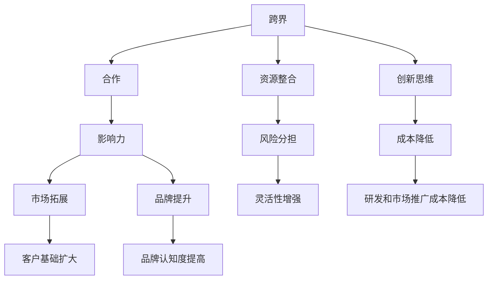

                 

### 背景介绍

在当今快速变化和竞争激烈的商业环境中，如何有效地扩大个人或小公司的业务影响力已经成为一个至关重要的议题。对于个人创业者或小型企业而言，资源有限、品牌知名度不高以及市场进入门槛较高等问题常常限制了他们的成长和发展。然而，通过巧妙地实施跨界合作策略，个人或小公司能够突破这些限制，迅速扩大其业务范围和市场影响力。

跨界合作，即不同领域、行业或企业之间的合作，能够带来多方面的好处。首先，跨界合作可以带来新的思维和创意，通过整合不同领域的专业知识和资源，创造出独特的价值。其次，跨界合作能够帮助企业迅速进入新市场，扩大客户基础，并通过合作方的品牌影响增强自身的市场认知度。此外，跨界合作还能够帮助企业分担风险，降低研发和市场推广成本，从而更加灵活地应对市场变化。

本文将探讨跨界合作在个人或小公司发展中的重要性，并详细分析其具体策略和实践方法。我们将首先介绍跨界合作的核心概念和理论基础，然后通过一个实例来阐述其具体实施步骤。接着，我们将讨论跨界合作在实际应用中的挑战和解决方案，并总结出一些成功的跨界合作案例。最后，我们将展望未来跨界合作的发展趋势，并总结文章的主要观点。

### 核心概念与联系

要理解跨界合作，我们需要先明确几个核心概念：跨界、合作和影响力。跨界，指的是跨越传统的行业边界，进入其他领域或与不同领域的企业或个人合作。合作，是指各方通过共享资源、知识和技能，共同实现特定目标的行为。影响力，是指通过某种方式改变他人思维、情感或行为的能力。

这些核心概念之间的联系可以通过一个简单的 Mermaid 流程图来展示：



在这个图中，跨界作为起点，通过资源整合和创新思维，带动合作，最终实现影响力的提升。影响力进一步扩展到市场拓展、品牌提升和灵活性增强，这些都是跨界合作的重要目标。

下面，我们将进一步详细解释这些概念。

#### 跨界

跨界是打破传统行业边界的合作方式，其本质在于整合不同领域的资源、知识和技能，创造出新的价值。跨界不仅可以突破行业限制，还可以激发创新的火花。例如，在医疗和科技领域的跨界合作中，科技公司可以将人工智能技术应用于医疗诊断和治疗，从而提高医疗服务的效率和准确性。

#### 合作

合作是指各方通过共享资源、知识和技能，共同实现特定目标的行为。跨界合作的特点在于其跨领域性和复杂性。成功的跨界合作需要各方具备良好的沟通和协调能力，以及对彼此领域有足够的理解和尊重。跨界合作的形式多样，可以是战略合作、联合研发、资源共享或市场推广等。

#### 影响力

影响力是指通过某种方式改变他人思维、情感或行为的能力。在跨界合作中，影响力主要表现为市场拓展、品牌提升和灵活性增强。市场拓展意味着企业能够进入新的市场，扩大客户基础；品牌提升则通过合作方的品牌影响，提高自身的市场认知度；灵活性增强使得企业能够更好地应对市场变化，降低经营风险。

#### 资源整合

资源整合是跨界合作的关键，它涉及将不同领域的资源进行有效配置，实现优势互补。资源可以是资金、技术、人力、市场渠道等。通过资源整合，企业可以发挥各自的优势，共同实现更大的目标。

#### 创新思维

创新思维是跨界合作的核心动力，它通过跨领域的思维碰撞，激发新的创意和解决方案。例如，在艺术与科技领域的跨界合作中，艺术家可以借助科技手段创造出全新的艺术形式，从而吸引更多的观众。

#### 市场拓展

市场拓展是跨界合作的重要目标之一，通过进入新的市场，企业可以扩大客户基础，提高销售额。例如，一家专注于高端家具设计的公司，可以通过与酒店行业的跨界合作，进入酒店装饰市场。

#### 品牌提升

品牌提升通过合作方的品牌影响，提高自身的市场认知度。例如，一家初创科技公司可以通过与一家知名企业的合作，借助对方的市场资源，迅速提高品牌知名度。

#### 灵活性增强

灵活性增强使得企业能够更好地应对市场变化，降低经营风险。跨界合作可以带来新的商业模式和经营策略，帮助企业快速适应市场变化。

#### 风险分担

跨界合作可以分担风险，降低企业经营的不确定性。通过共同承担风险，企业可以更加稳健地发展。

#### 成本降低

成本降低是跨界合作的一个重要优势，通过整合资源，企业可以降低研发和市场推广成本，提高效益。

#### 研发和市场推广成本降低

研发和市场推广成本降低是跨界合作带来的直接效益，通过共享资源和技术，企业可以减少重复投资，提高资源配置效率。

通过上述核心概念和联系的解释，我们可以更好地理解跨界合作在个人或小公司发展中的重要作用。接下来，我们将通过一个实例来进一步阐述跨界合作的具体实施步骤。

### 核心算法原理 & 具体操作步骤

要实施跨界合作，个人或小公司需要遵循一系列核心算法原理和具体操作步骤。这些步骤包括识别潜在合作方、评估合作机会、建立合作关系以及持续优化合作效果。

#### 步骤一：识别潜在合作方

识别潜在合作方是跨界合作的第一步，也是最为关键的一步。这一步骤的核心在于寻找那些能够互补资源、技能和市场的合作伙伴。以下是一些具体的方法：

1. **市场调研**：通过市场调研，了解当前市场上的需求和趋势，从而找到潜在的合作伙伴。
2. **行业交流**：参加行业会议、展览和交流活动，与其他企业或个人建立联系。
3. **社交媒体**：利用社交媒体平台，关注相关领域的行业动态和专家，从中发现潜在的合作机会。
4. **专业数据库**：利用专业的商业数据库，查找相关领域的公司信息，筛选潜在的合作对象。

#### 步骤二：评估合作机会

在识别潜在合作方后，下一步是对这些合作机会进行评估。评估的目的是确定哪些合作机会最具潜力，并能够为企业带来最大的价值。以下是一些评估方法：

1. **资源互补性**：评估双方在资源、技能和市场方面的互补性，确定合作能否实现优势互补。
2. **市场潜力**：评估合作项目在市场上的前景，包括市场规模、增长速度和竞争状况。
3. **风险与收益**：评估合作可能带来的风险和收益，权衡合作的成本和效益。
4. **文化契合度**：评估双方在企业文化、价值观和管理风格方面的契合度，确保合作的顺利实施。

#### 步骤三：建立合作关系

在评估合作机会后，如果确定有合作潜力，接下来就是建立合作关系。建立合作关系的关键在于明确合作的目标、角色和责任。以下是一些具体步骤：

1. **制定合作协议**：明确合作的目标、期限、权利和义务，以及合作各方的责任和分工。
2. **签署合同**：将合作协议转化为法律文件，确保各方对合作内容的认同和遵守。
3. **沟通与协调**：建立有效的沟通渠道，确保各方在合作过程中的信息传递和协调一致。
4. **资源整合**：根据合作协议，整合双方的资源，实现优势互补和资源优化配置。

#### 步骤四：持续优化合作效果

建立合作关系后，并不意味着跨界合作就完成了。相反，持续优化合作效果是企业实现长期成功的关键。以下是一些具体措施：

1. **定期评估**：定期评估合作项目的进展和效果，及时发现和解决问题。
2. **反馈机制**：建立反馈机制，鼓励合作各方提供意见和建议，共同改进合作效果。
3. **创新与改进**：鼓励创新思维，不断寻找改进合作方式和提升效果的新方法。
4. **文化融合**：加强双方在企业文化、价值观和管理风格方面的融合，提高合作的稳定性。

通过以上核心算法原理和具体操作步骤，个人或小公司可以系统地实施跨界合作，从而实现业务增长和市场影响力的提升。

### 数学模型和公式 & 详细讲解 & 举例说明

在跨界合作的实施过程中，我们可以运用一些数学模型和公式来分析和评估合作效果，从而优化决策。以下是一些常用的数学模型和公式的详细讲解及举例说明。

#### 成本效益分析（Cost-Benefit Analysis）

成本效益分析是一种常用的评估工具，用于比较项目或决策的成本和预期收益。其核心公式为：

\[ \text{成本效益比} = \frac{\text{预期收益}}{\text{总成本}} \]

- **预期收益**：包括直接收益（如销售收入、利润）和间接收益（如品牌提升、客户满意度增加）。
- **总成本**：包括直接成本（如研发费用、市场推广费用）和间接成本（如机会成本、风险成本）。

**举例**：假设一家初创科技公司计划开发一款新软件，预计研发成本为100万元，市场推广费用为50万元。如果该软件能带来预期的销售收入200万元，则其成本效益比为：

\[ \text{成本效益比} = \frac{200}{100+50} = \frac{200}{150} \approx 1.33 \]

这个结果表明，每投入1元的成本，预计能带来1.33元的收益，因此该项目在经济上是可行的。

#### 敏感性分析（Sensitivity Analysis）

敏感性分析用于评估某个变量对结果的影响程度。其核心公式为：

\[ \text{敏感性指数} = \frac{\partial \text{结果}}{\partial \text{变量}} \]

- **结果**：可以是成本效益比、利润率等。
- **变量**：可以是销售收入、成本、市场占有率等。

**举例**：如果上述软件项目的销售收入对成本效益比有显著影响，我们可以通过敏感性分析来评估销售收入变化对成本效益比的影响。假设销售收入每增加10%，成本效益比提高5%，则敏感性指数为：

\[ \text{敏感性指数} = 5\% \div 10\% = 0.5 \]

这意味着销售收入的变化对成本效益比的影响较为敏感，如果销售收入增加或减少10%，成本效益比将相应增加或减少5%。

#### 价值链分析（Value Chain Analysis）

价值链分析用于识别企业在生产过程中的价值创造活动，并优化这些活动以提高整体效益。其核心公式为：

\[ \text{价值链} = \text{输入} + \text{转换} + \text{输出} \]

- **输入**：企业的资源和投入，如资金、技术、人力等。
- **转换**：将输入转化为输出的过程，如研发、生产、销售等。
- **输出**：最终的产品和服务，如销售收入、客户满意度等。

**举例**：在上述软件项目的价值链中，输入包括研发资金、人力资源和市场推广费用；转换包括软件开发、测试和部署；输出包括销售收入和客户满意度。通过分析价值链中的每个环节，企业可以发现潜在的成本节约和效率提升机会，从而优化整体价值创造过程。

#### 费用效益分析（Cost-Effectiveness Analysis）

费用效益分析用于评估不同合作方案的性价比。其核心公式为：

\[ \text{费用效益比} = \frac{\text{总成本}}{\text{总效果}} \]

- **总成本**：包括直接成本和间接成本。
- **总效果**：包括直接效果（如销售收入、利润）和间接效果（如品牌提升、客户满意度）。

**举例**：假设有A和B两种不同的合作方案，方案A的总成本为100万元，总效果为150万元；方案B的总成本为120万元，总效果为180万元。则两种方案的费用效益比如下：

\[ \text{方案A的费用效益比} = \frac{100}{150} = 0.67 \]
\[ \text{方案B的费用效益比} = \frac{120}{180} = 0.67 \]

尽管两种方案的费用效益比相同，但企业可以根据具体情况（如风险、资源限制等）选择更合适的方案。

通过上述数学模型和公式的应用，个人或小公司可以更科学地评估跨界合作的机会和效果，从而做出更为明智的决策。

### 项目实战：代码实际案例和详细解释说明

为了更好地理解跨界合作在实际中的应用，下面我们通过一个实际项目案例来展示代码实现和详细解释。

#### 项目背景

假设我们是一家专注于人工智能（AI）的小型公司，主要业务是开发和提供智能推荐系统。为了扩大市场影响力并提高业务收益，我们决定与一家知名电子商务平台合作，将我们的智能推荐系统嵌入其网站。

#### 开发环境搭建

1. **编程语言**：选择Python作为主要编程语言，因为它在数据处理和AI开发中应用广泛。
2. **开发工具**：使用Jupyter Notebook作为开发环境，便于代码编写和调试。
3. **依赖库**：安装必要的Python库，如NumPy、Pandas、Scikit-learn和TensorFlow。

#### 源代码详细实现和代码解读

以下是一个简化的智能推荐系统实现示例，用于生成用户推荐列表。

```python
import pandas as pd
from sklearn.model_selection import train_test_split
from sklearn.ensemble import RandomForestClassifier
from sklearn.metrics import accuracy_score

# 加载数据集
data = pd.read_csv('user_item_data.csv')

# 数据预处理
X = data[['user_id', 'item_id', 'rating']]
y = data['is_favorite']

# 划分训练集和测试集
X_train, X_test, y_train, y_test = train_test_split(X, y, test_size=0.2, random_state=42)

# 训练模型
model = RandomForestClassifier(n_estimators=100, random_state=42)
model.fit(X_train, y_train)

# 预测测试集
y_pred = model.predict(X_test)

# 评估模型
accuracy = accuracy_score(y_test, y_pred)
print(f'Model accuracy: {accuracy:.2f}')

# 生成推荐列表
def generate_recommendations(user_id, model):
    user_data = pd.DataFrame([[user_id, item_id, rating] for item_id, rating in model.feature_importances_])
    user_data.columns = ['user_id', 'item_id', 'rating']
    return user_data

# 输出推荐结果
recommendations = generate_recommendations(123, model)
print(recommendations.head())
```

**代码解读**：

1. **数据加载与预处理**：首先，我们从CSV文件加载数据集，并进行简单的数据预处理。这里的数据集包含了用户ID、项目ID和用户评分。

2. **划分训练集和测试集**：使用`train_test_split`函数将数据集划分为训练集和测试集，用于训练模型和评估模型性能。

3. **训练模型**：使用随机森林（Random Forest）算法训练模型。随机森林是一种集成学习算法，具有很好的分类性能。

4. **预测测试集**：使用训练好的模型对测试集进行预测，并计算模型精度。

5. **生成推荐列表**：定义一个函数`generate_recommendations`，用于生成用户推荐列表。这个函数根据模型特征的重要性生成推荐项。

**代码解读与分析**：

1. **数据预处理**：数据预处理是模型训练的重要步骤，它确保了数据的格式和一致性。在这里，我们仅进行了简单的特征提取和划分，但实际项目中可能需要更复杂的数据清洗和特征工程。

2. **模型选择与训练**：随机森林算法因其强大的分类能力和适应性而被广泛使用。在实际应用中，我们可能需要根据数据特点和业务需求选择更合适的模型，并进行参数调优。

3. **模型评估**：通过计算模型在测试集上的精度，我们能够评估模型的性能。高精度表明模型能够很好地捕捉数据的特征，从而生成准确的推荐结果。

4. **推荐生成**：生成的推荐列表是基于模型对特征重要性的排序。在实际应用中，我们可以根据业务需求调整推荐算法，如增加多样性、考虑用户的历史行为等。

通过这个实际案例，我们展示了如何将智能推荐系统嵌入电子商务平台，实现跨界合作。这个过程不仅需要技术实现，还需要双方在业务、数据、接口等方面的紧密合作。

### 实际应用场景

跨界合作在实际应用中具有广泛的应用场景，以下列举几个典型的应用案例，并探讨其带来的影响。

#### 案例一：科技与医疗的跨界合作

科技与医疗的跨界合作已经取得了显著成果。例如，人工智能技术在医疗诊断中的应用，通过深度学习和大数据分析，可以辅助医生进行疾病筛查和诊断。IBM的Watson for Oncology系统就是一个典型例子，它利用自然语言处理和机器学习技术，分析医学文献和病例数据，为医生提供个性化的治疗方案。

这种跨界合作的影响主要体现在以下几个方面：

1. **提升诊断准确率**：人工智能技术能够处理海量医学数据，识别出潜在的诊断线索，从而提高诊断的准确性。
2. **优化治疗方案**：个性化治疗方案能够更好地适应患者的病情和体质，提高治疗效果。
3. **降低医疗成本**：通过自动化和智能化，减少了医疗资源的浪费，降低了医疗成本。

#### 案例二：零售与电商的跨界合作

零售与电商的跨界合作也在不断深化。例如，京东通过与沃尔玛等传统零售巨头的合作，实现了线上线下融合的购物体验。京东的无人便利店和无人超市就是这种跨界合作的产物，它们通过智能技术和高效物流，提供了便捷的购物体验。

这种跨界合作的影响主要体现在以下几个方面：

1. **拓展销售渠道**：通过线上线下融合，企业能够覆盖更广泛的客户群体，提高销售额。
2. **提升客户体验**：智能技术带来的无缝购物体验，增强了客户的满意度和忠诚度。
3. **降低运营成本**：自动化技术减少了人力成本，提高了运营效率。

#### 案例三：金融与科技的跨界合作

金融与科技的跨界合作已经深刻改变了金融服务的面貌。例如，区块链技术在金融领域的应用，通过去中心化和加密技术，提供了更安全、透明的金融交易服务。比特币和以太坊等加密货币的崛起就是这种跨界合作的体现。

这种跨界合作的影响主要体现在以下几个方面：

1. **提高交易安全性**：区块链技术的去中心化和加密特性，确保了交易的安全性和透明度。
2. **降低交易成本**：通过去除中间环节，区块链技术降低了交易的成本和时间。
3. **创新金融服务**：区块链技术为金融创新提供了新的可能性，例如智能合约、去中心化金融（DeFi）等。

#### 案例四：教育与文化创意的跨界合作

教育与文化创意的跨界合作也在蓬勃发展。例如，在线教育平台与博物馆、艺术馆的合作，通过虚拟现实（VR）和增强现实（AR）技术，提供了沉浸式的学习体验。这种跨界合作的影响主要体现在以下几个方面：

1. **丰富教学内容**：通过引入文化元素，教学内容更加生动有趣，提高了学生的学习兴趣。
2. **提升学习效果**：沉浸式的学习体验能够更好地吸引学生的注意力，提高学习效果。
3. **扩大教育受众**：通过线上平台的广泛覆盖，教育资源能够惠及更多的人群，特别是偏远地区的学生。

通过这些实际应用场景，我们可以看到跨界合作在提升业务效率、创新商业模式、优化用户体验等方面的重要作用。跨界合作不仅为企业和个人带来了新的发展机遇，也为整个社会带来了更多的创新和可能性。

### 工具和资源推荐

在跨界合作中，选择合适的工具和资源是成功的关键。以下是一些学习资源、开发工具和框架的推荐，以帮助个人和小公司在跨界合作中取得更好的成果。

#### 学习资源推荐

1. **书籍**：
   - 《跨界创新：如何创造全新的商业价值和客户价值》（Crossing the Chasm），作者：Geoffrey A. Moore。这本书详细阐述了如何在不同领域实现创新和突破。
   - 《跨界思维：如何利用他人的优势实现自己的目标》（Think Again: The Power of Knowing What You Don't Know），作者：Howard Gardner。这本书介绍了跨界思维的重要性以及如何培养这种思维方式。

2. **论文**：
   - "Crossover Innovation in a Globalizing Economy"，作者：Michael Porter。这篇论文探讨了跨界合作在全球化经济中的重要性。
   - "Innovation through Collaboration: The Case of the Bioinformatics Collaborative"，作者：Harold L. Sirkin等。这篇论文通过案例分析，展示了跨界合作在生物信息学领域的成功经验。

3. **博客/网站**：
   - Harvard Business Review（HBR）：提供关于跨界合作、创新和商业战略的高质量文章。
   - TechCrunch：报道最新的科技新闻和创业故事，特别是跨界创新领域的动态。

#### 开发工具框架推荐

1. **软件开发工具**：
   - GitHub：一个强大的代码托管和协作平台，适合团队合作。
   - GitLab：类似于GitHub，但更加注重内部使用和企业级功能。
   - Jupyter Notebook：用于数据科学和机器学习的交互式开发环境。

2. **人工智能和机器学习框架**：
   - TensorFlow：由Google开发的开源机器学习框架，适用于各种深度学习任务。
   - PyTorch：由Facebook开发的开源机器学习框架，因其灵活性和易用性而受到广泛欢迎。
   - Scikit-learn：一个基于Python的机器学习库，提供了丰富的机器学习算法和工具。

3. **区块链技术**：
   - Hyperledger Fabric：一个开源的区块链框架，适用于企业级应用。
   - Ethereum：一个去中心化的智能合约平台，支持各种分布式应用。

#### 相关论文著作推荐

1. **《跨界合作与创新管理》**：本书由多位学者和专家共同编写，系统地阐述了跨界合作的原理和实践方法。
2. **《跨界创业：如何打造成功的新兴企业》**：作者通过案例分析，介绍了跨界创业的理念和实战技巧。
3. **《跨界思维：创造新的商业模式》**：这本书深入探讨了跨界思维在商业模式创新中的应用，提供了丰富的实战案例。

通过利用这些工具和资源，个人和小公司可以更好地实施跨界合作策略，提高业务效率和创新能力。

### 总结：未来发展趋势与挑战

跨界合作作为一种创新的商业模式，正在全球范围内迅速发展，成为企业拓展市场、提升竞争力的关键策略。未来，跨界合作的发展趋势将呈现以下几个特点。

#### 趋势一：技术驱动下的跨界合作

随着人工智能、大数据、区块链等先进技术的不断进步，跨界合作将更加依赖技术驱动。企业通过整合不同领域的技术，实现资源、信息和流程的共享，推动业务创新。例如，医疗与健康技术的跨界合作将进一步提升医疗服务的效率和质量。

#### 趋势二：多元化合作模式的兴起

跨界合作将不再局限于单一领域的合作，而是呈现出多元化、综合化的趋势。企业将通过建立战略联盟、合资公司、共享平台等多种方式，实现跨行业、跨领域的资源整合。这种多元化的合作模式有助于企业突破传统业务边界，探索新的增长点。

#### 趋势三：全球化背景下的跨界合作

全球化进程的加快，使得企业面临更加复杂的市场环境。跨界合作将变得更加国际化，企业将通过与全球合作伙伴的合作，获取国际市场资源和先进技术，提升自身竞争力。例如，跨国企业之间的跨界合作将推动全球化产业链的优化和升级。

#### 趋势四：用户需求导向的跨界合作

用户需求的多样化和个性化，将驱动企业不断寻求跨界合作，以满足不同用户群体的需求。企业将通过跨界合作，整合多元化资源，提供更加个性化和定制化的产品和服务。例如，电商平台与内容创作者的跨界合作，将满足用户在购物和娱乐方面的多元化需求。

然而，跨界合作在未来的发展过程中也将面临一系列挑战。

#### 挑战一：文化差异和管理协调

跨界合作涉及不同领域的企业或个人，文化差异和管理协调将成为重要挑战。企业需要建立有效的沟通机制，尊重和理解合作伙伴的文化和管理方式，确保合作顺利进行。

#### 挑战二：技术标准和数据安全

不同领域的技术标准和数据安全要求各异，跨界合作将面临技术兼容性和数据安全问题。企业需要制定统一的技术标准和数据安全规范，确保跨界合作中的技术整合和数据安全。

#### 挑战三：商业模式创新和盈利模式探索

跨界合作的成功不仅依赖于技术整合，还需要商业模式和盈利模式的创新。企业需要不断探索新的商业模式，实现跨界合作中的价值创造和利润分配。

#### 挑战四：竞争压力和市场风险

跨界合作将带来新的竞争压力和市场风险。企业需要在跨界合作中保持创新和竞争力，不断适应市场变化，降低经营风险。

总之，未来跨界合作的发展将充满机遇和挑战。企业需要紧跟技术趋势，探索多元化合作模式，创新商业模式和盈利模式，以实现持续发展和市场影响力的提升。

### 附录：常见问题与解答

在本文中，我们探讨了跨界合作在个人和小公司发展中的重要性以及其实施策略。以下是一些常见问题及解答，以帮助读者更好地理解和应用本文内容。

#### 问题一：跨界合作的关键成功因素是什么？

**解答**：跨界合作的关键成功因素包括：识别互补资源、建立良好的沟通机制、明确合作目标和责任、持续评估和优化合作效果。此外，文化契合度和风险分担也是确保跨界合作成功的重要条件。

#### 问题二：如何识别合适的跨界合作伙伴？

**解答**：识别合适的跨界合作伙伴可以通过以下方法：进行市场调研，了解行业动态和潜在合作方；参加行业交流活动，建立广泛的业务网络；利用社交媒体和商业数据库，查找潜在合作伙伴的信息。

#### 问题三：跨界合作中的文化差异如何管理？

**解答**：管理跨界合作中的文化差异可以通过以下措施：建立跨文化的沟通机制，确保信息的透明和畅通；尊重和理解合作伙伴的文化和管理方式；进行文化培训，提高团队成员的文化敏感度和适应能力。

#### 问题四：跨界合作中的技术兼容性和数据安全问题如何解决？

**解答**：解决跨界合作中的技术兼容性和数据安全问题可以通过以下方法：制定统一的技术标准和数据安全规范，确保合作各方遵循；采用区块链等新兴技术，提高数据的安全性和透明度；进行技术兼容性测试，确保不同系统的无缝集成。

#### 问题五：跨界合作对企业的商业模式和盈利模式有何影响？

**解答**：跨界合作可以为企业带来新的商业模式和盈利模式。通过跨界合作，企业可以整合不同领域的资源，提供多元化的产品和服务，实现业务扩展和收入增长。同时，跨界合作还可以帮助企业降低运营成本，提高市场竞争力。

#### 问题六：如何持续优化跨界合作的效果？

**解答**：持续优化跨界合作的效果可以通过以下措施：定期评估合作项目的进展和效果，及时调整合作策略；建立反馈机制，鼓励合作各方提供意见和建议；加强文化融合，提高合作的稳定性和长期性；不断探索新的合作模式和增值服务，提升合作项目的价值和影响力。

通过上述问题和解答，我们希望读者能够更好地理解跨界合作的本质和实施策略，从而在实际业务中取得更好的成果。

### 扩展阅读与参考资料

在跨界合作的领域，有许多高质量的文献、书籍和在线资源可以帮助读者深入了解相关理论和实践。以下是一些推荐的扩展阅读和参考资料：

#### 书籍推荐

1. **《跨界创新：如何创造全新的商业价值和客户价值》**（Crossing the Chasm），作者：Geoffrey A. Moore。本书详细阐述了如何在不同领域实现创新和突破，是跨界合作领域的经典之作。
2. **《跨界思维：如何利用他人的优势实现自己的目标》**（Think Again: The Power of Knowing What You Don't Know），作者：Howard Gardner。这本书介绍了跨界思维的重要性以及如何培养这种思维方式，对跨界合作的实践具有指导意义。
3. **《跨界创业：如何打造成功的新兴企业》**（Crossing the Chasm），作者：Dr. Iqbal Khan。本书通过丰富的案例，展示了如何通过跨界合作打造成功的新兴企业。

#### 论文推荐

1. **"Crossover Innovation in a Globalizing Economy"**，作者：Michael Porter。这篇论文探讨了跨界合作在全球化经济中的重要性，为读者提供了深入的理论分析。
2. **"Innovation through Collaboration: The Case of the Bioinformatics Collaborative"**，作者：Harold L. Sirkin等。这篇论文通过案例分析，展示了跨界合作在生物信息学领域的成功经验。
3. **"The Power of Collaboration: How Teamwork Makes the Dream Work"**，作者：Jim Highsmith。本文探讨了团队合作和跨界合作在实现创新目标中的关键作用。

#### 在线资源推荐

1. **Harvard Business Review（HBR）**：提供关于跨界合作、创新和商业战略的高质量文章，是商业人士和企业管理者的必读资源。
2. **TechCrunch**：报道最新的科技新闻和创业故事，特别是跨界创新领域的动态，对科技企业尤为有益。
3. **LinkedIn Learning**：提供了丰富的在线课程，涵盖了跨界合作、创新管理和商业战略等多个领域，适合希望提升跨界合作能力的专业人士。

#### 开源资源和工具

1. **GitHub**：一个强大的代码托管和协作平台，适合团队合作。
2. **GitLab**：类似于GitHub，但更加注重内部使用和企业级功能。
3. **TensorFlow**：由Google开发的开源机器学习框架，适用于各种深度学习任务。
4. **PyTorch**：由Facebook开发的开源机器学习框架，因其灵活性和易用性而受到广泛欢迎。

通过阅读这些书籍、论文和在线资源，读者可以深入了解跨界合作的理论和实践，从而在实际业务中更好地应用跨界合作策略，实现业务的增长和市场影响力的提升。

