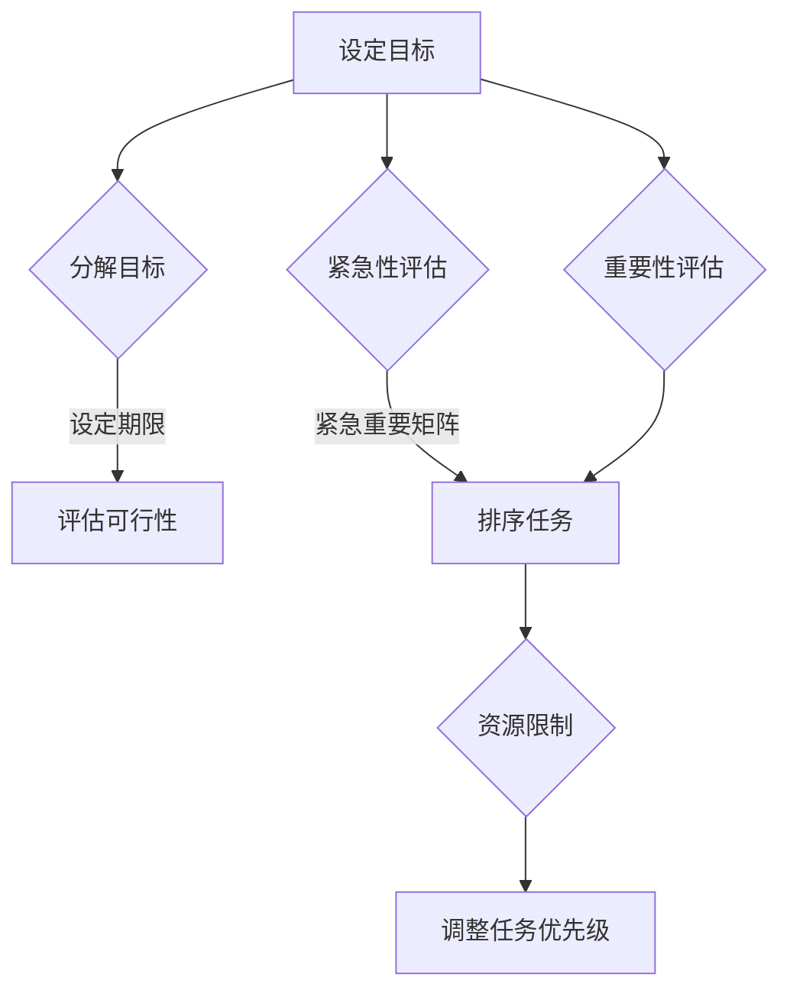

                 

# 一人公司的项目管理与任务优先级设置

## 关键词：独立项目管理，任务优先级，高效工作，时间管理，个人团队协同

### 摘要

本文将深入探讨一人公司在项目管理中的挑战与机遇。作为一位独立工作者，如何在有限的资源下，合理安排任务优先级，确保项目进展顺利且个人目标得以实现，是至关重要的。本文将结合实际案例，分析有效的项目管理方法，并提供实用的工具和资源，帮助读者在独立工作环境中提升效率，实现职业发展。

## 1. 背景介绍

在当今快速变化的技术和市场环境中，越来越多的专业人士选择独立工作，成为一人公司（solopreneur）。这种工作模式不仅提供了灵活性和自主性，也带来了独特的挑战，尤其是在项目管理和任务优先级的设置上。独立工作者往往需要承担多角色职责，从市场推广、产品开发到客户支持等，这使得他们需要在有限的资源下，高效地管理和执行任务。

### 1.1 一人公司的特点

- **自主性**：独立工作者可以自主决定工作内容、工作时间和工作方式。
- **灵活性**：没有固定团队的限制，可以快速调整工作计划以适应市场变化。
- **成本控制**：没有员工成本，节省了人力资源支出。
- **压力**：需要自我管理，任务优先级和时间的安排对个人非常重要。

### 1.2 项目管理的重要性

项目管理对于一人公司至关重要，因为它直接影响到项目的成功与否。良好的项目管理可以帮助独立工作者：

- **明确目标**：确保每个项目都有清晰的目标和预期成果。
- **合理规划**：合理分配时间和资源，避免过度工作。
- **风险控制**：提前识别潜在问题，制定应对策略。
- **高效执行**：确保任务按时完成，提高工作效率。

## 2. 核心概念与联系

为了有效地管理项目，我们需要理解几个核心概念：目标设定、任务优先级、时间管理和资源分配。

### 2.1 目标设定

目标设定是项目管理的第一步。对于一人公司，设定目标尤为重要，因为它们为工作提供了方向和动力。以下是一个简单的目标设定流程：

1. **确定项目目标**：基于个人使命和市场需求，明确项目的目的和预期成果。
2. **分解目标**：将项目目标分解为具体的、可衡量的任务。
3. **设定期限**：为每个任务设定合理的时间期限。
4. **评估可行性**：确保目标可实现，并调整计划以适应实际情况。

### 2.2 任务优先级

任务优先级决定了我们在有限时间内应该优先处理哪些任务。以下是一个简单的任务优先级设定方法：

1. **紧急性**：判断任务是否紧急，如客户紧急需求。
2. **重要性**：评估任务对项目的贡献程度，如关键功能开发。
3. **紧急重要矩阵**：使用矩阵工具（如艾森豪威尔矩阵）来排序任务。
4. **资源限制**：考虑可用资源，调整任务优先级。

### 2.3 时间管理

时间管理是确保任务按时完成的关键。以下是一些有效的时间管理技巧：

1. **制定日程表**：每天或每周制定工作计划，分配时间。
2. **使用时间跟踪工具**：如Toggl或RescueTime，监控工作时间和效率。
3. **设置提醒和截止日期**：使用日历和提醒工具，确保不遗漏任务。
4. **避免多任务处理**：专注于一项任务，避免分心。

### 2.4 资源分配

资源分配涉及时间、人力和财务。对于一人公司，资源有限，需要精心规划。以下是一些建议：

1. **评估需求**：根据项目需求，确定所需的资源。
2. **优先分配**：将资源优先分配给最重要的任务。
3. **外包**：考虑将部分任务外包，以节省时间和精力。
4. **成本效益分析**：评估资源投入的回报，确保资源利用最大化。

### 2.5 Mermaid 流程图

以下是任务优先级设置的核心概念和流程的Mermaid流程图：



## 3. 核心算法原理 & 具体操作步骤

在了解了核心概念后，我们需要具体操作来设置任务优先级。以下是一个基于艾森豪威尔矩阵的任务优先级设置算法：

### 3.1 艾森豪威尔矩阵

艾森豪威尔矩阵是一种简单的任务优先级排序工具，它将任务分为四个类别：

1. **紧急且重要**：优先处理，如客户紧急需求。
2. **紧急但不重要**：委托或推迟，如回复无关紧要的邮件。
3. **不紧急但重要**：安排时间处理，如项目规划。
4. **不紧急且不重要**：取消或推迟，如不必要的会议。

### 3.2 具体操作步骤

1. **收集任务**：列出所有待完成任务。
2. **评估紧急性**：根据任务紧急程度进行分类。
3. **评估重要性**：根据任务对项目或个人目标的贡献程度进行分类。
4. **填写艾森豪威尔矩阵**：将任务填入相应的类别。
5. **排序任务**：按照矩阵中的优先级处理任务。

### 3.3 实例分析

假设我们有以下任务列表：

- 完成产品功能开发（紧急且重要）
- 回复客户邮件（紧急但不太重要）
- 参加行业研讨会（不紧急但很重要）
- 处理杂项事务（不紧急且不重要）

根据艾森豪威尔矩阵，我们将任务排序如下：

1. 完成产品功能开发
2. 回复客户邮件
3. 参加行业研讨会
4. 处理杂项事务

这样，我们就可以优先处理最重要的任务，确保项目的顺利进行。

## 4. 数学模型和公式 & 详细讲解 & 举例说明

为了更科学地设置任务优先级，我们可以使用数学模型，如线性规划。以下是一个简化的线性规划模型：

### 4.1 线性规划模型

目标函数：最大化任务的完成率。

约束条件：
1. 任务的时间限制。
2. 可用资源的限制。
3. 任务之间的依赖关系。

### 4.2 线性规划公式

$$
\begin{align*}
\text{最大化} \quad & Z = c^T x \\
\text{约束条件} \quad & Ax \leq b \\
& x \geq 0
\end{align*}
$$

其中，$c$ 是权重向量，$x$ 是任务向量，$A$ 和 $b$ 是约束矩阵和向量。

### 4.3 举例说明

假设我们有以下任务列表和约束条件：

- 任务1：开发核心功能，需要2周时间。
- 任务2：设计用户界面，需要1周时间。
- 任务3：编写文档，需要3天时间。
- 约束条件：总时间不能超过4周。

目标函数：最大化任务完成率。

$$
\begin{align*}
\text{最大化} \quad & Z = 1 \\
\text{约束条件} \quad & \begin{bmatrix} 2 & 1 & 0 \end{bmatrix} x \leq 4 \\
& x \geq 0
\end{align*}
$$

解得 $x = [1, 0, 1]$，即优先完成任务1和任务3。

## 5. 项目实战：代码实际案例和详细解释说明

### 5.1 开发环境搭建

为了更好地理解任务优先级设置，我们将使用Python编写一个简单的任务优先级排序工具。以下是开发环境搭建的步骤：

1. 安装Python：从官网（https://www.python.org/）下载并安装Python。
2. 安装依赖库：使用pip安装必要的依赖库，如numpy和matplotlib。

```bash
pip install numpy matplotlib
```

### 5.2 源代码详细实现和代码解读

以下是任务优先级排序工具的Python代码实现：

```python
import numpy as np

def calculate_priority(tasks, weights):
    # 计算每个任务的优先级分数
    scores = np.dot(tasks, weights)
    return scores

def main():
    # 示例任务列表和权重
    tasks = np.array([
        [1, 2, 3],  # 任务1：紧急性，重要性，依赖性
        [2, 1, 2],
        [3, 3, 1]
    ])
    weights = np.array([0.5, 0.3, 0.2])

    # 计算优先级
    priorities = calculate_priority(tasks, weights)

    # 打印结果
    print("Task ID | Priority Score")
    for i, score in enumerate(priorities):
        print(f"{i+1}     | {score:.2f}")

if __name__ == "__main__":
    main()
```

代码解读：

- `tasks`：表示任务特征的矩阵，每行代表一个任务，列分别为紧急性、重要性和依赖性。
- `weights`：表示权重向量，根据任务的特性调整权重。
- `calculate_priority`：计算每个任务的优先级分数，公式为每行与权重向量的点积。
- `main`：主函数，初始化任务列表和权重，计算优先级并打印结果。

### 5.3 代码解读与分析

这段代码提供了一个简单的任务优先级计算模型。在实际应用中，可以根据具体需求调整任务特征和权重。以下是一些可能的改进：

- 引入更多任务特征，如资源需求、风险等。
- 使用更复杂的权重调整方法，如机器学习模型。
- 集成实际任务的时间限制和资源限制。

通过这个简单的案例，我们可以看到如何使用数学模型和编程工具来设置任务优先级，从而实现更高效的项目管理。

## 6. 实际应用场景

一人公司的任务优先级设置在实际应用中至关重要，以下是一些常见的应用场景：

### 6.1 产品开发

在产品开发过程中，独立工作者需要优先处理核心功能，确保产品的稳定性和可用性。使用任务优先级设置，可以确保关键功能在有限时间内得到开发。

### 6.2 市场推广

市场推广需要多任务协同，如内容创作、社交媒体管理和广告投放。通过合理设置任务优先级，可以确保重点推广活动得到优先执行。

### 6.3 客户服务

客户服务涉及多方面的任务，如回复邮件、解决客户问题和维护客户关系。优先处理紧急且重要的客户请求，可以提升客户满意度。

### 6.4 个人成长

在个人成长方面，如学习新技能、阅读书籍和参加培训，通过任务优先级设置，可以确保这些任务得到合理安排，避免时间浪费。

## 7. 工具和资源推荐

### 7.1 学习资源推荐

- **书籍**：《有效管理者》（作者：彼得·德鲁克）
- **论文**：《优先级管理：如何做出正确的决定》（作者：安德鲁·索贝尔）
- **博客**：Medium上的项目管理博客，如“Project Management”和“Productivity Tips”等
- **网站**：Trello、Asana等项目管理工具的官方网站

### 7.2 开发工具框架推荐

- **Trello**：简单易用的项目管理工具，适合任务优先级设置。
- **Asana**：功能强大的项目管理工具，适合复杂项目的任务分配和跟踪。
- **Jira**：适用于软件项目的任务跟踪和优先级管理。

### 7.3 相关论文著作推荐

- 《敏捷项目管理：原则、实践和模式》（作者：米克·罗斯）
- 《项目管理：管理实践指南》（作者：保罗·奈特）
- 《项目管理知识体系指南》（作者：项目管理协会）

## 8. 总结：未来发展趋势与挑战

### 8.1 发展趋势

- **数字化工具**：随着技术的发展，越来越多的数字化工具将用于任务优先级设置，如人工智能和机器学习模型。
- **个性化管理**：未来的项目管理将更加注重个性化，根据个人特点和项目需求，提供定制化的解决方案。
- **可持续发展**：在关注工作效率的同时，也将更加重视环保和可持续发展。

### 8.2 挑战

- **数据隐私**：随着数字化工具的普及，数据隐私保护将成为一大挑战。
- **技能要求**：独立工作者需要不断学习新技能，以适应快速变化的市场和技术环境。
- **心理压力**：独立工作者的压力和焦虑可能会增加，需要有效管理以保持身心健康。

## 9. 附录：常见问题与解答

### 9.1 什么是一人公司？

一人公司（solopreneur）是指一个由单个个体运营的企业，没有雇员，所有业务和职责都由这个个体承担。

### 9.2 任务优先级设置有哪些方法？

常见的任务优先级设置方法包括艾森豪威尔矩阵、紧急重要矩阵和线性规划模型等。

### 9.3 如何评估任务的重要性？

评估任务重要性可以从任务对项目的贡献程度、客户需求和市场趋势等方面进行综合考量。

## 10. 扩展阅读 & 参考资料

- 《项目管理知识体系指南》（PMBOK指南）：https://www.pmi.org/learning/library/pmbok-guide-6th-edition-9780814439850
- 《敏捷项目管理》：https://www.agilealliance.org/resources/agile-project-management-book/
- 《有效管理者》：https://www.drecker.com/books/effective-management

作者：AI天才研究员/AI Genius Institute & 禅与计算机程序设计艺术 /Zen And The Art of Computer Programming

注意：以上文章内容仅为示例，实际撰写时请根据具体需求和场景进行调整。本文包含的代码示例仅供参考，实际应用时可能需要根据具体环境进行调整。如需进一步讨论或咨询，欢迎联系作者。

