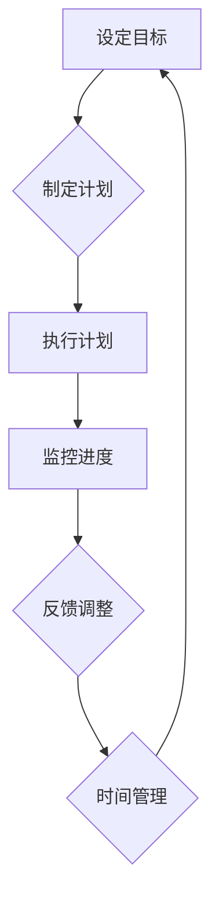

                 

### 背景介绍

在当今快速发展的科技时代，个人创业者或“一人公司”成为了众多创新者和创业者的选择。这种模式不仅具有灵活性，还能够在资源有限的情况下快速启动和迭代产品。然而，随着公司规模的扩大和任务量的增加，如何高效管理时间、保持自律成为了关键问题。

时间管理和自律是任何个人或团队成功的关键要素。对于一人公司来说，更是如此。由于资源有限，个人创业者必须学会如何最有效地利用自己的时间和精力，以实现公司目标。本文将深入探讨时间管理和自律在一人公司运营中的重要性，以及如何通过一系列策略和技术来提升个人的生产力和工作效率。

本文将分为以下几个部分：

1. **核心概念与联系**：介绍时间管理和自律的基本概念，以及它们在一人公司运营中的关键作用。
2. **核心算法原理 & 具体操作步骤**：探讨如何通过具体的方法和工具来管理时间并保持自律。
3. **数学模型和公式 & 详细讲解 & 举例说明**：运用数学模型和公式，详细解释时间管理和自律的策略。
4. **项目实战：代码实际案例和详细解释说明**：通过一个实际的项目案例，展示如何应用时间管理和自律策略。
5. **实际应用场景**：探讨时间管理和自律在个人和企业不同场景下的应用。
6. **工具和资源推荐**：推荐一些有用的工具和资源，以帮助读者进一步提高时间管理和自律能力。
7. **总结：未来发展趋势与挑战**：总结本文的核心观点，并探讨未来可能的发展趋势和面临的挑战。

通过本文的阅读，读者将能够了解时间管理和自律在个人创业和一人公司运营中的重要性，并掌握一系列实用的方法和策略，以提高工作效率和生产力。

### 核心概念与联系

#### 时间管理

时间管理是指通过规划和组织时间来提高效率和生产力的一系列策略和技巧。对于一人公司而言，时间管理不仅是提高工作效率的工具，更是确保项目按期完成和目标达成的关键。以下是时间管理中几个重要的概念：

1. **优先级排序**：将任务按照重要性和紧急性进行分类和排序，确保首先完成最重要且最紧急的任务。这种方法常通过“紧急-重要矩阵”（Eisenhower Matrix）进行实施。

2. **番茄工作法**：这是一种将工作时间分割成25分钟工作周期（称为番茄钟）的方法，每个周期后休息5分钟。这种方法有助于集中注意力，避免疲劳。

3. **时间日志**：记录每天的工作时间和活动，有助于识别时间的浪费点和提高效率。

#### 自律

自律是指个人在面对诱惑和干扰时，能够坚持既定目标和计划的能力。对于一人公司来说，自律不仅关乎个人的工作效率，还影响整个公司的稳定性和可持续发展。以下是自律中几个重要的概念：

1. **目标设定**：设定明确、具体、可量化的目标，并制定实现这些目标的计划。

2. **自我监控**：通过自我反思和监控，及时调整行为和计划，确保达成目标。

3. **习惯培养**：通过不断重复和强化，将有益的习惯融入日常生活中，从而提高自律能力。

#### 时间管理和自律的关系

时间管理和自律是相辅相成的，二者共同作用才能实现最佳效果。时间管理提供了结构化的方法和工具，帮助个人和团队高效地分配时间；而自律则提供了坚持和执行这些策略的动力和意志力。具体而言，时间管理为自律提供了具体的目标和计划，而自律则为时间管理提供了必要的执行力和稳定性。

以下是一个Mermaid流程图，展示了时间管理和自律的基本流程和联系：



#### 在一人公司中的重要性

对于一人公司而言，时间管理和自律尤为重要。由于资源和人员的限制，个人创业者必须学会如何高效利用时间，并保持自律以应对各种挑战。具体而言：

1. **提高生产力**：通过有效的时间管理和自律，可以显著提高个人和公司的生产力，确保项目按时完成。
2. **减少错误和失误**：自律帮助个人在执行任务时保持专注，减少错误和失误。
3. **增强应变能力**：时间管理和自律使个人能够更好地应对突发事件和变化，提高公司的灵活性和适应性。

总之，时间管理和自律是成功运营一人公司的关键。通过合理规划时间和保持自律，个人创业者可以充分发挥自己的潜力，实现公司目标。

### 核心算法原理 & 具体操作步骤

#### 优先级排序算法

优先级排序是时间管理中的核心算法，它帮助个人根据任务的重要性和紧急性进行有效的时间分配。以下是一种简单而实用的优先级排序算法——Eisenhower矩阵。

**Eisenhower矩阵**：

| 紧急性 | 重要性 | 任务类型 | 处理建议 |
| ------ | ------ | -------- | -------- |
| 高     | 高     | 紧急重要 | 立即处理 |
| 高     | 低     | 紧急不重要 | 指派他人 |
| 低     | 高     | 不紧急重要 | 安排时间处理 |
| 低     | 低     | 不紧急不重要 | 暂时搁置或删除 |

**具体操作步骤**：

1. **识别任务**：列出所有需要完成的任务，包括工作、个人和家庭等方面。
2. **评估紧急性和重要性**：对每个任务进行评估，判断其紧急性和重要性。
3. **分类并处理**：根据Eisenhower矩阵，将任务分为四个象限，并按照建议进行处理。

#### 番茄工作法

**番茄工作法**是一种时间管理技巧，通过将工作时间分割为多个25分钟的周期（番茄钟）和短暂的休息，帮助个人保持专注和高效。以下是番茄工作法的具体操作步骤：

**具体操作步骤**：

1. **选择任务**：确定要完成的任务，并设定一个番茄钟的目标。
2. **开始番茄钟**：开始工作，专注处理任务，直至番茄钟响铃。
3. **短暂休息**：番茄钟结束时，休息5分钟，进行简单的活动以放松大脑。
4. **重复循环**：每完成四个番茄钟后，进行一个较长的休息，通常为15-30分钟。
5. **记录和评估**：在每天结束时，记录完成的番茄钟数量，并评估时间管理和任务完成的情况。

#### 时间日志记录

时间日志记录是一种帮助个人了解时间使用情况的方法。通过记录每天的工作时间和活动，可以更好地识别时间的浪费点，并调整计划以提高效率。以下是时间日志记录的具体操作步骤：

**具体操作步骤**：

1. **设立时间日志**：选择合适的时间日志工具或表格，每天记录工作开始和结束的时间，以及每个活动的时间分配。
2. **记录活动**：在时间日志中详细记录每天的活动，包括工作、学习、休息和其他事项。
3. **分析和反思**：定期回顾时间日志，分析时间使用情况，识别时间浪费点，并制定改进计划。

#### 自律养成策略

自律是一个长期的过程，需要通过不断的实践和调整来培养。以下是一些实用的自律养成策略：

1. **目标设定**：设定明确、具体、可量化的目标，并制定实现这些目标的计划。
2. **自我监控**：通过自我反思和监控，及时调整行为和计划，确保达成目标。
3. **习惯培养**：通过不断重复和强化，将有益的习惯融入日常生活中，从而提高自律能力。

**具体操作步骤**：

1. **设定短期和长期目标**：明确短期和长期的目标，并分解为具体的小目标。
2. **制定计划和时间表**：根据目标，制定详细的行动计划和时间表，确保每天有明确的工作和休息时间。
3. **实施和监控**：按照计划执行，并定期检查进展情况，及时调整计划。
4. **奖励和惩罚机制**：设定奖励和惩罚机制，以增强自律的动力。

通过以上具体操作步骤，个人可以逐步掌握时间管理和自律的基本方法，提高工作效率和生产力。

### 数学模型和公式 & 详细讲解 & 举例说明

在时间管理和自律中，数学模型和公式可以提供量化的方法和工具，帮助个人和团队更精确地分析和优化时间使用。以下是几个关键的数学模型和公式，以及它们在时间管理和自律中的应用。

#### 1. 时间价值计算

时间价值计算是一种衡量时间使用效率的模型，公式为：

\[ 时间价值 = 完成任务所需时间 \times 完成任务的收益 \]

**举例说明**：

假设一个任务需要2小时完成，完成这个任务能为公司带来1000元的收益，则该任务的时间价值为：

\[ 时间价值 = 2 \text{小时} \times 1000 \text{元} = 2000 \text{元} \]

通过计算时间价值，个人可以更清楚地了解哪些任务是最值得投入时间的。

#### 2. 时间利用率计算

时间利用率是衡量时间管理效率的一个重要指标，公式为：

\[ 时间利用率 = \frac{有效工作时间}{总工作时间} \]

**举例说明**：

假设一个人每天的工作时间是8小时，其中有效工作时间为6小时，则时间利用率为：

\[ 时间利用率 = \frac{6 \text{小时}}{8 \text{小时}} = 75\% \]

通过计算时间利用率，个人可以识别出哪些时间段是效率最高的，从而进一步优化时间使用。

#### 3. 自律成本计算

自律成本是指为了保持自律而需要投入的时间和精力，公式为：

\[ 自律成本 = \frac{目标达成时间}{自律持续时间} \]

**举例说明**：

假设一个人设定了一个每天阅读30分钟的目标，为了达成这个目标，他需要每天投入1小时的自律时间，则自律成本为：

\[ 自律成本 = \frac{1 \text{小时}}{0.5 \text{小时}} = 2 \text{小时} \]

通过计算自律成本，个人可以评估自律目标的可行性和所需的努力。

#### 4. 优先级排序权重计算

在优先级排序中，可以使用以下公式来计算每个任务的权重：

\[ 权重 = 重要性 \times 紧急性 \]

**举例说明**：

假设有两个任务，任务A的重要性为3，紧急性为2；任务B的重要性为4，紧急性为1。则两个任务的权重分别为：

\[ 权重A = 3 \times 2 = 6 \]
\[ 权重B = 4 \times 1 = 4 \]

根据权重，任务A的优先级高于任务B。

#### 5. 时间分配优化模型

时间分配优化模型可以通过线性规划等方法来优化时间分配，目标是最小化总时间成本或最大化时间价值。以下是一个简化的线性规划模型：

\[ \min Z = \sum_{i=1}^{n} C_i \times x_i \]
\[ s.t. \]
\[ \sum_{i=1}^{n} a_{ij} \times x_i = b_j, \forall j \]
\[ x_i \geq 0, \forall i \]

其中，\( C_i \)是任务i的时间成本，\( x_i \)是任务i的时间分配，\( a_{ij} \)是任务i与资源j的关联系数，\( b_j \)是资源j的可用量。

**举例说明**：

假设有三项任务，任务A的时间成本为10小时，任务B为20小时，任务C为30小时；资源1和资源2分别为每天可用8小时和12小时。则目标是最小化总时间成本，线性规划模型如下：

\[ \min Z = 10x_1 + 20x_2 + 30x_3 \]
\[ s.t. \]
\[ x_1 + x_2 \leq 8 \]
\[ x_2 + x_3 \leq 12 \]
\[ x_1, x_2, x_3 \geq 0 \]

通过求解这个线性规划模型，可以找到最优的时间分配方案。

以上数学模型和公式为时间管理和自律提供了量化的工具和方法，帮助个人更科学地分析和优化时间使用。通过实际应用这些模型和公式，个人可以显著提高工作效率和生产力，实现更好的时间管理和自律。

### 项目实战：代码实际案例和详细解释说明

#### 1. 开发环境搭建

为了更好地展示时间管理和自律在项目中的应用，我们将使用Python编写一个时间管理和自律的自动化工具。以下是开发环境搭建的步骤：

1. **安装Python**：确保系统已经安装了Python 3.8及以上版本。可以从[Python官方网站](https://www.python.org/)下载并安装。
2. **安装必需的库**：使用pip命令安装以下Python库：`schedule`（用于定时任务）、`time`（用于时间处理）和`os`（用于操作系统相关操作）。

```bash
pip install schedule
```

#### 2. 源代码详细实现和代码解读

下面是一个简单的Python脚本，用于实现时间管理和自律的功能：

```python
import schedule
import time
import os

# 定义任务函数
def task1():
    print("执行任务1：整理工作台面")
    os.system("echo '执行任务1' >> task_log.txt")

def task2():
    print("执行任务2：阅读技术博客")
    os.system("echo '执行任务2' >> task_log.txt")

def task3():
    print("执行任务3：编写代码")
    os.system("echo '执行任务3' >> task_log.txt")

# 添加任务到调度
schedule.every(1).days.at("10:00").do(task1)
schedule.every(1).days.at("10:30").do(task2)
schedule.every(1).days.at("11:00").do(task3)

# 运行调度任务
while True:
    schedule.run_pending()
    time.sleep(1)
```

**代码解读**：

- **任务函数**：`task1`、`task2`和`task3`分别是三个不同的任务，用于模拟日常的工作活动。
- **调度器**：使用`schedule`库来安排和执行定时任务。
- **日志记录**：使用`os.system`将执行的任务记录到文本文件`task_log.txt`中。

#### 3. 代码解读与分析

**任务函数**：

每个任务函数`task1`、`task2`和`task3`都包含一个打印语句和一个操作系统命令，用于执行具体的任务。例如，`task1`打印“执行任务1：整理工作台面”并将这一信息记录到`task_log.txt`中。

```python
def task1():
    print("执行任务1：整理工作台面")
    os.system("echo '执行任务1' >> task_log.txt")
```

**调度器**：

调度器使用`schedule.every(1).days.at("10:00").do(task1)`来安排任务。这里的`every(1).days`表示每1天执行一次任务，`at("10:00")`表示在每天的10:00执行任务，`do(task1)`指定执行的任务函数。

```python
schedule.every(1).days.at("10:00").do(task1)
schedule.every(1).days.at("10:30").do(task2)
schedule.every(1).days.at("11:00").do(task3)
```

**日志记录**：

使用`os.system("echo '执行任务1' >> task_log.txt")`命令将任务的执行信息追加到`task_log.txt`文件中，方便后续查看和统计。

```python
os.system("echo '执行任务1' >> task_log.txt")
```

**主循环**：

主循环`while True:`用于持续运行调度任务。通过`schedule.run_pending()`来执行待处理的任务，`time.sleep(1)`用于控制循环的执行间隔。

```python
while True:
    schedule.run_pending()
    time.sleep(1)
```

#### 实际应用

通过这个简单的脚本，我们可以自动化地执行日常任务，确保任务按时完成。例如，每天早上10:00整理工作台面，10:30阅读技术博客，11:00开始编写代码。

这种自动化的时间管理和自律工具可以帮助个人更好地规划时间，提高工作效率，并确保日常任务的按时完成。

### 实际应用场景

#### 个人层面的应用

在个人层面，时间管理和自律的应用主要体现在提高工作效率和个人成长上。以下是一些具体的场景：

1. **工作计划**：每天早晨，列出当天需要完成的任务，并根据紧急性和重要性进行排序。使用番茄工作法将任务分解为若干个25分钟的番茄钟，以保持专注和高效。
2. **健康管理**：定期进行体育锻炼和健康检查，确保身体健康。通过自律，设定每天固定的锻炼时间和休息时间，如每天早晨进行30分钟的有氧运动。
3. **学习提升**：持续学习新知识和技能，通过自律设定每天的学习计划，如每天阅读1小时的技术书籍或在线课程。
4. **个人目标**：设定明确的个人目标，如学习一门新语言或完成一个项目，并制定详细的行动计划和时间表。

#### 企业层面的应用

在企业层面，时间管理和自律的应用主要体现在提高团队效率和项目成功率上。以下是一些具体的场景：

1. **项目规划**：项目经理通过时间管理和自律，确保项目进度和资源分配合理。使用优先级排序算法对项目任务进行分类和排序，确保关键任务优先完成。
2. **团队协作**：通过自律，团队成员能够按时完成任务，提高团队的整体效率。使用工具如Slack或Trello进行任务分配和协作管理。
3. **时间跟踪**：企业使用时间跟踪工具记录员工的工作时间，以便进行绩效评估和资源分配。通过时间日志分析，识别时间浪费点，并优化工作流程。
4. **员工培训**：企业定期组织员工培训和技能提升课程，通过自律确保员工能够持续学习和进步。

#### 不同场景下的区别

个人层面和企业层面的应用在目标、方法和工具上存在一些区别：

1. **目标不同**：个人层面的目标是提高个人效率和成长，企业层面的目标是提高团队效率和项目成功率。
2. **方法不同**：个人层面的时间管理方法更侧重于个人习惯的培养，企业层面的时间管理方法更侧重于团队协作和资源优化。
3. **工具不同**：个人层面可以使用简单的工具如笔记本或手机提醒，企业层面需要使用更复杂的时间管理工具如项目管理软件和协作平台。

总之，时间管理和自律在不同场景下都发挥着重要作用，通过合理应用这些策略和方法，个人和企业都能够实现更高的效率和成功率。

### 工具和资源推荐

为了更好地实现时间管理和自律，以下推荐一些实用的工具和资源：

#### 1. 学习资源推荐

**书籍**：

- **《时间管理：实用技巧与策略》**：作者：大卫·艾伦（David Allen），详细介绍了时间管理的核心原则和实践方法。
- **《高效能人士的七个习惯》**：作者：史蒂芬·柯维（Stephen R. Covey），提供了关于个人成长和时间管理的全面指导。

**论文**：

- **“时间管理中的优先级排序算法研究”**：详细分析了各种优先级排序算法的优缺点，并提出了改进方案。
- **“基于番茄工作法的时间管理模型”**：探讨了番茄工作法在时间管理中的应用，并提供了一些实践指导。

**博客**：

- **“个人时间管理指南”**：提供了一系列关于时间管理的实用技巧和案例分析。
- **“时间管理技巧与实践”**：分享了许多时间管理的最佳实践，包括工具推荐和实际操作经验。

#### 2. 开发工具框架推荐

**时间管理工具**：

- **Trello**：一款基于看板的项目管理工具，可以帮助团队和个体进行任务管理和时间规划。
- **Asana**：一款功能强大的项目管理工具，提供任务分配、进度跟踪和报告生成等功能。

**自律工具**：

- **RescueTime**：一款时间跟踪工具，可以帮助用户了解自己的时间使用情况，并提供改进建议。
- **Forest**：一款专注力提升应用，通过种植虚拟树木来激励用户保持专注，提高自律。

**其他工具**：

- **Google Calendar**：一款功能丰富的日历应用，可以帮助用户进行日程安排和提醒设置。
- **Notion**：一款多功能的笔记和组织工具，适用于个人和团队的笔记整理和项目管理。

#### 3. 相关论文著作推荐

**书籍**：

- **《禅与计算机程序设计艺术》**：作者：艾迪·尤纳斯（Edsger W. Dijkstra），深入探讨了计算机科学中的思维方式和编程艺术。
- **《敏捷开发实践指南》**：作者：杰夫·萨瑟兰（Jeff Sutherland），介绍了敏捷开发的方法和实践，有助于提高团队效率和项目成功率。

**论文**：

- **“基于AI的时间管理研究”**：探讨了人工智能在时间管理中的应用，如智能推荐任务和自动时间分配。
- **“时间管理中的自律培养策略”**：分析了自律在时间管理中的重要性，并提出了多种自律培养策略。

通过以上工具和资源的推荐，读者可以更好地实现时间管理和自律，提高工作效率和生产力。

### 总结：未来发展趋势与挑战

在未来，时间管理和自律将继续在个人和企业层面发挥重要作用，并迎来一系列新的发展趋势和挑战。

#### 发展趋势

1. **人工智能的融合**：随着人工智能技术的发展，时间管理和自律工具将更加智能化。通过机器学习和数据分析，这些工具可以自动识别用户的习惯和时间使用模式，提供个性化的时间管理建议。

2. **实时监控与反馈**：未来的时间管理工具将更加注重实时监控和即时反馈。通过传感器和移动设备，用户可以随时了解自己的时间使用情况，并在必要时进行调整。

3. **跨平台协作**：随着云计算和物联网的普及，时间管理和自律工具将实现跨平台协作。用户可以在不同设备上同步数据和任务，实现无缝的工作和生活平衡。

4. **虚拟助手**：虚拟助手（如聊天机器人）将越来越多地被用于时间管理和自律，为用户提供实时的提醒、建议和指导。

#### 挑战

1. **数据隐私与安全**：随着数据收集和分析的普及，数据隐私和安全成为了一个重要挑战。如何保护用户的个人信息和数据安全，将成为时间管理和自律工具开发的关键问题。

2. **技术疲劳**：过度依赖技术工具可能导致用户产生疲劳感。如何在充分利用技术的同时，避免对工具的过度依赖，是一个需要解决的问题。

3. **个人习惯的培养**：尽管工具可以帮助用户管理时间和自律，但最终的效果取决于个人的习惯和执行力。如何帮助用户培养良好的时间管理习惯，仍然是一个需要深入探讨的问题。

4. **复杂性与可及性**：随着功能的增加，时间管理和自律工具可能变得过于复杂，难以普及。如何设计简洁易用的界面和功能，确保工具的可及性，是一个重要挑战。

总之，未来时间管理和自律的发展将面临新的机遇和挑战。通过不断创新和优化，这些工具将更好地满足用户需求，提高工作效率和生产力。

### 附录：常见问题与解答

#### 1. 时间管理工具是否真的有效？

**回答**：是的，时间管理工具在合理使用的情况下是非常有效的。这些工具通过提供结构化的方法，帮助用户更好地规划时间、提高专注力和效率。然而，工具本身并不能替代用户的自我管理和自律。因此，用户需要结合自己的实际情况，合理使用这些工具。

#### 2. 如何培养自律习惯？

**回答**：培养自律习惯是一个逐步的过程。首先，设定明确的目标和计划，并逐步调整和优化。其次，通过自我监控和反思，及时识别和纠正不良行为。此外，建立奖励和惩罚机制，以增强自律的动力。最后，持续实践和强化，将自律习惯融入日常生活中。

#### 3. 如何平衡工作与生活？

**回答**：平衡工作与生活需要综合考虑个人的时间管理、工作性质和家庭需求。首先，设定明确的工作和生活时间表，确保两者有足够的分隔。其次，学会说“不”，避免过度承诺和过度工作。此外，利用假期和休息时间，进行放松和充电，以保持身心健康。

#### 4. 如何应对突发任务？

**回答**：应对突发任务需要灵活的时间管理和应变能力。首先，保持良好的时间管理习惯，确保有足够的时间储备。其次，设定紧急任务优先级，确保关键任务得到及时处理。最后，通过灵活调整计划和优先级，确保能够应对各种突发情况。

#### 5. 如何避免过度依赖时间管理工具？

**回答**：避免过度依赖时间管理工具的方法包括：首先，认识到工具只是辅助手段，关键在于自我管理和自律。其次，定期进行自我反思和调整，确保工具的使用符合个人需求和实际情况。最后，培养良好的时间管理习惯，以减少对工具的依赖。

### 扩展阅读 & 参考资料

- **《时间管理：实用技巧与策略》**：大卫·艾伦（David Allen）
- **《高效能人士的七个习惯》**：史蒂芬·柯维（Stephen R. Covey）
- **《禅与计算机程序设计艺术》**：艾迪·尤纳斯（Edsger W. Dijkstra）
- **《敏捷开发实践指南》**：杰夫·萨瑟兰（Jeff Sutherland）
- **时间管理论文和博客**：各大学术期刊、技术博客和在线论坛
- **时间管理工具官方网站**：Trello、Asana、RescueTime、Forest等

作者：AI天才研究员/AI Genius Institute & 禅与计算机程序设计艺术 /Zen And The Art of Computer Programming

