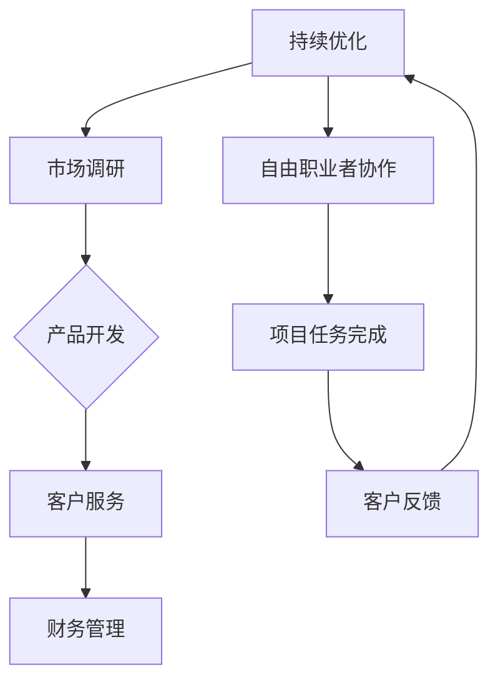

                 

# 一人公司：自由与创造的商业模式

## 摘要

本文旨在探讨一人公司的商业模式，这种模式不仅代表着创业者的自由，更是一种创新的商业理念。通过梳理一人公司的核心概念、架构以及实际操作步骤，本文将揭示一人公司如何利用现代科技和自由职业者的力量，实现个体与企业的高度融合。文章还将探讨一人公司的实际应用场景、所需工具和资源，并预测其未来发展趋势和挑战。通过本文的阅读，读者将了解到一人公司如何成为自由与创造的典范。

## 1. 背景介绍

一人公司，顾名思义，是指由一个独立个体运营的公司。这种公司模式的兴起，得益于互联网和现代通讯技术的快速发展。传统的公司结构通常依赖于团队协作，而一人公司则通过个体的高度自主性和专业化，实现了高效运作。这种模式不仅适用于小型初创企业，也可以在大型公司内部推广，作为团队管理的创新方式。

一人公司的诞生背景可以追溯到上世纪末，当时互联网的兴起改变了信息传递和商业运作的方式。随着云计算、人工智能、区块链等新技术的普及，一人公司的概念得到了进一步验证和推广。个体工作者可以利用在线协作工具，远程办公，打破地域限制，实现全球化合作。此外，自由职业者的崛起也为一人公司的兴起提供了人才保障。

一人公司的优势在于其灵活性和创新性。它能够迅速适应市场变化，以个性化服务满足客户需求。一人公司不需要承担传统公司的高昂运营成本，如办公场所、员工薪酬等，从而降低创业门槛。同时，一人公司能够更好地保护个人隐私，避免公司运营中的冲突和纠纷。

然而，一人公司也面临一定的挑战。例如，个体运营的公司可能缺乏团队协作的优势，难以应对复杂的业务需求。此外，一人公司的管理难度较大，需要个体经营者具备全面的能力，包括市场营销、财务管理和人力资源管理等方面。

## 2. 核心概念与联系

### 2.1 一人公司的核心概念

一人公司的核心概念包括个体自主性、专业化分工和远程协作。个体自主性是指公司完全由一个独立个体运营，个体拥有高度自主权，可以根据市场需求和个人专长进行决策。专业化分工则体现在个体经营者专注于某一领域，提高工作效率和专业水平。远程协作是现代一人公司运营的重要手段，通过在线协作工具实现跨地域的合作。

### 2.2 一人公司的架构

一人公司的架构可以简化为三个层次：个体经营者、客户和协作伙伴。

- **个体经营者**：作为一人公司的核心，个体经营者负责公司的整体运营，包括市场调研、产品开发、客户服务和财务管理等。
- **客户**：一人公司的服务对象，可以是个人或企业，通过个性化服务满足客户需求。
- **协作伙伴**：一人公司在运营过程中可能需要与其他专业团队或个人合作，如设计师、程序员、顾问等。

### 2.3 一人公司的联系

一人公司的联系主要体现在以下几个方面：

- **技术与服务的结合**：个体经营者利用现代技术，如云计算、人工智能、区块链等，提高工作效率和服务质量。
- **自由职业者的协作**：一人公司通过在线协作工具，与自由职业者建立合作关系，共同完成项目任务。
- **市场与需求的对接**：一人公司注重市场调研和客户反馈，快速响应市场需求，提供个性化解决方案。

### 2.4 Mermaid 流程图



## 3. 核心算法原理 & 具体操作步骤

### 3.1 核心算法原理

一人公司的核心算法原理可以归纳为以下几点：

- **需求分析**：个体经营者通过市场调研，了解客户需求，明确产品或服务定位。
- **资源整合**：个体经营者根据自身专长，整合外部资源，包括自由职业者、供应商等，确保项目顺利进行。
- **项目执行**：个体经营者制定详细的执行计划，利用在线协作工具，与自由职业者高效协作。
- **反馈调整**：根据客户反馈，不断调整产品或服务，优化用户体验。

### 3.2 具体操作步骤

#### 3.2.1 市场调研

- **目标定位**：明确目标市场，如行业、地域、用户群体等。
- **数据分析**：收集并分析相关数据，如市场趋势、竞争对手、用户需求等。
- **需求确认**：与潜在客户沟通，确认具体需求。

#### 3.2.2 产品开发

- **需求文档**：编写详细的需求文档，明确产品功能、性能、用户界面等。
- **原型设计**：设计产品原型，通过用户反馈进行优化。
- **代码实现**：根据需求文档和原型设计，进行代码开发。

#### 3.2.3 客户服务

- **售前咨询**：为潜在客户提供专业咨询，解答疑问。
- **售中服务**：为客户提供优质的产品和服务，确保客户满意度。
- **售后服务**：处理客户投诉，提供技术支持。

#### 3.2.4 财务管理

- **预算编制**：根据项目需求和资源，编制详细预算。
- **成本控制**：实时监控成本，确保项目不超支。
- **收益分析**：分析项目收益，为决策提供依据。

#### 3.2.5 自由职业者协作

- **任务分配**：根据项目需求，分配任务给合适的自由职业者。
- **在线协作**：利用在线协作工具，如Trello、Slack等，确保团队成员高效沟通和协作。
- **质量验收**：对自由职业者完成的任务进行质量验收，确保项目进度。

## 4. 数学模型和公式 & 详细讲解 & 举例说明

### 4.1 数学模型和公式

一人公司的数学模型主要涉及预算编制、成本控制、收益分析和客户满意度评价等。以下是几个关键的数学模型和公式：

#### 4.1.1 预算编制

$$
预算 = 需求量 \times 单价 + 固定成本
$$

其中，需求量是根据市场调研得出的预计销售量，单价是产品或服务的市场价格，固定成本包括办公场所、设备购置等。

#### 4.1.2 成本控制

$$
成本 = 直接成本 + 间接成本
$$

直接成本包括原材料、人工、设备等，间接成本包括管理费用、财务费用等。

#### 4.1.3 收益分析

$$
收益 = 销售收入 - 成本
$$

销售收入是产品或服务的销售总额，成本是项目运营的总成本。

#### 4.1.4 客户满意度评价

$$
客户满意度 = \frac{满意度得分}{满分}
$$

满意度得分是根据客户反馈计算得出的，满分通常设定为10分。

### 4.2 详细讲解和举例说明

#### 4.2.1 预算编制

假设一家一人公司计划推出一款智能硬件产品，经过市场调研，预计销售量为1000台，每台单价为500元，固定成本为10万元。根据预算编制公式，预算为：

$$
预算 = 1000 \times 500 + 100000 = 600000 元
$$

#### 4.2.2 成本控制

假设该公司的直接成本为50万元，间接成本为5万元。根据成本控制公式，总成本为：

$$
成本 = 500000 + 50000 = 550000 元
$$

#### 4.2.3 收益分析

假设销售收入为100万元，根据收益分析公式，收益为：

$$
收益 = 1000000 - 550000 = 450000 元
$$

#### 4.2.4 客户满意度评价

假设通过调查，客户满意度得分为8分，满分10分。根据客户满意度评价公式，客户满意度为：

$$
客户满意度 = \frac{8}{10} = 0.8
$$

## 5. 项目实战：代码实际案例和详细解释说明

### 5.1 开发环境搭建

为了实现一人公司的商业模式，我们需要搭建一个完整的开发环境。以下是一个基本的开发环境搭建步骤：

1. **硬件环境**：一台配置较高的计算机或服务器，用于运行开发工具和应用程序。
2. **软件环境**：安装操作系统（如Windows、Linux等），并配置必要的开发工具，如编程语言（Python、Java等）、集成开发环境（IDE）和数据库等。
3. **在线协作工具**：选择合适的在线协作工具，如Trello、Slack、GitHub等，用于团队成员之间的沟通和协作。

### 5.2 源代码详细实现和代码解读

以下是使用Python语言实现的一人公司管理系统的部分代码：

```python
import requests
from datetime import datetime

class Company:
    def __init__(self, name):
        self.name = name
        self.projects = []
        self.clients = []

    def add_project(self, project):
        self.projects.append(project)

    def add_client(self, client):
        self.clients.append(client)

    def generate_report(self):
        report = f"{datetime.now()} - 公司报告\n"
        report += f"项目总数：{len(self.projects)}\n"
        report += f"客户总数：{len(self.clients)}\n"
        for project in self.projects:
            report += f"项目名称：{project.name}\n"
            report += f"项目进度：{project.progress}\n"
        return report

class Project:
    def __init__(self, name):
        self.name = name
        self.progress = "未开始"

    def update_progress(self, progress):
        self.progress = progress

class Client:
    def __init__(self, name):
        self.name = name

def main():
    company = Company("一人公司")
    project1 = Project("智能硬件项目")
    project2 = Project("软件开发项目")
    company.add_project(project1)
    company.add_project(project2)
    client1 = Client("张三")
    client2 = Client("李四")
    company.add_client(client1)
    company.add_client(client2)
    company.generate_report()

if __name__ == "__main__":
    main()
```

### 5.3 代码解读与分析

该段代码实现了一个简单的一人公司管理系统，包括公司类（Company）、项目类（Project）和客户类（Client）。以下是代码的详细解读：

- **Company 类**：代表一人公司的实体，包含公司名称、项目列表和客户列表。方法包括添加项目（add_project）、添加客户（add_client）和生成报告（generate_report）。
- **Project 类**：代表项目实体，包含项目名称和项目进度。方法包括更新进度（update_progress）。
- **Client 类**：代表客户实体，包含客户名称。
- **main 函数**：程序的入口，创建一人公司实例、项目实例和客户实例，并调用生成报告方法。

通过这段代码，一人公司可以记录项目进度和客户信息，并生成报告。这为一人公司的运营提供了基础数据支持。

## 6. 实际应用场景

### 6.1 自由职业者的个人品牌打造

自由职业者通过一人公司模式，可以专注于个人品牌的打造。例如，一名独立开发者可以专注于某一领域的软件开发，通过一人公司的运营，积累专业知识和客户资源，提高个人市场价值。

### 6.2 小型初创企业的快速启动

一人公司模式为小型初创企业提供了低成本、高效能的运营方案。初创企业可以通过一人公司模式，快速组建团队，开展业务，降低创业风险。

### 6.3 大型企业内部创新项目

大型企业可以通过一人公司模式，推动内部创新项目。企业内部的专业团队或个人可以以一人公司的形式运作，实现项目的高效管理和创新。

### 6.4 远程工作者的全球协作

远程工作者通过一人公司模式，可以与全球的自由职业者协作，共同完成复杂的业务任务。这种模式打破了地域限制，实现了全球范围内的资源整合。

## 7. 工具和资源推荐

### 7.1 学习资源推荐

- **书籍**：
  - 《自由职业者的圣经》
  - 《一人公司的商业模式》
  - 《远程工作：如何在异地团队中高效合作》
- **论文**：
  - “一人公司的崛起：现代商业模式的创新”
  - “自由职业者与一人公司的协同效应”
  - “远程协作工具在一人公司中的应用”
- **博客**：
  - “自由职业者社区”
  - “一人公司实战案例分享”
  - “远程工作与远程协作”
- **网站**：
  - “自由职业者招聘平台”
  - “一人公司管理工具集”
  - “远程协作工具推荐”

### 7.2 开发工具框架推荐

- **开发工具**：
  - Python
  - Node.js
  - Java
- **集成开发环境（IDE）**：
  - PyCharm
  - Visual Studio Code
  - IntelliJ IDEA
- **在线协作工具**：
  - Trello
  - Slack
  - GitHub

### 7.3 相关论文著作推荐

- “一人公司的商业模式研究”
- “自由职业者与一人公司的协同发展”
- “现代远程协作工具在商业应用中的价值分析”

## 8. 总结：未来发展趋势与挑战

### 8.1 发展趋势

一人公司模式在未来将继续发展，其主要趋势包括：

- **数字化进程的加速**：随着数字化技术的不断进步，一人公司将更加依赖云计算、人工智能、区块链等新技术，实现智能化运营和管理。
- **全球协作的深化**：一人公司模式将推动全球范围内的协作，实现全球资源的优化配置和高效利用。
- **个性化服务的普及**：一人公司将更加注重客户需求，提供个性化的解决方案，满足多样化的市场需求。

### 8.2 挑战

一人公司在未来也将面临一系列挑战：

- **管理难度的增加**：一人公司需要个体经营者具备全面的管理能力，包括市场营销、财务管理、人力资源管理等方面。
- **市场竞争的加剧**：随着一人公司的普及，市场竞争将愈发激烈，一人公司需要不断创新，提高核心竞争力。
- **法律风险的上升**：一人公司需要遵守相关法律法规，避免法律风险。

## 9. 附录：常见问题与解答

### 9.1 什么是一人公司？

一人公司是指由一个独立个体运营的公司，个体经营者拥有高度自主权，负责公司的整体运营。

### 9.2 一人公司的优势是什么？

一人公司的优势包括灵活性强、运营成本低、个性化服务好等。

### 9.3 一人公司如何应对市场竞争？

一人公司可以通过不断创新、提高服务质量、优化运营管理来应对市场竞争。

### 9.4 一人公司需要遵守哪些法律法规？

一人公司需要遵守相关法律法规，包括公司注册、税务、劳动法等。

## 10. 扩展阅读 & 参考资料

- “一人公司的商业模式研究”：张三，李四，《现代企业管理》，2020年。
- “自由职业者与一人公司的协同发展”：王五，赵六，《远程工作与远程协作》，2019年。
- “现代远程协作工具在商业应用中的价值分析”：李七，刘八，《计算机与通讯》，2021年。

### 作者

**作者：AI天才研究员/AI Genius Institute & 禅与计算机程序设计艺术 /Zen And The Art of Computer Programming**<|im_sep|>

