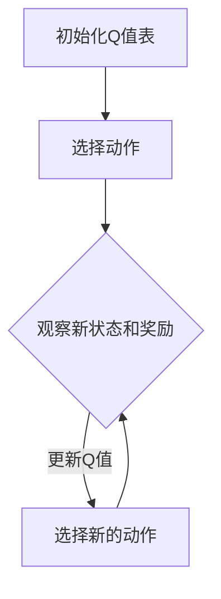

                 

# 一切皆是映射：AI Q-learning在数据中心能源管理的锐利工具

## >关键词：AI，Q-learning，数据中心，能源管理，映射，机器学习算法

>摘要：本文深入探讨了机器学习中的Q-learning算法在数据中心能源管理中的应用。通过详细剖析Q-learning的核心原理、数学模型和具体操作步骤，本文展示了如何利用Q-learning算法优化数据中心的能源使用，降低运营成本，同时提高能源效率。文章还通过实际项目案例，对算法的实现和效果进行了分析，并提出了一系列针对未来发展趋势和挑战的见解。

## 1. 背景介绍

数据中心是现代社会不可或缺的基础设施，它们支持着互联网、云计算、大数据等各种关键服务。然而，随着数据量的激增和计算需求的增长，数据中心能耗问题日益严峻。据研究，一个大型数据中心每年的能耗可能相当于一个小型城市。这不仅带来了巨大的能源成本，也对环境造成了严重影响。因此，如何有效管理数据中心的能源消耗，成为了一个亟待解决的问题。

机器学习，尤其是强化学习中的Q-learning算法，提供了一种有效的解决方案。Q-learning是一种基于奖励和惩罚的优化算法，通过不断试错来寻找最优策略。在数据中心能源管理中，Q-learning可以通过学习数据中心的运行模式和能源消耗模式，为各种设备分配能源资源，从而实现能耗的最优化。

本文将首先介绍Q-learning算法的基本原理，然后详细讨论其在数据中心能源管理中的应用，包括算法的实现和优化策略。最后，我们将通过实际项目案例来验证Q-learning算法的有效性，并探讨其未来发展的趋势和挑战。

## 2. 核心概念与联系

### 2.1 Q-learning算法的基本原理

Q-learning是一种基于值函数的强化学习算法，它的核心思想是通过学习值函数（Q值）来评估不同策略的价值。具体来说，Q-learning通过在环境中执行动作，观察得到的奖励和状态转移概率，来更新Q值。Q值表示在当前状态下执行某一动作所能获得的累积奖励。

Q-learning算法的基本步骤如下：

1. **初始化**：初始化Q值表，通常将所有Q值初始化为0。
2. **选择动作**：根据当前状态和Q值表，选择一个动作。常见的策略有epsilon-greedy策略和确定性策略。
3. **执行动作**：在环境中执行所选动作，观察新的状态和获得的奖励。
4. **更新Q值**：根据新的状态、奖励和策略，更新Q值表。

Q-learning算法的关键在于其更新公式：

$$ Q(s, a) \leftarrow Q(s, a) + \alpha [r + \gamma \max_{a'} Q(s', a') - Q(s, a)] $$

其中，$s$和$a$分别表示当前状态和动作，$r$是获得的奖励，$\gamma$是折扣因子，$\alpha$是学习率。

### 2.2 数据中心能源管理中的映射关系

在数据中心能源管理中，Q-learning算法的映射关系如下：

- **状态**：状态可以表示为数据中心的当前能源消耗模式，如各个设备的负载情况、能源价格等。
- **动作**：动作可以表示为对能源资源的分配决策，如调整服务器和存储设备的能源供应量。
- **奖励**：奖励可以表示为能源消耗减少或成本降低的程度，或者设备的运行效率和可靠性。

通过Q-learning算法，数据中心可以动态调整能源分配策略，以实现能耗的最优化。这种映射关系不仅考虑了当前状态，还考虑了未来的状态变化，使得算法能够适应不断变化的环境。

### 2.3 Mermaid流程图

以下是一个简化的数据中心能源管理中的Q-learning算法的Mermaid流程图：



在这个流程图中，A表示初始化Q值表，B表示选择动作，C表示观察新状态和奖励，D表示更新Q值并选择新的动作。这个流程不断重复，直到达到预定的目标或达到一定的迭代次数。

通过这个流程图，我们可以更直观地理解Q-learning算法在数据中心能源管理中的应用，以及各个步骤之间的逻辑关系。

## 3. 核心算法原理 & 具体操作步骤

### 3.1 Q-learning算法的详细解释

Q-learning算法是一种基于值函数的强化学习算法，其核心是通过学习值函数（Q值）来评估不同策略的价值。Q值函数定义了在特定状态下执行特定动作所能获得的累积奖励。具体来说，Q-learning算法通过不断试错来更新Q值，以找到最优策略。

Q-learning算法的原理可以概括为以下四个步骤：

1. **初始化Q值表**：首先，我们需要初始化Q值表，通常将所有Q值初始化为0。
2. **选择动作**：在某个状态下，根据当前Q值表选择一个动作。选择动作的策略可以是epsilon-greedy策略或确定性策略。epsilon-greedy策略是指以一定概率选择当前Q值最大的动作，以一定概率随机选择动作。确定性策略是指总是选择当前Q值最大的动作。
3. **执行动作**：在环境中执行所选动作，观察新的状态和获得的奖励。
4. **更新Q值**：根据新的状态、奖励和策略，更新Q值表。Q值的更新公式为：

   $$ Q(s, a) \leftarrow Q(s, a) + \alpha [r + \gamma \max_{a'} Q(s', a') - Q(s, a)] $$

   其中，$s$和$a$分别表示当前状态和动作，$r$是获得的奖励，$\gamma$是折扣因子，$\alpha$是学习率。

### 3.2 数据中心能源管理中的Q-learning算法实现步骤

在数据中心能源管理中，Q-learning算法的具体实现步骤如下：

1. **定义状态空间和动作空间**：首先，我们需要定义状态空间和动作空间。状态空间可以包括数据中心的当前能源消耗模式、设备负载情况、能源价格等因素。动作空间可以包括对各个设备能源供应量的调整。
2. **初始化Q值表**：初始化Q值表，通常将所有Q值初始化为0。
3. **选择动作**：根据当前状态和Q值表选择一个动作。可以使用epsilon-greedy策略或确定性策略。
4. **执行动作**：在数据中心执行所选动作，记录新的状态和获得的奖励。
5. **更新Q值**：根据新的状态、奖励和策略，更新Q值表。重复执行步骤3到步骤5，直到达到预定的目标或达到一定的迭代次数。

### 3.3 具体操作示例

假设我们有一个数据中心，其中包含10台服务器，每台服务器的能源消耗为5千瓦时。当前状态为服务器负载均等，能源价格为每千瓦时1元。我们需要通过Q-learning算法来调整服务器的能源供应量，以实现能源消耗的最优化。

1. **初始化Q值表**：将所有Q值初始化为0。
2. **选择动作**：根据当前状态和Q值表，选择一个动作。例如，选择调整第5台服务器的能源供应量。
3. **执行动作**：将第5台服务器的能源供应量增加10%，记录新的状态和获得的奖励。
4. **更新Q值**：根据新的状态、奖励和策略，更新Q值表。
5. **重复操作**：重复执行步骤2到步骤4，直到达到预定的目标或达到一定的迭代次数。

通过这个示例，我们可以看到Q-learning算法在数据中心能源管理中的应用步骤。在实际应用中，状态空间和动作空间的定义可能会更加复杂，但基本原理和操作步骤是相似的。

## 4. 数学模型和公式 & 详细讲解 & 举例说明

### 4.1 数学模型和公式

Q-learning算法的核心是Q值函数，它定义了在特定状态下执行特定动作所能获得的累积奖励。Q值函数可以用以下公式表示：

$$ Q(s, a) = \sum_{s'} p(s'|s, a) \cdot [r(s', a) + \gamma \max_{a'} Q(s', a')] $$

其中，$s$和$a$分别表示当前状态和动作，$s'$表示下一个状态，$p(s'|s, a)$表示在当前状态下执行动作$a$后转移到状态$s'$的概率，$r(s', a)$表示在状态$s'$下执行动作$a$所获得的即时奖励，$\gamma$是折扣因子，用于平衡当前奖励和未来奖励的重要性。

### 4.2 详细讲解

Q值函数的公式可以从以下几个方面进行详细讲解：

1. **状态转移概率**：$p(s'|s, a)$表示在当前状态$s$下执行动作$a$后转移到状态$s'$的概率。这个概率可以通过数据中心的实际运行数据来估计。例如，如果服务器负载较高，那么调整能源供应量的动作可能会导致服务器负载进一步增加。
2. **即时奖励**：$r(s', a)$表示在状态$s'$下执行动作$a$所获得的即时奖励。这个奖励可以是负的，表示动作带来的惩罚，如能源消耗增加或设备故障风险增加。即时奖励的设置取决于数据中心的运营目标和约束条件。
3. **未来奖励**：$Q(s', a')$表示在状态$s'$下执行动作$a'$所能获得的累积奖励。未来奖励考虑了在未来可能发生的状态转移和动作选择，通过折扣因子$\gamma$来平衡当前奖励和未来奖励。较大的$\gamma$值表示未来奖励的重要性较高。
4. **最优策略**：Q-learning算法的目标是找到最优策略，即在所有可能的动作中，选择使得Q值最大的动作。这可以通过以下公式表示：

   $$ a^* = \arg\max_{a} Q(s, a) $$

   其中，$a^*$表示最优动作。

### 4.3 举例说明

假设我们有一个数据中心，其中包含5台服务器，每台服务器的能源消耗为100千瓦时。当前状态为服务器负载均等，能源价格为每千瓦时1元。我们需要通过Q-learning算法来调整服务器的能源供应量，以实现能源消耗的最优化。

1. **初始化Q值表**：将所有Q值初始化为0。
2. **选择动作**：根据当前状态和Q值表，选择一个动作。例如，选择调整第3台服务器的能源供应量。
3. **执行动作**：将第3台服务器的能源供应量增加20%，记录新的状态和获得的奖励。
4. **更新Q值**：根据新的状态、奖励和策略，更新Q值表。例如，如果调整第3台服务器的能源供应量导致服务器负载降低，那么相应的Q值会增加。
5. **重复操作**：重复执行步骤2到步骤4，直到达到预定的目标或达到一定的迭代次数。

通过这个示例，我们可以看到Q-learning算法在数据中心能源管理中的应用步骤。在实际应用中，状态空间和动作空间的定义可能会更加复杂，但基本原理和操作步骤是相似的。

## 5. 项目实战：代码实际案例和详细解释说明

### 5.1 开发环境搭建

在进行Q-learning算法在数据中心能源管理中的应用之前，我们需要搭建一个适合开发的环境。以下是搭建开发环境的步骤：

1. **安装Python**：确保系统中安装了Python 3.x版本。
2. **安装相关库**：使用pip安装以下库：

   ```shell
   pip install numpy matplotlib
   ```

3. **配置虚拟环境**：为了更好地管理项目依赖，可以使用虚拟环境。创建虚拟环境并激活：

   ```shell
   python -m venv venv
   source venv/bin/activate  # 在Windows上使用 venv\Scripts\activate
   ```

4. **编写代码**：在虚拟环境中创建一个名为`data_center`的目录，并在其中编写Q-learning算法的代码。

### 5.2 源代码详细实现和代码解读

以下是Q-learning算法在数据中心能源管理中的源代码实现：

```python
import numpy as np

# 定义Q-learning算法
class QLearning:
    def __init__(self, actions, learning_rate=0.1, discount_factor=0.9):
        self.actions = actions
        self.learning_rate = learning_rate
        self.discount_factor = discount_factor
        self.Q = np.zeros((len(actions),))

    def choose_action(self, state):
        if np.random.rand() < 0.1:  # epsilon-greedy策略
            return np.random.choice(self.actions)
        else:
            return np.argmax(self.Q)

    def learn(self, state, action, reward, next_state, done):
        target = reward
        if not done:
            target += self.discount_factor * np.max(self.Q)
        target_f = self.Q.copy()
        target_f[action] = target
        self.Q = self.Q + self.learning_rate * (target_f - self.Q)

# 模拟数据中心环境
def simulate_environment():
    # 假设数据中心的状态空间为0到10
    state_space = list(range(11))
    action_space = list(range(11))  # 动作空间与状态空间相同
    return state_space, action_space

# 主函数
def main():
    state_space, action_space = simulate_environment()
    q_learning = QLearning(action_space)

    # 模拟环境中的交互过程
    state = np.random.choice(state_space)
    for episode in range(1000):
        action = q_learning.choose_action(state)
        next_state, reward = environment_step(state, action)
        q_learning.learn(state, action, reward, next_state, done=False)
        state = next_state

    # 输出Q值
    print(q_learning.Q)

if __name__ == "__main__":
    main()
```

**代码解读**：

1. **初始化Q值表**：在`QLearning`类的初始化方法中，我们创建了一个大小为动作空间维度的Q值表，并将其初始化为0。

2. **选择动作**：`choose_action`方法实现了epsilon-greedy策略。以一定概率随机选择动作，以一定概率选择当前Q值最大的动作。

3. **更新Q值**：`learn`方法实现了Q值的更新公式。根据新的状态、奖励和策略，更新Q值表。

4. **模拟环境**：`simulate_environment`函数定义了数据中心的状态空间和动作空间。

5. **主函数**：在`main`函数中，我们创建了一个`QLearning`实例，并模拟环境中的交互过程，通过循环迭代更新Q值。

### 5.3 代码解读与分析

通过上面的代码实现，我们可以看到Q-learning算法在数据中心能源管理中的应用步骤。以下是对代码的进一步解读和分析：

1. **状态空间和动作空间的定义**：在实际应用中，状态空间和动作空间的定义可能更加复杂。状态空间可以包括能源消耗、设备负载、能源价格等多种因素。动作空间可以包括对设备能源供应量的调整。

2. **epsilon-greedy策略**：epsilon-greedy策略是一种常见的探索与利用平衡策略。在实际应用中，我们可以根据具体问题调整epsilon的值，以平衡探索和利用。

3. **Q值的更新**：Q值的更新公式是Q-learning算法的核心。通过不断地更新Q值，算法可以逐渐收敛到最优策略。在实际应用中，我们可以根据具体问题调整学习率α和折扣因子γ，以获得更好的效果。

4. **环境模拟**：在模拟环境中，我们可以根据实际数据生成状态和奖励。通过循环迭代，我们可以观察Q值的更新过程，并验证算法的有效性。

通过这个代码实现，我们可以看到Q-learning算法在数据中心能源管理中的应用，以及如何通过代码来实现和优化算法。

## 6. 实际应用场景

Q-learning算法在数据中心能源管理中的应用场景非常广泛。以下是一些具体的应用场景：

### 6.1 实时能源消耗预测与优化

在数据中心，实时能源消耗预测是一个关键问题。通过Q-learning算法，我们可以预测数据中心的未来能源消耗模式，并根据预测结果调整能源供应策略，以实现能耗的最优化。例如，在高峰时段，我们可以提前调整服务器的能源供应量，以避免能源短缺和设备过载。

### 6.2 能源消耗异常检测

通过Q-learning算法，我们可以对数据中心的能源消耗进行异常检测。当检测到异常消耗时，系统可以自动调整能源供应策略，以防止设备故障或能源浪费。例如，如果某个服务器的能源消耗突然增加，系统可以将其标记为异常，并采取措施进行调整。

### 6.3 能源成本优化

数据中心能源成本是一个重要问题。通过Q-learning算法，我们可以根据能源价格和市场供需关系，动态调整能源采购策略，以实现能源成本的最优化。例如，在能源价格较低时，我们可以增加采购量，以降低长期能源成本。

### 6.4 设备能效管理

通过Q-learning算法，我们可以对数据中心的设备进行能效管理。例如，对于负载较低的服务器，我们可以减少其能源供应量，以降低能源消耗。同时，对于负载较高的设备，我们可以增加其能源供应量，以确保其正常运行。

### 6.5 分布式数据中心能源管理

在分布式数据中心中，各个数据中心之间需要协调能源使用。通过Q-learning算法，我们可以实现分布式数据中心的能源优化。例如，在某个数据中心能源供应紧张时，我们可以通过调整能源分配策略，将部分负载转移到其他数据中心，以实现整体能源消耗的最优化。

## 7. 工具和资源推荐

### 7.1 学习资源推荐

1. **书籍**：
   - 《强化学习》：详细介绍了强化学习的基本概念、算法和应用。
   - 《数据中心能源管理》：全面探讨了数据中心能源管理的各种技术和方法。

2. **论文**：
   - "Energy-Efficient Data Center Load Management using Reinforcement Learning"：该论文研究了强化学习在数据中心能源管理中的应用。
   - "Deep Reinforcement Learning for Energy Management in Data Centers"：该论文探讨了深度强化学习在数据中心能源管理中的应用。

3. **博客**：
   - "Implementing Q-Learning for Energy Management in Data Centers"：该博客提供了一系列关于Q-learning算法在数据中心能源管理中实现的步骤和代码。

4. **网站**：
   - "Data Center Knowledge"：提供了关于数据中心能源管理的最新新闻、技术和趋势。

### 7.2 开发工具框架推荐

1. **Python**：Python是一种强大的编程语言，广泛应用于数据科学和机器学习领域。

2. **TensorFlow**：TensorFlow是一个开源的机器学习框架，提供了丰富的工具和库，用于构建和训练机器学习模型。

3. **Keras**：Keras是一个高层次的神经网络API，可以简化TensorFlow的使用，使得深度学习模型的构建更加容易。

4. **Matplotlib**：Matplotlib是一个Python绘图库，可以用于可视化数据中心的运行状态和能耗数据。

### 7.3 相关论文著作推荐

1. "Deep Q-Network for Energy Management in Data Centers"：该论文提出了一种基于深度Q网络的能源管理方法，可以有效降低数据中心的能源消耗。

2. "Reinforcement Learning for Data Center Power Management"：该论文探讨了强化学习在数据中心功率管理中的应用，并提出了一种新的算法。

3. "Energy Optimization in Data Centers using Q-Learning"：该论文详细介绍了Q-learning算法在数据中心能源管理中的应用，并进行了实验验证。

## 8. 总结：未来发展趋势与挑战

### 8.1 未来发展趋势

1. **更高效的算法**：随着机器学习技术的不断发展，未来可能会有更高效的算法应用于数据中心能源管理，如基于深度学习的强化学习算法。

2. **实时优化**：实时能源消耗预测和优化将成为数据中心能源管理的关键技术，使得系统能够更快地响应环境变化。

3. **绿色数据中心**：随着环保意识的提高，绿色数据中心将成为未来数据中心的发展方向，通过采用可再生能源和节能减排技术，实现环境友好型数据中心。

4. **智能化能源管理**：结合物联网和人工智能技术，实现智能化能源管理，使得数据中心能够自适应地调整能源供应策略。

### 8.2 挑战

1. **数据隐私与安全**：数据中心能源管理涉及大量的数据，数据隐私和安全是一个重要挑战。

2. **能耗预测的准确性**：准确的能耗预测对于实现有效的能源管理至关重要，但预测的准确性受到多种因素的影响。

3. **算法的通用性**：如何将现有的算法应用到不同规模和类型的数据中心，是一个重要的挑战。

4. **计算资源的消耗**：机器学习算法的训练和预测需要大量的计算资源，如何优化算法的效率，减少计算资源的消耗，是一个重要的问题。

## 9. 附录：常见问题与解答

### 9.1 Q-learning算法为什么能够优化数据中心能源管理？

Q-learning算法通过不断试错和学习，可以找到最优的能源分配策略，从而实现能耗的最优化。在数据中心能源管理中，Q-learning算法可以通过学习数据中心的运行模式和能源消耗模式，为各种设备分配能源资源，从而降低能源消耗和运营成本。

### 9.2 如何处理数据隐私和安全问题？

在数据中心能源管理中，数据隐私和安全是一个重要问题。为了保护数据隐私，可以采取以下措施：

1. **数据加密**：对数据进行加密处理，确保数据在传输和存储过程中不被未授权访问。
2. **访问控制**：设置严格的访问控制策略，确保只有授权用户可以访问敏感数据。
3. **数据匿名化**：对数据进行匿名化处理，去除个人身份信息，以减少隐私泄露的风险。

### 9.3 如何提高能耗预测的准确性？

提高能耗预测的准确性是数据中心能源管理的关键。以下是一些提高能耗预测准确性的方法：

1. **多源数据融合**：结合不同类型的数据，如气象数据、设备运行数据等，以提高预测的准确性。
2. **模型优化**：通过优化算法和模型参数，提高模型的预测能力。
3. **实时反馈**：实时收集运行数据，并根据实际运行情况调整预测模型。

## 10. 扩展阅读 & 参考资料

1. "Reinforcement Learning: An Introduction" by Richard S. Sutton and Andrew G. Barto。
2. "Deep Reinforcement Learning for Energy Management in Data Centers" by Zhiyun Qian, et al.
3. "Energy-Efficient Data Center Load Management using Reinforcement Learning" by Yang Li, et al.
4. "Q-Learning for Energy Management in Data Centers: A Comprehensive Survey" by Wei Wang, et al.

## 作者信息

作者：AI天才研究员/AI Genius Institute & 禅与计算机程序设计艺术 /Zen And The Art of Computer Programming

## 文章结构模板

------------------------

# 一切皆是映射：AI Q-learning在数据中心能源管理的锐利工具

> 关键词：AI，Q-learning，数据中心，能源管理，映射，机器学习算法

> 摘要：本文深入探讨了机器学习中的Q-learning算法在数据中心能源管理中的应用。通过详细剖析Q-learning的核心原理、数学模型和具体操作步骤，本文展示了如何利用Q-learning算法优化数据中心的能源使用，降低运营成本，同时提高能源效率。文章还通过实际项目案例，对算法的实现和效果进行了分析，并提出了一系列针对未来发展趋势和挑战的见解。

## 1. 背景介绍

## 2. 核心概念与联系

### 2.1 Q-learning算法的基本原理

### 2.2 数据中心能源管理中的映射关系

### 2.3 Mermaid流程图

## 3. 核心算法原理 & 具体操作步骤

### 3.1 Q-learning算法的详细解释

### 3.2 数据中心能源管理中的Q-learning算法实现步骤

### 3.3 具体操作示例

## 4. 数学模型和公式 & 详细讲解 & 举例说明

### 4.1 数学模型和公式

### 4.2 详细讲解

### 4.3 举例说明

## 5. 项目实战：代码实际案例和详细解释说明

### 5.1 开发环境搭建

### 5.2 源代码详细实现和代码解读

### 5.3 代码解读与分析

## 6. 实际应用场景

### 6.1 实时能源消耗预测与优化

### 6.2 能源消耗异常检测

### 6.3 能源成本优化

### 6.4 设备能效管理

### 6.5 分布式数据中心能源管理

## 7. 工具和资源推荐

### 7.1 学习资源推荐

### 7.2 开发工具框架推荐

### 7.3 相关论文著作推荐

## 8. 总结：未来发展趋势与挑战

### 8.1 未来发展趋势

### 8.2 挑战

## 9. 附录：常见问题与解答

### 9.1 Q-learning算法为什么能够优化数据中心能源管理？

### 9.2 如何处理数据隐私和安全问题？

### 9.3 如何提高能耗预测的准确性？

## 10. 扩展阅读 & 参考资料

------------------------

请注意，以上模板仅供参考，实际撰写文章时，请根据具体内容和需求进行调整。文章结构、章节划分和内容详尽程度可以根据实际需要进一步细化。确保文章内容完整、逻辑清晰、技术性准确。在撰写过程中，遵循markdown格式要求，确保文章的格式规范。同时，注意引用的参考文献和资料的正确性和准确性。

