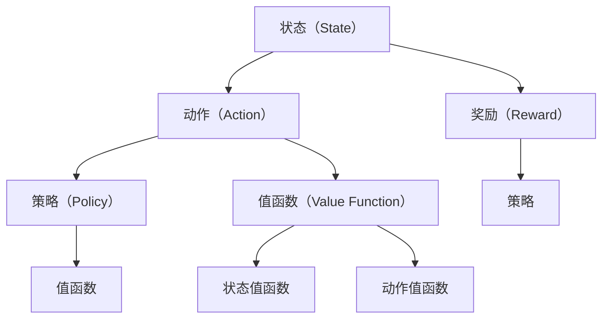

                 

### 背景介绍

在人工智能（AI）领域，深度学习和强化学习是两大主要研究方向。其中，强化学习通过智能体与环境的互动，使智能体能够通过试错的方式学习到最优策略。Q-learning是强化学习的一种经典算法，它通过更新Q值（即状态-动作值函数）来优化智能体的行为。本文将围绕Q-learning算法展开，探讨其原理、实现和应用。

Q-learning算法最早由理查德·萨顿（Richard Sutton）和安德鲁·巴肖尔（Andrew Barto）在1988年的《强化学习：一种介绍》一书中提出。Q-learning算法的核心思想是通过不断地评估每个状态-动作对的价值，从而学习到最优策略。在强化学习中，智能体需要通过与环境互动来学习，而Q-learning正是这种互动过程中的重要工具。

在强化学习问题中，通常存在以下几个要素：状态（State）、动作（Action）、奖励（Reward）、策略（Policy）和值函数（Value Function）。Q-learning算法的目标是学习一个值函数，该值函数能够评估每个状态-动作对的价值，从而指导智能体选择最优动作。

Q-learning算法的基本原理是通过更新Q值来逼近最优策略。在给定一个状态和动作后，Q-learning算法会根据当前状态和动作的奖励以及未来的预期奖励来更新Q值。具体来说，Q-learning算法使用以下公式来更新Q值：

$$
Q(s, a) \leftarrow Q(s, a) + \alpha [r + \gamma \max_{a'} Q(s', a') - Q(s, a)]
$$

其中，$s$和$a$分别表示当前状态和动作，$r$表示当前动作获得的即时奖励，$\gamma$表示折扣因子，$\alpha$表示学习率。通过不断更新Q值，智能体能够逐渐学习到最优策略。

本文将深入探讨Q-learning算法的基本原理和实现步骤，并通过一个实际案例来说明其应用。此外，文章还将讨论Q-learning算法在实际应用中面临的挑战和解决方案。通过本文的介绍，读者将能够更好地理解Q-learning算法的核心思想，并在实际项目中加以应用。

### 核心概念与联系

为了深入理解Q-learning算法，我们需要明确几个核心概念，包括状态（State）、动作（Action）、奖励（Reward）、策略（Policy）和值函数（Value Function）。这些概念是强化学习问题的基本组成部分，它们共同构成了Q-learning算法的理论基础。

**状态（State）**：状态是智能体所处的环境的一个描述，通常用一组特征向量表示。例如，在一个简单的迷宫环境中，状态可以是一个二元向量，表示智能体在迷宫中的位置和方向。

**动作（Action）**：动作是智能体可以采取的操作，用于改变当前状态。以迷宫为例，智能体可以采取的行动包括向上、向下、向左或向右移动。

**奖励（Reward）**：奖励是智能体在每个状态-动作对上获得的即时反馈，用于评估该动作的好坏。在大多数情况下，奖励是非负的，表示智能体朝着目标前进了一步。但在某些情况下，奖励也可能是负值，表示智能体采取了错误的行动。

**策略（Policy）**：策略是智能体在给定状态下采取的行动规则，用于最大化长期回报。策略可以是一个概率分布，表示在特定状态下采取每个动作的概率。

**值函数（Value Function）**：值函数是评估状态价值的函数，用于指导智能体选择最优动作。值函数分为状态值函数（State Value Function）和动作值函数（Action Value Function）。状态值函数表示在给定状态下采取任意动作所能获得的期望回报，动作值函数表示在给定状态下采取某个特定动作所能获得的期望回报。

为了更直观地理解这些概念，我们可以用Mermaid流程图来表示它们之间的联系：



在Q-learning算法中，智能体通过不断与环境互动，更新Q值来逼近最优策略。具体来说，Q-learning算法使用以下步骤来更新Q值：

1. 初始化Q值矩阵，通常设置为所有状态-动作对的初始值。
2. 在给定状态下，随机选择一个动作。
3. 执行该动作，并获得即时奖励。
4. 根据即时奖励和未来预期奖励来更新Q值。

通过这个流程，智能体能够逐步学习到最优策略，并在复杂环境中做出合理的决策。

### 核心算法原理 & 具体操作步骤

Q-learning算法的核心在于通过迭代更新Q值来逼近最优策略。下面我们将详细讲解Q-learning算法的基本原理和具体操作步骤。

#### 初始化Q值矩阵

在开始学习之前，我们需要初始化Q值矩阵。Q值矩阵是一个二维数组，其中每个元素表示一个状态-动作对的价值。初始化时，通常将所有Q值设置为0，或者使用其他方法来初始化，以便快速收敛到最优策略。

#### 随机选择动作

在给定一个状态时，智能体需要根据当前Q值矩阵选择一个动作。为了防止陷入局部最优，通常采用随机选择动作的策略，即在所有可能动作中，以一定的概率随机选择一个动作。

#### 执行动作并获取奖励

选择动作后，智能体执行该动作，并观察环境的变化，获得即时奖励。即时奖励可以是一个固定的值，也可以是根据环境状态计算得到的。

#### 更新Q值

在获得即时奖励后，我们需要根据即时奖励和未来预期奖励来更新Q值。更新Q值的公式如下：

$$
Q(s, a) \leftarrow Q(s, a) + \alpha [r + \gamma \max_{a'} Q(s', a') - Q(s, a)]
$$

其中，$s$和$a$分别表示当前状态和动作，$r$表示当前动作获得的即时奖励，$\gamma$表示折扣因子，$\alpha$表示学习率。折扣因子$\gamma$用于权衡当前奖励和未来预期奖励的关系，学习率$\alpha$用于控制更新速度。

#### 迭代更新

通过不断重复上述步骤，智能体能够逐步更新Q值矩阵，从而逼近最优策略。具体来说，Q-learning算法的迭代过程可以分为以下几个步骤：

1. 初始化Q值矩阵。
2. 在给定状态下随机选择一个动作。
3. 执行动作，并获取即时奖励。
4. 根据即时奖励和未来预期奖励更新Q值。
5. 切换到下一个状态，重复步骤2-4。

#### Q-learning算法伪代码

下面是一个简单的Q-learning算法伪代码，用于说明算法的基本流程：

```python
# 初始化Q值矩阵
Q = np.zeros((n_states, n_actions))

# 设置学习率和折扣因子
alpha = 0.1
gamma = 0.9

# 设置迭代次数
episodes = 1000

# Q-learning算法迭代过程
for episode in range(episodes):
    # 初始化状态
    state = env.reset()

    # 循环直到达到终止状态
    while True:
        # 随机选择动作
        action = np.random.choice(n_actions, p=epsilon-gamma*alpha)

        # 执行动作并获取奖励
        next_state, reward, done = env.step(action)

        # 更新Q值
        Q[state, action] = Q[state, action] + alpha * (reward + gamma * np.max(Q[next_state, :]) - Q[state, action])

        # 切换到下一个状态
        state = next_state

        # 检查是否达到终止状态
        if done:
            break

# 输出最优策略
print("Optimal Policy:")
print(np.argmax(Q, axis=1))
```

通过这个简单的伪代码，我们可以看到Q-learning算法的基本操作流程。在实际应用中，Q-learning算法可以应用于各种强化学习问题，如迷宫导航、股票交易、自动驾驶等。通过对Q值矩阵的不断更新，智能体能够逐步学习到最优策略，从而在复杂环境中做出合理的决策。

### 数学模型和公式 & 详细讲解 & 举例说明

Q-learning算法的核心在于其数学模型和更新公式。下面我们将详细讲解Q-learning的数学模型，包括状态-动作值函数、即时奖励和更新公式，并通过一个具体的例子来说明如何使用这些公式进行Q-learning算法的迭代更新。

#### 状态-动作值函数

在Q-learning算法中，状态-动作值函数（State-Action Value Function）是一个关键概念。它用于评估在特定状态下采取特定动作所能获得的期望回报。状态-动作值函数通常表示为 $Q(s, a)$，其中 $s$ 表示状态，$a$ 表示动作。

状态-动作值函数的目的是提供一个评估函数，帮助智能体选择最优动作。在Q-learning算法中，我们通过不断更新状态-动作值函数的值，来优化智能体的策略。

#### 即时奖励

即时奖励（Instantaneous Reward）是Q-learning算法中的重要组成部分。它表示智能体在执行特定动作后立即获得的奖励。即时奖励可以是正值、负值或零，用于鼓励或惩罚智能体的行为。在Q-learning算法中，即时奖励会直接影响状态-动作值函数的更新。

#### 更新公式

Q-learning算法使用一个简单的更新公式来更新状态-动作值函数。该公式如下：

$$
Q(s, a) \leftarrow Q(s, a) + \alpha [r + \gamma \max_{a'} Q(s', a') - Q(s, a)]
$$

其中，$s$ 表示当前状态，$a$ 表示当前动作，$r$ 表示即时奖励，$\gamma$ 表示折扣因子，$\alpha$ 表示学习率。这个公式可以通过以下步骤来理解：

1. **当前Q值**：首先，我们需要计算当前状态-动作对 $Q(s, a)$ 的值。
2. **即时奖励**：然后，我们将即时奖励 $r$ 加到当前Q值上。
3. **未来预期奖励**：接着，我们计算下一个状态的所有可能动作的Q值中最大的值 $\max_{a'} Q(s', a')$，并将其乘以折扣因子 $\gamma$。
4. **更新Q值**：最后，我们将当前Q值更新为上述计算结果。

#### 举例说明

为了更直观地理解Q-learning算法的更新过程，我们可以通过一个简单的例子来说明。假设我们有一个简单的环境，其中智能体可以在两个状态之间移动。每个状态都有两个可能的动作：向上移动和向下移动。即时奖励设置为1，如果智能体向上移动，则获得奖励；否则，获得惩罚奖励-1。

**初始状态**：智能体处于状态0。

**当前动作**：智能体选择向上移动。

**即时奖励**：智能体获得奖励1。

**下一个状态**：智能体转移到状态1。

**学习率**：$\alpha = 0.1$

**折扣因子**：$\gamma = 0.9$

根据Q-learning算法的更新公式，我们可以计算当前状态-动作对的Q值：

$$
Q(0, 上) \leftarrow Q(0, 上) + 0.1 [1 + 0.9 \max_{a'} Q(1, a')]
$$

由于初始时，$Q(0, 上)$ 和 $Q(1, a')$ 都设置为0，我们可以计算更新后的Q值：

$$
Q(0, 上) \leftarrow 0 + 0.1 [1 + 0.9 \cdot 0] = 0.1
$$

同样，对于向下移动的动作，我们有：

$$
Q(0, 下) \leftarrow Q(0, 下) + 0.1 [ -1 + 0.9 \max_{a'} Q(1, a')]
$$

由于 $Q(1, a')$ 仍然为0，因此：

$$
Q(0, 下) \leftarrow 0 + 0.1 [ -1 + 0.9 \cdot 0] = -0.1
$$

**下一个迭代**：

假设智能体再次选择向上移动，并转移到状态2。此时，我们可以使用类似的方法更新Q值。

$$
Q(1, 上) \leftarrow Q(1, 上) + 0.1 [1 + 0.9 \max_{a'} Q(2, a')]
$$

由于状态2只有两个动作，我们可以简单地取最大的Q值作为更新值：

$$
Q(1, 上) \leftarrow 0 + 0.1 [1 + 0.9 \cdot 1] = 0.1
$$

类似地，我们可以更新其他状态-动作对的Q值。

通过这个简单的例子，我们可以看到Q-learning算法的基本原理和更新过程。在实际应用中，Q-learning算法需要处理更复杂的环境和状态-动作空间，但基本原理仍然适用。通过不断迭代更新Q值，智能体能够逐步学习到最优策略，从而在复杂环境中做出最优决策。

### 项目实战：代码实际案例和详细解释说明

在本节中，我们将通过一个简单的Python代码示例，来演示Q-learning算法在实际项目中的应用。我们将使用Python的OpenAI Gym库来构建一个简单的环境，并通过Q-learning算法来训练智能体实现迷宫导航。

#### 开发环境搭建

首先，我们需要安装Python和相关的库。假设您的系统已经安装了Python，请按照以下步骤安装所需的库：

1. 安装OpenAI Gym：

   ```bash
   pip install gym
   ```

2. 安装NumPy：

   ```bash
   pip install numpy
   ```

安装完成后，您就可以开始编写代码了。

#### 源代码详细实现

以下是一个简单的Q-learning算法实现，用于解决迷宫导航问题：

```python
import gym
import numpy as np
import random

# 创建迷宫环境
env = gym.make("GridWorld-v0")

# 设置学习率和折扣因子
alpha = 0.1
gamma = 0.9

# 初始化Q值矩阵
n_states = env.observation_space.n
n_actions = env.action_space.n
Q = np.zeros((n_states, n_actions))

# Q-learning算法迭代过程
episodes = 1000
for episode in range(episodes):
    state = env.reset()
    done = False
    
    while not done:
        # 随机选择动作
        action = np.argmax(Q[state, :] + np.random.randn(1, n_actions) * (1 / (alpha * (episode + 1))))
        
        # 执行动作
        next_state, reward, done, _ = env.step(action)
        
        # 更新Q值
        Q[state, action] = Q[state, action] + alpha * (reward + gamma * np.max(Q[next_state, :]) - Q[state, action])
        
        state = next_state

# 打印最优策略
print("Optimal Policy:")
print(np.argmax(Q, axis=1))
```

#### 代码解读与分析

1. **环境创建**：

   ```python
   env = gym.make("GridWorld-v0")
   ```

   这一行代码创建了一个简单的迷宫环境，GridWorld-v0是OpenAI Gym提供的一个示例环境。

2. **初始化Q值矩阵**：

   ```python
   n_states = env.observation_space.n
   n_actions = env.action_space.n
   Q = np.zeros((n_states, n_actions))
   ```

   我们首先获取环境的状态空间大小和动作空间大小，然后初始化一个全为零的Q值矩阵。

3. **学习率与折扣因子**：

   ```python
   alpha = 0.1
   gamma = 0.9
   ```

   学习率$\alpha$用于控制Q值的更新速度，折扣因子$\gamma$用于权衡当前奖励和未来预期奖励的关系。

4. **Q-learning算法迭代过程**：

   ```python
   for episode in range(episodes):
       state = env.reset()
       done = False
       
       while not done:
           # 随机选择动作
           action = np.argmax(Q[state, :] + np.random.randn(1, n_actions) * (1 / (alpha * (episode + 1))))
           
           # 执行动作
           next_state, reward, done, _ = env.step(action)
           
           # 更新Q值
           Q[state, action] = Q[state, action] + alpha * (reward + gamma * np.max(Q[next_state, :]) - Q[state, action])
           
           state = next_state
   ```

   在这个迭代过程中，我们首先从环境中获取初始状态，然后进入一个循环，直到达到终止状态。在每个时间步，我们首先随机选择一个动作，然后执行该动作，并获得即时奖励。接着，我们使用更新公式来更新Q值。通过不断迭代，智能体能够学习到最优策略。

5. **打印最优策略**：

   ```python
   print("Optimal Policy:")
   print(np.argmax(Q, axis=1))
   ```

   最后，我们打印出学习到的最优策略。每个元素表示在对应状态下应采取的动作。

通过这个简单的例子，我们可以看到如何使用Q-learning算法来训练智能体解决迷宫导航问题。在实际应用中，您可以根据不同的环境和问题，调整学习率和折扣因子，以实现更好的效果。

### 实际应用场景

Q-learning算法在许多实际应用场景中都有着广泛的应用。以下是一些典型的应用场景：

#### 游戏AI

Q-learning算法在游戏AI中有着广泛的应用。例如，在电子游戏中，智能体可以使用Q-learning算法来学习游戏策略，从而实现自动通关。通过不断训练，智能体可以学会在游戏中做出最优决策，从而提高游戏的难度和趣味性。

#### 自动驾驶

在自动驾驶领域，Q-learning算法可以用于训练智能体学习交通规则和最佳驾驶策略。智能体通过与环境互动，学习在不同交通状况下的最优驾驶行为，从而提高驾驶安全和效率。

#### 机器人路径规划

Q-learning算法在机器人路径规划中也有广泛应用。机器人可以通过Q-learning算法学习如何避开障碍物，找到最短的路径。在实际应用中，机器人需要在复杂的环境中自主导航，Q-learning算法为其提供了有效的解决方案。

#### 股票交易

在金融领域，Q-learning算法可以用于股票交易策略的学习。通过分析历史交易数据，智能体可以学习到在不同市场状况下的最佳交易策略，从而实现自动交易。

#### 无人机控制

Q-learning算法在无人机控制中也有着潜在的应用。无人机可以通过Q-learning算法学习到在特定环境下的最优飞行路径和速度控制策略，从而提高飞行效率和稳定性。

总之，Q-learning算法在各种实际应用场景中都有着广泛的应用前景。通过不断优化和改进，Q-learning算法将继续在人工智能领域发挥重要作用。

### 工具和资源推荐

为了更好地学习Q-learning算法和相关技术，以下是一些建议的学习资源、开发工具和框架：

#### 学习资源

1. **书籍**：
   - 《强化学习：一种介绍》（Richard Sutton & Andrew Barto）：这是Q-learning算法的经典教材，详细介绍了强化学习的基本概念和算法。
   - 《深度强化学习》（David Silver等）：这本书系统地介绍了深度强化学习的相关理论和应用。

2. **论文**：
   - “Q-Learning”（Richard Sutton & Andrew Barto）：这是Q-learning算法的原始论文，提供了算法的详细描述和证明。
   - “Deep Q-Networks”（Volodymyr Mnih等）：这篇论文介绍了使用深度神经网络实现的DQN算法，对Q-learning算法进行了重要的改进。

3. **博客**：
   - 《强化学习笔记》（李宏毅）：这是一系列关于强化学习的博客文章，深入浅出地介绍了强化学习的基本概念和算法。
   - 《深度强化学习实战》（阿里云机器学习平台）：这篇博客通过实际案例，展示了如何使用深度强化学习解决实际问题。

4. **在线课程**：
   - 《强化学习》（Udacity）：这是一门在线课程，涵盖了强化学习的基本概念和算法实现。
   - 《深度强化学习》（Stanford University）：这是斯坦福大学开设的一门深度强化学习课程，内容全面且深入。

#### 开发工具和框架

1. **OpenAI Gym**：这是一个开源的强化学习环境库，提供了多种经典的强化学习环境和工具，非常适合进行算法实验。

2. **TensorFlow**：这是一个开源的机器学习框架，支持深度学习和强化学习的实现。通过TensorFlow，您可以方便地实现和训练复杂的强化学习算法。

3. **PyTorch**：这是一个开源的机器学习库，与TensorFlow类似，也支持深度学习和强化学习。PyTorch的动态图计算能力使其在实现和调试算法时更为灵活。

4. **Gymnasium**：这是OpenAI Gym的改进版本，支持Python 3.8及以上版本，提供了更丰富的强化学习环境和工具。

通过利用这些资源和工具，您可以更深入地了解Q-learning算法和相关技术，并在实际项目中加以应用。

### 总结：未来发展趋势与挑战

Q-learning算法作为强化学习的一种经典算法，已经在多个领域取得了显著的成果。然而，随着人工智能技术的不断发展，Q-learning算法也面临着新的发展趋势和挑战。

#### 未来发展趋势

1. **模型压缩**：随着深度学习模型规模的不断增加，模型压缩成为了一个重要研究方向。Q-learning算法可以通过模型压缩技术，如网络剪枝、低秩分解和量化等，来提高算法的效率和实用性。

2. **在线学习**：现有的Q-learning算法主要基于离线学习，即智能体需要在训练阶段学习到一个稳定的策略，然后在测试阶段使用该策略进行决策。未来，随着在线学习技术的发展，Q-learning算法将能够更好地适应动态环境，实时更新策略。

3. **多智能体强化学习**：在复杂环境中，多个智能体之间的协同合作是提高整体性能的关键。未来，Q-learning算法将与其他多智能体强化学习算法相结合，解决多个智能体之间的协调问题。

4. **强化学习与其他技术的融合**：Q-learning算法可以与深度学习、迁移学习、元学习等技术相结合，提高算法的泛化能力和适应性。

#### 挑战

1. **收敛速度**：Q-learning算法的收敛速度较慢，特别是在状态和动作空间较大时。未来，需要研究更高效的算法，以提高收敛速度。

2. **探索与利用的平衡**：在强化学习过程中，智能体需要在探索新策略和利用已有策略之间找到平衡。如何有效地平衡探索与利用，是一个亟待解决的问题。

3. **样本效率**：在训练过程中，样本效率是一个重要指标。如何减少训练所需的样本数量，提高算法的样本效率，是一个重要的研究方向。

4. **安全性与可靠性**：在现实应用中，强化学习算法需要保证决策的安全性和可靠性。如何评估和确保算法的安全性，是一个亟待解决的问题。

总之，Q-learning算法在未来将继续在人工智能领域发挥重要作用。通过不断研究和发展，Q-learning算法将能够应对新的挑战，推动人工智能技术的进步。

### 附录：常见问题与解答

在本文的附录部分，我们将解答一些关于Q-learning算法的常见问题，以便读者更好地理解这一重要算法。

#### 问题1：Q-learning算法与深度Q网络（DQN）有何区别？

**解答**：Q-learning算法和深度Q网络（DQN）都是强化学习中的策略优化算法。Q-learning算法使用值函数来评估状态-动作对的价值，并通过更新Q值来学习最优策略。而DQN是一种基于深度学习的Q-learning算法，它使用深度神经网络来近似值函数，从而提高算法在复杂环境中的表现。

#### 问题2：Q-learning算法的收敛速度为什么较慢？

**解答**：Q-learning算法的收敛速度较慢主要是因为它在更新Q值时，需要依赖即时奖励和未来预期奖励的反馈。这种基于目标迭代的更新方式可能会导致算法在短期内难以找到最优策略。为了提高收敛速度，可以尝试使用更高效的学习率调整策略、减少探索阶段的样本数或者使用其他加速收敛的技术。

#### 问题3：Q-learning算法如何处理连续状态和动作空间？

**解答**：在处理连续状态和动作空间时，Q-learning算法通常需要对状态和动作进行离散化处理。一种常见的方法是使用有限大小的离散网格来表示状态和动作。例如，可以将连续的状态和动作映射到有限数量的离散值上，然后使用Q-learning算法进行训练。另外，也可以使用深度神经网络来近似值函数，从而处理连续的状态和动作空间。

#### 问题4：Q-learning算法如何避免陷入局部最优？

**解答**：Q-learning算法在更新Q值时，可能会因为仅依赖即时奖励和未来预期奖励的反馈而陷入局部最优。为了避免这种情况，可以采用以下几种策略：
- **随机动作选择**：在给定状态下，以一定的概率随机选择一个动作，以增加探索性。
- **双重Q-learning**：使用两个Q值估计器，交替更新，以减少偏差。
- **优先经验回放**：将经历的经验存储在优先经验池中，并按照经验的重要性进行抽样，以提高更新效率。

通过上述方法，可以有效避免Q-learning算法陷入局部最优，提高算法的收敛性能。

#### 问题5：Q-learning算法在哪些应用中表现最佳？

**解答**：Q-learning算法在许多应用中都有着良好的性能，尤其在以下场景中表现最佳：
- **游戏AI**：Q-learning算法可以用于训练智能体在电子游戏中的策略，实现自动通关。
- **机器人路径规划**：Q-learning算法可以帮助机器人学习如何在复杂环境中找到最优路径。
- **自动驾驶**：Q-learning算法可以用于训练自动驾驶车辆，学习最佳驾驶策略。
- **强化学习问题**：Q-learning算法可以应用于各种强化学习问题，如资源分配、任务调度等。

通过不断优化和改进，Q-learning算法将继续在人工智能领域发挥重要作用。

### 扩展阅读 & 参考资料

为了进一步深入理解Q-learning算法及其应用，以下是几本推荐的专业书籍、重要论文以及相关的网络资源：

#### 书籍

1. **《强化学习：一种介绍》（Richard Sutton & Andrew Barto）**：这是强化学习的经典教材，详细介绍了Q-learning算法的理论基础和实现方法。

2. **《深度强化学习》（David Silver等）**：这本书系统地介绍了深度强化学习的基本概念、算法和最新进展。

3. **《强化学习实战》（Alonso Morillo）**：本书通过丰富的实例，讲解了如何在实际项目中应用强化学习算法。

4. **《强化学习导论》（Hans van der Meer）**：这是一本适合初学者的入门书籍，全面介绍了强化学习的核心概念和算法。

#### 重要论文

1. **“Q-Learning”（Richard Sutton & Andrew Barto）**：这是Q-learning算法的原始论文，提供了算法的详细描述和证明。

2. **“Deep Q-Networks”（Volodymyr Mnih等）**：这篇论文介绍了基于深度神经网络的DQN算法，对Q-learning算法进行了重要的改进。

3. **“Prioritized Experience Replay”（Volodymyr Mnih等）**：这篇论文提出了优先经验回放机制，显著提高了Q-learning算法的收敛性能。

#### 网络资源

1. **OpenAI Gym**：（[www.gym.openai.com](http://www.gym.openai.com)）这是一个开源的强化学习环境库，提供了多种经典的强化学习环境和工具。

2. **Udacity**：（[www.udacity.com](http://www.udacity.com)）Udacity提供了多门强化学习相关的在线课程，适合不同层次的读者。

3. **阿里云机器学习平台**：（[ml-platform.aliyun.com](http://ml-platform.aliyun.com)）该平台提供了丰富的强化学习教程和案例，适合实际应用。

通过阅读这些书籍、论文和网络资源，您可以更深入地理解Q-learning算法及其在各个领域的应用。这些资料将帮助您在强化学习领域取得更高的成就。

