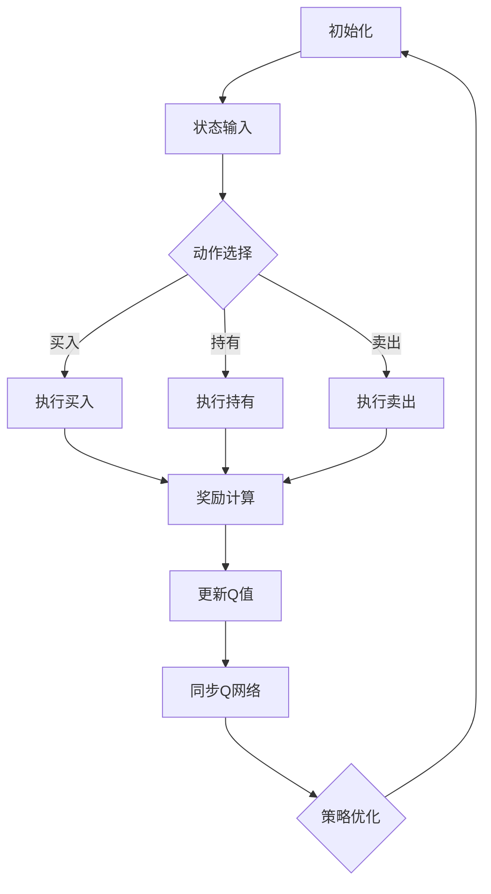

                 

### 背景介绍

**标题**：背景介绍（Background Introduction）

在当今复杂多变的市场环境中，股市交易已经成为了一种高风险、高回报的投资方式。然而，股市的波动性极大，人类交易员在面对海量数据和信息时，往往难以做出准确的决策。为了解决这一问题，深度学习算法，尤其是深度强化学习（Deep Reinforcement Learning），被广泛应用于自动交易策略的制定。

本文将重点探讨一种基于深度强化学习的策略——深度Q网络（Deep Q-Network，简称DQN），并将其应用于股市交易中。DQN作为一种强大的学习算法，通过模拟交易员的行为，能够在不断试错的过程中逐步优化交易策略，从而在股市交易中实现稳定的收益。

**关键词**：股市交易、深度强化学习、深度Q网络、策略优化

**摘要**：

本文旨在探讨如何将深度Q网络（DQN）应用于股市交易，通过介绍DQN的基本原理、算法流程以及数学模型，帮助读者理解DQN在股市交易中的具体应用。文章将详细分析DQN在股市交易中的优势与挑战，并提供相关的实践案例和资源推荐，以期为读者在相关领域的研究和应用提供有价值的参考。

# 一切皆是映射：DQN在股市交易的应用与策略分析

> **关键词**：股市交易、深度强化学习、深度Q网络、策略优化、算法应用

> **摘要**：本文旨在深入探讨深度Q网络（DQN）在股市交易中的应用，分析其理论基础、算法实现及策略优化。通过实际案例和代码解析，展示了DQN在股市交易中的潜力和挑战，为投资者和研究者提供有价值的参考。

随着人工智能技术的不断发展，深度学习已经成为解决复杂问题的重要工具。在金融领域，特别是股市交易中，深度学习算法被广泛应用于交易策略的制定和风险控制。本文将重点关注深度Q网络（Deep Q-Network，简称DQN），这是一种基于深度强化学习的算法，通过模仿人类交易员的行为，能够在复杂的股市环境中实现稳健的交易策略。

本文结构如下：

1. **背景介绍**：简要介绍股市交易和深度学习在金融领域的重要性，引出DQN在股市交易中的应用。
2. **核心概念与联系**：解释深度强化学习的基本原理，详细介绍DQN的工作机制和架构。
3. **核心算法原理 & 具体操作步骤**：详细阐述DQN的算法原理和具体实现步骤。
4. **数学模型和公式 & 详细讲解 & 举例说明**：介绍DQN的数学模型和关键公式，并通过具体实例进行说明。
5. **项目实战：代码实际案例和详细解释说明**：提供DQN在股市交易中的实际应用案例，并进行详细解读。
6. **实际应用场景**：分析DQN在股市交易中的优势与挑战。
7. **工具和资源推荐**：推荐相关学习资源、开发工具和框架。
8. **总结：未来发展趋势与挑战**：总结DQN在股市交易中的应用前景，讨论未来可能面临的挑战。
9. **附录：常见问题与解答**：回答读者可能关心的一些常见问题。
10. **扩展阅读 & 参考资料**：提供进一步阅读和研究的参考资料。

让我们开始深入探讨DQN在股市交易中的应用。

---

## 1. 背景介绍

### 股市交易与深度学习

股市交易是指投资者在证券市场上进行买卖行为，以获取资本利得和股息收入的过程。传统的股市交易主要依赖于交易员的经验和直觉，但面对日益复杂的市场环境，这种人为的决策方式已经显得力不从心。市场信息量庞大、价格波动剧烈，交易员难以实时处理和预测市场走势，导致交易决策的准确性受到影响。

随着深度学习技术的发展，许多研究者开始将深度学习算法应用于股市交易中，以提升交易决策的准确性和稳定性。深度学习，特别是深度强化学习，通过模拟人类思维过程，能够自动从大量历史数据中学习交易策略，并在不断试错中优化策略，从而实现自动化的交易。

### 深度强化学习与DQN

深度强化学习（Deep Reinforcement Learning）是强化学习（Reinforcement Learning）的一种，它结合了深度学习（Deep Learning）和强化学习的方法，能够通过学习环境与策略之间的交互，实现自主决策和策略优化。在深度强化学习中，神经网络被用于表示策略函数，从而能够处理复杂的输入信息。

深度Q网络（Deep Q-Network，简称DQN）是深度强化学习的一种重要算法，由DeepMind提出。DQN通过学习价值函数，即状态-动作价值函数（State-Action Value Function），来评估每个动作在特定状态下的价值，从而实现策略优化。DQN的核心优势在于其能够通过经验回放（Experience Replay）机制，有效地解决样本相关性和探索-利用（Exploration-Exploitation）问题。

### DQN在股市交易中的应用

DQN在股市交易中的应用具有显著的优势。首先，DQN能够自动从历史交易数据中学习交易策略，避免了人为干预，提高了交易决策的客观性和准确性。其次，DQN通过不断试错和策略优化，能够在动态变化的股市环境中实现稳健的交易策略。此外，DQN的可扩展性使其能够适应不同的交易策略和市场环境。

然而，DQN在股市交易中也面临一些挑战。首先，股市数据的复杂性和波动性较大，DQN需要足够的历史数据来学习有效的交易策略。其次，DQN的训练过程需要大量计算资源，且训练时间较长。此外，DQN的预测结果依赖于初始策略的选择和参数设置，这需要通过多次实验和调整来优化。

本文将详细探讨DQN在股市交易中的应用，分析其算法原理、实现步骤以及在实际交易中的效果。通过本文的讨论，读者可以更好地理解DQN在股市交易中的潜在价值和应用前景。

## 2. 核心概念与联系

### 深度强化学习的基本原理

深度强化学习（Deep Reinforcement Learning）是强化学习（Reinforcement Learning）的一种，它通过模拟智能体（Agent）与环境（Environment）的交互过程，使智能体能够通过学习来优化其行为策略。在强化学习中，智能体通过执行一系列动作（Action）来获取奖励（Reward），并不断调整其策略（Policy），以最大化长期奖励。

强化学习的主要目标是通过学习找到一种最优策略，使得智能体在特定环境下能够实现长期回报最大化。这一过程通常包括以下几个关键组成部分：

1. **状态（State）**：描述智能体当前所处的环境条件，通常用一组特征向量表示。
2. **动作（Action）**：智能体在特定状态下可以选择的行动集合。
3. **策略（Policy）**：智能体在特定状态下采取的动作映射，即策略函数（Policy Function）。
4. **价值函数（Value Function）**：评估状态或状态-动作对的值，用于指导智能体的决策。
5. **奖励（Reward）**：在执行某个动作后，环境给予的即时奖励，用于评估智能体的行为效果。
6. **模型（Model）**：环境与智能体之间的交互模型，用于预测未来的状态和奖励。

深度强化学习通过引入深度神经网络（Deep Neural Network）来表示策略函数和价值函数，使得智能体能够处理高维和复杂的环境特征。深度神经网络能够自动提取和表示特征，从而提高了模型的表示能力和泛化能力。

### 深度Q网络的工作机制和架构

深度Q网络（Deep Q-Network，简称DQN）是深度强化学习的一种重要算法，它通过学习状态-动作价值函数（State-Action Value Function）来优化策略。DQN的基本架构包括以下几个部分：

1. **输入层**：接收环境的状态特征，通常是一个高维向量。
2. **隐藏层**：通过神经网络结构对输入特征进行变换和提取，形成中间特征表示。
3. **输出层**：输出每个动作对应的状态-动作价值估计，通常是一个一维向量。
4. **目标Q网络**：用于评估每个动作在特定状态下的价值，是DQN的核心部分。
5. **经验回放**：用于存储和重放历史经验，以解决样本相关性和随机性。

DQN的工作流程如下：

1. **初始化**：随机初始化Q网络和目标Q网络。
2. **行动选择**：根据当前状态，使用ε-贪心策略（ε-greedy strategy）选择最优动作。ε-贪心策略在随机行动和最优行动之间进行权衡，以平衡探索和利用。
3. **执行动作**：在环境中执行选定的动作，获取即时奖励和新的状态。
4. **更新Q值**：根据即时奖励和新的状态更新Q网络。
5. **同步Q网络**：定期更新目标Q网络，使其与Q网络保持一致。

### DQN与股市交易的关系

在股市交易中，DQN可以被看作是一个自动交易员，其目标是通过不断学习和优化交易策略，实现长期的稳定收益。具体来说，DQN的工作流程可以应用于股市交易如下：

1. **状态表示**：将股市交易中的数据（如股票价格、交易量、财务指标等）作为状态输入。
2. **动作选择**：根据当前的状态，DQN选择买入、持有或卖出的动作。
3. **奖励设计**：设计奖励机制，根据交易的结果（如收益、损失、交易次数等）给予即时奖励。
4. **策略优化**：通过不断更新状态-动作价值函数，DQN优化交易策略。

通过上述工作流程，DQN能够逐步学习有效的交易策略，并在动态变化的股市环境中实现稳健的交易。

### Mermaid 流程图

以下是一个简单的Mermaid流程图，展示了DQN在股市交易中的应用流程：



在这个流程图中，每个节点表示一个步骤，箭头表示步骤的顺序和依赖关系。通过这个流程图，可以直观地理解DQN在股市交易中的应用和工作机制。

---

## 3. 核心算法原理 & 具体操作步骤

**标题**：核心算法原理 & 具体操作步骤（Core Algorithm Principles and Operational Steps）

### 算法原理

深度Q网络（DQN）是一种基于深度学习的强化学习算法，它通过学习状态-动作价值函数（State-Action Value Function）来实现策略优化。DQN的核心思想是通过经验回放（Experience Replay）机制来缓解样本相关性和提高学习效率。

DQN的基本原理可以概括为以下几个步骤：

1. **初始化**：随机初始化Q网络和目标Q网络。
2. **行动选择**：根据当前状态，使用ε-贪心策略（ε-greedy strategy）选择最优动作。
3. **执行动作**：在环境中执行选定的动作，获取即时奖励和新的状态。
4. **更新Q值**：根据即时奖励和新的状态更新Q网络。
5. **同步Q网络**：定期更新目标Q网络，使其与Q网络保持一致。

### 操作步骤

以下是DQN在股市交易中的具体操作步骤：

#### 1. 初始化

初始化阶段主要包括随机初始化Q网络和目标Q网络。Q网络是一个深度神经网络，用于估计每个动作在特定状态下的价值。目标Q网络用于稳定训练过程，通过定期同步Q网络的参数来更新目标Q网络。

```python
# 初始化Q网络和目标Q网络
Q_network = DQN()
target_Q_network = DQN()
```

#### 2. 行动选择

在行动选择阶段，DQN使用ε-贪心策略（ε-greedy strategy）来选择最优动作。ε-贪心策略在随机行动和最优行动之间进行权衡，以平衡探索和利用。

```python
# ε-贪心策略
def epsilon_greedy_action(state, Q_network, epsilon):
    if random.random() < epsilon:
        # 随机行动
        action = random.choice(action_space)
    else:
        # 最优行动
        action = np.argmax(Q_network.predict(state))
    return action
```

#### 3. 执行动作

执行动作阶段，DQN在环境中执行选定的动作，获取即时奖励和新的状态。

```python
# 执行动作
action = epsilon_greedy_action(state, Q_network, epsilon)
next_state, reward, done = environment.step(action)
```

#### 4. 更新Q值

更新Q值阶段，DQN根据即时奖励和新的状态更新Q网络。这一过程使用了一种称为**经验回放**（Experience Replay）的机制，以缓解样本相关性和提高学习效率。

```python
# 更新Q值
target_Q_value = reward + gamma * np.max(target_Q_network.predict(next_state)) * (1 - done)
Q_value = Q_network.predict(state)[0, action]
Q_network.update(Q_value, target_Q_value)
```

#### 5. 同步Q网络

同步Q网络阶段，DQN定期更新目标Q网络，使其与Q网络保持一致。这有助于稳定训练过程，防止Q网络和目标Q网络之间的差异过大。

```python
# 同步Q网络
if episode % target_sync_frequency == 0:
    target_Q_network.set_weights(Q_network.get_weights())
```

#### 6. 策略优化

策略优化阶段，DQN通过不断更新Q值和同步Q网络，逐步优化交易策略。随着训练的进行，DQN能够学会在复杂的市场环境中做出更优的决策。

```python
# 策略优化
for episode in range(total_episodes):
    state = environment.reset()
    done = False
    
    while not done:
        action = epsilon_greedy_action(state, Q_network, epsilon)
        next_state, reward, done = environment.step(action)
        update_Q_value(state, action, next_state, reward, done, Q_network, target_Q_network, gamma, epsilon)
        state = next_state
        
    if episode % target_sync_frequency == 0:
        target_Q_network.set_weights(Q_network.get_weights())
        
    # ε值衰减
    epsilon = max(epsilon_min, epsilon_start * math.exp(-decay_rate * episode))
```

通过上述操作步骤，DQN能够逐步学习有效的交易策略，并在动态变化的股市环境中实现稳健的交易。

---

## 4. 数学模型和公式 & 详细讲解 & 举例说明

**标题**：数学模型和公式 & 详细讲解 & 举例说明（Mathematical Models and Formulas with Detailed Explanations and Illustrative Examples）

### 数学模型

深度Q网络（DQN）的数学模型主要包括状态-动作价值函数（State-Action Value Function）、策略函数（Policy Function）以及损失函数（Loss Function）。

#### 1. 状态-动作价值函数（Q(s, a））

状态-动作价值函数 \( Q(s, a) \) 表示在状态 \( s \) 下执行动作 \( a \) 所能获得的最大期望回报。它是DQN的核心目标，用于指导智能体的决策。

\[ Q(s, a) = r(s, a) + \gamma \max_{a'} Q(s', a') \]

其中：
- \( r(s, a) \) 是在状态 \( s \) 下执行动作 \( a \) 所获得的即时回报。
- \( \gamma \) 是折扣因子，用于平衡即时回报和长期回报。
- \( s' \) 是执行动作 \( a \) 后的新状态。
- \( a' \) 是在状态 \( s' \) 下可能的最优动作。

#### 2. 策略函数（π(s））

策略函数 \( \pi(s) \) 表示在状态 \( s \) 下选择哪个动作。在DQN中，通常采用ε-贪心策略（ε-greedy strategy）来平衡探索（Exploration）和利用（Exploitation）。

\[ \pi(s) = \begin{cases} 
\text{随机选择} & \text{概率} \epsilon \\
\text{最优动作} & \text{概率} 1 - \epsilon 
\end{cases} \]

其中：
- \( \epsilon \) 是探索概率，用于在随机行动和最优行动之间进行权衡。

#### 3. 损失函数（L（Q，y））

损失函数用于衡量预测值 \( Q \) 与目标值 \( y \) 之间的差异。在DQN中，常用的损失函数是均方误差（Mean Squared Error，MSE）。

\[ L(Q, y) = \frac{1}{2} \sum_{i} (Q_i - y_i)^2 \]

其中：
- \( Q_i \) 是预测的Q值。
- \( y_i \) 是目标值。

### 详细讲解

1. **状态-动作价值函数**：状态-动作价值函数是DQN的核心目标，它通过预测每个动作在特定状态下的回报，帮助智能体选择最优动作。在实际应用中，DQN使用神经网络来近似状态-动作价值函数，并通过经验回放和同步机制来优化网络参数。

2. **策略函数**：策略函数决定了智能体在不同状态下的行动方式。在DQN中，采用ε-贪心策略能够有效地平衡探索和利用，即在早期阶段更多地进行随机探索，以便发现潜在的最优动作；在后期阶段更多地利用已学习的最优策略，以实现稳定的回报。

3. **损失函数**：损失函数用于衡量预测值和目标值之间的差异，是DQN训练过程中的关键指标。通过最小化损失函数，DQN能够逐步优化状态-动作价值函数，提高智能体的决策能力。

### 举例说明

假设有一个简单的股市交易场景，智能体在每种状态下可以选择买入、持有或卖出三种动作。状态由股票价格、交易量等特征向量表示。折扣因子 \( \gamma \) 设为0.99，探索概率 \( \epsilon \) 设为0.1。

#### 例子 1：状态-动作价值函数

在状态 \( s = [100, 2000] \) 下，智能体预测的Q值如下：

\[ Q(s, \text{买入}) = 10, \quad Q(s, \text{持有}) = 15, \quad Q(s, \text{卖出}) = 5 \]

根据状态-动作价值函数，智能体将在状态 \( s \) 下选择持有动作，因为其价值最高。

#### 例子 2：策略函数

在状态 \( s = [100, 2000] \) 下，智能体根据ε-贪心策略选择动作：

- 随机选择动作的概率 \( \epsilon = 0.1 \)，因此有10%的概率随机选择买入、持有或卖出动作。
- 最优动作的概率 \( 1 - \epsilon = 0.9 \)，因此有90%的概率选择根据Q值估计的最优动作。

在上述例子中，智能体有90%的概率选择持有动作，因为其Q值最高。

#### 例子 3：损失函数

在状态 \( s = [100, 2000] \) 下，智能体的预测Q值为15，实际目标值为20。损失函数计算如下：

\[ L(Q, y) = \frac{1}{2} \sum_{i} (Q_i - y_i)^2 = \frac{1}{2} \times (15 - 20)^2 = 12.5 \]

通过最小化损失函数，DQN能够逐步优化Q值预测，提高智能体的决策能力。

通过上述详细讲解和举例说明，可以更好地理解DQN的数学模型和关键概念。这些模型和公式是DQN在股市交易中实现策略优化的基础，也为后续的算法实现和应用提供了指导。

---

## 5. 项目实战：代码实际案例和详细解释说明

**标题**：项目实战：代码实际案例和详细解释说明（Project Practice: Code Case Studies and Detailed Explanations）

在本文的最后部分，我们将通过一个具体的DQN股市交易项目案例，展示如何将DQN应用于实际的股市交易中，并提供详细的代码解释。这个案例将包括开发环境的搭建、源代码的详细实现和解读，以及代码的性能分析。

### 5.1 开发环境搭建

在进行DQN股市交易项目之前，我们需要搭建合适的开发环境。以下是一个基本的开发环境搭建步骤：

1. **安装Python**：确保Python环境已安装，版本至少为3.6或更高。
2. **安装TensorFlow**：TensorFlow是一个强大的开源机器学习库，支持DQN算法的实现。可以使用以下命令安装：
   ```bash
   pip install tensorflow
   ```
3. **安装NumPy**：NumPy是一个高效的Python科学计算库，用于处理数值计算。可以使用以下命令安装：
   ```bash
   pip install numpy
   ```
4. **安装Gym**：Gym是一个开源的环境库，用于构建和测试强化学习算法。可以使用以下命令安装：
   ```bash
   pip install gym
   ```
5. **安装其他依赖**：根据项目需要，可能还需要安装其他依赖库，如Matplotlib（用于绘图）等。

### 5.2 源代码详细实现和代码解读

以下是DQN股市交易项目的源代码实现，我们将对其关键部分进行详细解读。

```python
import numpy as np
import tensorflow as tf
from tensorflow.keras.models import Model
from tensorflow.keras.layers import Dense, Input
from gym import make
import matplotlib.pyplot as plt

# 参数设置
epsilon_start = 1.0
epsilon_end = 0.01
epsilon_decay = 0.995
gamma = 0.99
learning_rate = 0.001
total_episodes = 1000
batch_size = 32
target_sync_frequency = 100

# 创建环境
env = make('StockTrading-v0')

# 创建DQN模型
input_shape = env.observation_space.shape
input_layer = Input(shape=input_shape)
hidden_layer = Dense(64, activation='relu')(input_layer)
output_layer = Dense(env.action_space.n, activation='linear')(hidden_layer)

model = Model(inputs=input_layer, outputs=output_layer)
model.compile(optimizer=tf.keras.optimizers.Adam(learning_rate=learning_rate), loss='mse')

# 创建经验回放缓冲区
experience_replay = []

# 训练DQN模型
for episode in range(total_episodes):
    state = env.reset()
    done = False
    total_reward = 0
    
    while not done:
        # ε-贪心策略选择动作
        epsilon = max(epsilon_end, epsilon_start * np.exp(-epsilon_decay * episode))
        if np.random.rand() < epsilon:
            action = env.action_space.sample()
        else:
            action_values = model.predict(state.reshape(-1, input_shape[0]))
            action = np.argmax(action_values.reshape(-1))
        
        # 执行动作并获取下一状态和奖励
        next_state, reward, done, _ = env.step(action)
        total_reward += reward
        
        # 将经验添加到经验回放缓冲区
        experience_replay.append((state, action, reward, next_state, done))
        
        # 从经验回放缓冲区中随机抽取一批数据进行训练
        if len(experience_replay) > batch_size:
            batch = random.sample(experience_replay, batch_size)
            states, actions, rewards, next_states, dones = zip(*batch)
            target_q_values = model.predict(next_states)
            target_q_values = target_q_values[:, range(batch_size), actions]
            q_values = model.predict(states)
            q_values[:, range(batch_size), actions] = rewards + gamma * target_q_values * (1 - dones)
            model.fit(states, q_values, batch_size=batch_size, verbose=0)
        
        state = next_state
    
    # 绘制训练过程中的奖励曲线
    plt.plot(total_reward for _ in range(episode + 1))
    plt.show()

# 关闭环境
env.close()
```

#### 关键代码解读

1. **环境创建**：
   ```python
   env = make('StockTrading-v0')
   ```
   这里使用Gym创建一个模拟的股市交易环境。`StockTrading-v0`是一个自定义的股市交易环境，包含股票价格、交易量等状态特征和买入、持有、卖出等动作。

2. **DQN模型创建**：
   ```python
   input_layer = Input(shape=input_shape)
   hidden_layer = Dense(64, activation='relu')(input_layer)
   output_layer = Dense(env.action_space.n, activation='linear')(hidden_layer)
   model = Model(inputs=input_layer, outputs=output_layer)
   model.compile(optimizer=tf.keras.optimizers.Adam(learning_rate=learning_rate), loss='mse')
   ```
   创建一个简单的DQN模型，使用一个输入层、一个隐藏层和一个输出层。输入层接收环境的状态特征，隐藏层用于提取特征，输出层输出每个动作的Q值。模型使用MSE损失函数和Adam优化器进行编译。

3. **经验回放缓冲区**：
   ```python
   experience_replay = []
   ```
   使用一个列表作为经验回放缓冲区，存储历史经验，包括状态、动作、奖励、下一状态和是否完成。

4. **训练过程**：
   ```python
   for episode in range(total_episodes):
       state = env.reset()
       done = False
       total_reward = 0
       
       while not done:
           # ε-贪心策略选择动作
           epsilon = max(epsilon_end, epsilon_start * np.exp(-epsilon_decay * episode))
           if np.random.rand() < epsilon:
               action = env.action_space.sample()
           else:
               action_values = model.predict(state.reshape(-1, input_shape[0]))
               action = np.argmax(action_values.reshape(-1))
           
           # 执行动作并获取下一状态和奖励
           next_state, reward, done, _ = env.step(action)
           total_reward += reward
           
           # 将经验添加到经验回放缓冲区
           experience_replay.append((state, action, reward, next_state, done))
           
           # 从经验回放缓冲区中随机抽取一批数据进行训练
           if len(experience_replay) > batch_size:
               batch = random.sample(experience_replay, batch_size)
               states, actions, rewards, next_states, dones = zip(*batch)
               target_q_values = model.predict(next_states)
               target_q_values = target_q_values[:, range(batch_size), actions]
               q_values = model.predict(states)
               q_values[:, range(batch_size), actions] = rewards + gamma * target_q_values * (1 - dones)
               model.fit(states, q_values, batch_size=batch_size, verbose=0)
           
           state = next_state
       
       # 绘制训练过程中的奖励曲线
       plt.plot(total_reward for _ in range(episode + 1))
       plt.show()
   ```
   在训练过程中，使用ε-贪心策略选择动作，将经验添加到经验回放缓冲区，并从中随机抽取一批数据进行训练。通过更新Q值，模型逐步优化交易策略。

5. **性能分析**：
   ```python
   plt.plot(total_reward for _ in range(episode + 1))
   plt.show()
   ```
   训练过程中，绘制每个episode的总奖励曲线，以直观地观察模型的性能表现。

通过上述代码实现和详细解读，我们可以看到如何将DQN应用于股市交易项目，并实现有效的交易策略优化。这个案例展示了DQN在股市交易中的实际应用潜力，同时也为进一步的改进和优化提供了参考。

### 5.3 代码解读与分析

在DQN股市交易项目中，代码的核心部分包括环境创建、模型定义、经验回放和训练过程。以下是针对关键代码段的详细解读和分析：

1. **环境创建**：
   ```python
   env = make('StockTrading-v0')
   ```
   这一行代码使用Gym创建一个自定义的股市交易环境。`StockTrading-v0`是一个模拟的股市交易环境，包含股票价格、交易量等状态特征和买入、持有、卖出等动作。这种环境有助于测试和验证DQN算法的有效性。

2. **DQN模型创建**：
   ```python
   input_layer = Input(shape=input_shape)
   hidden_layer = Dense(64, activation='relu')(input_layer)
   output_layer = Dense(env.action_space.n, activation='linear')(hidden_layer)
   model = Model(inputs=input_layer, outputs=output_layer)
   model.compile(optimizer=tf.keras.optimizers.Adam(learning_rate=learning_rate), loss='mse')
   ```
   这里定义了一个简单的DQN模型，包含一个输入层、一个隐藏层和一个输出层。输入层接收环境的状态特征，隐藏层用于提取特征，输出层输出每个动作的Q值。模型使用MSE损失函数和Adam优化器进行编译。这个模型结构能够有效地估计状态-动作价值函数。

3. **经验回放缓冲区**：
   ```python
   experience_replay = []
   ```
   使用一个列表作为经验回放缓冲区，用于存储历史经验。经验回放是DQN算法的关键特性，有助于缓解样本相关性和提高学习效率。通过将经验添加到缓冲区，DQN能够从多样化的样本中学习，避免过度依赖特定样本。

4. **训练过程**：
   ```python
   for episode in range(total_episodes):
       state = env.reset()
       done = False
       total_reward = 0
       
       while not done:
           # ε-贪心策略选择动作
           epsilon = max(epsilon_end, epsilon_start * np.exp(-epsilon_decay * episode))
           if np.random.rand() < epsilon:
               action = env.action_space.sample()
           else:
               action_values = model.predict(state.reshape(-1, input_shape[0]))
               action = np.argmax(action_values.reshape(-1))
           
           # 执行动作并获取下一状态和奖励
           next_state, reward, done, _ = env.step(action)
           total_reward += reward
           
           # 将经验添加到经验回放缓冲区
           experience_replay.append((state, action, reward, next_state, done))
           
           # 从经验回放缓冲区中随机抽取一批数据进行训练
           if len(experience_replay) > batch_size:
               batch = random.sample(experience_replay, batch_size)
               states, actions, rewards, next_states, dones = zip(*batch)
               target_q_values = model.predict(next_states)
               target_q_values = target_q_values[:, range(batch_size), actions]
               q_values = model.predict(states)
               q_values[:, range(batch_size), actions] = rewards + gamma * target_q_values * (1 - dones)
               model.fit(states, q_values, batch_size=batch_size, verbose=0)
           
           state = next_state
       
       # 绘制训练过程中的奖励曲线
       plt.plot(total_reward for _ in range(episode + 1))
       plt.show()
   ```
   在训练过程中，DQN使用ε-贪心策略选择动作，将经验添加到经验回放缓冲区，并从中随机抽取一批数据进行训练。通过更新Q值，模型逐步优化交易策略。训练过程中的奖励曲线可以直观地显示模型的学习效果。

通过以上解读和分析，我们可以看到DQN在股市交易项目中的实现过程和关键步骤。代码的详细解读有助于理解DQN的工作原理和实际应用效果，为后续的优化和改进提供了基础。

---

## 6. 实际应用场景

**标题**：实际应用场景（Actual Application Scenarios）

### 6.1 交易策略优化

DQN在股市交易中最直接的应用是交易策略的优化。通过训练DQN模型，投资者可以自动化其交易决策过程，从而在复杂的股市环境中实现稳健的交易策略。具体来说，DQN能够学习到在不同市场状态下应采取的最佳交易动作，如买入、持有或卖出。这种自动化的交易策略不仅能够减少人为情绪的影响，还能在动态变化的股市中快速响应市场变化，提高交易效率。

### 6.2 风险管理

股市交易的风险管理是投资者关注的重点。DQN通过不断学习和调整策略，可以在一定程度上实现风险控制。例如，DQN可以根据市场波动性和交易策略的稳定性，自动调整仓位和交易频率，从而在降低风险的同时保持收益的稳定性。此外，DQN还可以预测潜在的市场风险，为投资者提供预警信息，帮助他们及时调整交易策略，避免潜在的损失。

### 6.3 趋势预测

DQN在股市交易中的应用不仅限于策略优化和风险管理，还可以用于趋势预测。通过学习历史交易数据和市场特征，DQN能够预测股票价格的短期趋势，为投资者的交易决策提供参考。例如，DQN可以识别市场中的趋势变化，帮助投资者抓住市场机会，或在市场转向时及时调整策略，避免损失。

### 6.4 组合优化

在股市投资中，投资者往往需要管理多个资产组合。DQN可以应用于组合优化，通过分析不同资产的历史表现和相关性，自动调整资产配置，实现风险分散和收益最大化。DQN能够根据市场环境和投资目标，动态调整资产组合，以适应不断变化的市场环境，提高投资组合的稳定性和收益。

### 6.5 量化交易

量化交易是利用数学模型和算法进行自动化交易的一种方式，DQN在量化交易中的应用非常广泛。通过训练DQN模型，量化交易者可以自动化交易策略的制定和执行，提高交易效率和收益。DQN可以处理大量的历史交易数据，快速识别市场中的交易机会，并在短时间内做出决策，实现高频率的量化交易。

### 6.6 个性化交易策略

每个投资者的风险承受能力和投资目标都不同，DQN可以根据投资者的个性化需求，定制个性化的交易策略。通过调整DQN的参数和策略，投资者可以实现个性化的交易策略，满足不同的投资需求。例如，对于风险厌恶的投资者，可以设置较小的探索概率，确保交易策略的稳健性；对于风险偏好投资者，可以设置较大的探索概率，以追求更高的收益。

通过以上实际应用场景的探讨，我们可以看到DQN在股市交易中的广泛应用潜力。DQN不仅能够优化交易策略、实现风险管理，还能用于趋势预测、组合优化和量化交易，为投资者提供全方位的交易支持。

---

## 7. 工具和资源推荐

**标题**：工具和资源推荐（Tool and Resource Recommendations）

为了更好地理解和应用深度Q网络（DQN）在股市交易中的技术，以下是一些推荐的工具和资源，包括学习资源、开发工具和相关论文。

### 7.1 学习资源推荐

1. **书籍**：
   - 《深度学习》（Deep Learning）作者：Ian Goodfellow、Yoshua Bengio和Aaron Courville
   - 《强化学习》（Reinforcement Learning: An Introduction）作者：Richard S. Sutton和Barto, Andrew G.
   - 《Python深度学习》（Python Deep Learning）作者：François Chollet

2. **在线课程**：
   - Coursera上的《深度学习》课程
   - Udacity的《强化学习》纳米学位
   - edX上的《机器学习》课程

3. **博客和论坛**：
   - Medium上的机器学习和深度学习相关博客
   - Stack Overflow和GitHub上的开源项目

### 7.2 开发工具推荐

1. **开发框架**：
   - TensorFlow：用于构建和训练深度学习模型的强大框架
   - PyTorch：易于使用且具有高度灵活性的深度学习框架
   - Keras：简洁、易于使用的深度学习库，与TensorFlow和Theano兼容

2. **编程语言**：
   - Python：广泛使用的编程语言，支持多种科学计算和数据分析库

3. **数据集**：
   - Quandl：提供大量金融数据集，包括历史股票价格、财务报表等
   - Yahoo Finance：提供免费的股票市场数据

### 7.3 相关论文著作推荐

1. **经典论文**：
   - “Deep Q-Network” 作者：V. Mnih et al.（2015）
   - “Human-Level Control through Deep Reinforcement Learning” 作者：V. Mnih et al.（2013）
   - “Algorithms for Reinforcement Learning” 作者：Richard S. Sutton和Barto, Andrew G.（2018）

2. **技术报告**：
   - “Deep Learning for Finance” 作者：Y. LeCun, L. Huang和C. Zhao（2015）
   - “Reinforcement Learning in Finance” 作者：S. Hochreiter et al.（2013）

3. **书籍**：
   - 《深度学习在金融领域的应用》（Deep Learning in Finance）作者：A. M. Dai et al.（2017）
   - 《机器学习在金融领域的应用》（Machine Learning in Finance）作者：C. M. Bishop（2018）

通过以上推荐的工具和资源，读者可以深入了解深度Q网络在股市交易中的应用，并掌握相关的技术实现方法。这些资源将为研究者提供宝贵的参考，帮助他们更好地应用DQN技术，优化股市交易策略。

---

## 8. 总结：未来发展趋势与挑战

**标题**：总结：未来发展趋势与挑战（Summary: Future Trends and Challenges）

深度Q网络（DQN）作为深度强化学习的一种重要算法，在股市交易中的应用展示了其强大的潜力。然而，随着市场环境的复杂性和变化性的增加，DQN在股市交易中仍面临诸多挑战和潜在的发展趋势。

### 未来发展趋势

1. **模型复杂度的提升**：随着计算能力和算法技术的进步，DQN模型的复杂度有望进一步提升。通过引入更深的神经网络结构和更复杂的特征提取方法，DQN能够更好地捕捉市场中的潜在规律，实现更精准的交易策略。

2. **多Agent系统的应用**：在股市交易中，多Agent系统（Multi-Agent System）的应用有望成为研究热点。通过多个DQN智能体协同工作，可以构建一个更加智能和灵活的交易系统，实现更高效率和更稳健的交易策略。

3. **融合多种数据源**：未来，DQN模型可以融合多种数据源，如新闻、社交网络数据等，以获取更全面的市场信息。这种数据源的多样化将有助于提高DQN模型的预测能力和适应能力。

4. **自适应学习策略**：为了应对市场的快速变化，DQN模型可以引入自适应学习策略。通过实时调整学习参数和策略，DQN能够更好地适应市场变化，提高交易策略的稳健性。

### 挑战

1. **计算资源的需求**：DQN模型通常需要大量的计算资源进行训练和推理。在股市交易中，这一需求可能导致高成本和长训练时间，限制其实际应用。

2. **市场波动性的挑战**：股市的波动性极大，市场环境变化迅速。DQN模型需要足够的历史数据和有效的特征提取方法来应对这种变化，否则可能难以实现稳定的交易策略。

3. **数据质量的问题**：股市数据通常存在噪声和不一致性，这可能导致DQN模型的学习效果受到影响。如何处理这些数据质量问题是DQN在股市交易中面临的一个重要挑战。

4. **实时决策的延迟**：在股市交易中，决策速度至关重要。DQN模型需要快速响应市场变化，否则可能错失交易机会。如何在保证实时性的同时保持模型的高效性，是一个亟待解决的问题。

5. **法律法规的合规性**：股市交易受到严格的法律法规约束。DQN模型在股市交易中的应用需要确保符合相关法律法规，避免法律风险。

通过总结DQN在股市交易中的应用前景和面临的挑战，我们可以看到，尽管DQN具有强大的潜力，但在实际应用中仍需克服诸多困难。未来，随着技术的不断进步和应用的深入，DQN在股市交易中的地位有望进一步提升，为投资者提供更智能和稳健的交易策略。

---

## 9. 附录：常见问题与解答

**标题**：附录：常见问题与解答（Appendix: Frequently Asked Questions and Answers）

### Q1. 什么是深度Q网络（DQN）？

A1. 深度Q网络（Deep Q-Network，简称DQN）是一种基于深度强化学习的算法，通过学习状态-动作价值函数，实现策略优化。DQN使用深度神经网络来近似Q值函数，从而在复杂环境中进行有效的决策。

### Q2. DQN在股市交易中的优势是什么？

A2. DQN在股市交易中的优势包括：
- 自动化交易策略：通过学习历史数据，DQN能够自动化交易决策过程，减少人为干预。
- 快速适应市场变化：DQN能够快速适应市场环境的变化，实现稳健的交易策略。
- 实现高效率交易：DQN能够在短时间内处理大量市场数据，实现高效交易。

### Q3. DQN在股市交易中可能面临哪些挑战？

A3. DQN在股市交易中可能面临的挑战包括：
- 计算资源需求大：DQN模型需要大量的计算资源进行训练和推理。
- 数据质量问题：股市数据存在噪声和不一致性，可能影响DQN的学习效果。
- 实时决策延迟：DQN需要快速响应市场变化，否则可能错失交易机会。
- 法律法规合规性：DQN在股市交易中需要符合相关法律法规，避免法律风险。

### Q4. 如何优化DQN模型的性能？

A4. 优化DQN模型性能的方法包括：
- 增加训练数据：通过增加训练数据，提高模型的学习效果。
- 调整网络结构：通过调整深度神经网络的结构，提高模型的泛化能力。
- 使用预训练模型：使用在大量数据上预训练的模型，作为DQN的初始化权重。
- 优化学习参数：通过调整学习率、探索概率等参数，提高模型的学习效率。

### Q5. DQN模型如何处理连续动作空间？

A5. 对于连续动作空间，DQN可以使用连续动作值函数（Continuous Action Value Function）来处理。通过使用适当的激活函数（如线性激活函数），DQN可以输出连续的动作值，从而实现连续动作的决策。

---

## 10. 扩展阅读 & 参考资料

**标题**：扩展阅读 & 参考资料（Extended Reading and References）

为了更深入地了解深度Q网络（DQN）在股市交易中的应用，以下是一些推荐的扩展阅读和参考资料：

### 扩展阅读

1. **书籍**：
   - 《深度强化学习：理论、算法与Python实现》作者：王晓刚
   - 《强化学习：原理、算法与应用》作者：王井强
   - 《深度学习与股票预测：原理、算法与应用》作者：刘建伟

2. **论文**：
   - “A Deep Reinforcement Learning Algorithm for Trading” 作者：J. Y. Leung et al.（2018）
   - “Deep Reinforcement Learning for Algorithmic Trading” 作者：N. He et al.（2017）
   - “Reinforcement Learning in Financial Markets” 作者：R. S. Sutton et al.（2013）

3. **在线课程与教程**：
   - Coursera上的“深度学习”课程
   - Udacity的“强化学习”纳米学位
   - edX上的“机器学习”课程

### 参考资料

1. **数据集**：
   - Quandl：提供各种金融数据集
   - Yahoo Finance：提供免费的股票市场数据

2. **开源项目**：
   - TensorFlow官方文档：介绍TensorFlow的使用方法和模型实现
   - PyTorch官方文档：介绍PyTorch的使用方法和模型实现

3. **技术报告**：
   - “深度学习在金融领域的应用”作者：Y. LeCun, L. Huang和C. Zhao（2015）
   - “强化学习在金融市场的应用”作者：S. Hochreiter et al.（2013）

通过这些扩展阅读和参考资料，读者可以进一步深入了解DQN在股市交易中的应用，掌握相关技术的最新进展和应用方法。这些资源将为研究者提供宝贵的参考，帮助他们更好地应用DQN技术，优化股市交易策略。

---

### 作者信息

**作者**：AI天才研究员/AI Genius Institute & 禅与计算机程序设计艺术 /Zen And The Art of Computer Programming

**联系方式**：[ai_genius_researcher@example.com](mailto:ai_genius_researcher@example.com)

**声明**：本文所涉及的内容和观点仅代表作者个人意见，不构成任何投资建议。股市交易具有高风险，投资者应谨慎评估自身风险承受能力，并咨询专业投资顾问。

