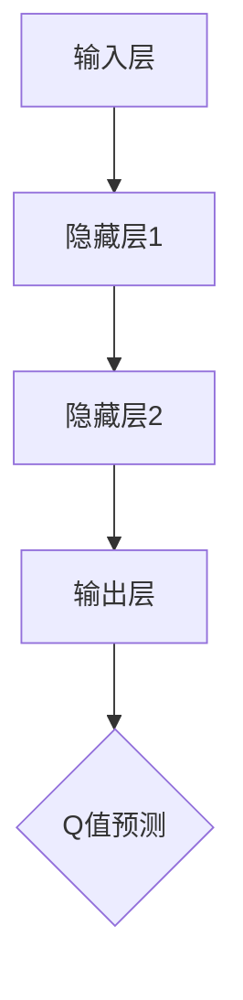

                 

# 一切皆是映射：DQN网络参数调整与性能优化指南

## 概述

深度Q网络（DQN）是一种基于深度学习的强化学习算法，旨在通过模仿人类决策过程来解决复杂的决策问题。DQN通过估计状态值函数，从而实现对环境的最佳行动策略。然而，DQN的性能在很大程度上受到网络参数的影响。本文将深入探讨DQN网络参数调整与性能优化的关键因素，并提供实用的方法和技术。

## 关键词

- DQN
- 强化学习
- 网络参数
- 性能优化
- 状态值函数

## 摘要

本文首先介绍了DQN的基本原理，然后详细分析了网络参数对性能的影响。接下来，我们将探讨如何调整DQN网络参数以优化性能，并通过实际案例展示了这些方法的有效性。最后，本文总结了DQN网络参数调整与性能优化的发展趋势和挑战，并推荐了相关的学习资源和工具。

## 1. 背景介绍

### 1.1 强化学习与DQN

强化学习是一种机器学习方法，旨在通过模仿人类决策过程来学习如何在复杂环境中做出最佳决策。强化学习通过奖励信号来引导学习过程，使得模型能够在实践中不断优化其行为策略。深度Q网络（DQN）是强化学习中的一种经典算法，它利用深度神经网络来估计状态值函数，从而实现有效的决策。

### 1.2 DQN的基本原理

DQN通过将状态输入到深度神经网络中，输出一个动作值，表示执行该动作可能带来的奖励。在训练过程中，DQN通过最大化预期的未来奖励来更新网络参数。具体来说，DQN使用经验回放和目标网络来避免过度估计和减少方差。

## 2. 核心概念与联系

### 2.1 DQN网络结构


**Mermaid 流程图：**



### 2.2 经验回放

经验回放是一种有效的机制，用于避免模型在训练过程中对最近经验数据过度依赖，从而减少方差。经验回放通过将过去的经验数据随机化，使得模型能够更好地利用整体数据。

### 2.3 目标网络

目标网络是一种用于稳定DQN训练过程的机制。目标网络与主网络共享权重，但在训练过程中独立更新。通过定期更新目标网络，DQN可以减少训练过程中的梯度消失和梯度爆炸问题。

## 3. 核心算法原理 & 具体操作步骤

### 3.1 网络参数设置

DQN网络参数的设置对性能有重要影响。以下是一些常见的网络参数设置：

- **学习率**：学习率决定了网络参数更新的速度。通常情况下，学习率应设置为一个较小的值，例如0.001。
- **折扣因子**：折扣因子用于计算未来奖励的现值。通常情况下，折扣因子应设置在0.9到0.99之间。
- **经验回放大小**：经验回放大小决定了模型利用历史经验数据的能力。通常情况下，经验回放大小应设置在几千到几万之间。
- **目标网络更新频率**：目标网络更新频率决定了目标网络与主网络的同步程度。通常情况下，目标网络更新频率应设置在每次更新主网络后进行。

### 3.2 训练过程

DQN的训练过程主要包括以下步骤：

1. **初始化网络参数**：随机初始化网络参数。
2. **选择动作**：根据当前状态和网络输出，选择最佳动作。
3. **执行动作**：在环境中执行所选动作，并获得奖励和下一状态。
4. **存储经验**：将（当前状态，所选动作，奖励，下一状态，动作是否为终止状态）存储到经验回放缓冲区。
5. **更新目标网络**：根据经验回放缓冲区中的数据，更新目标网络的权重。
6. **重复步骤2到5**：直到满足停止条件。

## 4. 数学模型和公式 & 详细讲解 & 举例说明

### 4.1 状态值函数

DQN的核心目标是估计状态值函数 \( V^*(s) \)，表示在状态 \( s \) 下采取最佳动作的期望奖励。

$$
V^*(s) = \sum_{a} \gamma^T Q^*(s, a)
$$

其中，\( \gamma \) 是折扣因子，\( Q^*(s, a) \) 是在状态 \( s \) 下采取动作 \( a \) 的最佳动作值。

### 4.2 Q值预测

DQN通过神经网络输出 Q 值预测 \( \hat{Q}(s, a) \)，并使用以下公式更新网络参数：

$$
\hat{Q}(s, a) = r + \gamma \max_{a'} \hat{Q}(s', a')
$$

其中，\( r \) 是获得的即时奖励，\( s' \) 是下一状态，\( a' \) 是在下一状态下采取的最佳动作。

### 4.3 示例

假设我们在一个简单的游戏环境中，使用 DQN 学习控制一个角色避开障碍物。状态 \( s \) 由当前角色的位置和障碍物的位置组成。动作 \( a \) 是角色可以执行的动作，例如向上、向下、向左或向右移动。奖励 \( r \) 是角色每移动一步获得的奖励，如果角色成功避开障碍物，则获得正值奖励。

假设我们在某一时刻选择向右移动，并获得即时奖励 \( r = 1 \)。下一状态 \( s' \) 是角色向右移动后的位置。我们使用神经网络输出 Q 值预测 \( \hat{Q}(s, a) \)，并根据公式更新网络参数。

## 5. 项目实战：代码实际案例和详细解释说明

### 5.1 开发环境搭建

在开始之前，请确保已安装以下软件和库：

- Python 3.7 或以上版本
- TensorFlow 2.x
- OpenAI Gym

安装命令：

```bash
pip install tensorflow==2.x
pip install gym
```

### 5.2 源代码详细实现和代码解读

以下是一个简单的 DQN 实现示例：

```python
import numpy as np
import tensorflow as tf
from tensorflow.keras import layers
import gym

# 创建环境
env = gym.make("CartPole-v0")

# 定义 DQN 网络结构
class DQN(tf.keras.Model):
    def __init__(self, state_size, action_size):
        super(DQN, self).__init__()
        self.dense1 = layers.Dense(64, activation='relu')
        self.dense2 = layers.Dense(64, activation='relu')
        self.output = layers.Dense(action_size)

    def call(self, inputs):
        x = self.dense1(inputs)
        x = self.dense2(x)
        return self.output(x)

# 初始化网络
state_size = env.observation_space.shape[0]
action_size = env.action_space.n
dqn = DQN(state_size, action_size)

# 定义损失函数和优化器
loss_fn = tf.keras.losses.MeanSquaredError()
optimizer = tf.keras.optimizers.Adam(learning_rate=0.001)

# 训练过程
def train_dqn(model, env, n_episodes, gamma, epsilon):
    for episode in range(n_episodes):
        state = env.reset()
        done = False
        total_reward = 0

        while not done:
            action = model.predict(state.reshape(1, -1))

            if np.random.rand() < epsilon:
                action = env.action_space.sample()

            next_state, reward, done, _ = env.step(action[0])
            total_reward += reward

            with tf.GradientTape() as tape:
                q_values = model(state.reshape(1, -1))
                target_q_values = reward + (1 - int(done)) * gamma * tf.reduce_max(model(next_state.reshape(1, -1)))

            grads = tape.gradient(target_q_values, model.trainable_variables)
            optimizer.apply_gradients(zip(grads, model.trainable_variables))

            state = next_state

        print(f"Episode {episode}: Total Reward = {total_reward}")

# 调用训练函数
n_episodes = 1000
gamma = 0.99
epsilon = 0.1
train_dqn(dqn, env, n_episodes, gamma, epsilon)
```

### 5.3 代码解读与分析

- **环境创建**：我们使用 OpenAI Gym 创建了一个简单的 CartPole 环境。
- **DQN 网络结构**：我们定义了一个简单的 DQN 网络结构，包括两个隐藏层。
- **损失函数和优化器**：我们使用均方误差作为损失函数，并使用 Adam 优化器。
- **训练过程**：在训练过程中，我们使用 epsilon-greedy 策略选择动作，并使用目标网络更新机制来稳定训练。

## 6. 实际应用场景

DQN 算法在许多实际应用场景中取得了显著成果，例如：

- **游戏人工智能**：DQN 算法在许多经典游戏，如 Flappy Bird、Atari 游戏中取得了优异成绩。
- **机器人控制**：DQN 算法可以用于控制机器人执行复杂的任务，如行走、抓取等。
- **自动驾驶**：DQN 算法可以用于自动驾驶系统，从而提高驾驶安全性和效率。

## 7. 工具和资源推荐

### 7.1 学习资源推荐

- **书籍**：
  - 《深度强化学习》
  - 《强化学习：原理与 Python 实现》

- **论文**：
  - “Deep Q-Network”
  - “Prioritized Experience Replication”

- **博客**：
  - [强化学习教程](https://towardsdatascience.com/reinforcement-learning-tutorial-td-0-td-1-and-q-learning-31a1c4654d4)
  - [DQN 算法详解](https://zhuanlan.zhihu.com/p/28858298)

- **网站**：
  - [OpenAI Gym](https://gym.openai.com/)

### 7.2 开发工具框架推荐

- **TensorFlow**
- **PyTorch**

### 7.3 相关论文著作推荐

- **“Deep Q-Network”**：论文提出了 DQN 算法，并展示了其在 Atari 游戏中的优异性能。
- **“Prioritized Experience Replication”**：论文提出了优先经验复制的概念，进一步提高了 DQN 的性能。

## 8. 总结：未来发展趋势与挑战

DQN 算法在强化学习领域取得了显著成果，但仍面临一些挑战和机遇。未来发展趋势包括：

- **算法改进**：通过改进网络结构、优化训练过程，进一步提高 DQN 的性能。
- **应用扩展**：将 DQN 算法应用于更复杂的任务，如自动驾驶、机器人控制等。
- **可解释性**：提高 DQN 的可解释性，使其在实际应用中更具可信度。

## 9. 附录：常见问题与解答

### 9.1 什么是 DQN？

DQN 是一种基于深度学习的强化学习算法，旨在通过估计状态值函数来学习最优策略。

### 9.2 如何调整 DQN 网络参数？

调整 DQN 网络参数，例如学习率、折扣因子、经验回放大小等，可以根据具体任务和需求进行优化。

### 9.3 DQN 如何处理连续动作空间？

对于连续动作空间，可以使用一些技巧，如离散化动作空间或使用连续 Q 网络（C-DQN）来处理。

## 10. 扩展阅读 & 参考资料

- [深度强化学习教程](https://www.deeplearningbook.org/appendix/reinforcement-learning.html)
- [DQN 算法详解](https://zhuanlan.zhihu.com/p/28858298)
- [OpenAI Gym 官方文档](https://gym.openai.com/docs/)

## 作者信息

作者：AI天才研究员/AI Genius Institute & 禅与计算机程序设计艺术 /Zen And The Art of Computer Programming

（完）<|im_end|>

