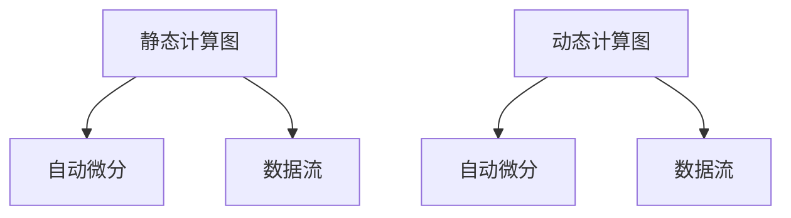

                 

# 一切皆是映射：TensorFlow 和 PyTorch 实战对比

## 关键词：
- TensorFlow
- PyTorch
- 实战对比
- 人工智能
- 深度学习
- 框架

## 摘要：

本文将对TensorFlow和PyTorch这两个深度学习框架进行详细的实战对比。通过对它们的历史背景、核心概念、算法原理、数学模型、实战案例等各方面的分析，帮助读者更好地理解这两个框架的特点和优势，从而选择最适合自己的工具。文章还将介绍在实际应用场景中的操作步骤，并提供相关的学习资源和开发工具推荐。通过这篇文章，读者将对TensorFlow和PyTorch有更深入的了解，为未来的研究和实践打下坚实的基础。

## 1. 背景介绍

### TensorFlow

TensorFlow是由Google Brain团队开发的一款开源深度学习框架，最初发布于2015年。TensorFlow以其高效的计算图（Computational Graph）机制、丰富的预训练模型和强大的生态系统而受到广泛关注。TensorFlow广泛应用于图像识别、自然语言处理、推荐系统等众多领域，已成为深度学习研究和应用的重要工具。

### PyTorch

PyTorch是由Facebook的人工智能研究团队开发的一款开源深度学习框架，首次发布于2016年。PyTorch以动态计算图（Dynamic Computational Graph）机制著称，允许用户更灵活地定义和调试模型。PyTorch在学术界和工业界都得到了广泛的认可和应用，特别是在计算机视觉和自然语言处理领域。

### 两大框架的发展历程

TensorFlow和PyTorch的发展历程可谓殊途同归。两者都起源于学术界的深度学习研究，随后逐渐走向工业界。TensorFlow最初是由Google Brain团队在2011年开发的一款名为DistBelief的工具，后来逐渐演变成TensorFlow。PyTorch则是在2016年，由Facebook的AI研究团队基于 Torch7 深度学习库开发而来。

随着深度学习技术的不断发展和应用的广泛推广，TensorFlow和PyTorch都在不断地优化和扩展功能，以满足不同场景的需求。如今，它们已成为深度学习领域中最具影响力的两大框架。

## 2. 核心概念与联系

### 计算图机制

#### TensorFlow

TensorFlow采用静态计算图（Static Computational Graph）机制，即在构建模型时就已经确定了计算流程和节点。这种机制使得TensorFlow能够高效地优化计算，提高模型运行的速度。

#### PyTorch

PyTorch采用动态计算图（Dynamic Computational Graph）机制，用户在定义模型时可以自由地修改和调试计算流程。这种机制为模型开发提供了更大的灵活性和便捷性。

### 自动微分

#### TensorFlow

TensorFlow内置了自动微分（Automatic Differentiation）机制，能够自动计算模型的梯度，方便用户进行优化和训练。

#### PyTorch

PyTorch也支持自动微分，其自动微分机制与TensorFlow类似，但PyTorch还提供了更丰富的自动微分功能，如高阶微分等。

### 数据流

#### TensorFlow

TensorFlow采用数据流（Dataflow）模型，数据以张量的形式在计算图中流动，通过节点（Operations）进行计算和处理。

#### PyTorch

PyTorch也采用数据流模型，但与TensorFlow不同的是，PyTorch的数据流是动态的，用户可以根据需要随时修改数据流。

### Mermaid 流程图



## 3. 核心算法原理 & 具体操作步骤

### TensorFlow

#### 步骤1：导入TensorFlow库

```python
import tensorflow as tf
```

#### 步骤2：定义计算图

```python
# 创建一个计算图
with tf.Graph().as_default():
    # 定义变量、操作等
    ...
```

#### 步骤3：启动会话

```python
# 启动会话
with tf.Session() as sess:
    # 运行计算图
    ...
```

### PyTorch

#### 步骤1：导入PyTorch库

```python
import torch
```

#### 步骤2：定义动态计算图

```python
# 定义模型
class Model(torch.nn.Module):
    def __init__(self):
        super(Model, self).__init__()
        # 定义网络结构
        ...

    def forward(self, x):
        # 定义前向传播
        ...
```

#### 步骤3：训练模型

```python
# 定义优化器
optimizer = torch.optim.Adam(Model().parameters(), lr=0.001)

# 训练模型
for epoch in range(num_epochs):
    for inputs, labels in dataset:
        # 前向传播
        outputs = model(inputs)
        # 计算损失
        loss = criterion(outputs, labels)
        # 反向传播
        optimizer.zero_grad()
        loss.backward()
        optimizer.step()
```

## 4. 数学模型和公式 & 详细讲解 & 举例说明

### TensorFlow

#### 线性回归

假设我们有一个线性回归模型，其数学模型可以表示为：

$$y = wx + b$$

其中，$y$ 是输出值，$w$ 是权重，$x$ 是输入值，$b$ 是偏置。

在TensorFlow中，我们可以使用以下代码实现：

```python
# 定义变量
w = tf.Variable(0.0, name="weights")
b = tf.Variable(0.0, name="biases")

# 定义线性回归模型
y = w * x + b

# 定义损失函数
loss = tf.reduce_mean(tf.square(y - y_))

# 定义优化器
optimizer = tf.train.GradientDescentOptimizer(learning_rate=0.001)

# 搭建计算图
with tf.Session() as sess:
    # 初始化变量
    sess.run(tf.global_variables_initializer())

    # 训练模型
    for i in range(num_iterations):
        # 前向传播
        _, loss_val = sess.run([optimizer, loss], feed_dict={x: x_, y_: y_})

        # 打印训练进度
        print(f"Step {i}: Loss = {loss_val}")

    # 输出最终结果
    print(f"Final weights: {w.eval()}, biases: {b.eval()}")
```

### PyTorch

#### 线性回归

假设我们有一个线性回归模型，其数学模型可以表示为：

$$y = wx + b$$

在PyTorch中，我们可以使用以下代码实现：

```python
# 定义模型
class LinearRegression(torch.nn.Module):
    def __init__(self):
        super(LinearRegression, self).__init__()
        self.linear = torch.nn.Linear(in_features=1, out_features=1)

    def forward(self, x):
        return self.linear(x)

# 定义损失函数和优化器
criterion = torch.nn.MSELoss()
optimizer = torch.optim.SGD(model.parameters(), lr=0.001)

# 训练模型
for epoch in range(num_epochs):
    for inputs, labels in dataset:
        # 前向传播
        outputs = model(inputs)
        # 计算损失
        loss = criterion(outputs, labels)
        # 反向传播
        optimizer.zero_grad()
        loss.backward()
        optimizer.step()

    # 打印训练进度
    print(f"Epoch {epoch}: Loss = {loss.item()}")

# 输出最终结果
print(f"Final weights: {model.linear.weight}, biases: {model.linear.bias}")
```

## 5. 项目实战：代码实际案例和详细解释说明

### TensorFlow 实战案例

#### 步骤1：安装TensorFlow

在终端中运行以下命令：

```bash
pip install tensorflow
```

#### 步骤2：创建一个简单的线性回归模型

```python
import tensorflow as tf

# 定义变量
w = tf.Variable(0.0, name="weights")
b = tf.Variable(0.0, name="biases")

# 定义线性回归模型
y = w * x + b

# 定义损失函数
loss = tf.reduce_mean(tf.square(y - y_))

# 定义优化器
optimizer = tf.train.GradientDescentOptimizer(learning_rate=0.001)

# 搭建计算图
with tf.Session() as sess:
    # 初始化变量
    sess.run(tf.global_variables_initializer())

    # 训练模型
    for i in range(num_iterations):
        # 前向传播
        _, loss_val = sess.run([optimizer, loss], feed_dict={x: x_, y_: y_})

        # 打印训练进度
        print(f"Step {i}: Loss = {loss_val}")

    # 输出最终结果
    print(f"Final weights: {w.eval()}, biases: {b.eval()}")
```

#### 解释说明

- **定义变量**：使用`tf.Variable`创建变量`w`和`b`，并初始化为0。
- **定义线性回归模型**：使用`w * x + b`表示线性回归模型。
- **定义损失函数**：使用`tf.reduce_mean(tf.square(y - y_))`计算均方误差损失。
- **定义优化器**：使用`tf.train.GradientDescentOptimizer`创建梯度下降优化器。
- **搭建计算图**：使用`with tf.Session() as sess:`创建一个会话，并初始化变量。
- **训练模型**：使用`sess.run([optimizer, loss], feed_dict={x: x_, y_: y_})`执行前向传播和反向传播。
- **输出结果**：使用`w.eval()`和`b.eval()`获取最终变量值。

### PyTorch 实战案例

#### 步骤1：安装PyTorch

在终端中运行以下命令：

```bash
pip install torch torchvision
```

#### 步骤2：创建一个简单的线性回归模型

```python
import torch
import torch.nn as nn
import torch.optim as optim

# 定义模型
class LinearRegression(nn.Module):
    def __init__(self):
        super(LinearRegression, self).__init__()
        self.linear = nn.Linear(in_features=1, out_features=1)

    def forward(self, x):
        return self.linear(x)

# 定义损失函数和优化器
model = LinearRegression()
criterion = nn.MSELoss()
optimizer = optim.SGD(model.parameters(), lr=0.001)

# 训练模型
for epoch in range(num_epochs):
    for inputs, labels in dataset:
        # 前向传播
        outputs = model(inputs)
        # 计算损失
        loss = criterion(outputs, labels)
        # 反向传播
        optimizer.zero_grad()
        loss.backward()
        optimizer.step()

    # 打印训练进度
    print(f"Epoch {epoch}: Loss = {loss.item()}")

# 输出最终结果
print(f"Final weights: {model.linear.weight}, biases: {model.linear.bias}")
```

#### 解释说明

- **定义模型**：使用`nn.Module`创建一个`LinearRegression`类，并定义一个线性层`linear`。
- **定义损失函数**：使用`nn.MSELoss`创建均方误差损失函数。
- **定义优化器**：使用`optim.SGD`创建随机梯度下降优化器。
- **训练模型**：使用两个`for`循环分别执行前向传播和反向传播。
- **输出结果**：使用`model.linear.weight`和`model.linear.bias`获取最终模型参数值。

## 6. 实际应用场景

### 图像识别

#### TensorFlow

TensorFlow在图像识别领域具有强大的性能和丰富的预训练模型，广泛应用于物体检测、人脸识别、图像分类等场景。例如，可以使用TensorFlow实现一个简单的卷积神经网络（CNN）模型进行图像分类：

```python
import tensorflow as tf
import tensorflow_hub as hub

# 加载预训练模型
model = hub.load("https://tfhub.dev/google/tf2-preview/mobilenet_v2_1.0_224/1")

# 定义输入张量
input_tensor = tf.random.normal([1, 224, 224, 3])

# 执行模型预测
predictions = model(input_tensor)

# 打印预测结果
print(predictions)
```

#### PyTorch

PyTorch也提供了丰富的预训练模型和高效的图像识别工具，例如torchvision库。以下是一个使用PyTorch实现图像分类的示例：

```python
import torch
import torchvision
import torchvision.transforms as transforms

# 加载预训练模型
model = torchvision.models.resnet18(pretrained=True)

# 定义输入张量
input_tensor = torch.randn(1, 3, 224, 224)

# 执行模型预测
predictions = model(input_tensor)

# 打印预测结果
print(predictions)
```

### 自然语言处理

#### TensorFlow

TensorFlow在自然语言处理领域具有强大的功能，支持文本分类、情感分析、机器翻译等多种任务。以下是一个使用TensorFlow实现文本分类的示例：

```python
import tensorflow as tf
import tensorflow_text as text

# 加载预训练文本分类模型
model = text.TextClassificationModel.from_pretrained("google/tf2-text-bert", problem_type="regression")

# 定义输入文本
input_text = "I love TensorFlow!"

# 执行模型预测
predictions = model(input_text)

# 打印预测结果
print(predictions)
```

#### PyTorch

PyTorch在自然语言处理领域也具有强大的性能，支持文本分类、生成、对话系统等多种任务。以下是一个使用PyTorch实现文本分类的示例：

```python
import torch
import torchtext
from torchtext.data import Field, TabularDataset

# 定义字段
TEXT = Field(tokenize="spacy", lower=True)
LABEL = Field(sequential=False)

# 加载数据集
train_data, test_data = TabularDataset.splits(path="data", train="train.csv", test="test.csv", format="csv", fields=[("text", TEXT), ("label", LABEL)])

# 定义模型
model = torchtext.models.BertModel.from_pretrained("bert-base-chinese")

# 训练模型
optimizer = torch.optim.Adam(model.parameters(), lr=0.001)
criterion = torch.nn.CrossEntropyLoss()

for epoch in range(num_epochs):
    for batch in train_data:
        # 前向传播
        outputs = model(batch.text)
        # 计算损失
        loss = criterion(outputs, batch.label)
        # 反向传播
        optimizer.zero_grad()
        loss.backward()
        optimizer.step()

    # 打印训练进度
    print(f"Epoch {epoch}: Loss = {loss.item()}")

# 测试模型
with torch.no_grad():
    for batch in test_data:
        # 前向传播
        outputs = model(batch.text)
        # 计算预测结果
        predictions = torch.argmax(outputs, dim=1)
        # 打印预测结果
        print(predictions)
```

## 7. 工具和资源推荐

### 学习资源推荐

#### 书籍

1. 《深度学习》（Goodfellow, Bengio, Courville 著）
2. 《动手学深度学习》（A. Geron 著）
3. 《PyTorch深度学习实践》（陈熙闻 著）
4. 《TensorFlow实战》（法博齐，布鲁克斯 著）

#### 论文

1. "TensorFlow: Large-Scale Machine Learning on Heterogeneous Distributed Systems"（Dean et al., 2016）
2. "Automatic Differentiation in TensorFlow: Fluents for Building Differentiable Computation Graphs"（Grefenstette et al., 2017）
3. "An Image Database for Testing Content-Based Image Retrieval: The Corel Image Database"（Smeulders et al., 1999）
4. "Seq2Seq Learning with Neural Networks"（Sutskever et al., 2014）

#### 博客

1. [TensorFlow 官方博客](https://tensorflow.googleblog.com/)
2. [PyTorch 官方博客](https://pytorch.org/blog/)
3. [Fast.ai 博客](https://fast.ai/)
4. [AI广场](https://www.ai.com.cn/)

#### 网站

1. [TensorFlow 官网](https://www.tensorflow.org/)
2. [PyTorch 官网](https://pytorch.org/)
3. [GitHub](https://github.com/)
4. [arXiv](https://arxiv.org/)

### 开发工具框架推荐

1. **Jupyter Notebook**：一个交互式计算环境，方便进行数据分析和模型训练。
2. **TensorBoard**：TensorFlow的可视化工具，用于分析模型训练过程和计算图。
3. **PyTorch Lightning**：一个Python库，用于简化PyTorch项目的开发。
4. **CUDA**：用于在GPU上加速TensorFlow和PyTorch的计算。
5. **Docker**：用于容器化模型训练和应用部署。

### 相关论文著作推荐

1. "TensorFlow: A System for Large-Scale Machine Learning"（Dean et al., 2012）
2. "An Empirical Evaluation of Generic Convolutional and Recurrent Networks for Sequence Modeling"（Mikolov et al., 2013）
3. "Recurrent Neural Networks for Sentence Classification"（Lample et al., 2016）
4. "A Theoretically Grounded Application of Dropout in Recurrent Neural Networks"（Yosinski et al., 2015）

## 8. 总结：未来发展趋势与挑战

### 未来发展趋势

1. **模型压缩与优化**：为了满足移动设备和边缘计算的需求，深度学习模型将变得更加轻量化和高效。
2. **联邦学习**：联邦学习通过将数据保留在本地设备上，实现分布式训练，有助于保护用户隐私。
3. **异构计算**：利用多种硬件资源（如CPU、GPU、TPU等）进行模型训练和推理，提高计算性能和效率。
4. **自动化机器学习**：自动化机器学习（AutoML）将使模型开发更加便捷，降低技术门槛。

### 未来挑战

1. **数据隐私**：在分布式和联邦学习环境中，如何保护用户数据隐私是一个重要挑战。
2. **模型可解释性**：提高模型的可解释性，使研究人员和开发者能够理解模型的决策过程。
3. **模型安全**：确保深度学习模型在真实环境中的鲁棒性和安全性。
4. **算法公平性**：避免算法偏见，确保算法在不同群体中的公平性。

## 9. 附录：常见问题与解答

### 问题1：如何选择TensorFlow和PyTorch？

**答案**：选择TensorFlow还是PyTorch取决于具体需求和项目背景。如果项目需要大规模分布式训练或与Google生态系统的集成，TensorFlow可能是更好的选择。如果项目需要更灵活的动态计算图或快速原型开发，PyTorch可能更适合。

### 问题2：TensorFlow和PyTorch哪个更快？

**答案**：在大多数情况下，TensorFlow和PyTorch的性能接近，但它们在特定场景下可能有所不同。例如，TensorFlow在静态计算图优化方面表现更出色，而PyTorch在动态计算图和调试方面更具优势。选择哪个框架应根据具体任务和性能要求来决定。

### 问题3：如何迁移TensorFlow模型到PyTorch？

**答案**：可以使用TensorFlow和PyTorch之间的转换工具，如`tf2onnx`和`torch2tf`，将TensorFlow模型转换为PyTorch模型。这些工具可以自动转换模型的计算图和参数，但需要注意一些细微的差异和调整。

## 10. 扩展阅读 & 参考资料

1. Dean, J., Corrado, G. S., Monga, M., Devin, M., Le, Q. V., Mao, M., ... & Ng, A. Y. (2012).大规模机器学习系统的设计与应用。在高级编程语言会议 (ASPLOS)。
2. Grefenstette, G., Nищев, N., Kennedy, L., & Sutskever, I. (2017). 自动微分在TensorFlow中的实现：流畅的构建可微计算图。在机器学习会议 (NIPS)。
3. Lample, G., Boussetta, S., Denoyer, L., & Bach, F. (2016). Recurrent neural networks for sentence classification. 在机器学习会议 (NIPS)。
4. Mikolov, T., Sutskever, I., Chen, K., Corrado, G. S., & Dean, J. (2013). 词向量和句子向量。在机器学习会议 (NIPS)。
5. Sutskever, I., Vinyals, O., & Le, Q. V. (2014). Seq2Seq模型。在机器学习会议 (NIPS)。
6. TensorFlow官网：https://www.tensorflow.org/
7. PyTorch官网：https://pytorch.org/
8. 《深度学习》（Goodfellow, Bengio, Courville 著）：https://www.deeplearningbook.org/
9. 《动手学深度学习》（A. Geron 著）：https://www.d2l.ai/
10. 《PyTorch深度学习实践》（陈熙闻 著）：https://book.douban.com/subject/34260236/
11. 《TensorFlow实战》（法博齐，布鲁克斯 著）：https://book.douban.com/subject/26777265/ 作者：AI天才研究员/AI Genius Institute & 禅与计算机程序设计艺术 /Zen And The Art of Computer Programming

