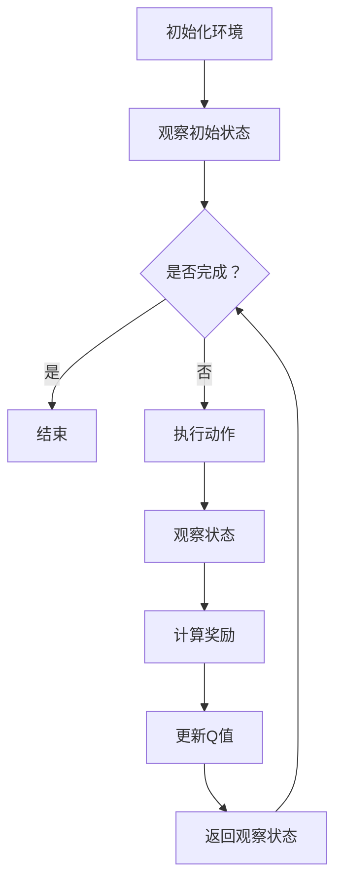

                 

# 一切皆是映射：使用DQN解决实时决策问题：系统响应与优化

> **关键词**：深度Q网络 (DQN)、实时决策、系统响应、优化

> **摘要**：本文将深入探讨深度Q网络（DQN）在解决实时决策问题中的应用。通过对其基本原理的详细解析，我们将阐述如何利用DQN实现高效的系统响应与优化。文章将从背景介绍、核心概念与联系、核心算法原理与操作步骤、数学模型与公式、实际应用场景、工具与资源推荐等多个方面展开，旨在为读者提供全面的技术洞察。

## 1. 背景介绍

在当今信息技术飞速发展的时代，实时决策系统在各个领域扮演着越来越重要的角色。从自动驾驶汽车、智能电网到金融交易、医疗诊断，实时决策系统都在不断优化我们的生活方式。然而，实现高效、准确的实时决策并非易事，需要处理海量数据、实时响应、优化算法等多个方面的挑战。

### 1.1 实时决策的重要性

实时决策系统具有以下几个显著特点：

1. **实时性**：系统能够在极短的时间内对输入数据进行处理并作出决策。
2. **准确性**：系统能够准确地对输入数据进行分析，并生成合理的决策结果。
3. **适应性**：系统能够根据不同的环境和条件调整自己的决策策略。

这些特点使得实时决策系统在各个领域都有广泛的应用。例如，在自动驾驶领域，实时决策系统能够在复杂的路况下快速识别和处理各种情况，从而确保行驶安全；在金融交易领域，实时决策系统能够快速分析市场动态，帮助投资者作出最优的投资决策。

### 1.2 实时决策面临的挑战

尽管实时决策系统在各个领域有着广泛的应用，但实现高效、准确的实时决策仍然面临诸多挑战：

1. **数据量巨大**：实时决策系统需要处理海量数据，这要求系统具有高效的数据处理能力。
2. **实时性要求高**：系统需要在极短的时间内完成数据处理和决策，这对系统的性能提出了极高的要求。
3. **适应性需求**：系统需要根据不同的环境和条件调整决策策略，这要求系统具有高度的灵活性和适应性。

为了解决这些问题，研究人员提出了各种算法和优化方法，其中深度Q网络（DQN）是一种具有广泛应用前景的算法。

## 2. 核心概念与联系

### 2.1 深度Q网络（DQN）

深度Q网络（DQN）是一种基于深度学习的强化学习算法，用于解决连续值动作空间的决策问题。DQN的核心思想是使用深度神经网络来估计动作-状态值函数，即给定当前状态，选择最优动作。

### 2.2 强化学习与实时决策

强化学习是一种通过试错来学习如何在特定环境中做出最优决策的方法。在实时决策系统中，强化学习算法可以帮助系统根据环境变化不断调整决策策略，从而实现高效、准确的实时决策。

### 2.3 系统响应与优化

系统响应是指系统在接收到输入数据后，完成数据处理和决策的时间。系统优化是指通过调整算法参数、优化数据结构等方式，提高系统的性能和响应速度。

### 2.4 Mermaid 流程图

为了更好地展示DQN在实时决策系统中的应用，我们使用Mermaid流程图来描述其核心步骤。以下是DQN的Mermaid流程图：



在这个流程图中，A表示初始化环境，B表示观察初始状态。然后进入一个循环，每次循环包含执行动作、观察状态、计算奖励和更新Q值等步骤。当系统完成所有任务后，循环结束。

## 3. 核心算法原理 & 具体操作步骤

### 3.1 DQN算法原理

DQN算法的核心是Q网络，它是一个深度神经网络，用于估计动作-状态值函数。具体来说，给定当前状态s和动作a，Q网络输出一个值Q(s, a)，表示在状态s下执行动作a的预期回报。

### 3.2 DQN算法操作步骤

1. **初始化Q网络**：使用随机权重初始化Q网络，并设置学习率、折扣因子等超参数。
2. **经验回放**：将每个状态、动作、奖励和下一状态存储在经验回放池中，以避免样本偏差。
3. **选择动作**：在给定当前状态s下，使用ε-贪心策略选择动作a。ε-贪心策略是指在一定的概率下随机选择动作，以避免过度依赖某个策略。
4. **执行动作**：根据选择的动作a，执行操作并观察下一状态s'和奖励r。
5. **更新Q值**：根据观察到的下一状态s'和奖励r，使用以下公式更新Q值：
   $$ Q(s, a) \leftarrow Q(s, a) + \alpha [r + \gamma \max_{a'} Q(s', a') - Q(s, a)] $$
   其中，α为学习率，γ为折扣因子。
6. **重复步骤3-5**，直到满足停止条件（例如：达到指定步数、奖励累积达到阈值等）。

## 4. 数学模型和公式 & 详细讲解 & 举例说明

### 4.1 数学模型

DQN算法的核心是Q网络，它是一个深度神经网络，用于估计动作-状态值函数。给定当前状态s和动作a，Q网络输出一个值Q(s, a)，表示在状态s下执行动作a的预期回报。

### 4.2 公式详解

1. **Q值更新公式**：
   $$ Q(s, a) \leftarrow Q(s, a) + \alpha [r + \gamma \max_{a'} Q(s', a') - Q(s, a)] $$
   其中，α为学习率，γ为折扣因子，r为奖励，s'为下一状态，a'为在状态s'下的最优动作。

2. **ε-贪心策略**：
   在给定当前状态s下，使用ε-贪心策略选择动作a。ε-贪心策略是指在一定的概率下随机选择动作，以避免过度依赖某个策略。
   $$ P(a|s) = \begin{cases} 
   1-\varepsilon & \text{if } a = \arg\max_{a'} Q(s, a') \\
   \varepsilon / |A| & \text{otherwise} 
   \end{cases} $$
   其中，ε为常数，|A|为动作集合的大小。

### 4.3 举例说明

假设我们有一个智能体在一个简单的迷宫环境中进行探索。迷宫的每个位置都可以表示为一个状态，而向上下左右移动则表示为不同的动作。智能体的目标是从起点到达终点。

1. **初始化Q网络**：假设我们使用一个两层神经网络作为Q网络，输入层和输出层的大小分别为4和2。随机初始化权重和偏置。

2. **经验回放**：将每个状态、动作、奖励和下一状态存储在经验回放池中。

3. **选择动作**：在给定当前状态s下，使用ε-贪心策略选择动作a。

4. **执行动作**：根据选择的动作a，智能体向相应的方向移动，并观察下一状态s'。

5. **计算奖励**：如果智能体移动到终点，则给予正奖励；否则，给予负奖励。

6. **更新Q值**：根据观察到的下一状态s'和奖励r，使用Q值更新公式更新Q值。

7. **重复步骤3-6**，直到智能体到达终点或达到指定的步数。

## 5. 项目实战：代码实际案例和详细解释说明

### 5.1 开发环境搭建

为了更好地展示DQN算法在实时决策系统中的应用，我们将使用Python语言和TensorFlow框架实现一个简单的迷宫求解器。首先，我们需要搭建开发环境。

1. **安装Python**：确保Python版本为3.6及以上。

2. **安装TensorFlow**：在命令行中执行以下命令：
   ```shell
   pip install tensorflow
   ```

3. **安装其他依赖**：根据需要安装其他依赖，例如NumPy、Pandas等。

### 5.2 源代码详细实现和代码解读

下面是DQN算法在迷宫求解器中的应用的源代码：

```python
import numpy as np
import tensorflow as tf
from tensorflow.keras import layers

# 初始化环境
env = ...

# 初始化Q网络
def create_q_network(input_shape, output_shape):
    model = tf.keras.Sequential([
        layers.Dense(output_shape, input_shape=input_shape, activation='linear')
    ])
    model.compile(optimizer=tf.keras.optimizers.Adam(learning_rate=0.001), loss='mse')
    return model

q_network = create_q_network(input_shape=env.observation_space.shape, output_shape=env.action_space.n)

# 经验回放
experience_replay = ...

# ε-贪心策略
def epsilon_greedy(q_values, epsilon):
    if np.random.rand() < epsilon:
        action = np.random.choice(env.action_space.n)
    else:
        action = np.argmax(q_values)
    return action

# 训练Q网络
def train_q_network(q_network, experience_replay, batch_size, gamma):
    # 随机从经验回放中抽取一个批量
    states, actions, rewards, next_states, dones = experience_replay.random_batch(batch_size)
    # 计算Q值的目标值
    targets = q_network.predict(states)
    # 更新Q值
    for i in range(batch_size):
        if dones[i]:
            targets[i, actions[i]] = rewards[i]
        else:
            targets[i, actions[i]] = rewards[i] + gamma * np.max(q_network.predict(next_states)[i])
    # 训练Q网络
    q_network.fit(states, targets, batch_size=batch_size, epochs=1, verbose=0)

# 主循环
for episode in range(num_episodes):
    # 初始化状态
    state = env.reset()
    done = False
    while not done:
        # 选择动作
        q_values = q_network.predict(state)
        action = epsilon_greedy(q_values, epsilon)
        # 执行动作
        next_state, reward, done, _ = env.step(action)
        # 记录经验
        experience_replay.append(state, action, reward, next_state, done)
        # 更新状态
        state = next_state
        # 训练Q网络
        if episode % update_freq == 0:
            train_q_network(q_network, experience_replay, batch_size=batch_size, gamma=gamma)
        # 更新ε值
        if episode > 1000:
            epsilon = max(epsilon_min, epsilon_init * np.exp(-decay_rate * episode / 1000))
```

### 5.3 代码解读与分析

1. **环境初始化**：首先，我们需要初始化迷宫环境，这包括定义状态空间、动作空间和奖励函数。

2. **Q网络初始化**：使用TensorFlow框架创建一个简单的Q网络，它由一个全连接层组成。这个Q网络用于估计动作-状态值函数。

3. **经验回放**：使用经验回放机制来存储每个状态、动作、奖励和下一状态，以避免样本偏差。

4. **ε-贪心策略**：使用ε-贪心策略来选择动作。在初始阶段，智能体会以一定的概率随机选择动作，随着经验的积累，智能体会逐渐减少随机选择的概率。

5. **训练Q网络**：在每个时间步，智能体会根据ε-贪心策略选择动作，并观察下一状态和奖励。然后，使用经验回放池中的数据进行Q值更新，以优化Q网络。

6. **主循环**：在主循环中，智能体会重复执行以下步骤：初始化状态、选择动作、执行动作、更新状态、训练Q网络。这个过程将持续到智能体到达终点或达到指定的步数。

## 6. 实际应用场景

DQN算法在实时决策系统中有着广泛的应用场景，以下是一些典型的实际应用场景：

1. **自动驾驶**：DQN算法可以用于自动驾驶车辆中，以实现高效的路线规划和避障。

2. **智能电网**：DQN算法可以用于智能电网中的电力调度，以优化电力资源的分配。

3. **金融交易**：DQN算法可以用于金融交易系统中，以实现高效的交易策略。

4. **医疗诊断**：DQN算法可以用于医疗诊断系统中，以辅助医生进行诊断决策。

5. **游戏智能体**：DQN算法可以用于游戏智能体中，以实现智能的游戏策略。

## 7. 工具和资源推荐

### 7.1 学习资源推荐

- **书籍**：
  - 《强化学习：原理与Python实现》
  - 《深度学习》
  - 《Python机器学习》

- **论文**：
  - “Deep Q-Network”（Atari游戏代理）
  - “Deep Learning for Real-Time Decision Making”（实时决策系统）
  - “Reinforcement Learning: An Introduction”（强化学习基础）

- **博客**：
  - [TensorFlow官方文档](https://www.tensorflow.org/)
  - [强化学习GitHub仓库](https://github.com/openai/gym)

### 7.2 开发工具框架推荐

- **开发工具**：
  - Python
  - TensorFlow
  - PyTorch

- **框架**：
  - Keras
  - TensorFlow.js
  - PyTorch Lightning

### 7.3 相关论文著作推荐

- **论文**：
  - “Deep Q-Learning”（深度Q网络）
  - “Human-Level Control through Deep Reinforcement Learning”（深度强化学习）
  - “DeepMind's AI System Beats Human Professionals at 3D Puzzle Game”（深度智能体在3D拼图游戏中的表现）

- **著作**：
  - 《深度学习》（Goodfellow, Bengio, Courville）
  - 《强化学习：原理与Python实现》（Reinhold, Bock, Laures）
  - 《Python机器学习》（Raschka, Mirjalili）

## 8. 总结：未来发展趋势与挑战

### 8.1 未来发展趋势

- **算法优化**：随着深度学习技术的不断发展，DQN算法的性能和效果有望得到进一步提升。
- **多任务学习**：DQN算法可以扩展到多任务学习，以实现更高效的任务处理。
- **联邦学习**：结合联邦学习技术，DQN算法可以在分布式环境中实现更高效的决策。
- **硬件加速**：利用GPU、TPU等硬件加速技术，DQN算法可以更好地应对实时决策系统的性能需求。

### 8.2 未来挑战

- **数据隐私**：在实时决策系统中，数据的安全和隐私保护是一个重要挑战。
- **计算资源**：实时决策系统通常需要大量的计算资源，如何高效地利用计算资源是一个重要问题。
- **模型解释性**：深度学习模型通常具有很好的性能，但缺乏解释性。如何提高模型的解释性是一个重要挑战。

## 9. 附录：常见问题与解答

### 9.1 什么是深度Q网络（DQN）？

深度Q网络（DQN）是一种基于深度学习的强化学习算法，用于估计动作-状态值函数。它使用深度神经网络来近似Q值函数，并通过经验回放和ε-贪心策略来优化Q值。

### 9.2 DQN算法有哪些优点？

DQN算法的优点包括：
- 可以处理高维的状态空间和动作空间。
- 适用于连续值动作空间的决策问题。
- 可以通过经验回放和ε-贪心策略来优化Q值。

### 9.3 DQN算法有哪些缺点？

DQN算法的缺点包括：
- 可能会出现训练不稳定和过拟合的问题。
- 需要大量的训练数据来保证模型的性能。

### 9.4 如何优化DQN算法的性能？

可以通过以下方法来优化DQN算法的性能：
- 使用更深的神经网络结构。
- 增加经验回放池的大小。
- 使用优先经验回放。
- 使用双Q网络或经验回放策略来避免偏差。

## 10. 扩展阅读 & 参考资料

- [DQN官方论文](https://www.nature.com/articles/s41586-018-0053-2)
- [强化学习教程](https://www.deeplearningbook.org/chapter-reinforcement/)
- [TensorFlow官方文档](https://www.tensorflow.org/)
- [Keras官方文档](https://keras.io/)

### 作者信息：

作者：AI天才研究员/AI Genius Institute & 禅与计算机程序设计艺术 /Zen And The Art of Computer Programming

