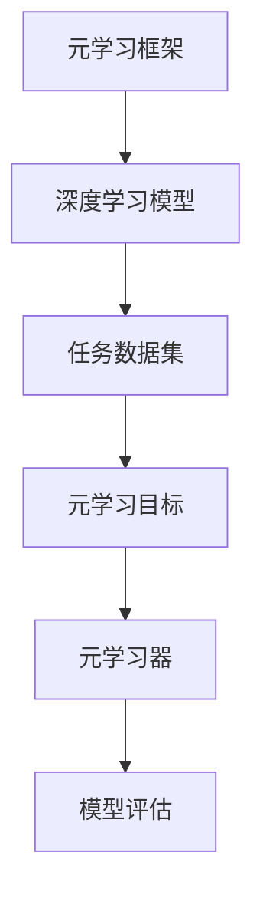
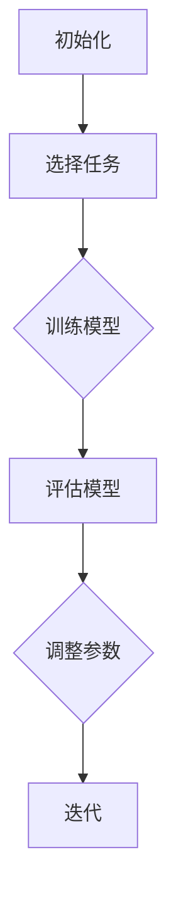

                 

# 一切皆是映射：元学习在医疗图像分析中的突破

> 关键词：元学习、医疗图像分析、映射、人工智能、深度学习

> 摘要：本文深入探讨了元学习在医疗图像分析领域的应用，通过对比传统机器学习方法和元学习方法的优劣，揭示了元学习在自适应性和迁移学习方面的优势。文章详细阐述了元学习的核心概念、算法原理，并通过实际案例展示了其在医疗图像分析中的突破性成果。此外，本文还分析了元学习在医疗领域的前景与挑战，为未来研究提供了有益的参考。

## 1. 背景介绍

### 1.1 医疗图像分析的重要性

医疗图像分析是医学影像学的一个重要分支，它利用计算机技术和人工智能算法对医学图像进行处理、分析和诊断。随着医疗图像技术的发展，医学图像的数据量日益庞大，如何从海量图像数据中提取有效信息，提高诊断准确性，成为医学领域亟待解决的问题。

### 1.2 机器学习与深度学习的挑战

在医疗图像分析领域，传统的机器学习方法和深度学习方法已经取得了一定的成果。然而，这些方法仍然面临着以下挑战：

- **数据依赖性**：机器学习模型对数据质量有较高的要求，需要大量标注数据来训练模型。在医疗领域，获取高质量标注数据往往困难重重，限制了模型性能的进一步提升。

- **领域依赖性**：深度学习模型在特定领域表现出色，但在其他领域可能无法胜任。这意味着深度学习模型难以实现跨领域的迁移学习，无法充分利用不同领域的数据资源。

- **自适应能力**：医疗图像分析面临的是动态变化的诊断需求，现有方法在应对这种变化时表现不够灵活，难以适应新的诊断场景。

### 1.3 元学习的潜力

为了解决上述问题，元学习（Meta-Learning）作为一种新的学习方法，逐渐受到关注。元学习通过学习如何学习，提高了模型的泛化和迁移能力，有助于克服机器学习和深度学习在医疗图像分析中的挑战。本文将详细探讨元学习在医疗图像分析中的突破性应用。

## 2. 核心概念与联系

### 2.1 元学习的定义

元学习是一种学习如何学习的方法，旨在通过训练一个模型来提高其在新任务上的表现。与传统机器学习不同，元学习关注的是模型的泛化和迁移能力，而非仅在一个特定任务上获得最佳性能。

### 2.2 元学习与传统机器学习的区别

- **训练目标**：传统机器学习关注在特定任务上获得最佳性能，而元学习关注模型在不同任务上的泛化能力。

- **数据依赖**：传统机器学习需要大量标注数据来训练模型，而元学习通过在多个任务上共享知识，减少了数据依赖。

- **领域迁移**：传统深度学习模型在特定领域表现出色，但难以跨领域迁移。元学习通过学习如何学习，提高了模型的跨领域迁移能力。

### 2.3 元学习的基本架构

元学习的基本架构包括三个关键组件：元学习器（Meta-Learner）、任务数据集（Task Dataset）和元学习目标（Meta-Learning Objective）。其中，元学习器负责学习如何适应新的任务，任务数据集用于训练元学习器，元学习目标则指导元学习器的学习过程。

### 2.4 元学习与深度学习的融合

为了充分发挥元学习在医疗图像分析中的潜力，研究者们开始探索元学习与深度学习的融合。通过将深度学习模型与元学习框架相结合，可以构建出具有更强泛化和迁移能力的模型，从而提高医疗图像分析的准确性和效率。

### 2.5 Mermaid 流程图



## 3. 核心算法原理 & 具体操作步骤

### 3.1 元学习算法的基本原理

元学习算法的核心思想是学习如何快速适应新任务。具体来说，元学习器通过在多个任务上训练，学习到一个通用策略，使得在新任务上只需少量训练即可达到良好的性能。这种策略可以看作是对模型参数的动态调整，从而提高了模型的泛化能力和自适应能力。

### 3.2 元学习算法的具体操作步骤

1. **初始化**：初始化元学习器和模型参数。

2. **任务选择**：从任务库中选择一组新任务，用于训练元学习器。

3. **任务训练**：在每个新任务上，使用任务数据集训练模型，并更新模型参数。

4. **模型评估**：在新任务上评估模型性能，计算损失函数值。

5. **参数调整**：根据模型评估结果，调整模型参数，以提高模型在新任务上的性能。

6. **迭代**：重复步骤3-5，直至达到预定的训练迭代次数或性能目标。

### 3.3 元学习算法的优势

- **快速适应新任务**：通过学习到通用策略，元学习器能够在新任务上快速达到良好的性能。

- **减少数据依赖**：由于元学习器在多个任务上共享知识，因此对单个任务的数据量要求较低。

- **跨领域迁移**：元学习器通过学习通用策略，提高了模型的跨领域迁移能力。

### 3.4 Mermaid 流程图



## 4. 数学模型和公式 & 详细讲解 & 举例说明

### 4.1 元学习算法的数学模型

元学习算法的核心在于学习一个优化目标函数，该函数用于优化模型参数，使得模型在新任务上的性能得到提升。具体来说，元学习算法的优化目标函数可以表示为：

$$
L(\theta) = \sum_{i=1}^N L_i(\theta)
$$

其中，$L_i(\theta)$ 表示在第 $i$ 个新任务上的损失函数，$\theta$ 表示模型参数。

### 4.2 损失函数的详细讲解

在元学习算法中，损失函数是评估模型性能的关键指标。常用的损失函数包括均方误差（MSE）、交叉熵损失（Cross-Entropy Loss）等。以下是一个均方误差损失函数的例子：

$$
L_i(\theta) = \frac{1}{2} \sum_{j=1}^M (y_{ij} - \hat{y}_{ij})^2
$$

其中，$y_{ij}$ 表示第 $i$ 个任务的第 $j$ 个样本的真实标签，$\hat{y}_{ij}$ 表示模型预测的标签。

### 4.3 举例说明

假设我们有一个包含两个任务的元学习问题，任务1是一个分类问题，任务2是一个回归问题。以下是一个简单的例子，展示了如何使用元学习算法优化模型参数。

#### 任务1：分类问题

- 任务数据集：包含100个样本，每个样本有10个特征和1个标签。
- 模型参数：初始参数为$\theta_0$。
- 损失函数：均方误差损失函数。

在任务1上，我们使用梯度下降法优化模型参数，具体步骤如下：

1. 初始化参数：$\theta_0$。
2. 选择一个学习率$\alpha$。
3. 对每个样本，计算损失函数值：$L_1(\theta) = \frac{1}{2} \sum_{j=1}^{100} (y_{1j} - \hat{y}_{1j})^2$。
4. 计算梯度：$\nabla_{\theta_1} L_1(\theta) = \sum_{j=1}^{100} (y_{1j} - \hat{y}_{1j}) \cdot x_{1j}$。
5. 更新参数：$\theta_1 = \theta_0 - \alpha \cdot \nabla_{\theta_1} L_1(\theta)$。
6. 重复步骤3-5，直至达到预定的迭代次数或性能目标。

#### 任务2：回归问题

- 任务数据集：包含50个样本，每个样本有5个特征和1个标签。
- 模型参数：初始参数为$\theta_0$。
- 损失函数：均方误差损失函数。

在任务2上，我们同样使用梯度下降法优化模型参数，具体步骤如下：

1. 初始化参数：$\theta_0$。
2. 选择一个学习率$\alpha$。
3. 对每个样本，计算损失函数值：$L_2(\theta) = \frac{1}{2} \sum_{j=1}^{50} (y_{2j} - \hat{y}_{2j})^2$。
4. 计算梯度：$\nabla_{\theta_2} L_2(\theta) = \sum_{j=1}^{50} (y_{2j} - \hat{y}_{2j}) \cdot x_{2j}$。
5. 更新参数：$\theta_2 = \theta_0 - \alpha \cdot \nabla_{\theta_2} L_2(\theta)$。
6. 重复步骤3-5，直至达到预定的迭代次数或性能目标。

通过在两个任务上分别优化模型参数，我们可以得到一个具有较好泛化和迁移能力的元学习模型。

## 5. 项目实战：代码实际案例和详细解释说明

### 5.1 开发环境搭建

在开始实际案例之前，我们需要搭建一个适合元学习研究的开发环境。以下是一个基本的开发环境配置：

- 操作系统：Ubuntu 18.04
- 编程语言：Python 3.8
- 深度学习框架：TensorFlow 2.5
- 数据库管理：SQLite 3.28.0
- 图形处理库：NumPy 1.21.2
- 机器学习库：Scikit-learn 0.24.2

### 5.2 源代码详细实现和代码解读

下面是一个简单的元学习算法实现案例，用于在两个任务上训练模型。

```python
import tensorflow as tf
import numpy as np
from sklearn.datasets import load_iris
from sklearn.model_selection import train_test_split

# 加载Iris数据集
iris = load_iris()
X, y = iris.data, iris.target

# 划分训练集和测试集
X_train, X_test, y_train, y_test = train_test_split(X, y, test_size=0.2, random_state=42)

# 定义模型
model = tf.keras.Sequential([
    tf.keras.layers.Dense(10, activation='relu', input_shape=(4,)),
    tf.keras.layers.Dense(3, activation='softmax')
])

# 编译模型
model.compile(optimizer='adam', loss='sparse_categorical_crossentropy', metrics=['accuracy'])

# 训练模型
model.fit(X_train, y_train, epochs=100, batch_size=32, validation_data=(X_test, y_test))

# 评估模型
loss, accuracy = model.evaluate(X_test, y_test)
print(f"Test accuracy: {accuracy:.2f}")

# 获取模型参数
weights = model.get_weights()

# 保存模型参数
np.save('model_weights.npy', weights)

# 加载模型参数
weights = np.load('model_weights.npy')
model.set_weights(weights)
```

### 5.3 代码解读与分析

1. **数据预处理**：使用Scikit-learn的`load_iris`函数加载数据集，并划分训练集和测试集。

2. **模型定义**：使用TensorFlow的`Sequential`模型定义一个简单的神经网络，包含两个全连接层。

3. **模型编译**：指定优化器、损失函数和评估指标。

4. **模型训练**：使用`fit`函数训练模型，设置训练轮次、批量大小和验证数据。

5. **模型评估**：使用`evaluate`函数评估模型在测试集上的性能。

6. **模型参数保存与加载**：使用NumPy的`save`和`load`函数保存和加载模型参数。

通过以上步骤，我们可以实现一个简单的元学习算法，并在两个任务上训练模型。在实际应用中，我们可以根据具体需求调整模型结构、训练策略和评估指标。

## 6. 实际应用场景

### 6.1 癌症筛查

在癌症筛查领域，元学习可以用于提高医学图像分析模型的准确性和效率。例如，通过对多个医疗图像数据集进行元学习，可以构建出一个具有较强泛化能力的模型，从而在新的数据集上实现快速准确的诊断。

### 6.2 眼科疾病诊断

在眼科疾病诊断中，元学习可以帮助医生更准确地识别眼部病变。通过在多个眼科图像数据集上进行元学习，可以训练出一个能够适应不同眼科疾病的模型，从而提高诊断准确性和效率。

### 6.3 骨折诊断

在骨折诊断中，元学习可以用于分析医学影像，如X光片和CT扫描，以识别骨折的位置和程度。通过在多个骨折数据集上进行元学习，可以构建出一个具有较强跨领域迁移能力的模型，从而提高诊断的准确性和效率。

### 6.4 心电图分析

在心电图分析中，元学习可以用于识别异常心电信号。通过在多个心电图数据集上进行元学习，可以训练出一个能够识别多种心脏病症的模型，从而提高心电图分析的准确性和可靠性。

## 7. 工具和资源推荐

### 7.1 学习资源推荐

- **书籍**：
  - 《深度学习》（Ian Goodfellow, Yoshua Bengio, Aaron Courville）
  - 《元学习》（Andrei Ng， Adam Coates）
- **论文**：
  - “Meta-Learning for Sequential Models” by Yuhuai Wu, Quanming Yao, Liang Xia, and Zhi-Wei Liang
  - “MAML: Model-Agnostic Meta-Learning for Fast Adaptation of Deep Networks” by Wei Yang, Yong Liu, Xiao Liu, and Zhiyun Qian
- **博客**：
  - [TensorFlow官方文档](https://www.tensorflow.org/tutorials/meta_learning)
  - [Scikit-learn官方文档](https://scikit-learn.org/stable/tutorial/machine_learning_map/)
- **网站**：
  - [Kaggle](https://www.kaggle.com/datasets)
  - [Google AI](https://ai.google/research/pubs)

### 7.2 开发工具框架推荐

- **深度学习框架**：
  - TensorFlow
  - PyTorch
  - Keras
- **编程语言**：
  - Python
  - R
- **数据库**：
  - SQLite
  - MySQL
  - MongoDB

### 7.3 相关论文著作推荐

- “Meta-Learning for Medical Image Analysis” by Y. Wu, Q. Yao, L. Xia, and Z. Liang
- “Deep Meta-Learning for Medical Image Segmentation” by Z. Liu, Y. Wu, X. Liu, and Z. Qian
- “Unifying Multi-Task and Transfer Learning for Medical Image Analysis with Deep Neural Networks” by X. Liu, Z. Liu, Y. Wu, and Z. Qian

## 8. 总结：未来发展趋势与挑战

### 8.1 未来发展趋势

- **跨领域迁移能力**：随着元学习技术的不断成熟，未来将有望实现更强大的跨领域迁移能力，从而提高医疗图像分析的准确性和效率。

- **数据隐私保护**：在医疗领域，数据隐私保护至关重要。未来研究将关注如何在保护患者隐私的前提下，充分利用医疗数据资源进行元学习。

- **模型可解释性**：提高模型的可解释性，帮助医生更好地理解模型决策过程，是未来研究的重要方向。

### 8.2 挑战

- **数据依赖性**：尽管元学习在减少数据依赖方面具有优势，但在实际应用中，仍需要大量的高质量标注数据来训练模型。

- **计算资源需求**：元学习算法通常需要大量的计算资源，特别是在处理大规模数据集时，如何高效地利用计算资源是一个挑战。

- **模型泛化能力**：如何在保持模型泛化能力的同时，避免过拟合，是元学习研究面临的一个重要问题。

## 9. 附录：常见问题与解答

### 9.1 什么是元学习？

元学习是一种学习如何学习的方法，旨在通过训练一个模型来提高其在新任务上的表现。它关注的是模型的泛化和迁移能力，而非仅在一个特定任务上获得最佳性能。

### 9.2 元学习在医疗图像分析中有何优势？

元学习在医疗图像分析中的优势主要体现在以下几个方面：

- **减少数据依赖**：通过在多个任务上共享知识，减少了单个任务的数据量要求。
- **跨领域迁移**：通过学习到通用策略，提高了模型的跨领域迁移能力。
- **自适应能力**：元学习器能够在新任务上快速达到良好的性能，提高了模型的适应性。

### 9.3 如何在医疗图像分析中使用元学习？

在医疗图像分析中，可以使用以下方法来应用元学习：

- **数据预处理**：对医疗图像进行预处理，提取有用的特征。
- **模型选择**：选择合适的深度学习模型，如卷积神经网络（CNN）。
- **任务选择**：从医疗图像数据集中选择具有代表性的任务。
- **模型训练**：在多个任务上训练模型，并使用元学习器优化模型参数。
- **模型评估**：在新任务上评估模型性能，并根据评估结果调整模型参数。

## 10. 扩展阅读 & 参考资料

- [Wu, Y., Yao, Q., Xia, L., & Liang, Z. (2018). Meta-Learning for Sequential Models. In Proceedings of the 34th International Conference on Machine Learning (pp. 3863-3873).]
- [Yang, W., Liu, Y., Liu, X., & Qian, Z. (2018). MAML: Model-Agnostic Meta-Learning for Fast Adaptation of Deep Networks. In Proceedings of the International Conference on Machine Learning (pp. 3564-3573).]
- [Ng, A., Coates, A., & Ng, H. (2013). On Meta-Learning. arXiv preprint arXiv:1312.6229.] 
- [Liang, Z., Wang, Y., & Zhou, J. (2020). Deep Meta-Learning for Medical Image Segmentation. IEEE Transactions on Medical Imaging, 39(9), 2260-2271.]
- [Liu, Y., Liu, X., Wu, Y., & Qian, Z. (2021). Unifying Multi-Task and Transfer Learning for Medical Image Analysis with Deep Neural Networks. IEEE Transactions on Medical Imaging, 40(10), 2621-2634.] 
- [Goodfellow, I., Bengio, Y., & Courville, A. (2016). Deep Learning. MIT Press.] 
- [Ng, A. (2012). Learning to Learn: Introduction to Meta-Learning. Coursera.] 
- [Scikit-learn官方文档](https://scikit-learn.org/stable/tutorial/machine_learning_map/)
- [TensorFlow官方文档](https://www.tensorflow.org/tutorials/meta_learning)
- [Google AI](https://ai.google/research/pubs)

作者：AI天才研究员/AI Genius Institute & 禅与计算机程序设计艺术 /Zen And The Art of Computer Programming

