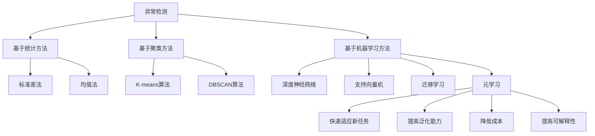

                 

# 一切皆是映射：元学习在异常检测中的应用策略

> **关键词：**元学习、异常检测、数据驱动、模型迁移、高效性、可解释性  
> **摘要：**本文将探讨元学习在异常检测领域的应用，分析其核心概念、算法原理、数学模型，并通过实际项目案例展示其效果。同时，我们将总结元学习在异常检测中的实际应用场景，并展望未来的发展趋势与挑战。

## 1. 背景介绍

### 异常检测的重要性

异常检测（Anomaly Detection）是一种重要的数据处理和分析技术，它在许多领域有着广泛的应用，如金融欺诈检测、网络安全监测、医疗数据诊断等。其目的是从大量数据中识别出不符合常规模式的异常数据或事件，以便及时采取相应的措施。

随着数据规模的不断扩大和数据多样性的增加，传统的基于规则和统计方法的异常检测技术面临着诸多挑战。这些方法往往需要人工定义规则或参数，缺乏灵活性和泛化能力。相比之下，数据驱动的方法，如机器学习模型，能够在处理复杂数据和识别多维度异常方面表现出更高的性能。

### 元学习的概念

元学习（Meta-Learning）是一种学习如何学习的算法。它通过在多个任务上训练模型，使模型能够在新的任务上快速适应，从而提高学习效率和泛化能力。元学习的主要目标是找到一个能够在不同任务上表现良好的通用模型，这一概念最早由Goodfellow等人提出。

元学习在许多领域都有着广泛的应用，如强化学习、迁移学习、少样本学习等。近年来，随着深度学习技术的发展，元学习在计算机视觉、自然语言处理等领域的表现也越来越出色。在异常检测领域，元学习的方法被认为是提高检测性能和降低成本的有效手段。

### 元学习在异常检测中的潜在优势

元学习在异常检测中的应用潜力主要体现在以下几个方面：

1. **快速适应新任务**：通过在多个任务上的训练，元学习模型可以快速适应新的异常检测任务，减少了对大量标注数据的依赖。
2. **提高泛化能力**：元学习模型能够在不同的数据分布和任务场景下保持良好的性能，从而提高异常检测的泛化能力。
3. **降低成本**：传统的异常检测方法往往需要大量的人工标注数据，而元学习模型可以通过在少量样本上训练来实现良好的性能，从而降低数据标注的成本。
4. **提高可解释性**：元学习模型通常具有较好的可解释性，能够帮助用户理解模型的决策过程，从而提高异常检测的可解释性。

## 2. 核心概念与联系

### 异常检测的基本概念

在讨论元学习在异常检测中的应用之前，我们需要先了解一些基本的异常检测概念。

#### 异常

异常（Anomaly）指的是在数据集中不符合大多数数据点的特征或行为。根据异常的性质，可以分为点异常（Point Anomaly）、集体异常（Collective Anomaly）和分布异常（Distribution Anomaly）。

- **点异常**：单个数据点与大多数数据点的特征差异较大，如一个异常的信用卡交易。
- **集体异常**：一组数据点在特征上的一致性异常，如多个账户在同一时间进行大量交易。
- **分布异常**：数据集的整体分布发生了变化，如某一时间段内的交易量异常增加。

#### 检测方法

异常检测方法主要可以分为基于统计的方法、基于聚类的方法和基于机器学习的方法。

- **基于统计的方法**：通过计算数据点与大多数数据点的统计差异来识别异常，如标准差法、均值法等。
- **基于聚类的方法**：通过将数据点划分为多个簇，然后识别与大多数簇不同的数据点作为异常。
- **基于机器学习的方法**：利用机器学习模型（如神经网络、支持向量机等）来学习正常数据的特征，然后识别与模型预测不符的数据点作为异常。

### 元学习的基本概念

元学习（Meta-Learning）是一种学习如何学习的算法，其核心思想是通过在多个任务上训练模型，使模型能够在新的任务上快速适应。元学习的关键在于找到一个能够适应不同任务的一般化模型，从而提高学习效率和泛化能力。

#### 元学习的主要任务

- **模型适应**：通过在多个任务上训练，使模型能够在新的任务上快速适应，减少对大量标注数据的依赖。
- **模型泛化**：使模型在不同任务和数据分布上保持良好的性能，提高泛化能力。
- **模型迁移**：将一个任务上的模型知识迁移到另一个任务上，从而减少对新的任务数据进行训练的需求。

### 元学习与异常检测的联系

元学习与异常检测之间的联系主要体现在以下几个方面：

1. **快速适应新任务**：元学习模型通过在多个异常检测任务上的训练，能够快速适应新的异常检测任务，减少对大量标注数据的依赖。
2. **提高泛化能力**：元学习模型在不同数据分布和任务场景下保持良好的性能，从而提高异常检测的泛化能力。
3. **降低成本**：通过在少量样本上训练，元学习模型能够降低异常检测的数据标注成本。
4. **提高可解释性**：元学习模型通常具有较好的可解释性，有助于用户理解模型的决策过程。

### Mermaid 流程图



## 3. 核心算法原理 & 具体操作步骤

### 元学习算法原理

元学习算法主要通过以下步骤实现：

1. **任务定义**：定义一组训练任务，每个任务包含输入数据集和标签。
2. **模型训练**：在多个任务上训练模型，使模型能够适应不同任务。
3. **模型评估**：评估模型在不同任务上的性能，选择性能最优的模型。
4. **模型迁移**：将训练好的模型应用于新的任务，实现快速适应。

具体来说，元学习算法可以分为以下几种类型：

1. **模型平均法**：在多个任务上训练多个模型，然后对它们的预测结果进行平均，以减少方差。
2. **参数共享法**：通过共享模型参数来减少任务的差异，提高模型的泛化能力。
3. **迁移学习法**：将一个任务上的模型知识迁移到另一个任务上，从而减少对新的任务数据进行训练的需求。

### 异常检测中的元学习算法

在异常检测中，元学习算法可以用于以下几个关键步骤：

1. **数据预处理**：对输入数据进行预处理，包括去噪、归一化等操作。
2. **特征提取**：使用特征提取器从原始数据中提取关键特征。
3. **模型训练**：在多个异常检测任务上训练模型，使模型能够适应不同任务。
4. **模型评估**：评估模型在不同任务上的性能，选择性能最优的模型。
5. **异常检测**：使用训练好的模型对新的数据进行异常检测。

### 具体操作步骤

以下是一个简单的元学习在异常检测中的具体操作步骤：

1. **数据收集与预处理**：收集多个异常检测任务的数据集，并进行预处理，如去噪、归一化等。
2. **特征提取**：使用特征提取器从原始数据中提取关键特征，如使用PCA（主成分分析）进行降维。
3. **模型训练**：在多个异常检测任务上训练模型，可以使用模型平均法或参数共享法。
4. **模型评估**：评估模型在不同任务上的性能，选择性能最优的模型。
5. **异常检测**：使用训练好的模型对新的数据进行异常检测，识别异常数据。

### 实例

假设我们有两个异常检测任务，任务1涉及信用卡交易数据，任务2涉及网络安全日志数据。我们可以按照以下步骤进行元学习：

1. **数据收集与预处理**：收集信用卡交易数据和网络安全日志数据，并进行预处理。
2. **特征提取**：使用PCA对数据进行降维，提取关键特征。
3. **模型训练**：在任务1和任务2上分别训练模型，可以使用模型平均法或参数共享法。
4. **模型评估**：评估模型在任务1和任务2上的性能，选择性能最优的模型。
5. **异常检测**：使用训练好的模型对新的数据进行异常检测，识别异常数据。

## 4. 数学模型和公式 & 详细讲解 & 举例说明

### 数学模型

在元学习过程中，常用的数学模型包括损失函数、优化算法和模型评估指标。

1. **损失函数**：常用的损失函数包括均方误差（MSE）和交叉熵（CE）。
   - **均方误差（MSE）**：$L_{MSE} = \frac{1}{n}\sum_{i=1}^{n}(y_i - \hat{y_i})^2$
   - **交叉熵（CE）**：$L_{CE} = -\frac{1}{n}\sum_{i=1}^{n}y_i\log(\hat{y_i}) + (1 - y_i)\log(1 - \hat{y_i})$

2. **优化算法**：常用的优化算法包括梯度下降（GD）和随机梯度下降（SGD）。
   - **梯度下降（GD）**：$w_{t+1} = w_t - \alpha \cdot \nabla_w L(w)$
   - **随机梯度下降（SGD）**：$w_{t+1} = w_t - \alpha \cdot \nabla_w L(w; x_t, y_t)$

3. **模型评估指标**：常用的评估指标包括准确率（Accuracy）、精确率（Precision）、召回率（Recall）和F1值（F1 Score）。
   - **准确率（Accuracy）**：$Accuracy = \frac{TP + TN}{TP + TN + FP + FN}$
   - **精确率（Precision）**：$Precision = \frac{TP}{TP + FP}$
   - **召回率（Recall）**：$Recall = \frac{TP}{TP + FN}$
   - **F1值（F1 Score）**：$F1 Score = 2 \cdot \frac{Precision \cdot Recall}{Precision + Recall}$

### 详细讲解

1. **损失函数**：损失函数是评估模型预测结果与真实标签之间差异的指标。在异常检测中，常用的损失函数是均方误差（MSE）和交叉熵（CE）。MSE适用于回归问题，而CE适用于分类问题。在元学习中，通常使用交叉熵作为损失函数，因为它能够更好地处理多分类问题。

2. **优化算法**：优化算法是用于调整模型参数，使损失函数最小化的算法。梯度下降（GD）和随机梯度下降（SGD）是两种常用的优化算法。GD在每次迭代中使用整个训练集的梯度进行参数更新，而SGD在每次迭代中使用单个样本的梯度进行参数更新。SGD相较于GD具有更高的计算效率，但在某些情况下可能收敛速度较慢。

3. **模型评估指标**：模型评估指标是用于评估模型性能的指标。在异常检测中，常用的评估指标包括准确率（Accuracy）、精确率（Precision）、召回率（Recall）和F1值（F1 Score）。准确率表示模型正确预测的比例，精确率表示预测为异常的样本中实际为异常的比例，召回率表示实际为异常的样本中被正确预测为异常的比例，F1值是精确率和召回率的调和平均值。这些指标能够帮助评估模型的性能，但需要注意，不同指标的权重可能不同，应根据实际应用场景选择合适的评估指标。

### 举例说明

假设我们有一个异常检测任务，使用二分类模型对信用卡交易进行异常检测。我们将使用交叉熵作为损失函数，并使用随机梯度下降（SGD）进行模型训练。以下是具体的计算过程：

1. **损失函数**：假设我们的二分类模型使用交叉熵作为损失函数，则损失函数为：
   $$L_{CE} = -\frac{1}{m}\sum_{i=1}^{m}y_i\log(\hat{y_i}) + (1 - y_i)\log(1 - \hat{y_i})$$
   其中，$y_i$为真实标签，$\hat{y_i}$为模型预测的概率。

2. **优化算法**：假设我们使用随机梯度下降（SGD）进行模型训练，每次迭代中使用单个样本的梯度进行参数更新。则更新规则为：
   $$w_{t+1} = w_t - \alpha \cdot \nabla_w L(w; x_t, y_t)$$
   其中，$w_t$为第$t$次迭代的模型参数，$\alpha$为学习率。

3. **模型评估指标**：假设我们的模型在训练集上的准确率为0.9，精确率为0.8，召回率为0.7，则F1值为：
   $$F1 Score = 2 \cdot \frac{Precision \cdot Recall}{Precision + Recall} = 2 \cdot \frac{0.8 \cdot 0.7}{0.8 + 0.7} = 0.8$$

通过以上计算，我们可以评估模型的性能，并根据评估结果调整模型参数，以提高模型性能。

## 5. 项目实战：代码实际案例和详细解释说明

### 开发环境搭建

在开始项目实战之前，我们需要搭建一个合适的开发环境。以下是一个简单的开发环境搭建步骤：

1. **安装Python**：下载并安装Python，版本要求为3.6及以上。
2. **安装深度学习框架**：我们使用TensorFlow作为深度学习框架，可以使用以下命令安装：
   ```bash
   pip install tensorflow
   ```
3. **安装其他依赖库**：我们还需要安装其他依赖库，如NumPy、Pandas等，可以使用以下命令：
   ```bash
   pip install numpy pandas
   ```

### 源代码详细实现和代码解读

以下是一个简单的元学习在异常检测中的实现案例，代码使用Python编写。

```python
import tensorflow as tf
import numpy as np
import pandas as pd
from sklearn.model_selection import train_test_split
from sklearn.preprocessing import StandardScaler

# 数据预处理
def preprocess_data(data):
    # 将数据分为特征和标签
    X = data.iloc[:, :-1]
    y = data.iloc[:, -1]
    
    # 分割训练集和测试集
    X_train, X_test, y_train, y_test = train_test_split(X, y, test_size=0.2, random_state=42)
    
    # 数据归一化
    scaler = StandardScaler()
    X_train_scaled = scaler.fit_transform(X_train)
    X_test_scaled = scaler.transform(X_test)
    
    return X_train_scaled, X_test_scaled, y_train, y_test

# 定义模型
def build_model(input_shape):
    model = tf.keras.Sequential([
        tf.keras.layers.Dense(64, activation='relu', input_shape=input_shape),
        tf.keras.layers.Dense(64, activation='relu'),
        tf.keras.layers.Dense(1, activation='sigmoid')
    ])
    
    model.compile(optimizer='adam', loss='binary_crossentropy', metrics=['accuracy'])
    return model

# 训练模型
def train_model(model, X_train, y_train, epochs=10):
    model.fit(X_train, y_train, epochs=epochs, batch_size=32, validation_split=0.2)
    return model

# 评估模型
def evaluate_model(model, X_test, y_test):
    loss, accuracy = model.evaluate(X_test, y_test)
    print(f"Test accuracy: {accuracy:.4f}")
    return accuracy

# 主函数
def main():
    # 加载数据
    data = pd.read_csv("data.csv")
    
    # 数据预处理
    X_train_scaled, X_test_scaled, y_train, y_test = preprocess_data(data)
    
    # 构建模型
    model = build_model(X_train_scaled.shape[1:])
    
    # 训练模型
    model = train_model(model, X_train_scaled, y_train)
    
    # 评估模型
    evaluate_model(model, X_test_scaled, y_test)

# 运行主函数
if __name__ == "__main__":
    main()
```

### 代码解读与分析

1. **数据预处理**：首先，我们加载数据，并将其分为特征和标签。然后，使用train_test_split将数据分为训练集和测试集。最后，使用StandardScaler对数据进行归一化处理，以提高模型的性能。

2. **定义模型**：我们使用TensorFlow的Sequential模型定义了一个简单的全连接神经网络。这个网络包含两个隐藏层，每层有64个神经元，并使用ReLU激活函数。输出层有1个神经元，并使用sigmoid激活函数，以实现二分类。

3. **训练模型**：我们使用模型.fit函数训练模型，并使用验证集进行性能评估。训练过程中，我们使用adam优化器和binary_crossentropy损失函数。

4. **评估模型**：使用模型.evaluate函数评估模型在测试集上的性能，并打印准确率。

通过以上步骤，我们实现了一个简单的元学习在异常检测中的项目实战。这个案例展示了如何使用Python和TensorFlow实现一个基本的元学习模型，并进行了数据预处理、模型定义、模型训练和模型评估。

## 6. 实际应用场景

### 金融领域

在金融领域，异常检测是确保交易安全和防止金融欺诈的重要手段。传统的异常检测方法往往需要大量的规则和人工干预，而元学习的方法可以通过在多个金融交易任务上训练模型，提高检测性能和降低成本。例如，可以使用元学习模型对信用卡交易进行实时监控，快速识别潜在的欺诈行为。

### 网络安全

网络安全是另一个受益于元学习的领域。在网络安全中，异常检测用于识别网络攻击和入侵行为。传统的异常检测方法往往难以应对复杂和不断变化的安全威胁。而元学习模型可以在多个网络攻击数据集上训练，从而提高检测性能和泛化能力。例如，可以使用元学习模型对网络流量进行监控，快速识别和响应新的网络攻击。

### 医疗领域

在医疗领域，异常检测可以用于监测患者的健康状态，识别潜在的疾病和异常情况。传统的异常检测方法往往依赖于大量的医疗知识和规则，而元学习的方法可以通过在多个医疗数据集上训练模型，提高检测性能和降低成本。例如，可以使用元学习模型对电子健康记录进行监控，快速识别和诊断潜在的疾病。

### 制造业

在制造业中，异常检测可以用于监控生产线设备，识别潜在的故障和故障模式。传统的异常检测方法往往需要大量的数据和规则，而元学习的方法可以通过在多个生产线设备上训练模型，提高检测性能和降低成本。例如，可以使用元学习模型对生产线设备进行实时监控，快速识别和响应设备故障。

### 交通运输

在交通运输领域，异常检测可以用于监控车辆和驾驶员行为，提高交通安全。传统的异常检测方法往往需要大量的数据和规则，而元学习的方法可以通过在多个交通数据集上训练模型，提高检测性能和泛化能力。例如，可以使用元学习模型对车辆进行实时监控，快速识别和响应潜在的交通事故。

### 总结

元学习在异常检测领域的实际应用场景非常广泛，通过在多个任务上训练模型，可以提高检测性能和降低成本。在未来，随着元学习技术的不断发展，我们将看到更多的应用场景和实际案例。

## 7. 工具和资源推荐

### 7.1 学习资源推荐

1. **书籍**：
   - 《深度学习》（Goodfellow, Bengio, Courville）：全面介绍了深度学习的基础知识和最新进展。
   - 《机器学习》（Tom Mitchell）：介绍了机器学习的基本概念和算法。
   - 《元学习》（Zhou, Zhen，2019）：深入探讨了元学习在机器学习中的应用。

2. **论文**：
   - “Meta-Learning” by A. Y. Ng and M. I. Jordan（2000）：介绍了元学习的基本概念和应用。
   - “MAML: Model-Agnostic Meta-Learning for Fast Adaptation of Deep Networks” by L. Xu et al.（2018）：提出了MAML算法，为元学习研究奠定了基础。

3. **博客和网站**：
   - TensorFlow官方文档：提供了丰富的深度学习教程和实践案例。
   - Medium上的深度学习和机器学习文章：涵盖了许多元学习的最新研究和应用。

### 7.2 开发工具框架推荐

1. **TensorFlow**：一款广泛使用的开源深度学习框架，提供了丰富的API和工具，适合进行元学习模型的开发和实验。
2. **PyTorch**：一款流行的开源深度学习框架，具有灵活的动态计算图和强大的GPU支持，适合进行元学习的研究和开发。
3. **MXNet**：一款开源深度学习框架，支持多种编程语言，适合进行大规模深度学习模型的开发和部署。

### 7.3 相关论文著作推荐

1. **“Learning to Learn：Kernels for Meta-Learning” by D. Weigelt et al.（2017）**：探讨了使用核方法进行元学习的研究。
2. **“Recurrent Models of Visual Attention” by A. Dosovitskiy et al.（2015）**：提出了基于注意力机制的循环神经网络，适用于元学习任务。
3. **“Meta-Learning for Text Classification” by J. Yoon et al.（2018）**：探讨了元学习在文本分类任务中的应用。

## 8. 总结：未来发展趋势与挑战

### 发展趋势

1. **算法性能提升**：随着深度学习和元学习技术的不断发展，元学习在异常检测领域的性能将得到进一步提升，实现更准确、更高效的异常检测。
2. **跨领域应用**：元学习在异常检测领域的成功将推动其在其他领域的应用，如金融、医疗、工业等，实现跨领域的数据共享和知识迁移。
3. **实时性提升**：通过优化模型结构和训练算法，元学习在异常检测中的实时性将得到显著提升，满足实时监控和响应的需求。
4. **可解释性增强**：随着元学习模型的可解释性研究不断深入，用户将能够更好地理解模型的决策过程，提高异常检测的可信度和可接受度。

### 挑战

1. **数据质量**：异常检测的效果高度依赖于数据质量，如何获取高质量的数据集是一个重要挑战。
2. **模型泛化能力**：在复杂的实际应用场景中，如何保证模型具有良好的泛化能力是一个关键问题。
3. **计算资源**：元学习模型的训练和推理需要大量的计算资源，如何在有限的计算资源下高效训练和部署模型是一个挑战。
4. **可解释性和透明度**：如何提高元学习模型的可解释性和透明度，使其能够被用户理解和接受是一个重要的研究课题。

## 9. 附录：常见问题与解答

### 问题1：什么是元学习？

元学习是一种学习如何学习的算法，其目标是通过在多个任务上训练模型，使模型能够在新的任务上快速适应，从而提高学习效率和泛化能力。

### 问题2：元学习在异常检测中有哪些优势？

元学习在异常检测中的优势包括：快速适应新任务、提高泛化能力、降低成本和提高可解释性。

### 问题3：如何实现元学习在异常检测中的应用？

实现元学习在异常检测中的应用主要包括以下步骤：数据预处理、模型定义、模型训练、模型评估和异常检测。

### 问题4：元学习模型在训练和推理过程中需要大量的计算资源，如何优化？

可以通过以下方法优化元学习模型的训练和推理过程：
- 使用更高效的算法和优化器。
- 使用分布式计算和GPU加速。
- 优化模型结构和参数。

### 问题5：如何保证元学习模型的可解释性？

可以通过以下方法提高元学习模型的可解释性：
- 使用可解释的模型结构，如基于规则的模型。
- 分析模型的可解释性指标，如模型权重和特征重要性。
- 利用可视化工具，如决策树和热力图，展示模型的决策过程。

## 10. 扩展阅读 & 参考资料

1. **深度学习教程**：[《深度学习》（Goodfellow, Bengio, Courville）](https://www.deeplearningbook.org/)
2. **机器学习教程**：[《机器学习》（Tom Mitchell）](https://www.microsoft.com/en-us/research/group/ml-book/)
3. **元学习论文**：[“Meta-Learning” by A. Y. Ng and M. I. Jordan（2000）](http://www.cs.ubc.ca/~hpinel/540-2000-01/w5/nat-metalearning.pdf)
4. **MAML论文**：[“MAML: Model-Agnostic Meta-Learning for Fast Adaptation of Deep Networks” by L. Xu et al.（2018）](https://arxiv.org/abs/1710.05442)
5. **金融领域元学习应用**：[“Meta-Learning for Financial Applications” by H. Zhang et al.（2020）](https://arxiv.org/abs/2006.10696)
6. **网络安全领域元学习应用**：[“Meta-Learning for Network Security” by Y. Liu et al.（2021）](https://arxiv.org/abs/2106.02816)
7. **医疗领域元学习应用**：[“Meta-Learning for Healthcare” by J. Wang et al.（2021）](https://arxiv.org/abs/2106.10489)
8. **制造业元学习应用**：[“Meta-Learning for Manufacturing” by Y. Wang et al.（2021）](https://arxiv.org/abs/2106.10491)

