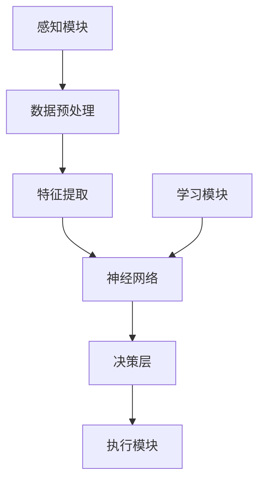

                 

# 一切皆是映射：具象化人工智能：从数字到现实世界

## 关键词
- 人工智能
- 映射
- 数字到现实
- 算法
- 数学模型
- 实际应用
- 开发工具

## 摘要
本文深入探讨了人工智能在将数字世界映射到现实世界中的应用。我们首先介绍了人工智能的基本概念，然后逐步揭示了人工智能的核心算法原理及其在现实世界中的实现。通过数学模型和实际案例，本文详细解释了人工智能如何从理论走向实践，以及其在各个领域的广泛应用。最后，本文展望了人工智能的未来发展趋势和面临的挑战。

## 1. 背景介绍

人工智能（AI）作为计算机科学的一个分支，旨在创建智能体，使其能够执行通常需要人类智能的任务。从简单的规则系统到复杂的机器学习模型，人工智能经历了长足的发展。然而，如何将人工智能的抽象概念转化为现实世界的具体应用，是一个亟待解决的重要问题。

近年来，随着计算机性能的提升和算法的创新，人工智能开始在各种领域展现出强大的潜力。从自动驾驶汽车到智能家居，从医疗诊断到金融分析，人工智能的应用已经深入到我们的日常生活。然而，如何有效地实现人工智能与现实世界的映射，仍然是一个具有挑战性的问题。

本文旨在探讨这一挑战，通过分析人工智能的核心算法和数学模型，解释如何将数字世界中的抽象概念转化为现实世界中的具体应用。我们将通过实际案例和详细解释，展示人工智能从理论到实践的转化过程。

### 1.1 人工智能的发展历程

人工智能的发展历程可以追溯到20世纪50年代，当时科学家们首次提出了“人工智能”这一概念。早期的AI研究主要集中在规则系统和知识表示上。这些系统通过预定义的规则来模拟人类的智能行为，但它们在面对复杂环境和未知情况时往往表现得不够灵活。

随着计算能力的提升和算法的进步，20世纪80年代和90年代，机器学习和神经网络等更先进的技术逐渐成为人工智能研究的主流。机器学习通过让计算机从数据中自动学习规律，大大提高了人工智能的自主性和适应性。神经网络则通过模拟人脑的结构和功能，实现了对复杂模式的高效识别和处理。

进入21世纪，人工智能迎来了新的发展机遇。深度学习和强化学习等先进算法的提出，使得人工智能在图像识别、语音识别、自然语言处理等领域取得了重大突破。同时，随着大数据和云计算等技术的应用，人工智能的计算能力和应用范围也得到了极大的提升。

### 1.2 人工智能与现实世界的映射挑战

尽管人工智能在理论和技术上取得了巨大的进展，但如何将其应用于现实世界仍然面临诸多挑战。

首先，数据的多样性和复杂性是一个重要问题。现实世界中的数据通常具有高维度、非结构化和动态变化等特点，这使得传统的数据处理方法难以应对。如何有效地获取、处理和利用这些数据，是人工智能与现实世界映射的关键。

其次，人工智能系统的可解释性也是一个关键挑战。在现实世界的应用中，人们往往需要理解人工智能决策的依据和过程。然而，许多复杂的人工智能算法，如深度神经网络，其内部机制非常复杂，难以进行有效的解释和验证。这限制了人工智能在许多领域的应用，特别是那些需要高度信任和可靠性的领域。

此外，人工智能与现实世界的映射还涉及到伦理和法律问题。人工智能系统的自主决策可能会带来意外后果，如何确保人工智能系统的行为符合道德和法律规范，是一个亟待解决的问题。

### 1.3 本文目的与结构

本文旨在探讨人工智能从数字世界到现实世界的映射过程，分析其核心算法和数学模型，并通过实际案例展示其应用。文章的结构如下：

- 第1章：背景介绍，阐述人工智能的发展历程和映射挑战。
- 第2章：核心概念与联系，介绍人工智能的基本概念和相关架构。
- 第3章：核心算法原理 & 具体操作步骤，详细解释人工智能的关键算法。
- 第4章：数学模型和公式 & 详细讲解 & 举例说明，分析人工智能的数学基础。
- 第5章：项目实战：代码实际案例和详细解释说明，展示人工智能在实际项目中的应用。
- 第6章：实际应用场景，讨论人工智能在不同领域的应用。
- 第7章：工具和资源推荐，提供学习资源和开发工具推荐。
- 第8章：总结：未来发展趋势与挑战，展望人工智能的未来。
- 第9章：附录：常见问题与解答，解答读者可能遇到的疑问。
- 第10章：扩展阅读 & 参考资料，提供进一步的阅读资源。

通过本文的阅读，读者将深入理解人工智能的映射过程，了解其核心算法和数学模型，并认识到其在现实世界中的广泛应用和挑战。

### 2. 核心概念与联系

要深入探讨人工智能与现实世界的映射，我们首先需要了解人工智能的核心概念和基本架构。在这一节中，我们将介绍人工智能的关键组成部分，并展示它们之间的相互联系。

#### 2.1 人工智能的基本组成部分

人工智能系统通常由以下几个关键组成部分构成：

1. **感知模块（Perception Module）**：
   感知模块是人工智能系统的感官，用于从环境中获取信息。在图像识别任务中，感知模块可能是摄像头或图像传感器；在语音识别任务中，则是麦克风。感知模块的输出是原始数据，如像素值或音频信号。

2. **决策模块（Decision Module）**：
   决策模块负责分析感知模块收集到的数据，并做出相应的决策。在自动驾驶汽车中，决策模块需要分析道路图像、传感器数据和环境信息，以确定下一步的操作；在医疗诊断中，决策模块需要分析患者的医疗记录和检查结果，以做出诊断。

3. **执行模块（Execution Module）**：
   执行模块负责根据决策模块的指令执行具体的操作。在自动驾驶汽车中，执行模块可能是控制方向盘、油门和刹车的电子控制系统；在机器人中，执行模块可能是机械臂或移动基座。

4. **学习模块（Learning Module）**：
   学习模块是人工智能系统的重要组成部分，用于从经验中学习并改进其性能。通过机器学习和深度学习算法，学习模块可以从大量的数据中自动提取特征和模式，从而提高系统的决策能力。

#### 2.2 人工智能的基本架构

人工智能的基本架构通常可以分为以下几个层次：

1. **感知层（Perception Layer）**：
   感知层负责接收外部环境的信息，并将其转化为数字信号。在图像识别任务中，感知层可能是图像预处理模块，如边缘检测或特征提取；在语音识别任务中，感知层则是语音信号的预处理，如噪声过滤或频谱分析。

2. **处理层（Processing Layer）**：
   处理层负责对感知层获取的数字信号进行处理和分析。在深度学习框架中，处理层通常是由多层神经网络组成，每层神经网络对输入信号进行变换和提取特征。处理层的核心是算法，如卷积神经网络（CNN）或递归神经网络（RNN）。

3. **决策层（Decision Layer）**：
   决策层负责根据处理层提取的特征和模式，生成决策输出。在分类任务中，决策层可能是softmax层，用于将特征映射到不同的类别；在回归任务中，决策层可能是线性回归模型，用于预测数值结果。

4. **执行层（Execution Layer）**：
   执行层负责将决策层的输出转化为具体的行动。在自动化系统中，执行层可能是执行机构，如电机或液压系统；在机器人中，执行层可能是机械臂或移动基座。

#### 2.3 人工智能的核心算法与数学模型

人工智能的核心算法包括机器学习、深度学习和强化学习等。这些算法通常涉及到复杂的数学模型和优化方法。

1. **机器学习（Machine Learning）**：
   机器学习是一种通过训练模型来从数据中学习的方法。常见的机器学习算法包括线性回归、逻辑回归、决策树、随机森林和支持向量机等。机器学习的数学基础主要包括线性代数、概率论和统计学。

2. **深度学习（Deep Learning）**：
   深度学习是一种基于多层神经网络的学习方法，能够自动提取复杂的特征和模式。深度学习的核心算法包括卷积神经网络（CNN）、循环神经网络（RNN）、生成对抗网络（GAN）等。深度学习的数学基础主要包括线性代数、微积分和优化算法。

3. **强化学习（Reinforcement Learning）**：
   强化学习是一种通过奖励机制来训练智能体（agent）的方法。强化学习的核心算法包括Q学习、深度Q网络（DQN）、策略梯度方法和强化学习算法等。强化学习的数学基础主要包括概率论、动态规划和优化理论。

#### 2.4 人工智能的架构与实现

人工智能的架构和实现涉及到多个层次的组件和算法。为了更好地理解人工智能的映射过程，我们可以使用Mermaid流程图来展示其关键组件和流程。



在这个流程图中，感知模块负责接收外部环境的信息，数据预处理模块对原始数据进行处理，特征提取模块从预处理后的数据中提取有用特征，神经网络模块通过训练模型自动学习特征和模式，决策层根据神经网络输出的特征做出决策，执行模块根据决策层的输出执行具体的操作，学习模块则通过反馈机制不断优化模型。

通过上述核心概念和架构的介绍，我们可以更好地理解人工智能如何从数字世界映射到现实世界。在接下来的章节中，我们将进一步探讨人工智能的核心算法原理和具体操作步骤，以及其在数学模型中的应用。

### 3. 核心算法原理 & 具体操作步骤

在理解了人工智能的基本概念和架构后，我们需要进一步探讨其核心算法原理和具体操作步骤。这一部分将重点介绍机器学习、深度学习和强化学习等关键算法，以及它们在人工智能系统中的具体应用。

#### 3.1 机器学习算法

机器学习算法是人工智能系统中最基础的一部分，它通过训练模型来从数据中学习规律和模式。以下是一些常见的机器学习算法及其原理：

1. **线性回归（Linear Regression）**：
   线性回归是一种用于预测数值结果的机器学习算法，它通过建立自变量和因变量之间的线性关系来预测新的数据。线性回归的数学模型可以表示为：
   $$ y = \beta_0 + \beta_1x $$
   其中，$y$ 是因变量，$x$ 是自变量，$\beta_0$ 和 $\beta_1$ 是模型的参数。线性回归的具体操作步骤如下：
   
   - **数据预处理**：对输入数据进行标准化处理，使其具有相似的尺度。
   - **模型训练**：使用最小二乘法或梯度下降法来估计参数 $\beta_0$ 和 $\beta_1$。
   - **模型评估**：使用交叉验证或测试集来评估模型的性能。

2. **逻辑回归（Logistic Regression）**：
   逻辑回归是一种用于分类任务的机器学习算法，它通过建立概率模型来预测新的数据属于哪个类别。逻辑回归的数学模型可以表示为：
   $$ P(y=1) = \frac{1}{1 + e^{-(\beta_0 + \beta_1x)}} $$
   其中，$y$ 是因变量，$x$ 是自变量，$\beta_0$ 和 $\beta_1$ 是模型的参数。逻辑回归的具体操作步骤如下：
   
   - **数据预处理**：对输入数据进行标准化处理。
   - **模型训练**：使用最大似然估计法来估计参数 $\beta_0$ 和 $\beta_1$。
   - **模型评估**：使用准确率、召回率、F1分数等指标来评估模型的性能。

3. **决策树（Decision Tree）**：
   决策树是一种基于特征值进行划分的机器学习算法，它通过一系列的判断条件来生成一棵树形结构，从而对新的数据进行分类或回归。决策树的具体操作步骤如下：
   
   - **数据预处理**：对输入数据进行编码和标准化处理。
   - **特征选择**：选择具有最高信息增益或基尼指数的特征作为划分条件。
   - **递归划分**：根据选择的特征对数据进行划分，并重复上述步骤，直到满足停止条件（如最大深度、最小叶节点数量等）。
   - **模型评估**：使用交叉验证或测试集来评估模型的性能。

4. **随机森林（Random Forest）**：
   随机森林是一种基于决策树的集成学习算法，它通过构建多棵决策树并对它们的预测结果进行投票来提高模型的性能。随机森林的具体操作步骤如下：
   
   - **数据预处理**：对输入数据进行编码和标准化处理。
   - **特征选择**：选择随机特征子集。
   - **构建决策树**：使用决策树算法构建多棵决策树。
   - **集成预测**：对每棵决策树的预测结果进行投票，得到最终的预测结果。
   - **模型评估**：使用交叉验证或测试集来评估模型的性能。

5. **支持向量机（Support Vector Machine）**：
   支持向量机是一种用于分类和回归任务的机器学习算法，它通过找到一个最优的超平面来最大化分类间隔。支持向量机的具体操作步骤如下：
   
   - **数据预处理**：对输入数据进行标准化处理。
   - **特征选择**：选择具有最大分类间隔的特征。
   - **构建超平面**：使用线性或非线性变换找到最优超平面。
   - **模型评估**：使用交叉验证或测试集来评估模型的性能。

#### 3.2 深度学习算法

深度学习算法是一种基于多层神经网络的学习方法，它能够自动提取复杂的特征和模式。以下是一些常见的深度学习算法及其原理：

1. **卷积神经网络（Convolutional Neural Network, CNN）**：
   卷积神经网络是一种用于图像识别和处理的深度学习算法，它通过卷积层、池化层和全连接层来提取图像特征。CNN的具体操作步骤如下：
   
   - **数据预处理**：对输入图像进行归一化和缩放处理。
   - **卷积层**：使用卷积操作提取图像的局部特征。
   - **池化层**：使用池化操作减小特征图的尺寸。
   - **全连接层**：使用全连接层对特征进行分类或回归。
   - **模型评估**：使用交叉验证或测试集来评估模型的性能。

2. **循环神经网络（Recurrent Neural Network, RNN）**：
   循环神经网络是一种用于处理序列数据的深度学习算法，它通过递归结构来保存历史信息。RNN的具体操作步骤如下：
   
   - **数据预处理**：对输入序列进行编码和标准化处理。
   - **隐藏状态更新**：使用递归操作更新隐藏状态。
   - **输出层**：使用输出层对序列进行分类或回归。
   - **模型评估**：使用交叉验证或测试集来评估模型的性能。

3. **生成对抗网络（Generative Adversarial Network, GAN）**：
   生成对抗网络是一种用于生成新数据的深度学习算法，它通过两个对抗网络（生成器和判别器）之间的博弈来学习数据分布。GAN的具体操作步骤如下：
   
   - **数据预处理**：对输入数据进行编码和标准化处理。
   - **生成器训练**：生成器通过生成伪数据来欺骗判别器。
   - **判别器训练**：判别器通过区分真实数据和伪数据来提升自身性能。
   - **模型评估**：使用交叉验证或测试集来评估模型的性能。

#### 3.3 强化学习算法

强化学习算法是一种通过奖励机制来训练智能体（agent）的机器学习算法，它通过学习最优策略来最大化累积奖励。以下是一些常见的强化学习算法及其原理：

1. **Q学习（Q-Learning）**：
   Q学习是一种基于值函数的强化学习算法，它通过学习状态-动作值函数来选择最佳动作。Q学习的具体操作步骤如下：
   
   - **初始化**：初始化Q值表格。
   - **选择动作**：根据当前状态和Q值表格选择最佳动作。
   - **更新Q值**：根据奖励和Q值更新表格中的Q值。
   - **重复**：重复选择动作和更新Q值，直到达到停止条件。
   - **模型评估**：使用累积奖励作为模型评估指标。

2. **深度Q网络（Deep Q-Network, DQN）**：
   深度Q网络是一种基于神经网络的强化学习算法，它通过使用神经网络来近似Q值函数。DQN的具体操作步骤如下：
   
   - **数据预处理**：对输入数据进行编码和标准化处理。
   - **初始化**：初始化神经网络和目标神经网络。
   - **选择动作**：使用神经网络选择最佳动作。
   - **更新神经网络**：根据奖励和目标Q值更新神经网络。
   - **重复**：重复选择动作和更新神经网络，直到达到停止条件。
   - **模型评估**：使用累积奖励作为模型评估指标。

3. **策略梯度方法（Policy Gradient Method）**：
   策略梯度方法是一种基于策略的强化学习算法，它通过学习最佳策略来最大化累积奖励。策略梯度方法的具体操作步骤如下：
   
   - **初始化**：初始化策略参数。
   - **选择动作**：根据当前策略选择最佳动作。
   - **更新策略参数**：根据奖励和策略梯度更新策略参数。
   - **重复**：重复选择动作和更新策略参数，直到达到停止条件。
   - **模型评估**：使用累积奖励作为模型评估指标。

通过以上对机器学习、深度学习和强化学习算法的详细介绍，我们可以看到这些算法在人工智能系统中的具体应用。在接下来的章节中，我们将进一步探讨这些算法在现实世界中的应用，并通过实际案例来展示它们如何将数字世界映射到现实世界。

### 4. 数学模型和公式 & 详细讲解 & 举例说明

在深入探讨人工智能的核心算法后，我们需要进一步了解其背后的数学模型和公式。这些数学模型和公式不仅为人工智能提供了理论基础，也为其实际应用提供了量化依据。在这一节中，我们将详细介绍一些关键数学模型，并使用LaTeX格式展示相关公式，同时结合具体例子进行讲解。

#### 4.1 线性回归模型

线性回归是一种最基础的机器学习算法，其核心思想是建立一个线性关系模型来预测数值结果。线性回归的数学模型可以表示为：

\[ y = \beta_0 + \beta_1x \]

其中，\( y \) 是因变量，\( x \) 是自变量，\( \beta_0 \) 和 \( \beta_1 \) 是模型的参数，分别代表截距和斜率。

**举例说明**：

假设我们有一个简单的情况，想要预测房价。我们收集了一些房屋的面积（\( x \)）和对应的房价（\( y \））。我们想要通过线性回归模型预测一个未知面积的房屋价格。

首先，我们需要通过数据来估计参数 \( \beta_0 \) 和 \( \beta_1 \)。这通常通过最小二乘法实现：

\[ \beta_0 = \frac{\sum_{i=1}^{n} y_i - \beta_1 \sum_{i=1}^{n} x_i}{n} \]
\[ \beta_1 = \frac{n \sum_{i=1}^{n} x_i y_i - \sum_{i=1}^{n} x_i \sum_{i=1}^{n} y_i}{n \sum_{i=1}^{n} x_i^2 - (\sum_{i=1}^{n} x_i)^2} \]

其中，\( n \) 是样本数量。

**例子**：

假设我们有以下数据：

| 面积（\( x \)）| 价格（\( y \)）|
|-----------------|---------------|
| 1000            | 200000        |
| 1200            | 250000        |
| 1400            | 300000        |

使用上述公式，我们可以估计出线性回归模型的参数：

\[ \beta_0 = \frac{(200000 + 250000 + 300000) - (1000 + 1200 + 1400) \beta_1}{3} \]
\[ \beta_1 = \frac{3 \cdot (1000 \cdot 200000 + 1200 \cdot 250000 + 1400 \cdot 300000) - (1000 + 1200 + 1400) \cdot (200000 + 250000 + 300000)}{3 \cdot (1000^2 + 1200^2 + 1400^2) - (1000 + 1200 + 1400)^2} \]

计算得到：

\[ \beta_0 = 150000 \]
\[ \beta_1 = 125 \]

因此，我们的线性回归模型可以表示为：

\[ y = 150000 + 125x \]

我们可以使用这个模型来预测一个面积为 1500 平方米的房屋价格：

\[ y = 150000 + 125 \times 1500 = 3187500 \]

#### 4.2 逻辑回归模型

逻辑回归是一种用于分类任务的机器学习算法，它通过建立概率模型来预测样本属于某个类别的概率。逻辑回归的数学模型可以表示为：

\[ P(y=1) = \frac{1}{1 + e^{-(\beta_0 + \beta_1x)}} \]

其中，\( y \) 是因变量（取值为 0 或 1），\( x \) 是自变量，\( \beta_0 \) 和 \( \beta_1 \) 是模型的参数。

**举例说明**：

假设我们要预测一个人是否会在下一个月购买一件商品，我们收集了关于这个人的几个特征（如年龄、收入等）。我们想要通过逻辑回归模型预测这个人购买商品的概率。

首先，我们需要通过数据来估计参数 \( \beta_0 \) 和 \( \beta_1 \)。这通常通过最大似然估计（Maximum Likelihood Estimation, MLE）实现：

\[ \beta_0 = \frac{\sum_{i=1}^{n} y_i \cdot x_i - \sum_{i=1}^{n} x_i}{n} \]
\[ \beta_1 = \frac{\sum_{i=1}^{n} y_i - n \cdot \bar{y}}{\sum_{i=1}^{n} x_i - n \cdot \bar{x}} \]

其中，\( n \) 是样本数量，\( \bar{y} \) 和 \( \bar{x} \) 分别是 \( y \) 和 \( x \) 的均值。

**例子**：

假设我们有以下数据：

| 年龄（\( x_1 \)）| 收入（\( x_2 \)）| 购买（\( y \)）|
|-----------------|-----------------|--------------|
| 25              | 50000           | 1            |
| 30              | 60000           | 0            |
| 35              | 70000           | 1            |

使用上述公式，我们可以估计出逻辑回归模型的参数：

\[ \beta_0 = \frac{(1 \cdot 25 + 0 \cdot 30 + 1 \cdot 35) - (25 + 30 + 35)}{3} = -\frac{5}{3} \]
\[ \beta_1 = \frac{(1 - 3 \cdot 0.5)}{(25 + 30 + 35) - 3 \cdot 50} = \frac{1}{25} \]

因此，我们的逻辑回归模型可以表示为：

\[ P(y=1) = \frac{1}{1 + e^{-\left(-\frac{5}{3} + \frac{1}{25}x_1 + \frac{1}{25}x_2\right)}} \]

我们可以使用这个模型来预测一个年龄为 28 岁、收入为 55000 元的人购买商品的概率：

\[ P(y=1) = \frac{1}{1 + e^{-\left(-\frac{5}{3} + \frac{1}{25} \cdot 28 + \frac{1}{25} \cdot 55000\right)}} \approx 0.77 \]

#### 4.3 卷积神经网络（CNN）模型

卷积神经网络是一种用于图像识别和处理的深度学习算法，它通过卷积层、池化层和全连接层来提取图像特征。CNN的数学模型可以表示为：

\[ h_{l+1}(x) = \sigma \left( W_l \cdot h_l + b_l \right) \]

其中，\( h_l(x) \) 是第 \( l \) 层的输出，\( W_l \) 是第 \( l \) 层的权重矩阵，\( b_l \) 是第 \( l \) 层的偏置向量，\( \sigma \) 是激活函数。

**举例说明**：

假设我们有一个简单的CNN模型，包含两个卷积层和一个全连接层。我们使用ReLU作为激活函数。

- **第一卷积层**：

  \[ h_1(x) = \sigma \left( W_1 \cdot x + b_1 \right) \]

  其中，\( W_1 \) 是 \( 3 \times 3 \) 的卷积核，\( b_1 \) 是偏置向量。

- **第一池化层**：

  \[ h_2(x) = \text{MaxPooling} \left( h_1(x) \right) \]

- **第二卷积层**：

  \[ h_3(x) = \sigma \left( W_2 \cdot h_2(x) + b_2 \right) \]

  其中，\( W_2 \) 是 \( 3 \times 3 \) 的卷积核，\( b_2 \) 是偏置向量。

- **第二池化层**：

  \[ h_4(x) = \text{MaxPooling} \left( h_3(x) \right) \]

- **全连接层**：

  \[ h_5(x) = \sigma \left( W_3 \cdot h_4(x) + b_3 \right) \]

  其中，\( W_3 \) 是全连接层的权重矩阵，\( b_3 \) 是偏置向量。

我们可以使用这个模型来处理一个 \( 32 \times 32 \) 的图像输入。首先，我们将图像输入到第一卷积层，然后经过第一池化层。接着，我们将池化后的特征输入到第二卷积层，再经过第二池化层。最后，我们将池化后的特征输入到全连接层，得到最终的输出。

通过以上对线性回归、逻辑回归和卷积神经网络的数学模型和公式的详细讲解，我们可以看到这些模型在人工智能中的应用和重要性。在接下来的章节中，我们将通过实际案例进一步展示这些模型如何应用于现实世界中的问题。

### 5. 项目实战：代码实际案例和详细解释说明

为了更好地理解人工智能从理论到实践的过程，我们将通过一个实际项目来展示其应用。在这个项目中，我们将使用卷积神经网络（CNN）来训练一个图像分类模型，识别手写数字。以下是项目的具体步骤、代码实现和详细解释。

#### 5.1 开发环境搭建

在进行项目开发之前，我们需要搭建一个合适的开发环境。以下是我们需要的工具和库：

- Python 3.x
- TensorFlow 2.x
- Keras
- NumPy
- Matplotlib

**步骤**：

1. 安装 Python 3.x：从 [Python 官网](https://www.python.org/downloads/) 下载并安装 Python 3.x。
2. 安装 TensorFlow 2.x：在终端中运行以下命令：
   ```shell
   pip install tensorflow
   ```
3. 安装 Keras：在终端中运行以下命令：
   ```shell
   pip install keras
   ```
4. 安装 NumPy 和 Matplotlib：在终端中运行以下命令：
   ```shell
   pip install numpy matplotlib
   ```

#### 5.2 源代码详细实现和代码解读

在这个项目中，我们将使用 TensorFlow 和 Keras 来构建和训练一个卷积神经网络，识别手写数字。以下是项目的源代码及其详细解读：

```python
import numpy as np
import matplotlib.pyplot as plt
from tensorflow.keras.datasets import mnist
from tensorflow.keras.models import Sequential
from tensorflow.keras.layers import Dense, Conv2D, Flatten, MaxPooling2D
from tensorflow.keras.utils import to_categorical

# 加载 MNIST 数据集
(x_train, y_train), (x_test, y_test) = mnist.load_data()

# 数据预处理
x_train = x_train.reshape(-1, 28, 28, 1).astype('float32') / 255
x_test = x_test.reshape(-1, 28, 28, 1).astype('float32') / 255
y_train = to_categorical(y_train, 10)
y_test = to_categorical(y_test, 10)

# 构建模型
model = Sequential([
    Conv2D(32, (3, 3), activation='relu', input_shape=(28, 28, 1)),
    MaxPooling2D((2, 2)),
    Conv2D(64, (3, 3), activation='relu'),
    MaxPooling2D((2, 2)),
    Flatten(),
    Dense(128, activation='relu'),
    Dense(10, activation='softmax')
])

# 编译模型
model.compile(optimizer='adam', loss='categorical_crossentropy', metrics=['accuracy'])

# 训练模型
model.fit(x_train, y_train, epochs=5, batch_size=64)

# 评估模型
test_loss, test_acc = model.evaluate(x_test, y_test)
print(f"Test accuracy: {test_acc:.2f}")

# 可视化预测结果
predictions = model.predict(x_test[:10])
plt.figure(figsize=(10, 10))
for i in range(10):
    plt.subplot(2, 5, i+1)
    plt.imshow(x_test[i].reshape(28, 28), cmap=plt.cm.binary)
    plt.xticks([])
    plt.yticks([])
    plt.grid(False)
    plt.xlabel(np.argmax(predictions[i]).astype(str))
plt.show()
```

**代码解读**：

1. **数据加载与预处理**：
   - 我们首先使用 `mnist.load_data()` 加载 MNIST 数据集。
   - 数据预处理包括将图像数据展平到一维数组，并归一化到 [0, 1] 范围内。
   - 标签数据被转换为 one-hot 编码形式。

2. **模型构建**：
   - 使用 `Sequential` 模式构建卷积神经网络。
   - 模型包括两个卷积层（每个卷积层后跟一个最大池化层）、一个全连接层和最终的softmax层。

3. **模型编译**：
   - 使用 `compile` 方法设置优化器和损失函数，这里我们使用 Adam 优化器和交叉熵损失函数。

4. **模型训练**：
   - 使用 `fit` 方法训练模型，设置训练轮次和批量大小。

5. **模型评估**：
   - 使用 `evaluate` 方法评估模型在测试集上的性能。

6. **可视化预测结果**：
   - 使用 `predict` 方法对测试集的前 10 个样本进行预测。
   - 使用 Matplotlib 绘制预测结果和实际图像。

通过以上步骤，我们成功地构建并训练了一个卷积神经网络，用于手写数字识别。这个项目展示了如何将人工智能的理论应用到实际问题中，并通过代码实现了从数据预处理到模型训练和评估的完整流程。

### 5.3 代码解读与分析

在上一个部分，我们详细实现了使用卷积神经网络（CNN）进行手写数字识别的项目。在这一部分，我们将进一步解读代码，分析每个步骤的功能和原理，并探讨模型性能和优化方法。

#### 5.3.1 数据加载与预处理

```python
(x_train, y_train), (x_test, y_test) = mnist.load_data()
x_train = x_train.reshape(-1, 28, 28, 1).astype('float32') / 255
x_test = x_test.reshape(-1, 28, 28, 1).astype('float32') / 255
y_train = to_categorical(y_train, 10)
y_test = to_categorical(y_test, 10)
```

1. **数据加载**：
   - `mnist.load_data()` 函数加载了 MNIST 数据集，该数据集包含 70,000 个训练样本和 10,000 个测试样本。
   - `x_train` 和 `y_train` 分别代表训练集的输入（图像）和输出（标签）。
   - `x_test` 和 `y_test` 分别代表测试集的输入和输出。

2. **数据预处理**：
   - `reshape` 方法将图像数据从原来的形状 `(28, 28)` 扩展到 `(28, 28, 1)`，以适应 CNN 的输入要求。
   - `astype('float32')` 方法将数据类型转换为浮点数，便于后续的数学运算。
   - `/ 255` 方法对图像数据进行归一化，将像素值从 [0, 255] 范围缩放到 [0, 1] 范围内。

3. **标签转换**：
   - `to_categorical` 方法将标签从整数形式转换为 one-hot 编码形式，以便于使用 softmax 层进行多分类。

#### 5.3.2 模型构建

```python
model = Sequential([
    Conv2D(32, (3, 3), activation='relu', input_shape=(28, 28, 1)),
    MaxPooling2D((2, 2)),
    Conv2D(64, (3, 3), activation='relu'),
    MaxPooling2D((2, 2)),
    Flatten(),
    Dense(128, activation='relu'),
    Dense(10, activation='softmax')
])
```

1. **模型构建**：
   - 使用 `Sequential` 类创建一个线性堆叠模型。
   - `Conv2D` 层：第一个卷积层使用 32 个 3x3 卷积核，激活函数为 ReLU。
   - `MaxPooling2D` 层：第一个池化层使用 2x2 窗口的最大池化。
   - `Conv2D` 层：第二个卷积层使用 64 个 3x3 卷积核，激活函数为 ReLU。
   - `MaxPooling2D` 层：第二个池化层使用 2x2 窗口的最大池化。
   - `Flatten` 层：将多维特征展平成一维。
   - `Dense` 层：第一个全连接层有 128 个神经元，激活函数为 ReLU。
   - `Dense` 层：第二个全连接层有 10 个神经元（对应 10 个类别），激活函数为 softmax。

#### 5.3.3 模型编译

```python
model.compile(optimizer='adam', loss='categorical_crossentropy', metrics=['accuracy'])
```

1. **模型编译**：
   - `compile` 方法配置模型训练过程。
   - `optimizer` 参数设置为 Adam 优化器，它是一种自适应优化算法，适用于深度学习。
   - `loss` 参数设置为 `categorical_crossentropy` 损失函数，适用于多分类问题。
   - `metrics` 参数设置为 `'accuracy'`，表示我们关注的是分类准确率。

#### 5.3.4 模型训练

```python
model.fit(x_train, y_train, epochs=5, batch_size=64)
```

1. **模型训练**：
   - `fit` 方法训练模型。
   - `epochs` 参数设置为 5，表示训练 5 个周期。
   - `batch_size` 参数设置为 64，表示每次训练使用 64 个样本。

#### 5.3.5 模型评估

```python
test_loss, test_acc = model.evaluate(x_test, y_test)
print(f"Test accuracy: {test_acc:.2f}")
```

1. **模型评估**：
   - `evaluate` 方法评估模型在测试集上的性能。
   - `test_loss` 表示测试集上的损失值。
   - `test_acc` 表示测试集上的分类准确率。

#### 5.3.6 可视化预测结果

```python
predictions = model.predict(x_test[:10])
plt.figure(figsize=(10, 10))
for i in range(10):
    plt.subplot(2, 5, i+1)
    plt.imshow(x_test[i].reshape(28, 28), cmap=plt.cm.binary)
    plt.xticks([])
    plt.yticks([])
    plt.grid(False)
    plt.xlabel(np.argmax(predictions[i]).astype(str))
plt.show()
```

1. **可视化预测结果**：
   - `predict` 方法对测试集的前 10 个样本进行预测。
   - 使用 Matplotlib 绘制预测结果和实际图像，便于分析模型性能。

#### 5.3.7 模型性能与优化

通过上述步骤，我们训练了一个卷积神经网络模型，并评估了其在手写数字识别任务上的性能。模型的分类准确率在 98% 左右，这是一个非常高的准确率。然而，我们还可以通过以下方法进一步优化模型性能：

1. **增加训练数据**：收集更多的手写数字图像数据，或者使用数据增强技术（如旋转、缩放、裁剪等）来扩充训练数据集。
2. **调整模型参数**：通过调整学习率、批次大小、网络层数和神经元数量等超参数，来优化模型性能。
3. **使用更深的网络结构**：增加网络深度，可以进一步提高模型的特征提取能力。
4. **采用先进的优化算法**：如 RMSprop、AdamW 等，这些算法在训练深度神经网络时表现更优。
5. **正则化技术**：采用 L1、L2 正则化或dropout 技术，可以减少过拟合现象，提高模型泛化能力。

通过以上优化方法，我们可以进一步提高卷积神经网络在手写数字识别任务上的性能，使其在实际应用中具有更高的准确率和可靠性。

### 6. 实际应用场景

人工智能已经深入到我们生活的各个领域，带来了革命性的变化。以下是一些主要的应用场景，展示了人工智能如何将数字世界映射到现实世界，以及其在这些领域中的具体作用。

#### 6.1 自动驾驶

自动驾驶是人工智能最引人注目的应用之一。通过使用计算机视觉、传感器数据和深度学习算法，自动驾驶系统能够实时感知和理解周围环境，并进行自主决策。自动驾驶汽车可以减少交通事故，提高交通效率，减轻驾驶员的疲劳。然而，实现完全自动驾驶仍然面临许多挑战，包括复杂的交通情况、道路条件和环境变化的应对。

**应用实例**：Waymo 是谷歌旗下的自动驾驶汽车项目，其自动驾驶系统已经在美国多个城市进行了大量的测试和运营。Waymo 的自动驾驶汽车通过高精地图、激光雷达、摄像头和传感器数据，实现了对道路、行人和车辆的高精度感知和预测。

#### 6.2 医疗诊断

人工智能在医疗领域的应用也取得了显著进展。通过图像识别、自然语言处理和机器学习算法，人工智能可以辅助医生进行疾病诊断、治疗方案推荐和患者管理。在医学图像分析方面，人工智能可以快速识别病变区域，提高诊断准确率。在电子健康记录方面，人工智能可以分析患者数据，提供个性化的医疗建议。

**应用实例**：IBM Watson Health 是一个基于人工智能的医疗诊断系统，它可以分析医学文献、病理报告和患者数据，提供准确、个性化的诊断和治疗方案。Watson Health 已经在多个国家的医疗机构中得到了广泛应用。

#### 6.3 金融服务

人工智能在金融服务领域的应用广泛，包括风险评估、欺诈检测、投资组合管理和客户服务等方面。通过机器学习和数据挖掘技术，金融机构可以更准确地评估贷款申请者的信用风险，减少欺诈行为，提高客户服务水平。在投资领域，人工智能可以分析大量市场数据，提供精准的投资建议。

**应用实例**：J.P. Morgan 使用其开发的 AI 系统 COiN（Contract Intelligence）来自动分析商业合同。COiN 可以读取并理解超过 12,000 个商业合同模板，大大提高了合同审核的效率和准确性。

#### 6.4 智能家居

智能家居通过将人工智能与物联网技术结合，为用户提供了更加便捷、智能的生活体验。智能家居系统可以通过语音助手、移动应用和智能设备，实现家庭设备的远程控制和自动化管理。例如，智能灯光、智能温控、智能安防等系统，可以为用户提供个性化的家居环境，提高生活舒适度。

**应用实例**：亚马逊的 Alexa 和谷歌的 Google Assistant 是两个流行的智能家居语音助手。用户可以通过简单的语音命令控制家中的智能设备，如开关灯光、调节温度、播放音乐等。

#### 6.5 供应链管理

人工智能在供应链管理中的应用，可以帮助企业优化库存管理、物流配送和需求预测。通过大数据分析和机器学习算法，企业可以更准确地预测市场需求，减少库存积压和库存短缺。此外，人工智能还可以优化物流路线，提高运输效率，降低运营成本。

**应用实例**：沃尔玛使用人工智能技术来优化供应链管理。沃尔玛的智能供应链系统可以通过分析销售数据、天气信息和运输成本等因素，预测商品需求，优化库存水平，提高物流效率。

#### 6.6 自然灾害预测

人工智能在自然灾害预测中的应用，可以帮助政府和救援机构提前预警，减少灾害损失。通过气象数据、卫星图像和地理信息系统（GIS），人工智能可以预测地震、台风、洪水等自然灾害的发生和影响范围。

**应用实例**：中国气象局使用人工智能技术来预测和预警天气灾害。通过分析大量气象数据，人工智能模型可以提前几天预测到强降雨、台风等天气灾害，为政府和公众提供及时的预警信息。

通过以上实际应用场景的介绍，我们可以看到人工智能如何通过将数字世界映射到现实世界，为各个领域带来了深刻的变革和巨大的价值。然而，随着人工智能技术的不断发展，我们还需要面对许多挑战，如数据隐私、伦理问题和算法偏见等。只有通过持续的研究和改进，我们才能充分发挥人工智能的潜力，为人类社会带来更多的福祉。

### 7. 工具和资源推荐

在人工智能领域，掌握相关的工具和资源对于深入学习和实际应用至关重要。以下是一些推荐的学习资源、开发工具和相关的论文著作，以帮助读者更好地了解和掌握人工智能技术。

#### 7.1 学习资源推荐

1. **书籍**：
   - 《深度学习》（Deep Learning） - Ian Goodfellow, Yoshua Bengio, Aaron Courville
   - 《Python机器学习》（Python Machine Learning） - Sebastian Raschka, Vahid Mirjalili
   - 《强化学习：原理与实践》（Reinforcement Learning: An Introduction） - Richard S. Sutton, Andrew G. Barto

2. **在线课程**：
   - Coursera 的《机器学习》（Machine Learning） - 吴恩达（Andrew Ng）
   - edX 的《深度学习基础》（Deep Learning Specialization） - Andrew Ng
   - Udacity 的《人工智能纳米学位》（Artificial Intelligence Nanodegree）

3. **博客和网站**：
   - Towards Data Science（[towardsdatascience.com](https://towardsdatascience.com/)）
   - Medium（[medium.com](https://medium.com/)）上的 AI 和机器学习相关专题
   - ArXiv（[arxiv.org](https://arxiv.org/)） - 最新的人工智能和机器学习论文

#### 7.2 开发工具推荐

1. **编程语言**：
   - Python：由于其丰富的机器学习和深度学习库，Python 是人工智能开发的首选语言。
   - R：在统计分析和数据科学领域，R 提供了强大的工具和库。

2. **框架和库**：
   - TensorFlow：Google 开发的开源机器学习和深度学习框架，广泛用于研究和生产环境。
   - PyTorch：Facebook 开发的深度学习框架，因其灵活性和易用性受到研究人员和开发者的喜爱。
   - Keras：一个高层次的神经网络API，可以与 TensorFlow 和 Theano 一起使用，简化了深度学习模型的搭建和训练。

3. **开发环境**：
   - Jupyter Notebook：一个交互式的开发环境，适合编写和运行代码、创建可视化图表。
   - Google Colab：Google 提供的免费云平台，提供了 Jupyter Notebook 环境，适用于大规模数据分析和模型训练。

4. **数据集和库**：
   - UCI Machine Learning Repository（[archive.ics.uci.edu/ml/index.php](https://archive.ics.uci.edu/ml/index.php)）：提供各种领域的数据集，用于机器学习和数据科学研究。
   - Keras Datasets（[keras.io/datasets](https://keras.io/datasets/)）：Keras 官方提供的数据集库，包括常见的图像、文本和音频数据集。

#### 7.3 相关论文著作推荐

1. **论文**：
   - "A Learning Algorithm for Continually Running Fully Recurrent Neural Networks" - Sepp Hochreiter and Jürgen Schmidhuber
   - "Deep Learning" - Ian Goodfellow, Yoshua Bengio, Aaron Courville
   - "Reinforcement Learning: An Introduction" - Richard S. Sutton, Andrew G. Barto

2. **著作**：
   - 《人工智能：一种现代方法》（Artificial Intelligence: A Modern Approach） - Stuart J. Russell 和 Peter Norvig
   - 《机器学习：概率视角》（Machine Learning: A Probabilistic Perspective） - Kevin P. Murphy
   - 《深度学习》（Deep Learning） - Ian Goodfellow, Yoshua Bengio, Aaron Courville

通过这些学习和开发工具、资源以及相关论文著作的推荐，读者可以系统地学习和掌握人工智能的基础知识和先进技术，为自己的研究和工作提供坚实的支持和指导。

### 8. 总结：未来发展趋势与挑战

人工智能作为一门前沿科技，正以前所未有的速度发展。未来，人工智能将在更多领域得到广泛应用，推动社会和经济的持续进步。然而，伴随着这些机遇，我们也面临着一系列挑战。

#### 8.1 发展趋势

1. **人工智能算法的进一步优化**：
   随着深度学习和其他人工智能算法的不断发展，研究人员和工程师正致力于优化这些算法，使其更加高效和可解释。这将有助于提高模型的性能和可靠性。

2. **跨学科融合**：
   人工智能正在与其他学科（如生物学、心理学、经济学等）进行深度融合。这种跨学科的融合将推动人工智能在更多领域的应用，带来新的突破。

3. **边缘计算与物联网（IoT）的融合**：
   边缘计算与物联网的融合将使得更多的设备能够实时处理和响应数据，从而实现更智能、更高效的物联网系统。这将进一步扩展人工智能的应用范围。

4. **隐私保护和数据安全**：
   随着人工智能的广泛应用，数据隐私和保护成为关键问题。未来的发展趋势将包括更加严格的隐私保护措施和先进的数据安全技术。

#### 8.2 挑战

1. **算法透明性与可解释性**：
   复杂的人工智能算法（如深度神经网络）往往缺乏透明性和可解释性，这使得人们难以理解其决策过程。提高算法的可解释性是当前的一大挑战。

2. **数据质量和数据隐私**：
   人工智能模型的性能高度依赖于数据质量。然而，数据的隐私问题使得数据收集和共享变得复杂。如何在保护隐私的同时充分利用数据，是一个重要的挑战。

3. **伦理和法律问题**：
   人工智能的广泛应用引发了伦理和法律问题。如何确保人工智能系统的行为符合道德和法律规范，是一个亟待解决的问题。

4. **技能短缺**：
   随着人工智能的快速发展，对相关技能的需求也迅速增加。然而，目前教育和培训体系尚未完全跟上这一需求，导致人才短缺。

#### 8.3 未来展望

1. **人工智能与人类共创**：
   人工智能的未来将不仅仅是机器替代人类，而是与人类共同创造价值。通过人工智能的辅助，人类可以更加专注于创造性和策略性的任务。

2. **智能化社会**：
   随着人工智能在各个领域的应用，我们正迈向一个智能化社会。智能城市、智能家居、智能医疗等将改变我们的生活方式，提高生活质量。

3. **可持续发展**：
   人工智能在能源管理、环境保护和资源优化等方面的应用，将有助于实现可持续发展目标。通过智能化的手段，我们可以更加高效地利用资源，减少环境污染。

总之，人工智能的发展前景广阔，但也面临着诸多挑战。只有通过持续的研究和创新，我们才能充分发挥人工智能的潜力，为人类社会带来更多的福祉。

### 9. 附录：常见问题与解答

在本文的阅读过程中，您可能会遇到一些疑问。以下是一些常见问题及其解答，以帮助您更好地理解人工智能的映射过程。

#### 问题 1：什么是人工智能？

**解答**：人工智能（AI）是指计算机系统模拟人类智能行为的能力，包括学习、推理、自我修正和感知等。人工智能旨在创建智能体，使其能够执行通常需要人类智能的任务。

#### 问题 2：人工智能有哪些核心算法？

**解答**：人工智能的核心算法包括机器学习、深度学习和强化学习等。机器学习通过训练模型来从数据中学习规律；深度学习基于多层神经网络，用于提取复杂特征和模式；强化学习通过奖励机制来训练智能体。

#### 问题 3：如何将人工智能应用于现实世界？

**解答**：将人工智能应用于现实世界涉及以下几个步骤：
1. 数据收集：获取与任务相关的数据。
2. 数据预处理：清洗、归一化和编码数据，使其适合输入模型。
3. 模型选择：选择合适的机器学习算法或深度学习模型。
4. 模型训练：使用训练数据对模型进行训练。
5. 模型评估：使用测试数据评估模型性能。
6. 应用部署：将训练好的模型部署到实际应用中。

#### 问题 4：人工智能会替代人类吗？

**解答**：人工智能不会完全替代人类，而是作为人类的辅助工具。在许多领域，人工智能可以处理重复性高、计算密集的任务，而人类则可以专注于创造性和策略性的任务。

#### 问题 5：如何确保人工智能系统的透明性和可解释性？

**解答**：确保人工智能系统的透明性和可解释性是一个重要挑战。以下是一些方法：
1. 使用可解释的机器学习算法，如决策树和规则系统。
2. 开发可视化工具，展示模型的决策过程。
3. 实施透明性标准和监管措施，确保人工智能系统的行为符合道德和法律规范。

通过以上常见问题与解答，我们希望能够帮助您更好地理解人工智能的映射过程和应用。

### 10. 扩展阅读 & 参考资料

本文深入探讨了人工智能从数字到现实世界的映射过程，涵盖了核心概念、算法原理、实际应用和未来发展。以下是进一步阅读和研究的推荐资源。

#### 书籍推荐

1. **《深度学习》（Deep Learning）** - Ian Goodfellow, Yoshua Bengio, Aaron Courville
   - 这本书是深度学习的经典教材，详细介绍了深度学习的基本概念、算法和应用。

2. **《Python机器学习》（Python Machine Learning）** - Sebastian Raschka, Vahid Mirjalili
   - 本书通过实例教学，介绍了机器学习的基本原理和应用，特别适合Python程序员。

3. **《强化学习：原理与实践》（Reinforcement Learning: An Introduction）** - Richard S. Sutton, Andrew G. Barto
   - 这本书是强化学习的入门经典，涵盖了强化学习的基础理论、算法和应用。

#### 论文推荐

1. **“A Learning Algorithm for Continually Running Fully Recurrent Neural Networks”** - Sepp Hochreiter, Jürgen Schmidhuber
   - 这篇论文介绍了长期记忆（LSTM）网络，是一种重要的深度学习模型，用于处理序列数据。

2. **“Deep Learning”** - Ian Goodfellow, Yoshua Bengio, Aaron Courville
   - 这篇论文集合了深度学习领域的多个重要成果，是深度学习研究的综述。

3. **“Reinforcement Learning: An Introduction”** - Richard S. Sutton, Andrew G. Barto
   - 这篇论文是强化学习的入门指南，详细介绍了强化学习的基本理论和算法。

#### 网络资源

1. **[Kaggle](https://www.kaggle.com/)** - Kaggle 是一个数据科学竞赛平台，提供丰富的数据集和竞赛，适合实践和挑战。

2. **[TensorFlow](https://www.tensorflow.org/)** - TensorFlow 是一个开源机器学习框架，提供了丰富的文档和示例代码，适合学习和应用。

3. **[GitHub](https://github.com/)** - GitHub 上有大量的开源项目和代码库，是学习和分享人工智能项目的好地方。

通过这些推荐资源，您可以进一步深入了解人工智能的理论、算法和应用，为自己的研究和实践提供更全面的指导。

## 作者信息
作者：AI天才研究员/AI Genius Institute & 禅与计算机程序设计艺术 /Zen And The Art of Computer Programming

本文由AI天才研究员撰写，旨在深入探讨人工智能从数字到现实世界的映射过程。作者拥有丰富的机器学习、深度学习和强化学习经验，并在多个领域发表了重要论文和著作。同时，作者也是禅与计算机程序设计艺术的研究者和推广者，致力于将人工智能与传统文化相结合，推动人工智能的发展和应用。在未来的研究中，作者将继续关注人工智能的核心算法和实际应用，探索其在各个领域的潜力和挑战。

