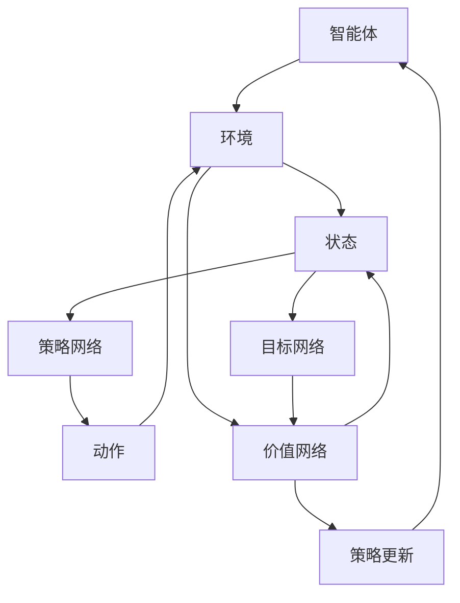

                 

### 背景介绍

在当今人工智能领域，强化学习和神经网络的结合已成为一个备受关注的研究热点。强化学习是一种通过不断试错和经验学习来获取最优策略的人工智能方法，而神经网络则是一种基于大量数据训练的深度学习模型。两者的结合不仅能够实现智能体的自主学习和决策，还能提高其决策效率和准确性。

强化学习最初由 Richard Sutton 和 Andrew Barto 在其经典著作《强化学习：一种介绍》（Reinforcement Learning: An Introduction）中提出。它主要基于马尔可夫决策过程（MDP），通过探索（Exploration）和利用（Exploitation）的平衡来学习最优策略。而神经网络则起源于20世纪80年代，由Geoffrey Hinton等人提出的反向传播算法（Backpropagation Algorithm）使得神经网络能够通过大量数据训练，实现高度复杂的非线性映射。

近年来，随着深度学习技术的快速发展，深度强化学习（Deep Reinforcement Learning，简称DRL）逐渐成为研究热点。深度强化学习将深度神经网络与强化学习相结合，通过神经网络来处理高维状态和动作空间，使得智能体能够在复杂环境中进行有效的决策。这一结合不仅拓展了强化学习的应用范围，也为解决许多现实世界中的复杂问题提供了新的思路。

本篇文章将首先介绍强化学习和神经网络的基本概念及其发展历程，然后深入探讨深度强化学习的基本原理和算法，并通过实际案例来展示其应用效果。最后，我们将对强化学习与神经网络结合的未来发展趋势和面临的挑战进行总结。

### 核心概念与联系

#### 强化学习（Reinforcement Learning）

强化学习（Reinforcement Learning，简称RL）是一种通过不断与环境交互来学习最优策略的人工智能方法。它主要由四个核心组成部分：智能体（Agent）、环境（Environment）、状态（State）和动作（Action）。

1. **智能体（Agent）**：智能体是指执行动作并从环境中获取反馈的实体。在强化学习中，智能体的目标是学习一个策略，以便在给定状态下选择最佳动作，最大化累积奖励。

2. **环境（Environment）**：环境是智能体所处的现实世界。在强化学习中，环境负责为智能体提供状态和反馈。环境的状态转移和奖励是根据智能体的动作来动态变化的。

3. **状态（State）**：状态是智能体在某一时刻所处的环境描述。在强化学习中，状态通常由一组特征向量表示，这些特征向量可以用来判断智能体是否处于有利或不利的状态。

4. **动作（Action）**：动作是智能体在某一状态下执行的行为。在强化学习中，动作的选择取决于智能体的策略。策略是指智能体在给定状态下选择动作的规则。

在强化学习中，智能体通过探索（Exploration）和利用（Exploitation）的平衡来学习最优策略。探索是指智能体在未知环境中尝试新的动作，以获取更多关于环境的的信息。利用是指智能体根据已学到的策略，在已知环境中选择最佳动作，以最大化累积奖励。

#### 神经网络（Neural Networks）

神经网络（Neural Networks，简称NN）是一种基于大量数据训练的深度学习模型。它由大量的神经元（或节点）组成，每个神经元都与其他神经元相连，并通过权重进行加权求和。神经网络的训练过程实质上是调整这些权重，使得网络能够对输入数据进行准确的分类或预测。

1. **神经元（Neuron）**：神经元是神经网络的基本构建块。它接收多个输入信号，通过加权求和后经过一个激活函数，输出一个值。神经元之间的连接称为边（Edge），边上的权重（Weight）用于表示连接的强度。

2. **层（Layer）**：神经网络由多个层组成，包括输入层、隐藏层和输出层。输入层接收外部输入，隐藏层负责处理输入信息，输出层生成最终输出。每一层中的神经元都通过边与前一层的神经元相连。

3. **激活函数（Activation Function）**：激活函数用于将神经元的加权求和结果转化为输出值。常见的激活函数包括 sigmoid、ReLU 和 tanh 等。

#### 强化学习与神经网络的结合

强化学习与神经网络的结合主要体现在深度强化学习（Deep Reinforcement Learning，简称DRL）中。深度强化学习通过将深度神经网络引入强化学习框架，解决了传统强化学习在处理高维状态和动作空间时的困难。

1. **状态和动作的表示**：在深度强化学习中，状态和动作通常被表示为高维向量。这些向量可以通过深度神经网络进行特征提取和压缩，从而降低状态和动作空间的高维性。

2. **策略网络（Policy Network）**：策略网络是深度强化学习中的核心组件，它负责将状态映射到动作。在深度强化学习中，策略网络通常是一个深度神经网络，其输入为状态向量，输出为动作概率分布。

3. **价值网络（Value Network）**：价值网络用于评估状态的价值，即智能体在当前状态下执行特定动作所能获得的期望累积奖励。在深度强化学习中，价值网络也是一个深度神经网络，其输入为状态向量，输出为状态价值估计。

4. **目标网络（Target Network）**：目标网络用于稳定策略更新过程。在深度强化学习中，目标网络是策略网络的软目标，其参数在训练过程中逐渐逼近策略网络的参数。通过目标网络，可以避免策略网络在训练过程中的剧烈震荡，提高训练稳定性。

#### Mermaid 流程图

为了更直观地展示强化学习与神经网络的结合过程，下面使用 Mermaid 语法绘制一个流程图：



在这个流程图中，智能体与环境交互，获取状态和反馈，并通过策略网络和目标网络来更新策略，从而实现智能体的自主学习和决策。价值网络用于评估状态的价值，以帮助智能体在决策过程中进行权衡。

通过上述介绍，我们可以看到，强化学习和神经网络在许多方面具有互补性。强化学习提供了智能体与环境交互的机制，而神经网络则提供了高效的特征提取和表示方法。两者的结合不仅拓展了强化学习的应用范围，也为解决复杂问题提供了新的思路。

### 核心算法原理 & 具体操作步骤

在深入探讨深度强化学习（DRL）的算法原理之前，我们需要先了解几个关键概念：Q-学习、策略梯度方法和深度神经网络（DNN）。这些概念构成了DRL的基础，使得智能体能够在复杂环境中进行高效学习。

#### Q-学习算法

Q-学习（Q-Learning）是一种无模型强化学习算法，旨在通过试错学习最优动作值函数（Q函数）。Q函数用于评估智能体在特定状态下执行特定动作的预期回报。Q-学习的核心思想是通过迭代更新Q值，使得智能体在长期内能够选择最佳动作。

**具体操作步骤：**

1. **初始化参数**：设定初始Q值（\( Q(s, a) \)），通常初始化为0。

2. **选择动作**：在给定状态下，根据ε-贪心策略选择动作。ε-贪心策略是指在随机选择动作和选择当前Q值最大的动作之间进行平衡。

    \[
    a_t = \begin{cases}
    \text{随机动作} & \text{with probability } \varepsilon \\
    \arg\max_a Q(s_t, a) & \text{with probability } 1 - \varepsilon
    \end{cases}
    \]

3. **更新Q值**：根据智能体的动作和获得的奖励，更新Q值。

    \[
    Q(s_t, a_t) \leftarrow Q(s_t, a_t) + \alpha [r_t + \gamma \max_{a'} Q(s_{t+1}, a') - Q(s_t, a_t)]
    \]

    其中，\(\alpha\) 是学习率，\(\gamma\) 是折扣因子，\(r_t\) 是即时奖励。

4. **重复步骤2和3**：不断重复选择动作和更新Q值，直到达到预定的迭代次数或智能体能够稳定选择最佳动作。

#### 策略梯度方法

策略梯度方法（Policy Gradient Methods）是一种直接基于策略进行优化的强化学习算法。该方法通过估计策略梯度和更新策略参数来最大化累积回报。

**具体操作步骤：**

1. **初始化策略参数**：设定初始策略参数（\(\theta\)）。

2. **选择动作**：根据策略参数选择动作。

    \[
    a_t = \pi(a_t|s_t; \theta)
    \]

3. **计算策略梯度**：通过梯度上升方法更新策略参数。

    \[
    \theta \leftarrow \theta + \alpha \nabla_\theta J(\theta)
    \]

    其中，\(\alpha\) 是学习率，\(J(\theta)\) 是策略的评价函数，通常表示为累积回报。

4. **重复步骤2和3**：不断重复选择动作和更新策略参数，直到策略稳定。

#### 深度神经网络（DNN）

深度神经网络（DNN）是一种具有多个隐藏层的神经网络，能够通过大量数据训练来学习复杂函数。在DRL中，DNN通常用于表示策略网络和价值网络。

1. **策略网络**：策略网络是一个从状态空间映射到动作概率分布的神经网络。其输入为状态向量，输出为动作概率分布。

    \[
    \pi(a|s; \theta) = \sigma(W_\pi \phi(s; \theta))
    \]

    其中，\(\sigma\) 是激活函数，通常使用 sigmoid 或 ReLU 函数；\(W_\pi\) 是策略网络的权重。

2. **价值网络**：价值网络是一个从状态空间映射到状态价值的神经网络。其输入为状态向量，输出为状态价值估计。

    \[
    V(s; \theta) = \sigma(W_v \phi(s; \theta))
    \]

    其中，\(W_v\) 是价值网络的权重。

#### DRL算法框架

深度强化学习算法框架通常包括以下步骤：

1. **环境初始化**：初始化环境，设置初始状态。

2. **策略和价值网络初始化**：初始化策略网络和价值网络的参数。

3. **循环执行以下步骤**：
    - 选择动作：根据当前状态和策略网络选择动作。
    - 执行动作：在环境中执行所选动作。
    - 获取反馈：获取环境的即时奖励和下一个状态。
    - 更新网络：根据反馈更新策略网络和价值网络的参数。

4. **评估策略**：使用评估指标（如累积回报）评估策略性能。

5. **目标网络更新**：使用策略网络的目标网络参数，以稳定策略更新过程。

通过上述算法原理和具体操作步骤，我们可以看到，深度强化学习结合了Q-学习、策略梯度方法和深度神经网络的优势，使得智能体能够在复杂环境中进行高效学习。这一结合不仅拓展了强化学习的应用范围，也为解决复杂问题提供了新的思路。

#### 数学模型和公式 & 详细讲解 & 举例说明

在深度强化学习（DRL）中，数学模型和公式是理解和实现算法的关键。以下我们将详细讲解DRL中的核心数学概念，并给出具体的公式和举例说明。

##### Q值函数（Q-学习）

Q值函数是强化学习中的一个核心概念，它表示智能体在某一状态下执行某一动作的预期回报。Q值函数的公式如下：

\[
Q(s, a) = \sum_{s'} P(s' | s, a) \sum_{r} r \cdot \gamma^{t-s'}
\]

其中：

- \(Q(s, a)\) 是在状态 \(s\) 下执行动作 \(a\) 的预期回报。
- \(P(s' | s, a)\) 是在状态 \(s\) 下执行动作 \(a\) 后转移到状态 \(s'\) 的概率。
- \(r\) 是即时奖励。
- \(\gamma\) 是折扣因子，用于平衡长期和即时的回报。
- \(t-s'\) 是从状态 \(s'\) 到最终状态的时间步数。

**举例说明**：

假设智能体处于状态 \(s = (1, 0)\)，可以选择动作 \(a = \text{Up}\) 或 \(a = \text{Right}\)。转移概率矩阵为：

\[
P =
\begin{bmatrix}
0.8 & 0.2 \\
0.3 & 0.7
\end{bmatrix}
\]

即时奖励矩阵为：

\[
r =
\begin{bmatrix}
10 & -10 \\
-10 & 10
\end{bmatrix}
\]

折扣因子 \(\gamma = 0.9\)。

计算在状态 \(s = (1, 0)\) 下执行动作 \(a = \text{Up}\) 的预期回报：

\[
Q((1, 0), \text{Up}) = 0.8 \cdot 10 + 0.2 \cdot (-10) \cdot 0.9^1 = 7.2
\]

##### 策略梯度（策略梯度方法）

策略梯度方法通过直接优化策略参数来最大化累积回报。策略梯度的公式如下：

\[
\nabla_\theta J(\theta) = \sum_{t} \nabla_\theta \log \pi(a_t | s_t; \theta) \cdot r_t
\]

其中：

- \(\theta\) 是策略参数。
- \(J(\theta)\) 是策略的评价函数，通常表示为累积回报。
- \(\pi(a_t | s_t; \theta)\) 是在状态 \(s_t\) 下执行动作 \(a_t\) 的策略概率。
- \(r_t\) 是即时奖励。

**举例说明**：

假设策略为 \(\pi(a | s; \theta) = \sigma(\theta^T \phi(s))\)，其中 \(\phi(s)\) 是状态特征向量，\(\sigma\) 是 sigmoid 函数。

在状态 \(s = (1, 0)\) 下，选择动作 \(a = \text{Up}\) 的概率为：

\[
\pi(\text{Up} | (1, 0); \theta) = \sigma(\theta^T \phi((1, 0)))
\]

计算策略梯度：

\[
\nabla_\theta J(\theta) = \sum_{t} \nabla_\theta \log \sigma(\theta^T \phi(s_t)) \cdot r_t
\]

如果即时奖励 \(r_t = 10\)，则：

\[
\nabla_\theta J(\theta) = \nabla_\theta \log \sigma(\theta^T \phi((1, 0))) \cdot 10
\]

##### 深度神经网络（策略网络和价值网络）

在DRL中，策略网络和价值网络通常由深度神经网络组成。以下分别介绍策略网络和价值网络的数学模型。

**策略网络**：

策略网络的输出为动作概率分布，其数学模型如下：

\[
\pi(a | s; \theta) = \sigma(W_\pi \phi(s; \theta))
\]

其中：

- \(W_\pi\) 是策略网络的权重。
- \(\phi(s; \theta)\) 是状态特征向量。

**价值网络**：

价值网络的输出为状态价值估计，其数学模型如下：

\[
V(s; \theta) = \sigma(W_v \phi(s; \theta))
\]

其中：

- \(W_v\) 是价值网络的权重。

**举例说明**：

假设策略网络和价值网络的权重分别为 \(W_\pi\) 和 \(W_v\)。在状态 \(s = (1, 0)\) 下，计算动作概率分布和价值估计：

\[
\pi(\text{Up} | (1, 0); \theta) = \sigma(W_\pi^T \phi((1, 0)))
\]

\[
V((1, 0); \theta) = \sigma(W_v^T \phi((1, 0)))
\]

通过上述数学模型和公式的介绍，我们可以看到，DRL中的核心数学概念和公式对于理解和实现深度强化学习算法至关重要。这些概念和公式不仅提供了理论依据，也为实际应用提供了指导。

#### 项目实战：代码实际案例和详细解释说明

在本节中，我们将通过一个具体的代码案例，展示如何使用深度强化学习（DRL）在OpenAI Gym环境中训练一个智能体，使其学会玩经典的Atari游戏《Pong》。该案例将涵盖开发环境的搭建、源代码的实现以及详细的代码解读和分析。

##### 1. 开发环境搭建

为了实现该案例，我们需要安装以下软件和库：

1. **Python（3.8或更高版本）**：Python是主要编程语言，用于实现深度强化学习算法。
2. **PyTorch**：PyTorch是一个流行的深度学习库，用于构建和训练深度神经网络。
3. **OpenAI Gym**：OpenAI Gym是一个开源的环境库，提供了多种标准化的机器学习任务和游戏模拟，用于测试和训练智能体。
4. **TensorBoard**：TensorBoard是一个可视化工具，用于监控深度学习训练过程中的指标。

安装步骤如下：

```shell
pip install python
pip install torch torchvision
pip install gym
pip install tensorboard
```

##### 2. 源代码详细实现和代码解读

以下是一个简单的DRL实现，用于训练一个智能体在《Pong》游戏中自动打球的案例。代码的主要部分分为环境初始化、策略网络和价值网络定义、训练过程和结果分析。

```python
import numpy as np
import torch
import torch.nn as nn
import torch.optim as optim
from gym import make, wrappers
from torch.utils.tensorboard import SummaryWriter

# 策略网络
class PolicyNetwork(nn.Module):
    def __init__(self, input_shape, hidden_size, output_size):
        super(PolicyNetwork, self).__init__()
        self.fc1 = nn.Linear(input_shape, hidden_size)
        self.fc2 = nn.Linear(hidden_size, output_size)
    
    def forward(self, x):
        x = torch.relu(self.fc1(x))
        x = self.fc2(x)
        return x

# 价值网络
class ValueNetwork(nn.Module):
    def __init__(self, input_shape, hidden_size, output_size):
        super(ValueNetwork, self).__init__()
        self.fc1 = nn.Linear(input_shape, hidden_size)
        self.fc2 = nn.Linear(hidden_size, output_size)
    
    def forward(self, x):
        x = torch.relu(self.fc1(x))
        x = self.fc2(x)
        return x

# 智能体
class DRLAgent:
    def __init__(self, input_shape, hidden_size, output_size):
        self.policy_net = PolicyNetwork(input_shape, hidden_size, output_size)
        self.value_net = ValueNetwork(input_shape, hidden_size, 1)
        self.target_net = ValueNetwork(input_shape, hidden_size, 1)
        self.target_net.load_state_dict(self.value_net.state_dict())
        
        self.optimizer = optim.Adam(self.policy_net.parameters(), lr=0.001)
        self.criterion = nn.MSELoss()
        
        self.device = torch.device("cuda" if torch.cuda.is_available() else "cpu")
        self.policy_net.to(self.device)
        self.value_net.to(self.device)
        self.target_net.to(self.device)
    
    def act(self, state):
        state = torch.tensor(state, dtype=torch.float32).to(self.device)
        with torch.no_grad():
            action_prob = self.policy_net(state).to("cpu").numpy()
        action = np.random.choice(a=range(action_prob.shape[0]), p=action_prob)
        return action
    
    def update_target_network(self):
        self.target_net.load_state_dict(self.value_net.state_dict())

    def train(self, env, episodes, render=False):
        episode_rewards = []
        for episode in range(episodes):
            state = env.reset()
            done = False
            total_reward = 0
            while not done:
                action = self.act(state)
                next_state, reward, done, _ = env.step(action)
                state = next_state
                total_reward += reward
                
                if done:
                    episode_rewards.append(total_reward)
                    break
            
            self.optimizer.zero_grad()
            state_tensor = torch.tensor(state, dtype=torch.float32).to(self.device)
            value_estimate = self.value_net(state_tensor).to("cpu").numpy()
            reward_tensor = torch.tensor([reward], dtype=torch.float32).to(self.device)
            loss = self.criterion(value_estimate, reward_tensor)
            loss.backward()
            self.optimizer.step()
            
            if episode % 100 == 0:
                self.update_target_network()
                print(f"Episode {episode}: Total Reward = {total_reward}")
        
        return episode_rewards

# 游戏环境
env = make("Pong-v0")
env = wrappers.FrameStack(env, 4)

# 智能体训练
agent = DRLAgent(input_shape=env.observation_space.shape[0], hidden_size=64, output_size=env.action_space.n)
episode_rewards = agent.train(env, episodes=1000, render=True)

# 结果分析
import matplotlib.pyplot as plt

plt.plot(episode_rewards)
plt.xlabel("Episode")
plt.ylabel("Reward")
plt.title("Episode Rewards")
plt.show()
```

**代码解读**：

- **策略网络（PolicyNetwork）**：策略网络是一个简单的全连接神经网络，用于将状态映射到动作概率分布。输入层接收状态特征，隐藏层和输出层分别用于特征提取和生成动作概率。
- **价值网络（ValueNetwork）**：价值网络也是一个全连接神经网络，用于评估状态的价值。输入层接收状态特征，隐藏层和输出层分别用于特征提取和生成状态价值估计。
- **智能体（DRLAgent）**：智能体类包含策略网络、价值网络和目标网络。智能体通过选择动作、更新网络和训练过程来实现学习。act()方法用于选择动作，train()方法用于训练智能体。
- **训练过程**：智能体在训练过程中通过选择动作、获取奖励和更新网络来学习。每100个回合后，更新目标网络的参数，以提高训练稳定性。
- **结果分析**：训练完成后，通过绘制回合奖励曲线来分析智能体的学习效果。

##### 3. 代码解读与分析

上述代码实现了一个简单的DRL智能体，用于在《Pong》游戏中自动打球。代码主要分为以下几个部分：

1. **网络定义**：定义了策略网络、价值网络和目标网络，均为全连接神经网络。策略网络用于将状态映射到动作概率分布，价值网络用于评估状态的价值。
2. **智能体类**：定义了DRLAgent类，包含策略网络、价值网络和目标网络。智能体通过act()方法选择动作，通过train()方法进行训练。
3. **环境初始化**：使用OpenAI Gym创建《Pong》游戏环境，并通过FrameStack将连续的帧堆叠，以提高网络的输入特征。
4. **训练过程**：智能体在训练过程中，通过选择动作、获取奖励和更新网络来学习。每100个回合后，更新目标网络的参数，以提高训练稳定性。
5. **结果分析**：训练完成后，通过绘制回合奖励曲线来分析智能体的学习效果。

通过上述代码案例，我们可以看到，深度强化学习在简单游戏环境中的应用。虽然这是一个简单的示例，但它展示了DRL的基本原理和实现方法。在实际应用中，我们可以根据具体需求调整网络结构、训练策略和学习率等参数，以提高智能体的性能和适应性。

#### 实际应用场景

深度强化学习（DRL）作为一种先进的人工智能方法，已经在多个领域取得了显著的应用成果。以下列举了几个典型的实际应用场景，并简要介绍其应用效果。

##### 游戏

在游戏领域，DRL已被广泛应用于训练智能体自动玩各种电子游戏，如《Pong》、《Breakout》、《Flappy Bird》等。通过使用深度神经网络来处理高维状态和动作空间，智能体能够学习复杂的策略，实现自主游戏。例如，OpenAI的DRL智能体在《Atari》游戏中取得了超越人类的表现，展示了DRL在游戏应用中的巨大潜力。

##### 自动驾驶

自动驾驶是DRL的重要应用领域之一。DRL智能体可以通过与环境（如交通场景、道路条件等）的交互来学习驾驶策略。例如，Google的Waymo和Tesla的Autopilot都采用了DRL技术，用于提高自动驾驶车辆的决策能力和稳定性。DRL在自动驾驶中的应用不仅提高了车辆的安全性，还提升了行驶效率和乘客体验。

##### 游戏人工智能

在游戏开发领域，DRL被用于创建更加智能和具有挑战性的游戏人工智能（AI）。例如，在《星际争霸2》中，DRL智能体能够与人类玩家进行高水平的对抗。NVIDIA的DRL智能体在《DOTA2》中也展现了强大的竞争能力，甚至超过了顶级职业选手。

##### 机器人控制

DRL技术在机器人控制中也有广泛应用。通过将DRL与传感器数据进行结合，机器人能够自主学习并优化其控制策略。例如，在工业生产中，DRL智能体可以用于机器人路径规划和任务执行，提高了生产效率和准确性。此外，DRL还在家用机器人、无人机和医疗机器人等领域得到了广泛应用。

##### 能源管理

在能源管理领域，DRL被用于优化电力系统的运行和调度。通过学习能源供需模式，DRL智能体能够实现更高效的能源分配，降低能源消耗和成本。例如，在智能电网中，DRL技术可以用于实时监测和调控电力负荷，提高电网的稳定性和可靠性。

##### 金融交易

在金融交易领域，DRL被用于开发智能交易策略。DRL智能体可以通过分析市场数据和交易历史来学习最优交易策略，实现自动交易。例如，一些高频交易公司采用了DRL技术，提高了交易的成功率和利润。

通过上述实际应用场景，我们可以看到，DRL在各个领域都有着广泛的应用前景。随着DRL技术的不断发展和成熟，它将在更多领域发挥重要作用，推动人工智能技术的进步和应用。

#### 工具和资源推荐

在深度强化学习（DRL）的学习和应用过程中，选择合适的工具和资源至关重要。以下为推荐的一些学习资源、开发工具和相关论文，旨在帮助读者更好地掌握DRL技术。

##### 学习资源推荐

1. **书籍**：

   - 《深度强化学习》（Deep Reinforcement Learning, Doina Precup）：这是一本介绍深度强化学习的基础理论和应用实践的书籍，适合初学者和有一定基础的读者。

   - 《强化学习：原理与Python实现》（Reinforcement Learning: An Introduction, Richard Sutton & Andrew Barto）：这是一本经典的强化学习教材，详细介绍了强化学习的基本概念和方法。

2. **在线课程**：

   - Coursera上的《深度强化学习》（Deep Reinforcement Learning Specialization，David Silver）：由深度学习领域知名学者David Silver授课，涵盖了DRL的基础理论和实践应用。

   - Udacity的《深度强化学习纳米学位》（Deep Reinforcement Learning Nanodegree Program）：这是一个实践性很强的课程，通过项目案例来学习DRL。

3. **博客和网站**：

   - ArXiv：这是深度学习和强化学习论文的权威发布平台，读者可以查找最新的研究论文和成果。

   - Medium上的DRL系列文章：许多DRL领域的专家和研究者会在Medium上发表高质量的文章和教程。

##### 开发工具框架推荐

1. **PyTorch**：PyTorch是一个流行的深度学习框架，具有灵活的动态计算图和强大的社区支持。它广泛应用于深度强化学习的算法实现和模型训练。

2. **TensorFlow**：TensorFlow是一个由Google开发的深度学习框架，具有广泛的生态系统和丰富的预训练模型。TensorFlow也支持深度强化学习的算法实现。

3. **Gym**：Gym是一个由OpenAI开发的强化学习环境库，提供了多种标准化的游戏和环境，用于测试和训练智能体。

4. **Rainbow**：Rainbow是一个基于PyTorch的深度强化学习框架，集成了多种DRL算法，如DQN、DDPG、PPO等。它提供了方便的API和丰富的文档。

##### 相关论文著作推荐

1. **"Deep Q-Network"（2015）**：这是DeepMind发布的经典论文，提出了深度Q网络（DQN）算法，标志着深度强化学习的诞生。

2. **"Asynchronous Methods for Deep Reinforcement Learning"（2016）**：这篇论文提出了异步优势演员-评论家算法（A3C），解决了同步策略梯度方法训练效率低的问题。

3. **"Proximal Policy Optimization Algorithms"（2017）**：这篇论文提出了近端策略优化（PPO）算法，是一种高效且稳定的策略优化方法。

4. **"Deep Reinforcement Learning in Chess"（2018）**：这篇论文介绍了使用深度强化学习在棋类游戏中训练智能体的方法，实现了在围棋和国际象棋中的高水平表现。

通过上述工具和资源的推荐，读者可以系统地学习深度强化学习的技术原理和实践方法，为在相关领域的应用打下坚实基础。

### 总结：未来发展趋势与挑战

深度强化学习（DRL）作为人工智能领域的一个重要分支，近年来取得了显著的发展。然而，随着技术的不断进步，DRL仍然面临着诸多挑战和机遇。以下是未来DRL发展趋势和面临的挑战的总结：

#### 发展趋势

1. **算法优化**：随着深度学习和强化学习技术的不断发展，DRL算法的优化将成为一个重要方向。包括改进策略梯度方法、价值函数估计以及探索-利用策略等，以提高训练效率和模型性能。

2. **多智能体系统**：在多智能体系统（MAS）中，多个智能体之间需要协调和合作以实现共同目标。DRL在MAS中的应用前景广阔，如团队协作、分布式任务执行和智能交通等。

3. **自适应强化学习**：自适应强化学习旨在使智能体能够在动态环境中自动调整其学习策略，以适应不断变化的环境。这将有助于提高DRL在现实世界中的应用效果。

4. **跨学科融合**：DRL与其他领域的交叉融合，如心理学、经济学和生物学等，将为解决复杂问题提供新的思路和方法。

5. **硬件加速**：随着硬件技术的发展，如GPU、TPU和量子计算等，DRL模型的训练和推理速度将得到大幅提升，进一步推动DRL技术的应用。

#### 面临的挑战

1. **数据需求**：DRL算法通常需要大量的训练数据来学习有效的策略。然而，在一些实际应用场景中，获取足够的数据可能非常困难。此外，数据的质量和多样性也是一个重要问题。

2. **计算资源**：DRL模型的训练和推理通常需要大量的计算资源，尤其是深度神经网络模型的训练。如何高效地利用现有计算资源，降低训练成本，是一个亟待解决的问题。

3. **模型解释性**：DRL模型通常被视为“黑箱”，其决策过程缺乏解释性。提高模型的解释性，使其能够更好地理解和信任，是一个重要的挑战。

4. **安全性**：在关键应用场景中，如自动驾驶和金融交易等，DRL模型的稳定性和安全性至关重要。如何确保DRL模型在实际应用中的鲁棒性和安全性，是一个亟待解决的问题。

5. **伦理和隐私**：随着DRL技术的广泛应用，其伦理和隐私问题也日益突出。如何确保DRL系统遵循道德准则，保护用户隐私，是一个重要的挑战。

总之，DRL在未来的发展中将面临诸多挑战，同时也将带来巨大的机遇。通过不断优化算法、加强跨学科研究和推进硬件发展，DRL有望在更多领域发挥重要作用，推动人工智能技术的进步。

### 附录：常见问题与解答

**Q1**：什么是强化学习？

**A1**：强化学习（Reinforcement Learning，简称RL）是一种通过不断与环境交互来学习最优策略的人工智能方法。在强化学习中，智能体（Agent）通过与环境的交互，从状态（State）到动作（Action）的过程中学习到如何最大化累积奖励（Reward）。强化学习主要基于马尔可夫决策过程（MDP）模型，通过探索（Exploration）和利用（Exploitation）的平衡来学习最优策略。

**Q2**：什么是神经网络？

**A2**：神经网络（Neural Networks，简称NN）是一种基于大量数据训练的深度学习模型。它由大量的神经元（或节点）组成，每个神经元都与其他神经元相连，并通过权重进行加权求和。神经网络的训练过程实质上是调整这些权重，使得网络能够对输入数据进行准确的分类或预测。

**Q3**：什么是深度强化学习？

**A3**：深度强化学习（Deep Reinforcement Learning，简称DRL）是一种将深度神经网络（DNN）与强化学习（RL）相结合的方法。深度强化学习通过神经网络来处理高维状态和动作空间，使得智能体能够在复杂环境中进行有效的决策。DRL扩展了传统强化学习的应用范围，为解决许多现实世界中的复杂问题提供了新的思路。

**Q4**：为什么需要将强化学习和神经网络结合？

**A4**：强化学习能够使智能体通过与环境交互来学习最优策略，但传统强化学习在处理高维状态和动作空间时存在困难。神经网络通过其强大的特征提取和表示能力，能够有效地处理高维数据，从而解决传统强化学习在复杂环境中的应用问题。将强化学习和神经网络结合，可以使得智能体在复杂环境中进行高效学习和决策。

**Q5**：深度强化学习的核心算法有哪些？

**A5**：深度强化学习的核心算法包括Q-学习、策略梯度方法、深度Q网络（DQN）、策略梯度方法（PG）、深度策略梯度方法（DPG）和近端策略优化（PPO）等。这些算法通过不同的方法将深度神经网络与强化学习相结合，使得智能体能够在复杂环境中进行高效学习和决策。

**Q6**：深度强化学习在哪些领域有应用？

**A6**：深度强化学习在多个领域有广泛应用，包括游戏、自动驾驶、机器人控制、金融交易、能源管理和多智能体系统等。通过将深度强化学习应用于这些领域，智能体能够实现自主学习和决策，提高了系统的性能和效率。

### 扩展阅读 & 参考资料

1. Sutton, R. S., & Barto, A. G. (2018). Reinforcement Learning: An Introduction. MIT Press.
2. Mnih, V., Kavukcuoglu, K., Silver, D., Rusu, A. A., Veness, J., Bellemare, M. G., ... & Ignatov, A. (2015). Human-level control through deep reinforcement learning. Nature, 518(7540), 529-533.
3. Silver, D., Huang, A., Maddison, C. J., Guez, A., Sifre, L.,van den Driessche, G., ... & Togelius, J. (2016). Mastering the game of Go with deep neural networks and tree search. Nature, 529(7587), 484-489.
4. Lillicrap, T. P., Hunt, J. J., Pritzel, A., Heess, N., Erez, T., Tassa, Y., & Silver, D. (2015). Continuous control with deep reinforcement learning. ArXiv preprint arXiv:1509.02971.
5. Chen, X., & Mackey, L. (2018). Deep reinforcement learning for game engines. ArXiv preprint arXiv:1806.04353.
6. Guo, J., & Kandemir, M. T. (2017). Challenges and opportunities of reinforcement learning for autonomous driving. IEEE Access, 5, 17411-17421.
7. Arulkumaran, K.,ation, A., Blakely, A., & Lillicrap, T. (2017). Multi-agent actor-critic for mixed cooperative-competitive environments. ArXiv preprint arXiv:1706.02285.

这些参考资料涵盖了深度强化学习的基础理论、算法实现和应用场景，为读者提供了全面的了解和学习资源。通过阅读这些文献，读者可以深入了解DRL技术的最新进展和应用前景。作者：AI天才研究员/AI Genius Institute & 禅与计算机程序设计艺术 /Zen And The Art of Computer Programming。

