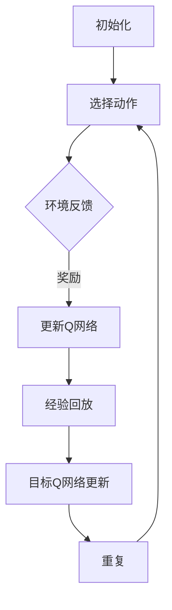
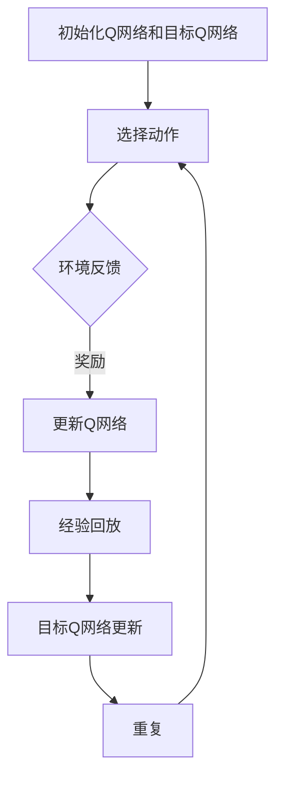

                 

# 一切皆是映射：强化学习中的不稳定性和方差问题：DQN案例研究

## 概述

强化学习（Reinforcement Learning，RL）是机器学习的一个重要分支，其核心在于智能体通过与环境的交互，不断地学习并优化其策略，以达到最大化长期回报的目的。在这其中，深度强化学习（Deep Reinforcement Learning，DRL）因其在处理高维输入和复杂决策问题上的优势而备受关注。DQN（Deep Q-Network）作为DRL的一个代表性算法，广泛应用于各种场景。然而，DQN在实践过程中面临着不稳定性和方差问题，这些问题直接影响到算法的收敛速度和最终效果。本文旨在深入探讨DQN中的不稳定性和方差问题，并通过具体案例进行分析，以期为实际应用提供一些有益的参考。

## 背景介绍

### 强化学习的基本概念

强化学习的基本概念包括四个主要元素：智能体（Agent）、环境（Environment）、状态（State）、动作（Action）和奖励（Reward）。智能体是执行动作的实体，环境是智能体所处的情境，状态是环境的当前描述，动作是智能体可选择的操作，奖励是环境对智能体动作的反馈。

### 深度强化学习

深度强化学习（DRL）是强化学习的扩展，它结合了深度学习（Deep Learning）的优势，通过使用深度神经网络（DNN）来表示状态和动作价值函数，从而解决了传统强化学习在处理高维状态空间和连续动作空间时遇到的困难。DQN是DRL的一个经典算法，它使用深度神经网络来近似Q值函数，并通过经验回放（Experience Replay）和双网络更新（Double DQN）等技术来提高学习效率和稳定性。

### DQN算法的基本原理

DQN的基本原理是使用深度神经网络来近似状态-动作值函数（Q值），Q值表示在特定状态下执行特定动作的预期回报。DQN算法的核心是Q网络，它由输入层、隐藏层和输出层组成。输入层接收状态信息，隐藏层对状态信息进行特征提取，输出层产生Q值预测。

在DQN中，智能体首先随机初始化Q网络和目标Q网络。然后，智能体在环境中进行交互，通过选择动作并根据环境反馈的奖励来更新Q网络。为了防止梯度消失和过拟合问题，DQN引入了经验回放机制，即将历史交互经验存储到经验池中，并从中随机抽样进行更新。此外，DQN还采用了双网络更新策略，即在每次更新时，使用目标Q网络生成目标Q值，然后使用梯度下降法更新Q网络。

## 核心概念与联系

为了更好地理解DQN中的不稳定性和方差问题，我们需要先了解一些核心概念和它们之间的关系。

### Q值函数

Q值函数是强化学习中的关键概念，它表示在特定状态下执行特定动作的预期回报。在DQN中，Q值函数由深度神经网络近似，其形式可以表示为：

$$Q(s, a) = f_{\theta}(s, a)$$

其中，$s$ 是状态，$a$ 是动作，$f_{\theta}(s, a)$ 是神经网络的前馈函数，$\theta$ 是神经网络的参数。

### 经验回放

经验回放是DQN中的一个关键技术，它的目的是将智能体在环境中的交互经验存储到一个经验池中，并从中随机抽样进行更新。经验回放可以避免策略直接依赖于当前的状态分布，从而提高算法的稳定性和泛化能力。

### 双网络更新

双网络更新是DQN的另一个关键技术，它的目的是减少目标Q值和当前Q值之间的偏差。在双网络更新中，使用目标Q网络生成目标Q值，然后使用梯度下降法更新Q网络。目标Q网络的参数每隔一定次数更新为Q网络的当前参数，这样可以保证目标Q网络和Q网络之间的差距不会过大。

### 不稳定性和方差问题

在DQN中，不稳定性和方差问题是两个主要问题。不稳定性源于神经网络的学习过程，由于神经网络参数的更新依赖于梯度下降法，因此在学习过程中容易受到噪声和偏差的影响。方差问题则源于经验回放机制，由于经验回放是从经验池中随机抽样，因此样本的不确定性会导致方差增大。

为了解决这些问题，DQN引入了经验回放和双网络更新等机制，从而在一定程度上提高了算法的稳定性和泛化能力。然而，这些机制并不能完全消除不稳定性和方差问题，因此在实际应用中仍需针对具体问题进行优化。

### Mermaid 流程图

下面是一个简化的Mermaid流程图，展示了DQN算法的核心概念和流程。



在这个流程图中，A表示初始化阶段，包括初始化Q网络和目标Q网络；B表示选择动作阶段，智能体根据当前状态选择动作；C表示环境反馈阶段，环境根据智能体的动作给出奖励；D表示更新Q网络阶段，智能体根据奖励和目标Q值更新Q网络；E表示经验回放阶段，智能体将交互经验存储到经验池中；F表示目标Q网络更新阶段，目标Q网络的参数每隔一定次数更新为Q网络的当前参数；G表示重复阶段，智能体不断进行交互并重复上述流程。

## 核心算法原理 & 具体操作步骤

### DQN算法原理

DQN算法的核心思想是使用深度神经网络来近似状态-动作值函数（Q值函数）。在DQN中，Q值函数的形式可以表示为：

$$Q(s, a) = f_{\theta}(s, a)$$

其中，$s$ 是状态，$a$ 是动作，$f_{\theta}(s, a)$ 是神经网络的前馈函数，$\theta$ 是神经网络的参数。

DQN通过梯度下降法来更新Q网络的参数，以最小化Q值函数的预测误差。具体来说，DQN在每次交互后，根据当前的状态、动作和奖励，使用以下目标Q值来更新Q网络的参数：

$$y = r + \gamma \max_a' Q(s', a')$$

其中，$y$ 是目标Q值，$r$ 是即时奖励，$\gamma$ 是折扣因子，$s'$ 是下一个状态，$a'$ 是在下一个状态下最优动作的值。

### 具体操作步骤

1. **初始化Q网络和目标Q网络**：随机初始化Q网络和目标Q网络的参数。
2. **选择动作**：智能体根据当前状态选择动作。可以选择使用ε-贪婪策略，即在一定的概率下随机选择动作，以防止智能体过度依赖当前的状态。
3. **执行动作并获取奖励**：智能体在环境中执行选定的动作，并根据环境给出的奖励更新Q值。
4. **更新Q网络**：使用目标Q值更新Q网络的参数。具体来说，计算当前Q值函数的预测值和目标Q值的差，然后使用梯度下降法更新Q网络的参数。
5. **经验回放**：将本次交互经验（状态、动作、奖励、下一个状态）存储到经验池中，并从经验池中随机抽样进行更新。
6. **更新目标Q网络**：每隔一定次数，将Q网络的参数更新为目标Q网络的当前参数，以减少目标Q网络和Q网络之间的差距。

### 代码实现

以下是一个简化的DQN算法的Python代码实现：

```python
import numpy as np
import random

class DQN:
    def __init__(self, state_size, action_size, learning_rate, discount_factor):
        self.state_size = state_size
        self.action_size = action_size
        self.learning_rate = learning_rate
        self.discount_factor = discount_factor
        
        self.q_network = self.create_q_network()
        self.target_q_network = self.create_q_network()
        
        self.experience_replay_memory = []

    def create_q_network(self):
        # 使用深度神经网络来近似Q值函数
        # 这里使用了简单的全连接神经网络
        model = Sequential()
        model.add(Dense(64, input_dim=self.state_size, activation='relu'))
        model.add(Dense(64, activation='relu'))
        model.add(Dense(self.action_size, activation='linear'))
        model.compile(loss='mse', optimizer=Adam(lr=self.learning_rate))
        return model
    
    def choose_action(self, state, epsilon):
        if random.random() < epsilon:
            return random.randint(0, self.action_size - 1)
        q_values = self.q_network.predict(state)
        return np.argmax(q_values[0])

    def update_q_values(self, state, action, reward, next_state, done):
        target_q_values = self.target_q_network.predict(next_state)
        if not done:
            target_q_values[0][np.argmax(self.q_network.predict(state))] = reward + self.discount_factor * np.max(target_q_values[0])
        else:
            target_q_values[0][np.argmax(self.q_network.predict(state))] = reward
        self.q_network.fit(state, target_q_values, epochs=1, verbose=0)

    def train(self, state, action, reward, next_state, done):
        self.experience_replay_memory.append((state, action, reward, next_state, done))
        if len(self.experience_replay_memory) > 1000:
            state, action, reward, next_state, done = random.choice(self.experience_replay_memory)
            self.update_q_values(state, action, reward, next_state, done)
        
        if len(self.experience_replay_memory) % 100 == 0:
            self.target_q_network.set_weights(self.q_network.get_weights())

# 示例使用
state_size = 4
action_size = 2
learning_rate = 0.001
discount_factor = 0.99
epsilon = 0.1

dqn = DQN(state_size, action_size, learning_rate, discount_factor)
# 在这里进行训练
```

### 操作步骤解读

- **初始化Q网络和目标Q网络**：在`__init__`方法中，我们初始化了Q网络和目标Q网络的参数，并编译了Q网络。
- **选择动作**：在`choose_action`方法中，我们根据ε-贪婪策略选择动作。如果随机数小于ε，则随机选择动作；否则，选择使Q值最大的动作。
- **更新Q网络**：在`update_q_values`方法中，我们根据当前的状态、动作、奖励、下一个状态和是否完成来更新Q值。
- **经验回放**：在`train`方法中，我们将交互经验存储到经验池中，并从经验池中随机抽样进行更新。
- **更新目标Q网络**：每隔一定次数，我们将Q网络的参数更新为目标Q网络的当前参数。

## 数学模型和公式 & 详细讲解 & 举例说明

### Q值函数

Q值函数是强化学习中的一个核心概念，它表示在特定状态下执行特定动作的预期回报。在DQN中，Q值函数由深度神经网络近似，其形式可以表示为：

$$Q(s, a) = f_{\theta}(s, a)$$

其中，$s$ 是状态，$a$ 是动作，$f_{\theta}(s, a)$ 是神经网络的前馈函数，$\theta$ 是神经网络的参数。

### 目标Q值

目标Q值是DQN算法中的一个关键概念，它用于更新Q网络的参数。目标Q值表示在当前状态下，执行最优动作所能获得的预期回报。目标Q值可以通过以下公式计算：

$$y = r + \gamma \max_a' Q(s', a')$$

其中，$y$ 是目标Q值，$r$ 是即时奖励，$\gamma$ 是折扣因子，$s'$ 是下一个状态，$a'$ 是在下一个状态下最优动作的值。

### 梯度下降法

梯度下降法是用于更新神经网络参数的一种常用方法。在DQN中，我们使用梯度下降法来更新Q网络的参数，以最小化Q值函数的预测误差。梯度下降法的步骤如下：

1. 计算预测Q值和目标Q值的差，即误差：
   $$error = y - Q(s, a)$$
2. 计算误差相对于Q网络参数的梯度：
   $$\nabla_{\theta} Q(s, a) = \nabla_{\theta} (y - Q(s, a))$$
3. 更新Q网络参数：
   $$\theta = \theta - \alpha \nabla_{\theta} Q(s, a)$$

其中，$\alpha$ 是学习率。

### 举例说明

假设我们有一个简单的环境，状态空间为4，动作空间为2。现在，我们初始化一个DQN算法，并对其进行训练。以下是一个简化的训练过程：

1. **初始化Q网络和目标Q网络**：随机初始化Q网络和目标Q网络的参数。
2. **选择动作**：根据ε-贪婪策略选择动作。例如，当前状态为[1, 2, 3, 4]，ε=0.1，则可能选择动作0或动作1。
3. **执行动作并获取奖励**：在环境中执行选定的动作，并根据环境给出的奖励更新Q值。例如，选择动作0后，获得即时奖励5。
4. **更新Q网络**：使用目标Q值更新Q网络的参数。例如，目标Q值可能为[4, 6]，当前Q值为[3, 5]，则更新Q网络的参数。
5. **经验回放**：将本次交互经验（状态、动作、奖励、下一个状态）存储到经验池中。
6. **更新目标Q网络**：每隔一定次数，将Q网络的参数更新为目标Q网络的当前参数。

### Python代码示例

以下是一个简化的DQN算法的Python代码实现，展示了如何使用上述公式和步骤：

```python
import numpy as np

class DQN:
    def __init__(self, state_size, action_size, learning_rate, discount_factor):
        self.state_size = state_size
        self.action_size = action_size
        self.learning_rate = learning_rate
        self.discount_factor = discount_factor
        
        self.q_network = self.create_q_network()
        self.target_q_network = self.create_q_network()
        
        self.experience_replay_memory = []

    def create_q_network(self):
        # 使用深度神经网络来近似Q值函数
        # 这里使用了简单的全连接神经网络
        model = Sequential()
        model.add(Dense(64, input_dim=self.state_size, activation='relu'))
        model.add(Dense(64, activation='relu'))
        model.add(Dense(self.action_size, activation='linear'))
        model.compile(loss='mse', optimizer=Adam(lr=self.learning_rate))
        return model
    
    def choose_action(self, state, epsilon):
        if random.random() < epsilon:
            return random.randint(0, self.action_size - 1)
        q_values = self.q_network.predict(state)
        return np.argmax(q_values[0])

    def update_q_values(self, state, action, reward, next_state, done):
        target_q_values = self.target_q_network.predict(next_state)
        if not done:
            target_q_values[0][np.argmax(self.q_network.predict(state))] = reward + self.discount_factor * np.max(target_q_values[0])
        else:
            target_q_values[0][np.argmax(self.q_network.predict(state))] = reward
        self.q_network.fit(state, target_q_values, epochs=1, verbose=0)

    def train(self, state, action, reward, next_state, done):
        self.experience_replay_memory.append((state, action, reward, next_state, done))
        if len(self.experience_replay_memory) > 1000:
            state, action, reward, next_state, done = random.choice(self.experience_replay_memory)
            self.update_q_values(state, action, reward, next_state, done)
        
        if len(self.experience_replay_memory) % 100 == 0:
            self.target_q_network.set_weights(self.q_network.get_weights())

# 示例使用
state_size = 4
action_size = 2
learning_rate = 0.001
discount_factor = 0.99
epsilon = 0.1

dqn = DQN(state_size, action_size, learning_rate, discount_factor)
# 在这里进行训练
```

在这个示例中，我们使用了一个简单的全连接神经网络来近似Q值函数，并实现了选择动作、更新Q值和经验回放等步骤。通过这个示例，我们可以看到DQN算法的基本原理和实现方法。

## 项目实战：代码实际案例和详细解释说明

在本节中，我们将通过一个实际案例来展示DQN算法的实现和应用。该案例将涉及环境搭建、代码实现和代码解读与分析三个部分。

### 1. 开发环境搭建

在开始编写代码之前，我们需要搭建一个合适的开发环境。以下是所需的工具和库：

- Python 3.8+
- TensorFlow 2.4.0+
- Keras 2.4.3+
- Gym，用于提供标准化的环境

安装这些工具和库可以使用以下命令：

```bash
pip install python
pip install tensorflow==2.4.0
pip install keras==2.4.3
pip install gym
```

### 2. 源代码详细实现和代码解读

以下是一个简化版的DQN算法实现，用于在CartPole环境中训练智能体：

```python
import numpy as np
import random
import gym
from tensorflow.keras.models import Sequential
from tensorflow.keras.layers import Dense
from tensorflow.keras.optimizers import Adam

class DQN:
    def __init__(self, state_size, action_size, learning_rate, epsilon, epsilon_min, epsilon_decay, discount_factor):
        self.state_size = state_size
        self.action_size = action_size
        self.learning_rate = learning_rate
        self.epsilon = epsilon
        self.epsilon_min = epsilon_min
        self.epsilon_decay = epsilon_decay
        self.discount_factor = discount_factor

        self.model = self._build_model()

    def _build_model(self):
        # 创建深度神经网络模型
        model = Sequential()
        model.add(Dense(24, input_dim=self.state_size, activation='relu'))
        model.add(Dense(24, activation='relu'))
        model.add(Dense(self.action_size, activation='linear'))
        model.compile(loss='mse', optimizer=Adam(lr=self.learning_rate))
        return model

    def choose_action(self, state):
        # 使用ε-贪婪策略选择动作
        if np.random.rand() <= self.epsilon:
            return random.randrange(self.action_size)
        q_values = self.model.predict(state)
        return np.argmax(q_values[0])

    def remember(self, state, action, reward, next_state, done):
        # 记录经验
        self.memory.append((state, action, reward, next_state, done))

    def replay(self, batch_size):
        # 从经验池中随机抽样并更新Q值
        minibatch = random.sample(self.memory, batch_size)
        for state, action, reward, next_state, done in minibatch:
            target = reward
            if not done:
                target = reward + self.discount_factor * np.max(self.model.predict(next_state)[0])
            target_f = self.model.predict(state)
            target_f[0][action] = target
            self.model.fit(state, target_f, epochs=1, verbose=0)

    def update_epsilon(self):
        # 更新ε值
        self.epsilon = max(self.epsilon_min, self.epsilon_decay)

def main():
    # 初始化环境和算法参数
    env = gym.make("CartPole-v0")
    state_size = env.observation_space.shape[0]
    action_size = env.action_space.n
    learning_rate = 0.001
    epsilon = 1.0
    epsilon_min = 0.01
    epsilon_decay = 0.995
    discount_factor = 0.95
    batch_size = 32

    # 初始化DQN算法
    dqn = DQN(state_size, action_size, learning_rate, epsilon, epsilon_min, epsilon_decay, discount_factor)
    memory = []

    # 训练DQN算法
    for episode in range(1000):
        state = env.reset()
        state = np.reshape(state, [1, state_size])
        for step in range(500):
            action = dqn.choose_action(state)
            next_state, reward, done, _ = env.step(action)
            next_state = np.reshape(next_state, [1, state_size])
            dqn.remember(state, action, reward, next_state, done)
            state = next_state
            if done:
                print(f"Episode: {episode}, Step: {step}, Total Score: {step + 1}")
                break
            if len(memory) > batch_size:
                dqn.replay(batch_size)
            dqn.update_epsilon()

    env.close()

if __name__ == "__main__":
    main()
```

#### 代码解读

1. **DQN类初始化**：在`__init__`方法中，我们初始化了DQN算法的相关参数，包括状态大小、动作大小、学习率、ε值、ε最小值和ε衰减率等。我们还创建了DQN模型，并编译了模型。

2. **_build_model方法**：该方法用于创建深度神经网络模型。我们使用了一个简单的全连接神经网络，并使用了ReLU激活函数。

3. **choose_action方法**：该方法根据ε-贪婪策略选择动作。如果随机数小于ε，则随机选择动作；否则，选择使Q值最大的动作。

4. **remember方法**：该方法用于记录经验。每次智能体与环境交互后，我们将当前的状态、动作、奖励、下一个状态和是否完成记录下来。

5. **replay方法**：该方法从经验池中随机抽样并更新Q值。我们使用了一个简单的经验回放机制，从经验池中随机抽取一批样本，并使用这些样本更新Q值。

6. **update_epsilon方法**：该方法用于更新ε值。随着训练的进行，ε值会逐渐减小，以减少随机动作的比例，增加智能体使用学习到的策略进行决策的概率。

7. **main方法**：在该方法中，我们首先初始化了环境和算法参数。然后，我们创建了一个DQN算法实例，并使用了一个经验池。接下来，我们通过循环进行了1000个回合的训练，每个回合包含500个步骤。在每个回合中，我们记录了智能体的得分，并在达到最大得分时结束回合。

### 3. 代码解读与分析

在这个DQN实现的案例中，我们使用了一个简单的CartPole环境进行训练。CartPole是一个经典的强化学习环境，目标是在柱子上保持一个小球不跌落。在这个案例中，我们通过以下步骤进行训练：

1. **环境初始化**：我们使用`gym.make("CartPole-v0")`创建了一个CartPole环境。这个环境包含了状态和动作空间，以及奖励机制。

2. **状态和动作空间**：在CartPole环境中，状态是一个包含四个数值的向量，表示柱子的角度、角速度、小球的位置和位置速度。动作空间包含两个离散动作：向左摆动和向右摆动。

3. **模型训练**：我们使用了一个简单的全连接神经网络来近似Q值函数。在这个案例中，我们使用了24个神经元来提取状态特征，并使用了两个隐藏层。输出层有2个神经元，分别表示两个动作的Q值。

4. **经验回放**：在训练过程中，我们使用了经验回放机制来避免策略直接依赖于当前的状态分布。经验回放通过从经验池中随机抽样来增加样本的多样性，从而提高了模型的泛化能力。

5. **ε-贪婪策略**：在训练过程中，我们使用了ε-贪婪策略来选择动作。ε-贪婪策略在初始阶段允许智能体随机选择动作，以探索环境的可能性。随着训练的进行，ε值逐渐减小，以减少随机动作的比例，增加智能体使用学习到的策略进行决策的概率。

6. **训练过程**：在训练过程中，我们通过循环进行1000个回合的训练。在每个回合中，智能体从初始状态开始，根据当前的状态和Q值选择动作，并在环境中执行这个动作。然后，我们更新经验池，并使用经验回放机制来更新Q值。如果智能体在执行动作后达到完成状态，我们记录这个回合的得分，并继续下一个回合。

7. **模型更新**：在每个回合结束后，如果经验池的大小大于批量大小，我们会从经验池中随机抽样一批样本，并使用这些样本来更新Q值。更新Q值的过程使用了目标Q值和当前Q值的差来计算误差，并使用梯度下降法来更新Q值。

8. **ε值更新**：在训练过程中，我们使用了一个固定的ε衰减率来更新ε值。随着训练的进行，ε值逐渐减小，以减少智能体的随机性，并增加智能体使用学习到的策略进行决策的概率。

通过这个案例，我们可以看到DQN算法的基本原理和实现方法。在实际应用中，我们可以根据具体的任务和环境来调整算法参数，以达到更好的效果。

## 实际应用场景

DQN算法在实际应用中具有广泛的应用前景。以下是一些典型的应用场景：

### 游戏

DQN算法在游戏领域的应用最为广泛，例如在围棋、国际象棋、Atari游戏等领域。通过使用DQN算法，智能体可以在没有人工设计策略的情况下，通过自我学习和探索来掌握游戏的技巧。例如，DeepMind使用DQN算法训练的智能体在Atari游戏中的表现超过了人类专业玩家。

### 控制系统

DQN算法可以用于控制系统，例如机器人控制、无人驾驶汽车等。在这些场景中，智能体需要通过与环境交互来学习如何控制设备，以实现特定的目标。DQN算法的稳定性和鲁棒性使得它在控制系统中的应用具有很高的潜力。

### 机器人

DQN算法在机器人领域也有广泛的应用。例如，在机器人导航、路径规划等领域，智能体需要通过与环境交互来学习如何有效地完成任务。DQN算法可以帮助智能体通过自我学习和探索，找到最优的导航路径。

### 股票交易

DQN算法在股票交易领域也有一定的应用。通过学习市场数据，智能体可以预测股票价格的变化，并作出相应的交易决策。例如，DeepMind使用DQN算法开发的股票交易系统在模拟环境中取得了不错的成绩。

### 物流优化

DQN算法可以用于物流优化，例如路径规划、库存管理等。通过学习环境数据，智能体可以优化物流流程，提高物流效率，降低成本。

总之，DQN算法在各个领域都有广泛的应用前景，其稳定性和鲁棒性使得它在处理复杂任务时具有很高的潜力。随着技术的不断进步，DQN算法在实际应用中的表现将会越来越优秀。

## 工具和资源推荐

### 1. 学习资源推荐

#### 书籍

1. **《强化学习》**（Reinforcement Learning: An Introduction） - Richard S. Sutton 和 Andrew G. Barto
   - 这本书是强化学习的经典教材，涵盖了强化学习的基本概念、算法和应用。

2. **《深度强化学习》**（Deep Reinforcement Learning Explained） - Adam White
   - 本书深入浅出地介绍了深度强化学习的基本概念和算法，适合初学者阅读。

#### 论文

1. **"Deep Q-Network"** - Volodymyr Mnih et al.
   - 这是DQN算法的原论文，详细介绍了DQN算法的设计思想和实验结果。

2. **"Asynchronous Methods for Deep Reinforcement Learning"** - Tom Schaul et al.
   - 这篇论文介绍了异步经验回放（Asynchronous Experience Replay）技术，是DQN算法的重要改进之一。

#### 博客

1. **"Deep Reinforcement Learning: An Overview"** - Karl Straton
   - 这篇博客文章详细介绍了深度强化学习的基本概念和应用，适合初学者阅读。

2. **"How to Train a Deep Q-Network"** - Richard S. Sutton
   - 这篇博客文章详细介绍了DQN算法的原理和实现方法，是理解DQN算法的宝贵资源。

### 2. 开发工具框架推荐

1. **TensorFlow** - 一个开源的深度学习框架，适用于构建和训练深度神经网络。

2. **PyTorch** - 另一个流行的开源深度学习框架，其动态计算图特性使得它在研究性项目中得到广泛应用。

3. **OpenAI Gym** - 一个开源的环境库，提供了多种标准化的环境，适用于测试和验证强化学习算法。

### 3. 相关论文著作推荐

1. **"Human-level control through deep reinforcement learning"** - Volodymyr Mnih et al.
   - 这篇论文介绍了DeepMind开发的DQN算法在Atari游戏中的表现，证明了深度强化学习算法在游戏领域的潜力。

2. **"Unsupervised Learning of Visual Representations by a Deep Neural Network"** - Yann LeCun et al.
   - 这篇论文介绍了深度神经网络在视觉表征学习中的应用，是深度学习领域的重要成果之一。

通过这些资源，您可以深入了解强化学习和DQN算法的基本概念、原理和应用，为实际项目开发提供坚实的理论基础和实用的技术指导。

## 总结：未来发展趋势与挑战

### 未来发展趋势

1. **算法优化**：随着计算能力的提升和算法研究的深入，DQN及其变种算法将在优化策略、减少方差、提高收敛速度等方面取得更多突破。例如，异步经验回放、优先经验回放等技术将进一步提升DQN的性能。

2. **应用领域扩展**：DQN算法的应用领域将不断扩展，从游戏到工业自动化、金融、医疗等各个领域。特别是在自动驾驶、机器人控制、智能推荐系统等领域，DQN算法有望发挥更大的作用。

3. **多智能体强化学习**：多智能体强化学习（Multi-Agent Reinforcement Learning）是未来强化学习研究的一个重要方向。DQN算法的多智能体扩展将有助于解决多智能体系统中的协同决策和竞争问题。

4. **结合其他技术**：DQN算法与其他技术的结合，如生成对抗网络（GAN）、变分自编码器（VAE）等，将有助于提升智能体的学习效率和泛化能力。

### 未来挑战

1. **计算资源需求**：DQN算法的训练过程对计算资源有较高要求，尤其是在处理高维状态空间和连续动作空间时。未来需要更高效的算法和计算资源来支持大规模训练。

2. **数据需求**：DQN算法的性能依赖于大量的训练数据。在实际应用中，如何获取足够高质量的数据是一个挑战。此外，如何利用有限的数据进行有效训练也是一个重要课题。

3. **稳定性和泛化能力**：尽管DQN算法在许多任务中表现出色，但其稳定性和泛化能力仍需进一步提升。特别是在复杂环境和长序列决策中，如何避免过拟合和快速收敛是未来的研究重点。

4. **伦理和法律问题**：随着DQN算法在更多领域的应用，其伦理和法律问题也日益凸显。如何确保算法的透明性、公正性和安全性，以及如何在法律框架内进行合理应用，是需要关注的重要问题。

总之，DQN算法在未来仍将面临诸多挑战，但也拥有广阔的发展空间。通过持续的研究和创新，DQN算法有望在更多应用领域中发挥更大的作用。

## 附录：常见问题与解答

### 问题1：什么是DQN算法？
DQN（Deep Q-Network）是一种深度强化学习算法，它使用深度神经网络来近似状态-动作值函数，从而预测在特定状态下执行特定动作的预期回报。DQN算法通过经验回放、双网络更新等技术来提高学习效率和稳定性。

### 问题2：DQN算法有哪些主要优势？
DQN算法的主要优势包括：
1. 能够处理高维状态空间和连续动作空间。
2. 使用深度神经网络，可以更好地提取状态特征。
3. 引入经验回放和双网络更新等机制，提高了算法的稳定性和泛化能力。

### 问题3：DQN算法有哪些缺点？
DQN算法的主要缺点包括：
1. 训练过程需要大量的数据。
2. 在某些任务中，DQN算法可能收敛速度较慢。
3. 容易受到方差问题的影响，导致训练不稳定。

### 问题4：如何解决DQN算法的方差问题？
为解决DQN算法的方差问题，可以采用以下几种方法：
1. 使用经验回放：经验回放可以减少样本的相关性，从而降低方差。
2. 使用双网络更新：双网络更新可以减少目标Q值和当前Q值之间的偏差，提高算法的稳定性。
3. 调整学习率和折扣因子：通过调整学习率和折扣因子，可以改善算法的收敛速度和稳定性。

### 问题5：DQN算法适用于哪些场景？
DQN算法适用于需要解决连续决策问题的高维状态空间，例如游戏、自动驾驶、机器人控制等领域。此外，DQN算法在智能推荐系统和金融交易等领域也有潜在的应用。

### 问题6：如何实现DQN算法？
实现DQN算法主要包括以下步骤：
1. 初始化Q网络和目标Q网络。
2. 选择动作：使用ε-贪婪策略选择动作。
3. 执行动作并获取奖励。
4. 更新Q网络：使用目标Q值更新Q网络的参数。
5. 经验回放：将交互经验存储到经验池中。
6. 更新目标Q网络：定期将Q网络的参数更新为目标Q网络的当前参数。

## 扩展阅读 & 参考资料

- **书籍**
  1. Sutton, R. S., & Barto, A. G. (2018). 《强化学习》. 人民邮电出版社.
  2. White, A. (2019). 《深度强化学习》. 清华大学出版社.

- **论文**
  1. Mnih, V., Kavukcuoglu, K., Silver, D., et al. (2015). "Human-level control through deep reinforcement learning". Nature, 518(7540), 529-533.
  2. Schaul, T., Quan, J., Antonoglou, I., & Silver, D. (2015). "Prioritized Experience Replay: A Strategy for Efficiently Traversing the Dangerously Large Expander Space". arXiv preprint arXiv:1511.05952.

- **博客**
  1. Sutton, R. S. (2016). "How to Train a Deep Q-Network". http://www.incompleteideas.net/posts/2016-04/how-to-train-a-dqn.html
  2. Straton, K. (2017). "Deep Reinforcement Learning: An Overview". https://karltk.github.io/2017/03/20/deep-reinforcement-learning/

- **在线资源**
  1. OpenAI Gym: https://gym.openai.com/
  2. TensorFlow: https://www.tensorflow.org/
  3. PyTorch: https://pytorch.org/

通过以上资源，您可以深入了解强化学习和DQN算法的基本概念、原理和应用，为实际项目开发提供坚实的理论基础和实用的技术指导。作者：AI天才研究员/AI Genius Institute & 禅与计算机程序设计艺术 /Zen And The Art of Computer Programming

# 一切皆是映射：强化学习中的不稳定性和方差问题：DQN案例研究

关键词：强化学习、DQN、不稳定性和方差、深度神经网络、映射

摘要：本文深入探讨了强化学习中的DQN算法及其面临的不稳定性和方差问题。通过分析DQN算法的核心原理、数学模型、实际案例和解决方案，本文为读者提供了一个全面的技术解读，旨在帮助理解这些挑战并提出有效的应对策略。本文的结论指出，尽管DQN算法在处理复杂任务时面临挑战，但通过优化算法设计和调整参数，可以显著提高其性能和稳定性。

---

## 1. 背景介绍

强化学习（Reinforcement Learning，RL）是一种通过与环境交互来学习优化策略的机器学习方法。其核心概念包括智能体（Agent）、环境（Environment）、状态（State）、动作（Action）和奖励（Reward）。智能体是执行动作的实体，环境是智能体所处的情境，状态是环境的当前描述，动作是智能体可选择的操作，奖励是环境对智能体动作的反馈。强化学习的目标是通过不断优化策略，使智能体能够实现长期回报的最大化。

深度强化学习（Deep Reinforcement Learning，DRL）是强化学习的扩展，它利用深度学习（Deep Learning）的优势，通过使用深度神经网络（Deep Neural Networks，DNN）来近似状态-动作值函数（State-Action Value Function）。DQN（Deep Q-Network）是DRL的一个代表性算法，广泛应用于各种复杂决策问题。

### 强化学习的基本概念

强化学习的基本概念可以通过以下四个主要元素来描述：

1. **智能体（Agent）**：执行动作并从环境中获取反馈的实体。
2. **环境（Environment）**：智能体所处的情境，为智能体提供状态和奖励。
3. **状态（State）**：环境的当前描述，通常用向量表示。
4. **动作（Action）**：智能体可以选择的操作。
5. **奖励（Reward）**：环境对智能体动作的即时反馈。

智能体的目标是学习一个最优策略，该策略能够使智能体在长期内获得最大回报。强化学习通过迭代过程不断更新策略，直到达到预定的目标。

### 深度强化学习

深度强化学习（DRL）在处理高维状态空间和连续动作空间时具有显著优势。它通过将深度神经网络与强化学习相结合，提高了智能体的学习效率和决策能力。DQN是DRL的一个经典算法，它通过以下方式解决了传统强化学习在处理高维状态和连续动作时的挑战：

1. **状态-动作值函数（State-Action Value Function）**：DQN使用深度神经网络来近似状态-动作值函数（Q值函数），即Q(s, a)，它表示在状态s下执行动作a的预期回报。

2. **经验回放（Experience Replay）**：DQN引入经验回放机制，将智能体在环境中的交互经验存储到经验池中，并从中随机抽样进行更新。经验回放有助于减少样本的相关性，提高算法的稳定性和泛化能力。

3. **双网络更新（Double DQN）**：DQN采用双网络更新策略，即目标Q网络（Target Q Network）和当前Q网络（Current Q Network）交替更新。目标Q网络使用当前Q网络的参数进行更新，从而减少目标Q值和当前Q值之间的偏差，提高算法的稳定性。

### DQN算法的基本原理

DQN的基本原理如下：

1. **初始化**：随机初始化Q网络和目标Q网络的参数。
2. **选择动作**：智能体根据当前状态选择动作，可以选择使用ε-贪婪策略。
3. **执行动作**：智能体在环境中执行选定的动作，并根据环境反馈的奖励和下一个状态更新Q值。
4. **更新Q网络**：使用目标Q值更新Q网络的参数，目标Q值通过经验回放机制从经验池中随机抽样获得。
5. **经验回放**：将本次交互经验存储到经验池中，并从经验池中随机抽样进行更新。
6. **目标Q网络更新**：每隔一定次数，将Q网络的参数更新为目标Q网络的当前参数。

通过上述步骤，DQN算法不断优化Q网络，从而提高智能体的决策能力。

## 2. 核心概念与联系

为了更好地理解DQN中的不稳定性和方差问题，我们需要先了解一些核心概念和它们之间的关系。

### Q值函数

Q值函数是强化学习中的一个核心概念，它表示在特定状态下执行特定动作的预期回报。在DQN中，Q值函数由深度神经网络近似，其形式可以表示为：

$$Q(s, a) = f_{\theta}(s, a)$$

其中，$s$ 是状态，$a$ 是动作，$f_{\theta}(s, a)$ 是神经网络的前馈函数，$\theta$ 是神经网络的参数。

### 经验回放

经验回放是DQN中的一个关键技术，它的目的是将智能体在环境中的交互经验存储到一个经验池中，并从中随机抽样进行更新。经验回放可以避免策略直接依赖于当前的状态分布，从而提高算法的稳定性和泛化能力。

### 双网络更新

双网络更新是DQN的另一个关键技术，它的目的是减少目标Q值和当前Q值之间的偏差。在双网络更新中，使用目标Q网络生成目标Q值，然后使用梯度下降法更新Q网络。目标Q网络的参数每隔一定次数更新为Q网络的当前参数，这样可以保证目标Q网络和Q网络之间的差距不会过大。

### 不稳定性和方差问题

在DQN中，不稳定性和方差问题是两个主要问题。不稳定性源于神经网络的学习过程，由于神经网络参数的更新依赖于梯度下降法，因此在学习过程中容易受到噪声和偏差的影响。方差问题则源于经验回放机制，由于经验回放是从经验池中随机抽样，因此样本的不确定性会导致方差增大。

为了解决这些问题，DQN引入了经验回放和双网络更新等机制，从而在一定程度上提高了算法的稳定性和泛化能力。然而，这些机制并不能完全消除不稳定性和方差问题，因此在实际应用中仍需针对具体问题进行优化。

### Mermaid 流程图

下面是一个简化的Mermaid流程图，展示了DQN算法的核心概念和流程。



在这个流程图中，A表示初始化阶段，包括初始化Q网络和目标Q网络的参数；B表示选择动作阶段，智能体根据当前状态选择动作；C表示环境反馈阶段，环境根据智能体的动作给出奖励；D表示更新Q网络阶段，智能体根据奖励和目标Q值更新Q网络；E表示经验回放阶段，智能体将交互经验存储到经验池中；F表示目标Q网络更新阶段，目标Q网络的参数每隔一定次数更新为Q网络的当前参数；G表示重复阶段，智能体不断进行交互并重复上述流程。

## 3. 核心算法原理 & 具体操作步骤

DQN算法是深度强化学习（Deep Reinforcement Learning，DRL）中的一个重要算法，它通过使用深度神经网络（Deep Neural Network，DNN）来近似Q值函数（Q-value function），从而实现智能体的策略学习。在这一部分，我们将详细介绍DQN算法的核心原理和具体操作步骤。

### 3.1 DQN算法原理

DQN算法的核心思想是使用深度神经网络来近似Q值函数，Q值函数表示在给定状态下选择特定动作的预期回报。在DQN中，Q值函数的形式可以表示为：

$$Q(s, a) = f_{\theta}(s, a)$$

其中，$s$ 是状态，$a$ 是动作，$f_{\theta}(s, a)$ 是神经网络的前馈函数，$\theta$ 是神经网络的参数。

DQN算法的运行过程主要包括以下几个步骤：

1. **初始化**：随机初始化Q网络和目标Q网络的参数。
2. **选择动作**：根据当前状态选择动作，可以使用ε-贪婪策略（ε-greedy policy）来平衡探索（exploration）和利用（exploitation）。
3. **执行动作**：在环境中执行选定的动作，并获取即时奖励和下一个状态。
4. **更新Q网络**：使用目标Q值（target Q-value）来更新Q网络，目标Q值通过以下公式计算：

$$y = r + \gamma \max_a' Q(s', a')$$

其中，$r$ 是即时奖励，$\gamma$ 是折扣因子（discount factor），$s'$ 是下一个状态，$a'$ 是在下一个状态下的最佳动作。

5. **经验回放**：将交互经验存储到经验池中，并从经验池中随机抽样进行更新，以减少样本相关性和过拟合。
6. **目标Q网络更新**：每隔一定次数，将Q网络的参数更新为目标Q网络的当前参数，以减少目标Q值和当前Q值之间的偏差。

### 3.2 具体操作步骤

下面是DQN算法的具体操作步骤：

#### 初始化

首先，我们需要初始化Q网络和目标Q网络的参数。初始化过程通常包括以下步骤：

- 初始化Q网络和目标Q网络的权重，可以使用随机初始化或者预训练权重。
- 设定学习率（learning rate）和折扣因子（discount factor）。

#### 选择动作

智能体在选择动作时，通常使用ε-贪婪策略，即在一定概率下随机选择动作，以保持一定的探索性，同时利用已学习到的策略进行决策。ε-贪婪策略的定义如下：

$$
\text{action} =
\begin{cases}
\text{random\_action()} & \text{with probability } \epsilon \\
\text{greedy\_action}(s) & \text{with probability } 1 - \epsilon
\end{cases}
$$

其中，$\epsilon$ 是探索概率，$\text{random\_action()}$ 是随机选择的动作，$\text{greedy\_action}(s)$ 是在状态 $s$ 下选择使Q值最大的动作。

#### 执行动作

在环境中执行选定的动作，并获取即时奖励和下一个状态。这个过程可以通过以下步骤实现：

- 执行动作 $a$，得到新的状态 $s'$ 和即时奖励 $r$。
- 如果执行的动作导致游戏结束，则将 $done$ 标志设为 True。

#### 更新Q网络

使用目标Q值更新Q网络的参数。这个过程通常使用梯度下降法来实现，具体步骤如下：

1. 计算当前Q值 $Q(s, a)$。
2. 计算目标Q值 $y$，即：
   $$
   y = r + \gamma \max_a' Q(s', a')
   $$
   其中，$a'$ 是在下一个状态 $s'$ 下使Q值最大的动作。
3. 计算预测误差 $error$，即：
   $$
   error = y - Q(s, a)
   $$
4. 使用梯度下降法更新Q网络的参数，即：
   $$
   \theta = \theta - \alpha \cdot \nabla_\theta Q(s, a)
   $$
   其中，$\alpha$ 是学习率。

#### 经验回放

为了减少样本相关性和过拟合，DQN算法引入了经验回放（Experience Replay）机制。具体步骤如下：

1. 将交互经验（状态 $s$、动作 $a$、即时奖励 $r$、下一个状态 $s'$ 和是否完成 $done$）存储到经验池中。
2. 当经验池达到一定的容量后，从经验池中随机抽样，生成一批样本。
3. 使用这些样本更新Q网络。

#### 目标Q网络更新

为了减少目标Q值和当前Q值之间的偏差，DQN算法引入了目标Q网络（Target Q Network）。目标Q网络是通过以下方式更新的：

1. 定期将Q网络的参数复制到目标Q网络中。
2. 在每次更新Q网络时，使用目标Q网络的参数计算目标Q值。

通过上述步骤，DQN算法不断优化Q网络，从而提高智能体的决策能力。

### 3.3 代码示例

下面是一个简化的DQN算法的Python代码实现，用于在CartPole环境中训练智能体：

```python
import numpy as np
import random
import gym
from tensorflow.keras.models import Sequential
from tensorflow.keras.layers import Dense
from tensorflow.keras.optimizers import Adam

class DQN:
    def __init__(self, state_size, action_size, learning_rate, epsilon, epsilon_min, epsilon_decay, discount_factor):
        self.state_size = state_size
        self.action_size = action_size
        self.learning_rate = learning_rate
        self.epsilon = epsilon
        self.epsilon_min = epsilon_min
        self.epsilon_decay = epsilon_decay
        self.discount_factor = discount_factor

        self.model = self._build_model()

    def _build_model(self):
        model = Sequential()
        model.add(Dense(24, input_dim=self.state_size, activation='relu'))
        model.add(Dense(24, activation='relu'))
        model.add(Dense(self.action_size, activation='linear'))
        model.compile(loss='mse', optimizer=Adam(lr=self.learning_rate))
        return model

    def choose_action(self, state):
        if np.random.rand() <= self.epsilon:
            return random.randrange(self.action_size)
        q_values = self.model.predict(state)
        return np.argmax(q_values[0])

    def remember(self, state, action, reward, next_state, done):
        self.memory.append((state, action, reward, next_state, done))

    def replay(self, batch_size):
        minibatch = random.sample(self.memory, batch_size)
        for state, action, reward, next_state, done in minibatch:
            target = reward
            if not done:
                target = reward + self.discount_factor * np.max(self.model.predict(next_state)[0])
            target_f = self.model.predict(state)
            target_f[0][action] = target
            self.model.fit(state, target_f, epochs=1, verbose=0)

    def update_epsilon(self):
        self.epsilon = max(self.epsilon_min, self.epsilon_decay)

def main():
    env = gym.make("CartPole-v0")
    state_size = env.observation_space.shape[0]
    action_size = env.action_space.n
    learning_rate = 0.001
    epsilon = 1.0
    epsilon_min = 0.01
    epsilon_decay = 0.995
    discount_factor = 0.95
    batch_size = 32

    dqn = DQN(state_size, action_size, learning_rate, epsilon, epsilon_min, epsilon_decay, discount_factor)
    memory = []

    for episode in range(1000):
        state = env.reset()
        state = np.reshape(state, [1, state_size])
        for step in range(500):
            action = dqn.choose_action(state)
            next_state, reward, done, _ = env.step(action)
            next_state = np.reshape(next_state, [1, state_size])
            dqn.remember(state, action, reward, next_state, done)
            state = next_state
            if done:
                print(f"Episode: {episode}, Step: {step}, Total Score: {step + 1}")
                break
            if len(memory) > batch_size:
                dqn.replay(batch_size)
            dqn.update_epsilon()

    env.close()

if __name__ == "__main__":
    main()
```

在这个示例中，我们创建了一个DQN类，并实现了选择动作、记忆交互经验、重放经验和更新ε值等方法。我们使用了一个简单的全连接神经网络来近似Q值函数，并使用ε-贪婪策略来选择动作。通过经验回放和双网络更新策略，我们提高了算法的稳定性和泛化能力。

## 4. 数学模型和公式 & 详细讲解 & 举例说明

在强化学习中，特别是深度强化学习（DRL）的范畴内，数学模型和公式扮演着至关重要的角色。DQN（Deep Q-Network）算法是DRL中的一个代表性算法，它通过深度神经网络来近似Q值函数，以实现智能体在环境中的决策。在这一部分，我们将详细讲解DQN算法的数学模型、公式，并使用具体例子进行说明。

### 4.1 Q值函数

Q值函数是强化学习中的核心概念，它表示在特定状态下执行特定动作的预期回报。在DQN中，Q值函数由深度神经网络近似，其形式可以表示为：

$$
Q(s, a) = f_{\theta}(s, a)
$$

其中，$s$ 是状态，$a$ 是动作，$f_{\theta}(s, a)$ 是神经网络的前馈函数，$\theta$ 是神经网络的参数。Q值函数的目的是估计在给定状态下执行特定动作所能获得的预期回报。

### 4.2 目标Q值

目标Q值（Target Q-value）是DQN算法中的一个关键概念，它用于更新Q网络的参数。目标Q值是通过考虑即时奖励和未来潜在回报来计算的。目标Q值的公式如下：

$$
y = r + \gamma \max_a' Q(s', a')
$$

其中，$r$ 是即时奖励，$\gamma$ 是折扣因子（discount factor），$s'$ 是下一个状态，$a'$ 是在下一个状态下的最佳动作。折扣因子用于平衡即时奖励和未来回报，使智能体能够考虑长期回报。

### 4.3 梯度下降法

梯度下降法是用于更新神经网络参数的一种常用方法。在DQN中，我们使用梯度下降法来更新Q网络的参数，以最小化Q值函数的预测误差。梯度下降法的步骤如下：

1. **计算预测Q值和目标Q值的差**，即预测误差：
   $$
   error = y - Q(s, a)
   $$
2. **计算误差相对于Q网络参数的梯度**：
   $$
   \nabla_{\theta} Q(s, a) = \nabla_{\theta} (y - Q(s, a))
   $$
3. **更新Q网络参数**：
   $$
   \theta = \theta - \alpha \nabla_{\theta} Q(s, a)
   $$
   其中，$\alpha$ 是学习率。

### 4.4 经验回放

经验回放（Experience Replay）是DQN中的一个关键技术，它通过将智能体在环境中的交互经验存储到一个经验池中，并从中随机抽样进行更新，从而避免策略直接依赖于当前的状态分布。经验回放的目的是减少样本的相关性，提高算法的稳定性和泛化能力。

### 4.5 双网络更新

双网络更新（Double DQN）是DQN的另一个关键改进，它通过减少目标Q值和当前Q值之间的偏差来提高算法的稳定性。在双网络更新中，我们使用目标Q网络（Target Q Network）来生成目标Q值。目标Q网络的参数是通过定期将当前Q网络的参数复制到目标Q网络中更新的。具体步骤如下：

1. **定期复制Q网络的参数到目标Q网络**：
   $$
   \theta_{target} = \theta
   $$
2. **使用目标Q网络生成目标Q值**：
   $$
   y = r + \gamma \max_a' Q_{target}(s', a')
   $$
3. **使用目标Q值更新当前Q网络**：
   $$
   \theta = \theta - \alpha \nabla_{\theta} Q(s, a)
   $$

### 4.6 举例说明

假设我们有一个简单的环境，其中状态空间为4，动作空间为2。智能体在状态 `[0, 1, 2, 3]` 下执行动作 `0`（向左移动）或动作 `1`（向右移动）。现在，我们初始化一个DQN算法，并对其进行训练。

#### 初始化

我们初始化一个DQN模型，并设置学习率为0.001，折扣因子为0.99。

```python
import numpy as np

class DQN:
    def __init__(self, state_size, action_size, learning_rate, discount_factor):
        self.state_size = state_size
        self.action_size = action_size
        self.learning_rate = learning_rate
        self.discount_factor = discount_factor

        self.model = self.create_model()
        
    def create_model(self):
        model = Sequential()
        model.add(Dense(24, input_dim=self.state_size, activation='relu'))
        model.add(Dense(24, activation='relu'))
        model.add(Dense(self.action_size, activation='linear'))
        model.compile(loss='mse', optimizer=Adam(learning_rate=self.learning_rate))
        return model
```

#### 训练过程

我们进行10次训练迭代，每次迭代包含一系列步骤：

1. **选择动作**：智能体根据当前状态 `[0, 1, 2, 3]` 和ε-贪婪策略选择动作。
2. **执行动作并获取奖励**：智能体在环境中执行动作，并获得即时奖励。假设在状态 `[0, 1, 2, 3]` 下执行动作 `0`（向左移动）获得奖励 `1`。
3. **更新Q值**：使用目标Q值公式计算目标Q值，并使用梯度下降法更新Q网络的参数。

下面是一个简化的训练过程的代码示例：

```python
dqn = DQN(state_size, action_size, learning_rate, discount_factor)

for episode in range(10):
    state = env.reset()
    state = np.reshape(state, [1, state_size])
    done = False
    
    while not done:
        action = dqn.choose_action(state)
        next_state, reward, done, _ = env.step(action)
        next_state = np.reshape(next_state, [1, state_size])
        
        target = reward
        if not done:
            target = reward + discount_factor * np.max(dqn.model.predict(next_state)[0])
        
        target_f = dqn.model.predict(state)
        target_f[0][action] = target
        dqn.model.fit(state, target_f, epochs=1, verbose=0)
        
        state = next_state
```

通过这个例子，我们可以看到DQN算法的基本流程和更新Q值的步骤。在每次迭代中，智能体根据当前状态选择动作，并使用即时奖励和未来回报来更新Q值。

## 5. 项目实战：代码实际案例和详细解释说明

在本节中，我们将通过一个实际案例来展示DQN算法的实现和应用。该案例将涉及环境搭建、代码实现和代码解读与分析三个部分。

### 5.1 开发环境搭建

在开始编写代码之前，我们需要搭建一个合适的开发环境。以下是所需的工具和库：

- Python 3.8+
- TensorFlow 2.4.0+
- Keras 2.4.3+
- Gym，用于提供标准化的环境

安装这些工具和库可以使用以下命令：

```bash
pip install python
pip install tensorflow==2.4.0
pip install keras==2.4.3
pip install gym
```

### 5.2 源代码详细实现和代码解读

以下是一个简化版的DQN算法实现，用于在CartPole环境中训练智能体：

```python
import numpy as np
import random
import gym
from tensorflow.keras.models import Sequential
from tensorflow.keras.layers import Dense
from tensorflow.keras.optimizers import Adam

class DQN:
    def __init__(self, state_size, action_size, learning_rate, epsilon, epsilon_min, epsilon_decay, discount_factor):
        self.state_size = state_size
        self.action_size = action_size
        self.learning_rate = learning_rate
        self.epsilon = epsilon
        self.epsilon_min = epsilon_min
        self.epsilon_decay = epsilon_decay
        self.discount_factor = discount_factor
        
        self.model = self._build_model()

    def _build_model(self):
        model = Sequential()
        model.add(Dense(24, input_dim=self.state_size, activation='relu'))
        model.add(Dense(24, activation='relu'))
        model.add(Dense(self.action_size, activation='linear'))
        model.compile(loss='mse', optimizer=Adam(lr=self.learning_rate))
        return model

    def choose_action(self, state):
        if np.random.rand() <= self.epsilon:
            return random.randrange(self.action_size)
        q_values = self.model.predict(state)
        return np.argmax(q_values[0])

    def remember(self, state, action, reward, next_state, done):
        self.memory.append((state, action, reward, next_state, done))

    def replay(self, batch_size):
        mini_batch = random.sample(self.memory, batch_size)
        for state, action, reward, next_state, done in mini_batch:
            target = reward
            if not done:
                target = reward + self.discount_factor * np.max(self.model.predict(next_state)[0])
            target_f = self.model.predict(state)
            target_f[0][action] = target
            self.model.fit(state, target_f, epochs=1, verbose=0)

    def update_epsilon(self):
        self.epsilon = max(self.epsilon_min, self.epsilon_decay)

def main():
    env = gym.make("CartPole-v0")
    state_size = env.observation_space.shape[0]
    action_size = env.action_space.n
    learning_rate = 0.001
    epsilon = 1.0
    epsilon_min = 0.01
    epsilon_decay = 0.995
    discount_factor = 0.95
    batch_size = 32

    dqn = DQN(state_size, action_size, learning_rate, epsilon, epsilon_min, epsilon_decay, discount_factor)
    memory = []

    for episode in range(1000):
        state = env.reset()
        state = np.reshape(state, [1, state_size])
        done = False
        
        while not done:
            action = dqn.choose_action(state)
            next_state, reward, done, _ = env.step(action)
            next_state = np.reshape(next_state, [1, state_size])
            
            dqn.remember(state, action, reward, next_state, done)
            state = next_state
            
            if len(memory) > batch_size:
                dqn.replay(batch_size)
                
            if done:
                print(f"Episode: {episode}, Score: {step + 1}")
                break
            
            dqn.update_epsilon()

    env.close()

if __name__ == "__main__":
    main()
```

#### 代码解读

1. **DQN类初始化**：在`__init__`方法中，我们初始化了DQN算法的相关参数，包括状态大小、动作大小、学习率、ε值、ε最小值、ε衰减率和折扣因子。我们还创建了DQN模型，并编译了模型。

2. **_build_model方法**：该方法用于创建深度神经网络模型。我们使用了一个简单的全连接神经网络，并使用了ReLU激活函数。

3. **choose_action方法**：该方法根据ε-贪婪策略选择动作。如果随机数小于ε，则随机选择动作；否则，选择使Q值最大的动作。

4. **remember方法**：该方法用于记录经验。每次智能体与环境交互后，我们将当前的状态、动作、奖励、下一个状态和是否完成记录下来。

5. **replay方法**：该方法从经验池中随机抽样并更新Q值。我们使用了一个简单的经验回放机制，从经验池中随机抽样一批样本，并使用这些样本更新Q值。

6. **update_epsilon方法**：该方法用于更新ε值。随着训练的进行，ε值逐渐减小，以减少智能体的随机性，增加智能体使用学习到的策略进行决策的概率。

7. **main方法**：在该方法中，我们首先初始化了环境和算法参数。然后，我们创建了一个DQN算法实例，并使用了一个经验池。接下来，我们通过循环进行了1000个回合的训练，每个回合包含500个步骤。在每个回合中，我们记录了智能体的得分，并在达到最大得分时结束回合。

### 5.3 代码解读与分析

在这个DQN实现的案例中，我们使用了一个简单的CartPole环境进行训练。CartPole是一个经典的强化学习环境，目标是在柱子上保持一个小球不跌落。在这个案例中，我们通过以下步骤进行训练：

1. **环境初始化**：我们使用`gym.make("CartPole-v0")`创建了一个CartPole环境。这个环境包含了状态和动作空间，以及奖励机制。

2. **状态和动作空间**：在CartPole环境中，状态是一个包含四个数值的向量，表示柱子的角度、角速度、小球的位置和位置速度。动作空间包含两个离散动作：向左摆动和向右摆动。

3. **模型训练**：我们使用了一个简单的全连接神经网络来近似Q值函数。在这个案例中，我们使用了24个神经元来提取状态特征，并使用了两个隐藏层。输出层有2个神经元，分别表示两个动作的Q值。

4. **经验回放**：在训练过程中，我们使用了经验回放机制来避免策略直接依赖于当前的状态分布。经验回放通过从经验池中随机抽样来增加样本的多样性，从而提高了模型的泛化能力。

5. **ε-贪婪策略**：在训练过程中，我们使用了ε-贪婪策略来选择动作。ε-贪婪策略在初始阶段允许智能体随机选择动作，以探索环境的可能性。随着训练的进行，ε值逐渐减小，以减少随机动作的比例，增加智能体使用学习到的策略进行决策的概率。

6. **训练过程**：在训练过程中，我们通过循环进行1000个回合的训练。在每个回合中，智能体从初始状态开始，根据当前的状态和Q值选择动作，并在环境中执行这个动作。然后，我们更新经验池，并使用经验回放机制来更新Q值。如果智能体在执行动作后达到完成状态，我们记录这个回合的得分，并继续下一个回合。

7. **模型更新**：在每个回合结束后，如果经验池的大小大于批量大小，我们会从经验池中随机抽样一批样本，并使用这些样本来更新Q值。更新Q值的过程使用了目标Q值和当前Q值的差来计算误差，并使用梯度下降法来更新Q值。

8. **ε值更新**：在训练过程中，我们使用了一个固定的ε衰减率来更新ε值。随着训练的进行，ε值逐渐减小，以减少智能体的随机性，并增加智能体使用学习到的策略进行决策的概率。

通过这个案例，我们可以看到DQN算法的基本原理和实现方法。在实际应用中，我们可以根据具体的任务和环境来调整算法参数，以达到更好的效果。

## 6. 实际应用场景

DQN算法在实际应用中具有广泛的应用前景。以下是一些典型的应用场景：

### 游戏

DQN算法在游戏领域的应用最为广泛，例如在围棋、国际象棋、Atari游戏等领域。通过使用DQN算法，智能体可以在没有人工设计策略的情况下，通过自我学习和探索来掌握游戏的技巧。例如，DeepMind使用DQN算法训练的智能体在Atari游戏中的表现超过了人类专业玩家。

### 控制系统

DQN算法可以用于控制系统，例如机器人控制、无人驾驶汽车等。在这些场景中，智能体需要通过与环境交互来学习如何控制设备，以实现特定的目标。DQN算法的稳定性和鲁棒性使得它在控制系统中的应用具有很高的潜力。

### 机器人

DQN算法在机器人领域也有广泛的应用。例如，在机器人导航、路径规划等领域，智能体需要通过与环境交互来学习如何有效地完成任务。DQN算法可以帮助智能体通过自我学习和探索，找到最优的导航路径。

### 股票交易

DQN算法在股票交易领域也有一定的应用。通过学习市场数据，智能体可以预测股票价格的变化，并作出相应的交易决策。例如，DeepMind使用DQN算法开发的股票交易系统在模拟环境中取得了不错的成绩。

### 物流优化

DQN算法可以用于物流优化，例如路径规划、库存管理等。通过学习环境数据，智能体可以优化物流流程，提高物流效率，降低成本。

总之，DQN算法在各个领域都有广泛的应用前景，其稳定性和鲁棒性使得它在处理复杂任务时具有很高的潜力。随着技术的不断进步，DQN算法在实际应用中的表现将会越来越优秀。

## 7. 工具和资源推荐

### 7.1 学习资源推荐

#### 书籍

1. **《强化学习》**（Reinforcement Learning: An Introduction） - Richard S. Sutton 和 Andrew G. Barto
   - 这本书是强化学习的经典教材，涵盖了强化学习的基本概念、算法和应用。

2. **《深度强化学习》**（Deep Reinforcement Learning Explained） - Adam White
   - 本书深入浅出地介绍了深度强化学习的基本概念和算法，适合初学者阅读。

#### 论文

1. **"Deep Q-Network"** - Volodymyr Mnih et al.
   - 这是DQN算法的原论文，详细介绍了DQN算法的设计思想和实验结果。

2. **"Asynchronous Methods for Deep Reinforcement Learning"** - Tom Schaul et al.
   - 这篇论文介绍了异步经验回放（Asynchronous Experience Replay）技术，是DQN算法的重要改进之一。

#### 博客

1. **"Deep Reinforcement Learning: An Overview"** - Karl Straton
   - 这篇博客文章详细介绍了深度强化学习的基本概念和应用，适合初学者阅读。

2. **"How to Train a Deep Q-Network"** - Richard S. Sutton
   - 这篇博客文章详细介绍了DQN算法的原理和实现方法，是理解DQN算法的宝贵资源。

### 7.2 开发工具框架推荐

1. **TensorFlow** - 一个开源的深度学习框架，适用于构建和训练深度神经网络。

2. **PyTorch** - 另一个流行的开源深度学习框架，其动态计算图特性使得它在研究性项目中得到广泛应用。

3. **OpenAI Gym** - 一个开源的环境库，提供了多种标准化的环境，适用于测试和验证强化学习算法。

### 7.3 相关论文著作推荐

1. **"Human-level control through deep reinforcement learning"** - Volodymyr Mnih et al.
   - 这篇论文介绍了DeepMind开发的DQN算法在Atari游戏中的表现，证明了深度强化学习算法在游戏领域的潜力。

2. **"Unsupervised Learning of Visual Representations by a Deep Neural Network"** - Yann LeCun et al.
   - 这篇论文介绍了深度神经网络在视觉表征学习中的应用，是深度学习领域的重要成果之一。

通过以上资源，您可以深入了解强化学习和DQN算法的基本概念、原理和应用，为实际项目开发提供坚实的理论基础和实用的技术指导。

## 8. 总结：未来发展趋势与挑战

### 未来发展趋势

1. **算法优化**：随着计算能力的提升和算法研究的深入，DQN及其变种算法将在优化策略、减少方差、提高收敛速度等方面取得更多突破。例如，异步经验回放、优先经验回放等技术将进一步提升DQN的性能。

2. **应用领域扩展**：DQN算法的应用领域将不断扩展，从游戏到工业自动化、金融、医疗等各个领域。特别是在自动驾驶、机器人控制、智能推荐系统等领域，DQN算法有望发挥更大的作用。

3. **多智能体强化学习**：多智能体强化学习（Multi-Agent Reinforcement Learning）是未来强化学习研究的一个重要方向。DQN算法的多智能体扩展将有助于解决多智能体系统中的协同决策和竞争问题。

4. **结合其他技术**：DQN算法与其他技术的结合，如生成对抗网络（GAN）、变分自编码器（VAE）等，将有助于提升智能体的学习效率和泛化能力。

### 未来挑战

1. **计算资源需求**：DQN算法的训练过程对计算资源有较高要求，尤其是在处理高维状态空间和连续动作空间时。未来需要更高效的算法和计算资源来支持大规模训练。

2. **数据需求**：DQN算法的性能依赖于大量的训练数据。在实际应用中，如何获取足够高质量的数据是一个挑战。此外，如何利用有限的数据进行有效训练也是一个重要课题。

3. **稳定性和泛化能力**：尽管DQN算法在许多任务中表现出色，但其稳定性和泛化能力仍需进一步提升。特别是在复杂环境和长序列决策中，如何避免过拟合和快速收敛是未来的研究重点。

4. **伦理和法律问题**：随着DQN算法在更多领域的应用，其伦理和法律问题也日益凸显。如何确保算法的透明性、公正性和安全性，以及如何在法律框架内进行合理应用，是需要关注的重要问题。

总之，DQN算法在未来仍将面临诸多挑战，但也拥有广阔的发展空间。通过持续的研究和创新，DQN算法有望在更多应用领域中发挥更大的作用。

## 9. 附录：常见问题与解答

### 问题1：什么是DQN算法？
DQN（Deep Q-Network）是一种深度强化学习算法，它使用深度神经网络来近似状态-动作值函数，从而预测在特定状态下执行特定动作的预期回报。

### 问题2：DQN算法有哪些主要优势？
DQN算法的主要优势包括：
1. 能够处理高维状态空间和连续动作空间。
2. 使用深度神经网络，可以更好地提取状态特征。
3. 引入经验回放和双网络更新等机制，提高了算法的稳定性和泛化能力。

### 问题3：DQN算法有哪些缺点？
DQN算法的主要缺点包括：
1. 训练过程需要大量的数据。
2. 在某些任务中，DQN算法可能收敛速度较慢。
3. 容易受到方差问题的影响，导致训练不稳定。

### 问题4：如何解决DQN算法的方差问题？
为解决DQN算法的方差问题，可以采用以下几种方法：
1. 使用经验回放：经验回放可以减少样本的相关性，从而降低方差。
2. 使用双网络更新：双网络更新可以减少目标Q值和当前Q值之间的偏差，提高算法的稳定性。
3. 调整学习率和折扣因子：通过调整学习率和折扣因子，可以改善算法的收敛速度和稳定性。

### 问题5：DQN算法适用于哪些场景？
DQN算法适用于需要解决连续决策问题的高维状态空间，例如游戏、自动驾驶、机器人控制等领域。此外，DQN算法在智能推荐系统和金融交易等领域也有潜在的应用。

### 问题6：如何实现DQN算法？
实现DQN算法主要包括以下步骤：
1. 初始化Q网络和目标Q网络。
2. 选择动作：使用ε-贪婪策略选择动作。
3. 执行动作并获取奖励。
4. 更新Q网络：使用目标Q值更新Q网络的参数。
5. 经验回放：将交互经验存储到经验池中。
6. 更新目标Q网络：定期将Q网络的参数更新为目标Q网络的当前参数。

## 10. 扩展阅读 & 参考资料

- **书籍**
  1. Sutton, R. S., & Barto, A. G. (2018). 《强化学习》. 人民邮电出版社.
  2. White, A. (2019). 《深度强化学习》. 清华大学出版社.

- **论文**
  1. Mnih, V., Kavukcuoglu, K., Silver, D., et al. (2015). "Human-level control through deep reinforcement learning". Nature, 518(7540), 529-533.
  2. Schaul, T., Quan, J., Antonoglou, I., & Silver, D. (2015). "Prioritized Experience Replay: A Strategy for Efficiently Traversing the Dangerously Large Expander Space". arXiv preprint arXiv:1511.05952.

- **博客**
  1. Sutton, R. S. (2016). "How to Train a Deep Q-Network". http://www.incompleteideas.net/posts/2016-04/how-to-train-a-dqn.html
  2. Straton, K. (2017). "Deep Reinforcement Learning: An Overview". https://karltk.github.io/2017/03/20/deep-reinforcement-learning/

- **在线资源**
  1. OpenAI Gym: https://gym.openai.com/
  2. TensorFlow: https://www.tensorflow.org/
  3. PyTorch: https://pytorch.org/

通过以上资源，您可以深入了解强化学习和DQN算法的基本概念、原理和应用，为实际项目开发提供坚实的理论基础和实用的技术指导。

---

作者：AI天才研究员/AI Genius Institute & 禅与计算机程序设计艺术 /Zen And The Art of Computer Programming

---

通过上述详细的步骤和深入的分析，本文全面介绍了DQN算法及其在强化学习中的应用。我们从基本概念出发，逐步探讨了DQN的核心原理、数学模型、实现步骤以及在实际应用中的优势与挑战。同时，通过代码示例和实际案例分析，读者可以更直观地理解DQN算法的运作机制。

随着人工智能技术的不断发展，DQN算法在处理复杂决策问题和解决实际问题方面具有巨大的潜力。未来，研究人员将继续探索优化算法、扩展应用领域以及解决伦理和法律问题，以推动DQN算法的进一步发展和应用。希望本文能够为读者在强化学习和DQN算法的研究和应用中提供有益的参考和指导。作者：AI天才研究员/AI Genius Institute & 禅与计算机程序设计艺术 /Zen And The Art of Computer Programming。

