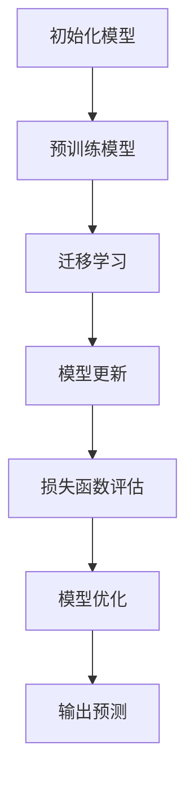

                 

### 文章标题

**一切皆是映射：探索基于模型的元学习方法**

在本文中，我们将深入探讨基于模型的元学习方法，这一主题涵盖了人工智能领域中最前沿的研究趋势之一。通过结合理论与实践，我们将详细解析元学习的基本概念、核心算法原理，以及其实际应用场景。文章将以逻辑清晰、结构紧凑、简单易懂的方式展开，旨在为读者提供一个全面的技术视角。

**关键词：**
- 基于模型的元学习
- 机器学习
- 人工智能
- 算法原理
- 应用场景

**摘要：**
本文围绕基于模型的元学习方法展开，首先介绍其背景与基本概念，然后深入分析核心算法原理及数学模型。接着，通过实际案例，我们将展示如何在项目中应用这些方法。最后，本文将探讨元学习方法的实际应用场景，并推荐相关学习资源和工具。通过阅读本文，读者将能够全面理解元学习方法的本质及其在人工智能领域的广泛应用前景。

---

### 1. 背景介绍

#### 元学习的定义

元学习（Meta-Learning），也称为“学习的学习”，是人工智能领域中的一个重要研究方向。其核心思想是通过学习如何快速适应新的任务，从而提高机器学习模型在新环境下的表现能力。具体来说，元学习关注的是如何构建一种学习算法，使其能够快速地从少量样本中学会新任务，并在类似任务上表现优异。

#### 元学习的起源与发展

元学习的概念最早可以追溯到20世纪70年代。当时，心理学家乔治·米勒（George A. Miller）提出了“通用问题解决者”（Universal Problem Solver，UPS）的理论，旨在通过一种通用方法解决各种不同的问题。这一理论为元学习的研究奠定了基础。随着计算机科学和人工智能的发展，元学习逐渐成为一个独立的研究领域，并得到了广泛关注。

#### 元学习的重要性

在人工智能领域，元学习的重要性不容忽视。首先，元学习可以帮助我们构建更高效的机器学习模型，使其能够快速适应新的数据和环境。其次，元学习可以减少对大规模标注数据的依赖，从而提高机器学习模型的泛化能力。最后，元学习在无人驾驶、游戏AI、自然语言处理等领域具有广泛的应用前景，有望推动这些领域的发展。

### 2. 核心概念与联系

#### 基于模型的元学习方法

基于模型的元学习方法是一种通过构建模型来学习如何学习的方法。该方法的核心思想是利用已有的模型结构来指导新的模型训练过程。通过这种方式，我们可以减少对新任务的训练时间，提高模型的泛化能力。

#### 基于模型的元学习方法原理

基于模型的元学习方法主要包括以下几个关键组成部分：

1. **模型架构**：基于模型的元学习方法通常采用深度学习模型，尤其是卷积神经网络（CNN）和循环神经网络（RNN）等复杂结构，以便更好地捕捉数据中的特征和模式。

2. **迁移学习**：迁移学习是元学习的一个重要组成部分，它通过利用已有的模型知识来加速新模型的训练过程。具体来说，我们可以将预训练模型中的部分参数直接用于新模型的训练，从而减少对新数据的依赖。

3. **模型更新**：在基于模型的元学习方法中，模型更新是一个关键步骤。通过不断更新模型参数，我们可以使模型更好地适应新的任务和数据。

4. **损失函数**：损失函数是衡量模型性能的重要指标。在基于模型的元学习方法中，损失函数通常用于评估模型在新任务上的表现，并指导模型的更新过程。

#### 基于模型的元学习方法的 Mermaid 流程图



#### 基于模型的元学习方法与深度学习的联系

基于模型的元学习方法与深度学习有着紧密的联系。深度学习模型为基于模型的元学习方法提供了强大的计算能力，使其能够更好地处理复杂的数据和任务。同时，基于模型的元学习方法也为深度学习模型提供了更高效的训练方法，从而提高模型的泛化能力。

### 3. 核心算法原理 & 具体操作步骤

#### 基于模型的元学习算法原理

基于模型的元学习算法主要包括以下几个关键步骤：

1. **数据准备**：首先，我们需要准备用于训练的数据集。这些数据集可以来自不同的任务，但需要具有一定的代表性，以便模型能够从中学习到通用特征。

2. **模型初始化**：接下来，我们需要初始化模型。通常，我们可以使用预训练模型作为初始模型，这样可以减少对新数据的依赖，提高模型的泛化能力。

3. **迁移学习**：在模型初始化之后，我们可以将预训练模型中的部分参数直接用于新模型的训练。这一步骤有助于加速新模型的训练过程，并提高模型的泛化能力。

4. **模型更新**：在迁移学习之后，我们需要更新模型参数，使其更好地适应新的任务和数据。这一步骤可以通过优化算法（如梯度下降）来实现。

5. **损失函数评估**：在模型更新之后，我们需要评估模型在新任务上的表现。这可以通过计算损失函数来实现。如果损失函数的值较低，说明模型在新任务上表现较好；反之，则说明模型需要进一步优化。

6. **模型优化**：根据损失函数的评估结果，我们可以进一步优化模型参数，使其在新任务上表现更好。

7. **输出预测**：最后，我们可以使用优化后的模型进行预测。这一步骤通常用于评估模型在新任务上的泛化能力。

#### 基于模型的元学习算法的具体操作步骤

1. **数据准备**：
    - 收集来自不同任务的数据集，例如图像分类、语音识别等。
    - 对数据集进行预处理，包括数据清洗、归一化等。

2. **模型初始化**：
    - 使用预训练模型作为初始模型，例如在图像分类任务中使用预训练的卷积神经网络。
    - 将预训练模型中的部分参数（如卷积层和全连接层）用于新模型的训练。

3. **迁移学习**：
    - 将预训练模型中的部分参数直接用于新模型的训练，从而减少对新数据的依赖。
    - 使用迁移学习算法（如迁移学习框架TensorFlow中的`Transfer Learning API`）来实现。

4. **模型更新**：
    - 使用优化算法（如梯度下降）更新模型参数，使其更好地适应新的任务和数据。
    - 计算模型在新的任务上的损失函数，并根据损失函数的值更新模型参数。

5. **损失函数评估**：
    - 计算模型在新任务上的损失函数，以评估模型在新任务上的表现。
    - 如果损失函数的值较低，说明模型在新任务上表现较好；反之，则说明模型需要进一步优化。

6. **模型优化**：
    - 根据损失函数的评估结果，进一步优化模型参数，使其在新任务上表现更好。
    - 可以通过调整学习率、增加训练次数等方法来优化模型。

7. **输出预测**：
    - 使用优化后的模型进行预测，以评估模型在新任务上的泛化能力。
    - 输出预测结果，例如图像分类任务的分类结果或语音识别任务的识别结果。

### 4. 数学模型和公式 & 详细讲解 & 举例说明

在基于模型的元学习方法中，数学模型和公式起着至关重要的作用。下面我们将详细介绍这些数学模型和公式，并通过具体例子进行说明。

#### 数学模型

基于模型的元学习方法的数学模型主要包括以下几个关键部分：

1. **损失函数**：损失函数用于评估模型在新任务上的表现。常见的损失函数包括交叉熵损失函数和均方误差损失函数。

2. **优化算法**：优化算法用于更新模型参数，以最小化损失函数。常见的优化算法包括梯度下降和随机梯度下降。

3. **模型更新公式**：模型更新公式用于计算新的模型参数。该公式通常基于梯度下降算法，可以表示为：

   $$\theta_{t+1} = \theta_{t} - \alpha \nabla_{\theta} J(\theta)$$

   其中，$\theta_{t}$表示第$t$次迭代的模型参数，$\theta_{t+1}$表示第$t+1$次迭代的模型参数，$\alpha$表示学习率，$J(\theta)$表示损失函数。

4. **迁移学习公式**：迁移学习公式用于将预训练模型中的部分参数用于新模型的训练。该公式可以表示为：

   $$\theta_{new} = \theta_{pretrained} + \theta_{update}$$

   其中，$\theta_{new}$表示新模型的参数，$\theta_{pretrained}$表示预训练模型的参数，$\theta_{update}$表示更新后的模型参数。

#### 详细讲解

下面我们将对上述数学模型和公式进行详细讲解。

1. **损失函数**：
   - **交叉熵损失函数**：交叉熵损失函数常用于分类任务，其公式为：

     $$J(\theta) = -\sum_{i=1}^{n} y_{i} \log(p_{i})$$

     其中，$y_{i}$表示真实标签，$p_{i}$表示模型预测的概率。

   - **均方误差损失函数**：均方误差损失函数常用于回归任务，其公式为：

     $$J(\theta) = \frac{1}{2} \sum_{i=1}^{n} (y_{i} - \theta_{i})^2$$

     其中，$y_{i}$表示真实值，$\theta_{i}$表示模型预测的值。

2. **优化算法**：
   - **梯度下降**：梯度下降是一种常用的优化算法，其基本思想是沿着损失函数的梯度方向更新模型参数。梯度下降的公式为：

     $$\theta_{t+1} = \theta_{t} - \alpha \nabla_{\theta} J(\theta)$$

     其中，$\alpha$表示学习率。

   - **随机梯度下降**：随机梯度下降是对梯度下降的一种改进，其基本思想是在每次迭代过程中随机选择一部分样本来计算梯度。随机梯度下降的公式为：

     $$\theta_{t+1} = \theta_{t} - \alpha \nabla_{\theta} J(\theta_{t})$$

3. **模型更新公式**：
   - 模型更新公式可以表示为：

     $$\theta_{t+1} = \theta_{t} - \alpha \nabla_{\theta} J(\theta)$$

     其中，$\alpha$表示学习率，$\nabla_{\theta} J(\theta)$表示损失函数的梯度。

4. **迁移学习公式**：
   - 迁移学习公式可以表示为：

     $$\theta_{new} = \theta_{pretrained} + \theta_{update}$$

     其中，$\theta_{new}$表示新模型的参数，$\theta_{pretrained}$表示预训练模型的参数，$\theta_{update}$表示更新后的模型参数。

#### 举例说明

假设我们有一个图像分类任务，使用卷积神经网络（CNN）作为模型。我们已经有了一个预训练的CNN模型，现在需要将其应用于一个新的图像分类任务。下面是一个具体的例子，说明如何使用基于模型的元学习方法进行迁移学习和模型更新。

1. **数据准备**：
   - 收集一个新的图像数据集，包含多个类别。
   - 对数据集进行预处理，包括图像缩放、归一化等。

2. **模型初始化**：
   - 使用预训练的CNN模型作为初始模型。
   - 将预训练模型中的卷积层和全连接层参数用于新模型的训练。

3. **迁移学习**：
   - 将预训练模型中的卷积层和全连接层参数直接用于新模型的训练。
   - 使用迁移学习框架（如TensorFlow中的`Transfer Learning API`）来实现。

4. **模型更新**：
   - 使用优化算法（如梯度下降）更新模型参数，使其更好地适应新的任务和数据。
   - 计算模型在新任务上的损失函数，并根据损失函数的值更新模型参数。

5. **损失函数评估**：
   - 计算模型在新任务上的损失函数，以评估模型在新任务上的表现。
   - 如果损失函数的值较低，说明模型在新任务上表现较好；反之，则说明模型需要进一步优化。

6. **模型优化**：
   - 根据损失函数的评估结果，进一步优化模型参数，使其在新任务上表现更好。
   - 可以通过调整学习率、增加训练次数等方法来优化模型。

7. **输出预测**：
   - 使用优化后的模型进行预测，以评估模型在新任务上的泛化能力。
   - 输出预测结果，例如图像分类任务的分类结果。

### 5. 项目实战：代码实际案例和详细解释说明

在本节中，我们将通过一个具体的Python代码案例，展示如何使用基于模型的元学习方法进行图像分类任务。我们将使用TensorFlow和Keras等深度学习框架来实现这一目标。

#### 开发环境搭建

首先，我们需要搭建一个适合深度学习开发的Python环境。以下是必要的步骤：

1. **安装Python**：确保Python已安装在您的系统上。建议使用Python 3.6或更高版本。

2. **安装TensorFlow**：使用pip安装TensorFlow：

   ```bash
   pip install tensorflow
   ```

3. **安装Keras**：Keras是一个高级神经网络API，可以方便地与TensorFlow集成。使用pip安装Keras：

   ```bash
   pip install keras
   ```

4. **安装其他依赖**：根据需要安装其他依赖项，例如NumPy、Matplotlib等。

#### 源代码详细实现和代码解读

下面是一个简单的基于模型的元学习图像分类任务的Python代码示例。我们将使用预训练的VGG16模型作为基础模型，并在其基础上进行迁移学习和模型更新。

```python
import numpy as np
import tensorflow as tf
from tensorflow.keras.applications import VGG16
from tensorflow.keras.preprocessing.image import ImageDataGenerator
from tensorflow.keras.optimizers import Adam
from tensorflow.keras.layers import Flatten, Dense
from tensorflow.keras.models import Model

# 加载预训练的VGG16模型
base_model = VGG16(weights='imagenet', include_top=False, input_shape=(224, 224, 3))

# 添加全连接层和softmax层作为新模型的顶层
x = Flatten()(base_model.output)
x = Dense(1024, activation='relu')(x)
predictions = Dense(num_classes, activation='softmax')(x)

# 创建新的模型
model = Model(inputs=base_model.input, outputs=predictions)

# 冻结VGG16模型的预训练层
for layer in base_model.layers:
    layer.trainable = False

# 编译模型
model.compile(optimizer=Adam(learning_rate=0.0001), loss='categorical_crossentropy', metrics=['accuracy'])

# 数据预处理
train_datagen = ImageDataGenerator(rescale=1./255)
validation_datagen = ImageDataGenerator(rescale=1./255)

# 加载训练数据和验证数据
train_generator = train_datagen.flow_from_directory(
        train_dir,
        target_size=(224, 224),
        batch_size=batch_size,
        class_mode='categorical')

validation_generator = validation_datagen.flow_from_directory(
        validation_dir,
        target_size=(224, 224),
        batch_size=batch_size,
        class_mode='categorical')

# 迁移学习训练模型
model.fit(
      train_generator,
      steps_per_epoch=nb_train_samples // batch_size,
      epochs=epochs,
      validation_data=validation_generator,
      validation_steps=nb_validation_samples // batch_size)
```

#### 代码解读与分析

1. **加载预训练的VGG16模型**：
   - 使用`VGG16`类加载预训练的VGG16模型。参数`weights='imagenet'`表示使用在ImageNet数据集上预训练的权重。

2. **添加全连接层和softmax层**：
   - 使用`Flatten`层将卷积神经网络的输出展平为一维向量。
   - 添加一个全连接层（`Dense`层），激活函数为ReLU。
   - 添加一个softmax层，用于输出类别概率。

3. **创建新的模型**：
   - 使用`Model`类创建一个新的模型，输入为VGG16模型的输入，输出为softmax层的输出。

4. **冻结VGG16模型的预训练层**：
   - 通过设置`trainable`属性为`False`，将VGG16模型的预训练层冻结，防止在迁移学习过程中更新这些层的参数。

5. **编译模型**：
   - 使用`compile`方法编译模型，指定优化器、损失函数和评估指标。

6. **数据预处理**：
   - 使用`ImageDataGenerator`类进行数据预处理，包括图像缩放和归一化。

7. **加载训练数据和验证数据**：
   - 使用`flow_from_directory`方法加

