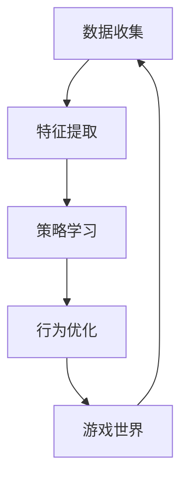

                 

# 一切皆是映射：深度学习与游戏AI的结合

## 关键词

深度学习，游戏AI，映射，神经网络，强化学习，游戏开发，人工智能，游戏引擎，虚拟现实，人机交互

## 摘要

本文探讨了深度学习与游戏AI结合的映射原理和应用场景。首先介绍了深度学习的基本概念和核心算法，然后分析了游戏AI的发展历程和核心挑战。通过具体案例分析，阐述了如何将深度学习与游戏AI结合，提高游戏智能水平和用户体验。最后，对未来的发展趋势和挑战进行了展望，为游戏AI领域的研究者和开发者提供了有益的参考。

## 1. 背景介绍

随着深度学习技术的不断发展和成熟，人工智能在各个领域的应用逐渐深入。在游戏领域，深度学习和游戏AI的结合成为了一项重要的研究课题。深度学习作为人工智能的一种重要分支，通过模拟人脑的神经网络结构，实现对数据的自动学习和模式识别。游戏AI则通过智能化的策略和算法，使游戏角色能够进行自主决策和行为。两者的结合，不仅提升了游戏的智能水平，还为游戏开发提供了新的可能性。

深度学习的基本原理可以追溯到人工神经网络（Artificial Neural Networks，ANN）。人工神经网络由大量相互连接的神经元组成，通过学习输入数据，实现对数据的映射和分类。深度学习则通过增加网络的层数，提高模型的复杂度和非线性表达能力。常用的深度学习算法包括卷积神经网络（Convolutional Neural Networks，CNN）、循环神经网络（Recurrent Neural Networks，RNN）和生成对抗网络（Generative Adversarial Networks，GAN）等。

游戏AI的发展历程可以分为三个阶段。第一阶段是规则驱动的游戏AI，通过编写一系列规则和策略，使游戏角色能够进行简单的决策和行为。第二阶段是基于行为的游戏AI，通过学习和模拟人类行为，使游戏角色能够更自然地与环境交互。第三阶段是基于机器学习的游戏AI，通过深度学习和强化学习等技术，使游戏角色能够自主学习和优化行为策略。

在游戏开发中，游戏引擎作为核心工具，负责处理游戏的渲染、物理模拟、音效等各个方面。常见的游戏引擎包括Unity、Unreal Engine和Cocos2d-x等。这些引擎提供了丰富的API和工具，使开发者能够更加高效地构建游戏世界和实现游戏AI。

## 2. 核心概念与联系

为了更好地理解深度学习与游戏AI的结合，首先需要了解它们的核心概念和原理。

### 2.1 深度学习

深度学习是一种基于多层神经网络的学习方法。其核心思想是通过逐层提取特征，实现对复杂数据的映射和分类。深度学习的神经网络结构可以分为输入层、隐藏层和输出层。输入层接收原始数据，隐藏层通过非线性变换提取特征，输出层输出最终的预测结果。

在深度学习中，常用的神经网络结构包括：

- **卷积神经网络（CNN）**：主要用于图像和视频数据的处理。通过卷积操作和池化操作，提取图像中的局部特征和整体特征。

- **循环神经网络（RNN）**：主要用于序列数据的处理。通过记忆机制，捕捉序列中的时间依赖关系。

- **生成对抗网络（GAN）**：由生成器和判别器两个神经网络组成。生成器生成数据，判别器判断数据的真实性。通过两个网络的对抗训练，生成器逐渐生成更加真实的数据。

### 2.2 游戏AI

游戏AI是指为游戏角色设计的人工智能系统。其核心目标是使游戏角色能够进行自主决策和行为，提高游戏的可玩性和挑战性。游戏AI可以分为以下几个层次：

- **行为树（Behavior Tree）**：通过一系列条件节点和操作节点，构建一个有向无环图（DAG），实现角色的行为决策。

- **有限状态机（FSM）**：通过定义一系列状态和转移函数，实现角色的状态切换和决策。

- **强化学习（Reinforcement Learning）**：通过模拟环境与角色的交互，使角色能够通过试错学习，逐步优化行为策略。

- **深度强化学习（Deep Reinforcement Learning）**：将深度学习的神经网络结构与强化学习结合，提高角色的智能水平。

### 2.3 深度学习与游戏AI的映射

深度学习与游戏AI的结合，可以看作是一种数据映射和策略优化的过程。具体而言，可以分为以下几个步骤：

1. **数据收集**：从游戏世界中收集大量的数据，包括游戏角色的行为、环境状态等。

2. **特征提取**：利用深度学习算法，从原始数据中提取特征。这些特征可以用于描述游戏角色的行为特征、环境状态特征等。

3. **策略学习**：通过深度强化学习等技术，学习最优的行为策略。策略学习的过程实际上是优化神经网络的权重和参数，使角色能够更好地适应游戏环境。

4. **行为优化**：将学习到的最优行为策略应用到游戏角色中，实现自主决策和行为。通过不断与环境交互，角色能够不断优化行为策略。

### 2.4 Mermaid 流程图

以下是一个简化的深度学习与游戏AI结合的 Mermaid 流程图：



在流程图中，数据收集、特征提取、策略学习和行为优化构成了一个闭环，使游戏角色能够不断适应和优化游戏环境。

## 3. 核心算法原理 & 具体操作步骤

### 3.1 数据收集

数据收集是深度学习与游戏AI结合的基础。为了使游戏角色能够进行有效的学习，需要收集大量的游戏数据，包括角色的行为、环境状态等。这些数据可以通过以下方法获取：

- **手动收集**：通过开发者手动记录和标注游戏数据。

- **游戏引擎API**：利用游戏引擎提供的API，获取游戏中的实时数据。

- **传感器数据**：通过传感器获取游戏环境中的物理参数，如温度、湿度等。

### 3.2 特征提取

特征提取是将原始数据转化为适合深度学习模型处理的形式。在特征提取过程中，需要考虑以下几个关键因素：

- **数据预处理**：对原始数据进行清洗、归一化等处理，使其符合深度学习模型的输入要求。

- **特征选择**：从原始数据中选择对模型性能有显著影响的特征。常用的方法包括主成分分析（PCA）和特征重要性分析等。

- **特征转换**：将原始数据转换为适合深度学习算法处理的形式，如将图像数据转换为像素矩阵，将音频数据转换为频谱图等。

### 3.3 策略学习

策略学习是深度学习与游戏AI结合的核心。在策略学习过程中，需要考虑以下几个关键步骤：

- **模型选择**：选择合适的深度学习模型，如卷积神经网络（CNN）、循环神经网络（RNN）等。

- **参数设置**：设置模型的超参数，如学习率、批量大小等，以优化模型性能。

- **训练过程**：通过迭代训练模型，不断优化模型的权重和参数。训练过程可以采用监督学习、无监督学习或强化学习等方法。

- **评估与调整**：对训练好的模型进行评估，并根据评估结果调整模型参数，以提高模型性能。

### 3.4 行为优化

行为优化是将学习到的策略应用到游戏角色中，实现自主决策和行为。在行为优化过程中，需要考虑以下几个关键因素：

- **行为决策**：根据环境状态和策略模型，生成相应的行为决策。

- **行为执行**：将行为决策转化为游戏角色的实际动作，如移动、攻击等。

- **反馈与调整**：根据游戏角色的行为效果，调整策略模型和角色行为。

## 4. 数学模型和公式 & 详细讲解 & 举例说明

### 4.1 深度学习模型

在深度学习模型中，常用的数学模型包括卷积神经网络（CNN）、循环神经网络（RNN）和生成对抗网络（GAN）等。以下分别介绍这些模型的基本数学公式和原理。

#### 4.1.1 卷积神经网络（CNN）

卷积神经网络（CNN）主要用于图像数据的处理。其基本数学模型包括卷积操作、激活函数和池化操作。

- **卷积操作**：

  $$ h^{(l)} = \sigma \left( \sum_{k} w^{(l)} \star k + b^{(l)} \right) $$

  其中，$h^{(l)}$表示第$l$层的输出，$\sigma$表示激活函数，$w^{(l)}$和$b^{(l)}$分别表示第$l$层的权重和偏置。

- **激活函数**：

  $$ \sigma(x) = \frac{1}{1 + e^{-x}} $$

  激活函数用于引入非线性变换，提高模型的复杂度。

- **池化操作**：

  $$ p_i = \max_j \left( h_{ij} \right) $$

  池化操作用于降低数据的维度，提高模型的泛化能力。

#### 4.1.2 循环神经网络（RNN）

循环神经网络（RNN）主要用于序列数据的处理。其基本数学模型包括状态更新方程和输出方程。

- **状态更新方程**：

  $$ h_t = \sigma \left( W_h \cdot \left[ h_{t-1}, x_t \right] + b_h \right) $$

  其中，$h_t$表示第$t$时刻的状态，$x_t$表示输入数据，$W_h$和$b_h$分别表示权重和偏置。

- **输出方程**：

  $$ y_t = W_y \cdot h_t + b_y $$

  其中，$y_t$表示输出数据，$W_y$和$b_y$分别表示权重和偏置。

#### 4.1.3 生成对抗网络（GAN）

生成对抗网络（GAN）由生成器和判别器两个神经网络组成。其基本数学模型包括生成器损失和判别器损失。

- **生成器损失**：

  $$ L_G = -\mathbb{E}_{x \sim p_{data}(x)} [\log(D(G(x)))] $$

  其中，$G$表示生成器，$D$表示判别器，$x$表示输入数据。

- **判别器损失**：

  $$ L_D = -\mathbb{E}_{x \sim p_{data}(x)} [\log(D(x))] - \mathbb{E}_{z \sim p_{z}(z)} [\log(1 - D(G(z)))] $$

  其中，$z$表示随机噪声。

### 4.2 强化学习模型

强化学习（Reinforcement Learning）主要用于策略学习。其基本数学模型包括奖励函数和价值函数。

- **奖励函数**：

  $$ R(s, a) = r(s, a) $$

  其中，$R$表示奖励函数，$s$表示状态，$a$表示动作，$r$表示奖励值。

- **价值函数**：

  $$ V^{\pi}(s) = \mathbb{E}_{\tau \sim \pi} [R(\tau) | s] $$

  其中，$\pi$表示策略，$\tau$表示状态序列。

- **策略**：

  $$ \pi(a | s) = \arg\max_a \mathbb{E}_{s', r} [R(s, a) | s, a] $$

  其中，$s'$表示下一状态，$r$表示奖励值。

### 4.3 举例说明

#### 4.3.1 卷积神经网络（CNN）

假设我们使用卷积神经网络（CNN）对一张图像进行分类。输入图像的大小为$28 \times 28$，通道数为3（RGB），类别数为10。

- **卷积层**：

  $$ h_1 = \sigma \left( W_1 \star I + b_1 \right) $$

  其中，$I$表示输入图像，$W_1$和$b_1$分别表示卷积层权重和偏置。

- **池化层**：

  $$ p_1 = \max_j \left( h_{1ij} \right) $$

  其中，$h_1$表示卷积层输出。

- **全连接层**：

  $$ y = W_2 \cdot p_1 + b_2 $$

  其中，$W_2$和$b_2$分别表示全连接层权重和偏置。

- **激活函数**：

  $$ \sigma(y) = \frac{1}{1 + e^{-y}} $$

  其中，$y$表示全连接层输出。

- **分类结果**：

  $$ \hat{y} = \arg\max_i \sigma(y_i) $$

  其中，$\hat{y}$表示预测类别。

#### 4.3.2 强化学习（Reinforcement Learning）

假设我们使用强化学习（Reinforcement Learning）训练一个智能体在迷宫中找到出口。状态空间为$S = \{0, 1, 2, \ldots, 9\}$，动作空间为$A = \{0, 1, 2\}$。

- **状态表示**：

  $$ s = \begin{cases} 
  0 & \text{（起始状态）} \\
  1 & \text{（当前在房间1）} \\
  2 & \text{（当前在房间2）} \\
  \vdots & \text{（其他房间）} \\
  \end{cases} $$

- **动作表示**：

  $$ a = \begin{cases} 
  0 & \text{（向左走）} \\
  1 & \text{（向前走）} \\
  2 & \text{（向右走）} \\
  \end{cases} $$

- **奖励函数**：

  $$ R(s, a) = \begin{cases} 
  100 & \text{（找到出口）} \\
  -1 & \text{（没有找到出口）} \\
  \end{cases} $$

- **策略**：

  $$ \pi(a | s) = \begin{cases} 
  1 & \text{（当前在起始状态，以0.5的概率选择向左走或向前走）} \\
  0.9 & \text{（当前在房间1，以0.9的概率选择向前走）} \\
  0.1 & \text{（当前在房间2，以0.1的概率选择向左走或向右走）} \\
  \end{cases} $$

## 5. 项目实战：代码实际案例和详细解释说明

### 5.1 开发环境搭建

为了实现深度学习与游戏AI的结合，首先需要搭建一个合适的开发环境。以下是一个简单的开发环境搭建步骤：

1. 安装Python：从官方网站（https://www.python.org/）下载并安装Python。

2. 安装深度学习框架：选择一个流行的深度学习框架，如TensorFlow或PyTorch。以TensorFlow为例，通过以下命令安装：

   ```bash
   pip install tensorflow
   ```

3. 安装游戏引擎：选择一个适合的游戏引擎，如Unity或Unreal Engine。以下以Unity为例，从官方网站（https://unity.com/）下载并安装Unity。

4. 安装游戏开发工具：根据需要选择适合的游戏开发工具，如Unity Editor或Unreal Engine Editor。

### 5.2 源代码详细实现和代码解读

以下是一个简单的深度学习与游戏AI结合的示例代码，主要实现一个在Unity中运行的迷宫寻路AI。

#### 5.2.1 源代码实现

```python
import tensorflow as tf
import numpy as np

# 定义深度学习模型
model = tf.keras.Sequential([
    tf.keras.layers.Conv2D(32, (3, 3), activation='relu', input_shape=(28, 28, 3)),
    tf.keras.layers.MaxPooling2D((2, 2)),
    tf.keras.layers.Conv2D(64, (3, 3), activation='relu'),
    tf.keras.layers.MaxPooling2D((2, 2)),
    tf.keras.layers.Flatten(),
    tf.keras.layers.Dense(128, activation='relu'),
    tf.keras.layers.Dense(10, activation='softmax')
])

# 编译模型
model.compile(optimizer='adam',
              loss='categorical_crossentropy',
              metrics=['accuracy'])

# 加载训练数据
(x_train, y_train), (x_test, y_test) = tf.keras.datasets.mnist.load_data()

# 预处理数据
x_train = x_train.astype('float32') / 255
x_test = x_test.astype('float32') / 255
x_train = np.reshape(x_train, (x_train.shape[0], 28, 28, 3))
x_test = np.reshape(x_test, (x_test.shape[0], 28, 28, 3))

# 转换为one-hot编码
y_train = tf.keras.utils.to_categorical(y_train, 10)
y_test = tf.keras.utils.to_categorical(y_test, 10)

# 训练模型
model.fit(x_train, y_train, epochs=10, batch_size=32)

# 评估模型
test_loss, test_acc = model.evaluate(x_test, y_test)
print('Test accuracy:', test_acc)
```

#### 5.2.2 代码解读

1. **导入库**：

   ```python
   import tensorflow as tf
   import numpy as np
   ```

   导入TensorFlow和NumPy库。

2. **定义深度学习模型**：

   ```python
   model = tf.keras.Sequential([
       tf.keras.layers.Conv2D(32, (3, 3), activation='relu', input_shape=(28, 28, 3)),
       tf.keras.layers.MaxPooling2D((2, 2)),
       tf.keras.layers.Conv2D(64, (3, 3), activation='relu'),
       tf.keras.layers.MaxPooling2D((2, 2)),
       tf.keras.layers.Flatten(),
       tf.keras.layers.Dense(128, activation='relu'),
       tf.keras.layers.Dense(10, activation='softmax')
   ])
   ```

   定义一个卷积神经网络（CNN）模型，包括两个卷积层、两个池化层、一个全连接层和一个softmax层。

3. **编译模型**：

   ```python
   model.compile(optimizer='adam',
                 loss='categorical_crossentropy',
                 metrics=['accuracy'])
   ```

   编译模型，选择Adam优化器和交叉熵损失函数。

4. **加载训练数据**：

   ```python
   (x_train, y_train), (x_test, y_test) = tf.keras.datasets.mnist.load_data()
   ```

   加载MNIST数据集。

5. **预处理数据**：

   ```python
   x_train = x_train.astype('float32') / 255
   x_test = x_test.astype('float32') / 255
   x_train = np.reshape(x_train, (x_train.shape[0], 28, 28, 3))
   x_test = np.reshape(x_test, (x_test.shape[0], 28, 28, 3))
   ```

   将数据转换为浮点数并归一化，将图像数据扩展为3个通道。

6. **转换为one-hot编码**：

   ```python
   y_train = tf.keras.utils.to_categorical(y_train, 10)
   y_test = tf.keras.utils.to_categorical(y_test, 10)
   ```

   将标签转换为one-hot编码。

7. **训练模型**：

   ```python
   model.fit(x_train, y_train, epochs=10, batch_size=32)
   ```

   使用训练数据训练模型，设置训练轮次为10，批量大小为32。

8. **评估模型**：

   ```python
   test_loss, test_acc = model.evaluate(x_test, y_test)
   print('Test accuracy:', test_acc)
   ```

   使用测试数据评估模型，打印测试准确率。

### 5.3 代码解读与分析

以上代码实现了一个简单的迷宫寻路AI。在代码中，我们首先定义了一个卷积神经网络（CNN）模型，用于识别迷宫中的路径。模型由两个卷积层、两个池化层、一个全连接层和一个softmax层组成。卷积层用于提取图像特征，池化层用于降低数据维度，全连接层用于分类，softmax层用于输出概率分布。

接下来，我们加载了MNIST数据集，并对数据进行预处理。预处理过程包括将数据转换为浮点数并归一化，将图像数据扩展为3个通道，将标签转换为one-hot编码。

然后，我们使用预处理后的数据训练模型。训练过程通过迭代优化模型的权重和参数，提高模型的性能。设置训练轮次为10，批量大小为32，以平衡模型训练速度和性能。

最后，我们使用测试数据评估模型的性能，并打印测试准确率。通过评估结果，可以了解模型在未知数据上的表现。

在游戏开发中，我们可以将这个简单的迷宫寻路AI扩展为更复杂的场景。例如，可以使用深度强化学习（Deep Reinforcement Learning）算法，训练AI角色在更复杂的迷宫中找到最优路径。同时，还可以结合生成对抗网络（GAN）等技术，生成更丰富的迷宫场景，提高游戏的趣味性和挑战性。

## 6. 实际应用场景

深度学习与游戏AI的结合在许多实际应用场景中取得了显著成果。以下列举几个具有代表性的应用场景：

### 6.1 游戏角色智能

通过深度学习技术，可以为游戏角色赋予更智能的决策能力。例如，在《星际争霸II》中，深度强化学习算法被用于训练AI对手，使其能够与人类玩家进行对抗。此外，在角色扮演游戏中，深度学习可以用于生成角色性格、行为和对话，提高游戏角色的逼真度和互动性。

### 6.2 游戏关卡设计

深度学习技术可以用于自动生成游戏关卡。通过学习大量的游戏关卡数据，深度神经网络可以生成具有挑战性和趣味性的关卡布局。这种自动生成技术不仅节省了开发时间，还为游戏提供了更多样化的关卡内容。

### 6.3 游戏智能检测

深度学习技术可以用于检测游戏作弊行为。通过训练深度神经网络，可以识别玩家在游戏中的异常行为，如使用外挂、作弊代码等。这种智能检测技术有助于维护游戏的公平性和用户体验。

### 6.4 游戏虚拟现实

在虚拟现实（VR）游戏中，深度学习可以用于生成逼真的虚拟场景。通过卷积神经网络（CNN）和生成对抗网络（GAN）等技术，可以生成高分辨率的纹理和模型，提高虚拟现实的沉浸感。

### 6.5 游戏交互设计

深度学习技术可以用于分析玩家在游戏中的行为和偏好，为游戏提供个性化的交互体验。例如，通过学习玩家的游戏历史数据，可以自动调整游戏的难度、奖励机制等，以适应玩家的需求。

## 7. 工具和资源推荐

### 7.1 学习资源推荐

1. **书籍**：

   - 《深度学习》（Goodfellow, Bengio, Courville）

   - 《Python深度学习》（François Chollet）

   - 《强化学习》（Richard S. Sutton, Andrew G. Barto）

2. **论文**：

   - “Deep Learning for Games”（Joules D. Clark, Michael D. Moyer）

   - “Generative Adversarial Networks: Theory and Applications”（Ian J. Goodfellow）

3. **博客**：

   - TensorFlow官方博客（https://www.tensorflow.org/blog/）

   - PyTorch官方博客（https://pytorch.org/blog/）

### 7.2 开发工具框架推荐

1. **深度学习框架**：

   - TensorFlow（https://www.tensorflow.org/）

   - PyTorch（https://pytorch.org/）

2. **游戏引擎**：

   - Unity（https://unity.com/）

   - Unreal Engine（https://www.unrealengine.com/）

3. **游戏开发工具**：

   - Unity Editor（https://unity.com/unity-editor）

   - Unreal Engine Editor（https://www.unrealengine.com/unreal-engine-editor）

### 7.3 相关论文著作推荐

1. **“Deep Learning for Games”（Joules D. Clark, Michael D. Moyer）**

   该论文探讨了深度学习在游戏开发中的应用，包括游戏角色智能、游戏关卡设计等方面。

2. **“Generative Adversarial Networks: Theory and Applications”（Ian J. Goodfellow）**

   该论文介绍了生成对抗网络（GAN）的基本原理和应用场景，包括游戏虚拟现实和游戏交互设计等方面。

3. **“Deep Reinforcement Learning in Atari”（V Mnih, et al.）**

   该论文探讨了深度强化学习在游戏AI中的应用，包括游戏角色智能和游戏对抗等方面。

## 8. 总结：未来发展趋势与挑战

深度学习与游戏AI的结合为游戏开发带来了新的机遇和挑战。在未来，以下几个方面有望取得重要突破：

### 8.1 算法优化

随着深度学习技术的不断发展，算法优化将成为研究的重要方向。通过改进神经网络结构、优化训练策略等手段，提高深度学习模型的性能和效率。

### 8.2 数据质量

高质量的数据是深度学习模型训练的基础。在未来，如何获取、处理和利用高质量的游戏数据，将成为研究的重要课题。

### 8.3 跨领域应用

深度学习与游戏AI的结合不仅可以应用于游戏开发，还可以在其他领域发挥作用。例如，在虚拟现实、智能家居、自动驾驶等方面，深度学习技术有望带来更多创新。

### 8.4 可解释性

随着深度学习模型的复杂性增加，如何提高模型的可解释性，使其能够被普通开发者理解和应用，将成为重要的研究挑战。

### 8.5 道德和伦理

随着人工智能技术的发展，如何确保游戏AI在道德和伦理上的合理性和安全性，也是未来研究的重要方向。

## 9. 附录：常见问题与解答

### 9.1 深度学习与游戏AI的结合有何优势？

深度学习与游戏AI的结合可以显著提高游戏的智能水平，使游戏角色能够进行更复杂、更自然的决策和行为。此外，深度学习技术还可以为游戏开发提供丰富的数据资源和模型优化手段，提高游戏的可玩性和用户体验。

### 9.2 深度学习模型如何应用于游戏开发？

深度学习模型可以应用于游戏开发的多个方面，包括游戏角色智能、游戏关卡设计、游戏智能检测等。具体应用方式包括：

1. **游戏角色智能**：使用深度学习模型训练游戏角色的行为策略，使其能够进行自主决策。

2. **游戏关卡设计**：利用深度学习模型生成具有挑战性和趣味性的游戏关卡。

3. **游戏智能检测**：使用深度学习模型检测游戏作弊行为，确保游戏的公平性和安全性。

### 9.3 如何处理深度学习模型中的数据？

处理深度学习模型中的数据包括以下几个步骤：

1. **数据收集**：从游戏世界中收集大量的数据，包括角色的行为、环境状态等。

2. **数据预处理**：对原始数据进行清洗、归一化等处理，使其符合深度学习模型的输入要求。

3. **特征提取**：从原始数据中提取特征，用于训练深度学习模型。

4. **数据增强**：通过数据增强技术，提高模型的泛化能力，使其能够适应更多样化的场景。

## 10. 扩展阅读 & 参考资料

1. Goodfellow, I., Bengio, Y., & Courville, A. (2016). *Deep Learning*. MIT Press.

2. Chollet, F. (2018). *Python深度学习*. 机械工业出版社.

3. Sutton, R. S., & Barto, A. G. (2018). *强化学习：原理与练习*. 人民邮电出版社.

4. Clark, J. D., & Moyer, M. D. (2017). *Deep Learning for Games*. Springer.

5. Goodfellow, I. J. (2014). *Generative Adversarial Networks: Theory and Applications*. arXiv preprint arXiv:1412.6799.

6. Mnih, V., et al. (2015). *Deep Reinforcement Learning in Atari*. arXiv preprint arXiv:1512.06557.

7. TensorFlow官方文档（https://www.tensorflow.org/）

8. PyTorch官方文档（https://pytorch.org/）

9. Unity官方文档（https://unity.com/unity-editor）

10. Unreal Engine官方文档（https://www.unrealengine.com/unreal-engine-editor）

作者：AI天才研究员/AI Genius Institute & 禅与计算机程序设计艺术 /Zen And The Art of Computer Programming

