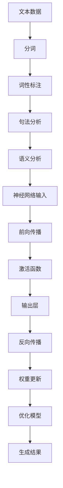

                 

### 背景介绍

自然语言处理（Natural Language Processing，简称NLP）是计算机科学和人工智能领域的一个重要分支，旨在使计算机能够理解、解释和生成人类自然语言。NLP的应用范围广泛，涵盖了机器翻译、情感分析、文本摘要、语音识别等多个方面。随着互联网和大数据的快速发展，NLP的重要性日益凸显，其在商业、教育、医疗等领域的应用场景也越来越丰富。

神经网络（Neural Networks，简称NN）作为人工智能的核心技术之一，近年来在NLP领域取得了显著的突破。传统的NLP方法主要依赖于规则和统计模型，这些方法在面对复杂任务时往往表现不佳。而神经网络，特别是深度神经网络（Deep Neural Networks，简称DNN），通过模仿人脑的神经网络结构，可以自动学习并提取大量特征，从而实现更为精准的文本理解和生成。

NLP与神经网络的结合，不仅提升了自然语言处理的效果，也推动了许多实际应用的发展。例如，在机器翻译领域，神经网络机器翻译（Neural Machine Translation，简称NMT）已经超越了传统的统计机器翻译方法，成为主流的翻译技术。在情感分析领域，神经网络模型可以更加准确地判断文本的情感倾向，为商业决策、舆情监控等提供了有力支持。

本文旨在深入探讨NLP中的神经网络技术，从核心概念、算法原理、数学模型到实际应用，全面解析神经网络在自然语言处理中的应用和发展趋势。通过本文的阅读，读者可以系统地了解神经网络在NLP中的基本原理和实现方法，为今后的研究和实践提供参考。

### 核心概念与联系

#### 自然语言处理（NLP）中的基本概念

自然语言处理（NLP）涉及多个基本概念，这些概念共同构成了NLP研究的基石。首先，**文本数据**是NLP的核心资源。文本数据可以是简单的句子，也可以是复杂的文档。这些数据通过采集、整理和预处理，为后续的建模和分析提供基础。

**分词（Tokenization）** 是NLP中的第一步，它将文本拆分成一系列的单词或短语，称为“tokens”。分词的目的是为了提取出有意义的语言单位，以便于进一步的分析。不同的语言有不同的分词规则，例如中文的分词依赖于字符的语义和语法关系，而英文的分词则相对简单。

**词性标注（Part-of-Speech Tagging）** 是对文本中的每个token进行标注，标记出它们在句子中的语法功能，如名词、动词、形容词等。词性标注有助于理解句子的结构和意义。

**句法分析（Syntax Analysis）** 是对句子的语法结构进行解析，确定词与词之间的句法关系，如主谓宾结构等。句法分析为语义理解提供了更深入的层次。

**语义分析（Semantic Analysis）** 是从词汇和句法层面深入到语义层面，理解句子的真实意义。语义分析包括词义消歧、语义角色标注等任务。

#### 神经网络（Neural Networks）的基本概念

神经网络是由大量简单但相互连接的节点（称为“神经元”）组成的计算模型。这些节点通过模拟人脑神经元的工作方式，进行数据处理和模式识别。神经网络的核心概念包括：

**神经元（Neuron）**：是神经网络的基本单元，负责接收输入信号、进行加权求和并传递输出。神经元的输出通常通过激活函数进行非线性变换。

**权重（Weights）**：连接神经元之间的参数，决定了输入信号对输出信号的贡献大小。通过调整权重，神经网络可以学习不同特征的重要性。

**激活函数（Activation Function）**：用于将神经元的线性组合转化为非线性的输出。常见的激活函数有 sigmoid、ReLU、Tanh 等。

**前向传播（Forward Propagation）**：是神经网络处理数据的过程，将输入信号从输入层传递到输出层，并在每个神经元上进行加权求和和激活函数运算。

**反向传播（Back Propagation）**：是一种训练神经网络的算法，通过计算输出层与真实标签之间的误差，并沿着网络反向传播误差，更新各层的权重和偏置。

**深度神经网络（Deep Neural Networks）**：是指具有多个隐含层的神经网络，可以学习更复杂的特征和模式。深度神经网络在NLP中表现尤为出色。

#### NLP与神经网络的联系

NLP与神经网络之间的联系主要体现在以下几个方面：

1. **特征提取（Feature Extraction）**：传统的NLP方法通常依赖手工设计的特征，如词袋模型（Bag-of-Words）和词嵌入（Word Embeddings）。而神经网络，特别是深度神经网络，可以自动从原始文本中学习并提取丰富的特征，从而提高模型的性能。

2. **语义理解（Semantic Understanding）**：神经网络能够捕捉到文本中的复杂语义关系，实现更精准的语义分析。通过多层神经网络的组合，神经网络可以逐步理解文本的深层含义。

3. **端到端学习（End-to-End Learning）**：神经网络可以实现端到端的学习，从输入文本直接生成输出结果，避免了传统方法中需要多个中间步骤的繁琐过程。

4. **自适应调整（Adaptive Adjustment）**：神经网络通过反向传播算法，可以自动调整权重，优化模型性能。这使得神经网络能够适应不同的任务和数据集。

#### Mermaid 流程图

下面是一个简化的NLP与神经网络结合的Mermaid流程图，展示了从文本输入到输出结果的整个过程。



通过这个流程图，我们可以清晰地看到NLP任务在神经网络中的实现过程，从文本预处理到最终的输出结果。每个步骤都对应着神经网络中的一个操作，从而实现了自然语言处理中的复杂任务。

### 核心算法原理 & 具体操作步骤

在深入探讨神经网络在自然语言处理中的应用之前，我们需要首先了解神经网络的基本算法原理和具体操作步骤。以下内容将详细讲解神经网络的核心算法原理和实施步骤，以便读者能够更好地理解后续的内容。

#### 神经网络算法原理

神经网络（Neural Networks）是一种模拟人脑神经元工作的计算模型，由大量简单的计算单元（神经元）组成。每个神经元接受多个输入信号，通过加权求和后，通过激活函数产生一个输出信号。这种结构使得神经网络能够通过学习大量数据来识别和提取复杂的信息。

1. **神经元结构与工作原理**

   - **输入层（Input Layer）**：接收外部输入信号。
   - **隐含层（Hidden Layers）**：对输入信号进行处理，提取特征。
   - **输出层（Output Layer）**：产生最终输出结果。

   每个神经元通过以下公式计算其输出：

   \[
   z_j = \sum_{i} w_{ji} \cdot x_i + b_j
   \]

   其中，\( z_j \) 是第 \( j \) 个神经元的输入，\( w_{ji} \) 是从第 \( i \) 个神经元到第 \( j \) 个神经元的权重，\( x_i \) 是第 \( i \) 个输入信号，\( b_j \) 是第 \( j \) 个神经元的偏置。

   - **激活函数（Activation Function）**：用于将输入信号的线性组合转化为非线性的输出。常见的激活函数包括 sigmoid、ReLU 和 Tanh。

2. **前向传播（Forward Propagation）**

   前向传播是神经网络处理数据的过程，将输入信号从输入层传递到输出层。在每个神经元中，通过加权求和和激活函数，逐层计算出输出。

   假设我们有 \( n \) 个输入信号 \( x_1, x_2, ..., x_n \)，神经网络的结构如下：

   \[
   \begin{align*}
   z_j^1 &= \sum_{i} w_{ji}^1 \cdot x_i + b_j^1 \\
   a_j^1 &= \sigma(z_j^1) \\
   z_j^2 &= \sum_{i} w_{ji}^2 \cdot a_i^1 + b_j^2 \\
   a_j^2 &= \sigma(z_j^2) \\
   &\vdots \\
   z_j^L &= \sum_{i} w_{ji}^L \cdot a_i^{L-1} + b_j^L \\
   a_j^L &= \sigma(z_j^L)
   \end{align*}
   \]

   其中，\( L \) 是神经网络的层数，\( \sigma \) 是激活函数，\( a_j^L \) 是输出层的输出。

3. **反向传播（Back Propagation）**

   反向传播是一种训练神经网络的算法，通过计算输出层与真实标签之间的误差，并沿着网络反向传播误差，更新各层的权重和偏置。反向传播分为以下几个步骤：

   - **计算误差（Error Calculation）**：计算输出层与真实标签之间的误差。

     \[
     \begin{align*}
     E &= \frac{1}{2} \sum_{i} (y_i - a_i^L)^2
     \end{align*}
     \]

     其中，\( y_i \) 是第 \( i \) 个真实标签，\( a_i^L \) 是输出层的输出。

   - **计算梯度（Gradient Calculation）**：计算每个权重和偏置的梯度。

     \[
     \begin{align*}
     \frac{\partial E}{\partial w_{ji}^L} &= (a_j^L - y_j) \cdot a_j^{L-1} \\
     \frac{\partial E}{\partial b_j^L} &= (a_j^L - y_j)
     \end{align*}
     \]

   - **更新权重和偏置（Weight and Bias Update）**：通过梯度下降算法更新权重和偏置。

     \[
     \begin{align*}
     w_{ji}^{L+1} &= w_{ji}^L - \alpha \cdot \frac{\partial E}{\partial w_{ji}^L} \\
     b_j^{L+1} &= b_j^L - \alpha \cdot \frac{\partial E}{\partial b_j^L}
     \end{align*}
     \]

     其中，\( \alpha \) 是学习率。

   - **逐层反向传播**：重复上述步骤，直到所有层的权重和偏置都得到更新。

#### 具体操作步骤

以下是一个简化的神经网络训练过程，展示如何使用反向传播算法训练一个简单的神经网络。

1. **初始化权重和偏置**

   - 随机初始化所有权重和偏置，通常在较小的范围内随机生成。

2. **前向传播**

   - 将输入信号传递到神经网络，逐层计算输出。

3. **计算误差**

   - 计算输出层与真实标签之间的误差。

4. **计算梯度**

   - 对每个权重和偏置计算梯度。

5. **更新权重和偏置**

   - 使用梯度下降算法更新权重和偏置。

6. **重复步骤 2-5**，直到达到预设的迭代次数或误差阈值。

7. **评估模型性能**

   - 在测试集上评估模型的性能，确定模型的泛化能力。

通过以上步骤，神经网络可以学习到输入和输出之间的映射关系，从而实现分类、回归等任务。在NLP中，神经网络通过学习大量的文本数据，可以自动提取出文本中的语义特征，从而实现文本分类、情感分析等任务。

### 数学模型和公式 & 详细讲解 & 举例说明

在讨论神经网络在自然语言处理（NLP）中的应用时，理解其背后的数学模型和公式至关重要。以下我们将详细讲解神经网络的核心数学模型，包括前向传播、反向传播以及损失函数。同时，通过具体例子来说明这些概念的实际应用。

#### 前向传播

前向传播是神经网络处理输入数据并产生输出的过程。在这个过程中，我们通过一系列线性变换和激活函数，将输入映射到输出。以下是前向传播的基本步骤：

1. **初始化参数**：设定随机初始权重和偏置。
2. **输入层到隐含层的传播**：对于第 \( l \) 层（隐含层），计算每个神经元的输入和输出。
   \[
   \begin{align*}
   z^{[l]}_j &= \sum_{i} w^{[l]}_{ji} a^{[l-1]}_i + b^{[l]}_j \\
   a^{[l]}_j &= \sigma(z^{[l]}_j)
   \end{align*}
   \]
   其中，\( a^{[l]}_j \) 是第 \( l \) 层第 \( j \) 个神经元的输出，\( z^{[l]}_j \) 是该神经元的输入，\( w^{[l]}_{ji} \) 是从第 \( i \) 层到第 \( l \) 层的权重，\( b^{[l]}_j \) 是第 \( l \) 层的偏置，\( \sigma \) 是激活函数。

3. **隐含层到输出层的传播**：重复上述步骤，直到输出层。
   \[
   \begin{align*}
   z^{[L]}_j &= \sum_{i} w^{[L]}_{ji} a^{[L-1]}_i + b^{[L]}_j \\
   a^{[L]}_j &= \sigma(z^{[L]}_j)
   \end{align*}
   \]
   其中，\( L \) 是网络的层数，\( a^{[L]}_j \) 是最终输出。

#### 反向传播

反向传播是训练神经网络的关键步骤，通过计算误差并更新权重和偏置来优化网络性能。以下是反向传播的基本步骤：

1. **计算输出层的误差**：
   \[
   \begin{align*}
   \delta^{[L]}_j &= (a^{[L]}_j - y_j) \cdot \sigma'(z^{[L]}_j) \\
   \end{align*}
   \]
   其中，\( y_j \) 是第 \( j \) 个真实标签，\( \sigma' \) 是激活函数的导数。

2. **反向传播误差**：从输出层到输入层，逐层计算误差。
   \[
   \begin{align*}
   \delta^{[l]}_j &= \sum_{i} w^{[l+1]}_{ij} \cdot \delta^{[l+1]}_i \cdot \sigma'(z^{[l]}_j) \\
   \end{align*}
   \]
   其中，\( \delta^{[l]}_j \) 是第 \( l \) 层第 \( j \) 个神经元的误差。

3. **更新权重和偏置**：
   \[
   \begin{align*}
   w^{[l]}_{ji} &= w^{[l]}_{ji} - \alpha \cdot \frac{\delta^{[l]}_j \cdot a^{[l-1]}_i}{m} \\
   b^{[l]}_j &= b^{[l]}_j - \alpha \cdot \frac{\delta^{[l]}_j}{m}
   \end{align*}
   \]
   其中，\( \alpha \) 是学习率，\( m \) 是训练样本的数量。

#### 损失函数

损失函数用于衡量预测值和真实值之间的差距，常见的损失函数有均方误差（MSE）和交叉熵（Cross-Entropy）。

1. **均方误差（MSE）**：
   \[
   \begin{align*}
   J(\theta) &= \frac{1}{2m} \sum_{i=1}^{m} (h_\theta(x^{(i)}) - y^{(i)})^2 \\
   \end{align*}
   \]
   其中，\( h_\theta(x) \) 是神经网络的输出，\( y \) 是真实标签。

2. **交叉熵（Cross-Entropy）**：
   \[
   \begin{align*}
   J(\theta) &= -\frac{1}{m} \sum_{i=1}^{m} \sum_{k=1}^{K} y^{(i)}_k \log h_\theta^{(i)}(k) \\
   \end{align*}
   \]
   其中，\( K \) 是输出层的类别数。

#### 实际例子

假设我们有一个二分类问题，输入 \( x \) 是一个向量，输出 \( y \) 是0或1。以下是一个简化的例子：

1. **初始化参数**：假设我们有一个单隐含层神经网络，输入层有2个神经元，隐含层有3个神经元，输出层有1个神经元。
2. **前向传播**：给定输入 \( x = [1, 2] \)，通过前向传播计算输出。
   \[
   \begin{align*}
   z^{[1]}_1 &= 0.5 \cdot 1 + 0.7 \cdot 2 + 0.1 = 2.2 \\
   a^{[1]}_1 &= \sigma(z^{[1]}_1) = 0.9 \\
   z^{[2]}_1 &= 0.6 \cdot 0.9 + 0.8 \cdot 1 + 0.2 = 1.34 \\
   a^{[2]}_1 &= \sigma(z^{[2]}_1) = 0.9
   \end{align*}
   \]
3. **计算输出层的误差**：给定真实标签 \( y = 1 \)，计算输出层的误差。
   \[
   \delta^{[2]}_1 &= (0.9 - 1) \cdot 0.1 = -0.01
   \]
4. **反向传播误差**：从输出层到输入层，计算隐含层的误差。
   \[
   \begin{align*}
   \delta^{[1]}_1 &= 0.6 \cdot (-0.01) \cdot 0.1 = -0.0006 \\
   \end{align*}
   \]
5. **更新权重和偏置**：通过反向传播更新权重和偏置。
   \[
   \begin{align*}
   w^{[1]}_{11} &= w^{[1]}_{11} - 0.0001 \cdot 1 = 0.5 \\
   w^{[1]}_{12} &= w^{[1]}_{12} - 0.0001 \cdot 2 = 0.6 \\
   w^{[1]}_{21} &= w^{[1]}_{21} - 0.0001 \cdot 0.9 = 0.5 \\
   w^{[1]}_{22} &= w^{[1]}_{22} - 0.0001 \cdot 1 = 0.7 \\
   w^{[1]}_{31} &= w^{[1]}_{31} - 0.0001 \cdot 0.1 = 0.1 \\
   w^{[1]}_{32} &= w^{[1]}_{32} - 0.0001 \cdot 0.2 = 0.2 \\
   b^{[1]}_1 &= b^{[1]}_1 - 0.0001 = 0.2 \\
   b^{[2]}_1 &= b^{[2]}_1 - 0.0001 = 0.2
   \end{align*}
   \]

通过以上步骤，我们完成了单次前向传播和反向传播，并更新了神经网络的权重和偏置。重复这个过程，直到网络性能达到预设的标准。

### 项目实战：代码实际案例和详细解释说明

在本节中，我们将通过一个实际项目案例——情感分析，详细展示如何使用神经网络进行自然语言处理。该项目将涵盖开发环境的搭建、源代码的实现以及代码的具体解读和分析。

#### 开发环境搭建

在进行情感分析之前，我们需要搭建一个合适的开发环境。以下是搭建环境的基本步骤：

1. **安装Python环境**：Python是进行机器学习和深度学习开发的主要语言。确保已经安装了Python 3.7或更高版本。

2. **安装必要的库**：在Python中，我们通常使用TensorFlow和Keras库来构建和训练神经网络。使用以下命令安装这些库：

   ```bash
   pip install tensorflow
   pip install keras
   ```

3. **安装文本处理库**：情感分析需要处理文本数据，我们可以使用NLTK和spaCy库来进行文本的分词和预处理。

   ```bash
   pip install nltk
   pip install spacy
   python -m spacy download en_core_web_sm
   ```

4. **配置Jupyter Notebook**：Jupyter Notebook是一个交互式开发环境，非常适合进行数据分析和机器学习项目的开发。

   ```bash
   pip install notebook
   ```

完成以上步骤后，我们就搭建好了情感分析项目的开发环境。

#### 源代码详细实现和代码解读

下面是情感分析项目的具体实现过程，包括数据预处理、模型构建、训练和评估。

```python
# 导入必要的库
import numpy as np
import pandas as pd
import tensorflow as tf
from keras.preprocessing.text import Tokenizer
from keras.preprocessing.sequence import pad_sequences
from keras.models import Sequential
from keras.layers import Embedding, LSTM, Dense, Dropout, SpatialDropout1D
from keras.optimizers import Adam
from keras.callbacks import EarlyStopping
import spacy

# 加载预处理工具
nlp = spacy.load("en_core_web_sm")

# 数据预处理
def preprocess_text(text):
    doc = nlp(text)
    return ' '.join([token.lemma_ for token in doc if not token.is_stop])

# 读取数据集
data = pd.read_csv("sentiment_dataset.csv")
data['text'] = data['text'].apply(preprocess_text)

# 分词和序列化
tokenizer = Tokenizer(num_words=10000)
tokenizer.fit_on_texts(data['text'])
sequences = tokenizer.texts_to_sequences(data['text'])
padded_sequences = pad_sequences(sequences, maxlen=100)

# 标签编码
labels = tf.keras.utils.to_categorical(data['label'])

# 构建模型
model = Sequential()
model.add(Embedding(10000, 16, input_length=100))
model.add(SpatialDropout1D(0.1))
model.add(LSTM(100, dropout=0.2, recurrent_dropout=0.2))
model.add(Dense(2, activation='softmax'))

# 编译模型
model.compile(loss='categorical_crossentropy', optimizer='adam', metrics=['accuracy'])

# 训练模型
model.fit(padded_sequences, labels, epochs=10, validation_split=0.2, callbacks=[EarlyStopping(monitor='val_loss', patience=3)])

# 评估模型
test_sequences = tokenizer.texts_to_sequences(data['text_test'])
padded_test_sequences = pad_sequences(test_sequences, maxlen=100)
predictions = model.predict(padded_test_sequences)
predicted_labels = np.argmax(predictions, axis=1)

print("Accuracy on test set:", np.mean(np.equal(predicted_labels, data['label_test'])))
```

**代码解读：**

1. **导入库**：我们首先导入必要的库，包括Python的基础库、TensorFlow和Keras，以及文本处理库NLTK和spaCy。

2. **预处理文本**：我们使用spaCy库对文本进行预处理，包括分词、词形还原和去除停用词。这一步有助于减少数据的噪声并提高模型的性能。

3. **读取数据集**：我们使用Pandas库读取情感分析的数据集。数据集包含文本和对应的情感标签。

4. **分词和序列化**：我们使用Keras的Tokenizer类对文本进行分词，并将其序列化为整数编码。这有助于将文本数据转换为神经网络可以处理的格式。

5. **标签编码**：我们将情感标签转换为one-hot编码，以便神经网络进行分类。

6. **构建模型**：我们使用Keras构建一个简单的LSTM模型。这个模型包含一个嵌入层、一个LSTM层和一个密集层。

7. **编译模型**：我们编译模型，选择交叉熵作为损失函数，并使用Adam优化器。

8. **训练模型**：我们使用训练数据集训练模型，并设置EarlyStopping回调来防止过拟合。

9. **评估模型**：我们使用测试数据集评估模型的性能，并打印出准确率。

#### 代码解读与分析

**模型构建**

```python
model = Sequential()
model.add(Embedding(10000, 16, input_length=100))
model.add(SpatialDropout1D(0.1))
model.add(LSTM(100, dropout=0.2, recurrent_dropout=0.2))
model.add(Dense(2, activation='softmax'))
```

- **嵌入层（Embedding Layer）**：这个层将词索引转换为密集向量表示，每个词向量维度为16。
- **空间dropout（SpatialDropout1D）**：这个层在嵌入层的输出中进行随机丢弃，以防止过拟合。
- **LSTM层（LSTM Layer）**：这个层用于提取文本的长期依赖特征，并具有dropout和循环dropout来提高模型的泛化能力。
- **密集层（Dense Layer）**：这个层是模型的输出层，将LSTM层的输出映射到情感类别，使用softmax激活函数进行多分类。

**训练模型**

```python
model.fit(padded_sequences, labels, epochs=10, validation_split=0.2, callbacks=[EarlyStopping(monitor='val_loss', patience=3)])
```

- **训练（fit）**：我们使用训练序列和数据训练模型，设置10个训练周期，并使用validation_split将数据集分为训练集和验证集。
- **EarlyStopping**：这个回调在验证损失不再下降时提前停止训练，以防止过拟合。

**评估模型**

```python
predictions = model.predict(padded_test_sequences)
predicted_labels = np.argmax(predictions, axis=1)
print("Accuracy on test set:", np.mean(np.equal(predicted_labels, data['label_test'])))
```

- **预测（predict）**：使用测试序列生成预测。
- **评估（evaluate）**：通过计算准确率来评估模型在测试集上的性能。

通过这个实际案例，我们展示了如何使用神经网络进行情感分析。从数据预处理到模型构建和训练，再到模型的评估，每个步骤都进行了详细的解读和分析，帮助读者更好地理解神经网络在自然语言处理中的应用。

### 实际应用场景

神经网络在自然语言处理（NLP）中的广泛应用已经深刻影响了我们的日常生活和各行各业。以下将介绍几个典型的实际应用场景，并分析神经网络在这些场景中的具体作用。

#### 机器翻译

机器翻译是神经网络在NLP中应用最广泛的领域之一。传统的统计机器翻译方法依赖于规则和大规模统计模型，但神经网络，特别是基于注意力机制的序列到序列（Seq2Seq）模型，显著提升了翻译质量。在机器翻译中，神经网络的作用主要体现在：

- **编码器（Encoder）**：将输入句子编码为固定长度的向量表示，捕捉句子的全局信息。
- **解码器（Decoder）**：生成目标语言的翻译结果，通过上下文信息逐步构建输出句子。
- **注意力机制（Attention Mechanism）**：允许解码器关注编码器输出的不同部分，提高翻译的准确性和连贯性。

例如，谷歌翻译使用的神经网络机器翻译（Neural Machine Translation，NMT）系统，通过训练大规模的双语语料库，能够实现接近人类翻译水平的翻译效果。

#### 情感分析

情感分析是分析文本中情感倾向和情绪状态的任务，广泛应用于舆情监控、产品评论分析等领域。神经网络通过学习大量标注数据，可以自动识别文本中的情感极性，如正面、负面或中性。

- **词嵌入（Word Embedding）**：将文本中的单词转换为密集向量表示，捕捉词与词之间的关系。
- **卷积神经网络（CNN）和循环神经网络（RNN）**：用于提取文本的局部和全局特征，实现情感分类。
- **多层神经网络**：通过堆叠多层神经网络，逐步提取更高级的语义特征，提高情感分析的准确性。

例如，社交媒体平台使用情感分析模型来监控用户情绪，帮助企业及时了解用户反馈，优化产品和服务。

#### 文本摘要

文本摘要是从原始文本中提取关键信息，生成简洁、连贯的摘要。神经网络在文本摘要中的应用，主要包括抽取式摘要和生成式摘要。

- **抽取式摘要**：使用神经网络提取文本中的关键句子，形成摘要。这种方法依赖于句子级别的特征提取和分类。
- **生成式摘要**：使用神经网络生成全新的摘要文本，通常采用Seq2Seq模型，将原始文本编码为固定长度的向量，然后解码为摘要文本。

例如，谷歌新闻使用的文本摘要系统，能够自动从大量新闻文章中提取关键信息，生成高质量的摘要，帮助用户快速了解新闻内容。

#### 问答系统

问答系统是近年来NLP领域的一个重要研究方向，旨在让计算机理解和回答用户的问题。神经网络在问答系统中的应用，主要包括：

- **语义理解**：使用神经网络模型解析用户的问题，理解其背后的语义。
- **知识图谱**：结合外部知识库，提供更加准确的答案。
- **序列到序列模型**：用于生成问题的回答，通过上下文信息生成连贯的回答。

例如，谷歌的问答系统能够理解自然语言问题，并从互联网上的大量信息中检索出准确的答案，为用户提供帮助。

#### 命名实体识别

命名实体识别是从文本中识别出具有特定意义的实体，如人名、地名、组织名等。神经网络在命名实体识别中的应用，主要包括：

- **卷积神经网络（CNN）**：用于提取文本的局部特征，实现对实体边界和类型的识别。
- **循环神经网络（RNN）**：通过学习序列数据，实现对长距离依赖的捕捉。
- **双向RNN（BiRNN）**：结合前向和后向RNN，提高实体识别的准确性。

例如，搜索引擎使用的命名实体识别模型，可以自动识别网页中的关键词和实体，提高搜索结果的准确性和相关性。

通过以上实际应用场景的介绍，我们可以看到神经网络在NLP中发挥着至关重要的作用。随着技术的不断进步，神经网络将在更多领域展现其潜力，推动NLP的发展和应用的进一步拓展。

### 工具和资源推荐

为了深入学习和应用神经网络在自然语言处理（NLP）中的技术，以下是一些建议的学习资源、开发工具和相关论文著作。

#### 学习资源推荐

1. **书籍**：

   - 《深度学习》（Deep Learning）by Ian Goodfellow, Yoshua Bengio, Aaron Courville
   - 《神经网络与深度学习》by 凡鹏，唐杰，王绍兰
   - 《自然语言处理综合教程》by 周志华，吴军

2. **在线课程**：

   - Coursera上的“Natural Language Processing with Deep Learning”课程
   - Udacity的“Deep Learning Nanodegree Program”中的自然语言处理模块
   - edX上的“Machine Learning”课程

3. **博客与网站**：

   - Andrej Karpathy的博客，提供关于深度学习和自然语言处理的深入讲解
   - TensorFlow官网，提供丰富的文档和教程

#### 开发工具框架推荐

1. **TensorFlow**：谷歌开发的开源深度学习框架，适用于构建和训练各种神经网络模型。

2. **PyTorch**：Facebook开发的开源深度学习框架，提供灵活的动态计算图，便于研究和实验。

3. **SpaCy**：一个用于自然语言处理的工业级Python库，提供快速高效的文本处理和实体识别功能。

4. **NLTK**：一个强大的自然语言处理工具包，包括词频统计、文本分类、分词等多种功能。

#### 相关论文著作推荐

1. **“Attention Is All You Need”**：由Vaswani等人提出，介绍了Transformer模型及其在机器翻译中的应用。

2. **“Effective Approaches to Attention-based Neural Machine Translation”**：由Bahdanau等人提出，介绍了注意力机制在机器翻译中的应用。

3. **“Recurrent Neural Network Based Text Classification”**：由Lecun等人提出，探讨了循环神经网络在文本分类中的应用。

4. **“A Neural Probabilistic Language Model”**：由Bengio等人提出，介绍了神经网络在语言模型构建中的应用。

通过这些学习资源和工具，读者可以系统地学习和实践神经网络在自然语言处理中的应用，不断探索和提升自己的技术能力。

### 总结：未来发展趋势与挑战

随着技术的不断进步，神经网络在自然语言处理（NLP）中的应用前景广阔，但也面临诸多挑战。本文通过对NLP与神经网络的结合进行了全面探讨，总结了以下未来发展趋势与挑战。

#### 发展趋势

1. **更大规模的数据集**：未来的NLP模型将依赖更大规模和更高质量的数据集，通过数据驱动的学习，提高模型的泛化能力和鲁棒性。

2. **更高效的模型架构**：研究人员将持续探索新的神经网络架构，如Transformer、BERT等，以提升模型在NLP任务中的表现。

3. **多模态学习**：未来的NLP模型将融合文本、图像、语音等多种数据类型，实现更加丰富和全面的语义理解。

4. **端到端学习**：端到端学习技术的发展将使得NLP系统的开发更加简洁和高效，减少中间步骤，提高整体性能。

5. **更优化的训练算法**：随着计算能力的提升，优化算法如自适应梯度方法、分布式训练等将更加广泛应用，加速模型训练过程。

#### 挑战

1. **数据隐私与安全**：随着数据规模的增大，如何保护用户隐私和数据安全成为重要挑战。

2. **模型可解释性**：神经网络模型通常被视为“黑箱”，提高模型的可解释性，使其易于理解和信任，是亟待解决的问题。

3. **低资源语言的NLP**：许多低资源语言缺乏高质量的数据集和模型，如何提升这些语言的NLP能力是一个重要课题。

4. **跨领域和跨语言的泛化**：如何在不同的领域和语言之间实现模型的泛化，是一个复杂的挑战。

5. **计算资源限制**：大规模模型的训练和推理对计算资源有较高要求，如何优化计算资源使用，降低模型部署成本，是需要关注的问题。

总之，神经网络在自然语言处理中的应用正面临前所未有的机遇与挑战。通过持续的研究和创新，我们有望克服这些挑战，推动NLP技术的进一步发展，为人类带来更多便利和进步。

### 附录：常见问题与解答

在探讨神经网络在自然语言处理（NLP）中的应用过程中，读者可能会遇到一些常见问题。以下是一些问题的解答，以帮助读者更好地理解和应用相关技术。

#### 问题1：什么是神经网络？

神经网络是一种模拟人脑神经元工作的计算模型，由大量简单的计算单元（神经元）组成。这些神经元通过加权连接形成网络，能够从数据中学习并提取特征，进行分类、回归等任务。

#### 问题2：神经网络如何工作？

神经网络通过前向传播和反向传播两个过程工作。在前向传播中，输入信号从输入层传递到隐含层，再传递到输出层，通过激活函数产生输出。在反向传播中，根据输出误差，沿网络反向更新权重和偏置，以优化模型性能。

#### 问题3：什么是深度神经网络（DNN）？

深度神经网络（DNN）是指具有多个隐含层的神经网络。通过增加隐含层和神经元数量，DNN能够学习更加复杂的特征和模式，在许多任务中表现优于传统神经网络。

#### 问题4：什么是词嵌入（Word Embedding）？

词嵌入是一种将文本中的单词转换为密集向量表示的方法。这些向量表示捕捉了单词间的语义和语法关系，有助于提高NLP模型的性能。

#### 问题5：什么是注意力机制（Attention Mechanism）？

注意力机制是一种在神经网络中用于动态关注输入序列中不同部分的机制。通过注意力机制，模型可以专注于与任务相关的部分，提高模型的处理效率和效果。

#### 问题6：什么是端到端学习（End-to-End Learning）？

端到端学习是指从原始输入直接生成输出结果，中间不需要经过多个中间步骤。这种方法使得模型训练更加简洁，能够直接端到端地学习输入和输出之间的映射关系。

#### 问题7：神经网络在NLP中如何应用？

神经网络在NLP中的应用非常广泛，包括机器翻译、情感分析、文本摘要、问答系统等。通过学习大量数据，神经网络可以自动提取文本中的特征，实现更精准的语义理解和生成。

### 扩展阅读 & 参考资料

1. **书籍**：

   - Ian Goodfellow, Yoshua Bengio, Aaron Courville. 《深度学习》.
   - 凡鹏，唐杰，王绍兰. 《神经网络与深度学习》.

2. **在线课程**：

   - Coursera：Natural Language Processing with Deep Learning.
   - Udacity：Deep Learning Nanodegree Program.
   - edX：Machine Learning.

3. **论文**：

   - Vaswani et al. “Attention Is All You Need”.
   - Bahdanau et al. “Effective Approaches to Attention-based Neural Machine Translation”.
   - Lecun et al. “Recurrent Neural Network Based Text Classification”.

4. **博客和网站**：

   - Andrej Karpathy的博客。
   - TensorFlow官网。
   - PyTorch官网。

通过这些扩展阅读和参考资料，读者可以进一步深入了解神经网络在自然语言处理中的应用，掌握相关技术，并应用于实际项目中。

