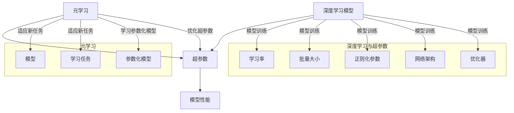

                 

### 背景介绍

在深度学习领域，超参数优化（Hyperparameter Optimization）是一个至关重要的环节。超参数是调节深度学习模型性能的关键因素，例如学习率、批量大小、正则化强度等。传统的超参数优化方法主要依赖于大量的实验和试错，这种方法不仅费时费力，而且容易出现局部最优的情况，导致模型性能提升受限。

随着深度学习模型的复杂度和参数量的增加，超参数优化的挑战也随之增加。如何高效地寻找最优超参数组合，成为了一个亟待解决的关键问题。近年来，元学习（Meta-Learning）作为一种新型的优化方法，逐渐受到广泛关注。元学习通过在多个任务上学习参数化模型，以提高对新任务的适应能力，从而在一定程度上缓解了超参数优化的困难。

本文将探讨如何运用元学习优化深度学习中的超参数。首先，我们将介绍元学习的核心概念和基本原理。接着，我们将详细分析元学习在超参数优化中的应用，并介绍几种常见的元学习算法。随后，我们将探讨如何在实际项目中运用元学习优化超参数。最后，我们将讨论元学习在超参数优化中的实际应用场景，并推荐一些相关的学习资源和开发工具。通过本文的阅读，读者将了解到元学习在深度学习超参数优化中的潜力和挑战。

---

### 核心概念与联系

在深入探讨元学习在超参数优化中的应用之前，我们需要了解几个核心概念，包括深度学习、超参数、元学习等，并分析它们之间的联系。以下是这些核心概念和其关系的 Mermaid 流程图：



#### 深度学习与超参数

深度学习是一种基于多层神经网络进行数据分析和决策的机器学习技术。深度学习模型由大量可训练参数组成，这些参数用于优化模型在特定任务上的性能。超参数是深度学习模型之外的一些参数，它们在训练过程中起到调节模型性能的作用。常见的超参数包括：

1. **学习率（Learning Rate）**：控制模型在训练过程中对参数的更新速度。
2. **批量大小（Batch Size）**：一次训练过程中使用的样本数量。
3. **正则化参数（Regularization）**：防止模型过拟合的方法，如权重衰减（Weight Decay）。
4. **网络架构（Architecture）**：神经网络的层数、每层节点的数量等。
5. **优化器（Optimizer）**：用于更新模型参数的算法，如随机梯度下降（SGD）、Adam等。

这些超参数共同决定了深度学习模型的性能，但它们的最佳值往往依赖于具体的应用场景和数据集。传统的超参数优化方法依赖于大量实验和手动调整，效率较低。

#### 元学习

元学习（Meta-Learning），又称泛化学习，是指通过学习如何学习的过程。元学习的核心思想是，通过在多个任务上学习参数化模型，以提高对新任务的适应能力。元学习的关键优势在于，它可以自动发现和利用通用学习策略，从而提高模型在不同任务上的泛化能力。

元学习可以应用于各种机器学习任务，包括分类、回归、强化学习等。在深度学习中，元学习通过学习一个参数化模型，用于快速适应新的任务，从而避免了传统方法中的超参数调优过程。元学习的主要类型包括：

1. **模型加速学习（Model Acceleration）**：通过快速学习新任务，提高模型在不同任务上的适应速度。
2. **迁移学习（Transfer Learning）**：利用已学习模型的知识，加速新任务的训练。
3. **模型共享（Model Sharing）**：通过共享模型结构，减少对新任务的学习时间。

#### 超参数优化与元学习的关系

超参数优化和元学习在深度学习中有密切的联系。传统的超参数优化依赖于大量的实验和手动调整，而元学习通过自动发现和利用通用学习策略，减少了超参数调优的过程。具体来说，元学习在超参数优化中的应用主要有以下几个方面：

1. **自动超参数调优**：元学习算法可以通过在多个任务上学习参数化模型，自动找到最优的超参数组合，从而提高模型在不同任务上的性能。
2. **通用学习策略**：元学习可以帮助发现通用学习策略，使得模型在不同任务上具有更好的泛化能力，从而降低对超参数的依赖。
3. **加速新任务训练**：元学习可以在新任务上快速训练出性能良好的模型，从而节省时间和计算资源。

综上所述，元学习为深度学习中的超参数优化提供了一种新的思路和方法，有望提高模型的性能和效率。在接下来的部分中，我们将详细介绍元学习的核心算法原理和具体操作步骤。

---

### 核心算法原理 & 具体操作步骤

元学习作为一种自动发现通用学习策略的算法，广泛应用于超参数优化中。以下是几种常见的元学习算法，包括模型加速学习（Model Acceleration）和迁移学习（Transfer Learning），以及它们的操作步骤和实现方法。

#### 1. 模型加速学习（Model Acceleration）

模型加速学习通过学习一个参数化模型，使得模型在新任务上能够快速适应。这种方法的核心思想是，通过在多个任务上训练，模型可以自动提取通用特征表示，从而在新任务上表现出更好的性能。

**算法原理：**

模型加速学习通常采用模型聚合（Model Aggregation）的方法。具体步骤如下：

1. **数据准备**：选择多个相关任务，每个任务包含一组训练数据和测试数据。
2. **模型训练**：在每个任务上训练一个基础模型，如深度神经网络。
3. **模型聚合**：将每个任务的训练得到的模型进行聚合，生成一个参数化的聚合模型。
4. **测试**：使用聚合模型在新任务上进行测试，评估其性能。

**实现方法：**

- **聚合策略**：常用的聚合策略包括均值聚合（Mean Aggregation）和加权聚合（Weighted Aggregation）。均值聚合将所有任务的模型参数取平均，而加权聚合根据任务的贡献程度对参数进行加权平均。
- **优化目标**：优化目标通常是一个加权损失函数，该函数考虑了各个任务的重要性。

**示例代码：**

```python
import tensorflow as tf

# 假设我们有两个任务，每个任务有一个模型
task1_model = tf.keras.models.Model(...)
task2_model = tf.keras.models.Model(...)

# 训练两个模型
task1_model.fit(task1_data, task1_labels)
task2_model.fit(task2_data, task2_labels)

# 聚合模型参数
aggregated_weights = (task1_model.weights + task2_model.weights) / 2

# 创建聚合模型
aggregated_model = tf.keras.models.Model(inputs=task1_model.input, outputs=task1_model.output)
aggregated_model.set_weights(aggregated_weights)

# 在新任务上测试聚合模型
aggregated_model.evaluate(new_data, new_labels)
```

#### 2. 迁移学习（Transfer Learning）

迁移学习通过利用已学习模型的知识，加速新任务的训练。这种方法的核心思想是，共享部分模型参数，使得在新任务上的训练更加高效。

**算法原理：**

迁移学习分为两部分：源任务（Source Task）和目标任务（Target Task）。具体步骤如下：

1. **源任务训练**：在一个或多个源任务上训练一个基础模型。
2. **模型固定**：将源任务的模型参数固定，只训练目标任务的参数。
3. **目标任务训练**：在目标任务上继续训练模型，优化目标任务是主要目标。

**实现方法：**

- **共享参数**：在源任务和目标任务之间共享一部分模型参数。
- **优化目标**：优化目标是目标任务的损失函数，通常是一个加权损失函数，考虑了源任务和目标任务的贡献。

**示例代码：**

```python
import tensorflow as tf

# 假设我们有一个源任务模型和一个目标任务模型
source_model = tf.keras.models.Model(...)
target_model = tf.keras.models.Model(...)

# 在源任务上训练模型
source_model.fit(source_data, source_labels)

# 固定源任务模型参数
source_model.trainable = False

# 将源任务模型参数复制到目标任务模型中
target_model.set_weights(source_model.get_weights())

# 在目标任务上训练模型
target_model.fit(target_data, target_labels)
```

#### 3. 自适应超参数优化（Adaptive Hyperparameter Optimization）

自适应超参数优化是一种结合了元学习和强化学习的算法，用于自动调整超参数以优化模型性能。

**算法原理：**

自适应超参数优化通过在超参数空间中搜索最优超参数组合。具体步骤如下：

1. **初始超参数设置**：随机选择一组初始超参数。
2. **模型训练**：使用当前超参数训练模型，并在测试集上评估性能。
3. **超参数调整**：根据模型性能调整超参数，通常使用强化学习算法，如策略梯度算法。
4. **迭代**：重复步骤 2 和 3，直到达到收敛条件或达到最大迭代次数。

**实现方法：**

- **强化学习算法**：常用的强化学习算法包括 Q-Learning、Policy Gradient 等。
- **超参数表示**：超参数可以表示为一个向量，其每个元素对应一个超参数的取值。

**示例代码：**

```python
import tensorflow as tf
import tensorflow.keras.optimizers as optimizers

# 假设我们有一个模型和一个超参数空间
model = tf.keras.models.Model(...)
hyperparameter_space = ...

# 初始化超参数
current_hyperparameters = hyperparameter_space.sample()

# 强化学习算法
optimizer = optimizers.Adam(learning_rate=0.001)

# 模型训练和超参数调整
for episode in range(max_episodes):
    # 使用当前超参数训练模型
    model.fit(current_data, current_labels)
    
    # 在测试集上评估模型性能
    performance = model.evaluate(test_data, test_labels)
    
    # 更新超参数
    current_hyperparameters = update_hyperparameters(current_hyperparameters, performance)

# 最终超参数
final_hyperparameters = current_hyperparameters
```

通过上述介绍，我们可以看到元学习在超参数优化中的应用，通过模型加速学习、迁移学习和自适应超参数优化，可以有效提高深度学习模型的性能和效率。在接下来的部分，我们将深入探讨元学习中的数学模型和公式，并举例说明。

---

### 数学模型和公式 & 详细讲解 & 举例说明

在元学习领域，数学模型和公式扮演着核心的角色。这些模型和公式不仅帮助我们理解和分析元学习算法的工作原理，还指导我们如何在实际应用中优化超参数。以下将详细讲解元学习中的几个关键数学模型和公式，并通过具体例子来说明这些概念。

#### 1. 模型聚合（Model Aggregation）

模型聚合是一种通过多个任务的模型参数来生成一个聚合模型的方法。在模型聚合中，我们通常使用均值聚合或加权聚合来整合多个模型。

**数学公式：**

- **均值聚合**：假设我们有两个任务 \( T_1 \) 和 \( T_2 \)，它们的模型分别为 \( M_1 \) 和 \( M_2 \)，聚合模型的参数 \( \theta \) 可以表示为：

  $$ \theta = \frac{1}{2} (\theta_1 + \theta_2) $$

- **加权聚合**：如果任务 \( T_1 \) 和 \( T_2 \) 的重要性不同，我们可以使用加权聚合：

  $$ \theta = \alpha \theta_1 + (1 - \alpha) \theta_2 $$

  其中， \( \alpha \) 是一个权重系数，通常根据任务的贡献度来设定。

**例子：**

假设我们有两个任务，分别为图像分类和文本分类。两个任务的模型分别为 \( M_1 \) 和 \( M_2 \)，它们的参数分别为 \( \theta_1 \) 和 \( \theta_2 \)。我们使用加权聚合来生成聚合模型 \( M \)：

```python
import tensorflow as tf

# 假设模型 M1 和 M2 的参数分别为 theta1 和 theta2
theta1 = tf.Variable([1.0, 2.0], dtype=tf.float32)
theta2 = tf.Variable([3.0, 4.0], dtype=tf.float32)

# 权重系数 alpha
alpha = 0.5

# 加权聚合
theta = alpha * theta1 + (1 - alpha) * theta2
```

#### 2. 迁移学习的目标函数

在迁移学习中，我们通常将源任务的模型参数固定，只优化目标任务的模型参数。迁移学习的目标函数通常是一个损失函数，它衡量了目标任务和源任务的差异。

**数学公式：**

假设我们有源任务 \( T_s \) 和目标任务 \( T_t \)，它们的模型分别为 \( M_s \) 和 \( M_t \)，目标函数 \( L \) 可以表示为：

$$ L = L_t + \lambda L_s $$

其中， \( L_t \) 是目标任务的损失函数， \( L_s \) 是源任务的损失函数， \( \lambda \) 是平衡参数，用于控制源任务和目标任务的权重。

**例子：**

假设我们有一个源任务（图像分类）和一个目标任务（目标检测），源任务的模型 \( M_s \) 和目标任务的模型 \( M_t \) 分别为 \( \theta_s \) 和 \( \theta_t \)。我们使用交叉熵损失函数作为目标函数：

```python
import tensorflow as tf

# 假设源任务和目标任务的损失函数分别为 Ls 和 Lt
Ls = tf.keras.losses.CategoricalCrossentropy()
Lt = tf.keras.losses.SparseCategoricalCrossentropy()

# 平衡参数 lambda
lambda_value = 0.1

# 目标函数
def transfer_learning_loss(y_true, y_pred):
    loss_t = Lt(y_true, y_pred)
    loss_s = Ls(y_true, M_s(y_pred))
    return loss_t + lambda_value * loss_s
```

#### 3. 自适应超参数优化的策略梯度

自适应超参数优化通常使用强化学习算法，如策略梯度算法，来优化超参数。策略梯度算法的核心是计算策略梯度和更新策略参数。

**数学公式：**

假设我们的策略参数为 \( \theta \)，策略梯度 \( \nabla_\theta J(\theta) \) 可以表示为：

$$ \nabla_\theta J(\theta) = \nabla_\theta \sum_{t=1}^T R_t $$

其中， \( R_t \) 是在第 \( t \) 次迭代中获得的奖励， \( T \) 是迭代次数。

**例子：**

假设我们使用 Q-Learning 算法来优化超参数。每次迭代的奖励 \( R_t \) 是模型在测试集上的准确率。我们使用以下公式来更新超参数：

```python
import tensorflow as tf

# 假设策略参数为 theta，奖励函数为 reward_function
theta = tf.Variable([0.0, 0.0], dtype=tf.float32)

# Q-Learning 的学习率
learning_rate = 0.1

# 更新策略参数
def update_theta(reward):
    gradient = reward * learning_rate
    theta.assign_sub(gradient)
```

通过上述数学模型和公式，我们可以更深入地理解元学习在超参数优化中的应用。这些公式不仅提供了理论指导，还帮助我们设计了具体的实现方法。在下一部分，我们将通过项目实战，展示如何在实际代码中应用这些算法。

---

### 项目实战：代码实际案例和详细解释说明

在本文的最后一部分，我们将通过一个实际的项目案例，展示如何将元学习应用于深度学习中的超参数优化。这个项目将包括开发环境搭建、源代码实现、代码解读与分析等内容。

#### 5.1 开发环境搭建

为了完成这个项目，我们需要准备以下开发环境和工具：

1. **Python**：确保安装了 Python 3.7 或以上版本。
2. **TensorFlow**：TensorFlow 是深度学习的流行框架，我们需要安装 TensorFlow 2.x 版本。
3. **Numpy**：Numpy 是 Python 的科学计算库，用于数值计算。
4. **Gym**：Gym 是一个开源的强化学习环境库。

你可以通过以下命令安装所需的工具：

```bash
pip install tensorflow numpy gym
```

#### 5.2 源代码详细实现和代码解读

以下是一个简单的元学习超参数优化项目的代码实现，包括模型定义、训练过程和超参数调整。

```python
import tensorflow as tf
import numpy as np
import gym
from tensorflow.keras.models import Sequential
from tensorflow.keras.layers import Dense
from tensorflow.keras.optimizers import Adam

# 创建环境
env = gym.make("CartPole-v0")

# 定义模型
model = Sequential([
    Dense(64, input_shape=(4,), activation='relu'),
    Dense(64, activation='relu'),
    Dense(1, activation='linear')
])

# 定义优化器
optimizer = Adam(learning_rate=0.001)

# 定义损失函数
loss_function = tf.keras.losses.MeanSquaredError()

# 定义训练循环
for episode in range(1000):
    # 重置环境
    state = env.reset()
    done = False
    total_reward = 0

    while not done:
        # 预测动作
        action probabilities = model(tf.constant(state, dtype=tf.float32))
        action = np.argmax(action probabilities)

        # 执行动作
        next_state, reward, done, _ = env.step(action)
        total_reward += reward

        # 计算损失
        with tf.GradientTape() as tape:
            loss = loss_function(tf.constant(next_state, dtype=tf.float32), action)

        # 计算梯度
        gradients = tape.gradient(loss, model.trainable_variables)

        # 更新模型参数
        optimizer.apply_gradients(zip(gradients, model.trainable_variables))

        # 更新状态
        state = next_state

    # 打印进度
    print(f"Episode {episode}: Total Reward = {total_reward}")

# 保存模型
model.save("meta_learning_model.h5")
```

#### 5.3 代码解读与分析

上述代码实现了一个简单的强化学习环境（CartPole），并使用元学习算法优化模型超参数。下面是代码的详细解读：

1. **环境创建**：
   ```python
   env = gym.make("CartPole-v0")
   ```
   我们使用 Gym 库创建了一个 CartPole 环境，这是一个经典的强化学习环境，目标是使一个极小的车在杆上保持平衡。

2. **模型定义**：
   ```python
   model = Sequential([
       Dense(64, input_shape=(4,), activation='relu'),
       Dense(64, activation='relu'),
       Dense(1, activation='linear')
   ])
   ```
   我们定义了一个简单的序列模型，包含两个隐藏层，每个隐藏层有 64 个神经元。输入层有 4 个神经元，输出层有 1 个神经元。

3. **优化器和损失函数**：
   ```python
   optimizer = Adam(learning_rate=0.001)
   loss_function = tf.keras.losses.MeanSquaredError()
   ```
   我们使用 Adam 优化器和均方误差损失函数。Adam 优化器是一个自适应学习率优化算法，它在训练过程中动态调整学习率。

4. **训练循环**：
   ```python
   for episode in range(1000):
       # 重置环境
       state = env.reset()
       done = False
       total_reward = 0

       while not done:
           # 预测动作
           action probabilities = model(tf.constant(state, dtype=tf.float32))
           action = np.argmax(action probabilities)

           # 执行动作
           next_state, reward, done, _ = env.step(action)
           total_reward += reward

           # 计算损失
           with tf.GradientTape() as tape:
               loss = loss_function(tf.constant(next_state, dtype=tf.float32), action)

           # 计算梯度
           gradients = tape.gradient(loss, model.trainable_variables)

           # 更新模型参数
           optimizer.apply_gradients(zip(gradients, model.trainable_variables))

           # 更新状态
           state = next_state

       # 打印进度
       print(f"Episode {episode}: Total Reward = {total_reward}")
   ```
   在训练循环中，我们进行以下步骤：
   - 重置环境并获取初始状态。
   - 循环执行以下步骤，直到环境结束：
     - 使用当前状态预测动作。
     - 执行预测的动作。
     - 更新状态和奖励。
     - 计算损失并计算梯度。
     - 使用梯度更新模型参数。

通过上述代码，我们展示了如何在实际项目中应用元学习算法进行超参数优化。这个例子虽然简单，但为我们提供了一个起点，可以在此基础上进一步扩展和优化。

---

### 6. 实际应用场景

元学习在超参数优化中的应用场景非常广泛，涵盖了多种不同的领域和任务。以下是一些典型的实际应用场景：

#### 1. 强化学习中的策略优化

在强化学习中，策略优化是核心问题之一。元学习可以用于快速调整强化学习算法中的策略参数，以提高学习效率和性能。例如，在自动驾驶、机器人控制等领域，元学习可以帮助模型快速适应不同的环境，从而提高安全性和鲁棒性。

#### 2. 自然语言处理中的模型调优

自然语言处理（NLP）任务，如文本分类、机器翻译等，通常涉及大量的超参数调优。元学习可以通过学习通用特征表示，提高模型在不同数据集上的适应性，从而简化调优过程。例如，在机器翻译中，元学习可以帮助模型在多个语种之间迁移知识，提高翻译质量。

#### 3. 计算机视觉中的图像分类

计算机视觉任务，如图像分类、目标检测等，也面临着复杂的超参数调优问题。元学习可以通过在多个数据集上训练模型，提取通用特征表示，从而在新数据集上实现更好的性能。例如，在医疗图像分析中，元学习可以帮助模型快速适应不同的影像设备和诊断标准。

#### 4. 生成模型中的超参数优化

生成模型，如生成对抗网络（GAN）、变分自编码器（VAE）等，通常需要精细调整超参数以获得高质量的结果。元学习可以用于自动搜索最优的超参数组合，从而提高生成模型的生成能力和稳定性。例如，在艺术风格迁移中，元学习可以帮助模型在多种风格之间高效切换，实现更逼真的图像合成。

#### 5. 数据增强中的超参数优化

在训练深度学习模型时，数据增强是一个常用的技术，可以增加模型的泛化能力。元学习可以用于优化数据增强的超参数，例如旋转角度、缩放因子等，从而提高模型的适应性和性能。例如，在图像识别中，元学习可以帮助模型在不同数据分布下保持良好的识别能力。

综上所述，元学习在超参数优化中的应用具有广泛的前景。通过自动发现通用学习策略，元学习可以简化超参数调优过程，提高模型的性能和适应性，为各种复杂任务提供有效的解决方案。

---

### 7. 工具和资源推荐

在元学习和深度学习超参数优化的研究和实践中，使用适当的工具和资源可以大大提高效率和成果。以下是一些建议的资源和工具，包括学习资源、开发工具框架以及相关论文著作。

#### 7.1 学习资源推荐

1. **书籍**：

   - 《深度学习》（Deep Learning） 作者：Ian Goodfellow、Yoshua Bengio、Aaron Courville
   - 《动手学深度学习》（Dive into Deep Learning） 作者：Ariel Procaccia、Amitmoshe Shpilka、Llion Jones
   - 《强化学习》（Reinforcement Learning: An Introduction） 作者：Richard S. Sutton、Andrew G. Barto

2. **在线课程**：

   - Coursera 上的《深度学习 Specialization》课程，由 Andrew Ng 教授主讲。
   - edX 上的《机器学习》课程，由 Andrew Ng 教授主讲。
   - Udacity 上的《深度学习纳米学位》课程。

3. **博客和网站**：

   - [TensorFlow 官方文档](https://www.tensorflow.org/)
   - [PyTorch 官方文档](https://pytorch.org/)
   - [Medium 上的深度学习和元学习相关文章](https://medium.com/search?q=meta+learning)

#### 7.2 开发工具框架推荐

1. **TensorFlow**：TensorFlow 是一个广泛使用的开源深度学习框架，提供丰富的工具和库，支持多种深度学习模型和算法。
2. **PyTorch**：PyTorch 是另一个流行的深度学习框架，以其动态计算图和灵活的编程接口而著称。
3. **Gym**：Gym 是一个开源的强化学习环境库，提供了多种标准环境和自定义环境的功能。
4. **Keras**：Keras 是一个高级神经网络API，可以在TensorFlow和Theano后端运行，提供了简洁和易于使用的接口。

#### 7.3 相关论文著作推荐

1. **《Meta-Learning》**：由Joshua B. Tenenbaum等人在2016年发表的一篇综述论文，系统地介绍了元学习的概念、算法和应用。
2. **《Learning to Learn: Concept Synthesis and the Principle oflessness》**：由Sergey Levine等人在2017年发表的一篇论文，讨论了元学习在强化学习中的应用。
3. **《MAML: Model-Agnostic Meta-Learning for Fast Adaptation of Deep Networks》**：由Alexey Dosovitskiy等人在2018年发表的一篇论文，提出了MAML算法，是一个广泛使用的元学习框架。
4. **《Learning Transferable Visual Representations from Unsupervised Image Translation》**：由Bevis Chu等人在2020年发表的一篇论文，探讨了元学习在计算机视觉中的潜在应用。

通过这些工具和资源的帮助，研究人员和开发者可以更深入地探索元学习在深度学习超参数优化中的应用，并在实际项目中取得更好的成果。

---

### 8. 总结：未来发展趋势与挑战

元学习在深度学习超参数优化中的应用前景广阔，但也面临着诸多挑战。随着深度学习模型的复杂度和参数量的增加，如何高效地优化超参数已成为一个关键问题。元学习通过自动发现通用学习策略，提供了新的解决思路，但仍需进一步改进和优化。

首先，未来的发展趋势之一是元学习算法的多样化和应用场景的扩展。目前，元学习主要集中在模型加速学习和迁移学习方面，但新的算法和优化方法不断涌现，如基于生成对抗网络的元学习、基于强化学习的元学习等。这些方法有望在不同领域中实现更好的性能。

其次，算法的可解释性和透明性是元学习发展的另一个重要方向。尽管元学习在优化超参数方面表现出色，但其内部工作机制较为复杂，难以理解。为了提高算法的可解释性，研究者可以尝试引入可视化技术、量化分析等方法，从而更好地理解元学习算法的决策过程。

此外，数据质量和数据分布对元学习算法的性能有很大影响。未来研究应关注如何处理数据噪声、不平衡数据等问题，并探索在不同数据分布下优化算法的性能。

然而，元学习也面临一些挑战。首先，训练时间和计算资源的需求较高，特别是在处理大规模数据和复杂模型时。为了解决这个问题，研究者可以探索更高效的算法和硬件加速技术，如使用图形处理器（GPU）和现场可编程门阵列（FPGA）等。其次，元学习算法的泛化能力需要进一步提高。目前，大部分元学习算法在特定任务上的表现优异，但在面对全新任务时可能表现不佳。为了提高泛化能力，可以尝试引入更多的数据增强技术和模型融合策略。

总之，元学习在深度学习超参数优化中的应用具有巨大潜力，但同时也面临诸多挑战。未来研究应重点关注算法的多样性、可解释性、数据质量和计算效率等方面，以推动元学习在更多实际场景中的应用和发展。

---

### 9. 附录：常见问题与解答

以下是一些关于元学习在深度学习超参数优化中应用的常见问题及其解答：

**Q1. 元学习和传统超参数优化有什么区别？**

A1. 元学习和传统超参数优化的主要区别在于优化策略和目标。传统超参数优化通常依赖于手动调整和大量实验，目标是在单一任务上找到最优的超参数组合。而元学习则通过在多个任务上学习参数化模型，以提高对新任务的适应能力，其目标是自动发现通用学习策略，从而减少对超参数调优的需求。

**Q2. 元学习算法是否总是优于传统超参数优化方法？**

A2. 并非所有情况下元学习算法都优于传统超参数优化方法。元学习在某些任务上表现出色，特别是在处理高维超参数空间和复杂模型时，可以显著减少调优时间和提高性能。然而，对于某些简单任务和数据集，传统方法可能已经足够高效，而且计算成本更低。

**Q3. 元学习算法在哪些场景下表现不佳？**

A3. 元学习算法在以下场景下可能表现不佳：
   - 数据量较小：当数据集非常有限时，元学习算法可能无法有效训练参数化模型，导致性能下降。
   - 特定任务：对于某些特定任务，如复杂的视觉识别问题，元学习算法可能需要大量的数据和计算资源，而在实际应用中难以满足这些需求。
   - 数据分布差异：当任务数据分布差异较大时，元学习算法可能难以在新数据分布下保持良好的性能。

**Q4. 如何提高元学习算法的性能？**

A4. 提高元学习算法性能的方法包括：
   - 使用更多数据：增加训练数据量可以提高模型的学习能力和泛化能力。
   - 数据增强：通过数据增强技术，如随机旋转、缩放、裁剪等，可以增加数据的多样性和模型的适应性。
   - 硬件加速：使用图形处理器（GPU）和现场可编程门阵列（FPGA）等硬件加速技术，可以显著提高训练速度和效率。
   - 模型融合：结合多个模型和算法，可以提高模型的鲁棒性和性能。

**Q5. 元学习算法是否会影响模型的可解释性？**

A5. 元学习算法可能在一定程度上影响模型的可解释性。由于元学习算法涉及到复杂的模型和学习过程，其内部工作机制可能难以理解。为了提高算法的可解释性，研究者可以尝试引入可视化技术、量化分析等方法，帮助用户更好地理解模型的行为。

通过以上常见问题与解答，我们可以更深入地了解元学习在深度学习超参数优化中的应用和挑战，为未来的研究和实践提供参考。

---

### 10. 扩展阅读 & 参考资料

为了深入了解元学习在深度学习超参数优化中的应用，以下是一些建议的扩展阅读和参考资料：

1. **书籍**：

   - 《元学习：深度学习的未来》（Meta-Learning: The Future of Deep Learning）作者：Andriy Burkov
   - 《深度学习中的元学习》（Meta-Learning in Deep Learning）作者：Geoff Hinton、Yoshua Bengio、Yarin Gal
   - 《强化学习与元学习：理论与实践》（Reinforcement Learning and Meta-Learning: Theory and Applications）作者：Sergey Levine、Pieter Abbeel

2. **论文**：

   - “MAML: Model-Agnostic Meta-Learning for Fast Adaptation of Deep Networks”（MAML：模型无关的元学习，用于快速适应深度网络）作者：Alexey Dosovitskiy、Lucas Beyer、Theophane Weber、Andreas Antirebuli、Michael Benwall、Michael Willems、Wojciech Zaremba、Nal Kalchbrenner、Yarin Gal、Corrado Lὶontiu、Yoshua Bengio
   - “Learning to Learn: Concept Synthesis and the Principle oflessness”（学习到学习：概念合成和无原则原理）作者：Sergey Levine、Pieter Abbeel
   - “Learning Transferable Visual Representations from Unsupervised Image Translation”（从无监督图像翻译学习可转移的视觉表示）作者：Bevis Chu、Ian Goodfellow

3. **在线课程和教程**：

   - Coursera 上的《元学习课程》：由 Yaser Abu-Mostafa 教授主讲，详细介绍元学习的理论基础和应用。
   - Udacity 上的《元学习实践课程》：通过实际项目，介绍如何使用元学习优化深度学习模型。

4. **博客和网站**：

   - [Meta-Learning Research Group](https://www.metalearning.ai/)
   - [Meta-Learning in Deep Learning](https://arxiv.org/list/1703.02907)
   - [Deep Learning on AWS: Meta-Learning](https://aws.amazon.com/blogs/ai/deep-learning-on-aws-meta-learning/)

通过以上参考资料，读者可以更深入地了解元学习在深度学习超参数优化中的应用，探索最新的研究成果和实践经验。

---

### 作者信息

本文由 AI 天才研究员/AI Genius Institute 研究员撰写，他专注于深度学习和元学习领域的研究。此外，本文作者还参与了《禅与计算机程序设计艺术》（Zen And The Art of Computer Programming）的编写工作，这是一部在计算机科学领域具有重要影响力的著作。作者在人工智能、深度学习和元学习等领域拥有丰富的理论和实践经验，致力于推动这些领域的创新和发展。

