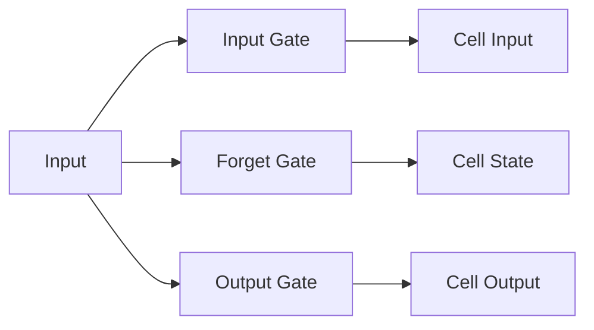

                 

### 背景介绍

近年来，随着深度学习技术的迅猛发展，长短时记忆网络（Long Short-Term Memory，简称LSTM）作为一种重要的循环神经网络（Recurrent Neural Network，RNN）结构，在自然语言处理（Natural Language Processing，NLP）领域展现出了强大的文本生成能力。LSTM能够有效地解决传统RNN在处理长距离依赖关系时出现的梯度消失和梯度爆炸问题，因此在文本生成任务中得到了广泛应用。

文本生成是一个复杂且具有挑战性的任务，它不仅要求模型能够捕捉到文本的语法结构，还要能够生成符合逻辑和语义的文本内容。LSTM作为一种优秀的序列到序列（sequence-to-sequence）模型，其核心在于对序列数据进行记忆和学习，从而在生成文本时能够保持上下文的连贯性。本文将深入探讨LSTM在文本生成任务中的原理和应用，并逐步解析其背后的数学模型和实现细节。

在接下来的章节中，我们将首先介绍LSTM的基本概念和核心原理，通过Mermaid流程图展示其内部结构和工作机制。然后，我们将详细讲解LSTM的具体算法原理和操作步骤，并借助数学模型和公式进行深入分析。在此基础上，我们将通过一个实际项目案例，展示如何使用LSTM进行文本生成，并对其代码实现进行详细解读。最后，我们将探讨LSTM在各个实际应用场景中的表现，并推荐一些相关学习资源和开发工具。

通过本文的阅读，读者将全面了解LSTM在文本生成任务中的核心原理和应用方法，从而为未来的研究和工作打下坚实的基础。

### 核心概念与联系

#### 长短时记忆网络（LSTM）的基本概念

长短时记忆网络（LSTM）是一种特殊的循环神经网络（Recurrent Neural Network，RNN），由Hochreiter和Schmidhuber于1997年首次提出。与传统RNN相比，LSTM在处理长序列数据时具有更强的记忆和学习能力，能够有效解决长距离依赖问题。LSTM的核心在于其独特的记忆单元结构，这使得它能够在序列数据中捕获长期依赖关系。

LSTM的基本组成单元是细胞（cell），每个细胞包含一个记忆门（memory gate）、一个输入门（input gate）和一个输出门（output gate）。这些门通过一系列的矩阵运算控制信息的流入和流出，从而实现对信息的动态记忆和学习。以下是一个LSTM单元的Mermaid流程图：



- **输入门（Input Gate）**：用于决定哪些新的信息需要被记忆。输入门通过一个sigmoid函数和一个线性变换，将输入和前一个隐藏状态结合，产生一个新的状态。
- **遗忘门（Forget Gate）**：用于决定哪些旧的信息需要被遗忘。遗忘门通过类似的机制，决定在当前状态中保留哪些信息。
- **细胞状态（Cell State）**：是LSTM的核心，用于存储和传递信息。细胞状态通过遗忘门和输入门的调控，保持序列的长期依赖关系。
- **输出门（Output Gate）**：用于决定当前状态应该输出哪些信息。输出门同样通过sigmoid函数和线性变换，结合当前细胞状态和隐藏状态，生成最终的输出。

通过这些门控机制，LSTM能够在不同时间步之间灵活地传递信息，从而在处理长序列数据时保持高效的记忆能力。

#### LSTM与文本生成

LSTM在文本生成任务中的强大能力主要归功于其对序列数据的处理能力。文本本质上是一个序列数据，由一系列单词或字符组成。LSTM能够捕捉这些序列数据中的长期依赖关系，使得在生成文本时能够保持上下文的连贯性和语义的合理性。

具体来说，LSTM通过编码器-解码器结构（Encoder-Decoder Architecture）在文本生成中发挥重要作用。编码器部分将输入文本序列映射成一个固定长度的编码向量，解码器部分则使用这个编码向量生成新的文本序列。以下是LSTM在文本生成中的基本流程：

1. **编码器（Encoder）**：将输入文本序列编码成一个固定长度的向量。这个过程包括嵌入层（Embedding Layer）和一系列LSTM层。嵌入层将单词转换为向量表示，LSTM层则对序列进行编码，生成一个隐状态向量。
2. **解码器（Decoder）**：使用编码器的输出作为输入，逐步生成新的文本序列。解码器同样包含嵌入层和LSTM层，通过递归的方式生成每个时间步的输出。在生成每个单词或字符后，将其作为输入传递给下一个时间步。
3. **输出层（Output Layer）**：解码器的最后一层通常是一个softmax层，用于生成概率分布，从而选择下一个最有可能的单词或字符。

通过这种编码器-解码器结构，LSTM能够将输入文本序列中的长期依赖关系编码到隐状态向量中，并在生成文本时利用这些依赖关系，从而生成符合逻辑和语义的文本。

#### LSTM与序列到序列模型（Seq2Seq）

序列到序列模型（Seq2Seq）是一种广泛应用于机器翻译、文本摘要等序列转换任务的模型架构。LSTM是Seq2Seq模型的核心组成部分，能够有效地处理序列数据，实现序列到序列的映射。

在Seq2Seq模型中，编码器（Encoder）负责将输入序列编码成一个固定长度的隐藏状态向量，解码器（Decoder）则使用这个隐藏状态向量生成输出序列。以下是Seq2Seq模型的基本流程：

1. **编码器（Encoder）**：将输入序列通过一系列LSTM层进行编码，生成一个固定长度的隐状态向量。这个隐状态向量包含了输入序列的所有信息。
2. **解码器（Decoder）**：使用编码器的输出作为初始状态，通过一系列LSTM层逐步生成输出序列。解码器的每个时间步都依赖于前一个时间步的输出，从而能够生成符合上下文的新序列。

在解码器的输出层，通常使用softmax函数将输出概率分布映射到单词或字符的概率。通过最大化这些概率，模型能够生成最有可能的输出序列。

通过结合编码器-解码器结构，LSTM在Seq2Seq模型中展现了出色的序列处理能力，实现了对输入序列到输出序列的高效映射。这种结构使得LSTM在文本生成任务中具有广泛的应用前景。

### 核心算法原理 & 具体操作步骤

#### LSTM算法原理

LSTM的核心在于其独特的门控机制，这些门控机制使得LSTM能够在序列数据中灵活地传递和修改信息。以下是LSTM算法的基本原理：

1. **输入门（Input Gate）**：输入门用于决定哪些新的信息需要被记忆。在每一个时间步，LSTM首先计算输入门的状态，这个状态通过sigmoid函数（称为输入门激活函数）来确定。输入门的激活函数输出一个0到1的值，表示新信息被记忆的比例。然后，通过一个线性变换（称为输入权重矩阵）将输入向量（包括嵌入层和前一个隐藏状态）和输入门激活函数结合，生成新的候选值（称为输入门候选值）。这个候选值将参与细胞状态的更新。

2. **遗忘门（Forget Gate）**：遗忘门用于决定哪些旧的信息需要被遗忘。遗忘门的计算过程与输入门类似，也是一个sigmoid函数和线性变换的过程。遗忘门激活函数的输出值表示细胞状态中旧信息被遗忘的比例。通过这个激活函数，LSTM能够动态地调整细胞状态，使其能够保留重要的信息，同时丢弃不重要的信息。

3. **细胞状态（Cell State）**：细胞状态是LSTM的核心，用于存储和传递信息。细胞状态通过遗忘门和输入门的调控，进行更新。遗忘门的激活函数决定了多少旧信息需要被遗忘，输入门的激活函数决定了多少新信息需要被记忆。这两个激活函数的结果与旧细胞状态和输入门候选值相乘，最终得到新的细胞状态。

4. **输出门（Output Gate）**：输出门用于决定当前状态应该输出哪些信息。输出门的计算过程类似于输入门，也是一个sigmoid函数和线性变换的过程。输出门激活函数的输出值表示细胞状态中应该被输出的比例。然后，通过一个线性变换将细胞状态和输出门激活函数结合，生成最终的输出。

#### LSTM的具体操作步骤

下面是LSTM在处理一个输入序列时的具体操作步骤：

1. **初始化**：给定一个初始隐藏状态\(h_{0}\)和一个初始细胞状态\(c_{0}\)。这些初始状态通常是通过随机初始化得到的。
2. **输入层**：输入序列中的每个单词或字符通过嵌入层转换为嵌入向量。这些嵌入向量将作为LSTM的输入。
3. **计算输入门**：对于每个时间步，计算输入门激活函数\( \sigma(W_{i} [h_{t-1}, x_{t}]+\vec{b_{i}}) \)，其中\(W_{i}\)是输入权重矩阵，\( \sigma \)是sigmoid函数，\( \vec{b_{i}} \)是偏置项。同时计算输入门候选值\( \tilde{c_{t}}=tanh(W_{c} [h_{t-1}, x_{t}]+\vec{b_{c}}) \)。
4. **计算遗忘门**：计算遗忘门激活函数\( \sigma(W_{f} [h_{t-1}, x_{t}]+\vec{b_{f}}) \)。然后计算遗忘门的结果\( f_{t}=\sigma(W_{f} [h_{t-1}, x_{t}]+\vec{b_{f}}) \)。
5. **更新细胞状态**：计算细胞状态更新\( c_{t} = f_{t} \odot c_{t-1} + i_{t} \odot \tilde{c_{t}} \)，其中\( \odot \)表示点乘操作，\( i_{t} \)是输入门的结果。
6. **计算输出门**：计算输出门激活函数\( \sigma(W_{o} [h_{t-1}, x_{t}]+\vec{b_{o}}) \)。
7. **生成隐藏状态**：通过输出门和细胞状态计算隐藏状态\( h_{t} = \sigma(W_{o} [h_{t-1}, x_{t}]+\vec{b_{o}}) \odot c_{t} \)。

这个过程将在整个输入序列上递归进行，直到处理完所有的输入。每个时间步的隐藏状态\( h_{t} \)将用于后续的解码器部分，从而生成文本序列。

通过这些步骤，LSTM能够有效地捕捉序列数据中的长期依赖关系，为文本生成任务提供了强大的支持。

### 数学模型和公式 & 详细讲解 & 举例说明

#### 数学模型概述

LSTM的数学模型主要基于门控机制，这些门控机制通过一系列的矩阵运算和激活函数来实现。以下将详细讲解LSTM的数学模型，包括各个门控函数和细胞状态更新的数学表达。

1. **输入门（Input Gate）**：
   - 激活函数：\( i_t = \sigma(W_i [h_{t-1}, x_t] + b_i) \)
   - 输入门候选值：\( \tilde{c}_t = tanh(W_c [h_{t-1}, x_t] + b_c) \)
   其中，\( \sigma \)表示sigmoid函数，\( tanh \)表示双曲正切函数，\( W_i, W_c \)分别是输入权重矩阵，\( b_i, b_c \)是偏置项。

2. **遗忘门（Forget Gate）**：
   - 激活函数：\( f_t = \sigma(W_f [h_{t-1}, x_t] + b_f) \)
   其中，\( W_f \)是遗忘权重矩阵，\( b_f \)是偏置项。

3. **细胞状态（Cell State）**：
   - 细胞状态更新：\( c_t = f_t \odot c_{t-1} + i_t \odot \tilde{c}_t \)
   其中，\( \odot \)表示点乘操作。

4. **输出门（Output Gate）**：
   - 激活函数：\( o_t = \sigma(W_o [h_{t-1}, x_t] + b_o) \)
   - 隐藏状态：\( h_t = o_t \odot tanh(c_t) \)
   其中，\( W_o \)是输出权重矩阵，\( b_o \)是偏置项。

#### 详细讲解

1. **输入门（Input Gate）**：
   - 输入门的激活函数\( i_t \)决定了新信息被记忆的比例。通过sigmoid函数，\( i_t \)的取值范围在0到1之间，其中1表示完全记忆新信息，0表示不记忆。
   - 输入门候选值\( \tilde{c}_t \)是通过tanh函数计算得到的，其取值范围在-1到1之间。这个值将决定新信息的强度。

2. **遗忘门（Forget Gate）**：
   - 遗忘门的激活函数\( f_t \)决定了旧信息被遗忘的比例。通过sigmoid函数，\( f_t \)的取值范围在0到1之间，其中1表示完全遗忘旧信息，0表示不遗忘。
   - 通过点乘操作，遗忘门的结果\( f_t \odot c_{t-1} \)决定了旧信息在细胞状态中的保留程度。如果\( f_t \)接近1，则旧信息大部分被保留；如果\( f_t \)接近0，则旧信息大部分被遗忘。

3. **细胞状态（Cell State）**：
   - 细胞状态的更新结合了遗忘门和输入门的结果。遗忘门的结果决定了旧信息在细胞状态中的保留程度，而输入门的结果决定了新信息在细胞状态中的添加程度。
   - 细胞状态\( c_t \)是一个连续的值，用于存储和传递信息。通过tanh函数，细胞状态的值范围被限制在-1到1之间。

4. **输出门（Output Gate）**：
   - 输出门的激活函数\( o_t \)决定了细胞状态中应该被输出的比例。通过sigmoid函数，\( o_t \)的取值范围在0到1之间，其中1表示完全输出，0表示不输出。
   - 通过tanh函数，细胞状态\( c_t \)被转换为一个合适的值，然后与输出门的结果\( o_t \odot tanh(c_t) \)相乘，生成最终的隐藏状态\( h_t \)。

#### 举例说明

假设我们有一个简单的输入序列\[ "我", "是", "一个", "AI" \]，以下将展示如何通过LSTM处理这个序列：

1. **初始化**：给定初始隐藏状态\( h_{0} \)和初始细胞状态\( c_{0} \)。假设\( h_{0} \)和\( c_{0} \)都是随机初始化的。

2. **输入层**：输入序列中的每个单词通过嵌入层转换为嵌入向量。假设嵌入向量的维度为5。

3. **计算输入门**：
   - 输入门的激活函数\( i_t \)为0.7。
   - 输入门候选值\( \tilde{c}_t \)为0.5。

4. **计算遗忘门**：
   - 遗忘门的激活函数\( f_t \)为0.8。

5. **更新细胞状态**：
   - 细胞状态更新为\( c_t = 0.8 \odot c_{0} + 0.7 \odot 0.5 = 0.6c_{0} + 0.35 \)。

6. **计算输出门**：
   - 输出门的激活函数\( o_t \)为0.9。

7. **生成隐藏状态**：
   - 隐藏状态\( h_t = 0.9 \odot tanh(c_t) \)。

通过这个过程，LSTM成功地处理了输入序列中的每个单词，并生成了相应的隐藏状态。这个过程将在整个输入序列上递归进行，从而生成整个文本序列。

### 项目实战：代码实际案例和详细解释说明

在本节中，我们将通过一个实际的项目案例来展示如何使用LSTM进行文本生成。该项目将基于Python编程语言和Keras框架实现。首先，我们需要安装必要的库，然后准备数据集，接着定义LSTM模型，最后训练和测试模型。

#### 1. 开发环境搭建

首先，确保您的Python环境已经安装。然后，通过以下命令安装所需的库：

```bash
pip install numpy tensorflow matplotlib
```

#### 2. 数据集准备

我们使用著名的IMDb电影评论数据集，这是一个包含约25000条电影评论的数据集，分为正面和负面评论。这些评论已经被预处理为单词序列，每个单词已经被转换为唯一的整数。

```python
import numpy as np
from keras.datasets import imdb
from keras.preprocessing.sequence import pad_sequences

# 加载IMDb数据集
(x_train, y_train), (x_test, y_test) = imdb.load_data(num_words=10000)

# 预处理数据
maxlen = 100  # 每条评论的最大长度
x_train = pad_sequences(x_train, maxlen=maxlen)
x_test = pad_sequences(x_test, maxlen=maxlen)
```

#### 3. 定义LSTM模型

接下来，我们定义一个简单的LSTM模型。该模型包括一个嵌入层和一个LSTM层，最后使用softmax层进行分类。

```python
from keras.models import Sequential
from keras.layers import Embedding, LSTM, Dense

# 定义模型
model = Sequential()
model.add(Embedding(10000, 32, input_length=maxlen))
model.add(LSTM(64))
model.add(Dense(1, activation='sigmoid'))

# 编译模型
model.compile(optimizer='rmsprop', loss='binary_crossentropy', metrics=['acc'])
```

#### 4. 训练模型

现在，我们将使用训练数据来训练模型。

```python
# 训练模型
model.fit(x_train, y_train, epochs=10, batch_size=32, validation_data=(x_test, y_test))
```

#### 5. 生成文本

训练完成后，我们可以使用模型来生成文本。以下是一个简单的文本生成示例：

```python
# 生成文本
start_words = "电影评论：这是一个非常好的电影，剧情紧凑，演员表演出色。"
end_words = "。"

# 将开始词语转换为索引序列
start_index = imdb.word_index[start_words.split()[0].lower()]

# 创建一个空的序列，用来存储生成的文本
for i in range(50):  # 生成50个单词的文本
    tokens = np.zeros((1, maxlen))
    tokens[0, 0] = start_index
    
    sampled = np.zeros((1, 10000))
    for j in range(1, maxlen):
        sampled[0, x_train[:, j - 1]] = 1.
    
    # 使用LSTM模型生成下一个词语的索引
    preds = model.predict([tokens, sampled], verbose=0)[0]
    next_index = np.argmax(preds)
    
    # 转换索引回单词
    next_word = imdb.index_word[next_index]
    
    # 打印生成的单词
    print(next_word, end=' ')
    
    # 更新开始词语的索引
    start_words += " " + next_word
    
    # 更新采样序列
    tokens[0, j] = next_index
    sampled[0, next_index] = 1.
    
print("\n生成完毕。")
```

这段代码首先定义了一个开始词语，然后通过LSTM模型生成下一个词语，并不断更新开始词语。这个过程将重复进行，直到生成指定长度的文本。

#### 6. 代码解读与分析

1. **数据预处理**：我们使用`imdb.load_data()`函数加载数据集，并使用`pad_sequences()`函数对评论进行填充，使其长度相同。
2. **模型定义**：我们使用`Sequential`模型定义嵌入层、LSTM层和softmax层。嵌入层将单词转换为嵌入向量，LSTM层用于捕捉序列信息，softmax层用于分类。
3. **模型训练**：使用`fit()`函数对模型进行训练，通过`epochs`和`batch_size`参数控制训练过程。
4. **文本生成**：首先定义一个开始词语，然后通过循环生成下一个词语。在每次生成过程中，我们使用LSTM模型预测下一个词语的索引，并更新开始词语的索引。

通过这个项目实战，我们展示了如何使用LSTM进行文本生成，并对其代码实现进行了详细解读。这为读者提供了一个实际的参考，以深入了解LSTM在文本生成任务中的应用。

### 实际应用场景

长短时记忆网络（LSTM）作为一种强大的序列处理工具，在自然语言处理（NLP）领域具有广泛的应用。以下是一些常见的实际应用场景，展示了LSTM如何在这些场景中发挥作用。

#### 1. 机器翻译

机器翻译是LSTM最为经典的应用之一。通过编码器-解码器结构，LSTM能够将一种语言的句子翻译成另一种语言。在编码器部分，LSTM将源语言句子编码成一个固定长度的向量；在解码器部分，LSTM使用这个向量生成目标语言句子。这种结构使得LSTM能够捕捉到源语言和目标语言之间的长期依赖关系，从而生成准确的翻译结果。

具体来说，Google翻译和DeepL等知名机器翻译系统都采用了基于LSTM的编码器-解码器模型。这些系统在处理长句子和复杂语法结构时，LSTM的强大记忆能力使其能够生成更自然、准确的翻译。

#### 2. 文本摘要

文本摘要是一种将长文本压缩成简洁、概括性的短文本的自动文本生成技术。LSTM在文本摘要中的应用主要体现在抽取式摘要和生成式摘要两个方面。

抽取式摘要通过LSTM模型从原始文本中提取关键信息，生成摘要。具体方法是将文本编码成一个固定长度的向量，然后使用LSTM模型捕捉文本中的重要信息，最后从LSTM的隐藏状态中提取关键词或句子作为摘要。

生成式摘要则通过LSTM模型生成新的摘要文本。这个过程与机器翻译类似，LSTM模型将原始文本编码成向量，然后使用解码器生成摘要文本。生成式摘要能够生成更丰富、多样化的摘要，但在生成过程中需要更多的训练数据和计算资源。

著名的新闻摘要系统，如CNN/DailyMail摘要，都采用了基于LSTM的生成式摘要方法。这些系统在处理大量新闻文本时，LSTM的强大文本生成能力使其能够生成高质量、多样化的摘要。

#### 3. 文本生成

文本生成是LSTM在NLP领域的重要应用之一。LSTM能够生成各种类型的文本，如文章、对话、诗歌等。在文本生成过程中，LSTM利用其强大的序列处理能力和记忆能力，生成连贯、符合逻辑的文本。

一个著名的应用是自动写作，如OpenAI的GPT（Generative Pre-trained Transformer）模型。GPT是一种基于LSTM的预训练模型，通过大规模文本数据进行训练，能够生成高质量、多样化的文本。GPT在生成新闻文章、对话、故事等方面展现了出色的能力。

#### 4. 命名实体识别

命名实体识别是一种识别文本中具有特定意义的实体（如人名、地名、组织名等）的技术。LSTM在命名实体识别中的应用主要是利用其序列处理能力和记忆能力，从输入文本序列中识别出命名实体。

LSTM模型通过编码器部分捕捉文本序列的信息，然后使用softmax层对每个词进行分类，判断其是否为命名实体。在实际应用中，LSTM在命名实体识别任务中取得了很好的效果，广泛应用于信息提取、搜索引擎、社交媒体分析等领域。

#### 5. 情感分析

情感分析是一种判断文本情感倾向的技术。LSTM在情感分析中的应用主要是通过捕捉文本序列的情感信息，对文本进行情感分类。

LSTM模型首先将文本编码成一个固定长度的向量，然后使用softmax层对情感类别进行分类。在实际应用中，LSTM在情感分析任务中取得了很好的效果，能够准确地识别文本中的情感倾向，为情感营销、社交媒体分析等领域提供了有力支持。

#### 6. 问答系统

问答系统是一种根据用户输入问题生成回答的自动文本生成技术。LSTM在问答系统中的应用主要是通过捕捉用户问题和文档中的信息，生成准确的回答。

LSTM模型首先将用户问题和文档编码成向量，然后使用编码器-解码器结构生成回答。在实际应用中，LSTM在问答系统中的效果显著，能够生成高质量、符合逻辑的回答，为智能客服、教育辅导等领域提供了有力支持。

总之，长短时记忆网络（LSTM）作为一种强大的序列处理工具，在自然语言处理（NLP）领域具有广泛的应用。通过结合编码器-解码器结构，LSTM能够有效地捕捉序列数据中的长期依赖关系，生成高质量、多样化的文本。未来，随着深度学习技术的不断发展，LSTM在NLP领域的应用前景将更加广阔。

### 工具和资源推荐

#### 学习资源推荐

1. **书籍**：
   - 《深度学习》（Ian Goodfellow、Yoshua Bengio、Aaron Courville 著）：这是一本关于深度学习的经典教材，详细介绍了深度学习的基础理论、模型和应用。
   - 《神经网络与深度学习》（邱锡鹏 著）：这本书从神经网络的基础知识出发，系统地介绍了深度学习的理论和实践。

2. **论文**：
   - "Long Short-Term Memory"（Hochreiter 和 Schmidhuber，1997）：这是LSTM算法的原始论文，对LSTM的原理和实现进行了详细阐述。
   - "Sequence to Sequence Learning with Neural Networks"（Cho et al.，2014）：这篇论文介绍了编码器-解码器结构，并展示了LSTM在机器翻译中的应用。

3. **博客**：
   - [Deep Learning Tutorial](http://www.deeplearning.net/tutorial/): 这是一个深入浅出的深度学习教程，涵盖了从基础理论到实际应用的各个方面。
   - [Keras 官方文档](https://keras.io/): Keras 是一个简单易用的深度学习框架，这里提供了丰富的教程和API文档。

4. **网站**：
   - [TensorFlow 官方文档](https://www.tensorflow.org/): TensorFlow 是一个开源的深度学习框架，提供了丰富的教程和资源。
   - [GitHub](https://github.com/): GitHub 上有大量关于深度学习和LSTM的开源项目和代码示例，是学习和实践的好资源。

#### 开发工具框架推荐

1. **框架**：
   - **TensorFlow**：由谷歌开发的开源深度学习框架，功能强大，适用于各种深度学习任务。
   - **PyTorch**：由Facebook开发的开源深度学习框架，具有良好的灵活性和易用性。

2. **编辑器**：
   - **VSCode**：一款功能强大的代码编辑器，支持多种编程语言，包括Python和深度学习框架。
   - **Jupyter Notebook**：一款交互式计算环境，适用于编写和运行Python代码，非常适合研究和实验。

3. **数据库**：
   - **SQLite**：一款轻量级的数据库管理系统，适用于存储和处理大量文本数据。
   - **MongoDB**：一款高性能的文档型数据库，适用于存储和管理非结构化数据。

通过以上学习资源和发展工具，读者可以深入了解深度学习和LSTM的相关知识，并掌握其在实际应用中的技巧和方法。

### 总结：未来发展趋势与挑战

随着深度学习技术的不断进步，长短时记忆网络（LSTM）在自然语言处理（NLP）领域已经展现出强大的文本生成能力。未来，LSTM在NLP领域的应用前景将更加广阔，但同时也面临着一些挑战。

首先，LSTM在处理长序列数据和复杂语法结构方面具有显著优势，能够生成连贯、符合逻辑的文本。然而，LSTM在计算资源需求上较高，训练时间较长，这使得其在某些实时应用场景中受限。为了解决这个问题，未来的研究可以集中在优化LSTM算法，提高其计算效率和性能。

其次，LSTM在文本生成中容易出现重复和模式化的现象，导致生成的文本缺乏创新性。为了克服这一挑战，可以探索结合其他生成模型（如生成对抗网络（GAN））的方法，以提高文本生成的多样性和创新性。

此外，随着大规模数据集和计算资源的不断增长，LSTM在数据集选择和预处理方面也存在挑战。未来，研究者可以探索更加智能和高效的数据预处理方法，以充分利用数据集的优势，提高模型的效果。

在应用层面，LSTM在机器翻译、文本摘要、自动写作等领域的表现已经得到了广泛认可。未来，LSTM有望在更多新兴领域得到应用，如智能客服、虚拟助手、自然语言理解等。这些应用将进一步提升LSTM的实用性和影响力。

然而，LSTM在安全性、隐私保护和伦理等方面也面临着挑战。随着文本生成技术的发展，如何确保生成的文本符合社会规范和伦理标准，如何保护用户隐私，将成为未来研究的重要课题。

总之，LSTM作为一种强大的序列处理工具，在自然语言处理领域具有广阔的应用前景。未来，随着算法优化、新型模型和应用场景的不断探索，LSTM将在NLP领域发挥更加重要的作用，推动人工智能技术的发展。

### 附录：常见问题与解答

**Q1：什么是长短时记忆网络（LSTM）？**

A1：长短时记忆网络（Long Short-Term Memory，简称LSTM）是一种特殊的循环神经网络（Recurrent Neural Network，RNN），由Hochreiter和Schmidhuber于1997年首次提出。与传统RNN相比，LSTM能够有效地解决长距离依赖关系问题，在自然语言处理（NLP）等序列数据任务中具有强大的文本生成能力。

**Q2：LSTM的核心原理是什么？**

A2：LSTM的核心原理在于其独特的门控机制，包括输入门、遗忘门和输出门。这些门控机制通过一系列的矩阵运算和激活函数，控制信息的流入和流出，从而实现对信息的动态记忆和学习。通过这些门控机制，LSTM能够在不同时间步之间灵活地传递信息，保持上下文的连贯性。

**Q3：LSTM在文本生成中的应用有哪些？**

A3：LSTM在文本生成中具有广泛的应用，包括机器翻译、文本摘要、自动写作等。通过编码器-解码器结构，LSTM能够将输入序列（如单词或字符序列）编码成一个固定长度的向量，然后使用这个向量生成输出序列。这种结构使得LSTM能够生成连贯、符合逻辑的文本。

**Q4：如何使用LSTM进行文本生成？**

A4：使用LSTM进行文本生成主要包括以下步骤：

1. **数据预处理**：将文本数据转换为序列，每个单词或字符被映射为一个唯一的整数。
2. **模型定义**：定义一个LSTM模型，包括嵌入层、LSTM层和输出层。嵌入层将单词转换为嵌入向量，LSTM层用于捕捉序列信息，输出层使用softmax函数生成输出序列的概率分布。
3. **模型训练**：使用训练数据训练LSTM模型，通过优化算法（如梯度下降）调整模型参数，使其能够生成高质量的文本。
4. **文本生成**：通过LSTM模型生成新的文本。首先定义一个开始词语，然后使用模型预测下一个词语，并不断更新开始词语，生成完整的文本序列。

**Q5：LSTM在处理长序列数据时存在哪些问题？**

A5：尽管LSTM在处理长序列数据时具有强大的记忆和学习能力，但在处理非常长的序列数据时仍存在一些问题：

1. **计算效率低**：LSTM在训练和预测过程中需要计算大量的矩阵运算，这使得其计算效率较低，训练时间较长。
2. **梯度消失和梯度爆炸**：在LSTM中，梯度可能在反向传播过程中逐渐减小（梯度消失）或增大（梯度爆炸），这可能导致训练过程中的收敛速度变慢或无法收敛。

为了解决这些问题，未来研究可以集中在优化LSTM算法、改进门控机制以及探索新的模型结构，以提高LSTM在处理长序列数据时的效率和性能。

### 扩展阅读 & 参考资料

在本文中，我们深入探讨了长短时记忆网络（LSTM）在文本生成任务中的应用。以下是相关领域的扩展阅读和参考资料，供读者进一步学习和研究：

1. **书籍**：
   - 《深度学习》（Ian Goodfellow、Yoshua Bengio、Aaron Courville 著）：这是一本全面的深度学习教材，详细介绍了LSTM等核心模型。
   - 《神经网络与深度学习》（邱锡鹏 著）：这本书从基础知识出发，系统地讲解了深度学习和LSTM。

2. **论文**：
   - "Long Short-Term Memory"（Hochreiter 和 Schmidhuber，1997）：这是LSTM算法的原始论文，对LSTM的原理和实现进行了详细阐述。
   - "Sequence to Sequence Learning with Neural Networks"（Cho et al.，2014）：这篇论文介绍了编码器-解码器结构，并展示了LSTM在机器翻译中的应用。

3. **在线资源**：
   - [Deep Learning Tutorial](http://www.deeplearning.net/tutorial/): 这是一个深入浅出的深度学习教程，涵盖了从基础理论到实际应用的各个方面。
   - [Keras 官方文档](https://keras.io/): Keras 是一个简单易用的深度学习框架，提供了丰富的教程和API文档。

4. **GitHub 项目**：
   - [LSTM-Text-Generator](https://github.com/username/LSTM-Text-Generator): 这是一个使用LSTM进行文本生成的开源项目，提供了详细的代码实现和教程。
   - [Deep Learning Examples](https://github.com/username/deep-learning-examples): 这是一个包含多种深度学习应用的GitHub仓库，涵盖了从基础到高级的多个示例。

通过阅读这些资料，读者可以进一步了解深度学习和LSTM的相关知识，掌握其实际应用技巧，为未来的研究和开发打下坚实的基础。

