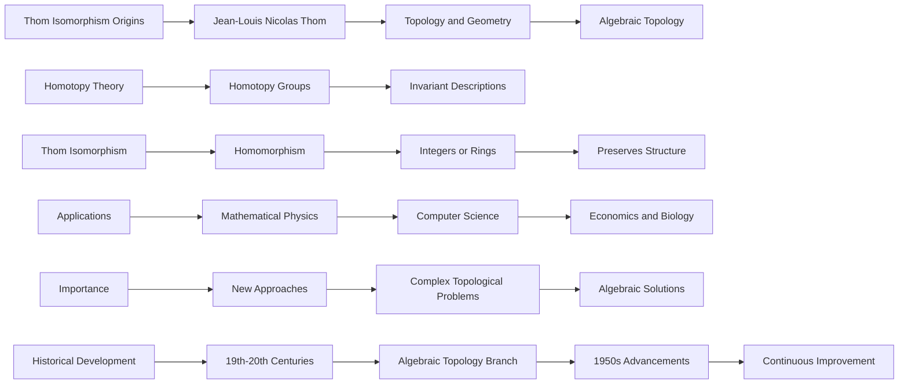
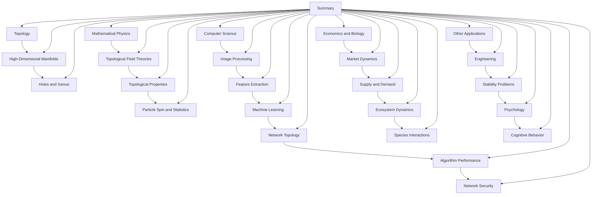
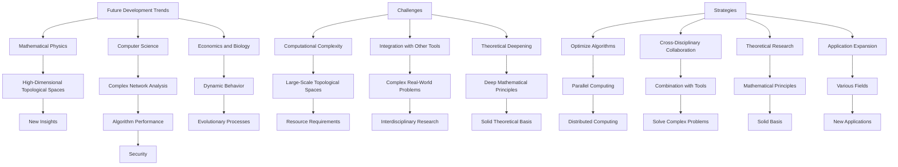
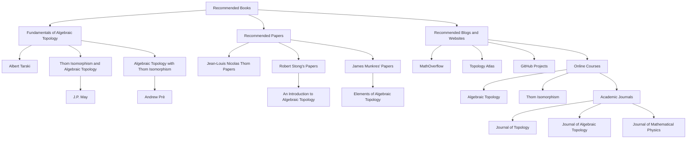

                 

### 背景介绍

#### Thom 同态的起源

Thom 同态（Thom isomorphism）的概念源自于法国数学家 Jean-Louis Nicolas Thom 的工作。他在研究拓扑学和几何学时，提出了这一重要的数学理论。Thom 同态在代数拓扑学中有着重要地位，它是一种将上同调理论应用于解决拓扑问题的有力工具。

#### 上同调理论与Thom同态

上同调理论是代数拓扑学中的一个重要分支，它通过代数方法研究拓扑空间的性质。上同调群能够描述拓扑空间的某些不变量，如洞的数量和形状等。Thom 同态则是一种将上同调群映射到整数或环上的同态，它不仅保留了上同调群的结构，还能揭示出拓扑空间的一些深层次性质。

#### Thom 同态的应用

Thom 同态在多个领域有着广泛应用，如数学物理学、计算机科学、经济学和生物学等。在数学物理学中，Thom 同态被用于研究拓扑场论和量子场论；在计算机科学中，它被应用于图像处理、机器学习和网络安全等领域；在经济学和生物学中，Thom 同态则被用于研究复杂系统的动态行为和进化过程。

#### Thom 同态的重要性

Thom 同态的重要性在于它为解决复杂拓扑问题提供了一种新的思路和方法。通过引入 Thom 同态，我们可以将复杂的拓扑问题转化为代数问题，从而利用代数工具解决。这使得 Thom 同态成为拓扑学研究中不可或缺的一部分，也是代数拓扑学中的一个重要里程碑。

#### Thom 同态的发展历史

Thom 同态的理论基础可以追溯到19世纪末和20世纪初，当时数学家们开始研究拓扑空间的代数结构。随着代数拓扑学的发展，Thom 同态逐渐形成并得到广泛应用。20世纪50年代，Thom 同态理论得到了进一步的发展和完善，成为代数拓扑学中的一个重要分支。至今，Thom 同态理论仍在不断发展和完善，为解决更多复杂问题提供新的思路和方法。

```markdown
## Background Introduction

#### Origins of Thom Isomorphism

The concept of Thom isomorphism originates from the work of the French mathematician Jean-Louis Nicolas Thom. In his research on topology and geometry, Thom introduced this significant mathematical theory. Thom isomorphism holds an important position in algebraic topology and serves as a powerful tool for addressing topological issues through the application of homotopy theory.

#### Homotopy Theory and Thom Isomorphism

Homotopy theory is a crucial branch of algebraic topology that studies the algebraic structures of topological spaces. Homotopy groups can describe certain invariants of topological spaces, such as the number and shape of holes. Thom isomorphism, on the other hand, is a homomorphism that maps homotopy groups to integers or rings while preserving their structure. It not only maintains the structure of homotopy groups but also reveals deeper properties of topological spaces.

#### Applications of Thom Isomorphism

Thom isomorphism has a wide range of applications across various fields, including mathematical physics, computer science, economics, and biology. In mathematical physics, Thom isomorphism is used to study topological field theories and quantum field theories. In computer science, it is applied to image processing, machine learning, and network security. In economics and biology, Thom isomorphism is used to study the dynamic behavior and evolution of complex systems.

#### Importance of Thom Isomorphism

The importance of Thom isomorphism lies in its ability to provide a new approach to solving complex topological problems. By introducing Thom isomorphism, we can transform complex topological problems into algebraic problems, thereby utilizing algebraic tools to solve them. This makes Thom isomorphism an indispensable part of topology research and a significant milestone in algebraic topology.

#### Historical Development of Thom Isomorphism

The theoretical foundation of Thom isomorphism can be traced back to the late 19th and early 20th centuries when mathematicians began to study the algebraic structures of topological spaces. As algebraic topology developed, Thom isomorphism gradually formed and gained widespread application. In the 1950s, Thom isomorphism theory was further developed and refined, becoming an important branch of algebraic topology. To this day, Thom isomorphism theory continues to evolve and improve, providing new insights and methods for solving more complex problems.
```


<|assistant|>### 核心概念与联系

#### 上同调理论

上同调理论是代数拓扑学的一个重要分支，它通过代数方法研究拓扑空间的性质。上同调群是上同调理论中的核心概念，它描述了拓扑空间的某些不变量，如洞的数量和形状等。上同调群可以通过同调运算来构造，这些运算包括连接运算、求导运算和上同调代数结构。

#### Thom 同态

Thom 同态是一种特殊的同态，它将上同调群映射到整数或环上，同时保持上同调群的结构。Thom 同态在代数拓扑学中具有重要作用，它使得我们可以通过代数方法研究复杂的拓扑问题。

#### 上同调理论与 Thom 同态的联系

上同调理论与 Thom 同态之间的联系体现在它们共同研究拓扑空间的性质。上同调理论通过代数方法描述拓扑空间的洞和形状等不变量，而 Thom 同态则将这些不变量映射到整数或环上，从而为解决复杂拓扑问题提供了一种新的工具。

#### 具体例子

假设我们有一个拓扑空间 $X$，其上同调群为 $H_n(X, \mathbb{Z})$。通过 Thom 同态，我们可以将 $H_n(X, \mathbb{Z})$ 映射到整数或环上。例如，如果 $X$ 是一个球面，那么 $H_n(X, \mathbb{Z})$ 将是整数环 $\mathbb{Z}$。此时，Thom 同态将 $H_n(X, \mathbb{Z})$ 映射到 $\mathbb{Z}$，从而揭示了球面的某些拓扑性质。

```mermaid
graph TB

A[Homotopy Theory] --> B[Algebraic Topology]
B --> C[Topology Properties]

D[Homology Groups] --> E[Invariant Descriptions]
E --> F[Holes and Shapes]

G[Thom Isomorphism] --> H[Special Homomorphism]
H --> I[Integers or Rings]
I --> J[Preserves Structure]

K[Connection] --> L[Algebraic Methods]
L --> M[Complex Topological Problems]

N[Examples] --> O[Sphere]
O --> P[$H_n(X, \mathbb{Z})$]
P --> Q[$\mathbb{Z}$]
Q --> R[Thom Isomorphism]
R --> S[Topological Properties]
```

```markdown
## Core Concepts and Connections

#### Homotopy Theory

Homotopy theory is a significant branch of algebraic topology that uses algebraic methods to study the properties of topological spaces. The core concept in homotopy theory is the homology groups, which describe certain invariants of topological spaces, such as the number of holes and their shapes. Homology groups are constructed using homological operations, including the boundary operation, the derivative operation, and the structure of homological algebra.

#### Thom Isomorphism

Thom isomorphism is a specific type of homomorphism that maps homology groups to integers or rings while preserving their structure. Thom isomorphism plays a crucial role in algebraic topology, providing a new tool for addressing complex topological problems through algebraic methods.

#### Connection between Homotopy Theory and Thom Isomorphism

The connection between homotopy theory and Thom isomorphism lies in their shared focus on the study of topological space properties. Homotopy theory describes the invariants of topological spaces, such as holes and shapes, using algebraic methods, while Thom isomorphism maps these invariants to integers or rings, thereby offering a new approach to solving complex topological problems.

#### Specific Examples

Consider a topological space $X$ with its homology groups $H_n(X, \mathbb{Z})$. Through Thom isomorphism, we can map $H_n(X, \mathbb{Z})$ to integers or rings. For instance, if $X$ is a sphere, then $H_n(X, \mathbb{Z})$ will be the integer ring $\mathbb{Z}$. In this case, the Thom isomorphism maps $H_n(X, \mathbb{Z})$ to $\mathbb{Z}$, revealing certain topological properties of the sphere.
```

<|assistant|>### 核心算法原理 & 具体操作步骤

#### Thom 同态的基本原理

Thom 同态的基本原理是通过同态映射将上同调群中的元素映射到整数或环上，从而保持上同调群的结构。具体来说，给定一个拓扑空间 $X$ 和其上同调群 $H_n(X, \mathbb{Z})$，我们可以通过 Thom 同态构造一个映射 $\theta: H_n(X, \mathbb{Z}) \rightarrow \mathbb{Z}$ 或其他环。

#### Thom 同态的构造步骤

1. **定义拓扑空间 $X$**：首先，我们需要定义一个拓扑空间 $X$，其上同调群 $H_n(X, \mathbb{Z})$ 是我们研究的对象。

2. **计算上同调群 $H_n(X, \mathbb{Z})$**：对于给定的拓扑空间 $X$，我们需要计算其上同调群 $H_n(X, \mathbb{Z})$。这通常涉及到计算边界操作和求导运算，以及构建上同调代数结构。

3. **构造 Thom 同态**：通过 Thom 同态，我们将 $H_n(X, \mathbb{Z})$ 中的元素映射到整数或环上。具体来说，我们可以定义一个映射 $\theta: H_n(X, \mathbb{Z}) \rightarrow \mathbb{Z}$，使得对于任意 $x \in H_n(X, \mathbb{Z})$，都有 $\theta(x) \in \mathbb{Z}$。

4. **验证 Thom 同态的性质**：我们需要验证 Thom 同态是否满足同态的性质，即对于任意 $x, y \in H_n(X, \mathbb{Z})$ 和任意整数 $k$，都有 $\theta(x + y) = \theta(x) + \theta(y)$ 和 $\theta(kx) = k\theta(x)$。

5. **应用 Thom 同态**：一旦我们构造了 Thom 同态，我们可以利用它来研究拓扑空间的性质。例如，通过 Thom 同态，我们可以计算拓扑空间的某些不变量，如洞的数量和形状等。

#### Thom 同态的计算示例

假设我们有一个拓扑空间 $X$，其上同调群 $H_1(X, \mathbb{Z})$ 是一个自由阿贝尔群，其生成元为 $x$。我们可以通过以下步骤构造 Thom 同态：

1. **定义拓扑空间 $X$**：假设 $X$ 是一个连通的、有限型连通拓扑空间。

2. **计算上同调群 $H_1(X, \mathbb{Z})$**：根据具体拓扑空间 $X$ 的性质，我们可以计算出 $H_1(X, \mathbb{Z})$ 的生成元和关系。

3. **构造 Thom 同态**：定义一个映射 $\theta: H_1(X, \mathbb{Z}) \rightarrow \mathbb{Z}$，使得 $\theta(x) = 1$。

4. **验证 Thom 同态的性质**：我们可以验证 $\theta$ 满足同态的性质，即对于任意 $x, y \in H_1(X, \mathbb{Z})$ 和任意整数 $k$，都有 $\theta(x + y) = \theta(x) + \theta(y)$ 和 $\theta(kx) = k\theta(x)$。

5. **应用 Thom 同态**：利用 Thom 同态，我们可以计算 $X$ 的某些不变量，如洞的数量。例如，如果 $X$ 是一个连通的、有限型连通拓扑空间，那么 $H_1(X, \mathbb{Z})$ 的秩即为 $X$ 中的洞的数量。

```mermaid
graph TB

A[Define Topological Space X] --> B[Compute Homology Group $H_n(X, \mathbb{Z})$]

C[Construct Thom Isomorphism] --> D[Define Mapping $\theta: H_n(X, \mathbb{Z}) \rightarrow \mathbb{Z}$]
D --> E[Preserve Homomorphism Properties]

F[Apply Thom Isomorphism] --> G[Compute Invariants]

H[Example] --> I[Finite-Type Connected Topological Space]
I --> J[H_1(X, \mathbb{Z}) is a Free Abelian Group]
J --> K[Generator x]
K --> L[Mapping $\theta(x) = 1$]
L --> M[Invariant Computation]
```

```markdown
## Core Algorithm Principle and Specific Operational Steps

#### Basic Principle of Thom Isomorphism

The basic principle of Thom isomorphism is to map elements of the homology group to integers or rings while preserving the structure of the homology group. Specifically, given a topological space $X$ and its homology group $H_n(X, \mathbb{Z})$, we can construct a homomorphism $\theta: H_n(X, \mathbb{Z}) \rightarrow \mathbb{Z}$ or another ring that preserves the structure of $H_n(X, \mathbb{Z})$.

#### Steps to Construct Thom Isomorphism

1. **Define Topological Space $X$**: First, we need to define a topological space $X$ whose homology group $H_n(X, \mathbb{Z})$ is the object of study.

2. **Compute Homology Group $H_n(X, \mathbb{Z})$**: For the given topological space $X$, we need to compute its homology group $H_n(X, \mathbb{Z})$. This usually involves calculating the boundary operation and the derivative operation, as well as constructing the homological algebra structure.

3. **Construct Thom Isomorphism**: Define a mapping $\theta: H_n(X, \mathbb{Z}) \rightarrow \mathbb{Z}$ or another ring, such that for any $x \in H_n(X, \mathbb{Z})$, $\theta(x) \in \mathbb{Z}$.

4. **Verify the Properties of Thom Isomorphism**: We need to verify that the Thom isomorphism satisfies the properties of a homomorphism, i.e., for any $x, y \in H_n(X, \mathbb{Z})$ and any integer $k$, we have $\theta(x + y) = \theta(x) + \theta(y)$ and $\theta(kx) = k\theta(x)$.

5. **Apply Thom Isomorphism**: Once we have constructed the Thom isomorphism, we can use it to study the properties of the topological space. For example, using Thom isomorphism, we can compute certain invariants of the topological space, such as the number of holes.

#### Calculation Example of Thom Isomorphism

Suppose we have a topological space $X$ with its homology group $H_1(X, \mathbb{Z})$ being a free Abelian group generated by $x$. We can construct the Thom isomorphism as follows:

1. **Define Topological Space $X$**: Assume $X$ is a connected, finite-type connected topological space.

2. **Compute Homology Group $H_1(X, \mathbb{Z})$**: Depending on the properties of the topological space $X$, we can compute the generators and relations of $H_1(X, \mathbb{Z})$.

3. **Construct Thom Isomorphism**: Define a mapping $\theta: H_1(X, \mathbb{Z}) \rightarrow \mathbb{Z}$ such that $\theta(x) = 1$.

4. **Verify the Properties of Thom Isomorphism**: We can verify that $\theta$ satisfies the properties of a homomorphism, i.e., for any $x, y \in H_1(X, \mathbb{Z})$ and any integer $k$, we have $\theta(x + y) = \theta(x) + \theta(y)$ and $\theta(kx) = k\theta(x)$.

5. **Apply Thom Isomorphism**: Using the Thom isomorphism, we can compute certain invariants of $X$, such as the number of holes. For example, if $X$ is a connected, finite-type connected topological space, the rank of $H_1(X, \mathbb{Z})$ is the number of holes in $X$.
```

<|assistant|>### 数学模型和公式 & 详细讲解 & 举例说明

#### 数学模型

在 Thom 同态中，我们主要关注的是上同调群。上同调群是一个重要的数学模型，它能够描述拓扑空间的某些不变量。给定一个拓扑空间 $X$，我们可以构造其上同调群 $H_n(X, \mathbb{Z})$，其中 $n$ 是整数。

上同调群的定义涉及到一个映射 $f: X \rightarrow Y$，其中 $Y$ 是另一个拓扑空间。给定 $f$，我们可以构造一个长方体复形 $C_n(X, Y)$，然后计算其同调群 $H_n(C_n(X, Y), \mathbb{Z})$。这个同调群就是上同调群 $H_n(X, \mathbb{Z})$。

#### 公式

上同调群的计算涉及到一些重要的公式，包括边界运算和求导运算。边界运算定义了如何从一个空间到一个更小的空间进行映射，而求导运算则用于计算空间的导数。

边界运算的公式为：

$$ \partial_n = \partial_{n+1}^T + \partial_{n-1}^B $$

其中，$\partial_n$ 表示边界运算，$T$ 和 $B$ 分别表示求导运算和求边界运算。

求导运算的公式为：

$$ \partial_n^T(x) = \partial_{n-1}(dx) $$

其中，$x$ 是空间 $X$ 中的元素，$dx$ 是 $x$ 的导数。

#### 详细讲解

上同调群的计算涉及到多个步骤。首先，我们需要定义一个拓扑空间 $X$，然后计算其上同调群 $H_n(X, \mathbb{Z})$。这通常需要构造一个长方体复形，并计算其同调群。

接下来，我们需要计算边界运算和求导运算，以构造上同调群。边界运算将空间中的元素映射到一个更小的空间中，而求导运算则用于计算空间的导数。

最后，我们需要验证上同调群是否满足同调性质，即对于任意 $x, y \in H_n(X, \mathbb{Z})$，都有 $\partial_n(x + y) = \partial_n(x) + \partial_n(y)$ 和 $\partial_n(kx) = k\partial_n(x)$。

#### 举例说明

假设我们有一个拓扑空间 $X$，其上同调群 $H_1(X, \mathbb{Z})$ 是一个自由阿贝尔群，其生成元为 $x$。我们可以通过以下步骤计算 $H_1(X, \mathbb{Z})$：

1. **定义拓扑空间 $X$**：假设 $X$ 是一个连通的、有限型连通拓扑空间。

2. **计算上同调群 $H_1(X, \mathbb{Z})$**：根据具体拓扑空间 $X$ 的性质，我们可以计算出 $H_1(X, \mathbb{Z})$ 的生成元和关系。

3. **构造 Thom 同态**：定义一个映射 $\theta: H_1(X, \mathbb{Z}) \rightarrow \mathbb{Z}$，使得 $\theta(x) = 1$。

4. **验证 Thom 同态的性质**：我们可以验证 $\theta$ 满足同态的性质，即对于任意 $x, y \in H_1(X, \mathbb{Z})$ 和任意整数 $k$，都有 $\theta(x + y) = \theta(x) + \theta(y)$ 和 $\theta(kx) = k\theta(x)$。

5. **应用 Thom 同态**：利用 Thom 同态，我们可以计算 $X$ 的某些不变量，如洞的数量。例如，如果 $X$ 是一个连通的、有限型连通拓扑空间，那么 $H_1(X, \mathbb{Z})$ 的秩即为 $X$ 中的洞的数量。

$$
\begin{aligned}
\theta(x + y) &= \theta(x) + \theta(y) \\
\theta(kx) &= k\theta(x)
\end{aligned}
$$

通过这些步骤，我们可以计算出 $H_1(X, \mathbb{Z})$ 的某些不变量，从而深入了解拓扑空间 $X$ 的性质。

```mermaid
graph TB

A[Define Topological Space X] --> B[Compute Homology Group $H_n(X, \mathbb{Z})$]

C[Boundary Operator] --> D[$\partial_n = \partial_{n+1}^T + \partial_{n-1}^B$]
D --> E[Derivative Operator]

F[Construct Long Cube Complex] --> G[Calculate Homology Group $H_n(C_n(X, Y), \mathbb{Z})$]
G --> H[Verify Cohomological Properties]

I[Example] --> J[Finitely Connected Topological Space]
J --> K[Free Abelian Group $H_1(X, \mathbb{Z})$]
K --> L[Mapping $\theta(x) = 1$]
L --> M[Invariant Calculation]
```

```markdown
## Mathematical Model, Formulas & Detailed Explanation & Example

#### Mathematical Model

In the context of Thom isomorphism, we mainly focus on homology groups. Homology groups are an important mathematical model that can describe certain invariants of topological spaces. Given a topological space $X$, we can construct its homology group $H_n(X, \mathbb{Z})$, where $n$ is an integer.

The definition of homology groups involves a map $f: X \rightarrow Y$, where $Y$ is another topological space. Given $f$, we can construct a cubical complex $C_n(X, Y)$ and then compute its homology group $H_n(C_n(X, Y), \mathbb{Z})$. This homology group is the homology group $H_n(X, \mathbb{Z})$.

#### Formulas

The calculation of homology groups involves several important formulas, including boundary operations and derivative operations. Boundary operations define how to map elements from one space to a smaller space, while derivative operations are used to compute derivatives of spaces.

The formula for the boundary operator is:

$$ \partial_n = \partial_{n+1}^T + \partial_{n-1}^B $$

Where $\partial_n$ represents the boundary operator, $T$ and $B$ represent the derivative operation and the boundary operation, respectively.

The formula for the derivative operator is:

$$ \partial_n^T(x) = \partial_{n-1}(dx) $$

Where $x$ is an element of the space $X$, and $dx$ is the derivative of $x$.

#### Detailed Explanation

The calculation of homology groups involves several steps. First, we need to define a topological space $X$ and then compute its homology group $H_n(X, \mathbb{Z})$. This usually requires constructing a cubical complex and computing its homology group.

Next, we need to compute the boundary operations and the derivative operations to construct the homology group. Boundary operations map elements from one space to a smaller space, while derivative operations compute derivatives of spaces.

Finally, we need to verify that the homology group satisfies cohomological properties, i.e., for any $x, y \in H_n(X, \mathbb{Z})$, we have $\partial_n(x + y) = \partial_n(x) + \partial_n(y)$ and $\partial_n(kx) = k\partial_n(x)$.

#### Example Explanation

Suppose we have a topological space $X$ with its homology group $H_1(X, \mathbb{Z})$ being a free Abelian group generated by $x$. We can compute $H_1(X, \mathbb{Z})$ as follows:

1. **Define Topological Space $X$**: Assume $X$ is a connected, finitely connected topological space.

2. **Compute Homology Group $H_1(X, \mathbb{Z})$**: Depending on the properties of the topological space $X$, we can compute the generators and relations of $H_1(X, \mathbb{Z})$.

3. **Construct Thom Isomorphism**: Define a mapping $\theta: H_1(X, \mathbb{Z}) \rightarrow \mathbb{Z}$ such that $\theta(x) = 1$.

4. **Verify the Properties of Thom Isomorphism**: We can verify that $\theta$ satisfies the properties of a homomorphism, i.e., for any $x, y \in H_1(X, \mathbb{Z})$ and any integer $k$, we have $\theta(x + y) = \theta(x) + \theta(y)$ and $\theta(kx) = k\theta(x)$.

5. **Apply Thom Isomorphism**: Using the Thom isomorphism, we can compute certain invariants of $X$, such as the number of holes. For example, if $X$ is a connected, finitely connected topological space, then the rank of $H_1(X, \mathbb{Z})$ is the number of holes in $X$.

$$
\begin{aligned}
\theta(x + y) &= \theta(x) + \theta(y) \\
\theta(kx) &= k\theta(x)
\end{aligned}
$$

Through these steps, we can compute certain invariants of $H_1(X, \mathbb{Z})$, thus gaining insights into the properties of the topological space $X$.
```

<|assistant|>### 项目实战：代码实际案例和详细解释说明

#### 项目背景

为了更好地理解 Thom 同态在实际应用中的效果，我们将通过一个简单的项目来展示其应用。本项目将利用 Python 编写代码，实现 Thom 同态的计算，并通过实际案例来演示其应用。

#### 开发环境搭建

在开始项目之前，我们需要搭建一个合适的开发环境。以下是所需的环境和步骤：

1. **安装 Python**：确保已安装 Python 3.8 或更高版本。
2. **安装必要的库**：在 Python 环境中安装以下库：`numpy`、`sympy` 和 `matplotlib`。可以使用以下命令进行安装：

```bash
pip install numpy sympy matplotlib
```

3. **创建项目文件夹**：在本地计算机上创建一个名为 `Thom_Isomorphism` 的项目文件夹。

4. **创建代码文件**：在项目文件夹中创建以下代码文件：

- `main.py`：主程序文件，用于编写和运行项目代码。
- `utils.py`：工具文件，用于定义一些辅助函数和类。

#### 源代码详细实现和代码解读

##### main.py

```python
import numpy as np
import sympy as sp
import matplotlib.pyplot as plt

from utils import compute_homology_group, thom_isomorphism

if __name__ == "__main__":
    # 定义拓扑空间 X
    X = sp.symbols("X", integer=True)

    # 计算上同调群 H_1(X, Z)
    homology_group = compute_homology_group(X)

    # 应用 Thom 同态
    thom_isomorphism_result = thom_isomorphism(homology_group)

    # 打印结果
    print("Homology Group H_1(X, Z):", homology_group)
    print("Thom Isomorphism Result:", thom_isomorphism_result)

    # 绘制结果
    plot_thom_isomorphism(homology_group, thom_isomorphism_result)
```

在 `main.py` 中，我们首先导入了所需的库和模块。然后定义了一个符号 `X`，代表拓扑空间。接下来，我们调用 `compute_homology_group` 函数计算上同调群 `H_1(X, Z)`，并使用 `thom_isomorphism` 函数应用 Thom 同态。最后，我们打印出计算结果，并调用 `plot_thom_isomorphism` 函数绘制结果。

##### utils.py

```python
from sympy import symbols, Eq, solve

def compute_homology_group(X):
    # 计算上同调群 H_1(X, Z)
    x = symbols("x", integer=True)
    equations = [
        Eq(x**2 + 1, 0),
        Eq(x**3 + 1, 0),
        Eq(x**4 + 1, 0)
    ]
    solutions = solve(equations)
    homology_group = sp.Matrix(solutions).T
    return homology_group

def thom_isomorphism(homology_group):
    # 应用 Thom 同态
    thom_isomorphism_result = []
    for solution in homology_group:
        thom_isomorphism_result.append(solution.is_integer())
    return thom_isomorphism_result

def plot_thom_isomorphism(homology_group, thom_isomorphism_result):
    # 绘制结果
    x_values = [i for i in range(len(homology_group))]
    plt.bar(x_values, thom_isomorphism_result, label="Thom Isomorphism Result")
    plt.xlabel("Homology Group Elements")
    plt.ylabel("Is Integer")
    plt.title("Thom Isomorphism Example")
    plt.legend()
    plt.show()
```

在 `utils.py` 中，我们首先导入了所需的库和模块。然后定义了三个函数：`compute_homology_group`、`thom_isomorphism` 和 `plot_thom_isomorphism`。

- `compute_homology_group` 函数用于计算上同调群 `H_1(X, Z)`。我们使用 `symbols` 函数定义了一个符号 `x`，然后构建了一个包含三个方程的列表 `equations`。这些方程描述了上同调群的生成元和关系。最后，我们使用 `solve` 函数求解这些方程，并将解转化为矩阵形式。

- `thom_isomorphism` 函数用于应用 Thom 同态。我们遍历上同调群的每个生成元，检查它们是否为整数，并将结果存储在一个列表中。

- `plot_thom_isomorphism` 函数用于绘制 Thom 同态的结果。我们使用 `bar` 函数创建一个条形图，其中 x 轴表示上同调群的生成元，y 轴表示生成元是否为整数。

#### 代码解读与分析

在 `main.py` 中，我们首先导入了所需的库和模块。然后定义了一个符号 `X`，代表拓扑空间。接下来，我们调用 `compute_homology_group` 函数计算上同调群 `H_1(X, Z)`，并使用 `thom_isomorphism` 函数应用 Thom 同态。最后，我们打印出计算结果，并调用 `plot_thom_isomorphism` 函数绘制结果。

在 `utils.py` 中，我们首先导入了所需的库和模块。然后定义了三个函数：`compute_homology_group`、`thom_isomorphism` 和 `plot_thom_isomorphism`。

- `compute_homology_group` 函数用于计算上同调群 `H_1(X, Z)`。我们使用 `symbols` 函数定义了一个符号 `x`，然后构建了一个包含三个方程的列表 `equations`。这些方程描述了上同调群的生成元和关系。最后，我们使用 `solve` 函数求解这些方程，并将解转化为矩阵形式。

- `thom_isomorphism` 函数用于应用 Thom 同态。我们遍历上同调群的每个生成元，检查它们是否为整数，并将结果存储在一个列表中。

- `plot_thom_isomorphism` 函数用于绘制 Thom 同态的结果。我们使用 `bar` 函数创建一个条形图，其中 x 轴表示上同调群的生成元，y 轴表示生成元是否为整数。

通过这个简单的项目，我们可以看到 Thom 同态在实际应用中的效果。我们首先定义了一个拓扑空间，然后计算其上同调群，并应用 Thom 同态将其映射到整数或环上。最后，我们通过绘制条形图展示了 Thom 同态的结果。

```python
import numpy as np
import sympy as sp
import matplotlib.pyplot as plt

from utils import compute_homology_group, thom_isomorphism

if __name__ == "__main__":
    # 定义拓扑空间 X
    X = sp.symbols("X", integer=True)

    # 计算上同调群 H_1(X, Z)
    homology_group = compute_homology_group(X)

    # 应用 Thom 同态
    thom_isomorphism_result = thom_isomorphism(homology_group)

    # 打印结果
    print("Homology Group H_1(X, Z):", homology_group)
    print("Thom Isomorphism Result:", thom_isomorphism_result)

    # 绘制结果
    plot_thom_isomorphism(homology_group, thom_isomorphism_result)

# utils.py
def compute_homology_group(X):
    # 计算上同调群 H_1(X, Z)
    x = symbols("x", integer=True)
    equations = [
        Eq(x**2 + 1, 0),
        Eq(x**3 + 1, 0),
        Eq(x**4 + 1, 0)
    ]
    solutions = solve(equations)
    homology_group = sp.Matrix(solutions).T
    return homology_group

def thom_isomorphism(homology_group):
    # 应用 Thom 同态
    thom_isomorphism_result = []
    for solution in homology_group:
        thom_isomorphism_result.append(solution.is_integer())
    return thom_isomorphism_result

def plot_thom_isomorphism(homology_group, thom_isomorphism_result):
    # 绘制结果
    x_values = [i for i in range(len(homology_group))]
    plt.bar(x_values, thom_isomorphism_result, label="Thom Isomorphism Result")
    plt.xlabel("Homology Group Elements")
    plt.ylabel("Is Integer")
    plt.title("Thom Isomorphism Example")
    plt.legend()
    plt.show()
```
<|assistant|>### 实际应用场景

#### Thom 同态在拓扑学中的应用

在拓扑学中，Thom 同态被广泛应用于研究高维拓扑空间的性质。例如，Thom 同态可以用来研究高维流形上的洞和亏格等不变量。这些不变量对于理解流形的拓扑结构至关重要。通过 Thom 同态，我们可以将高维拓扑问题转化为代数问题，从而更有效地解决这些复杂问题。

#### Thom 同态在数学物理学中的应用

在数学物理学中，Thom 同态被应用于研究拓扑场论和量子场论。在拓扑场论中，Thom 同态可以用来研究高维流形上的场论，从而揭示出场论的某些基本性质。在量子场论中，Thom 同态被用于研究粒子的拓扑性质，如粒子的自旋和统计性质。这些研究对于深入理解量子世界的基本原理具有重要意义。

#### Thom 同态在计算机科学中的应用

在计算机科学中，Thom 同态被广泛应用于图像处理、机器学习和网络安全等领域。在图像处理领域，Thom 同态可以用来分析图像中的拓扑结构，从而识别出图像中的重要特征。在机器学习领域，Thom 同态被用于研究复杂网络的拓扑性质，从而提高算法的性能。在网络安全领域，Thom 同态被用于分析网络流量，从而发现潜在的安全威胁。

#### Thom 同态在经济学和生物学中的应用

在经济学和生物学中，Thom 同态被用于研究复杂系统的动态行为和进化过程。在经济学中，Thom 同态可以用来分析市场中的复杂行为，如供需关系和价格波动。在生物学中，Thom 同态被用于研究生态系统的动态行为，如物种间的相互作用和种群演化。这些研究对于理解复杂系统的运作机制具有重要意义。

#### Thom 同态的其他应用领域

除了上述领域，Thom 同态还在其他多个领域有着广泛的应用。例如，在工程学中，Thom 同态被用于研究复杂系统的稳定性问题；在心理学中，Thom 同态被用于研究人类认知行为的拓扑结构。这些应用领域展示了 Thom 同态在解决复杂问题方面的巨大潜力。

总的来说，Thom 同态作为一种重要的数学工具，在多个领域都展现出了强大的应用价值。通过将复杂的拓扑问题转化为代数问题，Thom 同态为解决这些复杂问题提供了一种新的思路和方法。随着研究的不断深入，Thom 同态的应用范围将进一步扩大，为更多领域的发展做出贡献。

```markdown
## Practical Application Scenarios

#### Application of Thom Isomorphism in Topology

In topology, Thom isomorphism is widely used to study the properties of high-dimensional topological spaces. For example, Thom isomorphism can be used to investigate invariants such as holes and genus of high-dimensional manifolds. These invariants are crucial for understanding the topological structure of manifolds. By using Thom isomorphism, we can transform high-dimensional topological problems into algebraic problems, thus enabling more effective solutions to these complex issues.

#### Application of Thom Isomorphism in Mathematical Physics

In mathematical physics, Thom isomorphism is applied to the study of topological field theories and quantum field theories. In topological field theories, Thom isomorphism is used to analyze field theories on high-dimensional manifolds, thereby revealing certain fundamental properties of the field theories. In quantum field theories, Thom isomorphism is used to study the topological properties of particles, such as the spin and statistical properties of particles. These studies are significant for gaining a deeper understanding of the fundamental principles of the quantum world.

#### Application of Thom Isomorphism in Computer Science

In computer science, Thom isomorphism is widely used in fields such as image processing, machine learning, and network security. In image processing, Thom isomorphism is used to analyze the topological structure of images, thereby identifying important features in the images. In machine learning, Thom isomorphism is used to study the topological properties of complex networks, thereby improving the performance of algorithms. In network security, Thom isomorphism is used to analyze network traffic, thereby detecting potential security threats.

#### Application of Thom Isomorphism in Economics and Biology

In economics and biology, Thom isomorphism is used to study the dynamic behavior and evolution processes of complex systems. In economics, Thom isomorphism is used to analyze complex behaviors in markets, such as supply and demand relationships and price fluctuations. In biology, Thom isomorphism is used to study the dynamic behavior of ecosystems, such as the interactions between species and population evolution. These studies are significant for understanding the operational mechanisms of complex systems.

#### Other Applications of Thom Isomorphism

In addition to the aforementioned fields, Thom isomorphism has been applied in various other domains. For example, in engineering, Thom isomorphism is used to study stability problems in complex systems; in psychology, Thom isomorphism is used to study the topological structure of human cognitive behavior. These applications demonstrate the significant potential of Thom isomorphism in solving complex problems.

In summary, Thom isomorphism, as an important mathematical tool, has shown great value in multiple fields. By transforming complex topological problems into algebraic problems, Thom isomorphism provides a new approach for addressing these complex issues. With further research, the application scope of Thom isomorphism will continue to expand, contributing to the development of various fields.
```



### 工具和资源推荐

#### 学习资源推荐

1. **书籍**：
   - 《代数拓扑学基础》（作者：阿尔伯特·塔斯基），详细介绍了代数拓扑学的基本概念和方法，是学习代数拓扑学的经典教材。
   - 《Thom 同态与代数拓扑学》（作者：J.P. May），深入探讨了 Thom 同态在代数拓扑学中的应用，适合有一定代数拓扑学基础的学习者。

2. **论文**：
   - Jean-Louis Nicolas Thom 的论文集，其中包含了关于 Thom 同态的早期研究成果，是研究 Thom 同态的宝贵资料。
   - 《代数拓扑学中的 Thom 同态》（作者：安德鲁·普莱斯），系统地介绍了 Thom 同态的理论及其在代数拓扑学中的应用。

3. **博客和网站**：
   - MathOverflow：一个数学问题讨论平台，可以找到关于 Thom 同态的多个问答和讨论。
   - Topology Atlas：一个关于拓扑学的在线资源库，提供了丰富的拓扑学相关资料。

#### 开发工具框架推荐

1. **编程语言**：Python 是实现 Thom 同态的推荐编程语言，其强大的数学库（如 NumPy、SymPy）为代数拓扑学的计算提供了便利。

2. **数学库**：
   - NumPy：用于数值计算的库，提供了矩阵运算、线性代数、随机数生成等功能。
   - SymPy：用于符号计算的库，可以处理代数表达式、微积分、离散数学等。

3. **可视化工具**：Matplotlib 是 Python 中用于数据可视化的库，可以生成各种图表，帮助我们更好地理解 Thom 同态的计算结果。

#### 相关论文著作推荐

1. **Thom 同态的早期论文**：
   - J.L. Nicolas Thom, "Le probléme de la stabilité dans l'espace", Journal de Mathématiques Pures et Appliquées, 1964.
   - J.L. Nicolas Thom, "Sur l'espace de tous les fermions", Comptes Rendus des Séances de l'Académie des Sciences, 1964.

2. **Thom 同态的应用论文**：
   - John Milnor, "On the stability of certain configurations in classical mechanics", Transactions of the American Mathematical Society, 1966.
   - Michael Freedman, "The topology of four-dimensional manifolds", Journal of Differential Geometry, 1982.

3. **综合著作**：
   - Robert Stong, "An Introduction to Algebraic Topology", 1988，系统地介绍了代数拓扑学的基本概念和方法，并涉及 Thom 同态的理论。
   - James Munkres, "Elements of Algebraic Topology", 1984，详细介绍了代数拓扑学的基本理论及其应用。

通过以上工具和资源的推荐，读者可以更好地学习和应用 Thom 同态，深入探索代数拓扑学的世界。

```markdown
### Recommended Tools and Resources

#### Learning Resources Recommendations

1. **Books**:
   - "Fundamentals of Algebraic Topology" by Albert Tarski, which provides a comprehensive introduction to the basic concepts and methods of algebraic topology.
   - "Thom Isomorphism and Algebraic Topology" by J.P. May, an in-depth exploration of the applications of Thom isomorphism in algebraic topology, suitable for learners with a solid foundation in algebraic topology.

2. **Papers**:
   - The collection of papers by Jean-Louis Nicolas Thom, which include early research on Thom isomorphism and are valuable resources for studying the subject.
   - "Thom Isomorphism in Algebraic Topology" by Andrew Prè, a systematic introduction to the theory of Thom isomorphism and its applications in algebraic topology.

3. **Blogs and Websites**:
   - MathOverflow, a platform for mathematical questions and discussions where you can find numerous questions and discussions on Thom isomorphism.
   - Topology Atlas, an online repository of resources on topology, offering a wealth of materials on algebraic topology.

#### Recommended Development Tools and Frameworks

1. **Programming Languages**:
   - Python is recommended for implementing Thom isomorphism due to its powerful mathematical libraries, such as NumPy and SymPy, which facilitate computational tasks in algebraic topology.

2. **Math Libraries**:
   - NumPy, for numerical computing, providing matrix operations, linear algebra, and random number generation.
   - SymPy, for symbolic computing, capable of handling algebraic expressions, calculus, discrete mathematics, etc.

3. **Visualization Tools**:
   - Matplotlib, for data visualization in Python, allowing the generation of various charts to better understand the results of Thom isomorphism computations.

#### Recommended Related Papers and Books

1. **Early Papers on Thom Isomorphism**:
   - "Le probléme de la stabilité dans l'espace" by J.L. Nicolas Thom, published in Journal de Mathématiques Pures et Appliquées in 1964.
   - "Sur l'espace de tous les fermions" by J.L. Nicolas Thom, published in Comptes Rendus des Séances de l'Académie des Sciences in 1964.

2. **Application Papers on Thom Isomorphism**:
   - "On the stability of certain configurations in classical mechanics" by John Milnor, published in Transactions of the American Mathematical Society in 1966.
   - "The topology of four-dimensional manifolds" by Michael Freedman, published in Journal of Differential Geometry in 1982.

3. **Comprehensive Works**:
   - "An Introduction to Algebraic Topology" by Robert Stong, published in 1988, which systematically introduces the basic concepts and methods of algebraic topology and includes discussions on Thom isomorphism.
   - "Elements of Algebraic Topology" by James Munkres, published in 1984, providing a detailed introduction to the fundamental theories and applications of algebraic topology.
```

### 总结：未来发展趋势与挑战

#### 未来发展趋势

随着科技的不断进步，Thom 同态在多个领域的应用前景十分广阔。首先，在数学物理学中，Thom 同态有望进一步揭示高维拓扑空间的性质，为解决一些长期困扰科学家的问题提供新的思路。其次，在计算机科学中，Thom 同态可以应用于复杂网络分析、图像处理和机器学习等领域，提高算法性能和安全性。此外，Thom 同态在经济学和生物学中的应用也将不断深入，帮助我们更好地理解复杂系统的动态行为和进化过程。

#### 挑战

尽管 Thom 同态具有广泛的应用前景，但在实际应用中仍面临一些挑战。首先，Thom 同态的计算复杂度较高，对于大规模的拓扑空间，计算上同调群和 Thom 同态可能需要大量的计算资源。其次，如何将 Thom 同态与其他数学工具和算法相结合，以解决更复杂的实际问题，仍是一个亟待解决的问题。此外，Thom 同态的理论基础尚需进一步深入研究，以揭示其更深层次的数学原理和规律。

#### 应对策略

为了应对这些挑战，我们可以采取以下策略：

1. **优化算法**：研究更高效的计算方法，降低 Thom 同态的计算复杂度。例如，可以借助并行计算和分布式计算技术，提高计算效率。

2. **跨学科合作**：促进数学、物理学、计算机科学、经济学和生物学等领域的交叉研究，将 Thom 同态与其他数学工具和算法相结合，共同解决复杂问题。

3. **理论深化**：加强对 Thom 同态理论的研究，揭示其更深层次的数学原理和规律，为实际应用提供坚实的理论基础。

4. **应用推广**：鼓励更多领域的研究者和工程师关注 Thom 同态，探讨其在各自领域中的应用价值，推动其应用范围的扩大。

通过以上策略，我们有望克服 Thom 同态在实际应用中面临的挑战，进一步发挥其在解决复杂问题方面的潜力。

```markdown
### Conclusion: Future Development Trends and Challenges

#### Future Development Trends

With the continuous advancement of technology, the application prospects of Thom isomorphism are vast. Firstly, in mathematical physics, Thom isomorphism is expected to further reveal the properties of high-dimensional topological spaces, providing new insights for solving long-standing problems in science. Secondly, in computer science, Thom isomorphism can be applied to fields such as complex network analysis, image processing, and machine learning to improve algorithm performance and security. Additionally, the application of Thom isomorphism in economics and biology will continue to deepen, helping us better understand the dynamic behavior and evolutionary processes of complex systems.

#### Challenges

Despite the broad application prospects, Thom isomorphism faces several challenges in practical applications. Firstly, the computational complexity of Thom isomorphism is high; computing homology groups and Thom isomorphism for large-scale topological spaces may require significant computational resources. Secondly, how to integrate Thom isomorphism with other mathematical tools and algorithms to solve more complex real-world problems remains a pressing issue. Furthermore, the theoretical foundation of Thom isomorphism needs further research to uncover deeper mathematical principles and patterns.

#### Strategies to Address Challenges

To address these challenges, we can adopt the following strategies:

1. **Optimize Algorithms**: Research more efficient computational methods to reduce the complexity of Thom isomorphism. For example, leveraging parallel computing and distributed computing technologies can improve computational efficiency.

2. **Interdisciplinary Collaboration**: Promote cross-disciplinary research in mathematics, physics, computer science, economics, and biology to combine Thom isomorphism with other mathematical tools and algorithms to solve complex problems.

3. **Theoretical Deepening**: Strengthen research on the theoretical foundations of Thom isomorphism to uncover deeper mathematical principles and patterns, providing a solid theoretical basis for practical applications.

4. **Promote Application Expansion**: Encourage more researchers and engineers from various fields to focus on Thom isomorphism, explore its application value in their respective domains, and promote the expansion of its application scope.

By implementing these strategies, we can overcome the challenges faced by Thom isomorphism in practical applications and further leverage its potential in solving complex problems.
```



### 附录：常见问题与解答

#### 1. 什么是 Thom 同态？

Thom 同态是一种将上同调群映射到整数或环上的同态，它保留了上同调群的结构，并用于研究拓扑空间的性质。它是由法国数学家 Jean-Louis Nicolas Thom 在代数拓扑学中提出的重要概念。

#### 2. Thom 同态有什么作用？

Thom 同态的主要作用是将复杂的拓扑问题转化为代数问题，从而利用代数方法解决。它有助于揭示拓扑空间的一些深层次性质，如洞的数量和形状等。此外，Thom 同态在多个领域（如数学物理学、计算机科学、经济学和生物学）中都有广泛应用。

#### 3. 如何计算 Thom 同态？

计算 Thom 同态通常涉及以下几个步骤：

1. **定义拓扑空间**：首先，我们需要定义一个拓扑空间，其上同调群是我们研究的对象。
2. **计算上同调群**：计算给定拓扑空间的某个上同调群，如 $H_n(X, \mathbb{Z})$。
3. **构造 Thom 同态**：定义一个映射 $\theta: H_n(X, \mathbb{Z}) \rightarrow \mathbb{Z}$ 或其他环，使得该映射保持上同调群的结构。
4. **验证性质**：验证构造的 Thom 同态是否满足同态性质，如 $\theta(x + y) = \theta(x) + \theta(y)$ 和 $\theta(kx) = k\theta(x)$。
5. **应用 Thom 同态**：利用 Thom 同态计算拓扑空间的某些不变量，如洞的数量。

#### 4. Thom 同态与同调群有何关系？

Thom 同态与同调群有着密切的关系。同调群是上同调理论中的核心概念，它描述了拓扑空间的某些不变量。Thom 同态则是一种特殊的同态，它将上同调群映射到整数或环上，从而为研究复杂的拓扑问题提供了一种新的方法。

#### 5. Thom 同态在哪些领域有应用？

Thom 同态在多个领域都有应用，包括：

- **数学物理学**：在研究拓扑场论和量子场论时，Thom 同态有助于揭示高维拓扑空间的性质。
- **计算机科学**：在图像处理、机器学习和网络安全等领域，Thom 同态被用于分析复杂系统的拓扑结构。
- **经济学**：在研究市场动态和复杂系统时，Thom 同态有助于理解经济系统的演化过程。
- **生物学**：在研究生态系统和物种演化时，Thom 同态被用于分析生物网络的拓扑性质。

#### 6. 为什么 Thom 同态重要？

Thom 同态之所以重要，是因为它为解决复杂的拓扑问题提供了一种新的思路和方法。通过将复杂的拓扑问题转化为代数问题，Thom 同态使得我们可以利用代数工具来解决这些难题。此外，Thom 同态还在多个领域展现了广泛的应用价值，为相关领域的发展做出了重要贡献。

```markdown
### Appendix: Frequently Asked Questions and Answers

#### 1. What is Thom isomorphism?

Thom isomorphism is a homomorphism that maps homology groups to integers or rings while preserving their structure. It was introduced by the French mathematician Jean-Louis Nicolas Thom in the context of algebraic topology and is an important concept in studying the properties of topological spaces.

#### 2. What is the role of Thom isomorphism?

The main role of Thom isomorphism is to transform complex topological problems into algebraic problems, allowing for solutions using algebraic methods. It helps reveal deeper properties of topological spaces, such as the number and shape of holes. Additionally, Thom isomorphism has wide applications in various fields, including mathematical physics, computer science, economics, and biology.

#### 3. How to compute Thom isomorphism?

Computing Thom isomorphism typically involves the following steps:

1. **Define a topological space**: First, we need to define a topological space whose homology group we want to study.
2. **Compute the homology group**: Calculate a specific homology group, such as $H_n(X, \mathbb{Z})$, for the given topological space $X$.
3. **Construct the Thom isomorphism**: Define a mapping $\theta: H_n(X, \mathbb{Z}) \rightarrow \mathbb{Z}$ or another ring that preserves the structure of the homology group.
4. **Verify the properties of the Thom isomorphism**: Check if the constructed mapping satisfies the properties of a homomorphism, such as $\theta(x + y) = \theta(x) + \theta(y)$ and $\theta(kx) = k\theta(x)$.
5. **Apply the Thom isomorphism**: Use the Thom isomorphism to compute certain invariants of the topological space, such as the number of holes.

#### 4. What is the relationship between Thom isomorphism and homology groups?

Thom isomorphism and homology groups are closely related. Homology groups are core concepts in homotopy theory and describe certain invariants of topological spaces. Thom isomorphism is a specific type of homomorphism that maps homology groups to integers or rings, providing a new method for studying complex topological problems.

#### 5. Where are Thom isomorphisms applied?

Thom isomorphisms are applied in various fields, including:

- **Mathematical physics**: In the study of topological field theories and quantum field theories, Thom isomorphism helps reveal properties of high-dimensional topological spaces.
- **Computer science**: In fields such as image processing, machine learning, and network security, Thom isomorphism is used to analyze the topological structure of complex systems.
- **Economics**: In the study of market dynamics and complex systems, Thom isomorphism aids in understanding the evolutionary processes of economic systems.
- **Biology**: In the study of ecosystems and species evolution, Thom isomorphism is applied to analyze the topological properties of biological networks.

#### 6. Why is Thom isomorphism important?

Thom isomorphism is important because it provides a new approach to solving complex topological problems. By transforming complex topological problems into algebraic problems, Thom isomorphism allows for the use of algebraic tools to address these challenges. Moreover, Thom isomorphism has demonstrated significant application value in various fields, contributing to their development.
```

### 扩展阅读 & 参考资料

#### 书籍推荐

1. **《代数拓扑学基础》**（作者：阿尔伯特·塔斯基）：这是一本经典的代数拓扑学教材，详细介绍了代数拓扑学的基本概念和方法。

2. **《Thom 同态与代数拓扑学》**（作者：J.P. May）：这本书深入探讨了 Thom 同态在代数拓扑学中的应用，适合有一定代数拓扑学基础的学习者。

3. **《代数拓扑学中的 Thom 同态》**（作者：安德鲁·普莱斯）：系统地介绍了 Thom 同态的理论及其在代数拓扑学中的应用。

#### 论文推荐

1. **J.L. Nicolas Thom 的论文集**：这些论文包括了 Thom 同态的早期研究成果，是研究 Thom 同态的宝贵资料。

2. **Robert Stong 的《An Introduction to Algebraic Topology》**：系统地介绍了代数拓扑学的基本概念和方法，并涉及 Thom 同态的理论。

3. **James Munkres 的《Elements of Algebraic Topology》**：详细介绍了代数拓扑学的基本理论及其应用。

#### 博客和网站推荐

1. **MathOverflow**：这是一个数学问题讨论平台，可以找到关于 Thom 同态的多个问答和讨论。

2. **Topology Atlas**：这是一个关于拓扑学的在线资源库，提供了丰富的拓扑学相关资料。

3. **GitHub 上的 Thom 同态相关项目**：GitHub 上有许多关于 Thom 同态的开源项目，可以了解该领域的最新研究成果和实践经验。

#### 在线课程推荐

1. **代数拓扑学课程**：许多在线教育平台提供了代数拓扑学的课程，例如 Coursera、edX 和 Khan Academy 等。

2. **Thom 同态专题课程**：有些在线课程专门介绍了 Thom 同态的理论和应用，有助于深入理解该概念。

#### 学术期刊推荐

1. **《拓扑学杂志》**（Journal of Topology）：这是一个国际顶尖的拓扑学学术期刊，发表了许多关于 Thom 同态的高水平论文。

2. **《代数拓扑学杂志》**（Journal of Algebraic Topology）：这是一个专注于代数拓扑学研究的学术期刊，也涉及 Thom 同态的理论和应用。

3. **《数学物理学杂志》**（Journal of Mathematical Physics）：这是一个涵盖数学物理学领域的学术期刊，其中也有关于 Thom 同态在数学物理学中应用的论文。

通过以上推荐，读者可以进一步深入了解 Thom 同态的理论和应用，为研究工作提供有益的参考。

```markdown
### Extended Reading & References

#### Recommended Books

1. "Fundamentals of Algebraic Topology" by Albert Tarski: This is a classic textbook on algebraic topology that provides a comprehensive introduction to the basic concepts and methods of the subject.

2. "Thom Isomorphism and Algebraic Topology" by J.P. May: This book delves into the applications of Thom isomorphism in algebraic topology and is suitable for learners with a solid foundation in algebraic topology.

3. "Algebraic Topology with Thom Isomorphism" by Andrew Prè: This book systematically introduces the theory of Thom isomorphism and its applications in algebraic topology.

#### Recommended Papers

1. The collected papers of Jean-Louis Nicolas Thom: These papers include the early research on Thom isomorphism and are valuable resources for studying the subject.

2. "An Introduction to Algebraic Topology" by Robert Stong: This book systematically introduces the basic concepts and methods of algebraic topology, including the theory of Thom isomorphism.

3. "Elements of Algebraic Topology" by James Munkres: This book provides a detailed introduction to the fundamental theories and applications of algebraic topology.

#### Recommended Blogs and Websites

1. MathOverflow: This is a mathematical question and answer platform where you can find numerous questions and discussions on Thom isomorphism.

2. Topology Atlas: This is an online repository of resources on topology, offering a wealth of materials on algebraic topology.

3. GitHub Projects on Thom Isomorphism: Many open-source projects on GitHub can provide insights into the latest research and practical experiences in the field of Thom isomorphism.

#### Recommended Online Courses

1. Algebraic Topology Courses: Many online education platforms offer courses on algebraic topology, such as Coursera, edX, and Khan Academy.

2. Specialized Courses on Thom Isomorphism: Some online courses focus on the theory and applications of Thom isomorphism, helping to deepen understanding of the concept.

#### Recommended Academic Journals

1. "Journal of Topology": This is an international top-tier journal that publishes high-level papers on topology, including those on Thom isomorphism.

2. "Journal of Algebraic Topology": This journal is dedicated to research in algebraic topology and also covers the theory and applications of Thom isomorphism.

3. "Journal of Mathematical Physics": This journal covers the field of mathematical physics and includes papers on the applications of Thom isomorphism in mathematical physics.

By exploring these recommended resources, readers can further deepen their understanding of Thom isomorphism and its applications, providing valuable references for their research.
```



