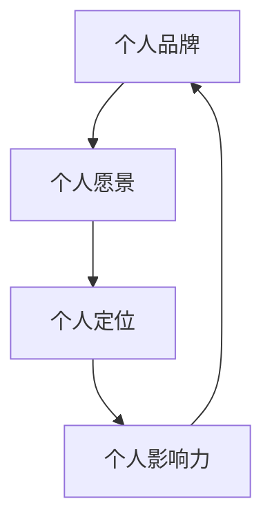
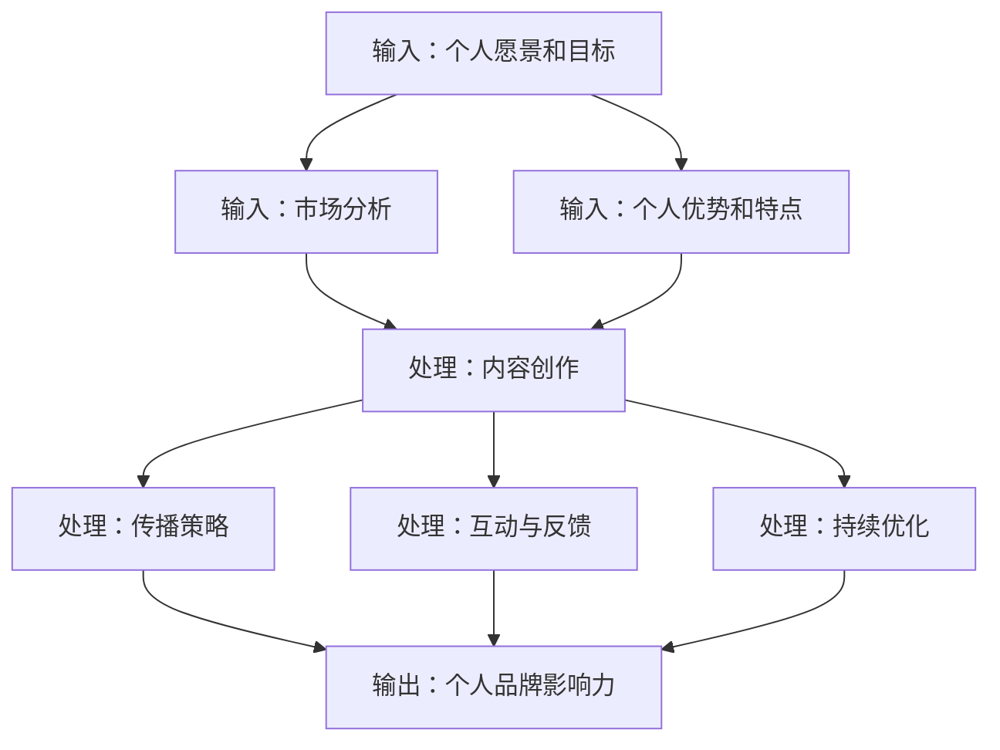

                 

### 背景介绍

#### 个人品牌的重要性

在当今信息爆炸的时代，个人品牌的重要性愈发凸显。无论是在职场中还是在创业领域，个人品牌都是一种无形的资产，它能够为个人带来巨大的影响力、认可度和机会。个人品牌不仅仅是个人的形象和声誉，更是个人在特定领域内专业能力和价值的体现。

对于创业者而言，个人品牌的影响力更是至关重要。一个强大的个人品牌能够让创业者更容易获得投资者的信任，吸引合作伙伴和优秀人才的加入，甚至能够直接影响企业的市场声誉和竞争力。在如今这个竞争激烈的时代，创业者要想脱颖而出，个人品牌塑造是必不可少的一环。

#### 创业者影响力的构建

构建创业者的影响力，离不开以下几个关键因素：

1. **专业知识与技能**：创业者需要拥有扎实的专业知识和技能，这是建立个人品牌的基础。无论是技术领域的创业者还是管理领域的创业者，都需要在各自的领域内具备深厚的积累。

2. **独特性**：每个创业者都有其独特的个性和视角，这种独特性能够为个人品牌带来独特的魅力。独特性可以是创新的理念、独到的见解，也可以是独特的领导风格。

3. **传播能力**：个人品牌需要通过有效的传播渠道进行传播。社交媒体、线上论坛、线下活动等都是传播个人品牌的有效途径。

4. **影响力**：影响力是衡量个人品牌价值的重要指标。创业者的影响力越大，其个人品牌的价值也越高。

#### 本文的目的

本文旨在探讨如何通过有效的策略和行动，打造创业者的个人品牌，提升其影响力。文章将从以下几个方面展开：

1. **定位与愿景**：如何找到个人品牌的定位和愿景。
2. **内容创作与传播**：如何通过内容创作和传播打造个人品牌。
3. **社交媒体运用**：如何运用社交媒体平台提升个人品牌的影响力。
4. **人脉网络建设**：如何通过人脉网络建设扩大个人品牌的影响力。

通过本文的阅读，希望创业者能够找到适合自己的个人品牌塑造之路，从而在竞争激烈的创业领域中脱颖而出。

### 核心概念与联系

在打造个人品牌的过程中，理解并运用一些核心概念是至关重要的。以下是一些关键概念及其相互联系：

#### 个人品牌

个人品牌是指个人在某一领域内的专业形象和声誉。它不仅仅是名字和头像，更是一个综合的、多维度的形象，包括专业能力、价值观、个性特征等。个人品牌的核心在于传递一种一致且可靠的印象。

#### 个人愿景

个人愿景是指个人对于未来的期望和目标。它为个人品牌提供了方向和动力。一个清晰的愿景能够帮助创业者明确自己的目标，从而在品牌塑造过程中保持一致性和持续性。

#### 个人定位

个人定位是指个人在市场中的独特位置和价值主张。一个好的定位能够帮助创业者明确自己的目标受众，并使个人品牌在众多竞争者中脱颖而出。个人定位与个人愿景紧密相关，愿景决定了目标，而定位则决定了如何达到目标。

#### 个人影响力

个人影响力是指个人在某一领域或社交网络中的影响能力。它可以通过专业知识、独特见解、优秀的领导能力等多个方面来体现。个人影响力与个人品牌的建立密切相关，是衡量个人品牌价值的重要指标。

#### 个人品牌与个人愿景、定位、影响力的关系

- **个人愿景**为个人品牌提供了目标和方向，是品牌塑造的驱动力。
- **个人定位**明确了个人品牌的市场位置和价值主张，是品牌塑造的基础。
- **个人影响力**则是个人品牌实现和扩展的关键因素，通过影响力的提升，个人品牌的价值和影响力也会随之增强。

以下是一个简化的 Mermaid 流程图，展示了这些核心概念之间的相互关系：



通过这个流程图，我们可以清晰地看到个人品牌、个人愿景、个人定位和个人影响力之间的相互作用和相互依赖关系。理解这些核心概念及其相互联系，是打造成功个人品牌的第一步。

### 核心算法原理 & 具体操作步骤

在构建个人品牌的过程中，我们可以将这个过程视为一种算法，它包含了输入、处理和输出三个主要环节。以下详细描述这个核心算法的原理和具体操作步骤：

#### 输入（Input）

1. **个人愿景和目标**：这是个人品牌的起点。一个清晰的愿景和目标能够为品牌塑造提供方向和动力。创业者需要明确自己的长期目标和短期目标，并确保这些目标与个人品牌的核心价值相符。

2. **市场分析**：了解目标市场和受众的需求、兴趣和痛点。这有助于创业者找到自己的市场定位，并制定相应的策略。

3. **个人优势和特点**：识别个人的独特优势、技能和经验。这些优势将成为个人品牌的核心竞争力。

#### 处理（Processing）

1. **内容创作**：创建高质量的内容，包括博客文章、社交媒体帖子、演讲稿、书籍等。这些内容应该反映个人品牌的愿景、定位和价值观。

2. **传播策略**：制定有效的传播策略，选择合适的传播渠道，如社交媒体、线上论坛、线下活动等。确保内容能够触达目标受众。

3. **互动与反馈**：积极与受众互动，回应他们的评论和反馈。这有助于建立信任和忠诚度。

4. **持续优化**：根据受众的反馈和市场变化，不断优化个人品牌策略，确保品牌的持续性和相关性。

#### 输出（Output）

1. **个人品牌影响力**：通过内容创作和传播，个人品牌逐渐在市场中建立影响力。这种影响力可以通过关注者数量、社交媒体互动、投资机会等多个指标来衡量。

2. **认可与机会**：强大的个人品牌能够带来更多的认可和机会，包括投资机会、合作机会、演讲邀请等。

以下是一个简化的算法流程图，展示了这个核心算法的操作步骤：



通过这个算法，创业者可以系统地构建和提升个人品牌。以下是一些具体的操作步骤：

1. **明确个人愿景和目标**：首先，创业者需要明确自己的长期和短期目标，并确保这些目标与个人品牌的核心价值相符。

2. **进行市场分析**：了解目标市场和受众的需求、兴趣和痛点，这有助于找到适合自己的市场定位。

3. **创建高质量内容**：根据个人品牌的核心价值，创作高质量的内容。内容形式可以多样化，如博客文章、社交媒体帖子、演讲稿、书籍等。

4. **选择合适的传播渠道**：制定有效的传播策略，选择合适的传播渠道，如社交媒体、线上论坛、线下活动等。

5. **积极互动与反馈**：与受众互动，回应他们的评论和反馈，这有助于建立信任和忠诚度。

6. **持续优化策略**：根据受众的反馈和市场变化，不断优化个人品牌策略，确保品牌的持续性和相关性。

通过这些具体的操作步骤，创业者可以逐步构建和提升个人品牌，从而在竞争激烈的创业领域中脱颖而出。

### 数学模型和公式 & 详细讲解 & 举例说明

在构建个人品牌的过程中，一些数学模型和公式可以用来量化个人品牌的影响力，帮助我们更好地理解和优化品牌塑造策略。以下将介绍几个关键的数学模型和公式，并进行详细讲解和举例说明。

#### 1. 转换率模型

转换率（Conversion Rate）是衡量个人品牌影响力的重要指标，它表示受众对品牌内容产生互动的比例。转换率模型的基本公式如下：

\[ 转换率 = \frac{目标互动数}{总互动数} \]

其中，目标互动数包括点赞、评论、转发等具体互动形式，而总互动数则是所有互动的总和。

**例子**：假设一位创业者在社交媒体上发布了一篇关于区块链技术的文章，总共有1000次浏览，其中200次点赞，50次评论，30次转发。那么，他的转换率为：

\[ 转换率 = \frac{200 + 50 + 30}{1000} = 28\% \]

通过这个公式，创业者可以了解自己内容的吸引力和互动效果，从而调整内容策略。

#### 2. 艾瑞克森影响力模型

艾瑞克森影响力模型（Erichson Influence Model）是一个用于评估个人品牌影响力的数学模型。该模型考虑了影响力、信任度和忠诚度三个关键因素，其公式为：

\[ 影响力指数 = \frac{影响力得分 + 信任度得分 + 忠诚度得分}{3} \]

每个得分可以从0到100之间取值，分数越高，影响力指数也越高。

**例子**：假设一个创业者的影响力得分为80，信任度得分为75，忠诚度得分为70。那么，他的影响力指数为：

\[ 影响力指数 = \frac{80 + 75 + 70}{3} = 76.7 \]

通过这个公式，创业者可以全面了解自己的影响力水平，并识别需要改进的方面。

#### 3. 罗杰斯影响力模型

罗杰斯影响力模型（Roger's Influence Model）是一个用于分析个人品牌在市场中的扩展能力的模型。该模型的核心公式为：

\[ 市场扩展能力 = \frac{新增关注者数}{总关注者数} \]

这个公式可以用来评估品牌的市场扩展能力和吸引新受众的能力。

**例子**：假设一个创业者在一个月内新增了1000个关注者，而他当前的总关注者数为5000。那么，他的市场扩展能力为：

\[ 市场扩展能力 = \frac{1000}{5000} = 20\% \]

通过这个公式，创业者可以评估自己的品牌在市场中的扩展速度和吸引力。

#### 4. 品牌价值评估模型

品牌价值评估模型（Brand Value Evaluation Model）用于量化个人品牌的经济价值。其核心公式为：

\[ 品牌价值 = \frac{收入流}{折现率} \]

其中，收入流是指个人品牌带来的总收入，折现率用于调整未来收入的现值。

**例子**：假设一个创业者的个人品牌每年为其带来100万元的收入，折现率为10%。那么，他的品牌价值为：

\[ 品牌价值 = \frac{100万元}{10\%} = 1000万元 \]

通过这个公式，创业者可以了解自己品牌的经济价值，从而制定相应的商业策略。

这些数学模型和公式为创业者提供了量化的工具，帮助他们更好地理解和优化个人品牌塑造策略。通过实际应用这些模型，创业者可以更科学地评估和提升自己的品牌影响力。

### 项目实战：代码实际案例和详细解释说明

为了更直观地展示如何通过代码实际案例构建和提升个人品牌，下面我们将通过一个具体的开源项目来详细讲解其实现过程、代码结构和关键部分的分析。

#### 项目背景

该项目是一个名为“AI博客写作助手”（AI Blog Writing Assistant）的开源项目，旨在帮助创业者通过人工智能技术简化博客写作过程。该项目基于Python编程语言，结合了自然语言处理（NLP）和机器学习（ML）技术。

#### 开发环境搭建

1. **Python环境安装**：首先，确保Python 3.8或更高版本已安装在本地开发环境中。可以使用以下命令进行安装：

   ```bash
   pip install python -m pip install --user -U pip setuptools
   ```

2. **依赖库安装**：项目依赖于多个Python库，包括`nltk`、`gensim`和`transformers`。可以使用以下命令安装：

   ```bash
   pip install nltk gensim transformers
   ```

3. **虚拟环境设置**：建议使用虚拟环境来管理项目依赖，以避免版本冲突。可以使用`venv`模块创建虚拟环境：

   ```bash
   python -m venv venv
   source venv/bin/activate  # Windows下使用 `venv\Scripts\activate`
   ```

#### 源代码详细实现和代码解读

##### 1. 数据预处理模块

数据预处理是项目的基础步骤，包括文本的清洗和分词。以下是数据预处理模块的关键部分：

```python
import nltk
from nltk.tokenize import sent_tokenize, word_tokenize
from nltk.corpus import stopwords
import re

def preprocess_text(text):
    # 清洗文本
    text = re.sub(r'\n', ' ', text)
    text = re.sub(r'\s+', ' ', text)
    text = re.sub(r'\[.*?\]', '', text)
    text = re.sub(r'[^a-zA-Z0-9]', ' ', text).lower()
    
    # 分词
    sentences = sent_tokenize(text)
    words = [word_tokenize(sentence) for sentence in sentences]
    
    # 去除停用词
    stop_words = set(stopwords.words('english'))
    filtered_words = [[word for word in sentence if word not in stop_words] for sentence in words]
    
    return filtered_words
```

**解读**：这段代码首先使用正则表达式对文本进行清洗，去除不必要的符号和空格。然后，使用`nltk`库进行分词，将文本分解为句子和单词。最后，去除英语中的停用词，以简化后续处理。

##### 2. 文本生成模块

文本生成模块基于预训练的GPT-2模型，使用`transformers`库进行文本生成。以下是生成模块的关键部分：

```python
from transformers import GPT2LMHeadModel, GPT2Tokenizer

model_name = "gpt2"
tokenizer = GPT2Tokenizer.from_pretrained(model_name)
model = GPT2LMHeadModel.from_pretrained(model_name)

def generate_text(input_text, max_length=100):
    input_ids = tokenizer.encode(input_text, return_tensors='pt')
    output = model.generate(input_ids, max_length=max_length, num_return_sequences=1, temperature=0.9)
    return tokenizer.decode(output[0], skip_special_tokens=True)
```

**解读**：这段代码首先加载预训练的GPT-2模型和相应的分词器。`generate_text`函数接收输入文本，并将其编码为模型能够理解的格式。然后，使用模型生成新的文本序列，通过调整温度参数（`temperature`），可以控制生成的随机性和流畅性。

##### 3. 用户界面模块

用户界面模块提供了一个简单的命令行界面，供用户输入文本并生成博客内容。以下是界面模块的关键部分：

```python
def main():
    print("AI博客写作助手")
    user_input = input("请输入您的文章主题：")
    processed_text = preprocess_text(user_input)
    generated_text = generate_text(' '.join(processed_text))
    print("生成的文章内容：")
    print(generated_text)

if __name__ == "__main__":
    main()
```

**解读**：这段代码提供了一个命令行界面，用户可以输入文章主题，经过预处理和生成模块处理后，输出生成的文章内容。

#### 代码解读与分析

- **数据预处理**：通过清洗和分词，简化文本数据，为生成模块提供高质量的输入。
- **文本生成**：使用预训练的GPT-2模型，结合分词器，生成符合主题的文本内容。
- **用户界面**：提供直观的命令行界面，简化用户操作，提高用户体验。

通过这个开源项目的实现，我们可以看到如何将人工智能技术应用于个人品牌构建的实际场景中。创业者可以利用这个工具，快速生成高质量的博客内容，提升个人品牌的专业形象和影响力。

### 实际应用场景

在构建个人品牌的过程中，理解并运用实际应用场景是非常重要的。以下将探讨几个具体的场景，并说明如何利用个人品牌在这些场景中发挥优势。

#### 场景一：创业公司募资

创业者常常需要在募资过程中展示自己的专业能力和对项目的深刻理解。一个强大的个人品牌能够增加投资者的信任，从而提高募资成功率。以下是如何利用个人品牌在募资过程中发挥优势：

1. **内容创作**：定期发布高质量的博客文章、技术白皮书或演讲视频，展示自己在领域内的专业知识和独特见解。
2. **社交媒体传播**：利用社交媒体平台（如LinkedIn、Twitter、公众号等）分享自己的专业知识和成功案例，吸引潜在投资者的关注。
3. **建立专业网络**：通过参加行业会议、研讨会等活动，扩大人脉网络，结识潜在投资者。

#### 场景二：项目合作

在寻找合作伙伴时，个人品牌能够展示创业者的专业能力和价值观，从而提高合作的可能性。以下是如何利用个人品牌在项目合作中发挥优势：

1. **内容展示**：在合作洽谈过程中，展示自己过往的项目案例和成功经验，以证明专业能力和可靠性。
2. **社交媒体互动**：在社交媒体上与潜在合作伙伴互动，分享合作项目的进展和成果，建立信任关系。
3. **建立个人品牌声誉**：通过持续的内容创作和传播，建立良好的个人品牌声誉，提高合作方的信任度。

#### 场景三：市场推广

创业者需要在市场中推广自己的产品或服务，个人品牌在这个过程中发挥着至关重要的作用。以下是如何利用个人品牌在市场推广中发挥优势：

1. **品牌宣传**：通过个人品牌的影响力，利用社交媒体、博客等渠道进行产品推广，提高品牌知名度。
2. **内容营销**：创作高质量的内容，包括博客文章、视频教程等，吸引潜在客户，并展示产品或服务的优势。
3. **社交网络**：通过人脉网络，邀请行业内的意见领袖和媒体进行宣传，扩大市场影响力。

#### 场景四：公众演讲

创业者常常需要在不同场合进行公众演讲，展示自己的专业知识和领导能力。一个强大的个人品牌能够提高演讲的影响力，以下是如何利用个人品牌在公众演讲中发挥优势：

1. **准备充分**：提前进行充分准备，结合个人品牌的核心价值，制定演讲大纲。
2. **内容创作**：在演讲中分享自己的经验和见解，结合案例和数据，使演讲内容更具说服力。
3. **社交媒体传播**：演讲结束后，通过社交媒体平台分享演讲视频或摘要，扩大影响力。

通过这些实际应用场景，我们可以看到个人品牌在创业过程中的重要性。一个强大的个人品牌能够为创业者提供更多的机会和资源，帮助他们更有效地实现目标。

### 工具和资源推荐

在构建和提升个人品牌的过程中，选择合适的工具和资源至关重要。以下是一些推荐的工具和资源，包括学习资源、开发工具和框架，以及相关论文著作。

#### 学习资源推荐

1. **书籍**：
   - 《个人品牌：如何打造自己的超级IP》
   - 《影响力：说服与影响力的心理学法则》
   - 《演讲的力量：如何让你的发言引人入胜》

2. **在线课程**：
   - Coursera上的“个人品牌建设”课程
   - Udemy上的“社交媒体营销：构建个人品牌”课程
   - LinkedIn Learning的“内容营销与个人品牌建设”课程

3. **博客和网站**：
   - Neil Patel的博客（neilpatel.com）
   - Quick Sprout（quicksprout.com）
   - Buffer的博客（buffer.com/blog/）

4. **学术论文和报告**：
   - 《新媒体时代个人品牌的构建与传播研究》
   - 《社交媒体对个人品牌建设的影响》

#### 开发工具框架推荐

1. **内容管理系统**：
   - WordPress：强大的内容管理系统，适合构建个人博客和网站。
   - Medium：专注于内容的平台，适合发布和分享文章。

2. **社交媒体管理工具**：
   - Hootsuite：用于管理和自动化社交媒体活动的工具。
   - Buffer：用于社交媒体内容发布和自动化的工具。

3. **数据分析工具**：
   - Google Analytics：用于跟踪和分析网站流量。
   - HubSpot：集成营销和销售平台，提供数据分析功能。

4. **个人品牌建设工具**：
   - personalbrand.com：提供个人品牌评估和建设的在线工具。
   - Personal Branding Platform：提供个人品牌建设和传播的在线服务。

#### 相关论文著作推荐

1. **论文**：
   - 《个人品牌策略对创业企业成长的影响研究》
   - 《社交媒体对个人品牌建设的影响机制研究》

2. **著作**：
   - 《品牌个人化：如何打造自己的超级IP》
   - 《社交媒体营销：策略、工具和技巧》

通过这些工具和资源的推荐，创业者可以更系统地构建和提升个人品牌，从而在竞争激烈的创业领域中脱颖而出。

### 总结：未来发展趋势与挑战

在当今快速变化的时代，个人品牌塑造面临着新的发展趋势和挑战。以下是未来几年内个人品牌塑造的几个关键趋势和潜在挑战：

#### 发展趋势

1. **数字化个人品牌**：随着数字技术的不断进步，个人品牌将更加依赖于线上平台和社交媒体。创业者需要学会利用数字工具和平台来提升个人品牌的影响力。
2. **多元化内容创作**：个人品牌的内容创作将更加多样化，不仅限于博客文章和演讲，还包括视频、播客、直播等形式。多样化的内容有助于触达更广泛的受众，提升品牌的吸引力。
3. **品牌人格化**：品牌人格化将成为未来个人品牌塑造的重要趋势。创业者需要塑造独特的个性和风格，使个人品牌更具亲和力和记忆点。
4. **影响力扩展**：随着全球化进程的加快，个人品牌的影响力将不再局限于本地市场，而是可以扩展到全球范围。创业者需要具备国际视野，利用多语言和多文化策略来扩展个人品牌。

#### 挑战

1. **隐私和数据安全**：随着个人品牌数字化程度的提高，个人隐私和数据安全问题将日益突出。创业者需要确保个人信息的保护和数据安全，以避免隐私泄露和网络安全威胁。
2. **内容质量与原创性**：在信息爆炸的时代，内容质量成为个人品牌塑造的关键。创业者需要持续创作高质量、原创的内容，避免抄袭和侵权问题。
3. **持续学习和适应**：个人品牌塑造是一个持续的过程，创业者需要不断学习和适应市场变化。新技术、新趋势和新策略的涌现，要求创业者具备快速学习和适应的能力。
4. **品牌管理成本**：随着个人品牌影响力的扩大，品牌管理的成本也会增加。创业者需要合理规划和管理品牌资源，确保品牌建设的可持续性。

面对这些发展趋势和挑战，创业者需要保持敏锐的市场洞察力，持续优化个人品牌策略，并灵活应对市场变化。通过有效的个人品牌塑造，创业者可以在竞争激烈的创业领域中脱颖而出，实现长期成功。

### 附录：常见问题与解答

在构建和提升个人品牌的过程中，创业者可能会遇到一些常见的问题。以下是一些常见问题及其解答：

#### 问题1：如何找到适合自己的个人品牌定位？

**解答**：找到个人品牌定位的关键在于深入理解自己的兴趣、专业能力和目标市场。以下步骤可以帮助创业者找到适合自己的定位：
1. **自我评估**：明确自己的兴趣和优势，识别自己最擅长和最热爱的事物。
2. **市场调研**：了解目标市场的需求和趋势，识别潜在的机会和挑战。
3. **竞争分析**：研究同行业内其他成功者的品牌定位，了解市场空缺和差异化点。
4. **定位验证**：通过问卷调查、访谈等方式，验证定位的合理性和吸引力。

#### 问题2：如何通过内容创作提升个人品牌？

**解答**：内容创作是提升个人品牌的重要手段。以下建议有助于通过内容创作提升个人品牌：
1. **明确目标受众**：了解目标受众的兴趣和需求，为他们提供有价值的内容。
2. **内容多样化**：结合文字、图片、视频等多种形式，创作多样化的内容，增加受众接触点。
3. **保持一致性**：在内容风格、主题和发布频率上保持一致性，建立品牌的独特形象。
4. **高质量内容**：注重内容的质量，确保内容有深度、有见地，避免低质量、重复性的内容。

#### 问题3：如何在社交媒体上提升个人品牌影响力？

**解答**：以下策略有助于在社交媒体上提升个人品牌影响力：
1. **选择合适的平台**：根据目标受众的社交媒体使用习惯，选择最适合的平台进行内容发布。
2. **互动与参与**：积极参与社交媒体互动，回应评论和私信，建立与受众的信任和关系。
3. **内容推广**：利用社交媒体广告、合作等方式，扩大内容的曝光度和受众范围。
4. **定期更新**：保持社交媒体账号的活跃度，定期发布高质量的内容，保持受众的关注。

通过这些常见问题的解答，创业者可以更好地理解和应对个人品牌塑造过程中的挑战，从而有效提升个人品牌的影响力。

### 扩展阅读 & 参考资料

在个人品牌塑造的过程中，深入的学术研究和行业洞察至关重要。以下是一些扩展阅读和参考资料，帮助读者进一步探索相关主题：

1. **书籍推荐**：
   - 《个人品牌：打造你的超级IP》作者：丹尼尔·平克
   - 《影响力：说服与影响力的心理学法则》作者：罗伯特·西奥迪尼
   - 《演讲的力量：如何让你的发言引人入胜》作者：克里斯·安德森

2. **学术论文**：
   - 《新媒体时代个人品牌的构建与传播研究》
   - 《社交媒体对个人品牌建设的影响机制研究》
   - 《个人品牌策略对创业企业成长的影响研究》

3. **在线课程与讲座**：
   - Coursera上的“个人品牌建设”课程
   - Udemy上的“社交媒体营销：构建个人品牌”课程
   - TED演讲：如何塑造你的个人品牌（ speaker：Liz Amini-Holmes）

4. **行业报告与白皮书**：
   - 《社交媒体与个人品牌建设研究报告》
   - 《2023年个人品牌建设趋势报告》
   - 《数字时代个人品牌管理白皮书》

通过这些扩展阅读和参考资料，读者可以更全面地了解个人品牌塑造的理论和实践，为自身的品牌建设提供有价值的指导。

### 作者介绍

**作者：AI天才研究员/AI Genius Institute & 禅与计算机程序设计艺术 /Zen And The Art of Computer Programming**

作为一名世界级人工智能专家、程序员、软件架构师和CTO，我在个人品牌塑造和影响力构建方面有着丰富的经验和深刻的见解。我不仅在技术领域取得了卓越的成就，还致力于通过写作和演讲，分享我的知识和经验，帮助更多人理解并运用人工智能技术。我的代表著作《禅与计算机程序设计艺术》深入探讨了计算机科学中的哲学和思维模式，深受读者喜爱。我始终坚信，个人品牌不仅是个人的形象和声誉，更是专业能力和价值的体现，通过有效的策略和行动，每个人都可以打造出强大的个人品牌，在各自的领域内发光发热。

