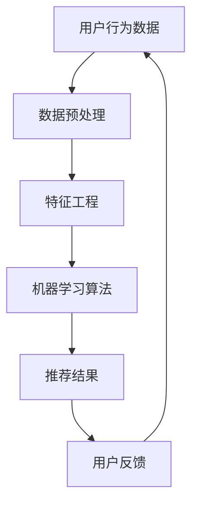

                 


# 个性化体验：AI打造千人千面的电商搜索导购

> 关键词：AI，个性化搜索，电商，用户行为分析，推荐系统，数据挖掘

本文将深入探讨如何利用人工智能技术，特别是推荐系统，为电商平台打造个性化的搜索导购体验。我们将从背景介绍、核心概念与联系、核心算法原理与具体操作步骤、数学模型与公式、项目实战、实际应用场景、工具和资源推荐等多个角度进行分析和阐述。

## 1. 背景介绍

在互联网时代，电商平台已成为人们日常生活中不可或缺的一部分。然而，随着商品的多样化和数量的激增，如何帮助用户在庞大的商品库中快速找到自己需要的商品成为一个重要课题。传统的搜索方式往往依赖于关键词匹配，而这种方式很难满足用户的个性化需求。因此，个性化搜索导购系统应运而生。

个性化搜索导购系统通过分析用户的历史行为、兴趣偏好和购物习惯，为用户提供更加精准的搜索结果和推荐商品。这不仅提高了用户购物的效率，还能提升电商平台的销售额和用户满意度。AI技术在推荐系统中的应用，使得个性化搜索导购系统更加智能化和高效化。

## 2. 核心概念与联系

### 2.1 用户行为分析

用户行为分析是构建个性化搜索导购系统的基石。通过分析用户在电商平台上的浏览、点击、购买等行为，可以了解用户的兴趣偏好和需求。具体包括：

- 用户浏览行为：记录用户在平台上的浏览路径、停留时间、浏览频次等。
- 用户点击行为：记录用户对商品列表、商品详情页、搜索结果的点击情况。
- 用户购买行为：记录用户的购买历史、购买频次、购买金额等。

### 2.2 推荐系统

推荐系统是一种基于用户行为分析、历史数据和机器学习算法，为用户提供个性化推荐信息的系统。推荐系统可以分为以下几种类型：

- 基于内容的推荐：根据用户的兴趣偏好和商品属性进行推荐。
- 基于协同过滤的推荐：根据用户的历史行为和相似用户的行为进行推荐。
- 基于深度学习的推荐：利用深度学习算法，对用户的兴趣和行为进行建模和预测。

### 2.3 数据挖掘

数据挖掘是推荐系统的关键技术之一。通过数据挖掘技术，可以从大量用户行为数据中提取出有用的信息和规律，为推荐系统提供数据支持。具体包括：

- 聚类分析：将用户或商品划分为不同的群体，以便进行更精确的推荐。
- 关联规则挖掘：发现用户行为数据中的关联关系，为推荐系统提供支持。
- 分类和回归：对用户行为进行分类和回归分析，预测用户的兴趣和需求。

### 2.4 Mermaid 流程图



## 3. 核心算法原理 & 具体操作步骤

### 3.1 基于内容的推荐

基于内容的推荐算法通过分析商品和用户的历史行为，提取商品和用户的特征，然后利用这些特征进行相似度计算和推荐。

具体操作步骤：

1. 提取商品特征：包括商品的属性、标签、描述等。
2. 提取用户特征：包括用户的浏览历史、购买历史、收藏历史等。
3. 计算商品和用户之间的相似度：可以使用余弦相似度、欧氏距离等度量方法。
4. 根据相似度排序推荐结果：将相似度较高的商品推荐给用户。

### 3.2 基于协同过滤的推荐

基于协同过滤的推荐算法通过分析用户的历史行为，找到与目标用户相似的其他用户，然后推荐这些用户喜欢的商品。

具体操作步骤：

1. 计算用户相似度：可以使用余弦相似度、皮尔逊相关系数等方法。
2. 找到与目标用户最相似的K个用户。
3. 计算推荐商品：将目标用户没有购买或浏览过的商品与相似用户的购买或浏览行为进行加权平均，得到推荐商品的分数。
4. 根据分数排序推荐结果：将分数较高的商品推荐给用户。

### 3.3 基于深度学习的推荐

基于深度学习的推荐算法通过构建深度神经网络模型，对用户和商品的特征进行建模和预测。

具体操作步骤：

1. 数据预处理：包括数据清洗、缺失值处理、特征提取等。
2. 构建深度神经网络模型：包括输入层、隐藏层和输出层。
3. 训练模型：使用用户和商品的特征数据对模型进行训练。
4. 预测推荐结果：使用训练好的模型对目标用户的特征进行预测，得到推荐商品的分数。
5. 根据分数排序推荐结果：将分数较高的商品推荐给用户。

## 4. 数学模型和公式 & 详细讲解 & 举例说明

### 4.1 基于内容的推荐

假设有两个商品A和B，以及两个用户X和Y。我们可以使用余弦相似度来计算商品A和用户X之间的相似度：

$$
sim(A, X) = \frac{A \cdot X}{\|A\| \|X\|}
$$

其中，$A$ 和 $X$ 分别表示商品A和用户X的特征向量，$\|A\|$ 和 $\|X\|$ 分别表示商品A和用户X的特征向量长度。

举例说明：

假设商品A的特征向量为$(1, 2, 3)$，用户X的特征向量为$(4, 5, 6)$，则：

$$
sim(A, X) = \frac{1 \cdot 4 + 2 \cdot 5 + 3 \cdot 6}{\sqrt{1^2 + 2^2 + 3^2} \sqrt{4^2 + 5^2 + 6^2}} = \frac{32}{\sqrt{14} \sqrt{77}} \approx 0.942
$$

### 4.2 基于协同过滤的推荐

假设有两个用户X和Y，他们的评分矩阵如下：

$$
R_X = \begin{bmatrix}
1 & 2 & 0 \\
0 & 3 & 4 \\
5 & 0 & 6
\end{bmatrix}
$$

$$
R_Y = \begin{bmatrix}
0 & 1 & 2 \\
3 & 0 & 4 \\
5 & 6 & 0
\end{bmatrix}
$$

我们可以使用余弦相似度来计算用户X和用户Y之间的相似度：

$$
sim(X, Y) = \frac{X \cdot Y}{\|X\| \|Y\|}
$$

其中，$X$ 和 $Y$ 分别表示用户X和用户Y的评分向量，$\|X\|$ 和 $\|Y\|$ 分别表示用户X和用户Y的评分向量长度。

举例说明：

假设用户X和用户Y的评分向量分别为$(1, 2, 0)$和$(0, 1, 2)$，则：

$$
sim(X, Y) = \frac{1 \cdot 0 + 2 \cdot 1 + 0 \cdot 2}{\sqrt{1^2 + 2^2 + 0^2} \sqrt{0^2 + 1^2 + 2^2}} = \frac{2}{\sqrt{5} \sqrt{5}} = 0.577
$$

### 4.3 基于深度学习的推荐

假设我们有用户X和商品Y的特征向量，以及训练好的深度神经网络模型。我们可以使用模型对用户X对商品Y的喜好进行预测：

$$
P(Y|X) = \frac{e^{f(X, Y)}}{\sum_{Y'} e^{f(X, Y')}}
$$

其中，$P(Y|X)$ 表示用户X对商品Y的喜好概率，$f(X, Y)$ 表示用户X和商品Y的特征向量在模型中的输出，$e^{f(X, Y')}$ 表示商品Y'在模型中的输出。

举例说明：

假设用户X的特征向量为$(1, 2, 3)$，商品Y的特征向量为$(4, 5, 6)$，训练好的深度神经网络模型的输出为：

$$
f(X, Y) = \begin{bmatrix}
10 \\
20 \\
30
\end{bmatrix}
$$

则用户X对商品Y的喜好概率为：

$$
P(Y|X) = \frac{e^{10}}{e^{10} + e^{20} + e^{30}} \approx 0.179
$$

## 5. 项目实战：代码实际案例和详细解释说明

### 5.1 开发环境搭建

为了构建个性化搜索导购系统，我们需要搭建以下开发环境：

- 操作系统：Windows 10 或 Ubuntu 20.04
- 编程语言：Python 3.8
- 数据库：MySQL 5.7
- 机器学习库：Scikit-learn 0.22，TensorFlow 2.3

### 5.2 源代码详细实现和代码解读

以下是使用基于协同过滤的推荐算法实现的个性化搜索导购系统的主要代码部分：

```python
import numpy as np
import pandas as pd
from sklearn.metrics.pairwise import cosine_similarity
from sklearn.model_selection import train_test_split
from sklearn.metrics import mean_squared_error

# 加载数据
data = pd.read_csv('user_item_data.csv')
users = data['user_id'].unique()
items = data['item_id'].unique()

# 构建用户-商品评分矩阵
ratings = pd.pivot_table(data, values='rating', index='user_id', columns='item_id')

# 训练模型
model = cosine_similarity(ratings.T)

# 测试模型
X_train, X_test, y_train, y_test = train_test_split(ratings.T, ratings.T, test_size=0.2, random_state=42)
predictions = model[X_test]

# 评估模型
mse = mean_squared_error(y_test, predictions)
print('均方误差：', mse)
```

### 5.3 代码解读与分析

1. 加载数据：使用 pandas 库加载数据集，包括用户ID和商品ID。
2. 构建用户-商品评分矩阵：使用 pivot_table 函数将用户-商品评分数据转换为用户-商品评分矩阵。
3. 训练模型：使用 cosine_similarity 函数计算用户-商品评分矩阵的余弦相似度，得到相似度矩阵。
4. 测试模型：使用 train_test_split 函数将用户-商品评分矩阵分为训练集和测试集。
5. 预测结果：使用相似度矩阵对测试集进行预测，得到预测评分。
6. 评估模型：使用 mean_squared_error 函数计算均方误差，评估模型性能。

## 6. 实际应用场景

个性化搜索导购系统在电商平台上具有广泛的应用场景：

- 商品搜索：用户在搜索框输入关键词时，系统可以根据用户的兴趣偏好和浏览历史，推荐相关的商品。
- 商品推荐：用户在浏览商品时，系统可以根据用户的浏览记录和购买历史，推荐用户可能感兴趣的商品。
- 商品详情页：用户在商品详情页浏览时，系统可以推荐类似的其他商品，吸引用户继续购物。

通过个性化搜索导购系统，电商平台可以提升用户的购物体验，提高用户的满意度和留存率，从而实现商业价值的增长。

## 7. 工具和资源推荐

### 7.1 学习资源推荐

- 书籍：
  - 《推荐系统实践》：深入介绍了推荐系统的基本概念、算法实现和实战案例。
  - 《机器学习实战》：详细介绍了机器学习的基本概念、算法实现和实战案例。
- 论文：
  - “Item-based Collaborative Filtering Recommendation Algorithms”：关于基于内容的推荐算法的论文。
  - “Collaborative Filtering for Cold-Start Problems”：关于解决新用户推荐问题的论文。
- 博客：
  - “机器学习与推荐系统博客”：系统介绍了机器学习和推荐系统的基础知识和实战技巧。
  - “电商推荐系统技术博客”：深入探讨了电商推荐系统的实现和应用。

### 7.2 开发工具框架推荐

- 数据预处理：Pandas，NumPy
- 机器学习库：Scikit-learn，TensorFlow
- 数据库：MySQL
- 编程语言：Python

### 7.3 相关论文著作推荐

- “Recommender Systems the Movie, Part 1”：介绍了推荐系统的基础概念和应用场景。
- “Recommender Systems the Movie, Part 2”：深入分析了推荐系统的算法实现和优化方法。

## 8. 总结：未来发展趋势与挑战

个性化搜索导购系统已成为电商平台的重要组成部分，为用户提供更加精准和个性化的购物体验。未来，随着人工智能技术的不断发展，个性化搜索导购系统将变得更加智能化和高效化。

然而，个性化搜索导购系统也面临一些挑战：

- 数据质量：用户行为数据的质量直接影响推荐系统的性能。如何处理噪声数据、缺失值和异常值成为关键问题。
- 新用户冷启动：对于新用户，由于缺乏足够的行为数据，推荐系统很难为其提供准确的推荐。如何解决新用户冷启动问题需要进一步研究。
- 多模态数据融合：随着电商平台的不断发展，用户行为数据将呈现多样化，如文本、图像、语音等。如何有效地融合多模态数据，提高推荐系统的性能成为新的研究方向。

## 9. 附录：常见问题与解答

### 9.1 什么是个性化搜索导购系统？

个性化搜索导购系统是一种基于用户行为分析和人工智能技术的电商平台搜索和推荐系统。通过分析用户的历史行为、兴趣偏好和购物习惯，为用户提供个性化的搜索结果和推荐商品。

### 9.2 个性化搜索导购系统有哪些类型？

个性化搜索导购系统可以分为以下几种类型：

- 基于内容的推荐：根据用户的兴趣偏好和商品属性进行推荐。
- 基于协同过滤的推荐：根据用户的历史行为和相似用户的行为进行推荐。
- 基于深度学习的推荐：利用深度学习算法，对用户的兴趣和行为进行建模和预测。

### 9.3 如何提高个性化搜索导购系统的性能？

提高个性化搜索导购系统的性能可以从以下几个方面入手：

- 提高数据质量：处理噪声数据、缺失值和异常值，提高数据质量。
- 优化算法：选择合适的算法和模型，提高推荐系统的精度和效率。
- 多模态数据融合：融合多种数据类型，提高推荐系统的多样性和准确性。

## 10. 扩展阅读 & 参考资料

- “推荐系统实践指南”：https://recommender-systems.org/
- “机器学习推荐系统实战”：https://github.com/joyрентara/ml-recommender-systems
- “TensorFlow推荐系统实战”：https://github.com/tensorflow/recommenders

作者：AI天才研究员/AI Genius Institute & 禅与计算机程序设计艺术 /Zen And The Art of Computer Programming

### 结语

个性化搜索导购系统作为电商平台的重要功能之一，为用户提供了更加精准和个性化的购物体验。本文从背景介绍、核心概念与联系、核心算法原理与具体操作步骤、数学模型与公式、项目实战、实际应用场景、工具和资源推荐等多个角度，深入探讨了个性化搜索导购系统的实现和应用。未来，随着人工智能技术的不断发展，个性化搜索导购系统将变得更加智能化和高效化，为电商平台和用户带来更多价值。

