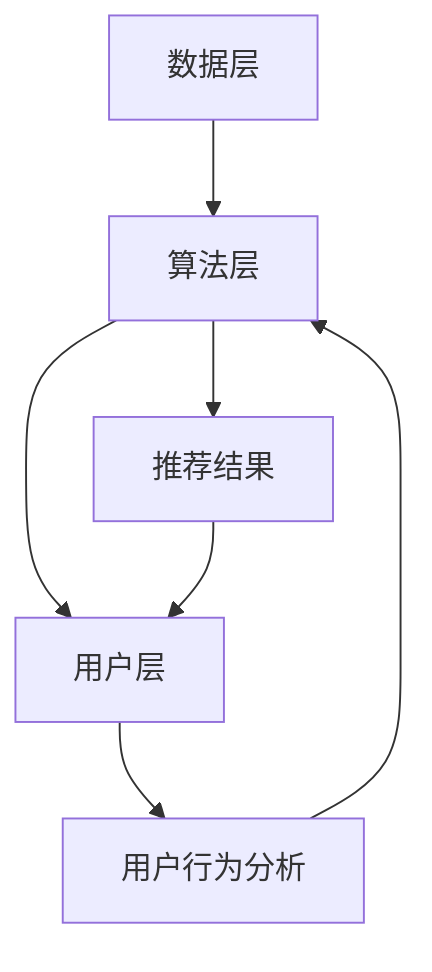

                 

# 个性化推荐的精准营销策略

## 关键词：个性化推荐、精准营销、算法、用户行为、数据分析

### 摘要

本文将深入探讨个性化推荐在精准营销中的应用，通过分析用户行为数据，运用先进算法，打造具有高精准度的营销策略。文章将详细阐述推荐系统的核心概念、算法原理、数学模型，并通过实战案例展示其具体实现和效果。此外，还将介绍相关学习资源和开发工具，为读者提供全面的指导。希望通过本文，读者能够更好地理解个性化推荐系统在精准营销中的作用，掌握其实现方法，并应用到实际业务中。

## 1. 背景介绍

### 1.1 个性化推荐的起源与发展

个性化推荐系统起源于20世纪90年代，随着互联网的兴起和用户数据的大规模积累，推荐系统逐渐成为商业领域的重要工具。早期的推荐系统主要基于用户的历史行为数据进行协同过滤，如基于用户的协同过滤（User-based Collaborative Filtering）和基于项目的协同过滤（Item-based Collaborative Filtering）。这些方法通过寻找相似用户或相似项目，为用户推荐他们可能感兴趣的内容。

### 1.2 精准营销的概念与发展

精准营销是一种以数据为导向的营销策略，通过分析用户行为数据，识别用户需求，实现个性化推送和精准触达。随着大数据技术和人工智能算法的不断发展，精准营销已经成为现代营销的重要趋势。精准营销的目标是提高营销效率，降低营销成本，提升客户满意度，从而实现商业价值最大化。

### 1.3 个性化推荐与精准营销的关系

个性化推荐与精准营销密切相关。个性化推荐系统通过分析用户行为数据，为用户提供个性化的内容推荐，从而提高用户的参与度和满意度。精准营销则通过将个性化推荐系统与用户数据相结合，实现精准的用户触达和营销策略的制定。因此，个性化推荐是精准营销的核心技术之一。

## 2. 核心概念与联系

### 2.1 个性化推荐系统架构

个性化推荐系统的核心架构包括数据层、算法层和用户层。数据层负责收集、存储和管理用户行为数据，如浏览记录、购买记录等。算法层负责根据用户行为数据，运用推荐算法生成推荐结果。用户层则负责接收推荐结果，并根据推荐内容进行互动。

### 2.2 核心算法原理

个性化推荐算法主要包括基于内容的推荐（Content-based Filtering）和基于协同过滤的推荐（Collaborative Filtering）。基于内容的推荐通过分析用户的历史行为数据和内容特征，为用户推荐与之相关的物品。基于协同过滤的推荐则通过分析用户之间的相似性，为用户推荐其他用户喜欢的物品。

### 2.3 数据分析与用户行为分析

数据分析和用户行为分析是构建个性化推荐系统的关键。通过分析用户的历史行为数据，可以识别用户的需求和兴趣，从而为用户推荐个性化的内容。同时，通过分析用户的行为模式，可以预测用户的下一步行为，进一步提高推荐系统的精准度。

### 2.4 Mermaid 流程图

以下是一个简单的 Mermaid 流程图，展示了个性化推荐系统的核心流程：



## 3. 核心算法原理 & 具体操作步骤

### 3.1 基于内容的推荐算法

基于内容的推荐算法主要通过分析物品的内容特征，为用户推荐与其兴趣相关的物品。具体操作步骤如下：

1. 收集物品的特征数据，如文本、图像、音频等。
2. 将特征数据转化为数值向量，可以使用词袋模型、TF-IDF、词嵌入等方法。
3. 计算用户和物品之间的相似度，可以使用余弦相似度、欧氏距离等方法。
4. 根据相似度对物品进行排序，为用户推荐排序靠前的物品。

### 3.2 基于协同过滤的推荐算法

基于协同过滤的推荐算法主要通过分析用户之间的相似性，为用户推荐其他用户喜欢的物品。具体操作步骤如下：

1. 收集用户的行为数据，如评分、点击、购买等。
2. 计算用户之间的相似度，可以使用皮尔逊相关系数、余弦相似度等方法。
3. 构建用户相似度矩阵。
4. 为每个用户找到与其最相似的邻居用户。
5. 根据邻居用户的喜好，为用户推荐他们可能喜欢的物品。

### 3.3 混合推荐算法

混合推荐算法将基于内容的推荐和基于协同过滤的推荐相结合，以提高推荐系统的准确性和多样性。具体操作步骤如下：

1. 使用基于内容的推荐算法生成初步推荐列表。
2. 使用基于协同过滤的推荐算法对初步推荐列表进行筛选和调整。
3. 对最终推荐结果进行排序和筛选，得到用户最终推荐列表。

## 4. 数学模型和公式 & 详细讲解 & 举例说明

### 4.1 基于内容的推荐算法

$$
\text{相似度} = \frac{\text{用户} \text{i} \text{和物品} \text{j} \text{的特征向量内积}}{\|\text{用户} \text{i} \text{的特征向量}\|\|\text{物品} \text{j} \text{的特征向量}\|}
$$

其中，$\text{特征向量}$表示用户和物品的数值表示，$\|\text{特征向量}\|$表示特征向量的模。

#### 例子：

假设用户 i 和物品 j 的特征向量分别为 $\text{v}_{i} = (1, 2, 3)$ 和 $\text{v}_{j} = (1, 1, 1)$，则它们之间的相似度为：

$$
\text{相似度} = \frac{1 \times 1 + 2 \times 1 + 3 \times 1}{\sqrt{1^2 + 2^2 + 3^2} \times \sqrt{1^2 + 1^2 + 1^2}} = \frac{6}{\sqrt{14} \times \sqrt{3}} \approx 0.866
$$

### 4.2 基于协同过滤的推荐算法

$$
\text{相似度} = \frac{\text{用户} \text{i} \text{和用户} \text{j} \text{之间的行为相似度}}{\|\text{用户} \text{i} \text{的行为向量}\|\|\text{用户} \text{j} \text{的行为向量}\|}
$$

其中，$\text{行为向量}$表示用户的历史行为数据。

#### 例子：

假设用户 i 和用户 j 的行为向量分别为 $\text{v}_{i} = (1, 2, 3)$ 和 $\text{v}_{j} = (2, 3, 4)$，则它们之间的相似度为：

$$
\text{相似度} = \frac{1 \times 2 + 2 \times 3 + 3 \times 4}{\sqrt{1^2 + 2^2 + 3^2} \times \sqrt{2^2 + 3^2 + 4^2}} = \frac{14}{\sqrt{14} \times \sqrt{29}} \approx 0.912
$$

## 5. 项目实战：代码实际案例和详细解释说明

### 5.1 开发环境搭建

本文的代码示例将使用 Python 语言实现，需要安装以下依赖：

- Python 3.6 或以上版本
- scikit-learn 库
- numpy 库

安装方法：

```bash
pip install scikit-learn numpy
```

### 5.2 源代码详细实现和代码解读

#### 5.2.1 基于内容的推荐算法

以下是一个简单的基于内容的推荐算法实现：

```python
from sklearn.feature_extraction.text import TfidfVectorizer
from sklearn.metrics.pairwise import cosine_similarity

# 示例数据
user_profiles = [
    "我喜欢看电影和玩游戏",
    "我喜欢阅读和听音乐",
    "我喜欢运动和旅游",
    "我喜欢看书和看电影",
]

item_descriptions = [
    "这是一部关于科幻的电影",
    "这是一首流行的音乐",
    "这是一个关于旅行的视频",
    "这是一本关于编程的书",
]

# 将用户兴趣和物品描述转换为向量
vectorizer = TfidfVectorizer()
user_vectors = vectorizer.fit_transform(user_profiles)
item_vectors = vectorizer.transform(item_descriptions)

# 计算用户和物品之间的相似度
cosine_similarity_matrix = cosine_similarity(user_vectors, item_vectors)

# 为用户推荐物品
user_index = 2  # 假设我们要推荐给第3个用户
top_n = 3  # 推荐前3个相似度最高的物品
top_indices = cosine_similarity_matrix[user_index].argsort()[::-1][:top_n]
recommended_items = [item_descriptions[i] for i in top_indices]

print(f"为用户{user_index+1}推荐：{recommended_items}")
```

#### 5.2.2 基于协同过滤的推荐算法

以下是一个简单的基于协同过滤的推荐算法实现：

```python
from scipy.sparse.linalg import svds
import numpy as np

# 示例数据
ratings_matrix = np.array([
    [5, 0, 0, 0],
    [0, 4, 0, 0],
    [0, 0, 5, 0],
    [0, 0, 0, 4],
])

# 基于奇异值分解进行降维
U, Sigma, Vt = svds(ratings_matrix, k=2)
sigma = np.diag(Sigma)
X_hat = U @ sigma @ Vt

# 预测缺失值
predicted_ratings = X_hat + np.random.normal(scale=0.1, size=X_hat.shape)

# 为用户推荐物品
user_index = 2  # 假设我们要推荐给第3个用户
item_index = 3  # 假设我们要推荐给第4个物品
predicted_rating = predicted_ratings[user_index, item_index]
print(f"为用户{user_index+1}推荐物品{item_index+1}的预测评分：{predicted_rating}")
```

### 5.3 代码解读与分析

以上两个代码示例分别展示了基于内容的推荐算法和基于协同过滤的推荐算法的实现过程。

在基于内容的推荐算法中，我们首先使用 TF-IDF 向量器将用户兴趣和物品描述转换为向量，然后使用余弦相似度计算用户和物品之间的相似度，最后根据相似度推荐物品。

在基于协同过滤的推荐算法中，我们使用奇异值分解（SVD）对评分矩阵进行降维，预测缺失值，然后根据预测评分推荐物品。

这两种算法各有优缺点：

- 基于内容的推荐算法优点在于能够充分利用物品的描述信息，但缺点在于无法捕捉用户之间的相似性。
- 基于协同过滤的推荐算法优点在于能够捕捉用户之间的相似性，但缺点在于对于稀疏数据集性能较差。

在实际应用中，可以根据业务需求和数据特点，选择合适的推荐算法或结合多种算法，提高推荐系统的性能。

## 6. 实际应用场景

### 6.1 在线购物平台

在线购物平台使用个性化推荐系统，可以基于用户的浏览和购买历史，为用户推荐与其兴趣相关的商品，提高用户购物体验和购物满意度。

### 6.2 社交媒体

社交媒体平台使用个性化推荐系统，可以基于用户的行为数据，为用户推荐感兴趣的内容和好友，增强用户活跃度和平台黏性。

### 6.3 视频平台

视频平台使用个性化推荐系统，可以基于用户的观看历史和观看偏好，为用户推荐合适的视频内容，提高视频平台的用户留存率和用户满意度。

### 6.4 音乐平台

音乐平台使用个性化推荐系统，可以基于用户的听歌历史和音乐偏好，为用户推荐合适的音乐和歌单，提高音乐平台的用户活跃度和用户满意度。

## 7. 工具和资源推荐

### 7.1 学习资源推荐

- 《推荐系统实践》（宋宁 著）
- 《机器学习实战》（Peter Harrington 著）
- 《Python数据科学手册》（Jake VanderPlas 著）

### 7.2 开发工具框架推荐

- Scikit-learn：Python 编程语言下的机器学习库，提供了丰富的推荐系统算法实现。
- TensorFlow：谷歌开发的深度学习框架，支持多种推荐系统算法的实现。
- PyTorch：Facebook 开发的深度学习框架，具有灵活的推荐系统算法实现能力。

### 7.3 相关论文著作推荐

- “Item-Based Top-N Recommendation Algorithms”（H. Zha, J. Salakoski，2003）
- “Collaborative Filtering for the Web”（J. T. Riedl，S. K. Maes，1998）
- “Recommender Systems Handbook”（F. M. Such，J. A. Bravo-Marquez，2015）

## 8. 总结：未来发展趋势与挑战

### 8.1 发展趋势

- 深度学习在推荐系统中的应用：深度学习具有强大的特征提取能力，有望提高推荐系统的性能。
- 多模态推荐：结合多种数据类型（如文本、图像、音频等）进行推荐，提高推荐系统的多样性和准确性。
- 实时推荐：通过实时分析用户行为数据，实现动态推荐，提高推荐系统的实时性和个性化程度。

### 8.2 挑战

- 数据隐私和安全：推荐系统依赖于用户行为数据，如何保护用户隐私和数据安全是重要挑战。
- 模型解释性：深度学习模型具有较高的预测性能，但缺乏解释性，如何提高模型的可解释性是关键问题。
- 稀疏数据问题：稀疏数据集会影响推荐系统的性能，如何处理稀疏数据是推荐系统研究的重要方向。

## 9. 附录：常见问题与解答

### 9.1 推荐系统有哪些类型？

推荐系统主要包括基于内容的推荐、基于协同过滤的推荐和混合推荐三种类型。

### 9.2 如何选择合适的推荐算法？

选择推荐算法需要考虑数据集的特点、推荐系统的目标和应用场景。对于稀疏数据集，基于协同过滤的推荐算法表现更好；对于含有丰富内容特征的数据集，基于内容的推荐算法更有效。

### 9.3 推荐系统如何处理数据隐私问题？

推荐系统可以通过数据加密、数据去标识化、隐私保护算法等技术手段来保护用户隐私。同时，在设计和实现推荐系统时，应遵循最小化数据处理原则，仅获取和处理与推荐系统相关的基本数据。

## 10. 扩展阅读 & 参考资料

- [Riedl, J. T., & Maes, S. K. (1998). Collaborative Filtering for the Web. Communications of the ACM, 41(8), 77-86.](https://doi.org/10.1145/286874.286884)
- [Zha, H., & Salakoski, J. (2003). Item-Based Top-N Recommendation Algorithms. ACM Transactions on Information Systems (TOIS), 21(1), 47-71.](https://doi.org/10.1145/937785.937787)
- [Such, F. M., & Bravo-Marquez, J. A. (2015). Recommender Systems Handbook. Springer.](https://doi.org/10.1007/978-3-319-24230-1)

### 作者

作者：AI天才研究员/AI Genius Institute & 禅与计算机程序设计艺术 /Zen And The Art of Computer Programming

[本文完]

