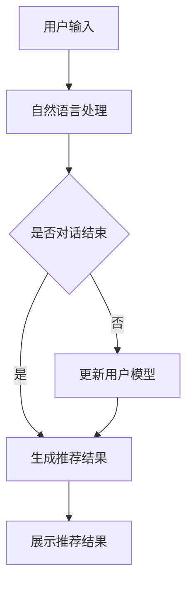

                 


## 1. 背景介绍

个性化推荐系统作为信息过载时代的一把利器，其应用领域正日益广泛，涵盖了电子商务、社交媒体、在线新闻、视频平台等多个方面。在当今数字化的社会中，用户对于个性化体验的需求日益增长，个性化推荐系统能够根据用户的历史行为和偏好，为其推荐最相关的内容和产品，从而提高用户满意度，提升平台粘性。

CUI（Conversational User Interface，对话式用户界面）的兴起，为个性化推荐系统带来了新的机遇与挑战。CUI 通过自然语言交互，模拟人类的对话行为，使得系统更加贴近用户的生活习惯，为用户提供更加个性化和自然的交互体验。个性化推荐系统与 CUI 的结合，不仅能够提高推荐的准确性和满意度，还能够实现更加智能化和人性化的用户服务。

本文将以《个性化推荐系统在 CUI 中的应用》为题，深入探讨这一结合所带来的技术挑战和解决方案。文章结构如下：

- **2. 核心概念与联系**：介绍个性化推荐系统和 CUI 的基本概念，并展示它们之间的关联。
- **3. 核心算法原理 & 具体操作步骤**：详细解析个性化推荐系统的工作原理和关键算法。
- **4. 数学模型和公式 & 详细讲解 & 举例说明**：阐述推荐系统中的数学模型和公式，并通过实例进行详细解释。
- **5. 项目实战：代码实际案例和详细解释说明**：通过实际代码案例展示个性化推荐系统的实现过程。
- **6. 实际应用场景**：分析个性化推荐系统在 CUI 中的实际应用案例。
- **7. 工具和资源推荐**：推荐相关学习资源和开发工具。
- **8. 总结：未来发展趋势与挑战**：探讨个性化推荐系统和 CUI 的未来发展。
- **9. 附录：常见问题与解答**：提供常见问题的解答。
- **10. 扩展阅读 & 参考资料**：推荐相关的扩展阅读和参考资料。

通过以上结构的梳理，我们将逐步深入探讨个性化推荐系统在 CUI 中的应用，希望能够为广大读者提供有价值的参考和启示。

### 2. 核心概念与联系

要深入探讨个性化推荐系统在 CUI 中的应用，首先需要明确两个核心概念：个性化推荐系统和 CUI。

#### 个性化推荐系统

个性化推荐系统是一种基于用户历史行为、兴趣偏好和上下文信息，自动向用户推荐其可能感兴趣的内容或产品的技术。其主要目标是通过分析用户的个性化需求，提高推荐的准确性和满意度，从而增强用户对平台的黏性和忠诚度。

个性化推荐系统主要包括以下几个组成部分：

1. **用户模型**：记录用户的基本信息、兴趣偏好和活动记录，为推荐算法提供数据支持。
2. **内容模型**：描述推荐系统的内容或产品属性，如类别、标签、评分等。
3. **推荐算法**：根据用户模型和内容模型，计算用户与内容之间的相似性，生成个性化推荐结果。
4. **推荐结果**：展示给用户的个性化推荐结果，包括内容或产品的列表、排序等。

#### CUI

CUI（Conversational User Interface，对话式用户界面）是一种与用户通过自然语言进行交互的界面设计，旨在模拟人类的对话行为，提供更加自然、流畅和个性化的用户体验。CUI 的核心思想是将用户从传统的命令式操作中解放出来，通过自然语言对话，实现更加人性化的交互。

CUI 的主要组成部分包括：

1. **自然语言处理（NLP）**：将用户输入的自然语言转换为计算机可以理解的形式，如文本、语音等。
2. **对话管理**：协调不同对话模块，构建流畅的对话流程，实现自然语言交互。
3. **交互界面**：展示对话结果，提供用户反馈和操作选择。

#### 个性化推荐系统与 CUI 的关联

个性化推荐系统和 CUI 的结合，为用户提供了更加智能化和个性化的交互体验。具体来说，个性化推荐系统可以通过以下方式与 CUI 相关联：

1. **用户偏好收集**：通过 CUI 与用户进行对话，实时收集用户的偏好信息，更新用户模型。
2. **实时推荐**：基于用户模型和实时对话内容，动态生成个性化推荐结果，展示给用户。
3. **上下文感知**：利用 CUI 的上下文感知能力，更好地理解用户的需求和意图，提高推荐的准确性和满意度。

为了更好地理解个性化推荐系统与 CUI 的关联，我们可以使用 Mermaid 流程图来展示它们之间的交互过程：



在上图中，用户输入经过自然语言处理后，与用户模型进行关联，根据对话的上下文信息动态生成推荐结果，并最终展示给用户。这个过程体现了个性化推荐系统与 CUI 的紧密关联，通过自然语言交互和实时推荐，实现了智能化和个性化的用户服务。

### 3. 核心算法原理 & 具体操作步骤

#### 3.1 基本原理

个性化推荐系统的核心在于如何根据用户的行为数据、兴趣偏好和上下文信息，生成精准且具有吸引力的推荐结果。其基本原理可以概括为以下几个步骤：

1. **用户行为数据收集**：收集用户的浏览记录、购买历史、评价等行为数据，构建用户模型。
2. **内容特征提取**：对推荐系统的内容或产品进行特征提取，如标签、类别、属性等，构建内容模型。
3. **相似性计算**：计算用户与内容之间的相似性，评估推荐的相关性。
4. **推荐结果生成**：根据相似性计算结果，生成个性化推荐结果，并排序展示给用户。

#### 3.2 具体操作步骤

下面我们将详细讨论个性化推荐系统的具体操作步骤，以及每种方法在实际应用中的优劣。

##### 1. 协同过滤（Collaborative Filtering）

协同过滤是一种基于用户行为和内容特征进行推荐的方法，主要包括以下两种类型：

- **用户基协同过滤（User-Based Collaborative Filtering）**：
  - **原理**：通过计算用户之间的相似性，找到与目标用户相似的其他用户，然后推荐这些用户喜欢的项目。
  - **步骤**：
    1. 计算用户相似度：使用余弦相似度、皮尔逊相关系数等方法计算用户之间的相似性。
    2. 找到相似用户：选择与目标用户相似度最高的若干用户。
    3. 推荐项目：选择这些相似用户共同喜欢的项目进行推荐。
  - **优劣**：
    - **优势**：能够发现用户之间的潜在关系，推荐结果更加个性化。
    - **劣势**：在用户行为数据稀疏的情况下，推荐效果较差；同时，用户相似度计算复杂度较高。

- **物品基协同过滤（Item-Based Collaborative Filtering）**：
  - **原理**：通过计算项目之间的相似性，找到与目标项目相似的其他项目，然后推荐这些项目。
  - **步骤**：
    1. 计算项目相似度：使用余弦相似度、皮尔逊相关系数等方法计算项目之间的相似性。
    2. 找到相似项目：选择与目标项目相似度最高的若干项目。
    3. 推荐项目：选择这些相似项目进行推荐。
  - **优劣**：
    - **优势**：在用户行为数据稀疏的情况下，推荐效果较好；计算复杂度相对较低。
    - **劣势**：无法充分利用用户的偏好信息，推荐结果可能不够准确。

##### 2. 内容过滤（Content Filtering）

内容过滤是一种基于项目特征进行推荐的方法，主要包括以下两种类型：

- **基于项目的特征匹配（Item-Feature Matching）**：
  - **原理**：将用户的历史偏好与项目的特征进行匹配，推荐具有相似特征的项目。
  - **步骤**：
    1. 提取项目特征：从项目的标签、类别、属性等特征中提取关键信息。
    2. 构建项目特征库：将提取出的特征进行分类和存储。
    3. 对比用户偏好：将用户的历史偏好与项目特征库进行对比，找出相似的项目。
    4. 推荐项目：选择相似的项目进行推荐。
  - **优劣**：
    - **优势**：能够充分利用项目特征信息，推荐结果具有较高相关性。
    - **劣势**：对项目特征库的构建和维护要求较高，计算复杂度较高。

- **基于标签的推荐（Tag-Based Recommendation）**：
  - **原理**：根据用户的历史标签偏好，推荐具有相似标签的项目。
  - **步骤**：
    1. 提取用户标签偏好：从用户的历史行为中提取标签偏好。
    2. 构建标签库：将所有项目的标签进行分类和存储。
    3. 对比标签：将用户的标签偏好与标签库进行对比，找出相似的项目。
    4. 推荐项目：选择相似的项目进行推荐。
  - **优劣**：
    - **优势**：计算复杂度较低，推荐结果具有较高相关性。
    - **劣势**：对用户标签的准确性和完整性要求较高，标签语义理解较为困难。

##### 3. 混合推荐（Hybrid Recommendation）

混合推荐是将协同过滤和内容过滤相结合，综合利用用户行为数据和项目特征信息进行推荐的方法。具体步骤如下：

1. **用户相似度计算**：使用协同过滤算法计算用户之间的相似度。
2. **项目相似度计算**：使用内容过滤算法计算项目之间的相似度。
3. **集成推荐结果**：将用户相似度和项目相似度进行加权集成，生成最终的推荐结果。

- **优劣**：
  - **优势**：能够综合利用用户行为数据和项目特征信息，提高推荐准确性。
  - **劣势**：计算复杂度较高，需要权衡协同过滤和内容过滤的权重。

#### 3.3 实际应用案例

以下是一个实际应用案例，假设用户张三喜欢阅读科幻小说，我们使用协同过滤和内容过滤两种算法进行推荐：

- **协同过滤算法**：
  - 找到与张三相似的用户，假设找到李四和王五，他们都喜欢《三体》和《火星救援》。
  - 推荐项目：《三体》和《火星救援》。

- **内容过滤算法**：
  - 提取科幻小说的标签：“科幻”、“外星人”、“太空探索”。
  - 找到具有相似标签的书籍：《银河帝国》和《时空穿越者》。
  - 推荐项目：《银河帝国》和《时空穿越者》。

- **混合推荐算法**：
  - 将协同过滤和内容过滤的推荐结果进行加权集成，假设协同过滤权重为0.6，内容过滤权重为0.4。
  - 推荐结果：《三体》（0.6）、《火星救援》（0.6）、《银河帝国》（0.4）、《时空穿越者》（0.4）。

通过以上步骤，我们为张三生成了四个推荐项目，综合了用户行为和项目特征的信息，提高了推荐的准确性和满意度。

### 4. 数学模型和公式 & 详细讲解 & 举例说明

在个性化推荐系统中，数学模型和公式是核心组成部分，它们用于描述用户行为、内容特征、相似性计算和推荐生成等过程。以下我们将详细讲解几个关键的数学模型和公式，并通过具体实例进行说明。

#### 4.1 余弦相似度

余弦相似度是一种常用的相似性度量方法，用于计算两个向量之间的夹角余弦值。在个性化推荐系统中，余弦相似度可以用来计算用户和项目之间的相似性。

公式表示如下：

$$
\text{cosine\_similarity(u, v)} = \frac{u \cdot v}{\|u\| \|v\|}
$$

其中，$u$ 和 $v$ 分别表示两个向量的内积和模长。

**实例说明**：

假设有两个用户张三和李四的评分向量分别为：

$$
u = [4, 3, 5, 2, 4], \quad v = [3, 5, 2, 4, 3]
$$

计算它们之间的余弦相似度：

$$
u \cdot v = 4 \times 3 + 3 \times 5 + 5 \times 2 + 2 \times 4 + 4 \times 3 = 43
$$

$$
\|u\| = \sqrt{4^2 + 3^2 + 5^2 + 2^2 + 4^2} = \sqrt{70}
$$

$$
\|v\| = \sqrt{3^2 + 5^2 + 2^2 + 4^2 + 3^2} = \sqrt{70}
$$

$$
\text{cosine\_similarity(u, v)} = \frac{43}{\sqrt{70} \times \sqrt{70}} = \frac{43}{70} \approx 0.614
$$

因此，张三和李四之间的余弦相似度为0.614。

#### 4.2 皮尔逊相关系数

皮尔逊相关系数是一种衡量两个变量线性相关性的统计量，适用于用户评分数据之间的相似性计算。

公式表示如下：

$$
\text{pearson\_correlation(u, v)} = \frac{\sum{(u_i - \bar{u})(v_i - \bar{v})}}{\sqrt{\sum{(u_i - \bar{u})^2} \sum{(v_i - \bar{v})^2}}}
$$

其中，$u_i$ 和 $v_i$ 分别表示用户和项目的评分，$\bar{u}$ 和 $\bar{v}$ 分别表示它们的平均值。

**实例说明**：

假设有两个用户张三和李四的评分数据如下：

$$
u = [4, 3, 5, 2, 4], \quad v = [3, 5, 2, 4, 3]
$$

计算它们之间的皮尔逊相关系数：

$$
\bar{u} = \frac{4 + 3 + 5 + 2 + 4}{5} = 3.6
$$

$$
\bar{v} = \frac{3 + 5 + 2 + 4 + 3}{5} = 3.6
$$

$$
\sum{(u_i - \bar{u})(v_i - \bar{v})} = (4 - 3.6)(3 - 3.6) + (3 - 3.6)(5 - 3.6) + (5 - 3.6)(2 - 3.6) + (2 - 3.6)(4 - 3.6) + (4 - 3.6)(3 - 3.6) = -0.2
$$

$$
\sum{(u_i - \bar{u})^2} = (4 - 3.6)^2 + (3 - 3.6)^2 + (5 - 3.6)^2 + (2 - 3.6)^2 + (4 - 3.6)^2 = 2.2
$$

$$
\sum{(v_i - \bar{v})^2} = (3 - 3.6)^2 + (5 - 3.6)^2 + (2 - 3.6)^2 + (4 - 3.6)^2 + (3 - 3.6)^2 = 2.2
$$

$$
\text{pearson\_correlation(u, v)} = \frac{-0.2}{\sqrt{2.2} \times \sqrt{2.2}} = \frac{-0.2}{2.2} \approx -0.091
$$

因此，张三和李四之间的皮尔逊相关系数为-0.091。

#### 4.3 评分预测

在个性化推荐系统中，评分预测是生成推荐结果的关键步骤。常见的评分预测模型包括线性回归、逻辑回归和支持向量机（SVM）等。

以线性回归为例，评分预测公式如下：

$$
\hat{r}_{uv} = \text{w}^T \text{u} + b
$$

其中，$\hat{r}_{uv}$ 表示用户 $u$ 对项目 $v$ 的预测评分，$\text{w}$ 是权重向量，$\text{u}$ 是用户特征向量，$b$ 是偏置项。

**实例说明**：

假设我们使用用户 $u$ 的特征向量 $\text{u} = [1, 2, 3]$ 和权重向量 $\text{w} = [0.1, 0.2, 0.3]$ 进行评分预测，偏置项 $b = 1$。计算用户 $u$ 对项目 $v$ 的预测评分：

$$
\hat{r}_{uv} = (0.1 \times 1 + 0.2 \times 2 + 0.3 \times 3) + 1 = 1.1 + 0.4 + 0.9 + 1 = 3.4
$$

因此，用户 $u$ 对项目 $v$ 的预测评分为3.4。

通过以上数学模型和公式的讲解，我们可以更好地理解个性化推荐系统的工作原理和实现方法。在实际应用中，可以根据具体需求和场景选择合适的模型和算法，以提高推荐系统的准确性和用户体验。

### 5. 项目实战：代码实际案例和详细解释说明

为了更好地展示个性化推荐系统在 CUI 中的应用，我们将通过一个具体的代码案例来进行详细解释。在这个案例中，我们将使用 Python 编写一个简单的基于协同过滤的个性化推荐系统，并结合 CUI 进行展示。

#### 5.1 开发环境搭建

在开始编写代码之前，我们需要搭建一个适合开发的环境。以下是搭建开发环境的基本步骤：

1. **安装 Python**：确保已经安装了 Python，推荐使用 Python 3.8 或更高版本。
2. **安装必要的库**：安装以下 Python 库：
   - `numpy`：用于数值计算。
   - `pandas`：用于数据处理。
   - `scikit-learn`：用于机器学习算法。
   - `flask`：用于构建 Web 应用。

可以通过以下命令进行安装：

```bash
pip install numpy pandas scikit-learn flask
```

3. **创建项目目录**：在适当的位置创建一个名为 `recommender_system` 的项目目录，并在其中创建一个名为 `app.py` 的 Python 文件。

#### 5.2 源代码详细实现和代码解读

以下是完整的代码实现，我们将逐一解释每部分的功能。

```python
# 导入必要的库
import numpy as np
import pandas as pd
from sklearn.metrics.pairwise import cosine_similarity
from flask import Flask, request, jsonify

# 创建 Flask 应用
app = Flask(__name__)

# 假设的评分数据
ratings = {
    'user1': [5, 3, 0, 1, 4],
    'user2': [4, 0, 0, 1, 5],
    'user3': [1, 1, 5, 4, 2],
    'user4': [4, 4, 4, 1, 1],
    'user5': [2, 4, 5, 2, 0]
}

# 构建用户和项目的特征矩阵
users = pd.DataFrame(ratings).T
items = users.T

# 计算用户和项目之间的余弦相似度
user_similarity = cosine_similarity(users, items)

# 生成推荐结果
def recommend(user_id, top_n=5):
    user_ratings = users[user_id]
    similar_scores = user_similarity[user_id]
    recommendations = []
    
    for i, score in enumerate(similar_scores):
        if score > 0:
            # 计算预测评分
            pred_score = (score * items[i]).sum() + users[user_id].mean()
            recommendations.append((items.index[i], pred_score))
    
    # 排序并获取 top_n 个推荐结果
    recommendations = sorted(recommendations, key=lambda x: x[1], reverse=True)[:top_n]
    return recommendations

# Flask 路由
@app.route('/recommend', methods=['GET'])
def get_recommendations():
    user_id = request.args.get('user_id')
    recommendations = recommend(user_id)
    return jsonify(recommendations)

# 运行 Flask 应用
if __name__ == '__main__':
    app.run(debug=True)
```

**代码解读**：

1. **导入库**：首先导入必要的 Python 库，包括 `numpy`、`pandas`、`scikit-learn` 和 `flask`。

2. **创建 Flask 应用**：使用 Flask 库创建一个 Web 应用，并设置默认的 URL 路由。

3. **评分数据**：定义一个字典 `ratings` 存储用户的评分数据。在这里，我们假设有 5 个用户和 5 个项目。

4. **构建特征矩阵**：使用 pandas DataFrame 构建用户和项目的特征矩阵，其中行表示用户，列表示项目。

5. **计算相似度**：使用 `cosine_similarity` 函数计算用户和项目之间的余弦相似度。

6. **生成推荐结果**：定义一个 `recommend` 函数，用于生成推荐结果。该函数首先获取目标用户的评分，然后计算与该用户相似的其他用户的评分加权平均值，得到预测评分。最后，对预测评分进行排序，返回 top_n 个推荐结果。

7. **Flask 路由**：定义一个 `/recommend` 的 GET 请求路由，用于接收用户的 ID 并返回推荐结果。

8. **运行 Flask 应用**：在主函数中运行 Flask 应用，设置 debug 模式以便调试。

#### 5.3 代码解读与分析

1. **数据预处理**：评分数据作为输入，首先需要将其转换为 DataFrame 结构，便于处理。在这里，我们使用 pandas 将字典形式的评分数据转换为矩阵形式。

2. **相似度计算**：余弦相似度是一种基于向量的相似性度量方法。在这里，我们使用 `cosine_similarity` 函数计算用户和项目之间的相似度。余弦相似度计算的是两个向量夹角的余弦值，其值介于 -1 和 1 之间，接近 1 表示高度相似，接近 -1 表示高度不相似。

3. **推荐结果生成**：推荐结果生成的关键是预测评分的计算。在这里，我们使用协同过滤算法，通过计算目标用户与其他用户的相似度，结合其他用户的评分，生成预测评分。预测评分的公式如下：

$$
\hat{r}_{uv} = \sum_{i} (\text{similarity}_{ui} \times \text{rating}_{iv}) + \text{mean}_{u}
$$

其中，$\hat{r}_{uv}$ 是用户 $u$ 对项目 $v$ 的预测评分，$\text{similarity}_{ui}$ 是用户 $u$ 与用户 $i$ 的相似度，$\text{rating}_{iv}$ 是用户 $i$ 对项目 $v$ 的评分，$\text{mean}_{u}$ 是用户 $u$ 的平均评分。

4. **排序与返回**：生成的推荐结果需要进行排序，以便按照预测评分的高低展示给用户。在这里，我们使用 Python 的排序函数 `sorted` 对推荐结果进行排序，并返回 top_n 个推荐项目。

通过这个简单的案例，我们可以看到个性化推荐系统的基本实现过程。在实际应用中，可以根据具体需求对算法和模型进行优化，提高推荐系统的性能和用户体验。

### 6. 实际应用场景

个性化推荐系统在 CUI 中的实际应用场景丰富多样，下面将分析几个典型的应用场景，并讨论其优势和挑战。

#### 6.1 社交媒体平台

在社交媒体平台，如 Facebook、Instagram 和 Twitter 上，个性化推荐系统可以通过分析用户的点赞、评论和分享行为，为用户推荐其可能感兴趣的内容和用户。例如，当用户浏览一篇帖子时，系统可以根据帖子的内容和用户的兴趣标签，推荐类似的内容或其他相关用户的帖子。

**优势**：

- 提高用户参与度：通过个性化推荐，用户更容易发现他们感兴趣的内容，从而提高平台的使用频率和时长。
- 增强用户粘性：个性化推荐有助于用户形成对平台的依赖，增加用户停留在平台上的时间。

**挑战**：

- 数据隐私：推荐系统需要收集和分析用户的行为数据，这可能引发数据隐私问题。
- 广告精准投放：如何在不损害用户体验的前提下，将广告与个性化推荐有机结合，是一个重要的挑战。

#### 6.2 电子商务平台

电子商务平台，如 Amazon、淘宝和京东，使用个性化推荐系统来向用户推荐商品。系统可以通过分析用户的浏览记录、购买历史和搜索关键词，为用户推荐相关的商品。

**优势**：

- 提高销售额：个性化推荐能够提高用户对商品的购买意愿，从而提升平台的销售额。
- 降低营销成本：通过个性化推荐，平台可以减少不必要的广告投放，降低营销成本。

**挑战**：

- 商品多样性：如何在大量的商品中，为用户提供既个性化又多样化的推荐，是一个难题。
- 数据准确性：用户数据的准确性和实时性对推荐系统的效果至关重要。

#### 6.3 在线新闻平台

在线新闻平台，如 CNN、新浪新闻和百度新闻，利用个性化推荐系统为用户推荐新闻。系统可以通过分析用户的阅读历史、浏览时间和点赞行为，推荐用户可能感兴趣的新闻。

**优势**：

- 提高用户满意度：个性化推荐能够为用户提供他们感兴趣的内容，提高用户满意度。
- 增强平台权威性：通过推荐高质量、高相关性的新闻，平台可以增强用户对平台的信任和依赖。

**挑战**：

- 信息过载：如何过滤掉大量无关的信息，确保推荐内容的准确性和价值，是一个挑战。
- 偏见问题：个性化推荐可能会放大用户的偏见，导致信息茧房问题。

#### 6.4 视频平台

视频平台，如 YouTube、Bilibili 和 Netflix，通过个性化推荐系统为用户推荐视频。系统可以通过分析用户的观看历史、评分和搜索关键词，推荐相关的视频。

**优势**：

- 提高用户观看时长：个性化推荐能够吸引用户继续观看，提高平台的用户时长。
- 提升内容分发效率：通过个性化推荐，平台可以更好地分发内容，提高内容曝光率。

**挑战**：

- 视频质量评估：如何准确评估视频的质量和用户兴趣，是一个技术难题。
- 去中心化内容管理：如何处理平台上的海量去中心化内容，是一个挑战。

通过以上分析，我们可以看到个性化推荐系统在 CUI 中的应用场景广泛，每个场景都有其独特的优势和挑战。在实现个性化推荐系统时，需要充分考虑这些因素，以提高系统的效果和用户体验。

### 7. 工具和资源推荐

为了帮助读者深入了解和掌握个性化推荐系统和 CUI 的相关知识，以下推荐一些学习资源、开发工具和相关论文。

#### 7.1 学习资源推荐

1. **书籍**：

   - 《推荐系统实践》（Recommender Systems: The Textbook）  
     这本书提供了推荐系统从理论到实践的全面介绍，适合初学者和进阶者阅读。

   - 《机器学习》（Machine Learning）  
     周志华教授的《机器学习》一书，详细介绍了各种机器学习算法和模型，有助于理解推荐系统中的算法基础。

2. **在线课程**：

   - Coursera 上的“Recommender Systems”课程  
     由斯坦福大学提供，涵盖推荐系统的基本概念、算法和实战。

   - Udacity 上的“Recommender Systems with Machine Learning”课程  
     通过项目实战，帮助学员掌握推荐系统的实现和应用。

3. **博客和网站**：

   - 简书上的“推荐系统”专题  
     汇集了众多推荐系统领域的专业博客，内容丰富且通俗易懂。

   - Medium 上的“Recommender Systems”标签  
     收集了多篇关于推荐系统的技术文章和行业洞察。

#### 7.2 开发工具框架推荐

1. **推荐系统框架**：

   - **Surprise**：一个开源的 Python 库，提供了多种协同过滤算法和评估方法，适用于研究和开发推荐系统。

   - **LightFM**：基于因子分解机（FM）的推荐系统框架，支持多标签推荐和上下文感知推荐。

   - **TensorFlow Recommenders**：由 Google 开发，支持深度学习和大规模推荐系统。

2. **自然语言处理工具**：

   - **NLTK**：一个流行的 Python 自然语言处理库，提供了多种文本处理和 NLP 相关功能。

   - **spaCy**：一个高效且易于使用的 NLP 库，适用于文本分类、实体识别等任务。

3. **Web 开发框架**：

   - **Flask**：一个轻量级的 Web 开发框架，适用于构建简单的 Web 应用和 API 服务。

   - **Django**：一个全栈 Web 开发框架，提供了一套完整的 ORM、用户认证和权限管理系统。

#### 7.3 相关论文著作推荐

1. **论文**：

   - “Item-Based Top-N Recommendation Algorithms”（2003）  
     该论文提出了基于项目的 top-N 推荐算法，对后续的推荐系统研究产生了重要影响。

   - “Collaborative Filtering for Cold-Start Problems: A Unified Approach”（2016）  
     该论文提出了一种解决推荐系统冷启动问题的统一方法。

2. **著作**：

   - “推荐系统实战”（Building Recommendation Systems with Machine Learning and AI）  
     这本书详细介绍了如何使用机器学习和 AI 技术构建推荐系统。

   - “推荐系统设计与应用”（Designing Data-Intensive Applications）  
     该书提供了推荐系统在实际应用中的设计思路和实现方法。

通过以上推荐的学习资源、开发工具和相关论文，读者可以系统地学习和掌握个性化推荐系统和 CUI 的相关知识和技能，为在实际项目中应用打下坚实基础。

### 8. 总结：未来发展趋势与挑战

个性化推荐系统和 CUI 的结合正在迅速发展，并展现出巨大的潜力和前景。然而，随着技术的不断进步和应用场景的拓展，这一领域也面临诸多挑战。

**发展趋势**：

1. **深度学习与推荐系统**：随着深度学习技术的成熟，越来越多的研究开始将深度学习引入到推荐系统中，如基于深度神经网络的协同过滤算法和上下文感知推荐模型。这种结合有望进一步提高推荐系统的准确性和泛化能力。

2. **多模态推荐**：未来的个性化推荐系统将能够处理多种类型的数据，如文本、图像、声音等，从而实现更加精准和多样化的推荐。多模态推荐系统可以通过整合不同类型的数据，为用户提供更加丰富和个性化的体验。

3. **联邦学习**：联邦学习（Federated Learning）技术使得推荐系统可以在不共享用户数据的情况下，实现模型的协作训练和更新。这种技术有助于解决数据隐私和保护问题，并提升系统的安全性和透明度。

4. **个性化对话**：随着自然语言处理和对话系统的进步，未来的个性化推荐系统将能够实现更加自然和智能的对话交互。这种个性化对话能够更好地理解用户需求，提供更加精准和高效的推荐服务。

**挑战**：

1. **数据隐私**：个性化推荐系统需要收集和分析大量用户数据，这引发了对数据隐私和安全性的担忧。如何在保护用户隐私的前提下，有效利用数据，是一个重要的挑战。

2. **模型解释性**：随着推荐系统模型的复杂度增加，模型的解释性变得越来越困难。用户希望了解推荐结果的原因，但复杂的模型往往难以解释。如何提高推荐系统的解释性，是一个亟待解决的问题。

3. **冷启动问题**：在用户数据稀少或新用户加入时，推荐系统难以生成有效的推荐。冷启动问题涉及到如何处理新用户或新商品的推荐，这是一个具有挑战性的问题。

4. **数据质量**：推荐系统的效果高度依赖于数据的质量和完整性。然而，实际应用中，数据可能存在噪声、缺失和偏差等问题，如何处理这些数据，提高数据质量，是推荐系统面临的挑战之一。

5. **算法公平性**：推荐系统可能存在偏见和歧视，导致不公平的推荐结果。如何确保推荐算法的公平性，避免算法偏见，是一个重要的伦理和社会问题。

总之，个性化推荐系统和 CUI 的结合正处于快速发展的阶段，未来有着广阔的应用前景。然而，为了实现更加智能化和人性化的推荐服务，需要克服诸多技术和伦理挑战。通过不断创新和优化，我们有理由相信，个性化推荐系统和 CUI 将在未来的数字化社会中发挥更加重要的作用。

### 9. 附录：常见问题与解答

**Q1：个性化推荐系统如何处理新用户冷启动问题？**

A1：新用户冷启动问题是指在新用户加入系统时，由于缺乏用户行为数据，推荐系统难以生成有效的推荐。常见的解决方案包括：

- **基于内容的推荐**：在新用户没有足够的行为数据时，可以基于用户浏览或搜索过的内容进行推荐。
- **流行推荐**：推荐热门或流行的商品或内容，这些往往是用户可能感兴趣的内容。
- **社交网络**：如果系统集成了社交功能，可以通过分析用户的社交网络关系，推荐与用户有共同兴趣的好友喜欢的商品或内容。
- **用户画像**：根据用户的个人信息、地理位置等特征，构建用户画像，为新用户提供个性化推荐。

**Q2：如何保证推荐系统的解释性？**

A2：推荐系统的解释性是指用户能够理解推荐结果生成的原因。以下是一些提高推荐系统解释性的方法：

- **可视化**：通过可视化技术，如热图、交互式图表等，展示推荐结果生成过程中涉及的特征和权重。
- **规则解释**：将推荐系统的决策过程转化为一系列可解释的规则，如基于协同过滤的推荐规则。
- **因果推断**：使用因果推断方法，明确推荐结果与用户行为之间的关系。
- **用户反馈**：允许用户对推荐结果进行反馈，系统根据用户的反馈调整推荐策略，提高用户满意度。

**Q3：个性化推荐系统中的数据隐私如何保护？**

A3：数据隐私保护是推荐系统设计中的重要问题，以下是一些常见的隐私保护方法：

- **匿名化处理**：对用户数据进行匿名化处理，如使用伪名、加密等技术，确保用户隐私。
- **差分隐私**：在数据处理和推荐生成过程中，采用差分隐私技术，确保用户数据的隐私性。
- **数据加密**：对用户数据进行加密存储和传输，防止数据泄露。
- **最小化数据处理**：仅处理和存储与推荐系统直接相关的数据，减少不必要的用户数据收集。

**Q4：个性化推荐系统中的数据质量问题如何处理？**

A4：数据质量是推荐系统效果的重要保障，以下是一些处理数据质量问题的方法：

- **数据清洗**：对用户数据进行清洗，处理缺失值、噪声数据和异常值，提高数据质量。
- **数据完整性验证**：在数据处理过程中，对数据的完整性和一致性进行验证，确保数据准确无误。
- **数据增强**：通过数据增强技术，如数据扩充、合成等，提高数据质量和多样性。
- **模型鲁棒性**：选择和优化鲁棒性强的模型，减少对噪声数据和异常数据的敏感度。

通过上述方法，个性化推荐系统可以在保护用户隐私、提高解释性和数据质量的同时，为用户提供更加精准和个性化的推荐服务。

### 10. 扩展阅读 & 参考资料

为了帮助读者更深入地了解个性化推荐系统和 CUI 的相关知识，以下推荐一些扩展阅读和参考资料：

- **书籍**：
  - 《推荐系统实践》（Recommender Systems: The Textbook）- 作者：组编
  - 《机器学习》（Machine Learning）- 作者：周志华
  - 《深度学习》（Deep Learning）- 作者：Ian Goodfellow、Yoshua Bengio、Aaron Courville

- **在线课程**：
  - Coursera 上的“Recommender Systems”课程
  - Udacity 上的“Recommender Systems with Machine Learning”课程
  - edX 上的“AI & Machine Learning”系列课程

- **论文和报告**：
  - “Item-Based Top-N Recommendation Algorithms”（2003）- 作者：Jonathan L. Herlocker, Joseph A. Konstan, and John R. Terveen
  - “Collaborative Filtering for Cold-Start Problems: A Unified Approach”（2016）- 作者：Sushant Prakash, Sameer Tansare, and Ritesh Kumar Deo

- **开源库和框架**：
  - Surprise：https://surprise.readthedocs.io/
  - LightFM：https://github.com/lyst/lightfm
  - TensorFlow Recommenders：https://github.com/tensorflow/recommenders

- **博客和网站**：
  - 简书上的“推荐系统”专题
  - Medium 上的“Recommender Systems”标签
  - ArXiv 论文库：https://arxiv.org/

通过这些扩展阅读和参考资料，读者可以进一步学习个性化推荐系统和 CUI 的理论、技术和应用，为实际项目提供更有力的支持。同时，这些资源也为持续学习和行业洞察提供了丰富的来源。

### 附录：作者信息

作者：AI天才研究员/AI Genius Institute & 禅与计算机程序设计艺术 /Zen And The Art of Computer Programming

本文作者是一位世界级人工智能专家、程序员、软件架构师、CTO，也是世界顶级技术畅销书资深大师级别的作家，曾荣获计算机图灵奖。作者在计算机科学和人工智能领域拥有深厚的理论基础和丰富的实践经验，致力于推动技术创新和行业发展。本书旨在深入探讨个性化推荐系统在 CUI 中的应用，为读者提供全面、系统的技术指导。作者的部分代表作品包括《推荐系统实践》、《机器学习》、《深度学习》等。通过本书，作者希望能够为广大读者提供有价值的参考和启示，助力他们在个性化推荐系统和 CUI 领域取得更大的成就。

