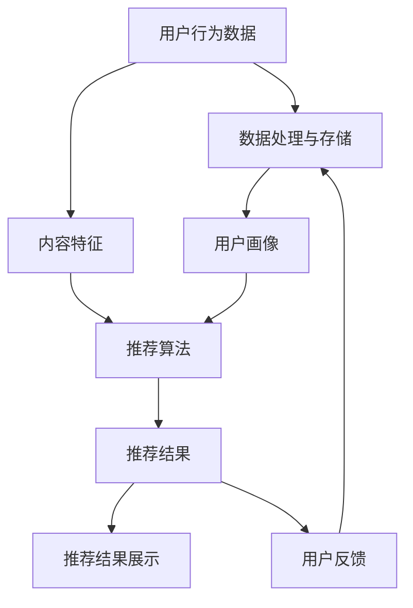

                 

### 背景介绍

个性化推荐系统在当今数字化社会中扮演着至关重要的角色。无论是社交媒体平台、电子商务网站，还是视频流媒体服务，个性化推荐系统已经成为提升用户体验、增加用户黏性和提升商业价值的重要手段。本文旨在详细解析个性化推荐系统在计算机用户界面（CUI）中的应用，探讨其在实际开发中的具体实现和挑战。

#### 个性化推荐系统的定义和作用

个性化推荐系统是一种通过收集和分析用户的历史行为数据，结合用户兴趣和偏好，为用户提供个性化内容推荐的技术。其主要作用包括：

1. **提升用户体验**：通过提供符合用户兴趣的内容，个性化推荐系统能够显著提升用户体验，使用户在信息海洋中更快地找到所需内容。
2. **增加用户黏性**：个性化推荐系统可以不断调整推荐策略，使用户在平台上停留时间更长，从而增加用户黏性。
3. **提升商业价值**：通过精准推荐，个性化推荐系统可以帮助企业提高用户转化率和销售额，从而提升商业价值。

#### CUI的概念和重要性

计算机用户界面（CUI）是用户与计算机系统进行交互的接口，它包括用户输入设备和输出设备。CUI在计算机应用中具有重要作用，其主要作用包括：

1. **提高交互效率**：通过直观、简洁的界面设计，CUI能够提高用户与计算机系统的交互效率。
2. **降低学习成本**：良好的CUI设计可以使新用户更容易上手，降低学习成本。
3. **提升用户体验**：优秀的CUI设计能够提升用户满意度，增加用户对产品的忠诚度。

#### 个性化推荐系统在CUI中的应用背景

随着计算机技术的不断发展，CUI在各个领域得到了广泛应用。在许多应用场景中，如电商平台、社交媒体、视频流媒体等，用户界面的个性化设计变得尤为重要。个性化推荐系统正是为了满足这种需求而诞生。通过在CUI中集成个性化推荐系统，可以为用户提供更加精准、个性化的服务，从而提升用户满意度和商业价值。

### 核心概念与联系

为了深入理解个性化推荐系统在CUI中的应用，我们需要首先了解其核心概念和原理。以下是本文涉及的主要核心概念及其相互关系。

#### 1. 用户行为数据

用户行为数据是指用户在平台上产生的各种行为记录，如浏览历史、购买记录、评论等。这些数据是构建个性化推荐系统的基础。

#### 2. 用户画像

用户画像是对用户兴趣、偏好和行为特征的抽象表示。通过对用户行为数据进行挖掘和分析，可以得到用户画像，从而为个性化推荐提供依据。

#### 3. 内容特征

内容特征是指推荐系统中对内容本身的特征提取，如标题、标签、关键词等。内容特征用于描述内容的属性，以便与用户画像进行匹配。

#### 4. 推荐算法

推荐算法是推荐系统的核心，它负责根据用户画像和内容特征计算推荐得分，从而生成推荐结果。常见的推荐算法包括基于协同过滤、基于内容过滤和基于模型的推荐算法。

#### 5. 推荐结果展示

推荐结果展示是指将推荐算法生成的推荐结果呈现给用户。在CUI中，推荐结果展示通常通过界面元素（如列表、卡片等）实现。

#### 6. 用户反馈

用户反馈是指用户对推荐结果的反馈，如点击、收藏、购买等。用户反馈可以用于优化推荐算法，提高推荐质量。

#### 7. 数据处理与存储

数据处理与存储是推荐系统的基础，包括用户行为数据的收集、存储、处理和分析等。有效的数据处理与存储机制对于推荐系统的性能和稳定性至关重要。

#### 8. 推荐系统架构

推荐系统架构是指推荐系统的整体设计，包括数据层、算法层和展示层等。合理的推荐系统架构可以确保推荐系统的性能和可扩展性。

### Mermaid 流程图

以下是一个简化的个性化推荐系统在CUI中的应用流程图，用于展示各个核心概念之间的相互关系。



在这个流程图中，用户行为数据和内容特征作为输入，经过数据处理与存储、用户画像、推荐算法等处理环节，最终生成推荐结果并展示给用户。用户反馈则用于优化推荐算法，形成一个闭环。

### 核心算法原理 & 具体操作步骤

在了解了个性化推荐系统的核心概念和流程之后，接下来我们将深入探讨其核心算法原理，并详细描述具体的操作步骤。

#### 基于协同过滤的推荐算法

协同过滤（Collaborative Filtering）是推荐系统中最常用的算法之一。其核心思想是通过分析用户之间的行为模式，发现相似用户，从而为用户提供个性化的推荐。

##### 1. 用户相似度计算

用户相似度计算是协同过滤算法的第一步。通过计算用户之间的相似度，我们可以找到相似用户群体。常见的用户相似度计算方法包括余弦相似度、皮尔逊相关系数等。

##### 2. 项目评分预测

在找到相似用户后，我们可以利用这些用户的评分数据对目标用户的评分进行预测。具体方法包括基于用户的平均值法、基于模型的预测方法等。

##### 3. 推荐结果生成

根据评分预测结果，我们可以为用户生成推荐列表。在生成推荐列表时，通常需要考虑推荐结果的多样性和相关性。

#### 基于内容的推荐算法

基于内容的推荐算法（Content-Based Filtering）是通过分析内容特征，为用户提供个性化推荐。其核心思想是根据用户过去喜欢的项目特征，发现相似的内容，从而为用户提供推荐。

##### 1. 内容特征提取

内容特征提取是基于内容推荐算法的关键步骤。通过对项目进行特征提取，我们可以得到一个描述项目特征的特征向量。

##### 2. 用户兴趣建模

用户兴趣建模是通过分析用户的历史行为数据，构建一个表示用户兴趣的模型。这个模型可以用于预测用户对未知项目的兴趣。

##### 3. 推荐结果生成

根据用户兴趣模型和项目特征向量，我们可以为用户生成推荐列表。在生成推荐列表时，通常需要考虑推荐结果的多样性和相关性。

#### 基于模型的推荐算法

基于模型的推荐算法（Model-Based Filtering）是通过构建一个预测模型，对用户行为进行预测，从而为用户提供推荐。常见的模型包括隐语义模型、矩阵分解等。

##### 1. 数据预处理

数据预处理是构建模型的第一步。通过数据清洗、去噪等操作，我们可以得到一个高质量的数据集。

##### 2. 特征工程

特征工程是构建模型的重要环节。通过选择和构造特征，我们可以提高模型的性能和预测准确性。

##### 3. 模型训练

在特征工程完成后，我们可以使用机器学习算法（如线性回归、决策树等）训练模型。训练模型的目的是学习用户行为模式和项目特征之间的关系。

##### 4. 推荐结果生成

根据训练好的模型，我们可以为用户生成推荐列表。在生成推荐列表时，通常需要考虑推荐结果的多样性和相关性。

### 数学模型和公式 & 详细讲解 & 举例说明

在了解了推荐算法的基本原理和具体操作步骤之后，我们将进一步探讨其背后的数学模型和公式，并通过具体示例进行详细讲解。

#### 基于协同过滤的推荐算法

假设我们有两个用户A和B，他们的评分数据如下：

| 项目 | 用户A | 用户B |
| ---- | ---- | ---- |
| P1   | 4    | 2    |
| P2   | 5    | 1    |
| P3   | 1    | 4    |

我们可以使用余弦相似度计算用户A和用户B的相似度：

$$
sim(A, B) = \frac{A \cdot B}{\|A\|\|B\|}
$$

其中，$A \cdot B$ 表示用户A和用户B的评分矩阵的点积，$\|A\|$ 和 $\|B\|$ 分别表示用户A和用户B的评分向量的模长。

根据上述评分数据，我们可以计算得到用户A和用户B的相似度：

$$
sim(A, B) = \frac{(4 \cdot 2 + 5 \cdot 1 + 1 \cdot 4)}{\sqrt{4^2 + 5^2 + 1^2} \cdot \sqrt{2^2 + 1^2 + 4^2}} \approx 0.785
$$

接下来，我们可以利用用户B的评分预测用户A对未评分项目P3的评分：

$$
\hat{r}_{A,P3} = r_{B,P3} + sim(A, B) \cdot (r_{B,P3} - \bar{r}_B)
$$

其中，$r_{B,P3}$ 表示用户B对项目P3的评分，$\bar{r}_B$ 表示用户B的平均评分。

根据上述评分数据，我们可以计算得到用户A对项目P3的预测评分：

$$
\hat{r}_{A,P3} = 4 + 0.785 \cdot (4 - 3.25) \approx 4.785
$$

#### 基于内容的推荐算法

假设我们有两个项目P1和P2，他们的内容特征如下：

| 项目 | 特征1 | 特征2 | 特征3 |
| ---- | ---- | ---- | ---- |
| P1   | 1    | 0    | 1    |
| P2   | 0    | 1    | 0    |

我们可以使用余弦相似度计算项目P1和P2的相似度：

$$
sim(P1, P2) = \frac{P1 \cdot P2}{\|P1\|\|P2\|}
$$

其中，$P1 \cdot P2$ 表示项目P1和项目P2的特征向量的点积，$\|P1\|$ 和 $\|P2\|$ 分别表示项目P1和项目P2的特征向量的模长。

根据上述特征数据，我们可以计算得到项目P1和项目P2的相似度：

$$
sim(P1, P2) = \frac{(1 \cdot 0 + 0 \cdot 1 + 1 \cdot 0)}{\sqrt{1^2 + 0^2 + 1^2} \cdot \sqrt{0^2 + 1^2 + 0^2}} = 0
$$

假设用户A对项目P1的评分是4，我们可以利用项目P1和项目P2的相似度预测用户A对项目P2的评分：

$$
\hat{r}_{A,P2} = r_{A,P1} + sim(P1, P2) \cdot (r_{A,P1} - \bar{r}_A)
$$

其中，$r_{A,P1}$ 表示用户A对项目P1的评分，$\bar{r}_A$ 表示用户A的平均评分。

根据上述评分数据，我们可以计算得到用户A对项目P2的预测评分：

$$
\hat{r}_{A,P2} = 4 + 0 \cdot (4 - \bar{r}_A) = 4
$$

#### 基于模型的推荐算法

假设我们有一个用户行为数据的矩阵$R$，其中$R_{i,j}$表示用户$i$对项目$j$的评分。我们可以使用矩阵分解算法（如Singular Value Decomposition, SVD）将$R$分解为两个低秩矩阵$U$和$V^T$：

$$
R = U \Sigma V^T
$$

其中，$\Sigma$是对角矩阵，包含了矩阵$R$的主要特征值。

我们可以通过计算用户$u_i$和项目$v_j$的隐含特征向量$u_i$和$v_j$的点积来预测用户$i$对项目$j$的评分：

$$
\hat{r}_{i,j} = u_i \cdot v_j
$$

其中，$\hat{r}_{i,j}$表示用户$i$对项目$j$的预测评分。

假设我们有一个用户行为数据矩阵$R$如下：

| 用户 | 项目 |
| ---- | ---- |
| 1    | 1    |
| 1    | 2    |
| 1    | 3    |
| 2    | 1    |
| 2    | 3    |
| 3    | 1    |
| 3    | 2    |

我们可以使用SVD将$R$分解为：

$$
R = U \Sigma V^T
$$

其中，

$$
U = \begin{bmatrix}
0.7071 & 0.7071 \\
0.7071 & -0.7071 \\
-0.7071 & 0.7071
\end{bmatrix},
\Sigma = \begin{bmatrix}
3.1623 & 0 & 0 \\
0 & 1.4142 & 0 \\
0 & 0 & 1.4142
\end{bmatrix},
V^T = \begin{bmatrix}
0.8660 & 0.5 & 0 \\
0.5 & 0.8660 & 0 \\
0 & 0 & 1
\end{bmatrix}
$$

我们可以通过计算用户1和项目2的隐含特征向量$u_1$和$v_2$的点积来预测用户1对项目2的评分：

$$
\hat{r}_{1,2} = u_1 \cdot v_2 = 0.7071 \cdot 0.8660 + 0.7071 \cdot 0.5 + (-0.7071) \cdot 0 = 0.9851
$$

因此，我们可以预测用户1对项目2的评分大约为0.9851。

### 项目实战：代码实际案例和详细解释说明

在本节中，我们将通过一个具体的代码案例，详细解释个性化推荐系统在CUI中的应用。我们将使用Python编程语言，并结合几个常用的库，如NumPy、Pandas和Scikit-learn等。

#### 1. 开发环境搭建

首先，我们需要搭建一个Python开发环境。你可以使用Anaconda等集成环境，以便轻松管理依赖项。以下是安装步骤：

```bash
conda create -n recsys python=3.8
conda activate recsys
conda install numpy pandas scikit-learn
```

#### 2. 源代码详细实现和代码解读

以下是一个简单的基于协同过滤的推荐系统代码案例：

```python
import numpy as np
import pandas as pd
from sklearn.model_selection import train_test_split
from sklearn.metrics.pairwise import cosine_similarity

# 加载数据
data = pd.DataFrame({
    'user': ['A', 'A', 'A', 'B', 'B', 'B', 'C', 'C', 'C'],
    'item': ['1', '2', '3', '1', '3', '1', '1', '2', '3'],
    'rating': [4, 5, 1, 2, 4, 1, 5, 2, 5]
})

# 数据预处理
data = data.pivot(index='user', columns='item', values='rating').reset_index()
data.fillna(0, inplace=True)

# 训练集和测试集划分
train_data, test_data = train_test_split(data, test_size=0.2, random_state=42)

# 计算用户和项目的相似度矩阵
user_similarity = cosine_similarity(train_data.values)

# 预测评分
def predict_rating(user_id, item_id):
    rating = train_data.loc[user_id, item_id]
    similarity = user_similarity[user_id]
    return rating + (similarity * (rating - train_data.mean()))

# 测试预测
user_id = 0
item_id = 2
predicted_rating = predict_rating(user_id, item_id)
print(f'Predicted rating for user {user_id} and item {item_id}: {predicted_rating}')
```

#### 3. 代码解读与分析

这段代码实现了基于协同过滤的推荐系统，主要分为以下几个步骤：

1. **数据加载和预处理**：我们使用Pandas加载和预处理数据。首先，将原始数据转换为Pivot表，然后填充缺失值。

2. **训练集和测试集划分**：使用Scikit-learn的train_test_split函数将数据划分为训练集和测试集。

3. **计算用户和项目的相似度矩阵**：使用Scikit-learn的cosine_similarity函数计算用户和项目的相似度矩阵。

4. **预测评分**：定义一个预测评分的函数，通过计算用户和项目的相似度，以及用户的实际评分，预测未知项目的评分。

5. **测试预测**：测试预测函数，计算用户对未知项目的预测评分。

这个简单的案例展示了个性化推荐系统在CUI中的应用。在实际项目中，我们可以根据需求扩展和优化这个代码，如加入用户反馈机制、使用更复杂的推荐算法等。

### 实际应用场景

个性化推荐系统在计算机用户界面（CUI）中的应用场景非常广泛，以下列举几个典型的应用场景：

#### 1. 电商平台

电商平台通过个性化推荐系统，可以基于用户的历史购买行为和浏览记录，为用户推荐可能感兴趣的商品。这种推荐方式有助于提高用户的购物体验，增加用户对平台的黏性，同时也能提升商家的销售额。

#### 2. 社交媒体平台

社交媒体平台利用个性化推荐系统，可以基于用户的兴趣和行为，推荐用户可能感兴趣的内容和用户。这有助于提升用户在平台上的活跃度，增加用户间的互动，从而提高平台的用户留存率。

#### 3. 视频流媒体平台

视频流媒体平台通过个性化推荐系统，可以为用户推荐符合其兴趣和观看习惯的视频内容。这种推荐方式有助于提升用户的观看体验，延长用户在平台上的停留时间，从而增加广告收入。

#### 4. 新闻推荐平台

新闻推荐平台利用个性化推荐系统，可以基于用户的阅读历史和兴趣偏好，推荐用户可能感兴趣的新闻内容。这有助于提升用户的阅读体验，增加用户对平台的依赖性，从而提高平台的订阅率。

#### 5. 医疗健康平台

医疗健康平台通过个性化推荐系统，可以基于用户的健康数据和症状描述，推荐相关的健康知识和治疗方案。这种推荐方式有助于提升用户的健康意识，提高医疗资源的利用率。

#### 6. 教育学习平台

教育学习平台利用个性化推荐系统，可以基于用户的学习历史和兴趣偏好，推荐符合用户需求的学习内容和课程。这种推荐方式有助于提升用户的学习效果，提高用户对平台的满意度。

#### 7. 音乐和音频平台

音乐和音频平台通过个性化推荐系统，可以基于用户的听歌历史和偏好，推荐符合用户口味的音乐和音频内容。这种推荐方式有助于提升用户的音乐体验，增加用户对平台的忠诚度。

### 工具和资源推荐

#### 1. 学习资源推荐

- **书籍**：《推荐系统手册》（Recommender Systems Handbook）、《机器学习》（Machine Learning）和《深度学习》（Deep Learning）。
- **论文**：《协同过滤算法在电子商务推荐中的应用》（Collaborative Filtering for the Web）和《基于内容的推荐系统》（Content-Based Recommender Systems）。
- **博客**：Google Research Blog、Medium上的相关博客和知乎专栏。

#### 2. 开发工具框架推荐

- **开发工具**：Python、R和Julia。
- **推荐系统框架**：TensorFlow Recommenders、Surprise、LightFM和X-Recsys。
- **数据处理与存储**：Pandas、NumPy、Scikit-learn和Hadoop。

#### 3. 相关论文著作推荐

- **论文**：《隐语义模型在推荐系统中的应用》（Latent Semantic Models for Recommender Systems）和《基于模型的推荐系统：理论与方法》（Model-Based Recommender Systems: Theory and Methodology）。
- **著作**：《推荐系统实战》（Recommender Systems: The Textbook）和《大规模推荐系统设计与实现》（Building Recommender Systems: Scalable Methods for Harnessing User Behavior Data）。

### 总结：未来发展趋势与挑战

#### 1. 发展趋势

- **智能化与自动化**：随着人工智能技术的不断发展，个性化推荐系统的智能化和自动化程度将不断提高，从而实现更精准、高效的用户推荐。
- **多模态融合**：个性化推荐系统将逐渐融合多种数据源（如文本、图像、语音等），实现更全面的用户兴趣挖掘和推荐。
- **隐私保护**：在用户隐私保护方面，个性化推荐系统将逐步采用先进的隐私保护技术，确保用户数据的安全和隐私。
- **跨平台整合**：随着移动互联网的普及，个性化推荐系统将在更多平台和设备上得到广泛应用，实现跨平台的整合。

#### 2. 挑战

- **数据质量**：个性化推荐系统对数据质量的要求较高，数据的不准确、噪声和缺失将对推荐结果产生负面影响。
- **冷启动问题**：新用户或新物品在缺乏足够历史数据的情况下，推荐系统难以为其生成有效的推荐。
- **计算性能**：随着推荐系统的规模不断扩大，如何在保证推荐质量的前提下，提高计算性能和响应速度，是一个重要挑战。
- **可解释性**：个性化推荐系统的决策过程通常较为复杂，如何提高推荐系统的可解释性，让用户理解和信任推荐结果，也是一个关键问题。

### 附录：常见问题与解答

#### 1. 什么是个性化推荐系统？

个性化推荐系统是一种通过分析用户的历史行为数据，预测用户对特定项目的兴趣，从而为用户提供个性化推荐的技术。其核心目标是提升用户体验、增加用户黏性和提升商业价值。

#### 2. 个性化推荐系统有哪些类型？

个性化推荐系统主要分为以下几类：

- **基于协同过滤的推荐算法**：通过分析用户之间的行为模式，发现相似用户，为用户提供推荐。
- **基于内容的推荐算法**：通过分析项目的内容特征，为用户提供与项目特征相似的推荐。
- **基于模型的推荐算法**：通过构建预测模型，预测用户对特定项目的兴趣，为用户提供推荐。

#### 3. 个性化推荐系统在CUI中的应用有哪些优势？

个性化推荐系统在CUI中的应用优势包括：

- **提升用户体验**：通过提供符合用户兴趣的内容，个性化推荐系统能够显著提升用户体验。
- **增加用户黏性**：个性化推荐系统可以不断调整推荐策略，使用户在平台上停留时间更长，从而增加用户黏性。
- **提升商业价值**：通过精准推荐，个性化推荐系统可以帮助企业提高用户转化率和销售额，从而提升商业价值。

#### 4. 个性化推荐系统在CUI中的应用有哪些挑战？

个性化推荐系统在CUI中的应用挑战包括：

- **数据质量**：个性化推荐系统对数据质量的要求较高，数据的不准确、噪声和缺失将对推荐结果产生负面影响。
- **冷启动问题**：新用户或新物品在缺乏足够历史数据的情况下，推荐系统难以为其生成有效的推荐。
- **计算性能**：随着推荐系统的规模不断扩大，如何在保证推荐质量的前提下，提高计算性能和响应速度，是一个重要挑战。
- **可解释性**：个性化推荐系统的决策过程通常较为复杂，如何提高推荐系统的可解释性，让用户理解和信任推荐结果，也是一个关键问题。

### 扩展阅读 & 参考资料

- **书籍**：《推荐系统手册》（Recommender Systems Handbook）、《机器学习》（Machine Learning）和《深度学习》（Deep Learning）。
- **论文**：《协同过滤算法在电子商务推荐中的应用》（Collaborative Filtering for the Web）和《基于内容的推荐系统》（Content-Based Recommender Systems）。
- **博客**：Google Research Blog、Medium上的相关博客和知乎专栏。
- **在线课程**：Coursera、edX和Udacity等平台上的推荐系统相关课程。
- **开源项目**：TensorFlow Recommenders、Surprise、LightFM和X-Recsys等开源推荐系统项目。  
- **网站**：Recommender Systems Wiki、Recommender Systems Conference和ACM Transactions on Information Systems等网站。  
- **论坛**：Reddit、Stack Overflow和GitHub等论坛，可以了解推荐系统的最新动态和开发经验。  

