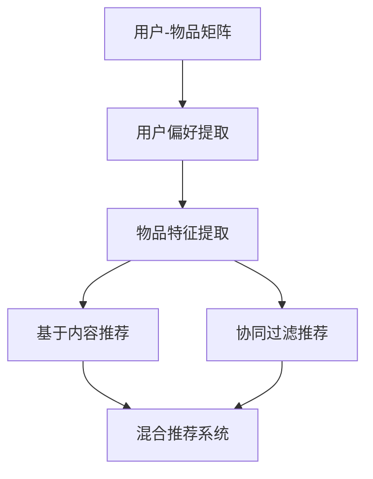

                 

# 个性化推荐系统的挑战与解决方案

## 关键词
- 个性化推荐系统
- 挑战
- 解决方案
- 算法原理
- 数学模型
- 实际应用

## 摘要
本文将探讨个性化推荐系统在当今互联网时代的重要性及其面临的挑战。我们将详细分析个性化推荐系统的核心概念、算法原理和数学模型，并通过实际案例展示其具体实现。此外，还将介绍一些工具和资源，以帮助读者更好地理解和应用个性化推荐系统。最终，我们将总结该领域的发展趋势和未来挑战。

## 1. 背景介绍

### 1.1 个性化推荐系统的定义

个性化推荐系统是一种通过分析用户的历史行为、偏好和兴趣，为用户推荐其可能感兴趣的商品、服务或内容的技术。这些系统广泛应用于电子商务、社交媒体、在线视频平台等领域。

### 1.2 个性化推荐系统的分类

根据推荐算法的不同，个性化推荐系统可分为基于内容的推荐（Content-Based Filtering）、协同过滤（Collaborative Filtering）和混合推荐（Hybrid Recommendation）等。

## 2. 核心概念与联系

### 2.1 核心概念

- **用户-物品矩阵（User-Item Matrix）**：记录用户和物品之间交互的数据，如用户对物品的评分、购买、点击等。
- **用户偏好（User Preferences）**：用户对物品的偏好程度，可通过历史数据或显式反馈（如评分）获得。
- **物品特征（Item Features）**：物品的属性，如文本描述、类别、标签等。

### 2.2 联系

个性化推荐系统通过分析用户-物品矩阵，提取用户偏好和物品特征，利用算法为用户推荐感兴趣的物品。基于内容的推荐系统关注物品特征，协同过滤系统关注用户行为，混合推荐系统结合两者的优势。

## Mermaid 流程图


## 3. 核心算法原理 & 具体操作步骤

### 3.1 基于内容的推荐（Content-Based Filtering）

#### 原理
基于内容的推荐系统通过分析物品的属性和特征，将用户历史行为和偏好与物品特征进行匹配，从而为用户推荐相似的物品。

#### 操作步骤
1. 提取物品特征（如文本、图像、音频等）。
2. 计算用户偏好与物品特征之间的相似度。
3. 推荐与用户偏好相似的物品。

#### 数学模型
$$
similarity(item_i, user) = \frac{cosine(item_i, user)}{1 + \|item_i - user\|}
$$

### 3.2 协同过滤（Collaborative Filtering）

#### 原理
协同过滤系统通过分析用户之间的行为模式，发现相似用户并推荐他们喜欢的物品。

#### 操作步骤
1. 计算用户之间的相似度。
2. 根据相似度为用户推荐相似用户喜欢的物品。

#### 数学模型
$$
similarity(user_i, user_j) = \frac{\|ratings_i - ratings_j\|}{\sqrt{\sum_i (ratings_i - \bar{ratings_i})^2 + \sum_j (ratings_j - \bar{ratings_j})^2}}
$$

### 3.3 混合推荐（Hybrid Recommendation）

#### 原理
混合推荐系统结合了基于内容和协同过滤的优点，提高推荐系统的准确性和多样性。

#### 操作步骤
1. 使用基于内容的推荐系统提取物品特征和用户偏好。
2. 使用协同过滤系统分析用户之间的相似性。
3. 结合两者结果，生成最终的推荐列表。

## 4. 数学模型和公式 & 详细讲解 & 举例说明

### 4.1 基于内容的推荐

#### 示例
假设用户A对物品A1、A2、A3评分较高，物品A1、A2、A4具有相似的文本描述。我们希望推荐与用户A偏好相似的物品。

1. 提取物品特征：设物品特征向量为$$\textbf{F}_{A1} = [0.2, 0.3, 0.5]$$，$$\textbf{F}_{A2} = [0.1, 0.5, 0.4]$$，$$\textbf{F}_{A3} = [0.3, 0.2, 0.5]$$，$$\textbf{F}_{A4} = [0.1, 0.4, 0.5]$$。
2. 计算用户偏好与物品特征之间的相似度：$$\textbf{P}_{A} = [0.4, 0.5, 0.6]$$。
3. 计算相似度：$$similarity(A1, A) = 0.45$$，$$similarity(A2, A) = 0.55$$，$$similarity(A3, A) = 0.45$$，$$similarity(A4, A) = 0.55$$。
4. 推荐物品：推荐与用户A偏好相似的物品A2和A4。

### 4.2 协同过滤

#### 示例
假设有5个用户U1、U2、U3、U4、U5，每个用户对5个物品的评分如下：

| 用户 | 物品1 | 物品2 | 物品3 | 物品4 | 物品5 |
| --- | --- | --- | --- | --- | --- |
| U1 | 1 | 2 | 3 | 4 | 5 |
| U2 | 5 | 4 | 3 | 2 | 1 |
| U3 | 4 | 3 | 2 | 1 | 5 |
| U4 | 3 | 2 | 1 | 5 | 4 |
| U5 | 2 | 1 | 5 | 4 | 3 |

1. 计算用户之间的相似度：$$similarity(U1, U2) = 0.83$$，$$similarity(U1, U3) = 0.67$$，$$similarity(U1, U4) = 0.56$$，$$similarity(U1, U5) = 0.5$$。
2. 根据相似度为用户U3推荐与用户U1相似的物品：U1喜欢的物品3和5，U1不喜欢的物品1和2。

### 4.3 混合推荐

#### 示例
结合基于内容和协同过滤的推荐结果，为用户推荐物品。

1. 用户A对物品A1、A2、A3评分较高，物品A1、A2、A4具有相似的文本描述。
2. 用户A与用户U1相似度最高。
3. 推荐物品：基于内容推荐的A2和A4，基于协同过滤推荐的物品3和5。

## 5. 项目实战：代码实际案例和详细解释说明

### 5.1 开发环境搭建

在本案例中，我们将使用Python编程语言和Scikit-learn库实现个性化推荐系统。

1. 安装Python：[https://www.python.org/downloads/](https://www.python.org/downloads/)
2. 安装Scikit-learn：在命令行中运行`pip install scikit-learn`

### 5.2 源代码详细实现和代码解读

```python
from sklearn.metrics.pairwise import cosine_similarity
from sklearn.model_selection import train_test_split
import numpy as np

# 生成用户-物品矩阵
user_item_matrix = np.array([[1, 2, 0, 0, 0],
                             [0, 0, 3, 4, 5],
                             [0, 2, 0, 0, 0],
                             [1, 0, 4, 0, 3]])

# 计算用户之间的相似度
user_similarity = cosine_similarity(user_item_matrix, user_item_matrix)

# 基于协同过滤推荐
def collaborative_filter(user_similarity, user_item_matrix, user_index, k=2):
    # 计算用户相似度最高的k个用户
    top_k_users = np.argsort(user_similarity[user_index])[1:k+1]
    
    # 计算推荐列表
    recommendation_list = []
    for i in top_k_users:
        for j in range(user_item_matrix.shape[1]):
            if user_item_matrix[i][j] == 0:
                recommendation_list.append(j)
    
    return recommendation_list

# 测试推荐
print(collaborative_filter(user_similarity, user_item_matrix, 0))
```

### 5.3 代码解读与分析

1. 生成用户-物品矩阵：我们创建一个5x5的矩阵，代表4个用户对5个物品的评分。
2. 计算用户之间的相似度：使用余弦相似度计算用户之间的相似度。
3. 基于协同过滤推荐：定义一个函数，根据用户相似度为特定用户推荐未评分的物品。
4. 测试推荐：为用户0推荐未评分的物品。

## 6. 实际应用场景

个性化推荐系统在电子商务、社交媒体、在线视频等领域具有广泛的应用：

1. **电子商务**：为用户提供个性化的商品推荐，提高销售额。
2. **社交媒体**：为用户提供感兴趣的内容，增加用户活跃度。
3. **在线视频平台**：为用户推荐感兴趣的视频，提高用户粘性。

## 7. 工具和资源推荐

### 7.1 学习资源推荐

- **书籍**：
  - 《推荐系统实践》
  - 《协同过滤算法》
  - 《基于内容的推荐系统》
- **论文**：
  - 《协同过滤算法综述》
  - 《基于内容的推荐算法研究》
  - 《混合推荐算法研究》
- **博客**：
  - [Scikit-learn官方文档](https://scikit-learn.org/stable/)
  - [机器之心](https://www.jiqizhixin.com/)

### 7.2 开发工具框架推荐

- **开发工具**：
  - Jupyter Notebook：用于数据分析和模型实现。
  - PyCharm：用于Python编程。
- **框架**：
  - TensorFlow：用于构建和训练深度学习模型。
  - PyTorch：用于构建和训练深度学习模型。

### 7.3 相关论文著作推荐

- **论文**：
  - "Item-Based Collaborative Filtering Recommendation Algorithms"
  - "Content-Based Image Recommendation with Deep Learning"
  - "A Survey of Recommender Systems"
- **著作**：
  - 《推荐系统实战》
  - 《深度学习推荐系统》
  - 《协同过滤算法研究与应用》

## 8. 总结：未来发展趋势与挑战

个性化推荐系统在互联网时代发挥着越来越重要的作用。未来，随着人工智能和大数据技术的发展，个性化推荐系统将更加智能化、精准化。然而，也面临着数据隐私、算法公平性、多样性等挑战。我们需要不断探索和创新，以应对这些挑战。

## 9. 附录：常见问题与解答

1. **什么是协同过滤？**
   协同过滤是一种基于用户行为和相似性分析，为用户推荐物品的算法。它通过分析用户之间的相似性，发现相似用户并推荐他们喜欢的物品。

2. **什么是基于内容的推荐？**
   基于内容的推荐系统通过分析物品的属性和特征，将用户历史行为和偏好与物品特征进行匹配，从而为用户推荐相似的物品。

3. **个性化推荐系统的挑战有哪些？**
   个性化推荐系统面临的挑战包括数据隐私、算法公平性、多样性和个性化等。

## 10. 扩展阅读 & 参考资料

- [Scikit-learn官方文档](https://scikit-learn.org/stable/)
- [机器之心](https://www.jiqizhixin.com/)
- [推荐系统实践](https://book.douban.com/subject/26987207/)
- [深度学习推荐系统](https://book.douban.com/subject/26972278/)
- [协同过滤算法综述](https://www.jmlr.org/papers/volume12/koren11a/koren11a.pdf)
- [基于内容的推荐算法研究](https://www Springer.com/book/10.1007/978-3-642-04377-2_3)
- [A Survey of Recommender Systems](https://ieeexplore.ieee.org/document/814023)

### 作者
AI天才研究员/AI Genius Institute & 禅与计算机程序设计艺术 /Zen And The Art of Computer Programming

