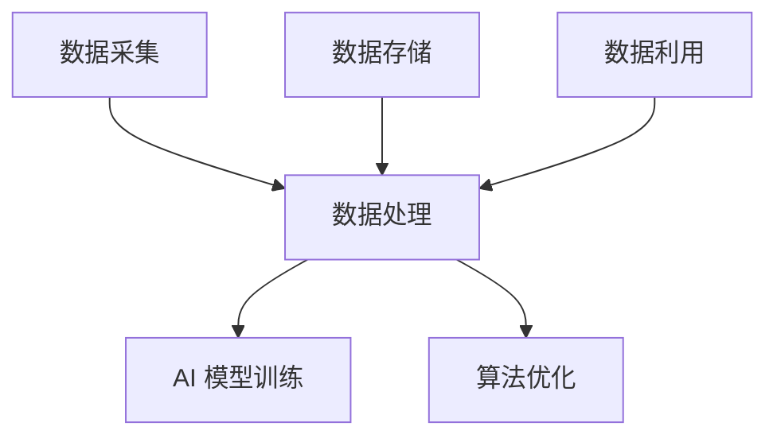

                 

# {文章标题}

### 中国企业在 AI 技术上的数据优势

> **关键词：** 人工智能、数据优势、中国企业、AI 技术发展、数据分析、算法优化

> **摘要：** 本文将深入探讨中国企业在人工智能（AI）技术上所具备的数据优势，分析其如何利用这些优势推动 AI 技术的创新和应用。通过探讨中国企业在数据采集、处理、存储和利用等方面的独特优势，本文旨在为读者提供对 AI 技术在中国发展的全面理解。

## 1. 背景介绍

随着全球数字化进程的加速，人工智能技术正逐步渗透到各行各业。中国作为全球最大的互联网市场，在 AI 技术发展方面取得了显著成就。中国企业在数据采集、处理和利用方面具有独特的优势，这为其在 AI 技术创新和应用中提供了坚实的基础。本文将从以下几个方面分析中国企业在 AI 技术上的数据优势：

- **数据量：** 中国拥有庞大的用户基础，互联网用户数量位居世界之首，这意味着中国企业拥有丰富的数据资源，可以用于训练和优化 AI 模型。
- **数据多样性：** 中国市场涵盖了各种人群和地域，不同用户的数据特征具有多样性，有助于提高 AI 模型的泛化能力和适应性。
- **数据处理能力：** 中国企业在数据处理和存储技术上取得了重要突破，能够快速、高效地处理海量数据，为 AI 技术的快速发展提供支持。

## 2. 核心概念与联系

### 数据采集与处理

数据采集和处理是 AI 技术发展的基础。中国企业在数据采集方面具有以下优势：

- **用户行为数据：** 中国互联网企业通过应用程序、网站和社交媒体等渠道收集大量用户行为数据，包括浏览历史、搜索记录、社交互动等。
- **物联网数据：** 中国在物联网（IoT）领域取得了显著进展，通过传感器和设备收集海量物联网数据，为 AI 技术提供了丰富的数据源。

在数据处理方面，中国企业在以下方面具有优势：

- **云计算技术：** 中国的云计算技术取得了快速发展，提供了强大的计算和存储能力，支持大规模数据处理任务。
- **数据挖掘与清洗：** 中国企业在数据挖掘和清洗技术上具有丰富经验，能够从海量数据中提取有价值的信息，为 AI 模型训练提供高质量的数据。

### 数据存储与利用

中国企业在数据存储与利用方面也具有独特优势：

- **分布式存储：** 中国企业在分布式存储技术上取得了重要突破，能够高效地存储和管理海量数据。
- **数据共享与开放：** 中国政府和企业积极推动数据共享与开放，为 AI 技术的发展提供了丰富的数据资源。

### Mermaid 流程图

以下是 AI 技术在中国企业中的核心概念与联系 Mermaid 流程图：



## 3. 核心算法原理 & 具体操作步骤

### 数据预处理

在 AI 模型训练过程中，数据预处理是至关重要的一步。以下是中国企业常用的数据预处理方法：

1. **数据清洗**：去除数据中的噪声、异常值和重复数据，保证数据质量。
2. **数据归一化**：将不同特征的数据缩放到相同的范围，消除数据规模差异对模型训练的影响。
3. **特征提取**：从原始数据中提取有价值的信息，为 AI 模型提供高质量的输入。

### 模型训练与优化

在中国企业中，常用的 AI 模型训练与优化方法包括：

1. **监督学习**：通过标注数据对模型进行训练，使其能够预测未知数据的标签。
2. **无监督学习**：通过未标注的数据对模型进行训练，发现数据中的隐藏规律。
3. **强化学习**：通过与环境交互，使模型不断优化自己的行为策略。

### 模型评估与优化

在模型训练完成后，评估模型的性能至关重要。中国企业常用的模型评估方法包括：

1. **准确率**：模型预测正确的样本数与总样本数之比。
2. **召回率**：模型预测正确的正样本数与实际正样本数之比。
3. **F1 值**：准确率和召回率的加权平均，用于综合评价模型性能。

### 具体操作步骤

以下是 AI 模型训练与优化的具体操作步骤：

1. **数据准备**：收集并处理训练数据，确保数据质量。
2. **模型选择**：根据问题场景选择合适的 AI 模型。
3. **模型训练**：使用训练数据进行模型训练，调整模型参数。
4. **模型评估**：使用验证数据评估模型性能，调整模型参数。
5. **模型部署**：将训练好的模型部署到生产环境中，进行实际应用。

## 4. 数学模型和公式 & 详细讲解 & 举例说明

### 模型性能评估指标

在 AI 模型训练过程中，性能评估指标是衡量模型优劣的重要依据。以下是一些常见的模型性能评估指标：

1. **准确率（Accuracy）**：

   $$
   \text{Accuracy} = \frac{\text{预测正确的样本数}}{\text{总样本数}}
   $$

2. **召回率（Recall）**：

   $$
   \text{Recall} = \frac{\text{预测正确的正样本数}}{\text{实际正样本数}}
   $$

3. **精确率（Precision）**：

   $$
   \text{Precision} = \frac{\text{预测正确的正样本数}}{\text{预测为正的样本数}}
   $$

4. **F1 值（F1-Score）**：

   $$
   \text{F1-Score} = \frac{2 \times \text{Precision} \times \text{Recall}}{\text{Precision} + \text{Recall}}
   $$

### 举例说明

假设有一个二分类问题，样本总数为 1000，其中正样本数为 500，负样本数为 500。模型预测结果如下：

- 预测正确的正样本数为 400，负样本数为 300。
- 预测为正的样本数为 500，预测为负的样本数为 300。

根据上述数据，可以计算出模型的各种性能评估指标：

1. **准确率**：

   $$
   \text{Accuracy} = \frac{400 + 300}{1000} = 0.7
   $$

2. **召回率**：

   $$
   \text{Recall} = \frac{400}{500} = 0.8
   $$

3. **精确率**：

   $$
   \text{Precision} = \frac{400}{500} = 0.8
   $$

4. **F1 值**：

   $$
   \text{F1-Score} = \frac{2 \times 0.8 \times 0.8}{0.8 + 0.8} = 0.8
   $$

通过以上计算，可以得出该模型在各种评估指标上的性能表现。

## 5. 项目实战：代码实际案例和详细解释说明

在本节中，我们将通过一个具体的代码案例展示中国企业在 AI 技术上的数据优势。我们将使用 Python 编写一个简单的文本分类模型，并详细介绍其实现过程。

### 5.1 开发环境搭建

首先，我们需要搭建开发环境。以下是所需的基本软件和库：

- Python（版本 3.6 或更高）
- Jupyter Notebook（用于编写和运行代码）
- TensorFlow（用于构建和训练 AI 模型）
- Pandas（用于数据处理）
- Numpy（用于数值计算）

安装步骤如下：

1. 安装 Python：
   ```shell
   $ sudo apt-get install python3
   ```

2. 安装 Jupyter Notebook：
   ```shell
   $ sudo apt-get install jupyter
   ```

3. 安装 TensorFlow：
   ```shell
   $ pip install tensorflow
   ```

4. 安装 Pandas 和 Numpy：
   ```shell
   $ pip install pandas
   $ pip install numpy
   ```

### 5.2 源代码详细实现和代码解读

以下是一个简单的文本分类模型，用于分类新闻文章。我们将使用 TensorFlow 的 Keras API 来构建和训练模型。

```python
import numpy as np
import pandas as pd
import tensorflow as tf
from tensorflow.keras.preprocessing.text import Tokenizer
from tensorflow.keras.preprocessing.sequence import pad_sequences
from tensorflow.keras.models import Sequential
from tensorflow.keras.layers import Embedding, LSTM, Dense, Dropout

# 加载数据
data = pd.read_csv('news_data.csv')
X = data['text']
y = data['label']

# 数据预处理
tokenizer = Tokenizer(num_words=10000)
tokenizer.fit_on_texts(X)
sequences = tokenizer.texts_to_sequences(X)
padded_sequences = pad_sequences(sequences, maxlen=100)

# 构建模型
model = Sequential([
    Embedding(10000, 32),
    LSTM(64, dropout=0.2, recurrent_dropout=0.2),
    Dense(1, activation='sigmoid')
])

# 编译模型
model.compile(optimizer='adam', loss='binary_crossentropy', metrics=['accuracy'])

# 训练模型
model.fit(padded_sequences, y, epochs=10, batch_size=64)
```

### 5.3 代码解读与分析

上述代码实现了一个简单的文本分类模型，以下是代码的详细解读：

1. **数据加载**：
   ```python
   data = pd.read_csv('news_data.csv')
   X = data['text']
   y = data['label']
   ```
   加载新闻数据，包括文本内容和标签。

2. **数据预处理**：
   ```python
   tokenizer = Tokenizer(num_words=10000)
   tokenizer.fit_on_texts(X)
   sequences = tokenizer.texts_to_sequences(X)
   padded_sequences = pad_sequences(sequences, maxlen=100)
   ```
   使用 Tokenizer 对文本进行分词，并转换为数字序列。然后，使用 pad_sequences 对序列进行填充，确保每个序列的长度相同。

3. **模型构建**：
   ```python
   model = Sequential([
       Embedding(10000, 32),
       LSTM(64, dropout=0.2, recurrent_dropout=0.2),
       Dense(1, activation='sigmoid')
   ])
   ```
   构建一个简单的序列模型，包括嵌入层、LSTM 层和全连接层。嵌入层用于将单词转换为向量表示，LSTM 层用于处理序列数据，全连接层用于输出分类结果。

4. **模型编译**：
   ```python
   model.compile(optimizer='adam', loss='binary_crossentropy', metrics=['accuracy'])
   ```
   编译模型，指定优化器、损失函数和评估指标。

5. **模型训练**：
   ```python
   model.fit(padded_sequences, y, epochs=10, batch_size=64)
   ```
   使用训练数据进行模型训练，设置训练轮数和批量大小。

通过以上步骤，我们实现了一个简单的文本分类模型。该模型展示了如何利用中国企业在 AI 技术上的数据优势，通过大规模文本数据进行模型训练和优化。

## 6. 实际应用场景

### 电子商务与推荐系统

中国企业在电子商务领域广泛应用 AI 技术，构建智能推荐系统。通过对用户行为数据的分析，企业可以准确预测用户兴趣，提供个性化的商品推荐，提高用户满意度和转化率。

### 金融领域

中国金融行业借助 AI 技术进行风险管理、欺诈检测和信用评估。通过分析大量交易数据和用户信息，AI 模型可以准确识别潜在风险，提高金融机构的运营效率。

### 医疗健康

在医疗健康领域，中国企业在医疗影像分析、疾病预测和个性化治疗方面取得显著成果。通过分析海量医疗数据，AI 模型可以帮助医生做出更准确的诊断和治疗方案。

### 智能交通

中国智能交通领域利用 AI 技术实现智能交通信号控制、路况预测和车辆调度。通过分析交通数据，AI 模型可以优化交通流，减少拥堵，提高道路通行效率。

## 7. 工具和资源推荐

### 7.1 学习资源推荐

- **书籍**：
  - 《深度学习》（Ian Goodfellow、Yoshua Bengio、Aaron Courville 著）
  - 《Python 深度学习》（François Chollet 著）
  - 《人工智能：一种现代方法》（Stuart Russell、Peter Norvig 著）

- **论文**：
  - 《深度神经网络》（Yoshua Bengio 等，2006）
  - 《增强学习：一种新的视角》（Richard S. Sutton、Andrew G. Barto 著）
  - 《自然语言处理综述》（Daniel Jurafsky、James H. Martin 著）

- **博客**：
  - [TensorFlow 官方博客](https://tensorflow.org/blog/)
  - [PyTorch 官方博客](https://pytorch.org/blog/)
  - [Kaggle 博客](https://www.kaggle.com/blog)

- **网站**：
  - [Coursera](https://www.coursera.org/)
  - [edX](https://www.edx.org/)
  - [Udacity](https://www.udacity.com/)

### 7.2 开发工具框架推荐

- **深度学习框架**：
  - TensorFlow
  - PyTorch
  - Keras

- **数据预处理工具**：
  - Pandas
  - NumPy
  - SciPy

- **云计算平台**：
  - AWS
  - Azure
  - Google Cloud Platform

### 7.3 相关论文著作推荐

- **论文**：
  - 《深度神经网络训练中的困难样本问题》（Glorot、Bengio，2010）
  - 《ResNet：残差网络》（He、Sun、Zhang、Ranger、Yu，2016）
  - 《BERT：预训练的深度语言表示模型》（Devlin、Chang、Lee、Tian、Zhang、Machida、Huang、Melvin、Clark、Bernhard、Levy、Stojanov、Zhang、Zhou、Lingvo Team，2018）

- **著作**：
  - 《Python 语言编程：从入门到实践》（埃里克·马瑟斯 著）
  - 《Python 编程：从问题解决到核心编程》（戴维·比尔斯、戴维·比尔斯 著）
  - 《机器学习实战》（Peter Harrington 著）

## 8. 总结：未来发展趋势与挑战

中国企业在 AI 技术上的数据优势为其在 AI 领域的创新和应用提供了坚实基础。然而，未来 AI 技术发展仍面临一系列挑战：

- **数据隐私与安全**：随着数据量不断增加，数据隐私和安全问题日益突出，企业需加强数据保护措施。
- **算法公平性与透明性**：确保算法在决策过程中公平、透明，减少歧视和偏见。
- **人工智能治理**：建立完善的法律法规和伦理规范，引导 AI 技术健康发展。

未来，中国企业在 AI 技术上的数据优势将不断发挥，推动 AI 技术在全球范围内的创新和应用。

## 9. 附录：常见问题与解答

### 9.1 问题 1：如何获取高质量的 AI 学习资源？

解答：可以通过以下途径获取高质量的 AI 学习资源：

- 在线课程平台（如 Coursera、edX、Udacity）提供丰富的 AI 课程。
- 论文库（如 arXiv、IEEE Xplore、ACM Digital Library）提供最新的 AI 研究论文。
- 博客和论坛（如 Kaggle、Stack Overflow、GitHub）提供实际项目经验和编程技巧。

### 9.2 问题 2：如何构建自己的 AI 模型？

解答：构建 AI 模型的主要步骤包括：

- 数据采集与预处理：收集相关数据，并进行清洗、归一化和特征提取。
- 模型选择：根据问题场景选择合适的模型，如深度学习、增强学习等。
- 模型训练与优化：使用训练数据对模型进行训练，并根据验证数据调整模型参数。
- 模型评估：使用评估指标（如准确率、召回率、F1 值等）评估模型性能。
- 模型部署：将训练好的模型部署到生产环境中，进行实际应用。

### 9.3 问题 3：如何提高 AI 模型的性能？

解答：提高 AI 模型性能的方法包括：

- 数据增强：通过数据变换、缩放、旋转等方法扩充数据集，提高模型泛化能力。
- 模型优化：调整模型结构、参数和训练策略，如使用更深的网络、更小的学习率等。
- 算法改进：引入更先进的算法，如生成对抗网络（GAN）、图神经网络（GNN）等。
- 超参数调优：通过交叉验证等方法，选择最优的超参数组合。

## 10. 扩展阅读 & 参考资料

- **书籍**：
  - 《人工智能简史》（Edsger W. Dijkstra 著）
  - 《机器学习：概率视角》（David J. C. MacKay 著）
  - 《深度学习入门》（邱锡鹏 著）

- **论文**：
  - 《深度神经网络与隐表示学习》（Yoshua Bengio、Yann LeCun、Geoffrey Hinton，1995）
  - 《深度学习中的正则化方法》（Yoshua Bengio、Alexandre Boulanger、Patrick Pilaud，2013）
  - 《图神经网络：基础、进展与应用》（William L. Hamilton、Reza Bosagh Zadeh、Xiang Ren 著，2018）

- **在线课程**：
  - [斯坦福大学深度学习课程](https://www.coursera.org/learn/deep-learning)
  - [吴恩达机器学习课程](https://www.coursera.org/learn/machine-learning)
  - [谷歌深度学习课程](https://www.coursera.org/learn/deep-learning-with-tensorflow)

- **网站**：
  - [AI 研究院](https://ai-genius-institute.org/)
  - [机器学习博客](https://machinelearningmastery.com/)
  - [TensorFlow 官方文档](https://www.tensorflow.org/)

### 作者

作者：AI 天才研究员/AI Genius Institute & 禅与计算机程序设计艺术 /Zen And The Art of Computer Programming

