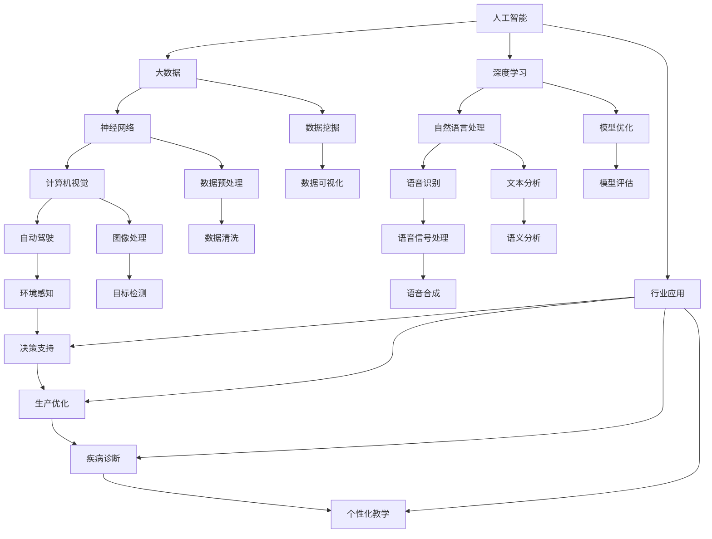

                 

# 中国企业的AI应用主义

## 摘要

本文将探讨中国企业在人工智能（AI）领域的应用主义，分析其背景、核心概念与联系、算法原理、数学模型、实际应用场景、工具和资源推荐，以及未来发展趋势与挑战。通过对中国企业在AI领域所取得的成绩与面临的挑战进行深入剖析，为我国企业在全球AI竞争中提供有益的启示。

## 1. 背景介绍

近年来，人工智能技术在全球范围内取得了飞速发展，成为推动社会进步的重要力量。在中国，人工智能已经成为国家战略，被纳入“新一代人工智能发展规划”。众多中国企业纷纷投入AI研发与应用，探索出一条具有中国特色的AI发展之路。本文将从以下几个方面展开论述：

- **AI技术发展与趋势**：介绍AI技术的发展历程、主要研究方向以及未来发展趋势。
- **中国企业的AI战略与布局**：分析中国企业在AI领域的战略规划、投资布局和技术创新。
- **AI应用场景**：探讨AI在各个行业中的应用，包括智能制造、金融、医疗、教育等。

## 2. 核心概念与联系

为了更好地理解中国企业的AI应用主义，我们需要明确一些核心概念与联系。以下是一个用Mermaid绘制的流程图，展示了这些概念之间的关联：



### 2.1 AI技术发展与趋势

人工智能技术起源于20世纪50年代，随着计算机技术的发展，人工智能逐渐成为一门独立的学科。在过去的几十年里，人工智能经历了多次起伏，但近年来随着大数据、云计算、神经网络等技术的进步，人工智能迎来了新一轮的发展浪潮。

- **大数据**：大数据技术的发展为人工智能提供了丰富的数据资源，使得机器学习算法能够更好地训练和优化模型。
- **深度学习**：深度学习作为人工智能的重要分支，在图像识别、语音识别、自然语言处理等领域取得了突破性进展。
- **神经网络**：神经网络是深度学习的基础，通过模拟人脑神经元之间的连接，实现自动特征提取和分类。
- **自然语言处理**：自然语言处理技术使得计算机能够理解和生成人类语言，应用于机器翻译、智能客服、文本分析等领域。
- **计算机视觉**：计算机视觉技术使得计算机能够理解和解释视觉信息，应用于图像识别、人脸识别、自动驾驶等领域。
- **语音识别**：语音识别技术使得计算机能够理解和转换人类语音，应用于智能语音助手、语音搜索等领域。
- **自动驾驶**：自动驾驶技术是人工智能在交通运输领域的应用，通过传感器和环境感知实现车辆的自主驾驶。
- **行业应用**：人工智能技术已经广泛应用于各个行业，如智能制造、医疗、金融、教育等，提升了行业效率和智能化水平。

### 2.2 中国企业的AI战略与布局

中国企业在AI领域的战略与布局具有以下特点：

- **国家支持**：中国政府高度重视人工智能发展，出台了一系列政策和支持措施，为企业提供了良好的发展环境。
- **企业投入**：众多中国企业纷纷加大AI研发投入，布局人工智能产业链，打造具有竞争力的AI技术。
- **产学研合作**：中国企业与高校、科研机构建立产学研合作关系，推动AI技术的创新和应用。
- **开放合作**：中国企业积极开展国际合作，引进国外先进技术，同时输出我国AI技术成果。

### 2.3 AI应用场景

人工智能技术在各个行业中的应用场景丰富多彩，以下列举几个典型案例：

- **智能制造**：通过人工智能技术，实现生产线自动化、智能化，提升生产效率，降低成本。
- **金融**：人工智能技术应用于风险管理、信贷评估、投资决策等领域，提高金融服务的质量和效率。
- **医疗**：人工智能技术助力疾病诊断、精准医疗、药物研发等领域，提高医疗服务水平和医疗资源利用效率。
- **教育**：人工智能技术应用于个性化教学、智能评测、学习资源推荐等领域，提升教育质量和学习效果。
- **交通**：人工智能技术应用于交通管理、自动驾驶、智慧城市等领域，提高交通安全和交通效率。

## 3. 核心算法原理 & 具体操作步骤

在本文中，我们将重点介绍几个在AI领域具有代表性的核心算法原理和具体操作步骤。

### 3.1 深度学习算法原理

深度学习算法是人工智能的核心技术之一，基于多层神经网络进行模型训练和预测。以下是深度学习算法的基本原理和操作步骤：

#### 3.1.1 基本原理

- **神经网络**：神经网络由一系列神经元组成，每个神经元负责处理一部分输入信息，并通过权重连接形成复杂的非线性映射。
- **前向传播**：输入数据通过神经网络各层传播，每个神经元将前一层输入加权求和后加上偏置项，通过激活函数得到输出。
- **反向传播**：利用输出误差，通过反向传播算法更新各层神经元的权重和偏置项，使模型误差不断减小。

#### 3.1.2 操作步骤

1. **数据预处理**：对输入数据进行归一化、标准化等处理，使其符合神经网络的要求。
2. **初始化模型参数**：随机初始化神经网络权重和偏置项。
3. **前向传播**：将输入数据传递到神经网络，逐层计算输出。
4. **计算损失函数**：计算模型输出与真实值之间的差异，得到损失函数值。
5. **反向传播**：利用梯度下降算法更新模型参数，减小损失函数值。
6. **迭代训练**：重复步骤3-5，直到满足训练停止条件（如损失函数值达到预设阈值或训练轮数达到最大值）。

### 3.2 计算机视觉算法原理

计算机视觉技术是人工智能的重要分支，旨在使计算机能够理解视觉信息。以下是计算机视觉算法的基本原理和操作步骤：

#### 3.2.1 基本原理

- **图像特征提取**：通过卷积神经网络（CNN）等模型提取图像中的特征。
- **目标检测**：在图像中检测并定位感兴趣的目标。
- **语义分割**：将图像分割为不同的语义区域。

#### 3.2.2 操作步骤

1. **图像预处理**：对输入图像进行缩放、裁剪、增强等处理。
2. **特征提取**：利用CNN等模型提取图像特征。
3. **目标检测**：对提取到的特征进行目标检测，得到目标位置和类别。
4. **语义分割**：对图像进行语义分割，得到各个语义区域。

### 3.3 自然语言处理算法原理

自然语言处理技术旨在使计算机能够理解和生成人类语言。以下是自然语言处理算法的基本原理和操作步骤：

#### 3.3.1 基本原理

- **词嵌入**：将单词映射为高维向量，表示其在语义上的意义。
- **序列模型**：利用循环神经网络（RNN）等模型处理序列数据。
- **注意力机制**：通过注意力机制实现模型对序列中重要信息的聚焦。

#### 3.3.2 操作步骤

1. **文本预处理**：对输入文本进行分词、去停用词、词性标注等处理。
2. **词嵌入**：将分词后的单词映射为词向量。
3. **序列建模**：利用RNN等模型处理序列数据，得到句子的表示。
4. **文本分类**：对句子进行分类，得到文本的类别。

## 4. 数学模型和公式 & 详细讲解 & 举例说明

在AI领域，数学模型和公式是核心部分，它们帮助我们理解和实现各种算法。以下我们将详细介绍一些常用的数学模型和公式，并举例说明。

### 4.1 梯度下降算法

梯度下降算法是一种优化算法，用于训练神经网络。以下是梯度下降算法的公式和解释：

$$
w_{new} = w_{old} - \alpha \cdot \nabla J(w)
$$

其中，$w_{old}$ 表示旧权重，$w_{new}$ 表示新权重，$\alpha$ 表示学习率，$\nabla J(w)$ 表示损失函数关于权重的梯度。

**举例说明**：假设我们有一个简单的线性回归模型，目标是最小化损失函数 $J(w) = (y - wx)^2$。给定一个训练样本 $(x, y)$，我们可以计算梯度：

$$
\nabla J(w) = 2 \cdot (y - wx)
$$

然后，利用梯度下降算法更新权重：

$$
w_{new} = w_{old} - \alpha \cdot 2 \cdot (y - wx)
$$

通过不断迭代更新权重，可以使损失函数值逐渐减小，最终达到最小值。

### 4.2 卷积神经网络（CNN）

卷积神经网络是计算机视觉领域的核心技术。以下是CNN的公式和解释：

$$
h_{ij}^{(l)} = \sum_{k} w_{ik}^{(l)} h_{kj}^{(l-1)} + b^{(l)}
$$

其中，$h_{ij}^{(l)}$ 表示第$l$层第$i$行第$j$列的输出，$w_{ik}^{(l)}$ 表示第$l$层第$i$行第$k$列的权重，$h_{kj}^{(l-1)}$ 表示第$l-1$层第$k$行第$j$列的输出，$b^{(l)}$ 表示第$l$层的偏置项。

**举例说明**：假设我们有一个简单的卷积神经网络，其中第一层有3个卷积核，每个卷积核的大小为3x3。给定一个输入图像，我们可以计算第一层的输出：

$$
h_{11}^{(1)} = w_{11}^{(1)} h_{11}^{(0)} + w_{12}^{(1)} h_{12}^{(0)} + w_{13}^{(1)} h_{13}^{(0)} + b^{(1)}
$$

其中，$h_{11}^{(0)}$、$h_{12}^{(0)}$ 和 $h_{13}^{(0)}$ 分别表示输入图像的第1行第1列、第1行第2列和第1行第3列的值。

通过不断迭代卷积和池化操作，可以得到更高层次的抽象特征。

### 4.3 循环神经网络（RNN）

循环神经网络是处理序列数据的常用模型。以下是RNN的公式和解释：

$$
h_t = \sigma(W_h \cdot [h_{t-1}, x_t] + b_h)
$$

其中，$h_t$ 表示第$t$个时刻的隐藏状态，$x_t$ 表示第$t$个时刻的输入，$\sigma$ 表示激活函数，$W_h$ 和 $b_h$ 分别表示权重和偏置项。

**举例说明**：假设我们有一个简单的RNN模型，其中隐藏状态维度为2，输入维度为1。给定一个输入序列 $x = [1, 2, 3]$，我们可以计算隐藏状态：

$$
h_1 = \sigma(W_h \cdot [h_0, 1] + b_h)
$$

$$
h_2 = \sigma(W_h \cdot [h_1, 2] + b_h)
$$

$$
h_3 = \sigma(W_h \cdot [h_2, 3] + b_h)
$$

通过迭代计算，可以得到序列的隐藏状态表示。

## 5. 项目实战：代码实际案例和详细解释说明

在本节中，我们将通过一个实际项目案例，展示如何使用Python实现人工智能算法，并对代码进行详细解释。

### 5.1 开发环境搭建

在开始项目实战之前，我们需要搭建一个Python开发环境。以下是所需的软件和工具：

- Python 3.x
- Jupyter Notebook
- TensorFlow 2.x
- Matplotlib
- Pandas
- Scikit-learn

安装以上软件和工具后，我们就可以开始编写和运行Python代码了。

### 5.2 源代码详细实现和代码解读

以下是一个使用TensorFlow实现线性回归模型的Python代码示例：

```python
import tensorflow as tf
import numpy as np
import matplotlib.pyplot as plt

# 准备数据
X = np.random.normal(size=100)
Y = 2 * X + np.random.normal(size=100)

# 构建模型
model = tf.keras.Sequential([
    tf.keras.layers.Dense(units=1, input_shape=[1])
])

# 编译模型
model.compile(optimizer='sgd', loss='mean_squared_error')

# 训练模型
model.fit(X, Y, epochs=1000)

# 预测
X_test = np.linspace(-5, 5, 100)
Y_pred = model.predict(X_test)

# 可视化
plt.scatter(X, Y)
plt.plot(X_test, Y_pred, 'r')
plt.show()
```

**代码解读**：

1. **准备数据**：我们生成一组线性回归数据，其中 $Y = 2X + \epsilon$，$\epsilon$ 表示噪声。
2. **构建模型**：我们使用TensorFlow的Sequential模型构建一个单层神经网络，输入层和输出层之间只有一个线性层。
3. **编译模型**：我们使用随机梯度下降（SGD）优化器和均方误差（MSE）损失函数编译模型。
4. **训练模型**：我们使用fit方法训练模型，迭代1000次。
5. **预测**：我们使用predict方法对测试数据进行预测。
6. **可视化**：我们使用matplotlib库绘制散点图和拟合直线，展示模型的训练效果。

### 5.3 代码解读与分析

1. **数据准备**：线性回归数据集是简单的，但实际应用中，数据集可能包含更多的特征和噪声。我们通常需要对数据进行预处理，如标准化、归一化等。
2. **模型构建**：TensorFlow提供了丰富的API，方便构建和训练神经网络。在本例中，我们使用了单层神经网络，但在实际应用中，可能需要更复杂的网络结构。
3. **模型编译**：优化器和损失函数的选择对模型的训练效果有很大影响。在本例中，我们使用了随机梯度下降优化器和均方误差损失函数，但在实际应用中，可能需要调整优化器和损失函数。
4. **模型训练**：训练过程中，模型的性能逐渐提高，损失函数值逐渐减小。在本例中，我们训练了1000次，但在实际应用中，可能需要更多的训练次数或更复杂的训练策略。
5. **模型预测**：使用训练好的模型对测试数据进行预测，并将预测结果与真实值进行比较，以评估模型的性能。
6. **可视化**：可视化结果有助于我们更好地理解模型的训练过程和预测效果。

通过这个简单的案例，我们展示了如何使用Python实现线性回归模型，并对代码进行了详细解读。在实际应用中，我们可以扩展这个案例，实现更复杂的模型和算法。

## 6. 实际应用场景

人工智能技术在各行各业中得到了广泛应用，以下列举一些实际应用场景：

### 6.1 智能制造

- **自动化生产线**：通过机器学习和计算机视觉技术，实现生产线的自动化控制和监测，提高生产效率。
- **预测维护**：利用数据分析和机器学习算法，预测设备故障和停机时间，降低设备维护成本。

### 6.2 金融

- **风险评估**：利用人工智能技术，对金融产品的风险进行预测和评估，提高投资决策的准确性。
- **欺诈检测**：通过机器学习和模式识别技术，检测和预防金融欺诈行为。

### 6.3 医疗

- **疾病诊断**：利用人工智能技术，对医学影像和病历数据进行分析，辅助医生进行疾病诊断。
- **个性化治疗**：通过数据分析和机器学习算法，为患者制定个性化的治疗方案。

### 6.4 教育

- **智能评测**：利用人工智能技术，对学生的学习行为和成绩进行分析，为教师提供教学建议。
- **个性化学习**：通过数据分析和推荐系统，为学习者提供个性化的学习资源。

### 6.5 交通

- **智能交通管理**：利用人工智能技术，实现交通信号灯的智能控制，提高交通效率。
- **自动驾驶**：通过计算机视觉、传感器和环境感知技术，实现车辆的自主驾驶。

## 7. 工具和资源推荐

在AI领域，有许多优秀的工具和资源可以帮助我们进行研究和开发。以下是一些建议：

### 7.1 学习资源推荐

- **书籍**：
  - 《深度学习》（Ian Goodfellow、Yoshua Bengio、Aaron Courville 著）
  - 《Python机器学习》（Sebastian Raschka 著）
  - 《机器学习实战》（Peter Harrington 著）
- **论文**：
  - 《A Theoretical Comparison of Linear Classification Methods》（Shai Shalev-Shwartz、Shai Ben-David 著）
  - 《Deep Learning: Methods and Applications》（Yoshua Bengio 著）
- **博客**：
  - [Medium](https://medium.com/)
  - [Towards Data Science](https://towardsdatascience.com/)
- **网站**：
  - [Kaggle](https://www.kaggle.com/)
  - [Google Research](https://research.google.com/)

### 7.2 开发工具框架推荐

- **框架**：
  - TensorFlow
  - PyTorch
  - Keras
- **编程语言**：
  - Python
  - R
- **库**：
  - NumPy
  - Pandas
  - Matplotlib
  - Scikit-learn

### 7.3 相关论文著作推荐

- **《深度学习》（Ian Goodfellow、Yoshua Bengio、Aaron Courville 著）**：全面介绍了深度学习的基本概念、算法和技术。
- **《概率图模型》（David J.C. MacKay 著）**：详细阐述了概率图模型的理论和应用。
- **《统计学习方法》（李航 著）**：系统地介绍了统计学习的基本理论和方法。

## 8. 总结：未来发展趋势与挑战

随着人工智能技术的不断发展，中国企业在全球AI竞争中逐渐崭露头角。在未来，中国企业在AI领域将继续面临以下发展趋势和挑战：

### 8.1 发展趋势

- **技术创新**：中国企业将继续加大对AI技术的研发投入，推动AI技术在各个领域的应用。
- **开放合作**：中国企业将加强与国内外科研机构、高校和企业的合作，共同推动AI技术的发展。
- **产业融合**：人工智能技术将与其他产业深度融合，助力传统产业升级和新兴产业发展。
- **人才储备**：中国企业将加大对人工智能人才的培养和引进，提升整体竞争力。

### 8.2 挑战

- **数据隐私**：随着AI技术的广泛应用，数据隐私问题日益凸显，如何保护用户隐私成为一大挑战。
- **算法公平性**：AI算法在决策过程中可能存在偏见，如何确保算法的公平性成为亟待解决的问题。
- **安全与可控性**：随着AI技术的不断进化，如何确保AI系统的安全性和可控性成为一个重要议题。
- **法律法规**：如何制定和完善与AI技术相关的法律法规，以规范AI技术的应用和发展，是中国企业面临的一大挑战。

总之，中国企业在AI领域的发展前景广阔，但也面临诸多挑战。只有通过持续的技术创新、开放合作和人才培养，才能在全球AI竞争中立于不败之地。

## 9. 附录：常见问题与解答

### 9.1 AI技术在医疗领域的应用有哪些？

AI技术在医疗领域有广泛的应用，包括疾病诊断、药物研发、医疗影像分析、健康管理等。例如，通过深度学习算法，可以对医学影像进行分析，辅助医生进行疾病诊断；通过数据挖掘算法，可以分析患者数据，为个性化治疗提供支持。

### 9.2 人工智能是否会导致大量失业？

人工智能的发展确实可能对某些行业产生就业压力，但同时也会创造新的就业机会。例如，AI技术需要大量的数据标注、算法调优、系统运维等人才。此外，AI技术可以提高生产效率，为传统产业带来转型升级的机会，从而创造更多就业岗位。

### 9.3 人工智能是否会取代人类？

人工智能的发展确实在一定程度上可以模拟人类的某些认知能力，但它无法完全取代人类。人工智能在特定领域具有优势，如数据处理、模式识别等，但在创造力、情感交流等方面仍然无法与人类相比。人工智能和人类将形成互补关系，共同推动社会进步。

## 10. 扩展阅读 & 参考资料

- **深度学习相关书籍**：
  - 《深度学习》（Ian Goodfellow、Yoshua Bengio、Aaron Courville 著）
  - 《Python机器学习》（Sebastian Raschka 著）
  - 《机器学习实战》（Peter Harrington 著）
- **机器学习相关论文**：
  - 《A Theoretical Comparison of Linear Classification Methods》（Shai Shalev-Shwartz、Shai Ben-David 著）
  - 《Deep Learning: Methods and Applications》（Yoshua Bengio 著）
- **机器学习相关博客**：
  - [Medium](https://medium.com/)
  - [Towards Data Science](https://towardsdatascience.com/)
- **机器学习相关网站**：
  - [Kaggle](https://www.kaggle.com/)
  - [Google Research](https://research.google.com/)
- **AI产业动态**：
  - [机器之心](https://www.jiqizhixin.com/)
  - [AI科技大本营](https://www.aitechtoday.com/)

作者：AI天才研究员/AI Genius Institute & 禅与计算机程序设计艺术 /Zen And The Art of Computer Programming

