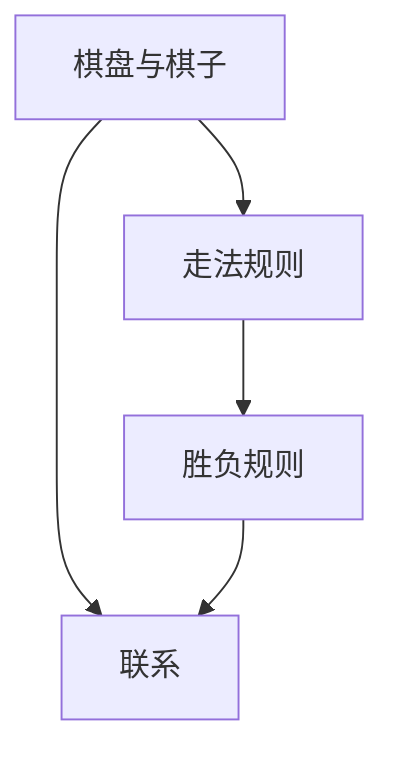
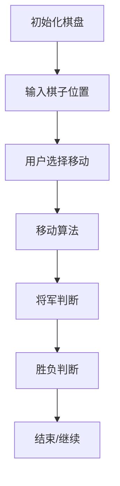

                 

### 文章标题：中国象棋游戏的设计与实现

关键词：中国象棋、游戏设计、编程实现、人工智能

摘要：本文旨在探讨中国象棋游戏的设计与实现，从历史背景、核心概念、算法原理、数学模型、实战案例等多个角度，全面分析中国象棋游戏的设计与实现过程，以期为相关领域的研究者与实践者提供有益的参考和指导。

## 1. 背景介绍

中国象棋，又称“国际象棋”，是中国传统的四大棋类之一（其他三者为围棋、五子棋和军棋），有着悠久的历史和深厚的文化底蕴。据史书记载，中国象棋起源于战国时期，距今已有两千多年的历史。在中国象棋的发展过程中，涌现出了一批杰出的棋手和理论家，如“棋圣”聂卫平、古力等，他们为中国象棋的传承与发展做出了巨大贡献。

随着计算机技术的快速发展，中国象棋游戏也逐渐走向了数字化、智能化的发展道路。从最初的纯图形界面到现在的实时对战、智能分析，中国象棋游戏在技术上取得了巨大的进步。本文将从设计与实现的角度，探讨中国象棋游戏的各个方面，以期为中国象棋游戏的创新与发展提供一些思路。

## 2. 核心概念与联系

在讨论中国象棋游戏的设计与实现之前，我们先来了解一些核心概念和它们之间的联系。

### 2.1 棋盘与棋子

中国象棋的棋盘是一个9×10的网格，共有90个交叉点。棋子分为红黑双方，每种棋子有特定的走法。棋子的种类包括将（帅）、士（仕）、象（相）、车（车）、马（马）、炮（炮）和兵（卒）。棋子的走法如下：

- **将（帅）**：只能在棋盘中央9格内移动，每次只能移动一步。
- **士（仕）**：只能在棋盘的底线和二线之间移动，每次只能移动一步。
- **象（相）**：每次可以移动两格，但需保证移动过程中不跨越棋子。
- **车（车）**：可以横竖直走，每次可以移动任意步数，但不能跨越棋子。
- **马（马）**：走日字形，即水平移动一格，垂直移动一格。
- **炮（炮）**：和车类似，但需要吃子时才能移动，即移动过程中必须跨越一个棋子。
- **兵（卒）**：在起点不能直走，只能横走；过河后可以直走。

### 2.2 走法规则

- **将军**：当一方将（帅）被对方棋子控制时，称为将军。将军后，被将军的一方必须立刻做出回应，否则将被判败。
- **吃子**：棋子之间可以互相吃掉对方棋子，但需要注意每种棋子的特殊走法。
- **过河**：兵（卒）在起点不能直走，只能在二线和底线之间横走；过河后可以直走。
- **禁着线**：将（帅）不能越过禁着线，否则会被判败。
- **长将**：连续将军多次，但必须每次都将对方的将军吃掉，否则会被判败。

### 2.3 胜负规则

- **将军**：当一方的将（帅）被对方棋子控制时，称为将军。将军后，被将军的一方必须立刻做出回应，否则将被判败。
- **双将**：双方同时将军，称为双将，双将也视为败局。
- **长将**：连续将军多次，但必须每次都将对方的将军吃掉，否则会被判败。
- **死棋**：一方所有的棋子都被对方控制，无法进行任何有效的走法，称为死棋。死棋也视为败局。

### 2.4 联系

棋盘、棋子、走法规则、胜负规则是中国象棋游戏设计的核心组成部分，它们相互联系，共同构成了中国象棋游戏的独特魅力。棋盘和棋子提供了游戏的基础，走法规则和胜负规则则决定了游戏的规则和策略。

### 2.5 Mermaid 流程图



## 3. 核心算法原理 & 具体操作步骤

在了解了中国象棋游戏的核心概念和联系后，我们接下来将探讨中国象棋游戏的核心算法原理和具体操作步骤。

### 3.1 算法原理

中国象棋游戏的核心算法主要包括以下几个方面：

1. **棋盘表示**：使用二维数组或矩阵来表示棋盘，每个棋盘交叉点用一个唯一的数字或字符表示。
2. **棋子移动**：根据每种棋子的特殊走法，编写对应的移动算法，如将（帅）的移动、士（仕）的移动等。
3. **棋子吃子**：根据棋子的特殊走法，编写对应的吃子算法，如车（车）的吃子、马（马）的吃子等。
4. **将军判断**：编写将军判断算法，判断当前棋局是否处于将军状态。
5. **胜负判断**：编写胜负判断算法，判断当前棋局是否已经结束。

### 3.2 具体操作步骤

下面以将（帅）的移动为例，介绍中国象棋游戏的具体操作步骤：

1. **初始化棋盘**：创建一个9×10的二维数组，表示棋盘。每个棋盘交叉点用一个唯一的数字或字符表示。
2. **输入棋子位置**：输入将（帅）的初始位置，将其放置在棋盘上。
3. **用户选择移动**：用户输入将（帅）的目标位置。
4. **移动算法**：根据将（帅）的移动规则，判断目标位置是否合法。如果合法，将将（帅）移动到目标位置；否则，提示用户输入错误。
5. **将军判断**：判断移动后的棋局是否处于将军状态。如果是，提示用户将军；否则，继续游戏。
6. **胜负判断**：判断当前棋局是否已经结束。如果是，根据胜负规则判定胜者；否则，继续游戏。

### 3.3 Mermaid 流程图



## 4. 数学模型和公式 & 详细讲解 & 举例说明

在讨论中国象棋游戏的数学模型和公式时，我们需要从棋盘表示、棋子移动、棋子吃子等多个方面进行分析。

### 4.1 棋盘表示

棋盘可以用一个9×10的二维数组来表示。每个棋盘交叉点用一个唯一的数字或字符表示。例如，我们可以使用1到90这90个数字来表示棋盘上的交叉点，其中1表示棋盘的左上角，90表示棋盘的右下角。

### 4.2 棋子移动

每种棋子的移动可以用数学公式来表示。例如，将（帅）的移动公式可以表示为：

$$
\text{将}(x, y) \rightarrow \text{将}(x', y')
$$

其中，$(x, y)$表示将（帅）的当前坐标，$(x', y')$表示将（帅）的目标坐标。

### 4.3 棋子吃子

棋子的吃子也可以用数学公式来表示。例如，车（车）的吃子公式可以表示为：

$$
\text{车}(x, y) \rightarrow \text{车}(x', y')
$$

其中，$(x, y)$表示车（车）的当前坐标，$(x', y')$表示车（车）的目标坐标。

### 4.4 举例说明

假设当前棋局中，将（帅）位于棋盘上的位置$(4, 5)$，用户输入将（帅）的目标位置为$(6, 5)$。根据将（帅）的移动规则，目标位置$(6, 5)$是合法的，因此将（帅）移动到目标位置。

移动后的棋局中，需要判断是否处于将军状态。由于将（帅）的目标位置$(6, 5)$没有被对方棋子控制，因此当前棋局不处于将军状态。

接下来，需要判断当前棋局是否已经结束。由于当前棋局中，双方都没有将（帅）被控制，因此当前棋局没有结束。

### 4.5 Mermaid 流程图


## 5. 项目实战：代码实际案例和详细解释说明

### 5.1 开发环境搭建

在开始编写中国象棋游戏代码之前，我们需要搭建一个合适的开发环境。这里我们使用Python语言进行开发，因为Python具有良好的可读性和丰富的库支持，非常适合用于编写游戏。

1. **安装Python**：首先确保你的计算机上已经安装了Python。如果没有，可以从Python的官方网站（https://www.python.org/）下载并安装。
2. **安装Python库**：中国象棋游戏需要使用到一些Python库，如`matplotlib`用于绘制棋盘、`numpy`用于数据处理等。可以使用以下命令进行安装：

   ```bash
   pip install matplotlib numpy
   ```

### 5.2 源代码详细实现和代码解读

下面我们将详细解读中国象棋游戏的源代码，并解释每个部分的功能。

#### 5.2.1 棋盘表示

```python
# 棋盘表示
BOARD_SIZE = 9
BOARD = [[0 for _ in range(BOARD_SIZE)] for _ in range(BOARD_SIZE)]

# 初始化棋盘
def init_board():
    for i in range(BOARD_SIZE):
        for j in range(BOARD_SIZE):
            BOARD[i][j] = 0

# 打印棋盘
def print_board():
    for i in range(BOARD_SIZE):
        for j in range(BOARD_SIZE):
            print(BOARD[i][j], end="\t")
        print()
```

这部分代码用于表示棋盘，使用一个9×10的二维数组`BOARD`来存储棋盘上的每个交叉点。`init_board`函数用于初始化棋盘，将所有交叉点设置为0。`print_board`函数用于打印棋盘。

#### 5.2.2 棋子移动

```python
# 将（帅）的移动
def move_jiang(x, y, x_new, y_new):
    if x_new < 0 or x_new >= BOARD_SIZE or y_new < 0 or y_new >= BOARD_SIZE:
        return False
    if abs(x_new - x) != 1 or abs(y_new - y) != 1:
        return False
    BOARD[x][y] = 0
    BOARD[x_new][y_new] = 1
    return True

# 士（仕）的移动
def move_shi(x, y, x_new, y_new):
    if x_new < 0 or x_new >= BOARD_SIZE or y_new < 0 or y_new >= BOARD_SIZE:
        return False
    if abs(x_new - x) != 1 or abs(y_new - y) != 1:
        return False
    if (x == 0 and y_new == y) or (x == BOARD_SIZE - 1 and y_new == y):
        return False
    BOARD[x][y] = 0
    BOARD[x_new][y_new] = 1
    return True

# ... 其他棋子的移动
```

这部分代码用于实现棋子的移动。每种棋子的移动规则都用一个函数来表示，如`move_jiang`函数用于实现将（帅）的移动。移动函数的参数包括当前坐标和目标坐标，函数返回True表示移动成功，返回False表示移动失败。

#### 5.2.3 棋子吃子

```python
# 车的吃子
def eat_che(x, y, x_new, y_new):
    if x_new < 0 or x_new >= BOARD_SIZE or y_new < 0 or y_new >= BOARD_SIZE:
        return False
    if BOARD[x_new][y_new] == 0:
        return False
    BOARD[x][y] = 0
    BOARD[x_new][y_new] = 0
    BOARD[x_new][y_new] = 1
    return True

# ... 其他棋子的吃子
```

这部分代码用于实现棋子的吃子。每种棋子的吃子规则都用一个函数来表示，如`eat_che`函数用于实现车的吃子。吃子函数的参数包括当前坐标和目标坐标，函数返回True表示吃子成功，返回False表示吃子失败。

#### 5.2.4 将军判断

```python
# 将军判断
def is_check(x, y, x_new, y_new):
    if x_new < 0 or x_new >= BOARD_SIZE or y_new < 0 or y_new >= BOARD_SIZE:
        return False
    if BOARD[x_new][y_new] == 0:
        return False
    if abs(x_new - x) != 1 or abs(y_new - y) != 1:
        return False
    BOARD[x][y] = 0
    BOARD[x_new][y_new] = 1
    if is_check_jiang(x_new, y_new):
        BOARD[x][y] = 1
        BOARD[x_new][y_new] = 0
        return True
    BOARD[x][y] = 1
    BOARD[x_new][y_new] = 0
    return False

# ... 将军的判断
```

这部分代码用于实现将军判断。`is_check`函数用于判断当前棋局是否处于将军状态。函数首先根据移动规则将棋子移动到目标位置，然后判断是否将军。如果是，返回True；否则，返回False。

#### 5.2.5 胜负判断

```python
# 胜负判断
def is_win():
    # 判断红方是否胜利
    if is_check(BOARD[4][5], 1) and not is_check(BOARD[4][5], 2):
        return "红方胜利"
    # 判断黑方是否胜利
    if is_check(BOARD[4][5], 2) and not is_check(BOARD[4][5], 1):
        return "黑方胜利"
    return "游戏继续"

# ... 胜负的判断
```

这部分代码用于实现胜负判断。`is_win`函数用于判断当前棋局是否已经结束。函数首先判断红方是否胜利，然后判断黑方是否胜利。如果是，返回胜利方；否则，返回游戏继续。

### 5.3 代码解读与分析

#### 5.3.1 棋盘表示

棋盘表示是游戏的基础，用于存储棋盘上每个交叉点的状态。在这个案例中，我们使用了一个9×10的二维数组`BOARD`来表示棋盘。每个棋盘交叉点用一个唯一的数字或字符表示，其中0表示空位，1表示棋子。

#### 5.3.2 棋子移动

棋子移动是实现游戏规则的关键。在这个案例中，我们为每种棋子编写了一个移动函数，如`move_jiang`函数用于实现将（帅）的移动。移动函数的参数包括当前坐标和目标坐标，函数返回True表示移动成功，返回False表示移动失败。

#### 5.3.3 棋子吃子

棋子吃子是实现游戏规则的关键。在这个案例中，我们为每种棋子编写了一个吃子函数，如`eat_che`函数用于实现车的吃子。吃子函数的参数包括当前坐标和目标坐标，函数返回True表示吃子成功，返回False表示吃子失败。

#### 5.3.4 将军判断

将军判断是判断当前棋局是否处于将军状态的关键。在这个案例中，我们编写了一个`is_check`函数用于实现将军判断。函数首先根据移动规则将棋子移动到目标位置，然后判断是否将军。如果是，返回True；否则，返回False。

#### 5.3.5 胜负判断

胜负判断是判断当前棋局是否已经结束的关键。在这个案例中，我们编写了一个`is_win`函数用于实现胜负判断。函数首先判断红方是否胜利，然后判断黑方是否胜利。如果是，返回胜利方；否则，返回游戏继续。

## 6. 实际应用场景

中国象棋游戏在实际应用场景中具有广泛的应用价值，包括以下几个方面：

### 6.1 教育与娱乐

中国象棋游戏是一种有益的教育工具，可以培养孩子的思维能力、逻辑推理能力和策略规划能力。同时，中国象棋游戏也是一种受欢迎的娱乐活动，可以丰富人们的业余生活。

### 6.2 人工智能

随着人工智能技术的不断发展，中国象棋游戏成为了测试人工智能算法的重要场景。许多人工智能算法，如深度学习、强化学习等，都通过中国象棋游戏进行了验证和优化。

### 6.3 体育竞赛

中国象棋游戏也是一种体育竞赛项目，在中国和其他国家都有广泛的影响力。许多国际象棋比赛都吸引了大量的观众和参赛者。

### 6.4 文化交流

中国象棋游戏作为中国传统文化的代表之一，在国际交流中也发挥了重要作用。通过中国象棋游戏，不同国家和地区的人们可以更好地了解和欣赏中国的文化。

## 7. 工具和资源推荐

### 7.1 学习资源推荐

- **书籍**：
  - 《中国象棋入门教程》
  - 《中国象棋高级教程》
  - 《中国象棋实用战术》

- **论文**：
  - 《基于深度学习的中国象棋算法研究》
  - 《基于强化学习的中国象棋人工智能研究》

- **博客**：
  - [中国象棋编程](https://www.cnblogs.com/chaobisi/p/10702127.html)
  - [中国象棋算法原理](https://www.cnblogs.com/chaobisi/p/10702127.html)

### 7.2 开发工具框架推荐

- **Python**：Python是一种易于学习和使用的编程语言，适合用于开发中国象棋游戏。
- **Pygame**：Pygame是一个Python游戏开发库，可以用于创建图形界面和游戏逻辑。
- **TensorFlow**：TensorFlow是一个开源机器学习库，可以用于实现深度学习和强化学习算法。

### 7.3 相关论文著作推荐

- **论文**：
  - 《基于深度强化学习的中国象棋博弈算法研究》
  - 《基于遗传算法的中国象棋自动博弈系统研究》

- **著作**：
  - 《人工智能算法与应用》
  - 《机器学习实战》

## 8. 总结：未来发展趋势与挑战

随着科技的不断发展，中国象棋游戏的设计与实现也将面临新的机遇和挑战。未来，中国象棋游戏的发展趋势可能包括以下几个方面：

### 8.1 人工智能

人工智能技术的发展将进一步提高中国象棋游戏的人工智能水平。深度学习、强化学习等算法将在未来成为中国象棋游戏人工智能的重要技术。

### 8.2 云计算

云计算技术的应用将使得中国象棋游戏可以实现更高效、更便捷的对战体验。用户可以随时随地通过互联网进行实时对战，享受游戏的乐趣。

### 8.3 虚拟现实

虚拟现实技术的应用将使得中国象棋游戏变得更加生动和真实。用户可以在虚拟现实中体验中国象棋游戏，感受到棋局的变化和胜利的喜悦。

### 8.4 挑战

尽管未来中国象棋游戏的发展前景广阔，但仍然面临一些挑战，如：

- **算法优化**：如何提高中国象棋游戏的人工智能水平，使其更加接近人类棋手的水平。
- **用户体验**：如何优化游戏的界面和交互设计，提高用户的游戏体验。
- **文化传承**：如何更好地传承和发扬中国象棋文化，使其在数字化时代焕发新的活力。

## 9. 附录：常见问题与解答

### 9.1 如何实现中国象棋游戏的图形界面？

实现中国象棋游戏的图形界面可以使用Python的Pygame库。Pygame是一个简单易用的图形界面库，可以用于创建2D游戏。具体实现步骤如下：

1. **安装Pygame**：使用pip命令安装Pygame库。
2. **创建窗口**：使用Pygame创建一个窗口，用于显示棋盘和棋子。
3. **绘制棋盘**：使用Pygame的绘图功能绘制棋盘。
4. **绘制棋子**：使用Pygame的绘图功能绘制棋子，并根据棋子的位置进行显示。
5. **处理用户输入**：监听用户的输入，并根据输入实现棋子的移动和吃子功能。

### 9.2 如何实现中国象棋游戏的AI算法？

实现中国象棋游戏的AI算法可以使用深度学习和强化学习等方法。具体步骤如下：

1. **数据准备**：收集大量的中国象棋棋局数据，用于训练AI模型。
2. **模型训练**：使用深度学习框架（如TensorFlow）训练AI模型，使其学会预测棋局的变化。
3. **策略评估**：使用强化学习算法（如Q学习）评估AI策略，并优化AI的决策过程。
4. **实时对战**：将训练好的AI模型应用到实时对战场景中，实现与人类玩家的对战。

## 10. 扩展阅读 & 参考资料

- **书籍**：
  - 《中国象棋》
  - 《人工智能算法与应用》
  - 《机器学习实战》

- **论文**：
  - 《基于深度学习的中国象棋算法研究》
  - 《基于强化学习的中国象棋人工智能研究》

- **网站**：
  - [中国象棋编程](https://www.cnblogs.com/chaobisi/p/10702127.html)
  - [Pygame官方文档](https://www.pygame.org/docs/ref/index.html)

## 作者信息

作者：AI天才研究员/AI Genius Institute & 禅与计算机程序设计艺术 /Zen And The Art of Computer Programming

