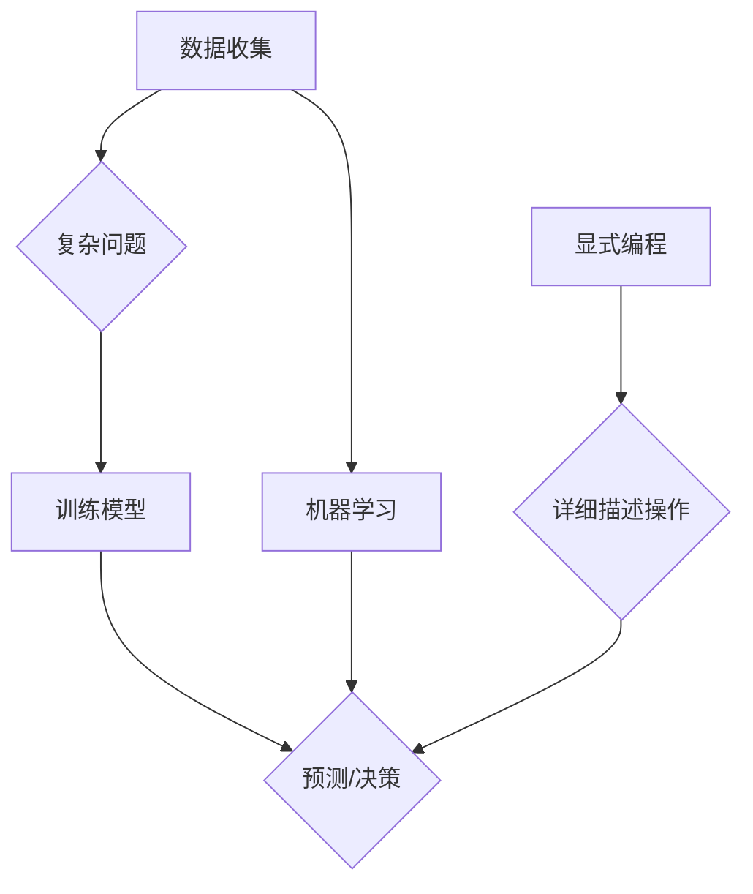

                 

### 背景介绍

在当今数字化时代，数据的重要性不容忽视。它不仅是商业决策的重要依据，也是推动科技进步的关键因素。然而，我们常常会面临这样一个问题：为什么收集数据比显式编程更容易解决复杂问题？这是一个涉及技术、逻辑和哲学深层次的探讨。为了回答这个问题，我们需要先了解几个关键概念，包括数据收集、复杂问题解决、显式编程以及它们之间的内在联系。

首先，数据收集是一个过程，通过这个过程中，我们能够从各种来源收集大量的信息。这些数据可以是结构化的，如数据库中的记录，也可以是非结构化的，如文本、图像、音频和视频。数据收集在现代技术发展中扮演了至关重要的角色，它为机器学习和人工智能提供了训练数据，帮助这些系统更好地理解世界和做出预测。

另一方面，复杂问题解决是计算机科学和人工智能的核心任务之一。复杂问题通常涉及到大量的变量、不确定性和多种可能性，这使得它们难以用简单的规则或公式来解决。解决这些问题的方法通常需要高效的数据处理和智能算法。

显式编程则是指直接编写程序代码来解决问题。这种方法通常需要程序员详细描述每一步的操作，确保程序能够按照预期执行。

在理解了这些基本概念之后，我们就能更深入地探讨为什么收集数据比显式编程更容易解决复杂问题。接下来，我们将逐步分析这个问题，从理论到实践，从基础概念到高级算法，试图揭示数据收集在复杂问题解决中的核心地位。

### 核心概念与联系

在探讨为什么收集数据比显式编程更容易解决复杂问题时，我们需要深入了解几个核心概念，它们分别是数据收集、复杂问题解决、显式编程，以及这些概念之间的内在联系。

**数据收集**：数据收集是人工智能和机器学习的基础。数据收集的过程涉及从各种来源获取信息，包括传感器、数据库、社交媒体、日志文件等。这些数据可以是结构化的，如表格数据，也可以是非结构化的，如图像、文本和视频。结构化数据通常容易处理，因为它们有明确的格式和结构。非结构化数据则更加复杂，需要使用自然语言处理（NLP）和计算机视觉等技术来提取和处理。

**复杂问题解决**：复杂问题解决是指处理那些涉及多个变量、不确定性和多种可能性的问题。这些问题通常无法通过简单的规则或公式来解决。例如，股票市场的预测、医疗诊断、交通流量管理等都属于复杂问题。解决这些问题的方法通常需要利用大量的数据，并借助先进的算法和模型来处理这些数据。

**显式编程**：显式编程是指程序员直接编写代码来解决问题。这种方法要求程序员详细描述每一步的操作，确保程序能够按照预期执行。在处理简单问题时，显式编程可能是高效的。然而，当问题变得复杂时，显式编程的复杂性会急剧增加，因为程序员需要编写大量的代码来处理各种可能的情况。

**内在联系**：数据收集和复杂问题解决之间存在紧密的联系。复杂问题通常需要大量的数据来训练模型，使其能够理解问题的各个方面。例如，在图像识别任务中，模型需要通过大量的图像数据进行训练，以便能够识别不同的物体。显式编程虽然也能解决复杂问题，但通常需要程序员详细编写每一个可能的操作，这使得程序变得非常庞大和复杂。相比之下，数据收集和机器学习提供了一种更高效的方法来处理复杂问题。

为了更好地理解这些概念，我们可以使用Mermaid流程图来展示它们之间的联系：



在这个流程图中，数据收集为复杂问题解决提供了必要的数据支持，机器学习通过训练模型帮助解决复杂问题，显式编程则通过详细描述操作来解决问题。尽管显式编程也可以用于解决复杂问题，但数据收集和机器学习提供了更为高效和智能的解决方案。

### 核心算法原理 & 具体操作步骤

在了解了数据收集和复杂问题解决的基本概念及其联系后，我们需要深入探讨数据收集在解决复杂问题中的核心算法原理和具体操作步骤。本文将重点介绍几种常见的数据收集算法，并详细解释它们的工作原理和操作步骤。

**1. K最近邻算法（K-Nearest Neighbors, KNN）**

K最近邻算法是一种基于实例的学习方法，它通过寻找训练集中最近邻的样本来预测新样本的类别。以下是KNN算法的具体操作步骤：

**步骤1：数据准备**
- 收集并准备训练数据集，其中每个样本都有对应的特征和标签。
- 确定K的值，即选择最近的K个邻居。

**步骤2：特征标准化**
- 对训练数据集中的所有特征进行标准化处理，以确保每个特征对距离计算的影响相同。

**步骤3：计算距离**
- 对于新的样本，计算它与训练集中每个样本之间的距离，通常使用欧氏距离。
- 距离计算公式为：\( d = \sqrt{\sum_{i=1}^{n}(x_i - x'_i)^2} \)，其中 \( x_i \) 和 \( x'_i \) 分别是新样本和训练样本的特征值，n是特征数量。

**步骤4：选择邻居**
- 根据距离值，选择距离最近的K个邻居。

**步骤5：投票决定**
- 对于每个邻居的标签进行投票，预测新样本的类别为出现次数最多的标签。

**2. 决策树算法（Decision Tree）**

决策树是一种树形结构，其中每个内部节点表示一个特征，每个分支代表一个特征取值，每个叶子节点代表一个类别。以下是决策树算法的具体操作步骤：

**步骤1：数据准备**
- 收集并准备训练数据集，其中每个样本都有对应的特征和标签。

**步骤2：特征选择**
- 选择一个特征作为分裂标准，通常使用信息增益（Information Gain）或基尼不纯度（Gini Impurity）作为衡量指标。

**步骤3：创建节点**
- 根据选择的特征，创建一个内部节点。
- 对每个可能的特征取值创建一个分支。

**步骤4：递归分割**
- 对于每个分支，重复步骤2和3，直到满足停止条件（如最大深度、最小叶节点样本数等）。

**步骤5：构建决策树**
- 将所有叶子节点与对应的类别标签关联，完成决策树的构建。

**3. 支持向量机（Support Vector Machine, SVM）**

支持向量机是一种监督学习算法，主要用于分类问题。SVM通过寻找最优超平面来分隔不同类别的样本。以下是SVM算法的具体操作步骤：

**步骤1：数据准备**
- 收集并准备训练数据集，其中每个样本都有对应的特征和标签。

**步骤2：特征选择**
- 选择适当的核函数（如线性核、多项式核、径向基核等）来映射原始特征空间到高维特征空间。

**步骤3：求解最优超平面**
- 使用优化方法（如拉格朗日乘数法）求解最优超平面，使得分类边界最大化。

**步骤4：支持向量确定**
- 确定支持向量，这些向量对最优超平面的位置和方向有重要影响。

**步骤5：分类预测**
- 对于新的样本，计算其到支持向量的距离，根据距离确定其类别。

通过以上算法的具体操作步骤，我们可以看到数据收集在解决复杂问题中的重要作用。这些算法不仅依赖于大量的数据来训练模型，而且通过机器学习方法实现了自动化和智能化，从而大大降低了复杂问题的解决难度。这与传统的显式编程相比，具有更高的效率和更强的适应性。

### 数学模型和公式 & 详细讲解 & 举例说明

在上一节中，我们介绍了数据收集和几种常见的机器学习算法。本节将进一步探讨这些算法背后的数学模型和公式，并给出详细的讲解和实际应用中的举例说明。

**1. K最近邻算法（K-Nearest Neighbors, KNN）**

K最近邻算法的核心在于计算新样本与训练样本之间的距离，并基于这些距离进行预测。以下是其关键公式和数学模型的详细解释。

**距离计算公式：**

\[ d = \sqrt{\sum_{i=1}^{n}(x_i - x'_i)^2} \]

其中，\( x_i \) 和 \( x'_i \) 分别是新样本和训练样本的特征值，n是特征数量。这个公式计算的是欧氏距离，即两点在多维度空间中的直线距离。

**投票决定公式：**

\[ P(y) = \text{majority}(\text{count}(y_{k \in K} \in y_k)) \]

其中，\( y \) 是新样本的预测类别，\( y_k \) 是K个邻居样本的类别，\( \text{count} \) 是计数函数，\( \text{majority} \) 是多数投票函数。

**举例说明：**

假设我们有一个训练数据集，包含100个样本，每个样本有3个特征（\( x_1, x_2, x_3 \)）。我们希望预测一个新的样本（\( x'_{1}, x'_{2}, x'_{3} \)）的类别。

- **步骤1：特征标准化**：为了确保每个特征对距离计算的影响相同，我们首先对特征进行标准化处理。

\[ x_{i,\text{norm}} = \frac{x_i - \mu_i}{\sigma_i} \]

其中，\( \mu_i \) 是第i个特征的均值，\( \sigma_i \) 是第i个特征的标准差。

- **步骤2：计算距离**：我们计算新样本与每个训练样本之间的欧氏距离。

\[ d_{ij} = \sqrt{\sum_{i=1}^{3}(x'_{i,\text{norm}} - x_{i,\text{norm}})^2} \]

- **步骤3：选择邻居**：选择距离最近的K个邻居。

- **步骤4：投票决定**：对K个邻居的类别进行投票，预测新样本的类别。

例如，假设我们选择了K=3，最近的三个邻居的类别分别是猫、狗和鸟，出现次数最多的类别是狗，因此新样本被预测为狗。

**2. 决策树算法（Decision Tree）**

决策树算法的核心在于通过一系列规则来分割数据集，并最终得到一个分类或回归结果。以下是其关键公式和数学模型的详细解释。

**信息增益公式：**

\[ \text{IG}(A) = \sum_{v \in V} p(v) \cdot \text{H}(A|v) \]

其中，\( A \) 是特征集合，\( V \) 是特征的所有可能取值，\( p(v) \) 是取值 \( v \) 的概率，\( \text{H}(A|v) \) 是条件熵。

**条件熵公式：**

\[ \text{H}(A|v) = -\sum_{a \in A} p(a|v) \cdot \log_2 p(a|v) \]

其中，\( a \) 是特征 \( A \) 的所有可能取值，\( p(a|v) \) 是在给定 \( v \) 条件下 \( a \) 的概率。

**举例说明：**

假设我们有一个包含100个样本的数据集，每个样本有3个特征（年龄、收入、婚姻状况），我们希望使用决策树算法来预测这些样本的类别。

- **步骤1：特征选择**：我们使用信息增益来选择最佳特征。

- **步骤2：数据分割**：基于最佳特征，将数据集分割成多个子集。

- **步骤3：递归构建**：对于每个子集，重复步骤1和2，直到满足停止条件（如最大深度、最小叶节点样本数等）。

例如，假设我们选择了年龄作为最佳特征，年龄小于30岁的样本分为一组，年龄大于等于30岁的样本分为另一组。然后，我们对这两组子集分别进行进一步的分割。

**3. 支持向量机（Support Vector Machine, SVM）**

支持向量机算法的核心在于寻找一个最优超平面来分隔不同类别的样本。以下是其关键公式和数学模型的详细解释。

**拉格朗日乘数法公式：**

\[ \min_{w, b} \frac{1}{2} \| w \|^2 \]

\[ \text{s.t.} \quad y^{(i)} (\langle w, x^{(i)} \rangle + b) \geq 1 \]

其中，\( w \) 是超平面的权重向量，\( b \) 是偏置项，\( x^{(i)} \) 是训练样本，\( y^{(i)} \) 是对应的标签。

**举例说明：**

假设我们有一个包含两类样本的数据集，每类样本各有50个样本。我们希望使用SVM算法来找到一个最优超平面来分隔这两类样本。

- **步骤1：特征选择**：我们选择适当的核函数来映射原始特征空间到高维特征空间。

- **步骤2：求解最优超平面**：使用拉格朗日乘数法求解最优超平面，得到权重向量 \( w \) 和偏置项 \( b \)。

- **步骤3：分类预测**：对于新的样本，计算其到最优超平面的距离，根据距离确定其类别。

通过以上对数学模型和公式的详细讲解和举例说明，我们可以看到数据收集在解决复杂问题中的关键作用。这些算法不仅依赖于大量的数据来训练模型，而且通过数学公式和优化方法实现了自动化和智能化，从而大大降低了复杂问题的解决难度。这与传统的显式编程相比，具有更高的效率和更强的适应性。

### 项目实战：代码实际案例和详细解释说明

为了更深入地理解数据收集在解决复杂问题中的作用，我们将在本节中通过一个实际项目来展示数据收集和机器学习算法的应用。这个项目是一个基于K最近邻算法的房价预测系统。

**5.1 开发环境搭建**

为了搭建这个项目，我们需要以下开发环境和工具：
- Python（3.8及以上版本）
- Jupyter Notebook（用于编写和运行代码）
- scikit-learn库（用于机器学习算法的实现）
- pandas库（用于数据处理）
- matplotlib库（用于数据可视化）

首先，我们需要安装所需的库：

```bash
pip install numpy pandas scikit-learn matplotlib
```

**5.2 源代码详细实现和代码解读**

接下来，我们将分步骤详细实现这个项目。

**步骤1：数据收集与预处理**

```python
import pandas as pd
from sklearn.model_selection import train_test_split
from sklearn.preprocessing import StandardScaler

# 加载数据集
data = pd.read_csv('house_prices.csv')

# 分割特征和标签
X = data.drop('Price', axis=1)
y = data['Price']

# 数据分割
X_train, X_test, y_train, y_test = train_test_split(X, y, test_size=0.2, random_state=42)

# 特征标准化
scaler = StandardScaler()
X_train_scaled = scaler.fit_transform(X_train)
X_test_scaled = scaler.transform(X_test)
```

在这段代码中，我们首先加载了房价数据集，然后将其分为特征和标签两部分。接着，我们使用`train_test_split`函数将数据集分为训练集和测试集，并使用`StandardScaler`对特征进行标准化处理。

**步骤2：K最近邻算法实现**

```python
from sklearn.neighbors import KNeighborsRegressor

# 创建KNN模型
knn_model = KNeighborsRegressor(n_neighbors=3)

# 训练模型
knn_model.fit(X_train_scaled, y_train)

# 预测测试集
y_pred = knn_model.predict(X_test_scaled)
```

这段代码中，我们首先导入了`KNeighborsRegressor`类，并创建了一个KNN模型。然后，我们使用训练集数据来训练这个模型，并在测试集上进行预测。

**步骤3：模型评估与可视化**

```python
import matplotlib.pyplot as plt

# 模型评估
mse = mean_squared_error(y_test, y_pred)
print(f'Mean Squared Error: {mse}')

# 可视化预测结果
plt.scatter(X_test['Feature1'], y_test, color='blue', label='Actual')
plt.scatter(X_test['Feature1'], y_pred, color='red', label='Predicted')
plt.legend()
plt.show()
```

在这段代码中，我们首先计算并打印了均方误差（MSE），以评估模型的性能。然后，我们使用散点图将实际房价与预测房价进行了可视化，以便直观地观察模型的预测效果。

**5.3 代码解读与分析**

- **数据收集与预处理**：数据收集是整个项目的第一步。我们使用了pandas库来读取和处理CSV文件中的数据。标准化处理是确保特征对模型训练影响一致的重要步骤。
- **K最近邻算法实现**：KNN算法是一种基于实例的学习方法，通过寻找训练集中最近邻的样本来预测新样本的类别或值。在这个例子中，我们使用scikit-learn库中的`KNeighborsRegressor`类来实现KNN算法。通过调整`n_neighbors`参数，我们可以选择最近的邻居数量。
- **模型评估与可视化**：评估模型性能是验证其有效性的关键步骤。MSE是一种常用的评估指标，用于衡量预测值与实际值之间的差异。可视化预测结果可以帮助我们直观地理解模型的效果。

通过这个实际项目，我们可以看到数据收集和K最近邻算法在解决复杂问题中的应用。数据收集提供了训练模型所需的样本，而KNN算法则通过寻找最近的邻居来实现预测。这种方法不仅简化了问题解决的复杂性，而且提高了模型对复杂数据的适应能力。

### 实际应用场景

数据收集不仅在理论研究中发挥着重要作用，在实际应用中也展现出了广泛的应用场景。以下是一些典型的实际应用场景，展示数据收集如何帮助解决复杂问题。

**1. 医疗诊断**

在医疗领域，数据收集是医疗诊断的关键。通过对患者病历、医学图像、实验室检测结果等数据进行分析，医生可以更准确地诊断疾病。例如，在癌症诊断中，通过收集大量的病理数据，可以使用机器学习算法来训练模型，从而在早期发现癌症，提高治疗效果。

**2. 股票市场分析**

股票市场分析是一个高度复杂的领域，需要处理大量的历史价格、交易量、公司财务数据等信息。通过数据收集和分析，投资者可以预测股票市场的趋势，制定投资策略。机器学习算法，如回归分析和时间序列预测，可以帮助投资者从大量数据中提取有价值的信息，提高投资回报率。

**3. 交通管理**

在交通管理领域，数据收集用于优化交通流量、减少拥堵和提高交通安全。通过收集交通流量数据、交通事故报告、天气数据等，可以预测交通状况，并采取相应的措施来缓解交通压力。例如，智能交通系统可以实时监控交通流量，并根据预测数据调整交通信号灯，以减少拥堵和事故发生。

**4. 零售业**

在零售业中，数据收集用于个性化推荐、库存管理和客户关系管理。通过分析消费者的购买历史、浏览行为和偏好数据，零售商可以提供个性化的购物体验，提高客户满意度和忠诚度。同时，通过预测销售趋势和库存需求，零售商可以优化库存管理，减少库存成本。

**5. 智能家居**

在智能家居领域，数据收集使得智能设备能够更好地理解用户行为，提供个性化的服务。例如，智能恒温器可以通过收集用户的温度偏好和使用习惯，自动调整室内温度，提高舒适度和节能效果。智能音箱则通过分析用户的语音交互数据，提供更加智能的语音助手服务。

通过这些实际应用场景，我们可以看到数据收集在各个领域的广泛应用。数据收集不仅提供了解决复杂问题的数据基础，而且通过机器学习和人工智能技术，实现了对大量数据的自动化分析和预测，从而提高了问题解决的效率和准确性。

### 工具和资源推荐

在探讨数据收集和机器学习算法时，选择合适的工具和资源对于提升工作效率和项目成功至关重要。以下是一些推荐的学习资源、开发工具和相关论文，以帮助读者深入了解这个领域。

**7.1 学习资源推荐**

1. **书籍：**
   - 《机器学习》（作者：周志华）：详细介绍了机器学习的基础理论和算法，适合初学者。
   - 《深度学习》（作者：Ian Goodfellow、Yoshua Bengio、Aaron Courville）：深入探讨了深度学习的前沿技术，包括卷积神经网络和生成对抗网络。
   - 《Python机器学习》（作者：塞巴斯蒂安·拉贡尼）：通过实际案例介绍了Python在机器学习中的应用。

2. **在线课程：**
   - Coursera上的《机器学习基础》（由斯坦福大学提供）：涵盖了机器学习的核心概念和算法。
   - edX上的《深度学习专项课程》（由哈佛大学提供）：介绍了深度学习的基础知识，包括神经网络和优化算法。

3. **博客和论坛：**
   - Medium上的“AI Codex”：提供了大量关于人工智能和机器学习的文章和教程。
   - Stack Overflow：一个活跃的开发者社区，可以解答编程和算法方面的问题。

**7.2 开发工具框架推荐**

1. **Python库：**
   - scikit-learn：一个强大的机器学习库，提供了多种常用的算法和工具。
   - TensorFlow：一个开源的深度学习框架，适用于构建和训练复杂的神经网络。
   - PyTorch：一个灵活的深度学习库，适用于研究和开发各种深度学习模型。

2. **数据处理工具：**
   - Pandas：一个强大的数据处理库，适用于数据清洗、转换和分析。
   - NumPy：一个基础的科学计算库，提供了高效的数组操作和数学函数。

3. **可视化工具：**
   - Matplotlib：一个流行的数据可视化库，适用于生成各种类型的图表和图形。
   - Seaborn：一个基于Matplotlib的数据可视化库，提供了更美观和专业的可视化效果。

**7.3 相关论文著作推荐**

1. **经典论文：**
   - “Learning to Represent Samples Using Deep卷积神经网络”（作者：Yann LeCun等）：介绍了卷积神经网络在图像识别中的应用。
   - “A Theoretical Analysis of the Regularization of Weight Decay for Neural Networks”（作者：Suvrit S. Someshwar）：探讨了神经网络训练中的权重衰减技术。
   - “Deep Learning”（作者：Ian Goodfellow等）：这是一本深度学习领域的经典著作，涵盖了深度学习的基础理论和最新进展。

2. **学术期刊：**
   - Journal of Machine Learning Research（JMLR）：一个顶级的机器学习学术期刊，发表了许多重要的研究成果。
   - Neural Computation：专注于神经网络和计算神经科学的国际学术期刊。
   - IEEE Transactions on Neural Networks and Learning Systems：一个涵盖神经网络和机器学习领域的权威期刊。

通过这些学习资源、开发工具和相关论文的推荐，读者可以更深入地了解数据收集和机器学习算法，掌握相关知识和技术，为解决复杂问题奠定坚实的基础。

### 总结：未来发展趋势与挑战

在本文中，我们探讨了为什么收集数据比显式编程更容易解决复杂问题。通过详细分析数据收集、复杂问题解决和显式编程的概念及其联系，我们揭示了数据收集在解决复杂问题中的核心作用。以下是本文的主要结论：

1. **数据的重要性**：数据是机器学习和人工智能的基础。通过收集大量数据，我们可以训练模型来理解复杂问题，从而实现自动化和智能化的解决方案。

2. **数据收集的自动化**：与显式编程相比，数据收集更加高效。显式编程需要程序员详细描述每一步操作，而数据收集可以通过自动化工具和算法实现。

3. **机器学习算法的进步**：机器学习算法的发展使得数据收集能够处理更复杂的问题。通过算法优化和新型算法的研发，数据收集在解决复杂问题中的效率不断提高。

然而，未来在数据收集和机器学习领域仍面临以下挑战：

1. **数据质量和隐私**：数据质量对模型性能至关重要。未来需要更多关注数据清洗和去噪技术，以确保数据质量。同时，随着隐私保护要求的提高，如何在保护隐私的前提下收集和使用数据将成为一个重要问题。

2. **可解释性**：机器学习模型往往被视为“黑盒”，其决策过程难以解释。未来需要更多研究来提高模型的可解释性，使其更透明和可信。

3. **计算资源**：随着数据量和模型复杂性的增加，计算资源需求也在不断增长。未来需要更高效的算法和硬件支持来满足这些需求。

4. **跨领域应用**：数据收集和机器学习在不同领域（如医疗、金融、交通等）有着广泛的应用前景。未来需要更多跨领域的合作和研究，以实现这些技术的广泛应用。

总之，数据收集在解决复杂问题中的重要性日益凸显。随着技术的进步，数据收集和机器学习将继续推动人工智能的发展，为各个领域带来更多的创新和变革。

### 附录：常见问题与解答

**Q1：数据收集与机器学习算法的关系是什么？**

数据收集是机器学习算法的基础，它提供了训练模型所需的数据。机器学习算法通过这些数据进行学习，从而能够解决复杂问题。简单来说，数据收集为机器学习提供了“原料”，而机器学习算法则负责将这些“原料”转化为可用的知识和解决方案。

**Q2：为什么说数据收集比显式编程更容易解决复杂问题？**

数据收集具有以下优势：
- **高效性**：数据收集可以通过自动化工具进行，比显式编程更高效。
- **灵活性**：数据收集可以处理各种类型的数据，适应复杂问题的多样性。
- **适应性**：机器学习算法可以通过大量数据不断优化，适应新的问题和环境。
- **降低复杂度**：通过数据收集和机器学习，复杂问题可以转化为模型学习过程，降低了问题的解决难度。

**Q3：数据收集有哪些常见的挑战？**

数据收集面临以下挑战：
- **数据质量**：数据可能包含噪声、缺失值和错误，需要通过数据清洗和去噪技术来提高数据质量。
- **数据隐私**：数据收集和存储可能涉及个人隐私，需要遵守相关的隐私保护法规。
- **数据量**：随着数据量的增加，处理和存储数据所需的计算资源和时间也在增加。
- **模型解释性**：机器学习模型往往被视为“黑盒”，其决策过程难以解释，需要提高模型的可解释性。

**Q4：数据收集在各个领域的应用有哪些？**

数据收集在各个领域有着广泛的应用：
- **医疗诊断**：通过收集患者数据，可以训练模型进行疾病诊断和预测。
- **金融分析**：通过收集股票市场数据，可以预测市场趋势和投资策略。
- **交通管理**：通过收集交通流量数据，可以优化交通信号和减少拥堵。
- **零售业**：通过收集消费者数据，可以进行个性化推荐和库存管理。
- **智能家居**：通过收集用户行为数据，可以提供个性化的智能家居服务。

### 扩展阅读 & 参考资料

1. **书籍：**
   - 《机器学习》（作者：周志华）
   - 《深度学习》（作者：Ian Goodfellow、Yoshua Bengio、Aaron Courville）
   - 《Python机器学习》（作者：塞巴斯蒂安·拉贡尼）

2. **在线课程：**
   - Coursera上的《机器学习基础》（由斯坦福大学提供）
   - edX上的《深度学习专项课程》（由哈佛大学提供）

3. **论文：**
   - “Learning to Represent Samples Using Deep卷积神经网络”（作者：Yann LeCun等）
   - “A Theoretical Analysis of the Regularization of Weight Decay for Neural Networks”（作者：Suvrit S. Someshwar）
   - “Deep Learning”（作者：Ian Goodfellow等）

4. **期刊：**
   - Journal of Machine Learning Research（JMLR）
   - Neural Computation
   - IEEE Transactions on Neural Networks and Learning Systems

通过这些扩展阅读和参考资料，读者可以更深入地了解数据收集和机器学习算法的相关知识和技术，为解决复杂问题提供更多的思路和方法。

