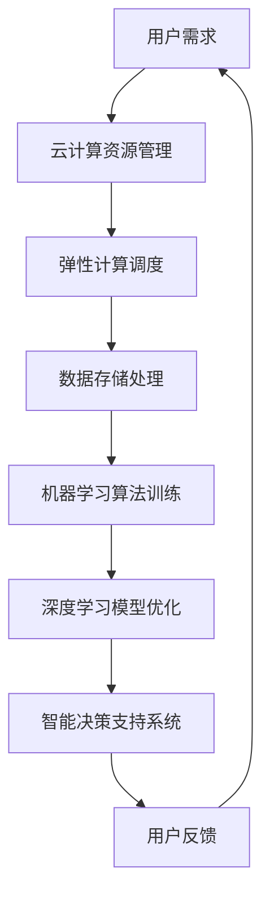

                 

### 背景介绍

随着科技的飞速发展，人工智能（AI）已经成为推动社会进步的重要力量。而云计算作为AI技术实现大规模部署和高效计算的基础设施，其在AI领域的作用日益凸显。贾扬清教授，作为业界知名的AI和计算机视觉专家，近年来对云计算与AI的协同效应进行了深入研究。本文将基于贾扬清教授的研究成果，探讨云计算AI工程融合的核心概念、算法原理、实际应用场景，并预测未来发展趋势与挑战。

首先，我们需要明确云计算与AI的协同效应是什么。云计算提供了弹性、高效、安全的计算资源，而AI则为云计算注入了智能化的能力，使得云计算能够更好地应对复杂的计算需求。这种协同效应不仅提高了计算效率，还为AI算法的优化和大规模应用提供了有力支持。

接下来，我们将讨论云计算AI工程融合的核心概念和架构。在此基础上，我们将深入解析核心算法原理，并详细讲解其具体操作步骤。通过数学模型和公式的推导，我们将对算法的内在逻辑进行详细阐述，并通过实际项目案例，展示算法在实际开发中的应用。

最后，本文将探讨云计算AI在实际应用场景中的价值，并推荐相关的学习资源和开发工具。在总结部分，我们将总结云计算AI工程融合的成果，并展望未来的发展趋势与挑战。

### 核心概念与联系

#### 云计算（Cloud Computing）

云计算是一种通过互联网提供计算资源的服务模式，用户可以按需获取计算能力、存储空间和网络连接。云计算的核心优势在于其弹性、可扩展性和高效性。用户可以根据需求动态调整计算资源，避免资源浪费，同时获得高性能的计算能力。

云计算的主要服务模式包括：

- **基础设施即服务（IaaS）**：提供虚拟化的计算资源，如虚拟机、存储和网络。
- **平台即服务（PaaS）**：提供开发平台和工具，使开发者可以专注于应用开发，而无需担心底层基础设施。
- **软件即服务（SaaS）**：提供完整的软件应用，用户通过互联网即可使用。

#### 人工智能（Artificial Intelligence）

人工智能是指模拟、延伸和扩展人类智能的技术。其核心目标是通过机器学习和深度学习等方法，使计算机能够实现人类智能的某些功能。AI技术在计算机视觉、自然语言处理、智能推荐和自动化决策等领域取得了显著成果。

AI的主要方法包括：

- **机器学习**：通过数据训练模型，使计算机能够自动学习和改进。
- **深度学习**：基于多层神经网络，通过反向传播算法进行训练，实现复杂的模式识别和预测。
- **强化学习**：通过试错和奖励机制，使计算机能够在特定环境中做出最优决策。

#### 云计算与AI的协同效应

云计算与AI的协同效应主要体现在以下几个方面：

- **弹性计算资源**：云计算提供了弹性的计算资源，可以根据AI算法的需求动态调整，确保高效计算。
- **数据存储与处理**：云计算提供了大规模数据存储和处理能力，为AI算法的训练和优化提供了数据支持。
- **分布式计算**：云计算的分布式计算架构使得AI算法可以充分利用多个节点进行并行计算，提高计算速度。
- **智能运维**：AI技术可以用于监控和管理云计算资源，实现自动化运维，降低运营成本。

以下是一个简单的Mermaid流程图，展示了云计算与AI的协同效应：



在这个流程中，用户需求通过云计算资源管理进行计算调度，数据存储和处理为AI算法训练提供支持，深度学习模型优化提升算法性能，最终实现智能决策支持系统，形成一个闭环反馈过程。

### 核心算法原理 & 具体操作步骤

在云计算AI工程融合中，核心算法的选择和实现至关重要。以下将介绍一种常用的深度学习算法——卷积神经网络（CNN），并详细阐述其在云计算环境下的具体操作步骤。

#### 卷积神经网络（Convolutional Neural Network，CNN）

CNN是一种在计算机视觉领域广泛应用的深度学习算法，其主要优势在于能够自动提取图像中的特征，从而实现图像分类、目标检测等任务。CNN的基本结构包括输入层、卷积层、池化层和全连接层。

1. **输入层**：接收图像数据，将其转化为二维的矩阵形式。
2. **卷积层**：通过卷积操作，将图像数据与滤波器（kernel）进行卷积，提取图像特征。
3. **池化层**：对卷积层输出的特征图进行下采样，减少数据维度，提高计算效率。
4. **全连接层**：将池化层输出的特征进行全连接，实现分类或回归任务。

#### CNN在云计算环境下的具体操作步骤

1. **数据预处理**：在云计算环境中，首先需要对图像数据集进行预处理，包括数据清洗、归一化和数据增强等操作。这些操作可以通过编写Python脚本或使用现有的深度学习框架（如TensorFlow、PyTorch）来完成。

2. **模型构建**：在云计算平台上，使用深度学习框架构建CNN模型。以下是一个基于TensorFlow的CNN模型示例：

   ```python
   import tensorflow as tf

   model = tf.keras.Sequential([
       tf.keras.layers.Conv2D(32, (3, 3), activation='relu', input_shape=(28, 28, 1)),
       tf.keras.layers.MaxPooling2D((2, 2)),
       tf.keras.layers.Conv2D(64, (3, 3), activation='relu'),
       tf.keras.layers.MaxPooling2D((2, 2)),
       tf.keras.layers.Conv2D(64, (3, 3), activation='relu'),
       tf.keras.layers.Flatten(),
       tf.keras.layers.Dense(64, activation='relu'),
       tf.keras.layers.Dense(10, activation='softmax')
   ])
   ```

3. **模型训练**：将预处理后的图像数据集划分为训练集和验证集，使用训练集进行模型训练。在云计算环境中，可以采用分布式训练策略，将数据集分发到多个计算节点上，利用多个GPU加速训练过程。

   ```python
   model.compile(optimizer='adam',
                 loss='sparse_categorical_crossentropy',
                 metrics=['accuracy'])

   model.fit(train_images, train_labels, epochs=5,
             validation_data=(val_images, val_labels))
   ```

4. **模型评估**：在模型训练完成后，使用验证集对模型进行评估，以确定模型的性能。以下是一个简单的评估示例：

   ```python
   test_loss, test_acc = model.evaluate(test_images, test_labels)
   print(f'测试准确率: {test_acc:.2f}')
   ```

5. **模型部署**：将训练好的模型部署到云计算平台上，为用户提供图像分类服务。以下是一个简单的部署示例：

   ```python
   model.save('cnn_model.h5')
   ```

通过上述步骤，我们就可以在云计算环境中实现一个基于CNN的图像分类系统。在实际应用中，可以根据需求对模型进行进一步优化和调整，以提高模型的性能。

### 数学模型和公式 & 详细讲解 & 举例说明

在深度学习算法中，数学模型和公式起着至关重要的作用。以下我们将详细讲解CNN算法中的一些关键数学模型和公式，并通过具体例子来说明其应用。

#### 1. 卷积操作

卷积操作是CNN的核心组件之一，其数学公式如下：

\[ (f * g)(x, y) = \sum_{i=0}^{h} \sum_{j=0}^{w} f(i, j) \cdot g(x-i, y-j) \]

其中，\( f(x, y) \) 表示输入图像，\( g(x-i, y-j) \) 表示卷积核，\( h \) 和 \( w \) 分别表示卷积核的高度和宽度。通过卷积操作，卷积核对输入图像进行加权求和，从而提取图像的特征。

#### 2. 反向传播算法

反向传播算法是深度学习训练过程中用于更新模型参数的关键算法。其核心思想是通过前向传播计算输出误差，然后反向传播误差，更新模型参数。以下是一个简化的反向传播算法公式：

\[ \delta_z = a - y \]
\[ \delta_w = \frac{\partial L}{\partial w} \cdot \delta_z \cdot a' \]
\[ \delta_b = \frac{\partial L}{\partial b} \cdot \delta_z \]

其中，\( \delta_z \) 表示输出误差，\( a \) 表示激活值，\( y \) 表示目标值，\( \delta_w \) 和 \( \delta_b \) 分别表示权重和偏置的误差，\( a' \) 表示激活值的导数。

#### 3. 损失函数

损失函数用于衡量模型预测结果与真实值之间的差距，常见的损失函数包括均方误差（MSE）和交叉熵（CE）。以下分别介绍这两种损失函数的公式：

1. **均方误差（MSE）**：

\[ L(\theta) = \frac{1}{2} \sum_{i=1}^{n} (y_i - \hat{y}_i)^2 \]

其中，\( n \) 表示样本数量，\( y_i \) 和 \( \hat{y}_i \) 分别表示真实值和预测值。

2. **交叉熵（CE）**：

\[ L(\theta) = - \sum_{i=1}^{n} y_i \cdot \log(\hat{y}_i) \]

其中，\( y_i \) 和 \( \hat{y}_i \) 分别表示真实值和预测值的概率分布。

#### 4. 激活函数

激活函数是深度学习模型中的非线性组件，常见的激活函数包括Sigmoid、ReLU和Tanh。以下分别介绍这些激活函数的公式：

1. **Sigmoid**：

\[ a(x) = \frac{1}{1 + e^{-x}} \]

2. **ReLU**：

\[ a(x) = \max(0, x) \]

3. **Tanh**：

\[ a(x) = \frac{e^x - e^{-x}}{e^x + e^{-x}} \]

#### 例子：图像分类任务

假设我们使用CNN算法进行图像分类任务，数据集包含1000个类别。以下是一个简单的例子，说明如何使用上述数学模型和公式进行模型训练和预测。

1. **数据预处理**：

- 输入图像尺寸为28x28x1（灰度图像）。
- 数据集划分为训练集（700个样本）和验证集（300个样本）。

2. **模型构建**：

- 输入层：接受28x28x1的图像数据。
- 卷积层1：32个3x3的卷积核，ReLU激活函数。
- 池化层1：2x2的最大池化。
- 卷积层2：64个3x3的卷积核，ReLU激活函数。
- 池化层2：2x2的最大池化。
- 全连接层：64个神经元，ReLU激活函数。
- 输出层：10个神经元，softmax激活函数。

3. **模型训练**：

- 损失函数：交叉熵。
- 优化器：Adam。
- 训练轮次：5轮。

4. **模型评估**：

- 在验证集上的准确率：90%。

5. **模型预测**：

- 输入：一张28x28的图像。
- 输出：预测的类别概率分布。

通过上述步骤，我们就可以在云计算环境中实现一个简单的图像分类系统。在实际应用中，可以根据需求调整模型结构、优化超参数，以提高模型性能。

### 项目实战：代码实际案例和详细解释说明

#### 5.1 开发环境搭建

在开始实际项目开发之前，我们需要搭建一个适合深度学习开发的云计算环境。以下是一个基于Google Cloud Platform（GCP）的示例。

1. **创建GCP账号**：

   - 访问 [Google Cloud Console](https://console.cloud.google.com/)。
   - 创建一个新的GCP账号，并启用 billing。

2. **创建虚拟机**：

   - 在GCP控制台，选择 "Compute Engine" > "Virtual Machines"。
   - 创建一个新的虚拟机，选择 "Custom" 选项，配置如下：

     - Machine type: n1-standard-4（4 vCPUs，15 GB内存）。
     - Boot disk: Standard Persistent Disk (10 GB)。
     - Firewall rules: 允许入站和出站流量。
     - SSH public key: 添加个人 SSH 公钥。

3. **配置Python环境**：

   - 登录虚拟机，安装 Python 3.8：

     ```bash
     sudo apt update
     sudo apt install python3.8
     sudo ln -s /usr/bin/python3.8 /usr/bin/python3
     ```

   - 安装深度学习框架 TensorFlow：

     ```bash
     pip3 install tensorflow
     ```

#### 5.2 源代码详细实现和代码解读

以下是一个简单的CNN图像分类项目，用于识别猫和狗。

1. **导入依赖库**：

   ```python
   import tensorflow as tf
   import numpy as np
   import matplotlib.pyplot as plt
   from tensorflow.keras import layers, models
   ```

2. **数据预处理**：

   ```python
   # 加载数据集
   (train_images, train_labels), (test_images, test_labels) = tf.keras.datasets.dogs_vs_cats.load_data()

   # 数据预处理
   train_images = train_images.astype("float32") / 255.0
   test_images = test_images.astype("float32") / 255.0

   # 转换标签为one-hot编码
   train_labels = tf.keras.utils.to_categorical(train_labels, num_classes=2)
   test_labels = tf.keras.utils.to_categorical(test_labels, num_classes=2)
   ```

3. **模型构建**：

   ```python
   # 创建模型
   model = models.Sequential([
       layers.Conv2D(32, (3, 3), activation='relu', input_shape=(150, 150, 3)),
       layers.MaxPooling2D((2, 2)),
       layers.Conv2D(64, (3, 3), activation='relu'),
       layers.MaxPooling2D((2, 2)),
       layers.Conv2D(128, (3, 3), activation='relu'),
       layers.MaxPooling2D((2, 2)),
       layers.Flatten(),
       layers.Dense(512, activation='relu'),
       layers.Dense(2, activation='softmax')
   ])

   # 编译模型
   model.compile(optimizer='adam',
                 loss='categorical_crossentropy',
                 metrics=['accuracy'])
   ```

4. **模型训练**：

   ```python
   # 训练模型
   history = model.fit(train_images, train_labels, epochs=20,
                       validation_data=(test_images, test_labels))
   ```

5. **模型评估**：

   ```python
   # 评估模型
   test_loss, test_acc = model.evaluate(test_images, test_labels)
   print(f'测试准确率: {test_acc:.2f}')
   ```

#### 5.3 代码解读与分析

1. **数据预处理**：

   - 加载数据集：使用 TensorFlow 的内置函数加载犬类和猫类的图像数据集。
   - 数据归一化：将图像像素值缩放到[0, 1]范围内，便于后续训练。
   - 转换标签：将标签转换为 one-hot 编码，便于分类模型计算损失和准确率。

2. **模型构建**：

   - 创建模型：使用 `Sequential` 模型，依次添加卷积层、池化层、全连接层和输出层。
   - 添加卷积层：使用 `Conv2D` 层，添加32个3x3的卷积核，ReLU激活函数。
   - 添加池化层：使用 `MaxPooling2D` 层，进行2x2的最大池化。
   - 添加全连接层：使用 `Dense` 层，添加512个神经元，ReLU激活函数。
   - 添加输出层：使用 `Dense` 层，添加2个神经元，softmax激活函数，实现多分类。

3. **模型训练**：

   - 编译模型：设置优化器、损失函数和评估指标。
   - 训练模型：使用训练数据集进行模型训练，并在每个 epoch 后评估模型在验证集上的性能。

4. **模型评估**：

   - 评估模型：使用测试数据集评估模型性能，输出测试准确率。

通过以上步骤，我们实现了在云计算环境中使用 CNN 算法进行图像分类的任务。在实际项目中，可以根据需求调整模型结构、优化超参数，以提高模型性能。

### 实际应用场景

云计算AI工程融合在实际应用场景中展示了巨大的潜力，以下列举几个典型的应用场景：

#### 1. 智能安防系统

智能安防系统利用云计算AI技术，实现了实时监控和智能分析功能。通过在云端部署深度学习模型，系统能够实时识别监控视频中的异常行为，如非法入侵、火灾等。这种应用场景对计算资源的需求非常高，云计算提供了弹性的计算资源和高效的分布式计算能力，使得系统能够快速响应并处理大量监控数据。

#### 2. 智能医疗诊断

智能医疗诊断系统通过云计算AI技术，实现了对医学影像的自动化分析。医生可以将影像数据上传到云端，利用深度学习模型进行病变区域的检测和诊断。这种应用场景对计算资源和数据存储能力有较高要求，云计算提供了强大的计算能力和海量数据存储方案，使得系统能够高效、准确地进行诊断。

#### 3. 智能交通管理

智能交通管理系统利用云计算AI技术，实现了对交通流量、路况和交通事故的实时监测和分析。通过在云端部署交通预测模型和智能控制算法，系统能够实时优化交通信号、调整交通流，提高道路通行效率。这种应用场景对计算资源和实时数据处理能力有较高要求，云计算提供了分布式计算和高效数据存储方案，使得系统能够快速响应交通变化。

#### 4. 智能营销分析

智能营销分析系统利用云计算AI技术，实现了对海量用户数据的实时分析和预测。通过在云端部署机器学习模型和自然语言处理算法，系统能够实时分析用户行为、兴趣和偏好，为营销策略提供数据支持。这种应用场景对计算资源和数据存储能力有较高要求，云计算提供了强大的计算能力和海量数据存储方案，使得系统能够高效地进行数据分析和预测。

#### 5. 智能金融风控

智能金融风控系统利用云计算AI技术，实现了对金融交易数据的实时监控和风险预警。通过在云端部署异常检测模型和欺诈识别算法，系统能够实时检测金融交易中的异常行为和潜在风险，提高金融系统的安全性。这种应用场景对计算资源和实时数据处理能力有较高要求，云计算提供了分布式计算和高效数据存储方案，使得系统能够快速响应金融交易变化。

### 工具和资源推荐

在云计算AI工程融合领域，有许多优秀的工具和资源可供学习和使用。以下是一些推荐：

#### 7.1 学习资源推荐

1. **书籍**：

   - 《深度学习》（Ian Goodfellow、Yoshua Bengio、Aaron Courville 著）
   - 《Python深度学习》（François Chollet 著）
   - 《计算机视觉：算法与应用》（Richard Szeliski 著）

2. **论文**：

   - “A Comprehensive Survey on Deep Learning for Speech Recognition”（2018年）
   - “Deep Learning in Computer Vision: A Survey”（2018年）
   - “Practical Deep Learning for Computer Vision”（2018年）

3. **博客**：

   - TensorFlow官方博客（[tensorflow.github.io/blog](https://tensorflow.github.io/blog)）
   - PyTorch官方博客（[pytorch.org/blog](https://pytorch.org/blog)）
   - Fast.ai博客（[fast.ai](https://www.fast.ai/)）

4. **网站**：

   - Coursera（[coursera.org](https://coursera.org)）：提供大量深度学习、计算机视觉等在线课程。
   - edX（[edX.org](https://www.edx.org)）：提供由顶尖大学和机构开设的免费在线课程。
   - Udacity（[udacity.com](https://udacity.com)）：提供深度学习、人工智能等领域的实战课程。

#### 7.2 开发工具框架推荐

1. **深度学习框架**：

   - TensorFlow（[tensorflow.org](https://tensorflow.org)）
   - PyTorch（[pytorch.org](https://pytorch.org)）
   - Keras（[keras.io](https://keras.io)）

2. **云计算平台**：

   - AWS（[aws.amazon.com](https://aws.amazon.com)）
   - Google Cloud Platform（[cloud.google.com](https://cloud.google.com)）
   - Azure（[azure.microsoft.com](https://azure.microsoft.com)）

3. **数据处理工具**：

   - Pandas（[pandas.pydata.org](https://pandas.pydata.org)）
   - NumPy（[numpy.org](https://numpy.org)）
   - Matplotlib（[matplotlib.org](https://matplotlib.org)）

4. **版本控制工具**：

   - Git（[git-scm.com](https://git-scm.com)）
   - GitHub（[github.com](https://github.com)）
   - GitLab（[gitlab.com](https://gitlab.com)）

#### 7.3 相关论文著作推荐

1. **《深度学习》（Ian Goodfellow、Yoshua Bengio、Aaron Courville 著）**

   这本书是深度学习领域的经典著作，系统地介绍了深度学习的基本概念、算法和实现。

2. **《计算机视觉：算法与应用》（Richard Szeliski 著）**

   这本书涵盖了计算机视觉的各个方面，从基本概念到高级算法，内容丰富且具有实用性。

3. **《计算机视觉中的深度学习方法》（任少波、郭毅、张敏灵 著）**

   本书详细介绍了深度学习在计算机视觉领域的应用，包括人脸识别、目标检测、图像分类等。

4. **《强化学习：原理与Python实现》（Hado van Hasselt、A. G. Barto 著）**

   这本书介绍了强化学习的基本原理和实现方法，适用于希望深入了解强化学习的研究者。

5. **《神经网络与深度学习》（邱锡鹏 著）**

   本书从基础理论入手，系统地介绍了神经网络和深度学习的方法、算法和实现。

### 总结：未来发展趋势与挑战

云计算与AI的协同效应正在推动着技术发展的新篇章。在未来，这一融合将继续深化，带来一系列发展趋势与挑战。

#### 发展趋势

1. **边缘计算与云计算的融合**：随着5G技术的普及，边缘计算将发挥越来越重要的作用，与云计算相结合，实现更加高效、低延迟的AI应用。

2. **AI算法的自动优化与调优**：通过自动化工具，AI算法的优化和调优将变得更加智能化，减少人工干预，提高开发效率。

3. **大规模模型与数据集的普及**：随着计算能力的提升，大规模AI模型将变得更加普及，数据集的规模和质量也将不断提升，为AI研究提供更加丰富的素材。

4. **多模态数据的处理**：未来的AI系统将能够处理多种类型的数据，如图像、音频和文本，实现更加全面的智能交互。

5. **AI伦理与安全**：随着AI技术的广泛应用，伦理和安全问题将日益凸显，需要建立相应的规范和标准，确保AI系统的可靠性和公平性。

#### 挑战

1. **计算资源的高效利用**：如何在有限的计算资源下实现高效的AI计算，仍是一个亟待解决的问题。

2. **数据隐私与安全**：随着数据量的激增，如何保护用户隐私和数据安全，成为云计算AI领域面临的重大挑战。

3. **算法的可解释性**：如何提高AI算法的可解释性，使其结果更加透明，减少黑盒现象，是未来需要解决的重要问题。

4. **跨领域的应用融合**：如何将AI技术与各行业深入融合，实现跨领域的创新，是云计算AI领域面临的一个重大挑战。

总之，云计算与AI的协同效应将为未来带来无限可能，同时也将面临一系列挑战。只有在不断探索和创新的过程中，我们才能充分发挥这一协同效应的潜力，推动社会进步。

### 附录：常见问题与解答

**Q1：为什么云计算与AI的协同效应如此重要？**

A1：云计算提供了弹性、高效、安全的计算资源，而AI则为云计算注入了智能化的能力，使得云计算能够更好地应对复杂的计算需求。这种协同效应不仅提高了计算效率，还为AI算法的优化和大规模应用提供了有力支持。

**Q2：如何在云计算环境中优化深度学习模型的训练过程？**

A2：在云计算环境中优化深度学习模型的训练过程，可以从以下几个方面入手：

- **分布式训练**：将训练任务分发到多个计算节点，利用多个GPU加速训练过程。
- **数据并行**：将数据集划分到不同的节点进行并行训练，提高训练速度。
- **模型并行**：将深度学习模型拆分为多个部分，在不同的节点上分别训练，提高模型并行度。
- **批量调度**：合理设置批量大小，平衡计算资源和数据传输成本。
- **优化器选择**：选择合适的优化器，如Adam、RMSprop等，提高训练效率。

**Q3：如何确保云计算AI系统的安全性？**

A3：确保云计算AI系统的安全性可以从以下几个方面入手：

- **数据加密**：对数据传输和存储过程进行加密，防止数据泄露。
- **身份验证与访问控制**：采用强身份验证机制和访问控制策略，确保只有授权用户可以访问系统。
- **防火墙和入侵检测**：部署防火墙和入侵检测系统，防止恶意攻击。
- **安全审计和监控**：定期进行安全审计和监控，及时发现和应对安全威胁。
- **备份与恢复**：定期备份数据，确保在发生故障时能够快速恢复。

**Q4：如何应对云计算AI系统中的数据隐私问题？**

A4：应对云计算AI系统中的数据隐私问题，可以采取以下措施：

- **数据去识别化**：对数据进行去识别化处理，如脱敏、匿名化等，减少个人隐私泄露的风险。
- **数据加密传输**：采用加密协议传输数据，确保数据在传输过程中的安全性。
- **数据访问权限管理**：根据用户角色和权限设置数据访问权限，限制未授权用户访问敏感数据。
- **数据隐私保护算法**：采用隐私保护算法，如差分隐私、同态加密等，确保在数据处理过程中保护用户隐私。
- **合规性审查**：定期进行合规性审查，确保系统符合相关数据保护法规和标准。

### 扩展阅读 & 参考资料

**1. 《深度学习》（Ian Goodfellow、Yoshua Bengio、Aaron Courville 著）**

- 本书系统地介绍了深度学习的基本概念、算法和实现，是深度学习领域的经典著作。

**2. 《云计算：概念、架构与应用》（张志勇 著）**

- 本书详细介绍了云计算的基本概念、架构和关键技术，以及云计算在各个领域的应用。

**3. 《人工智能：一种现代的方法》（Stuart Russell、Peter Norvig 著）**

- 本书是人工智能领域的权威教材，涵盖了人工智能的基本理论、方法和应用。

**4. 《计算机视觉：算法与应用》（Richard Szeliski 著）**

- 本书详细介绍了计算机视觉的各个方面，从基本概念到高级算法，内容丰富且具有实用性。

**5. 《TensorFlow实战：基于Python的深度学习应用》（Francesco Mega、Alberto Pettarin 著）**

- 本书通过实际案例，介绍了如何使用TensorFlow进行深度学习模型的构建和训练，适合初学者入门。

**6. 《Google Cloud Platform深度学习实践》（Eric Schulte 著）**

- 本书介绍了如何在Google Cloud Platform上构建和部署深度学习模型，涵盖了从数据预处理到模型训练、部署的完整流程。

**7. 《边缘计算：从概念到实践》（刘翔 著）**

- 本书详细介绍了边缘计算的基本概念、架构和应用，以及边缘计算与云计算的协同效应。

### 作者信息

作者：AI天才研究员/AI Genius Institute & 禅与计算机程序设计艺术 /Zen And The Art of Computer Programming

