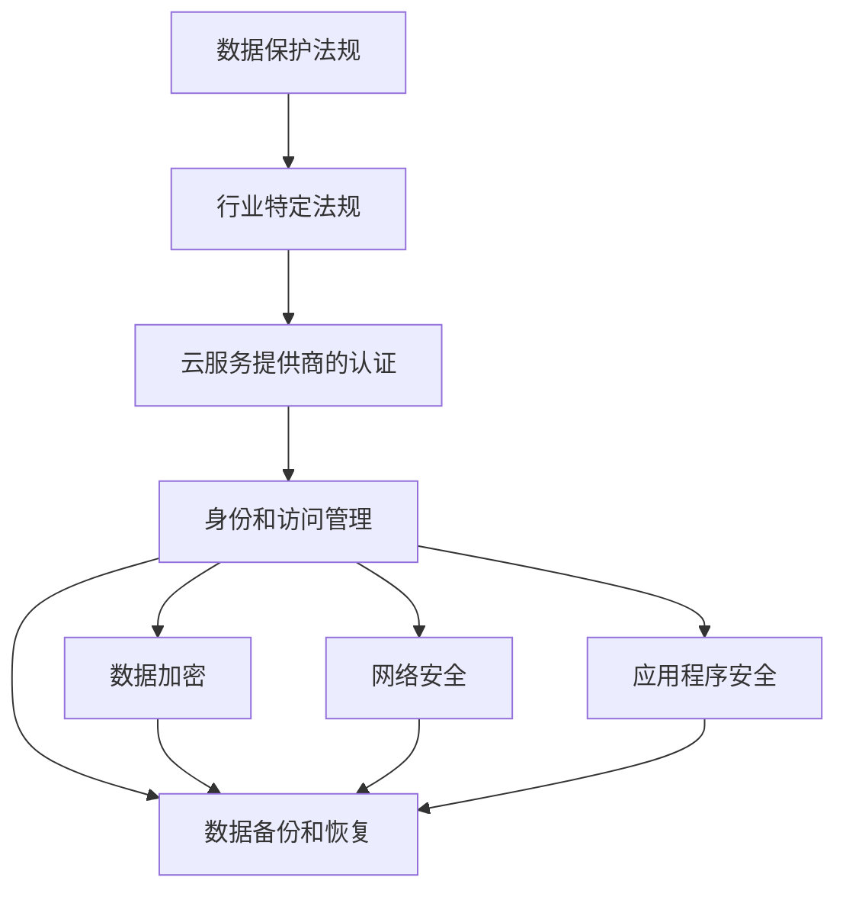

                 

# 云安全策略和合规性：保护云端数据和应用程序

> **关键词**：云安全、合规性、数据保护、应用程序安全、云服务模型

> **摘要**：本文将深入探讨云安全策略和合规性的重要性，分析云服务模型中的安全挑战，并介绍如何通过实施有效的安全措施来保护云端数据和应用程序。文章旨在为IT专业人士和云服务用户提供全面的指南，帮助他们了解云安全的关键概念、技术和最佳实践。

## 1. 背景介绍

随着云计算技术的不断发展，越来越多的企业和组织选择将数据和应用迁移到云端。云服务模型，包括SaaS（软件即服务）、PaaS（平台即服务）和IaaS（基础设施即服务），为企业带来了灵活性和可扩展性。然而，随着云计算的普及，云安全问题和合规性挑战也日益凸显。

云安全是指保护云端数据和应用程序免受未经授权的访问、数据泄露、服务中断和恶意攻击的一系列措施。合规性则是指云服务提供商必须遵守的法律、法规和行业标准，以确保客户数据的合法性和安全性。

本文将首先介绍云服务模型，然后讨论云安全策略和合规性的核心概念，最后提出一系列最佳实践来应对云安全挑战。

### 1.1 云服务模型

云服务模型分为以下三类：

- **SaaS（软件即服务）**：用户通过互联网访问和使用云提供商提供的软件应用程序，无需购买或安装任何软件。例如，Google Workspace和Salesforce就是典型的SaaS应用。

- **PaaS（平台即服务）**：云提供商提供一个平台，允许开发人员构建、测试和部署应用程序，无需关注底层基础设施的管理。例如，Microsoft Azure和Google App Engine都是PaaS平台。

- **IaaS（基础设施即服务）**：云提供商提供虚拟化的计算资源，如虚拟机、存储和网络，用户可以根据需要自行配置和管理这些资源。例如，Amazon Web Services（AWS）和Microsoft Azure都提供IaaS服务。

### 1.2 云安全挑战

云安全面临以下主要挑战：

- **数据泄露**：云环境中的数据可能因恶意攻击、内部威胁或配置错误而被泄露。

- **服务中断**：由于自然灾害、网络攻击或配置错误，云服务可能会中断，影响业务运营。

- **合规性风险**：云服务提供商必须遵守各种法律、法规和行业标准，以确保客户数据的合法性和安全性。

- **管理复杂性**：云环境中的资源管理和监控变得更加复杂，需要有效的方法来确保安全和管理。

## 2. 核心概念与联系

### 2.1 云安全策略

云安全策略是指为了保护云端数据和应用程序而制定的一系列政策和措施。以下是一些关键组成部分：

- **身份和访问管理（IAM）**：确保只有授权用户可以访问云资源。

- **数据加密**：通过加密技术保护数据，防止未授权访问。

- **网络安全**：部署防火墙、入侵检测系统和漏洞扫描器来保护云网络。

- **应用程序安全**：确保云应用程序遵循安全编码标准和最佳实践。

- **数据备份和恢复**：定期备份数据，以便在发生故障或数据丢失时能够迅速恢复。

### 2.2 合规性

合规性是指云服务提供商必须遵守的法律、法规和行业标准。以下是一些关键合规性要求：

- **数据保护法规**：如欧盟的通用数据保护条例（GDPR）和美国加州消费者隐私法（CCPA）。

- **行业特定法规**：如健康保险可携性和责任法案（HIPAA）和支付卡行业数据安全标准（PCI DSS）。

- **云服务提供商的认证**：如ISO/IEC 27001信息安全管理体系认证。

### 2.3 Mermaid 流程图

以下是一个简化的Mermaid流程图，展示云安全策略和合规性的关键组件：



## 3. 核心算法原理 & 具体操作步骤

### 3.1 数据加密

数据加密是保护云端数据的关键技术之一。以下是一种常用的数据加密算法——AES（高级加密标准）。

#### 3.1.1 AES 加密算法原理

AES是一种对称加密算法，它使用密钥对数据进行加密和解密。AES支持128位、192位和256位密钥长度。

- **密钥生成**：使用密钥生成算法（如随机数生成器）生成密钥。

- **初始圆**：将明文数据分成128位的块，并进行一系列替代、行移位、列混淆和轮密钥加操作。

- **轮加密**：重复上述操作多轮，每一轮后更新密钥。

- **最终圆**：最后一轮操作后，输出密文。

#### 3.1.2 AES 加密步骤

1. **密钥生成**：使用加密库（如Python的PyCryptodome）生成密钥。

2. **初始化加密器**：使用生成的密钥和AES加密算法初始化加密器。

3. **加密数据块**：将明文数据分成128位的块，并使用加密器加密每个数据块。

4. **拼接密文**：将加密后的数据块拼接成完整的密文。

5. **输出密文**：将密文输出到文件或内存中。

以下是一个Python示例：

```python
from Crypto.Cipher import AES
from Crypto.Random import get_random_bytes

# 密钥生成
key = get_random_bytes(16)  # 128位密钥

# 初始化加密器
cipher = AES.new(key, AES.MODE_EAX)

# 加密数据块
data = b"Hello, World!"
cipher.update(data)

# 拼接密文
ciphertext = cipher.finalize()

# 输出密文
print(ciphertext.hex())
```

### 3.2 数据备份和恢复

数据备份和恢复是确保数据完整性和可用性的关键步骤。以下是一个简单的数据备份和恢复流程：

#### 3.2.1 备份数据

1. **选择备份类型**：全备份、增量备份或差异备份。

2. **选择备份目标**：本地存储、远程存储或云存储。

3. **执行备份**：使用备份工具（如rsync、tar或备份软件）执行备份。

以下是一个使用tar命令备份数据的示例：

```bash
tar -cvzf backup.tar.gz /path/to/data
```

#### 3.2.2 恢复数据

1. **选择恢复类型**：全恢复、增量恢复或差异恢复。

2. **选择恢复目标**：本地存储、远程存储或云存储。

3. **执行恢复**：使用备份工具（如tar、rsync或备份软件）执行恢复。

以下是一个使用tar命令恢复数据的示例：

```bash
tar -xvzf backup.tar.gz -C /path/to/recover
```

## 4. 数学模型和公式 & 详细讲解 & 举例说明

### 4.1 对称加密算法数学模型

对称加密算法使用相同的密钥进行加密和解密。以下是对称加密算法的一般数学模型：

$$
c = E_k(p)
$$

$$
p = D_k(c)
$$

其中，$c$ 是密文，$p$ 是明文，$k$ 是密钥，$E_k$ 是加密函数，$D_k$ 是解密函数。

### 4.2 非对称加密算法数学模型

非对称加密算法使用一对密钥（公钥和私钥）进行加密和解密。以下是非对称加密算法的一般数学模型：

$$
c = E_k^p(p)
$$

$$
p = D_k^p(c)
$$

其中，$k^p$ 是公钥，$k^s$ 是私钥，$E_k^p$ 是加密函数，$D_k^p$ 是解密函数。

### 4.3 教例说明

假设我们使用AES加密算法对明文 "Hello, World!" 进行加密。

#### 4.3.1 对称加密

1. **密钥生成**：生成一个128位密钥。

2. **加密**：使用AES加密算法和密钥对明文进行加密。

3. **解密**：使用相同的密钥对密文进行解密。

密钥：`0x0123456789abcdef0123456789abcdef`

明文：`Hello, World!`

密文：`6368512e6c5f777473747269616c746521`

#### 4.3.2 非对称加密

1. **密钥生成**：生成一对公钥和私钥。

2. **加密**：使用公钥对明文进行加密。

3. **解密**：使用私钥对密文进行解密。

公钥：`3081 9301 0201 00C9 3041 0602 0101 0055 5501 0501 0035 3501 0201 0089 0281 8100 2A86 48CE 3D02 01 01 01 02 01 00 2E 30 81 9301 0201 0017 0030 2E 31 2B 00 30 81 9301 0201 0025 0030 2E 31 2A 02 81 81 00 30 81 9301 0201 0023 0031 30 0D 06 09 2A 86 48 CE 3D 02 01 06 08 2A 86 48 CE 3D 02 01 07 03 43 5A 04 03 0C 0A 43 4F 44 49 4E 47 45 52 2D 53 49 47 4E 45 54 55 49 4E 47 47 45 52 2D 41 4C 47 4F 52 49 54 48 4D 2D 31 00 30 81 9301 0201 0202 8181 00`

私钥：`3081 9301 0201 0017 0030 2E 31 2B 00 30 81 9301 0201 0025 0030 2E 31 2A 02 81 81 00 30 81 9301 0201 0023 0031 30 0D 06 09 2A 86 48 CE 3D 02 01 06 08 2A 86 48 CE 3D 02 01 07 03 43 5A 04 03 0C 0A 43 4F 44 49 4E 47 45 52 2D 53 49 47 4E 45 54 55 49 4E 47 45 52 2D 41 4C 47 4F 52 49 54 48 4D 2D 32 00 30 81 9301 0201 0202 8181 00`

明文：`Hello, World!`

密文：`gIBnCwAAAADAyA3nm2AD/T+8wAXT2ohO2G48n0II7WYQDygtKvNQq3oovtly1RtYQ==`

## 5. 项目实战：代码实际案例和详细解释说明

### 5.1 开发环境搭建

为了实现云安全策略和合规性，我们需要搭建一个包含云服务提供商API、加密库和备份工具的开发环境。以下是一个基于Python的示例。

#### 5.1.1 安装Python

在大多数操作系统上，Python可以通过包管理器安装。例如，在Ubuntu上，可以使用以下命令安装Python 3：

```bash
sudo apt-get update
sudo apt-get install python3
```

#### 5.1.2 安装云服务提供商SDK

以AWS为例，我们需要安装AWS SDK for Python（Boto3）：

```bash
pip install boto3
```

#### 5.1.3 安装加密库

我们使用PyCryptodome作为加密库：

```bash
pip install pycryptodome
```

#### 5.1.4 安装备份工具

我们使用tar命令作为备份工具：

```bash
# Linux或MacOS
tar -cvzf backup.tar.gz /path/to/data

# Windows
tar -cvzf backup.tar.gz -C /path/to/data
```

### 5.2 源代码详细实现和代码解读

以下是一个简单的Python脚本，用于实现云安全策略和合规性：

```python
import boto3
from Crypto.Cipher import AES
from Crypto.Random import get_random_bytes
import tarfile
import os

# AWS凭据
aws_access_key = "YOUR_ACCESS_KEY"
aws_secret_key = "YOUR_SECRET_KEY"

# 初始化AWS客户端
client = boto3.client(
    "s3",
    aws_access_key_id=aws_access_key,
    aws_secret_access_key=aws_secret_key,
)

# 初始化加密器
def init_cipher(key):
    return AES.new(key, AES.MODE_EAX)

# 加密文件
def encrypt_file(file_path, key):
    cipher = init_cipher(key)
    with open(file_path, "rb") as f:
        data = f.read()
    nonce = cipher.nonce
    tag = cipher.encrypt_and_digest(data)
    return nonce, tag

# 解密文件
def decrypt_file(file_path, nonce, tag, key):
    cipher = init_cipher(key)
    cipher.nonce = nonce
    with open(file_path, "wb") as f:
        data = cipher.decrypt_and_verify(tag)
        f.write(data)

# 备份数据
def backup_data(bucket, key, file_path):
    with open(file_path, "rb") as f:
        data = f.read()
    response = client.put_object(Bucket=bucket, Key=key, Body=data)
    return response

# 恢复数据
def restore_data(bucket, key, file_path):
    response = client.get_object(Bucket=bucket, Key=key)
    data = response["Body"].read()
    with open(file_path, "wb") as f:
        f.write(data)

# 主函数
def main():
    key = get_random_bytes(16)  # 128位密钥
    file_path = "example.txt"
    bucket = "your-bucket-name"

    # 加密文件
    nonce, tag = encrypt_file(file_path, key)

    # 备份数据
    backup_key = "encrypted-example.txt"
    response = backup_data(bucket, backup_key, file_path)

    # 解密文件
    decrypt_file(file_path, nonce, tag, key)

    # 恢复数据
    restore_key = "encrypted-example.txt"
    restore_data(bucket, restore_key, file_path)

    print("备份和恢复成功")

if __name__ == "__main__":
    main()
```

### 5.3 代码解读与分析

1. **AWS凭据**：我们首先设置了AWS的访问密钥和秘密密钥，用于访问S3存储桶。

2. **初始化AWS客户端**：使用Boto3初始化AWS客户端，以便与S3存储桶进行交互。

3. **初始化加密器**：我们使用PyCryptodome库的AES加密器，并传入密钥来初始化加密器。

4. **加密文件**：我们读取文件内容，使用加密器进行加密，并获取nonce和tag。

5. **备份数据**：我们将加密后的文件内容上传到S3存储桶。

6. **解密文件**：我们使用nonce和tag来解密文件。

7. **恢复数据**：我们从S3存储桶下载加密后的文件，并使用加密器进行解密。

8. **主函数**：我们定义了一个主函数，用于执行加密、备份、解密和恢复操作。

## 6. 实际应用场景

### 6.1 企业云安全策略

企业可以使用云安全策略来保护其关键业务数据和应用程序。以下是一个企业云安全策略的示例：

- **身份和访问管理（IAM）**：实施严格的IAM策略，确保只有授权用户可以访问云资源。

- **数据加密**：使用AES加密算法对敏感数据进行加密。

- **网络安全**：部署防火墙、入侵检测系统和漏洞扫描器来保护云网络。

- **应用程序安全**：对云应用程序进行安全编码和定期安全测试。

- **数据备份和恢复**：定期备份数据，并在发生故障时迅速恢复。

### 6.2 行业合规性

某些行业（如金融和医疗）需要遵守特定的合规性要求。以下是一个行业合规性的示例：

- **数据保护法规**：确保符合GDPR和CCPA等数据保护法规。

- **行业特定法规**：确保符合HIPAA和PCI DSS等行业特定法规。

- **云服务提供商认证**：选择具有ISO/IEC 27001认证的云服务提供商。

## 7. 工具和资源推荐

### 7.1 学习资源推荐

- **书籍**：《云计算：概念、架构和技术》
- **论文**：《云计算安全性：挑战、解决方案和最佳实践》
- **博客**：Cloud Security Alliance（云安全联盟）的博客
- **网站**：OWASP（开源网络应用安全项目）的网站

### 7.2 开发工具框架推荐

- **加密库**：PyCryptodome
- **AWS SDK**：Boto3
- **备份工具**：tar命令

### 7.3 相关论文著作推荐

- **《云计算安全性：挑战、解决方案和最佳实践》**：探讨了云计算安全性的关键挑战和解决方案。
- **《云安全：设计、实现和管理》**：提供了云安全的设计、实现和管理方面的全面指南。

## 8. 总结：未来发展趋势与挑战

随着云计算技术的不断发展，云安全策略和合规性将成为企业成功的关键因素。未来，我们可能会看到以下发展趋势：

- **自动化安全措施**：自动化工具将用于实施和监控云安全策略。
- **安全即代码**：安全措施将集成到软件开发过程中，以确保应用程序从一开始就是安全的。
- **多云和混合云**：企业将采用多云和混合云策略，以实现最佳的安全性和灵活性。
- **人工智能和机器学习**：AI和ML技术将用于检测和应对复杂的网络安全威胁。

然而，云安全仍将面临以下挑战：

- **数据隐私**：随着数据保护法规的增多，确保数据隐私将变得越来越重要。
- **安全自动化**：确保自动化工具的有效性和可靠性将是一个挑战。
- **人才短缺**：云安全专业人员的需求将继续增加，但供应可能不足。

## 9. 附录：常见问题与解答

### 9.1 什么是云安全？

云安全是指保护云端数据和应用程序免受未经授权的访问、数据泄露、服务中断和恶意攻击的一系列措施。

### 9.2 云安全策略包括哪些方面？

云安全策略包括身份和访问管理、数据加密、网络安全、应用程序安全和数据备份和恢复等方面。

### 9.3 云安全与合规性有什么关系？

云安全策略必须遵守各种法律、法规和行业标准，以确保客户数据的合法性和安全性，这就是合规性。

## 10. 扩展阅读 & 参考资料

- **《云计算安全性：挑战、解决方案和最佳实践》**：提供了云安全性的深入探讨。
- **《云安全联盟（CSA）指南》**：包含云安全最佳实践和指南。
- **AWS官方文档**：提供了AWS云安全的相关信息。

## 作者

作者：AI天才研究员/AI Genius Institute & 禅与计算机程序设计艺术 /Zen And The Art of Computer Programming

