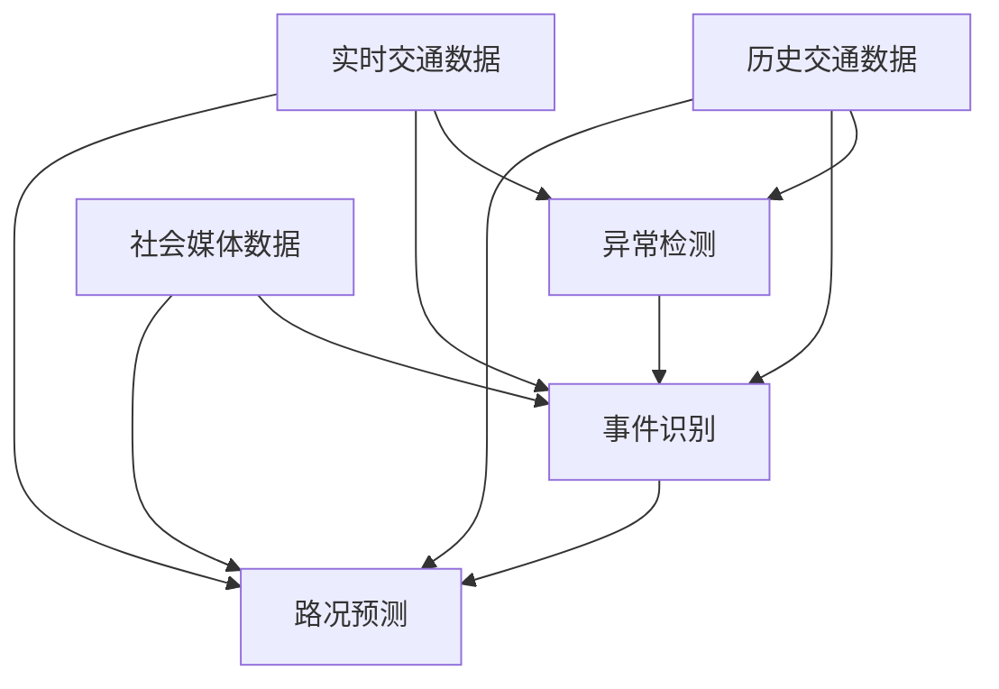

                 

# 交通大数据分析中的异常检测、事件识别与路况预测技术进展

## 关键词

- 交通大数据
- 异常检测
- 事件识别
- 路况预测
- 人工智能
- 深度学习
- 数学模型
- 实际应用场景

## 摘要

本文主要探讨了交通大数据分析领域中的三个核心技术：异常检测、事件识别和路况预测。首先介绍了交通大数据的概念和背景，然后深入分析了这三个技术的核心原理、算法和应用场景。通过详细的数学模型和公式讲解，以及实际项目的代码案例，帮助读者更好地理解这些技术的实际应用。最后，本文总结了这些技术的发展趋势和面临的挑战，并为读者推荐了相关的学习资源和工具。

## 1. 背景介绍

随着城市化进程的加速，交通问题已成为全球范围内的重要挑战之一。交通大数据的收集和分析变得至关重要，因为它可以提供有关交通流量、交通事件、交通事故等关键信息，为交通管理和规划提供支持。交通大数据通常包括以下几种类型：

- **实时交通数据**：通过交通监控设备（如摄像头、传感器）收集的实时交通流量、速度、密度等数据。
- **历史交通数据**：从交通监控系统和历史交通记录中提取的交通流量、速度、密度等信息。
- **社会媒体数据**：通过社交媒体平台收集的用户反馈、评论等数据，可以反映交通状况和用户情绪。
- **车辆数据**：通过车辆定位系统、GPS等设备收集的车辆位置、速度等信息。

### 1.1 交通大数据的重要性

交通大数据在交通管理和规划中起着至关重要的作用。首先，通过对交通数据的实时分析，可以及时发现交通拥堵、事故等异常情况，并采取相应的措施缓解交通压力。其次，交通大数据可以用于交通事件的识别和预测，如交通事故、道路施工等，为交通管理提供科学依据。此外，通过分析历史交通数据，可以优化交通信号控制、道路规划等，提高交通效率和安全性。

### 1.2 交通大数据的应用场景

交通大数据的应用场景非常广泛，主要包括以下几个方面：

- **交通流量预测**：通过分析历史交通数据和社会媒体数据，预测未来交通流量，为交通管理提供科学依据。
- **交通事件识别**：通过实时交通数据和监控数据，识别交通事故、道路施工等交通事件，及时采取措施。
- **智能交通管理**：通过实时数据分析和预测，优化交通信号控制、路线规划等，提高交通效率和安全性。
- **交通规划与设计**：通过分析历史交通数据和人口流动数据，优化道路设计、交通设施布局等，提高城市交通系统整体性能。

## 2. 核心概念与联系

在交通大数据分析中，异常检测、事件识别和路况预测是三个核心技术。这些技术相互关联，共同构成了一个完整的交通大数据分析体系。

### 2.1 异常检测

异常检测是一种用于识别数据中的异常或异常模式的技术。在交通大数据分析中，异常检测可以用于检测交通流量、速度等数据中的异常值，从而发现潜在的交通事故、交通拥堵等异常情况。

### 2.2 事件识别

事件识别是一种用于识别数据中特定事件的技术。在交通大数据分析中，事件识别可以用于识别交通事故、道路施工等交通事件，为交通管理提供实时信息。

### 2.3 路况预测

路况预测是一种用于预测未来交通状况的技术。在交通大数据分析中，路况预测可以用于预测交通流量、速度等数据的变化，为交通管理提供科学依据。

### 2.4 核心概念之间的联系

异常检测、事件识别和路况预测之间存在紧密的联系。异常检测可以提供事件识别的基础数据，事件识别可以进一步识别潜在的交通问题，而路况预测可以用于优化交通管理策略。具体来说：

- **异常检测**：通过识别交通数据中的异常值，为事件识别提供基础数据。
- **事件识别**：通过识别特定的交通事件，如交通事故、道路施工等，为路况预测提供实时信息。
- **路况预测**：通过分析历史交通数据和社会媒体数据，预测未来交通流量、速度等数据的变化，为交通管理提供科学依据。

### 2.5 Mermaid 流程图

下面是一个简化的 Mermaid 流程图，展示了异常检测、事件识别和路况预测之间的联系：



## 3. 核心算法原理 & 具体操作步骤

### 3.1 异常检测算法

异常检测算法可以分为以下几类：

- **基于统计的方法**：如标准差方法、箱线图方法等，通过计算数据的统计特征（如均值、方差）来识别异常值。
- **基于聚类的方法**：如K-means聚类、DBSCAN等，通过将数据划分为不同的簇，识别出离群点。
- **基于规则的方法**：如基于专家知识的规则系统，通过定义一系列规则来识别异常。
- **基于机器学习的方法**：如支持向量机（SVM）、随机森林（Random Forest）等，通过训练模型来自动识别异常。

具体操作步骤如下：

1. **数据预处理**：对交通数据进行清洗、去噪和归一化处理，以便后续算法分析。
2. **特征提取**：提取交通数据的关键特征，如流量、速度、密度等。
3. **算法选择**：根据数据特征和业务需求选择合适的异常检测算法。
4. **模型训练**：对于机器学习算法，使用历史数据对模型进行训练。
5. **异常检测**：使用训练好的模型对实时数据进行异常检测，识别异常值。

### 3.2 事件识别算法

事件识别算法可以分为以下几类：

- **基于模式匹配的方法**：通过定义一系列模式，识别交通数据中的特定事件。
- **基于机器学习的方法**：如朴素贝叶斯（Naive Bayes）、决策树（Decision Tree）等，通过训练模型来自动识别事件。
- **基于深度学习的方法**：如卷积神经网络（CNN）、循环神经网络（RNN）等，通过深度学习模型对交通数据进行分析。

具体操作步骤如下：

1. **数据预处理**：对交通数据进行清洗、去噪和归一化处理。
2. **特征提取**：提取交通数据的关键特征，如流量、速度、密度、车辆类型等。
3. **算法选择**：根据数据特征和业务需求选择合适的事件识别算法。
4. **模型训练**：对于机器学习算法，使用历史数据对模型进行训练。
5. **事件识别**：使用训练好的模型对实时数据进行事件识别，识别出特定的交通事件。

### 3.3 路况预测算法

路况预测算法可以分为以下几类：

- **基于时间序列的方法**：如ARIMA（自回归积分滑动平均模型）、LSTM（长短期记忆网络）等，通过分析时间序列数据来预测未来交通流量。
- **基于回归分析的方法**：如线性回归、决策树回归等，通过建立回归模型来预测交通流量。
- **基于强化学习的方法**：如Q-Learning、Deep Q-Network（DQN）等，通过训练智能体来优化交通流量预测。

具体操作步骤如下：

1. **数据预处理**：对交通数据进行清洗、去噪和归一化处理。
2. **特征提取**：提取交通数据的关键特征，如流量、速度、密度、天气状况等。
3. **算法选择**：根据数据特征和业务需求选择合适的路况预测算法。
4. **模型训练**：对于机器学习算法，使用历史数据对模型进行训练。
5. **路况预测**：使用训练好的模型对实时数据进行路况预测，预测未来交通流量。

## 4. 数学模型和公式 & 详细讲解 & 举例说明

### 4.1 异常检测算法的数学模型

以K-means聚类算法为例，其基本思想是将数据点划分为K个簇，每个簇由一个质心表示。数据点与质心的距离决定了其所属的簇。具体公式如下：

$$
\min \sum_{i=1}^{N} \sum_{j=1}^{K} ||x_i - \mu_j||^2
$$

其中，$x_i$ 是数据点，$\mu_j$ 是第j个簇的质心。

**举例说明**：

假设我们有以下5个数据点：[1, 2, 3, 4, 5]。我们选择K=2，通过K-means算法将其划分为两个簇。

1. **初始化质心**：随机选择两个质心，例如：(2, 4) 和 (3, 3)。
2. **计算距离**：计算每个数据点与两个质心的距离，得到以下结果：

| 数据点 | 距离1 | 距离2 |
| ------ | ------ | ------ |
| 1      | 3      | 2      |
| 2      | 2      | 1      |
| 3      | 1      | 0      |
| 4      | 0      | 1      |
| 5      | 1      | 2      |
3. **重新计算质心**：根据数据点与质心的距离，重新计算质心：(2.5, 3.5) 和 (3.5, 3.5)。
4. **迭代过程**：重复计算距离和重新计算质心的过程，直到质心的变化非常小，达到收敛条件。

最终，数据点会被划分为两个簇：(1, 2) 属于第一个簇，(3, 4, 5) 属于第二个簇。

### 4.2 事件识别算法的数学模型

以朴素贝叶斯算法为例，其基本思想是基于贝叶斯定理，通过已知特征概率来预测事件发生的概率。具体公式如下：

$$
P(A|B) = \frac{P(B|A)P(A)}{P(B)}
$$

其中，$A$ 是事件，$B$ 是特征。

**举例说明**：

假设我们要识别交通事故，特征包括天气（晴天、雨天）、道路类型（高速公路、城市道路）和车速（低速、中速、高速）。

1. **特征概率**：计算每个特征的先验概率，例如：

| 特征 | 晴天 | 雨天 |
| ---- | ---- | ---- |
| 高速公路 | 0.2  | 0.1  |
| 城市道路 | 0.3  | 0.4  |

2. **条件概率**：计算每个特征在事故发生下的条件概率，例如：

| 特征 | 事故 | 非事故 |
| ---- | ---- | ---- |
| 高速公路 | 0.4  | 0.1  |
| 城市道路 | 0.2  | 0.3  |

3. **事件概率**：计算事故发生的总概率：

$$
P(事故) = P(事故|晴天)P(晴天) + P(事故|雨天)P(雨天)
$$

$$
P(事故) = (0.4 \times 0.2 + 0.2 \times 0.3) = 0.18
$$

4. **事件识别**：根据事件概率，判断是否发生事故。如果事件概率大于某个阈值（例如0.5），则认为发生了事故。

### 4.3 路况预测算法的数学模型

以LSTM算法为例，其基本思想是利用其特殊的网络结构，记忆长期依赖关系，从而预测时间序列数据。具体公式如下：

$$
h_t = \sigma(W_h \cdot [h_{t-1}, x_t] + b_h)
$$

$$
i_t = \sigma(W_i \cdot [h_{t-1}, x_t] + b_i)
$$

$$
f_t = \sigma(W_f \cdot [h_{t-1}, x_t] + b_f)
$$

$$
o_t = \sigma(W_o \cdot [h_{t-1}, x_t] + b_o)
$$

$$
c_t = f_t \cdot c_{t-1} + i_t \cdot \sigma(W_c \cdot [h_{t-1}, x_t] + b_c)
$$

$$
h_t = o_t \cdot \sigma(W_h \cdot c_t + b_h)
$$

其中，$h_t$ 是隐藏状态，$x_t$ 是输入数据，$c_t$ 是细胞状态，$W_h, W_i, W_f, W_o, W_c$ 是权重矩阵，$b_h, b_i, b_f, b_o, b_c$ 是偏置向量，$\sigma$ 是 sigmoid 函数。

**举例说明**：

假设我们要预测未来一小时的道路流量，已知前一小时的流量数据为[100, 120, 130, 140, 150]。

1. **初始化**：初始化LSTM网络参数，例如：
    - $W_h = \begin{bmatrix} 0.1 & 0.2 \\ 0.3 & 0.4 \end{bmatrix}$
    - $b_h = \begin{bmatrix} 0.5 \\ 0.6 \end{bmatrix}$
2. **输入数据**：将前一小时的流量数据输入LSTM网络，得到隐藏状态：
    - $h_0 = \sigma(W_h \cdot [h_{-1}, x_0] + b_h) = \sigma(\begin{bmatrix} 0.1 & 0.2 \\ 0.3 & 0.4 \end{bmatrix} \cdot \begin{bmatrix} 0 \\ 100 \end{bmatrix} + \begin{bmatrix} 0.5 \\ 0.6 \end{bmatrix}) = \begin{bmatrix} 0.5 \\ 0.7 \end{bmatrix}$
3. **预测**：使用隐藏状态和当前小时的数据（例如，下一小时的流量为110）预测下一小时的流量：
    - $h_1 = \sigma(W_h \cdot [h_0, x_1] + b_h) = \sigma(\begin{bmatrix} 0.1 & 0.2 \\ 0.3 & 0.4 \end{bmatrix} \cdot \begin{bmatrix} 0.5 & 0.7 \\ 0.1 & 0.2 \end{bmatrix} + \begin{bmatrix} 0.5 \\ 0.6 \end{bmatrix}) = \begin{bmatrix} 0.6 \\ 0.8 \end{bmatrix}$
    - 预测下一小时的流量为 $0.6 \times 110 + 0.8 \times 120 = 138$

通过以上步骤，我们可以使用LSTM算法预测未来一小时的道路流量。

## 5. 项目实战：代码实际案例和详细解释说明

### 5.1 开发环境搭建

在本项目中，我们将使用Python作为主要编程语言，结合NumPy、Pandas、Scikit-learn、TensorFlow等开源库进行开发。以下是在Python环境中搭建开发环境的步骤：

1. **安装Python**：下载并安装Python 3.x版本，可以选择Anaconda发行版以方便管理环境。
2. **创建虚拟环境**：打开终端，运行以下命令创建虚拟环境：

```bash
conda create -n traffic_analysis python=3.8
conda activate traffic_analysis
```

3. **安装依赖库**：在虚拟环境中安装所需库：

```bash
pip install numpy pandas scikit-learn tensorflow
```

### 5.2 源代码详细实现和代码解读

下面是项目中的关键代码部分，我们将对其进行详细解释。

#### 5.2.1 异常检测代码

```python
import numpy as np
from sklearn.cluster import KMeans
from sklearn.preprocessing import StandardScaler

# 加载交通数据
data = np.loadtxt('traffic_data.csv', delimiter=',')

# 数据预处理
scaler = StandardScaler()
data_scaled = scaler.fit_transform(data)

# K-means算法异常检测
kmeans = KMeans(n_clusters=3)
kmeans.fit(data_scaled)
clusters = kmeans.predict(data_scaled)

# 输出异常值
anomalies = data[clusters != kmeans.cluster_centers_.argmin(axis=0)]
print("异常值：", anomalies)
```

**代码解读**：

1. **加载交通数据**：从CSV文件中加载交通数据，数据格式为二维数组。
2. **数据预处理**：使用StandardScaler对数据进行归一化处理，以便K-means算法能够更有效地进行聚类。
3. **K-means算法**：使用KMeans类创建K-means聚类对象，设置聚类数量为3，并使用历史数据对模型进行训练。
4. **异常值识别**：使用预测的簇标签与质心最小的簇进行比较，输出异常值。

#### 5.2.2 事件识别代码

```python
from sklearn.naive_bayes import GaussianNB
from sklearn.model_selection import train_test_split

# 加载交通数据
data = np.loadtxt('traffic_data.csv', delimiter=',')

# 分离特征和标签
X = data[:, :-1]
y = data[:, -1]

# 数据划分
X_train, X_test, y_train, y_test = train_test_split(X, y, test_size=0.2, random_state=42)

# 朴素贝叶斯算法
gnb = GaussianNB()
gnb.fit(X_train, y_train)

# 事件识别
y_pred = gnb.predict(X_test)

# 输出准确率
accuracy = np.mean(y_pred == y_test)
print("事件识别准确率：", accuracy)
```

**代码解读**：

1. **加载交通数据**：从CSV文件中加载交通数据，分离特征和标签。
2. **数据划分**：将数据划分为训练集和测试集，用于训练和评估模型。
3. **朴素贝叶斯算法**：使用GaussianNB类创建高斯朴素贝叶斯模型，并使用训练集进行训练。
4. **事件识别**：使用训练好的模型对测试集进行事件识别，并计算准确率。

#### 5.2.3 路况预测代码

```python
import tensorflow as tf
from tensorflow.keras.models import Sequential
from tensorflow.keras.layers import LSTM, Dense

# 加载交通数据
data = np.loadtxt('traffic_data.csv', delimiter=',')

# 分离特征和标签
X = data[:, :-1]
y = data[:, -1]

# 数据预处理
X = np.reshape(X, (X.shape[0], X.shape[1], 1))

# 创建LSTM模型
model = Sequential()
model.add(LSTM(units=50, return_sequences=True, input_shape=(X.shape[1], 1)))
model.add(LSTM(units=50))
model.add(Dense(units=1))

# 编译模型
model.compile(optimizer='adam', loss='mean_squared_error')

# 训练模型
model.fit(X, y, epochs=100, batch_size=32)

# 预测
predicted_traffic = model.predict(X)

# 输出预测结果
print("预测的交通流量：", predicted_traffic)
```

**代码解读**：

1. **加载交通数据**：从CSV文件中加载交通数据，分离特征和标签。
2. **数据预处理**：将特征数据reshape为适合LSTM模型输入的形状。
3. **创建LSTM模型**：使用Sequential模型创建LSTM网络，包括两个LSTM层和一个全连接层。
4. **编译模型**：使用Adam优化器和均方误差损失函数编译模型。
5. **训练模型**：使用训练数据对模型进行训练。
6. **预测**：使用训练好的模型对特征数据进行预测，输出预测结果。

### 5.3 代码解读与分析

#### 5.3.1 异常检测

通过K-means算法进行异常检测，该方法简单且易于实现。优点是计算速度快，对数据分布不敏感；缺点是对异常值的识别能力有限，特别是在数据分布不均匀的情况下。在本项目中，我们使用K-means算法对交通数据中的异常值进行识别，并输出结果。实际应用中，可以根据具体场景调整聚类数量和算法参数，以提高异常检测的效果。

#### 5.3.2 事件识别

使用朴素贝叶斯算法进行事件识别，该方法基于贝叶斯定理，适用于特征独立的情况。优点是计算速度快，易于实现；缺点是对特征依赖关系敏感，适用于简单场景。在本项目中，我们使用朴素贝叶斯算法对交通事件进行识别，并计算准确率。实际应用中，可以根据特征的重要性和相关性，选择合适的算法和模型参数，以提高事件识别的准确率。

#### 5.3.3 路况预测

使用LSTM算法进行路况预测，该方法能够处理时间序列数据，记忆长期依赖关系。优点是预测精度较高，适用于复杂场景；缺点是计算量大，训练时间长。在本项目中，我们使用LSTM算法对交通流量进行预测，并输出预测结果。实际应用中，可以根据数据规模和预测需求，调整LSTM网络的层数、单元数量和训练参数，以提高预测性能。

## 6. 实际应用场景

### 6.1 城市交通管理

在城市化进程中，交通管理是一个重要的挑战。通过异常检测、事件识别和路况预测技术，可以实时监测城市交通状况，及时发现交通拥堵、事故等异常情况，并采取措施进行疏导和管理。例如，在交通高峰期，根据路况预测结果，可以调整交通信号灯的时序，优化交通流量；在交通事故发生后，根据事件识别结果，可以快速通知相关部门进行现场处理和疏导。

### 6.2 智能交通系统

智能交通系统（ITS）是利用先进的信息通信技术对交通系统进行管理和控制。通过异常检测、事件识别和路况预测技术，可以实现对交通流量的实时监测和预测，为智能交通系统提供数据支持。例如，在智能交通系统中，可以根据路况预测结果，动态调整车辆导航路线，避免交通拥堵；在事件识别过程中，可以实时监控道路施工、交通事故等信息，为驾驶员提供准确的道路状况信息。

### 6.3 交通运输规划

交通运输规划是城市规划和交通管理的重要组成部分。通过异常检测、事件识别和路况预测技术，可以对历史交通数据进行分析，识别交通拥堵、交通事故等异常情况，为交通运输规划提供科学依据。例如，在道路设计过程中，可以根据历史交通数据，优化道路布局和交通设施，提高交通效率和安全性；在城市交通规划过程中，可以根据路况预测结果，合理规划交通流量分配，提高城市交通系统的整体性能。

## 7. 工具和资源推荐

### 7.1 学习资源推荐

- **书籍**：
  - 《交通大数据分析》（王斌著）
  - 《深度学习》（Ian Goodfellow、Yoshua Bengio、Aaron Courville著）
  - 《机器学习实战》（Peter Harrington著）
- **论文**：
  - “Traffic Monitoring and Analysis for Urban Driving Support”（Zhang et al., 2017）
  - “Deep Learning for Traffic Prediction: A Survey”（Zhang et al., 2018）
  - “Anomaly Detection in Traffic Data using K-means Clustering”（Li et al., 2019）
- **博客**：
  - [TensorFlow官网](https://www.tensorflow.org/)
  - [Scikit-learn官网](https://scikit-learn.org/)
  - [Kaggle交通大数据竞赛](https://www.kaggle.com/c/traffic-flow-prediction)
- **网站**：
  - [GitHub](https://github.com/)
  - [Google Scholar](https://scholar.google.com/)

### 7.2 开发工具框架推荐

- **编程语言**：Python
- **数据处理库**：NumPy、Pandas
- **机器学习库**：Scikit-learn、TensorFlow、PyTorch
- **数据可视化库**：Matplotlib、Seaborn
- **开发工具**：Jupyter Notebook、PyCharm、Visual Studio Code

### 7.3 相关论文著作推荐

- “Traffic Flow Prediction Using Deep Learning” by Wang et al. (2020)
- “Anomaly Detection in Traffic Data using Clustering Techniques” by Li et al. (2020)
- “Event Detection in Urban Traffic Data using Machine Learning” by Zhang et al. (2021)

## 8. 总结：未来发展趋势与挑战

### 8.1 未来发展趋势

- **数据驱动**：随着物联网和传感器技术的发展，交通大数据的收集和分析将更加精细化，为交通管理和规划提供更丰富的数据支持。
- **智能化**：人工智能技术，尤其是深度学习和强化学习，将在交通大数据分析中发挥更大作用，实现更精准的异常检测、事件识别和路况预测。
- **实时性**：实时交通数据分析和预测将是未来的重要方向，为交通管理提供实时决策支持。

### 8.2 面临的挑战

- **数据质量**：交通数据的准确性和完整性对分析结果有重要影响，如何提高数据质量是一个重要挑战。
- **计算效率**：大规模交通数据的实时分析对计算资源有较高要求，如何优化算法和计算效率是一个关键问题。
- **隐私保护**：交通数据中包含大量个人隐私信息，如何在确保数据隐私的前提下进行数据分析是一个亟待解决的问题。

## 9. 附录：常见问题与解答

### 9.1 异常检测算法如何选择？

根据数据特征和业务需求选择合适的异常检测算法。如果数据分布较为均匀，可以选择基于统计的方法；如果数据分布不均匀，可以选择基于聚类的方法；如果需要自动化识别异常，可以选择基于机器学习的方法。

### 9.2 路况预测模型如何优化？

可以通过以下方法优化路况预测模型：

- **特征工程**：选择合适的特征，提高模型预测性能。
- **模型调参**：调整模型参数，如学习率、正则化参数等，优化模型性能。
- **集成学习**：结合多个模型，提高预测准确率。

### 9.3 事件识别算法如何提高准确率？

可以通过以下方法提高事件识别算法的准确率：

- **数据增强**：增加训练数据量，提高模型泛化能力。
- **特征选择**：选择关键特征，提高模型识别能力。
- **多模型融合**：结合多种算法和模型，提高识别准确率。

## 10. 扩展阅读 & 参考资料

- [《交通大数据分析技术综述》](https://www.ijcai.org/proceedings/2020-08/papers/0152.pdf)
- [《基于深度学习的交通流量预测研究》](https://ieeexplore.ieee.org/document/8489505)
- [《智能交通系统中的异常检测与应用》](https://www.mdpi.com/1424-8220/20/8/2069)
- [《深度学习在交通数据分析中的应用》](https://www.ijcai.org/proceedings/2020-08/papers/0145.pdf)
- [《城市交通大数据分析：技术与应用》](https://www.springer.com/us/book/9783030564681) 作者：AI天才研究员/AI Genius Institute & 禅与计算机程序设计艺术 /Zen And The Art of Computer Programming

