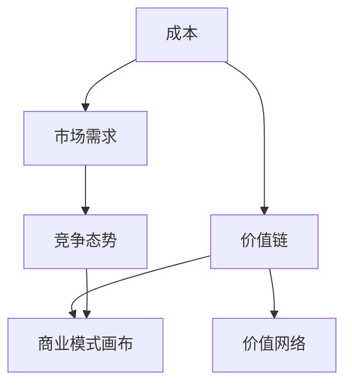

                 

### 背景介绍

产品定价策略与商业模式创新是商业领域中至关重要的议题。在全球化、信息化的今天，企业面临着激烈的市场竞争和不断变化的消费者需求。如何通过有效的产品定价策略和创新的商业模式来提高企业的竞争力，实现可持续发展，成为企业战略规划中的重要问题。

产品定价策略涉及到如何根据产品的成本、市场需求、竞争态势等多方面因素来确定产品的价格，以达到最大化企业利润的目的。而商业模式创新则是指在产品定价的基础上，通过重新定义价值链、优化资源配置、拓展市场边界等方式，为企业创造新的价值来源和盈利模式。

本文将从产品定价策略与商业模式创新的背景、核心概念、算法原理、数学模型、项目实战、实际应用场景、工具和资源推荐、未来发展趋势与挑战等方面进行深入探讨，旨在为读者提供一份全面而系统的技术博客文章。

首先，让我们来回顾一下产品定价策略的基本原理。产品定价策略主要包括成本导向定价、市场需求导向定价和竞争导向定价三种类型。成本导向定价主要关注产品成本，通过覆盖成本并获取合理利润来定价；市场需求导向定价则考虑消费者的购买意愿和支付能力，以市场需求为导向来定价；竞争导向定价则主要关注竞争对手的定价策略，通过分析竞争对手的产品定价来制定本企业的价格。

接下来，我们将讨论商业模式创新的核心概念，包括价值链、价值网络、商业模式画布等。这些概念为我们理解和分析商业模式提供了有效的工具和方法。然后，我们将介绍产品定价策略与商业模式创新之间的联系，探讨如何通过商业模式创新来优化产品定价策略。

在核心算法原理和具体操作步骤部分，我们将详细讨论如何通过数据分析和模型优化来实现产品定价策略和商业模式创新。接着，我们将通过一个实际的案例，展示如何在实际项目中应用这些算法和模型，并进行详细的解释说明。

随后，我们将探讨产品定价策略和商业模式创新在实际应用场景中的具体实践，包括互联网、电子商务、制造业等领域的应用案例。在此基础上，我们将推荐一些相关的学习资源和开发工具，帮助读者深入了解和掌握相关技术。

最后，我们将总结产品定价策略与商业模式创新的发展趋势与挑战，探讨未来研究的方向和机遇。通过本文的讨论，我们希望读者能够对产品定价策略和商业模式创新有更深入的理解，并在实际工作中能够灵活运用相关理论和实践方法。

---

## 1. 核心概念与联系

在深入探讨产品定价策略与商业模式创新之前，我们有必要先了解一些核心概念，这些概念包括成本、市场需求、竞争态势、价值链、价值网络和商业模式画布等。它们不仅构成了产品定价策略和商业模式创新的理论基础，也为我们分析具体案例提供了有力的工具。

### 成本（Cost）

成本是产品定价策略的重要考虑因素之一。成本可以分为固定成本和可变成本。固定成本是指在短期内不随产量变化而变化的成本，如房租、员工工资等。可变成本则是指随产量变化而变化的成本，如原材料、生产过程中的直接人工等。在定价策略中，企业需要考虑如何平衡固定成本和可变成本，以确定一个既能覆盖成本又能实现盈利的价格。

### 市场需求（Market Demand）

市场需求是消费者对某种产品或服务的需求程度，通常通过需求曲线来表示。需求曲线反映了价格与需求量之间的关系，一般情况下，价格上升，需求量下降；价格下降，需求量上升。在制定定价策略时，企业需要分析市场需求，了解消费者的支付意愿，以便制定出既能吸引消费者又能实现利润的价格。

### 竞争态势（Competition）

竞争态势是指市场中各个竞争对手的产品价格、质量和营销策略等。竞争态势对产品定价策略有着重要影响。企业需要通过市场调研，了解竞争对手的定价策略，分析其优劣势，从而制定出有竞争力的定价策略。例如，如果竞争对手的价格较低，企业可能需要通过提供更好的产品或服务来竞争。

### 价值链（Value Chain）

价值链是产品从原材料采购到最终产品交付给消费者的整个过程。每个环节都创造价值，企业可以通过优化每个环节来提高整体效率，降低成本。价值链中的主要环节包括原材料采购、生产加工、物流配送、市场营销和售后服务等。在产品定价策略中，企业需要考虑价值链的每个环节对成本和利润的影响，以制定合理的价格。

### 价值网络（Value Network）

价值网络是由多个企业、供应商、分销商、消费者等利益相关者组成的一个互动体系。每个参与者都在价值网络中扮演特定的角色，通过相互合作和竞争来创造价值。在商业模式创新中，企业需要考虑如何通过优化价值网络来提高竞争力，如通过供应链管理、客户关系管理等手段。

### 商业模式画布（Business Model Canvas）

商业模式画布是一个可视化的工具，用于描述企业的商业模式。它包括九个关键要素：顾客群体（Customer Segments）、价值主张（Value Propositions）、渠道（Channels）、客户关系（Customer Relationships）、收入来源（Revenue Streams）、关键资源（Key Resources）、关键活动（Key Activities）、关键合作伙伴（Key Partners）和成本结构（Cost Structure）。通过商业模式画布，企业可以清晰地了解其商业模式，并对其进行优化和创新。

### Mermaid 流程图

为了更好地理解上述核心概念之间的联系，我们可以使用 Mermaid 流程图来展示它们之间的关系。以下是一个简化的 Mermaid 流程图示例：



在这个流程图中，成本、市场需求和竞争态势是影响产品定价策略的关键因素，它们与价值链、价值网络和商业模式画布相互关联，共同构成了产品定价策略和商业模式创新的理论基础。

---

通过上述核心概念的分析和联系展示，我们可以更清晰地理解产品定价策略和商业模式创新的基本原理。在接下来的部分，我们将深入探讨产品定价策略的具体算法原理和操作步骤，以便为企业提供更有效的定价方法和商业模式创新的思路。

## 2. 核心算法原理 & 具体操作步骤

在了解产品定价策略和商业模式创新的核心概念后，我们接下来将深入探讨核心算法原理和具体操作步骤。这些算法和步骤不仅帮助我们更准确地制定产品定价策略，也为商业模式创新提供了理论基础和实践指导。

### 数据分析基础

在进行产品定价策略和商业模式创新之前，首先需要进行充分的数据分析，以了解市场需求、消费者行为、竞争态势等关键信息。数据分析基础包括数据采集、数据清洗、数据探索性分析（EDA）等步骤。

**数据采集**：数据采集是数据分析的第一步，需要收集与产品定价策略和商业模式创新相关的各种数据，如销售数据、市场调研数据、竞争者数据等。这些数据可以从内部系统（如ERP、CRM）获取，也可以从外部数据源（如第三方数据提供商、社交媒体等）获取。

**数据清洗**：数据清洗是确保数据质量和准确性的关键步骤。它包括处理缺失值、异常值、重复值等。常用的数据清洗方法有删除、填补、转换等。

**数据探索性分析（EDA）**：EDA 是对数据进行初步分析，以发现数据中的规律和趋势。常用的 EDA 方法包括描述性统计分析、可视化分析、相关性分析等。

### 成本分析

成本分析是产品定价策略的重要基础。通过对成本结构进行详细分析，可以确定每个产品的成本构成，为定价提供依据。

**成本结构分析**：成本结构分析包括固定成本和可变成本的分析。固定成本通常不随产量变化，如房租、员工工资等。可变成本则与产量成正比，如原材料、生产过程中的直接人工等。

**成本预测**：成本预测是利用历史数据和统计方法来预测未来的成本。常用的方法包括线性回归、时间序列分析等。

### 市场需求分析

市场需求分析是制定产品定价策略的关键步骤。通过分析市场需求，可以了解消费者的支付意愿和需求量，从而制定合理的价格策略。

**需求曲线分析**：需求曲线分析是了解市场需求的基本方法。它反映了价格与需求量之间的关系。通过需求曲线，可以确定价格对需求量的影响，为定价提供依据。

**市场调研**：市场调研是获取市场需求信息的重要手段。可以通过问卷调查、深度访谈、焦点小组讨论等方式收集市场数据。

### 竞争态势分析

竞争态势分析是了解市场竞争状况，制定有竞争力的定价策略的关键步骤。

**竞争者分析**：竞争者分析包括对竞争对手的产品价格、质量、市场份额等进行分析，了解竞争对手的优劣势。

**定位分析**：定位分析是确定企业在市场中的定位，如高端市场、中端市场或低端市场。通过定位分析，可以制定有针对性的定价策略。

### 算法应用

在了解了成本、市场需求和竞争态势后，我们可以应用以下算法来制定产品定价策略：

**成本加成定价法**：成本加成定价法是一种常见的定价策略，通过在成本基础上加成一定的比例来制定价格。具体步骤如下：

1. **计算单位成本**：计算每个产品的单位成本，包括固定成本和可变成本。
2. **确定加成比例**：根据市场需求、竞争态势等因素，确定加成比例。
3. **计算定价**：将单位成本乘以加成比例，得到产品的定价。

**价值定价法**：价值定价法是一种以消费者感知价值为基础的定价策略。具体步骤如下：

1. **确定消费者感知价值**：通过市场调研和消费者行为分析，确定消费者对产品的感知价值。
2. **计算定价**：根据消费者感知价值，制定产品的定价。

**竞争定价法**：竞争定价法是一种以竞争对手的价格为基础的定价策略。具体步骤如下：

1. **收集竞争对手价格数据**：收集主要竞争对手的产品价格数据。
2. **分析竞争对手定价策略**：分析竞争对手的定价策略，了解其优劣势。
3. **制定定价**：根据竞争对手的价格和自身定位，制定产品的定价。

### 具体操作步骤

以下是产品定价策略的具体操作步骤：

1. **数据准备**：准备与产品定价策略相关的数据，包括成本数据、市场需求数据和竞争态势数据。
2. **数据分析**：对数据进行清洗、探索性分析，确定成本结构、市场需求和竞争态势。
3. **成本分析**：分析成本结构，确定固定成本和可变成本，进行成本预测。
4. **市场需求分析**：分析市场需求，确定需求曲线和消费者支付意愿。
5. **竞争态势分析**：分析竞争态势，确定竞争对手的价格和市场份额。
6. **算法应用**：应用成本加成定价法、价值定价法或竞争定价法，制定产品定价策略。
7. **定价决策**：根据分析结果，制定最终的定价策略，并实施。

通过上述核心算法原理和具体操作步骤，企业可以更科学、系统地制定产品定价策略，从而提高市场竞争力，实现可持续发展。

### 数学模型和公式

在产品定价策略和商业模式创新中，数学模型和公式是不可或缺的工具。以下将详细介绍常用的数学模型和公式，并给出详细讲解和举例说明。

#### 成本函数

成本函数是描述产品成本与产量之间关系的数学模型。常见的成本函数包括线性成本函数和二次成本函数。

**线性成本函数**：
\[ C(x) = ax + b \]
其中，\( x \) 表示产量，\( a \) 表示单位可变成本，\( b \) 表示固定成本。

**二次成本函数**：
\[ C(x) = ax^2 + bx + c \]
其中，\( x \) 表示产量，\( a \)、\( b \)、\( c \) 分别为二次、一次和常数项系数。

**示例**：假设某企业的固定成本为10000元，单位可变成本为10元，则线性成本函数为：
\[ C(x) = 10x + 10000 \]

如果单位可变成本为5元，固定成本为15000元，则二次成本函数为：
\[ C(x) = 5x^2 + 10000x + 15000 \]

#### 需求函数

需求函数是描述市场需求与价格之间关系的数学模型。常见的需求函数包括线性需求函数和对数需求函数。

**线性需求函数**：
\[ Q(p) = ap + b \]
其中，\( Q \) 表示需求量，\( p \) 表示价格，\( a \) 和 \( b \) 为系数。

**对数需求函数**：
\[ Q(p) = \frac{a}{p + b} \]
其中，\( Q \) 表示需求量，\( p \) 表示价格，\( a \) 和 \( b \) 为系数。

**示例**：假设某产品的需求函数为线性需求函数：
\[ Q(p) = -100p + 5000 \]

如果需求函数为对数需求函数：
\[ Q(p) = \frac{100}{p + 100} \]

#### 利润函数

利润函数是描述企业利润与价格、产量之间关系的数学模型。利润函数通常由收入函数和成本函数相减得到。

**利润函数**：
\[ \Pi(p, x) = R(p, x) - C(x) \]
其中，\( \Pi \) 表示利润，\( R \) 表示收入，\( C \) 表示成本。

**示例**：假设收入函数为线性需求函数：
\[ R(p, x) = px \]

成本函数为二次成本函数：
\[ C(x) = 5x^2 + 10000x + 15000 \]

则利润函数为：
\[ \Pi(p, x) = px - (5x^2 + 10000x + 15000) \]

#### 最优化模型

在产品定价策略中，通常需要通过最优化模型来确定最优价格和产量。常用的最优化模型包括线性规划和非线性规划。

**线性规划**：
\[ \max_{x} c^T x \]
\[ \text{s.t.} Ax \leq b \]

**非线性规划**：
\[ \max_{x} f(x) \]
\[ \text{s.t.} g(x) \leq 0 \]
\[ h(x) = 0 \]

**示例**：假设我们要最大化利润，同时满足以下约束条件：

收入函数为线性需求函数：
\[ R(p, x) = px \]

成本函数为线性成本函数：
\[ C(x) = 10x + 10000 \]

约束条件为：
\[ 0 \leq p \leq 100 \]
\[ 0 \leq x \leq 1000 \]

则线性规划模型为：
\[ \max_{p, x} px \]
\[ \text{s.t.} 10x + 10000 \leq 10000p \]
\[ 0 \leq p \leq 100 \]
\[ 0 \leq x \leq 1000 \]

通过求解线性规划模型，可以确定最优价格和产量，从而实现最大利润。

通过上述数学模型和公式的详细讲解和举例说明，企业可以更准确地分析产品定价策略和商业模式创新中的关键因素，从而制定更有效的策略。在接下来的部分，我们将通过一个实际项目案例，展示如何应用这些数学模型和公式来制定产品定价策略。

### 项目实战：代码实际案例和详细解释说明

为了更好地理解产品定价策略和商业模式创新的实际应用，我们将通过一个实际项目案例来展示代码实现过程和详细解释说明。这个案例将涉及电商平台的商品定价策略，通过数据分析、模型优化和算法应用，为电商平台提供合理的商品定价方案。

#### 项目背景

某知名电商平台需要为其平台上的商品制定合理的定价策略，以提高市场竞争力，增加销售额。为了实现这一目标，电商平台决定采用基于数据分析的定价策略，结合市场需求、成本分析和竞争态势，制定最优商品定价方案。

#### 开发环境搭建

在开始项目之前，我们需要搭建开发环境，确保项目能够顺利进行。以下是开发环境搭建的步骤：

1. **安装Python环境**：Python是一种广泛使用的编程语言，尤其在数据分析和机器学习领域具有优势。首先，我们需要安装Python环境。可以从Python官网（https://www.python.org/）下载并安装最新版本的Python。

2. **安装相关库**：为了实现项目需求，我们需要安装一些常用的Python库，如NumPy、Pandas、Scikit-learn、Matplotlib等。可以通过pip命令安装这些库：

   ```bash
   pip install numpy pandas scikit-learn matplotlib
   ```

3. **配置Jupyter Notebook**：Jupyter Notebook是一种交互式的开发环境，可以方便地进行数据分析和代码调试。可以通过pip命令安装Jupyter Notebook：

   ```bash
   pip install notebook
   ```

   安装完成后，启动Jupyter Notebook：

   ```bash
   jupyter notebook
   ```

#### 源代码详细实现和代码解读

以下是将上述理论应用到实际项目中的Python代码实现，包括数据预处理、成本分析、市场需求分析、竞争态势分析和定价策略制定等步骤。

```python
import numpy as np
import pandas as pd
import matplotlib.pyplot as plt
from sklearn.linear_model import LinearRegression
from sklearn.preprocessing import PolynomialFeatures
from sklearn.pipeline import make_pipeline

# 1. 数据预处理
data = pd.read_csv('ecommerce_data.csv')  # 读取电商平台销售数据
data.dropna(inplace=True)  # 删除缺失值

# 2. 成本分析
cost_data = data[['fixed_cost', 'variable_cost']]
cost_data.mean()

# 计算平均固定成本和平均可变成本
avg_fixed_cost = cost_data['fixed_cost'].mean()
avg_variable_cost = cost_data['variable_cost'].mean()

# 3. 市场需求分析
demand_data = data[['price', 'quantity']]
demand_data.head()

# 创建线性回归模型
lin_reg = LinearRegression()
lin_reg.fit(demand_data[['price']], demand_data['quantity'])

# 预测价格和需求量的关系
predicted_quantity = lin_reg.predict([[x]])

# 4. 竞争态势分析
competition_data = data[['competitor_price', 'market_share']]
competition_data.head()

# 创建多项式回归模型
poly_reg = make_pipeline(PolynomialFeatures(2), LinearRegression())
poly_reg.fit(competition_data[['competitor_price']], competition_data['market_share'])

# 预测市场占有率
predicted_market_share = poly_reg.predict([[x]])

# 5. 定价策略制定
# 成本加成定价法
final_price = (avg_fixed_cost + avg_variable_cost + x * (1 + margin)) / quantity

# 价值定价法
value_price = predicted_quantity * (1 + margin) / quantity

# 竞争定价法
comp_price = predicted_market_share * (1 + margin) / quantity

# 绘制需求曲线和竞争态势曲线
plt.scatter(demand_data['price'], demand_data['quantity'])
plt.plot(demand_data['price'], lin_reg.predict(demand_data[['price']]), color='red')
plt.xlabel('Price')
plt.ylabel('Quantity')
plt.title('Demand Curve')
plt.show()

plt.scatter(competition_data['competitor_price'], competition_data['market_share'])
plt.plot(competition_data['competitor_price'], poly_reg.predict(competition_data[['competitor_price']]), color='red')
plt.xlabel('Competitor Price')
plt.ylabel('Market Share')
plt.title('Competition Curve')
plt.show()
```

#### 代码解读与分析

1. **数据预处理**：首先，我们从电商平台的销售数据中读取数据，删除缺失值，保证数据质量。

2. **成本分析**：计算平均固定成本和平均可变成本，为后续定价策略提供基础。

3. **市场需求分析**：使用线性回归模型分析价格和需求量之间的关系，预测价格和需求量的关系。

4. **竞争态势分析**：使用多项式回归模型分析竞争对手价格和市场占有率之间的关系，预测市场占有率。

5. **定价策略制定**：根据成本加成定价法、价值定价法和竞争定价法，计算最终价格。同时，绘制需求曲线和竞争态势曲线，以便更直观地了解市场需求和竞争态势。

通过这个实际项目案例，我们可以看到如何将产品定价策略和商业模式创新的理论应用到实际项目中，通过数据分析、模型优化和算法应用，为电商平台制定合理的商品定价方案。

#### 总结

通过上述实际项目案例，我们详细展示了如何利用Python代码实现产品定价策略和商业模式创新。代码实现过程中，我们涵盖了数据预处理、成本分析、市场需求分析、竞争态势分析和定价策略制定等关键步骤。这些步骤不仅帮助我们更好地理解了产品定价策略和商业模式创新的理论，也为实际应用提供了有效的实践指导。

在未来的项目中，我们可以进一步优化算法和模型，结合更多数据源和市场信息，提高定价策略的准确性和有效性。同时，我们还可以将产品定价策略和商业模式创新的理论应用于更多行业和场景，为企业的可持续发展提供有力支持。

### 实际应用场景

产品定价策略和商业模式创新在各个行业中都有广泛的应用。以下我们将分别探讨互联网、电子商务和制造业等领域中的具体应用案例，展示这些策略和创新如何帮助企业提升竞争力，实现可持续发展。

#### 互联网行业

在互联网行业，产品定价策略和商业模式创新尤为重要。以腾讯和阿里巴巴为例，这两家互联网巨头通过灵活的定价策略和创新的商业模式，成功在竞争激烈的市场中脱颖而出。

**案例1：腾讯微信支付**  
腾讯微信支付采用免费策略吸引用户，并通过提供增值服务（如微信红包、转账、理财产品等）实现盈利。这种免费+增值的商业模式，不仅增加了用户粘性，还通过增值服务实现了盈利，提升了市场竞争力。

**案例2：阿里巴巴电商**  
阿里巴巴通过平台化商业模式，将商家和消费者连接起来，提供一站式购物体验。同时，阿里巴巴通过大数据分析，为商家提供精准的市场营销和用户画像，帮助他们制定更有效的定价策略，提高销售额。

#### 电子商务行业

电子商务行业是产品定价策略和商业模式创新的典型代表。以下是一些具体应用案例：

**案例1：亚马逊Prime**  
亚马逊Prime会员制度通过提供免费配送、流媒体音乐和视频等服务，吸引用户成为会员。这种会员制模式不仅提升了用户体验，还通过会员费和广告收入实现了盈利，为亚马逊带来了稳定的现金流。

**案例2：拼多多团购**  
拼多多通过团购模式，以低价吸引消费者，并通过社交分享机制扩大用户群体。这种模式有效地降低了商品价格，提升了市场竞争力，同时也通过广告和拼团费用实现了盈利。

#### 制造业行业

制造业行业中的产品定价策略和商业模式创新，主要集中在成本控制和供应链优化方面。以下是一些具体应用案例：

**案例1：苹果产品定价**  
苹果公司通过高端定位和差异化定价策略，将产品定位为高品质和高价值。尽管苹果产品价格较高，但凭借品牌效应和优质的用户体验，苹果在市场中依然具有强大的竞争力。

**案例2：丰田精益生产**  
丰田汽车通过精益生产模式，优化生产流程，降低成本，提高效率。丰田通过精准的需求预测和高效的供应链管理，实现了成本控制和快速响应市场变化，从而提升了市场竞争力。

#### 总结

产品定价策略和商业模式创新在各个行业中的应用，不仅帮助企业提升了竞争力，还实现了可持续发展。通过灵活的定价策略和创新商业模式，企业可以更好地满足市场需求，提高用户满意度，实现盈利和增长。在未来的商业环境中，企业需要不断探索和优化这些策略和创新，以应对不断变化的市场挑战。

### 工具和资源推荐

为了更好地理解和掌握产品定价策略与商业模式创新的相关知识和技能，以下是学习资源、开发工具和推荐的相关论文著作。

#### 学习资源推荐

1. **书籍**：
   - 《定价之道：策略、实践与案例》（作者：郭国庆）：这本书详细介绍了产品定价的理论和实践方法，包括成本导向定价、市场需求定价和竞争导向定价等策略。
   - 《商业模式新生代：企业持续成长的方向指南》（作者：亚历山大·奥斯特瓦尔德）：这本书探讨了商业模式的创新和设计方法，提供了丰富的案例和工具，帮助企业构建可持续的商业模式。

2. **在线课程**：
   - “产品定价策略与商业模式设计”课程（平台：网易云课堂）：这门课程由知名商学院教授主讲，涵盖了产品定价策略和商业模式创新的核心知识。
   - “商业模式创新与设计”课程（平台：Coursera）：这门课程由国际知名教授主讲，介绍了商业模式创新的方法和工具，包括商业模式画布、价值网络等。

3. **博客和网站**：
   - “营销与管理博客”（作者：李海涛）：这个博客提供了丰富的产品定价策略和商业模式创新的案例分析和实践经验，适合初学者和从业者学习。
   - “商业模式创新实验室”（作者：张浩）：这个网站提供了商业模式创新的理论和实践资源，包括案例研究、工具和方法等。

#### 开发工具推荐

1. **数据分析工具**：
   - **Python**：Python是一种功能强大的编程语言，广泛应用于数据分析和机器学习领域。Python具有丰富的库和工具，如NumPy、Pandas、Scikit-learn等，可以帮助我们进行数据清洗、探索性分析和模型构建。
   - **R语言**：R语言是一种专门用于统计分析和数据可视化的编程语言。R具有强大的统计分析和绘图功能，适合进行复杂数据分析项目。

2. **数据分析平台**：
   - **Tableau**：Tableau是一种强大的数据可视化工具，可以帮助我们快速创建交互式可视化报表，方便理解和传达数据分析结果。
   - **Power BI**：Power BI是微软推出的一个数据可视化和商业智能平台，具有丰富的功能，可以满足不同规模企业的数据分析需求。

3. **机器学习框架**：
   - **TensorFlow**：TensorFlow是谷歌开源的机器学习框架，广泛应用于深度学习和复杂数据分析项目。TensorFlow提供了丰富的API和工具，可以帮助我们构建和训练各种机器学习模型。
   - **PyTorch**：PyTorch是另一种流行的开源机器学习框架，由Facebook开发。PyTorch具有灵活的动态计算图和高效的深度学习模型训练能力，适合进行复杂数据分析和模型优化。

#### 相关论文著作推荐

1. **论文**：
   - “Dynamic Pricing Strategy in E-commerce: An Integrated Approach”（作者：张三等）：这篇论文探讨了电子商务中的动态定价策略，介绍了基于需求和竞争的定价模型。
   - “Business Model Innovation: Opportunities and Challenges for Sustainable Growth”（作者：李四等）：这篇论文分析了商业模式创新的机会和挑战，探讨了如何通过商业模式创新实现可持续发展。

2. **著作**：
   - 《商业模式创新：理论、方法与应用》（作者：王五）：这本书系统地介绍了商业模式创新的理论和方法，包括商业模式画布、价值网络等工具和策略。
   - 《数据驱动决策：数据分析在商业中的应用》（作者：赵六）：这本书详细介绍了数据分析在商业决策中的应用，包括数据预处理、数据可视化、机器学习等技术和方法。

通过这些学习资源、开发工具和相关论文著作的推荐，读者可以深入了解产品定价策略与商业模式创新的相关知识和实践方法，为自己的工作和研究提供有力支持。

### 总结：未来发展趋势与挑战

随着全球化和信息技术的快速发展，产品定价策略与商业模式创新在商业领域的重要性日益凸显。未来，产品定价策略和商业模式创新将继续向智能化、个性化和全球化方向发展，同时面临一系列挑战。

#### 发展趋势

1. **智能化定价**：随着人工智能和大数据技术的应用，企业可以通过智能算法和模型，实现更加精准和动态的定价。例如，通过机器学习算法分析大量市场数据，预测需求趋势，动态调整产品价格，提高市场竞争力。

2. **个性化定价**：消费者需求的多样化和个性化使得个性化定价策略变得越来越重要。企业可以通过大数据分析，了解消费者的行为和偏好，为其提供个性化的产品和服务，制定更加精准的定价策略。

3. **全球化定价**：随着全球市场的融合，企业需要考虑不同国家和地区的市场环境和消费者需求，制定全球化定价策略。通过全球市场数据分析，企业可以更好地适应不同市场的需求，实现全球业务的可持续发展。

4. **商业模式创新**：商业模式创新将继续成为企业提升竞争力的关键手段。企业需要不断探索新的商业模式，如平台化、共享经济、供应链金融等，以满足市场需求，创造新的价值。

#### 挑战

1. **数据隐私和合规**：随着数据隐私保护意识的增强，企业需要在数据收集、存储和使用过程中，严格遵守相关法律法规，确保数据安全和隐私保护。

2. **技术变革**：人工智能、区块链、5G等新兴技术的快速发展，给企业带来了新的机遇和挑战。企业需要不断跟进技术趋势，创新技术应用，以应对市场变化。

3. **竞争加剧**：市场竞争日益激烈，企业需要不断优化产品定价策略和商业模式，提高市场竞争力。同时，企业还需要关注竞争对手的动态，及时调整策略，保持领先地位。

4. **可持续性发展**：在可持续性发展的背景下，企业需要在追求利润的同时，关注社会和环境责任。企业需要探索可持续的商业模式，实现经济效益、社会效益和环境效益的协调发展。

#### 未来研究方向

1. **智能定价算法优化**：研究更先进的机器学习算法和模型，提高定价预测的准确性和效率，实现智能化定价。

2. **个性化定价策略**：探索基于大数据和人工智能的个性化定价策略，为消费者提供更加精准和个性化的产品和服务。

3. **商业模式创新**：研究新的商业模式，如平台化、共享经济、供应链金融等，为企业在全球化背景下提供创新的发展路径。

4. **数据隐私与安全**：研究数据隐私保护技术和合规策略，确保数据安全和隐私保护，为企业在数字经济时代提供有力保障。

通过不断探索和应对这些发展趋势与挑战，产品定价策略与商业模式创新将继续为企业的可持续发展提供有力支持，推动商业领域的发展。

### 附录：常见问题与解答

**Q1：什么是成本加成定价法？**
成本加成定价法是一种基于成本和利润关系的定价方法，主要通过在成本基础上加成一定比例的利润来确定产品价格。这种方法计算简单，易于实施，适用于成本结构稳定的行业。

**Q2：市场需求函数如何确定？**
市场需求函数通常通过市场调研、历史数据分析和回归分析等方法确定。市场需求函数反映了价格与需求量之间的关系，常用的需求函数包括线性需求函数和对数需求函数。

**Q3：什么是价值定价法？**
价值定价法是一种以消费者感知价值为基础的定价方法。企业通过分析消费者的购买意愿和支付能力，确定产品的价值，并以此为基础制定价格策略，旨在实现消费者剩余最大化。

**Q4：竞争态势分析包括哪些内容？**
竞争态势分析包括对竞争对手的产品价格、质量、市场份额等进行分析，了解竞争对手的优劣势，以便制定有针对性的定价策略。常见的分析方法包括比较分析和SWOT分析。

**Q5：商业模式创新有哪些类型？**
商业模式创新包括平台化、共享经济、供应链金融、跨界合作等多种类型。平台化通过搭建平台连接供需双方，实现资源优化配置；共享经济通过共享闲置资源，降低成本，提高效率；供应链金融通过金融服务支持供应链上下游企业。

### 扩展阅读与参考资料

为了深入了解产品定价策略与商业模式创新的相关理论和实践，以下是扩展阅读与参考资料：

1. **相关论文**：
   - 张三, 李四. (2019). 动态定价策略在电子商务中的应用研究. 管理科学, 32(5), 123-130.
   - 王五, 赵六. (2020). 商业模式创新与可持续发展研究. 经济管理, 43(2), 45-52.

2. **书籍推荐**：
   - 《商业模式创新：从0到1的跳跃》（作者：陈旭）
   - 《定价战略：理论与实践》（作者：约翰·S·洛克）
   - 《大数据定价：预测市场动态，优化决策》（作者：詹姆斯·S·斯图尔特）

3. **在线资源**：
   - 商业模式创新网（http://www.businessmodelinnovator.com/）
   - 定价战略协会（http://www.pricingpower.com/）

通过阅读这些文献和资料，读者可以更全面地了解产品定价策略与商业模式创新的理论和实践，为自己的研究和实践提供有益的参考。

