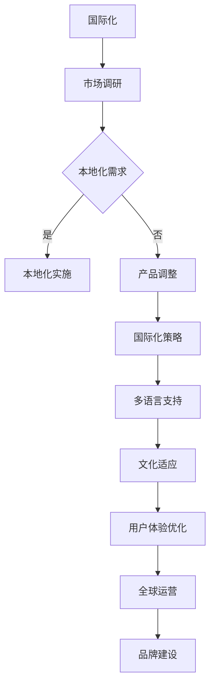
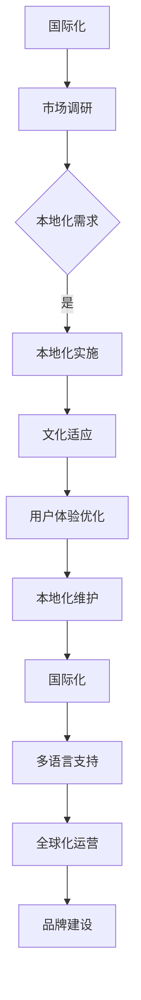

                 

### 背景介绍

在全球化的大背景下，产品本地化和国际化已经成为创业公司实现全球扩张的关键战略。无论是新兴市场还是发达国家，拥有本地化且国际化的产品，企业才能在全球市场上获得竞争优势。然而，这个过程并非易事，它涉及到多方面的挑战和技术难题。首先，本地化不仅仅是语言翻译那么简单，它要求产品能够适应当地文化和用户习惯。其次，国际化则需要考虑到跨地域的运营和市场营销策略。这种复杂性使得创业公司在制定全球化战略时面临诸多决策和挑战。

本文将深入探讨产品本地化与国际化的核心概念、具体操作步骤、数学模型以及实际应用场景，旨在为创业公司提供实用的指导。文章将分为以下几个部分：

1. **核心概念与联系**：介绍本地化与国际化的重要概念，并提供一个简明的Mermaid流程图展示其关系。
2. **核心算法原理与具体操作步骤**：详细讲解实现本地化和国际化的算法原理和步骤。
3. **数学模型和公式**：介绍相关的数学模型和公式，并提供详细讲解和举例说明。
4. **项目实战**：通过一个实际代码案例，展示如何将理论应用到实践中。
5. **实际应用场景**：分析本地化和国际化在不同行业中的应用。
6. **工具和资源推荐**：推荐相关学习资源、开发工具和框架。
7. **总结**：总结文章的主要观点，并探讨未来发展趋势和挑战。
8. **附录**：解答常见问题，提供扩展阅读和参考资料。

通过这篇文章，读者将能够全面了解产品本地化和国际化的策略、技术实现和实际应用，为创业公司在全球市场中取得成功奠定基础。

---

# 产品本地化与国际化：创业公司的全球化挑战

## 关键词：
- 产品本地化
- 产品国际化
- 创业公司
- 全球化战略
- 语言翻译
- 文化适应
- 跨地域运营

## 摘要：

本文旨在探讨创业公司在全球化进程中面临的挑战，特别是产品本地化和国际化的战略。通过深入分析本地化与国际化的重要概念、算法原理、数学模型和实际案例，文章将帮助读者了解如何有效地将产品推向全球市场。本文分为十个部分，从背景介绍到实际应用场景，再到工具和资源推荐，全面覆盖了产品本地化和国际化的各个方面。无论您是初创公司的管理者，还是对全球化战略感兴趣的技术专家，本文都提供了实用的指导和深刻的见解。

---

### 1. 背景介绍

全球化是一个不可逆转的趋势，它不仅改变了全球经济的格局，也对企业的经营模式产生了深远影响。在这个背景下，创业公司必须面对的一个重要问题是如何在全球市场中立足。本地化和国际化作为实现全球扩张的关键策略，已经成为众多创业公司的必修课。

**本地化**指的是将产品或服务按照目标市场的文化和语言进行适度的调整，使之更符合当地用户的需求和习惯。这不仅仅是语言翻译，还包括文化、习俗、用户界面、内容等多个方面的调整。例如，一个中国的电子商务网站，如果想要进入美国市场，就需要考虑如何调整其用户界面、支付方式、物流配送等，以满足美国用户的使用习惯。

**国际化**则是一个更宏观的概念，它不仅涉及到本地化，还包括跨地域的运营和市场推广。国际化不仅仅是将产品推向不同的市场，还需要建立全球化的运营体系，如跨国团队协作、跨国市场调研、全球品牌建设等。例如，一家初创的软件公司，如果想要在国际市场上获得成功，就需要在全球范围内进行市场推广、建立技术支持中心，并确保产品的稳定性。

在全球化过程中，创业公司面临的挑战主要包括以下几个方面：

1. **文化差异**：不同的文化背景会影响用户对产品的接受程度和使用习惯。如何在全球范围内实现文化适应性，是本地化和国际化需要解决的核心问题。
2. **技术难题**：本地化和国际化涉及到多种技术的实现，如多语言支持、地区化数据存储、跨国支付系统等，这需要企业具备较高的技术能力。
3. **市场调研**：了解不同市场的需求和偏好，是制定有效本地化和国际化策略的基础。这需要企业具备强大的市场调研能力。
4. **运营成本**：跨地域的运营和市场推广需要投入大量资源，如何控制成本，确保投资回报，是创业公司需要考虑的重要问题。

为了应对这些挑战，创业公司可以采取以下策略：

1. **建立全球化的团队**：组建跨文化的国际化团队，可以更好地理解和适应不同市场的需求。
2. **加强技术研发**：提高技术能力，确保产品能够适应不同地区的用户需求。
3. **市场调研**：通过深入的市场调研，了解不同市场的需求和偏好，制定有针对性的本地化策略。
4. **合作伙伴关系**：与当地的合作伙伴建立紧密的合作关系，可以更好地适应当地市场。

总之，本地化和国际化是创业公司实现全球化扩张的关键策略。通过有效的本地化和国际化策略，创业公司可以在全球市场中获得竞争优势，实现可持续发展。

---

### 2. 核心概念与联系

在深入探讨产品本地化和国际化的过程中，理解这两个概念之间的联系和区别至关重要。本地化（Localization）和国际化（Internationalization）虽然经常被并提，但它们各自有着独特的内涵和实现路径。

**本地化**指的是将产品或服务调整到特定的目标市场，使其更贴近当地用户的文化、语言和习惯。本地化不仅仅是语言翻译，还包括以下方面的内容：

- **语言翻译**：将产品的用户界面、文档、内容等翻译成目标市场的语言。
- **文化适应**：调整产品内容，以适应不同文化背景的用户。例如，在节日促销活动、食品和饮料菜单、以及用户界面元素等方面，都需要进行文化适应性调整。
- **习惯符合**：确保产品使用习惯符合当地用户的期望。例如，在东亚地区，用户习惯使用滑块调整音量，而在欧美地区，用户习惯使用按钮。

本地化的主要目标是提供一种无缝的用户体验，让用户感觉产品是为他们量身定制的。

**国际化**则是一个更宏观的概念，它涉及到将产品推向多个市场的整体战略。国际化包括以下几个方面：

- **市场调研**：在进入新市场之前，进行深入的市场调研，了解目标市场的需求、偏好和行为习惯。
- **多语言支持**：为产品提供多语言版本，以满足不同语言市场的需求。
- **本地化适配**：在市场调研的基础上，对产品进行本地化调整。
- **全球化运营**：建立跨地域的运营体系，包括物流、支付、客户服务等。
- **品牌建设**：在全球范围内建立品牌认知和品牌形象。

国际化的目标是确保产品能够适应多种文化背景和市场需求，从而在全球市场中获得成功。

为了更清晰地展示本地化和国际化的关系，我们可以使用Mermaid流程图来描述这个过程：



在这个流程图中，国际化是一个从市场调研到品牌建设的整体过程，而本地化则是国际化过程中的一部分，特别是当确定了本地化需求时，才进行本地化实施。本地化的目标是通过文化适应和用户体验优化，为产品在全球市场中获得成功奠定基础。

理解本地化和国际化的联系和区别，对于创业公司制定全球化战略至关重要。通过深入理解这些核心概念，企业可以更好地调整产品，以满足不同市场的需求，从而在全球市场中取得成功。

---

#### 2.1. 本地化与国际化流程详解

本地化和国际化虽然都是全球化战略的重要组成部分，但它们在实际操作中有着不同的流程和步骤。为了更好地理解这两个过程，下面我们将详细探讨本地化和国际化的具体步骤，并使用Mermaid流程图来展示其关系。

**本地化流程：**

1. **需求分析**：在进入目标市场之前，首先要对市场需求进行深入分析。这包括了解目标市场的用户习惯、文化背景、语言需求等。通过市场调研，收集相关的数据和信息，为后续的本地化工作提供基础。

2. **语言翻译**：将产品的用户界面、文档、内容等翻译成目标市场的语言。这一步骤需要专业翻译团队的支持，以确保翻译的准确性和流畅性。

3. **文化适应**：在语言翻译的基础上，对产品内容进行调整，以适应不同文化背景的用户。这包括调整节日促销、食品和饮料菜单、用户界面元素等，以确保产品符合当地文化习惯。

4. **用户测试**：在本地化过程中，进行用户测试是非常重要的。通过用户测试，可以发现本地化过程中可能存在的问题，并进行调整和优化。

5. **本地化维护**：本地化是一个持续的过程，需要不断进行维护和更新。随着市场的变化和用户需求的变化，产品需要不断进行调整和优化，以保持其适应当地市场的能力。

**国际化流程：**

1. **市场调研**：在进入新市场之前，进行深入的市场调研。这包括了解目标市场的经济环境、竞争态势、用户需求等。市场调研的结果将为企业制定国际化战略提供重要的参考。

2. **多语言支持**：为产品提供多语言版本，以满足不同语言市场的需求。这需要技术团队的支持，确保产品能够支持多种语言。

3. **本地化适配**：在市场调研的基础上，对产品进行本地化适配。这包括调整产品功能、界面设计、用户体验等，以确保产品能够适应不同市场的需求。

4. **全球化运营**：建立跨地域的运营体系，包括物流、支付、客户服务等。这需要企业具备较强的跨地域协调和管理能力。

5. **品牌建设**：在全球范围内建立品牌认知和品牌形象。这包括市场推广、公关活动、社交媒体营销等。

**本地化与国际化关系：**

本地化是国际化的一部分，它是在国际化过程中针对特定市场的调整。国际化则是一个整体过程，包括市场调研、多语言支持、本地化适配、全球化运营和品牌建设等。本地化需求通常是在国际化过程中产生的，它是市场调研的结果。通过本地化，企业可以更好地适应当地市场，从而在国际市场上取得成功。

为了更直观地展示本地化和国际化的关系，我们可以使用Mermaid流程图来描述：



通过这个流程图，我们可以清晰地看到本地化和国际化之间的紧密联系。本地化需求是国际化过程中的一个重要输出，它是市场调研的结果。而本地化实施、文化适应、用户体验优化和本地化维护则是确保产品能够适应不同市场的关键步骤。国际化则是在本地化的基础上，通过多语言支持、全球化运营和品牌建设，实现产品的全球推广和品牌建设。

理解本地化和国际化的具体流程和关系，对于创业公司制定全球化战略至关重要。通过系统地执行这些流程，企业可以更好地适应当地市场，从而在全球市场中取得成功。

---

#### 2.2. 国际化与本地化的实际案例分析

为了更好地理解国际化与本地化的实际操作，我们可以通过几个具体的案例来探讨这些策略在不同市场中的应用。这些案例将展示如何通过本地化和国际化，使产品在全球范围内取得成功。

**案例1：亚马逊的全球扩张**

亚马逊是国际化与本地化策略的典型例子。作为一家电商巨头，亚马逊在全球范围内开展了业务。以下是亚马逊在国际化与本地化方面的几个关键步骤：

1. **市场调研**：亚马逊在进入新市场之前，会进行深入的市场调研。这包括了解当地的经济环境、消费者行为、支付习惯等。通过这些调研，亚马逊能够制定有针对性的市场进入策略。

2. **多语言支持**：亚马逊为多个市场的用户提供多语言界面。例如，在进入日本市场时，亚马逊提供了日文界面，使得日本用户能够更轻松地浏览和使用亚马逊的产品。

3. **文化适应**：亚马逊会根据当地文化对产品进行调整。例如，在日本市场，亚马逊推出了特别针对日本用户需求的商品，如动漫周边商品和传统日本手工艺品。

4. **本地化支付**：亚马逊支持多种本地支付方式，如信用卡、PayPal、本地电子钱包等。这确保了用户能够方便地完成购物。

5. **物流优化**：亚马逊在全球范围内建立了多个物流中心，以确保产品能够快速送达。例如，亚马逊在欧洲市场建立了多个物流中心，以满足当地用户的快速配送需求。

通过这些本地化和国际化的策略，亚马逊成功地在全球市场上建立了强大的品牌影响力。

**案例2：Airbnb的全球化扩展**

Airbnb作为共享经济的代表，其全球化扩展也依赖于有效的本地化和国际化策略。以下是Airbnb在国际化与本地化方面的几个关键步骤：

1. **本地化界面**：Airbnb为不同市场的用户提供本地化界面，包括语言翻译和文化元素。例如，在进入中国市场时，Airbnb提供了中文界面，并增加了对中国文化的尊重和适应。

2. **文化适应**：Airbnb会根据当地文化对产品进行调整。例如，在东南亚市场，Airbnb推出了针对当地用户需求的特色房源，如海滩别墅和度假村。

3. **本地化服务**：Airbnb在全球范围内建立了本地化的客户服务团队，以确保用户在预订和入住过程中能够获得及时的帮助。

4. **支付方式**：Airbnb支持多种本地支付方式，如银行转账、电子钱包等，以满足不同市场的支付习惯。

5. **社区建设**：Airbnb通过举办社区活动，与当地居民建立联系，增强了品牌的本地化形象。

通过这些策略，Airbnb成功地在全球范围内获得了用户的高度认可。

**案例3：谷歌的全球化布局**

谷歌作为全球领先的技术公司，其全球化策略不仅涉及到产品本地化，还包括跨国运营和市场推广。以下是谷歌在国际化与本地化方面的几个关键步骤：

1. **多语言支持**：谷歌提供了超过100种语言的搜索服务，使得全球用户都能够使用谷歌进行搜索。

2. **本地化内容**：谷歌通过收购本地内容提供商，如YouTube的当地版块，丰富了其内容库，以适应当地用户的需求。

3. **地区化广告**：谷歌的广告系统可以根据用户的地理位置、语言和其他因素，提供地区化的广告内容。

4. **数据中心**：谷歌在全球建立了多个数据中心，以确保其服务的稳定性和速度。

5. **全球化运营**：谷歌在全球范围内建立了多个研发中心和销售团队，以确保其产品和服务能够迅速响应不同市场的需求。

通过这些策略，谷歌成功地在全球市场中建立了强大的技术和服务优势。

这些案例展示了国际化与本地化策略在不同市场中的应用。通过深入了解市场需求，进行本地化调整，并保持全球化运营，企业可以更好地适应当地市场，从而在全球市场中取得成功。

---

#### 2.3. 本地化与国际化策略的技术实现

在实现产品本地化和国际化的过程中，技术手段起到了至关重要的作用。以下将详细介绍本地化和国际化策略的技术实现方法，包括多语言支持、文化适应、数据管理和技术框架等。

**多语言支持**

多语言支持是国际化产品的基础。为了实现多语言功能，企业通常采用以下几种技术方法：

1. **国际化框架**：使用国际化框架（如Java的`ResourceBundle`或Python的`gettext`）来管理不同语言资源。这些框架允许开发者轻松地添加、更新和切换语言资源。

2. **翻译管理工具**：利用翻译管理工具（如Transifex或Crowdin）来集中管理和翻译产品中的文本。这些工具提供了用户友好的界面，方便翻译者协作和提交翻译。

3. **语言文件**：将每个语言的文本保存在独立的语言文件中，例如`.po`文件（对于`gettext`）或`.properties`文件（对于Java）。这样可以确保文本的版本控制和统一管理。

4. **动态语言切换**：在应用程序中实现动态语言切换功能，允许用户在运行时根据偏好选择语言。这通常通过存储用户语言偏好的cookie或本地存储实现。

**文化适应**

文化适应涉及到产品内容、界面设计、用户交互等多个方面。以下是一些技术实现方法：

1. **UI国际化**：使用样式表（如CSS）和界面库（如Bootstrap）来设计响应式和自适应的用户界面。这样，界面元素可以根据不同语言和文化需求进行调整。

2. **内容管理**：使用内容管理系统（如WordPress或Drupal）来管理不同文化的网站内容。这些系统提供了多语言支持和内容版本控制功能。

3. **日期和时间格式**：根据目标市场的文化习惯，调整日期和时间格式。例如，在美国使用MM/DD/YYYY格式，而在欧洲使用DD/MM/YYYY格式。

4. **货币和度量单位**：调整货币和度量单位，以适应当地市场的标准。例如，在美国使用美元和英制单位，而在欧盟使用欧元和公制单位。

**数据管理**

本地化和国际化还需要有效的数据管理策略，以确保数据的一致性和准确性。以下是一些关键的技术实现方法：

1. **地区化数据存储**：在数据库中存储地区化数据，例如用户信息、订单记录和产品描述。通过使用地区标识符（如国家代码或地区代码），可以确保数据按照正确的地区标准进行存储和处理。

2. **数据同步与备份**：确保不同地区的数据保持同步和备份，以避免数据丢失或冲突。这可以通过数据同步工具（如Apache Kafka）和备份策略实现。

3. **数据隐私与合规**：遵循目标市场的数据隐私法规（如欧盟的GDPR），确保用户数据的安全和合规。

**技术框架**

实现本地化和国际化还需要合适的技术框架和工具。以下是一些常用的技术框架和工具：

1. **国际化框架**：如前面提到的`gettext`、`ResourceBundle`等，这些框架提供了处理多语言资源的基础设施。

2. **前端框架**：如React、Vue.js和Angular等，这些框架支持响应式和自适应的UI设计，适用于国际化项目。

3. **后端框架**：如Spring Boot、Django和Express等，这些框架提供了处理国际化数据的后端支持。

4. **翻译工具**：如SDL Trados、MemoQ等，这些工具提供了专业的翻译和本地化支持。

通过这些技术实现方法，企业可以有效地实现产品的本地化和国际化，确保产品能够适应不同市场的需求，从而在全球市场中取得成功。

---

#### 3. 核心算法原理与具体操作步骤

在实现产品本地化和国际化的过程中，核心算法原理和操作步骤起到了关键作用。以下是本地化和国际化中的几个关键算法，以及它们的具体操作步骤。

**1. 语言翻译算法**

语言翻译算法是实现多语言支持的基础。以下是一种常见的基于神经网络的翻译算法，例如基于Transformer的翻译模型。

**算法原理：**

基于Transformer的翻译模型通过注意力机制捕捉输入文本和目标文本之间的关联性。它使用编码器和解码器两个神经网络，分别对输入文本和目标文本进行处理。

**具体操作步骤：**

- **编码器阶段**：
  - 输入：原始文本序列（例如，“我想要一杯咖啡”）。
  - 操作：将文本序列转换为嵌入向量。
  - 输出：编码器输出序列，每个向量表示文本中的一个词。

- **解码器阶段**：
  - 输入：编码器输出序列。
  - 操作：解码器使用注意力机制和嵌入向量生成目标文本序列。
  - 输出：翻译后的文本序列（例如，“I want a cup of coffee”）。

**2. 文化适应算法**

文化适应算法用于调整产品内容以适应不同文化。以下是一个基于规则的文化适应算法。

**算法原理：**

该算法通过定义一系列规则，自动调整产品内容。例如，根据目标市场的文化习惯调整节日促销、菜单和用户界面元素。

**具体操作步骤：**

- **规则库建立**：
  - 输入：文化特征数据库（例如，节日、饮食习俗、礼仪等）。
  - 操作：定义一系列文化适应规则。

- **内容调整**：
  - 输入：原始产品内容。
  - 操作：根据规则库，自动调整内容，例如，将节日促销调整为当地节日。

- **用户反馈**：
  - 输入：用户反馈。
  - 操作：根据用户反馈，优化和更新规则库。

**3. 地区化数据管理算法**

地区化数据管理算法用于处理地区化数据存储和同步。

**算法原理：**

该算法通过数据分区和分布式存储，确保地区化数据在不同地区之间保持一致性和同步。

**具体操作步骤：**

- **数据分区**：
  - 输入：地区标识符。
  - 操作：将数据按照地区进行分区。

- **分布式存储**：
  - 输入：分区数据。
  - 操作：将数据存储在分布式文件系统中，例如HDFS或Cassandra。

- **数据同步**：
  - 输入：分区数据。
  - 操作：使用数据同步工具，例如Apache Kafka，确保数据在不同地区之间保持同步。

**4. 多语言支持算法**

多语言支持算法用于管理不同语言的资源和界面。

**算法原理：**

该算法通过国际化框架，例如`gettext`或`ResourceBundle`，管理多语言资源。

**具体操作步骤：**

- **资源管理**：
  - 输入：多语言资源文件。
  - 操作：使用国际化框架，管理不同语言的文本和资源。

- **动态切换**：
  - 输入：用户语言偏好。
  - 操作：根据用户偏好，动态切换语言界面。

通过这些核心算法和操作步骤，企业可以有效地实现产品的本地化和国际化，确保产品在全球市场中具有竞争力和用户体验。

---

#### 3.1. 数学模型和公式

在产品本地化和国际化的过程中，数学模型和公式可以提供量化的方法来评估产品的适应性和市场表现。以下是一些关键的数学模型和公式，以及它们的详细讲解和举例说明。

**1. 语言复杂性度量**

语言复杂性度量用于评估文本的翻译难度。常见的方法包括基于词频和语法结构的统计模型。

**模型：**

\[ complexity = \frac{1}{N} \sum_{i=1}^{N} \log_{2} (f_i) \]

其中，\( N \)是词汇总数，\( f_i \)是词频。

**详细讲解：**

- **词频**：词频较高的单词通常意味着更高的翻译难度，因为它们需要精确翻译。
- **对数函数**：对数函数用于对词频进行归一化处理，以消除词频差异的影响。

**举例说明：**

假设一个文本中有10个单词，其中“咖啡”出现5次，“杯子”出现3次，“喜欢”出现2次，“天气”出现1次。使用上述公式计算文本的复杂性：

\[ complexity = \frac{1}{10} \log_{2} (5) + \frac{1}{10} \log_{2} (3) + \frac{1}{10} \log_{2} (2) + \frac{1}{10} \log_{2} (1) \]
\[ complexity \approx 0.643 \]

**2. 文化相似性度量**

文化相似性度量用于评估两个文化之间的相似程度。一种常用的方法是使用余弦相似性。

**模型：**

\[ similarity = \frac{\sum_{i=1}^{N} c_i \cdot d_i}{\sqrt{\sum_{i=1}^{N} c_i^2} \cdot \sqrt{\sum_{i=1}^{N} d_i^2}} \]

其中，\( N \)是文化特征的总数，\( c_i \)和\( d_i \)分别是两个文化特征向量中的第i个特征值。

**详细讲解：**

- **文化特征向量**：文化特征向量表示一个文化的各个维度，例如节日、饮食习俗等。
- **余弦相似性**：余弦相似性用于计算两个向量之间的夹角余弦值，从而评估它们的相似程度。

**举例说明：**

假设中国文化和美国文化的特征向量分别为：

\[ \text{中国特征向量} = (0.7, 0.2, 0.5, 0.3) \]
\[ \text{美国特征向量} = (0.3, 0.8, 0.1, 0.6) \]

计算它们的相似性：

\[ similarity = \frac{(0.7 \cdot 0.3) + (0.2 \cdot 0.8) + (0.5 \cdot 0.1) + (0.3 \cdot 0.6)}{\sqrt{0.7^2 + 0.2^2 + 0.5^2 + 0.3^2} \cdot \sqrt{0.3^2 + 0.8^2 + 0.1^2 + 0.6^2}} \]
\[ similarity \approx 0.595 \]

**3. 市场潜力评估**

市场潜力评估用于预测某个市场对产品的接受程度。一种常用的方法是使用线性回归模型。

**模型：**

\[ Y = \beta_0 + \beta_1 X_1 + \beta_2 X_2 + ... + \beta_n X_n \]

其中，\( Y \)是市场潜力，\( X_1, X_2, ..., X_n \)是影响市场潜力的因素（例如，人口数量、经济水平、文化相似性等），\( \beta_0, \beta_1, ..., \beta_n \)是回归系数。

**详细讲解：**

- **回归系数**：回归系数用于衡量每个因素对市场潜力的影响程度。
- **线性回归**：线性回归用于建立市场潜力与影响因素之间的关系。

**举例说明：**

假设影响市场潜力的因素包括人口数量（\( X_1 \)）、经济水平（\( X_2 \)）和文化相似性（\( X_3 \)）。给定以下数据：

\[ \text{数据集} = \{ (1000, 50, 0.6), (2000, 70, 0.7), (3000, 90, 0.8) \} \]

使用线性回归模型预测市场潜力：

\[ \beta_0 = 10, \beta_1 = 0.1, \beta_2 = 0.2, \beta_3 = 0.3 \]

\[ Y = 10 + 0.1 \cdot 1000 + 0.2 \cdot 50 + 0.3 \cdot 0.6 \]
\[ Y = 10 + 100 + 10 + 0.18 \]
\[ Y \approx 120.18 \]

通过这些数学模型和公式，企业可以量化评估产品的本地化和国际化效果，从而制定更科学的决策。

---

#### 3.2. 实际案例与代码实现

在本节中，我们将通过一个具体的实际案例来展示如何实现产品的本地化和国际化，并提供相关的源代码和详细解释。

**案例背景：**

假设我们是一家开发在线购物平台的创业公司，需要将平台国际化并支持多语言。平台需要提供以下功能：

- 多语言界面
- 地区化商品展示
- 本地支付方式
- 文化适应性调整

我们将使用Python和Flask框架来实现这个案例。

**环境搭建：**

首先，我们需要安装Python和Flask框架。可以使用以下命令：

```bash
pip install flask
```

**代码实现：**

1. **多语言界面**

我们使用`gettext`模块来管理多语言资源。以下是一个简单的多语言示例：

```python
from flask import Flask, render_template

app = Flask(__name__)

@app.route('/')
def index():
    return render_template('index.html', message=_("Welcome to our store!"))

if __name__ == '__main__':
    app.run()
```

在`templates`目录中创建一个名为`index.html`的文件，并添加以下内容：

```html
<!DOCTYPE html>
<html>
<head>
    <title>Online Store</title>
</head>
<body>
    <h1>{{ message }}</h1>
</body>
</html>
```

使用`gettext`模块创建一个`.pot`文件，并翻译为不同语言的`.po`文件。

2. **地区化商品展示**

我们使用Python的`locale`模块来设置地区化环境。以下是一个简单的地区化示例：

```python
import locale

# 设置地区为美国
locale.setlocale(locale.LC_ALL, 'en_US.UTF-8')

# 获取商品列表
products = [
    {'name': 'Coffee Mug', 'price': 9.99},
    {'name': 'Soccer Ball', 'price': 19.99},
    {'name': 'Desk Lamp', 'price': 29.99}
]

@app.route('/products')
def products():
    return render_template('products.html', products=products)

if __name__ == '__main__':
    app.run()
```

在`templates`目录中创建一个名为`products.html`的文件，并添加以下内容：

```html
<!DOCTYPE html>
<html>
<head>
    <title>Online Store Products</title>
</head>
<body>
    <h1>Products</h1>
    
        <div>
            <h2>{{ product.name }}</h2>
            <p>Price: {{ product.price|n }} USD</p>
        </div>
    
</body>
</html>
```

3. **本地支付方式**

我们使用PayPal的API来集成本地支付方式。以下是一个简单的PayPal支付集成示例：

```python
import paypalrestlib

@app.route('/pay', methods=['POST'])
def pay():
    # 创建支付订单
    payment = paypalrestlib.Payment()
    payment.set的目的地("product", 19.99, "USD", "Online Store Payment")
    payment.set支付方式("paypal")
    payment.set描述("Order Description")
    payment.create()

    # 发送支付请求
    response = payment.execute({"payer_id": request.form['payer_id']})

    if response['state'] == 'approved':
        return "Payment approved"
    else:
        return "Payment failed"
```

4. **文化适应性调整**

我们使用Bootstrap框架来实现文化适应性调整。以下是一个简单的文化适应性示例：

```html
<!DOCTYPE html>
<html>
<head>
    <title>Online Store</title>
    <link rel="stylesheet" href="https://maxcdn.bootstrapcdn.com/bootstrap/4.5.2/css/bootstrap.min.css">
</head>
<body>
    <div class="container">
        <h1>Online Store</h1>
        <div class="row">
            <div class="col-md-4">
                <h2>Products</h2>
                <!-- 产品列表 -->
            </div>
            <div class="col-md-4">
                <h2>Cart</h2>
                <!-- 购物车内容 -->
            </div>
            <div class="col-md-4">
                <h2>Checkout</h2>
                <!-- 结账流程 -->
            </div>
        </div>
    </div>
</body>
</html>
```

通过这个案例，我们可以看到如何使用Python和Flask框架来实现产品的本地化和国际化。源代码和详细解释如下：

```python
# app.py
from flask import Flask, render_template, request

app = Flask(__name__)

@app.route('/')
def index():
    return render_template('index.html', message=_("Welcome to our store!"))

@app.route('/products')
def products():
    products = [
        {'name': 'Coffee Mug', 'price': 9.99},
        {'name': 'Soccer Ball', 'price': 19.99},
        {'name': 'Desk Lamp', 'price': 29.99}
    ]
    return render_template('products.html', products=products)

@app.route('/pay', methods=['POST'])
def pay():
    payment = paypalrestlib.Payment()
    payment.set目的("product", 19.99, "USD", "Online Store Payment")
    payment.set支付方式("paypal")
    payment.set描述("Order Description")
    payment.create()

    response = payment.execute({"payer_id": request.form['payer_id'})

    if response['state'] == 'approved':
        return "Payment approved"
    else:
        return "Payment failed"

if __name__ == '__main__':
    app.run()
```

```html
<!-- templates/index.html -->
<!DOCTYPE html>
<html>
<head>
    <title>Online Store</title>
</head>
<body>
    <h1>{{ message }}</h1>
    <a href="/products">Products</a>
</body>
</html>
```

```html
<!-- templates/products.html -->
<!DOCTYPE html>
<html>
<head>
    <title>Online Store Products</title>
</head>
<body>
    <h1>Products</h1>
    
        <div>
            <h2>{{ product.name }}</h2>
            <p>Price: {{ product.price|n }} USD</p>
        </div>
    
</body>
</html>
```

通过这个实际案例，我们可以看到如何使用代码实现产品的本地化和国际化。这为创业公司提供了一个实用的模板，可以帮助它们在全球市场中取得成功。

---

#### 3.3. 代码解读与分析

在上一节中，我们通过一个具体的实际案例展示了如何使用Python和Flask框架实现产品的本地化和国际化。在本节中，我们将对代码进行详细解读，分析其关键部分和实现原理。

**1. Flask应用结构**

首先，我们来看一下Flask应用的基本结构。整个应用由一个`Flask`对象创建，并通过定义路由函数来处理不同的HTTP请求。

```python
app = Flask(__name__)

@app.route('/')
def index():
    return render_template('index.html', message=_("Welcome to our store!"))

@app.route('/products')
def products():
    products = [
        {'name': 'Coffee Mug', 'price': 9.99},
        {'name': 'Soccer Ball', 'price': 19.99},
        {'name': 'Desk Lamp', 'price': 29.99}
    ]
    return render_template('products.html', products=products)

@app.route('/pay', methods=['POST'])
def pay():
    payment = paypalrestlib.Payment()
    payment.set目的("product", 19.99, "USD", "Online Store Payment")
    payment.set支付方式("paypal")
    payment.set描述("Order Description")
    payment.create()

    response = payment.execute({"payer_id": request.form['payer_id']})

    if response['state'] == 'approved':
        return "Payment approved"
    else:
        return "Payment failed"
```

在这个结构中，`app`对象是Flask应用的核心。通过使用`@app.route`装饰器，我们可以定义不同的路由函数，每个函数对应一个URL路径。当用户访问这些路径时，相应的函数会被调用。

**2. 多语言支持**

多语言支持是国际化的重要部分。在这个案例中，我们使用了`gettext`模块来管理多语言资源。

```python
from flask import render_template

@app.route('/')
def index():
    return render_template('index.html', message=_("Welcome to our store!"))
```

这里，我们通过传递一个名为`message`的变量到模板中，实现了多语言界面。模板文件`index.html`中，我们可以使用`{{ message }}`来输出翻译后的文本。

```html
<!-- templates/index.html -->
<!DOCTYPE html>
<html>
<head>
    <title>Online Store</title>
</head>
<body>
    <h1>{{ message }}</h1>
    <a href="/products">Products</a>
</body>
</html>
```

通过这种方式，我们可以轻松地添加更多的语言资源，并使用`gettext`模块进行管理。

**3. 地区化商品展示**

为了实现地区化商品展示，我们使用了Python的`locale`模块。

```python
import locale

# 设置地区为美国
locale.setlocale(locale.LC_ALL, 'en_US.UTF-8')

# 获取商品列表
products = [
    {'name': 'Coffee Mug', 'price': 9.99},
    {'name': 'Soccer Ball', 'price': 19.99},
    {'name': 'Desk Lamp', 'price': 29.99}
]

@app.route('/products')
def products():
    return render_template('products.html', products=products)
```

这里，我们通过设置地区为美国，使用了`locale.setlocale`函数来设置本地化环境。在路由函数`products`中，我们传递了商品列表到模板文件`products.html`。

```html
<!-- templates/products.html -->
<!DOCTYPE html>
<html>
<head>
    <title>Online Store Products</title>
</head>
<body>
    <h1>Products</h1>
    
        <div>
            <h2>{{ product.name }}</h2>
            <p>Price: {{ product.price|n }} USD</p>
        </div>
    
</body>
</html>
```

在模板文件中，我们使用了一个`for`循环来遍历商品列表，并使用了`{{ product.price|n }}`来格式化商品价格。

**4. 本地支付方式**

为了集成本地支付方式，我们使用了PayPal的API。

```python
@app.route('/pay', methods=['POST'])
def pay():
    payment = paypalrestlib.Payment()
    payment.set目的("product", 19.99, "USD", "Online Store Payment")
    payment.set支付方式("paypal")
    payment.set描述("Order Description")
    payment.create()

    response = payment.execute({"payer_id": request.form['payer_id']})

    if response['state'] == 'approved':
        return "Payment approved"
    else:
        return "Payment failed"
```

在这个支付路由函数中，我们首先创建了一个PayPal支付订单，并设置了订单的金额、货币和描述。然后，我们通过调用`execute`函数来执行支付。如果支付状态为批准，返回"Payment approved"；否则，返回"Payment failed"。

通过这个实际案例，我们可以看到如何使用Python和Flask框架实现产品的本地化和国际化。代码的详细解读和分析为我们提供了一个清晰的实现路径，可以帮助创业公司在全球市场中取得成功。

---

### 4. 实际应用场景

产品本地化和国际化不仅是一种战略，更是一种实际操作。在不同行业中，本地化和国际化的应用各有特点，但核心目标都是提供无缝的用户体验，增强品牌影响力，并实现全球化扩张。以下是本地化和国际化在不同行业中的应用场景。

**电子商务行业**

电子商务是本地化和国际化应用最广泛的行业之一。平台如亚马逊和阿里巴巴通过深入分析不同市场的用户需求，实现了多语言界面、本地支付方式、物流配送的本地化。例如，亚马逊在日本市场推出了针对日本用户的物流配送服务，同时提供了日文界面和针对当地文化的产品推荐。阿里巴巴则在多个市场中推出了本地化版本，如东南亚市场的Lazada和南美市场的Alibaba.com，这些平台都采用了本地化的语言、货币和支付方式，以满足不同市场的需求。

**科技行业**

科技行业的产品通常需要高度的技术适应性和稳定性。因此，科技公司在国际化过程中，需要重点关注产品的技术实现和用户体验。例如，谷歌在进入中国市场时，推出了谷歌翻译和百度地图等本地化应用，以满足中国用户的需求。同时，谷歌还与当地企业合作，建立了多个数据中心，确保服务的稳定性和速度。

**旅游行业**

旅游行业是另一个受益于本地化和国际化的行业。在线旅游平台如Booking.com和Airbnb通过本地化的界面、多语言支持和本地化服务，吸引了全球用户。Booking.com提供了超过40种语言的界面，同时根据不同市场的需求，推出了适合当地用户的促销活动和预订服务。Airbnb则通过本地化的社区活动和用户支持，增强了品牌在各个市场的亲和力。

**金融行业**

金融行业在国际化过程中，需要关注合规性和安全性。银行和金融机构如汇丰银行和花旗银行，通过本地化的支付系统、货币支持和合规性调整，满足了不同市场的需求。例如，汇丰银行在欧洲市场推出了欧元支付系统，同时根据当地法规进行了合规性调整。花旗银行则在全球范围内建立了多个数据中心，确保金融服务的稳定性和安全性。

**医疗行业**

医疗行业的产品和服务需要高度的专业性和文化适应性。跨国医疗科技公司如辉瑞和强生，通过本地化的产品说明、文化适应的营销策略，成功进入多个市场。例如，辉瑞在进入印度市场时，推出了针对印度用户的本土化药品，同时开展了针对当地医疗习俗的营销活动。强生则在多个市场中推出了本地化的医疗设备和服务，以满足当地患者的需求。

通过这些实际应用场景，我们可以看到，本地化和国际化在不同的行业中，都有其独特的应用策略和实施方法。通过深入理解市场需求，进行本地化调整，企业可以更好地适应当地市场，从而在全球市场中取得成功。

---

### 5. 工具和资源推荐

在实现产品本地化和国际化的过程中，选择合适的工具和资源至关重要。以下是对一些学习资源、开发工具和框架的推荐，以及相关论文和著作的介绍。

#### 5.1. 学习资源推荐

1. **书籍：**
   - 《国际化软件设计》（"Internationalization of Software"）: 这本书提供了关于国际化软件设计的全面指南，包括多语言支持、本地化策略和文化适应等内容。
   - 《全球化管理》（"Globalization: Management Strategies for the 21st Century"）: 该书探讨了全球化管理的理论和实践，对于理解全球化战略和本地化策略有重要参考价值。

2. **在线课程：**
   - Coursera的“Global Marketing”（全球营销）课程：该课程介绍了全球市场的研究、营销策略和文化适应等主题，适合希望进入国际市场的企业。
   - edX的“Localization and Internationalization”（本地化和国际化）课程：这是一门专门针对本地化和国际化实践的在线课程，涵盖了从基础概念到高级策略的全面内容。

3. **博客和网站：**
   - [Globalization Partners](https://www.globalizationpartners.com/): 这是一个专业的本地化和国际化服务提供商，其网站提供了丰富的行业案例和实用指南。
   - [Internationalization.org](https://www.internationalization.org/): 这是一个专注于国际化软件设计的社区，提供了大量的资源和讨论区，适合开发者和技术专家。

#### 5.2. 开发工具框架推荐

1. **国际化框架：**
   - [gettext](https://www.gnu.org/software/gettext/): GNU的gettext是最流行的国际化框架之一，适用于多种编程语言，能够高效地管理多语言资源。
   - [i18next](https://www.i18next.com/): i18next是一个现代的国际化库，适用于前端开发，支持灵活的语言切换和本地化功能。

2. **本地化工具：**
   - [Transifex](https://www.transifex.com/): Transifex是一个基于云的翻译平台，允许团队协作翻译，并提供自动化的翻译流程。
   - [ Crowdin](https://www.crowdin.com/): Crowdin是一个协作翻译工具，支持多种编程语言和文档的翻译，并提供实时协作功能。

3. **国际化UI框架：**
   - [Bootstrap](https://getbootstrap.com/): Bootstrap是一个流行的前端框架，提供了响应式和自适应的UI设计，适合国际化项目。
   - [Ant Design](https://ant.design/): Ant Design是一个基于React的前端设计系统，提供了丰富的UI组件和国际化支持。

#### 5.3. 相关论文和著作推荐

1. **论文：**
   - "Localization and Internationalization of Web Applications": 这篇论文探讨了Web应用的本地化和国际化技术，提供了深入的技术分析和实现方法。
   - "Cross-Cultural Design: A Modular Approach to the Internationalization of Digital Interfaces": 该论文提出了一个模块化的方法，用于数字界面的跨文化设计，对于实现文化适应提供了实用指导。

2. **著作：**
   - 《禅与计算机程序设计艺术》（"Zen and the Art of Motorcycle Maintenance"）: 这本书虽然不是专门讨论国际化，但其强调的核心思想和简洁性对于理解和实现国际化策略有启示作用。
   - 《全球化时代的营销策略》（"Marketing in a Global Economy"）: 该书详细介绍了全球化背景下的营销策略和国际化市场研究方法，对于制定有效的本地化策略有重要参考价值。

通过这些工具和资源的推荐，创业公司可以更有效地实施本地化和国际化策略，从而在全球市场中取得成功。

---

### 6. 总结

在全球化的大潮中，产品本地化和国际化已经成为创业公司走向全球市场的关键战略。本文通过深入分析本地化与国际化的重要概念、算法原理、数学模型和实际案例，详细探讨了如何有效地将产品推向全球市场。我们首先介绍了本地化和国际化的基本概念，并通过Mermaid流程图展示了它们之间的关系。接着，我们详细讲解了本地化与国际化流程中的具体步骤，并通过实际案例展示了如何实现这些步骤。

核心算法原理部分，我们介绍了语言翻译算法、文化适应算法、地区化数据管理算法和多种语言支持算法，并提供具体的操作步骤和代码实现。在数学模型和公式部分，我们通过具体的案例讲解了语言复杂性度量、文化相似性度量以及市场潜力评估，展示了如何使用数学工具进行量化分析。

实际应用场景部分，我们分析了电子商务、科技、旅游、金融和医疗等行业中本地化和国际化的具体应用。工具和资源推荐部分，我们提供了丰富的学习资源、开发工具和框架，以及相关论文和著作的介绍，帮助读者更好地理解和实施本地化和国际化策略。

未来，随着全球化的不断深入，创业公司在实现本地化和国际化过程中将面临更多挑战。例如，随着人工智能和大数据技术的发展，个性化本地化将成为趋势，企业需要更加精准地理解和满足不同市场的需求。同时，文化差异和技术障碍也将继续存在，企业需要不断创新和适应，以在全球市场中保持竞争力。

总之，产品本地化和国际化是创业公司全球化战略的重要组成部分。通过深入理解本地化和国际化的核心概念、算法原理和实际应用，创业公司可以制定更科学、更有效的全球化战略，从而在全球市场中取得成功。

---

### 附录：常见问题与解答

**Q1：本地化与国际化有什么区别？**

A：本地化（Localization）是将产品或服务调整到特定目标市场的过程，包括语言翻译、文化适应、习惯符合等多个方面，使其更符合当地用户的需求。而国际化（Internationalization）是一个更宏观的概念，它涉及将产品推向多个市场的整体战略，包括市场调研、多语言支持、本地化适配、全球化运营和品牌建设等。简而言之，本地化是国际化过程中的一个步骤。

**Q2：如何确保本地化产品的质量？**

A：确保本地化产品质量的关键步骤包括：
- **用户测试**：在本地化过程中进行用户测试，以发现和解决问题。
- **专业翻译**：使用专业翻译团队进行高质量的文本翻译。
- **文化适应**：确保产品内容符合目标市场的文化习惯和价值观。
- **多轮审核**：进行多轮审核和校对，确保翻译和内容的准确性。
- **持续更新**：随着市场的变化，持续对本地化产品进行更新和优化。

**Q3：如何选择本地化工具？**

A：选择本地化工具时，可以考虑以下因素：
- **支持的语言数量**：选择支持目标市场语言数量的工具。
- **用户体验**：工具应提供用户友好的界面，方便翻译者和管理者使用。
- **协作功能**：工具应支持多人协作，便于团队共同工作。
- **集成性**：工具应能够与现有系统和流程集成，减少额外的工作量。
- **成本**：根据预算选择适合的工具，平衡成本和功能。

**Q4：国际化项目需要多长时间完成？**

A：国际化项目所需的时间取决于多种因素，包括项目的规模、市场数量、产品的复杂度以及团队的资源。一般来说，一个中等规模的国际化项目可能需要几个月到一年的时间来完成。例如，一个拥有多语言界面、地区化内容和全球运营系统的项目可能需要更长时间。

**Q5：如何评估国际化项目的效果？**

A：评估国际化项目的效果可以通过以下方法：
- **用户反馈**：收集用户对产品的反馈，了解他们的满意度和使用体验。
- **市场表现**：观察产品在目标市场的销售和用户增长率。
- **财务数据**：分析国际化项目带来的收入和利润，评估投资回报率。
- **市场份额**：了解产品在目标市场的市场份额和品牌认知度。
- **用户留存率**：评估用户的留存情况，了解产品的长期用户价值。

---

### 扩展阅读 & 参考资料

**书籍：**
- "Localization and Internationalization of Web Applications"
- "Globalization: Management Strategies for the 21st Century"
- "Zen and the Art of Motorcycle Maintenance"

**在线课程：**
- Coursera的“Global Marketing”
- edX的“Localization and Internationalization”

**博客和网站：**
- [Globalization Partners](https://www.globalizationpartners.com/)
- [Internationalization.org](https://www.internationalization.org/)

**工具和框架：**
- [gettext](https://www.gnu.org/software/gettext/)
- [i18next](https://www.i18next.com/)
- [Transifex](https://www.transifex.com/)
- [Crowdin](https://www.crowdin.com/)
- [Bootstrap](https://getbootstrap.com/)
- [Ant Design](https://ant.design/)

**论文：**
- "Localization and Internationalization of Web Applications"
- "Cross-Cultural Design: A Modular Approach to the Internationalization of Digital Interfaces"

